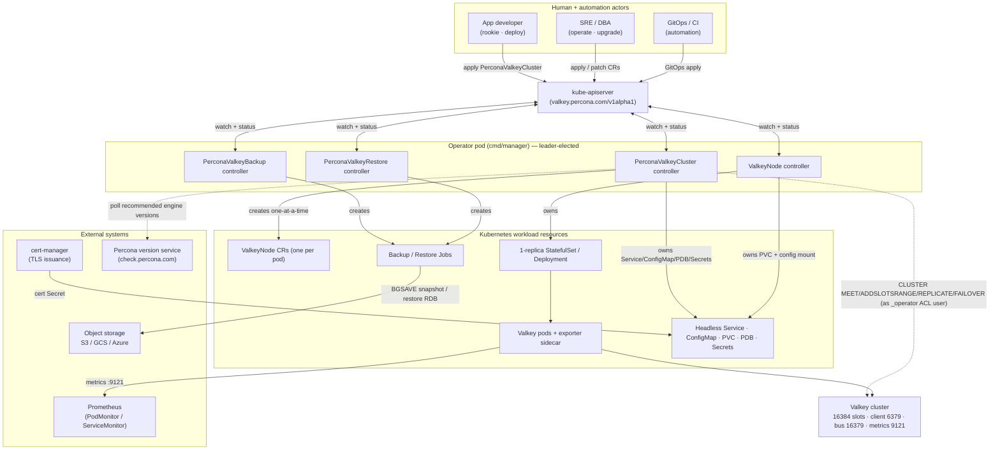
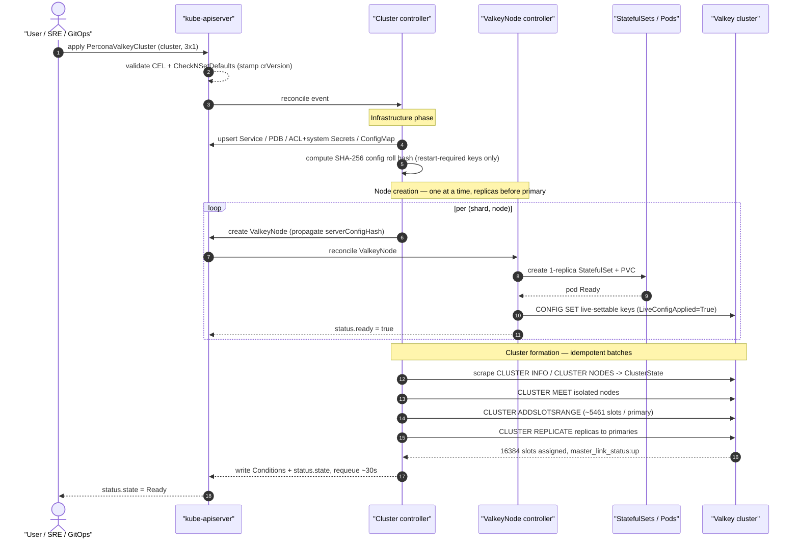
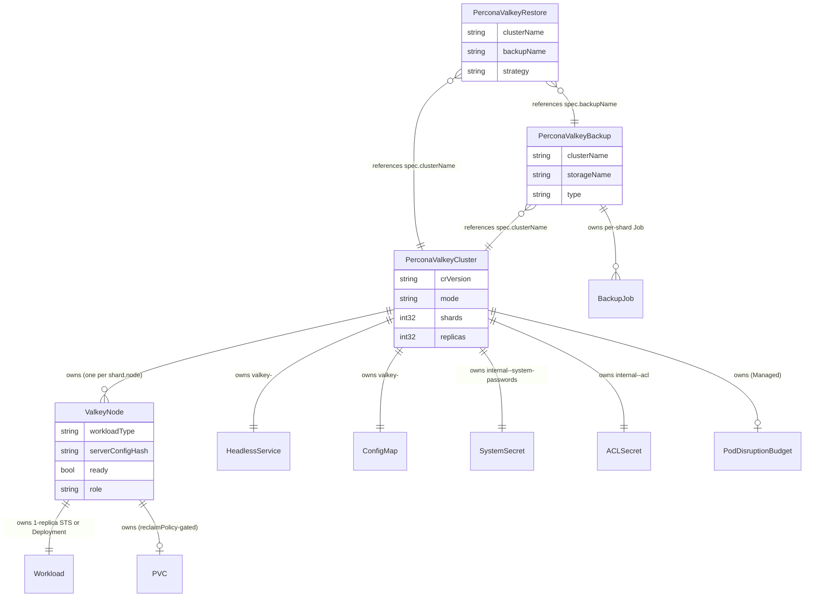

# Percona Operator for Valkey — Master Architecture

> **Executive summary.** The **Percona Operator for Valkey** (`percona-valkey-operator`) is a production-grade Kubernetes operator (Go 1.26, controller-runtime / Operator SDK) that declaratively runs, scales, secures, backs up, and upgrades [Valkey](https://valkey.io) clusters under API group **`valkey.percona.com/v1alpha1`**. It fuses two lineages: the upstream `valkey-operator`'s **two-CRD `cluster → node` topology model** (a user-facing `PerconaValkeyCluster` that incrementally drives one internal `ValkeyNode` per pod) and the **operational conventions of the Percona Operator-SDK trio** (PXC / PSMDB / PS) — `crVersion` discipline, version-service smart updates, a `Cluster`/`Backup`/`Restore` CRD trio, Helm + OLM distribution, and kuttl/envtest quality gates. This document is the navigable map of the architecture set: it gives the big picture, the load-bearing decisions, the topology modes, and the roadmap, then points into the twelve detailed subsystem documents for the field-level contracts and reconcile mechanics. **Read this first; everything else specialises it.**

---

## 1. Big picture

A single **operator pod** (the manager binary from `cmd/manager/`, leader-elected) hosts four controllers, one per custom resource. A user applies a single `PerconaValkeyCluster`; the operator decomposes it into one `ValkeyNode` per pod, materialises each as a 1-replica StatefulSet (durable) or Deployment (cache), forms the Valkey cluster over the engine protocol, and reflects health back through `metav1.Condition`s that derive `status.state`.

### 1.1 System-context diagram

See [Overview & Design Principles](docs/architecture/00-overview.md) §4 and [Control Plane & Reconciliation](docs/architecture/04-control-plane.md) §1 for the controller inventory.

### 1.2 Master sequence — apply a cluster, reach Ready

A user applies `mode: cluster`, `shards: 3`, `replicas: 1` (6 pods, 16384 slots). The cluster controller drives the topology across multiple idempotent reconcile passes (one effect per pass, then requeue).

The full ordered pipeline is in [Control Plane & Reconciliation](docs/architecture/04-control-plane.md) §2; the engine-side bootstrap (MEET → ADDSLOTSRANGE → REPLICATE) is in [Data Plane](docs/architecture/05-data-plane.md) §3.

### 1.3 CRD relationships

The operator defines exactly four CRDs — three user-facing (`PerconaValkeyCluster`, `PerconaValkeyBackup`, `PerconaValkeyRestore`) plus the internal `ValkeyNode`. Solid `||--o{` / `||--||` edges are **owns** (ownerReference, cascading GC); dashed-cardinality `}o--||` edges are **references by name** (independent lifecycle).

The authoritative field tables, CEL rules, defaults, and the parent↔node contract are in [API & CRD Design](docs/architecture/03-api-design.md).

---

## 2. Key architectural decisions

Twelve ADRs carry the design; all are `Accepted` (PITR is the single deferred sub-decision inside ADR-012). ADR-001 and ADR-002 are the bedrock; everything else builds on them. Full context, alternatives, and consequences are in [Architecture Decision Records](docs/architecture/01-decisions.md).

| ADR | Decision | One-line summary |
|-----|----------|------------------|
| [ADR-001](docs/architecture/01-decisions.md#adr-001--adopt-the-two-crd-clusternode-model-from-upstream) | Two-CRD `cluster → node` model | Adopt upstream's `PerconaValkeyCluster` → internal `ValkeyNode` (one per pod); the single abstraction serves all topology modes. |
| [ADR-002](docs/architecture/01-decisions.md#adr-002--operator-sdk--pkgapis--pkgcontroller-layout) | Operator-SDK `pkg/apis` + `pkg/controller` layout | Use the Percona trio skeleton (not plain kubebuilder `internal/`) so trio maintainers navigate it cold. |
| [ADR-003](docs/architecture/01-decisions.md#adr-003--api-group-valkeyperconacom-and-the-kindshort-name-set) | Group `valkey.percona.com` + kind/short-name set | `pvk` / `vkn` / `pvk-backup` / `pvk-restore` under a Percona group that coexists with upstream `valkey.io`. |
| [ADR-004](docs/architecture/01-decisions.md#adr-004--backup--restore-as-first-class-crs) | Backup & Restore as first-class CRs | Add the decoupled `PerconaValkeyBackup`/`PerconaValkeyRestore` trio upstream lacks; storage-by-name resolution. |
| [ADR-005](docs/architecture/01-decisions.md#adr-005--crversion-gating--version-service-driven-smart-updates) | `crVersion` gating + version-service smart updates | Two independent version axes; `cr.CompareVersion()` gates behaviour, `upgradeOptions` drives engine pins. |
| [ADR-006](docs/architecture/01-decisions.md#adr-006--workloadtype-statefulset-default-deployment-optional-pvc-retain-semantics) | StatefulSet default, Deployment optional; PVC Retain | 1-replica STS (durable, default) vs Deployment (cache); `workloadType` immutable; PVC expand-only, `Retain` default. |
| [ADR-007](docs/architecture/01-decisions.md#adr-007--operator-driven-failover-no-sentinel) | Operator-driven failover, no Sentinel | Graceful `CLUSTER FAILOVER` before rolling a primary; `TAKEOVER` only on quorum loss; live role from `CLUSTER NODES`. |
| [ADR-008](docs/architecture/01-decisions.md#adr-008--acl-users-as-secrets--internal-_operator-system-user) | ACL users as Secrets + `_operator` system user | Least-privilege `_operator`/`_exporter`/`_backup` system users; multi-password rotation; no hardcoded secrets. |
| [ADR-009](docs/architecture/01-decisions.md#adr-009--tls-via-cert-manager-or-secret-ref-cluster-bus-tls) | TLS via cert-manager or secret ref; cluster-bus TLS | Encrypt client + bus + replication; cert-manager (recommended) or secret ref; live reload where possible. |
| [ADR-010](docs/architecture/01-decisions.md#adr-010--distribution-via-helm--olm) | Distribution via Helm + OLM | `valkey-operator` + `valkey-db` charts, OLM bundle/catalog (channels stable/fast/candidate), `k8svalkey-docs`. |
| [ADR-011](docs/architecture/01-decisions.md#adr-011--kuttl-e2e-match-pspg--envtest-unit) | kuttl e2e + envtest unit | kuttl e2e (like PS/PG), Ginkgo/Gomega envtest units, `run-*.csv` matrix, 80%+ coverage, `check-generate` gate. |
| [ADR-012](docs/architecture/01-decisions.md#adr-012--pitr-deferred-beyond-v1alpha1-rdb-snapshot-backups-for-v1alpha1) | RDB snapshots now; PITR deferred | v1alpha1 ships per-shard RDB (`BGSAVE`) backups only; AOF-streaming PITR is honestly deferred, not faked. |

---

## 3. Document map

The architecture set is twelve subsystem documents under `docs/architecture/`. Read top to bottom for a full walkthrough, or jump by concern.

| # | Document | One-line description | Primary audience |
|---|----------|----------------------|------------------|
| 00 | [Overview & Design Principles](docs/architecture/00-overview.md) | Mission, personas, high-level architecture, the five design principles, document map | Everyone — start here |
| 01 | [Architecture Decision Records](docs/architecture/01-decisions.md) | The twelve load-bearing ADRs with context, alternatives, consequences, and dependency graph | Architects, contributors |
| 02 | [Repository Layout & Build System](docs/architecture/02-repo-layout.md) | Directory tree, Go module/package responsibilities, generated-vs-handwritten, Makefile vocabulary, sidecar binaries | Contributors (develop) |
| 03 | [API & CRD Design](docs/architecture/03-api-design.md) | Authoritative field tables for all four CRDs, CEL validation, defaults, parent↔node contract, samples | API consumers, contributors |
| 04 | [Control Plane & Reconciliation](docs/architecture/04-control-plane.md) | Ordered reconcile pipelines, watches/owns wiring, finalizers, conditions→state, leader election | Contributors, SRE |
| 05 | [Data Plane: Topology, Sharding, Replication & Failover](docs/architecture/05-data-plane.md) | Cluster internals, bootstrap, scale-out/in, rolling updates, failover, operator-to-node auth | SRE, DBA, contributors |
| 06 | [Backup & Restore](docs/architecture/06-backup-restore.md) | RDB snapshot model, storage backends, scheduling, retention/GC, restore flow, PITR deferral | DBA, SRE |
| 07 | [Security Architecture](docs/architecture/07-security.md) | Threat model, TLS in transit, ACL/users, operator-to-node auth, RBAC, NetworkPolicy, secrets, pod security | SRE, security reviewers |
| 08 | [Observability](docs/architecture/08-observability.md) | Exporter sidecar, PodMonitor/ServiceMonitor, conditions/events, logging, probes, dashboards, alerts, SLOs | SRE, DBA |
| 09 | [Upgrades & Version Management](docs/architecture/09-upgrades-versioning.md) | Two version axes, `crVersion` rule, version service, smart update, `v1alpha1→v1` conversion, downgrade policy | SRE, contributors |
| 10 | [Distribution & Release](docs/architecture/10-distribution-release.md) | Images/registry split, Helm charts, OLM bundle/catalog, docs site, CI/CD split, cross-repo version-bump ritual | Release engineers |
| 11 | [Testing & Quality Assurance](docs/architecture/11-testing-qa.md) | Test pyramid (envtest/kuttl/chaos/perf), CI gates, Kind repro harness, QA verification runbook | Contributors, QA |

---

## 4. Topology modes

`PerconaValkeyCluster.spec.mode` selects the engine topology, and the **same `ValkeyNode` abstraction serves all three** — one `ValkeyNode` is always exactly one pod (a 1-replica StatefulSet or Deployment). This is why the API needs no breaking changes to grow new modes: every mode is "some number of single-pod nodes plus a coordination policy." The **live role is always read from `CLUSTER NODES` / `INFO`**, never inferred from the `node-index` label.

| Mode | v1alpha1 status | Shape | Slots | Failover | `ValkeyNode` count |
|------|-----------------|-------|-------|----------|--------------------|
| **cluster** | ● Primary target | `shards` shard-groups, each 1 primary + `replicas` replicas | 16384 (CRC16) split across primaries | graceful `CLUSTER FAILOVER` (planned) / `FORCE` (primary lost, quorum intact) / `TAKEOVER` (quorum lost only) | `shards × (1 + replicas)` |
| **replication** | ◐ Secondary target | 1 primary + N replicas, **no Sentinel** | n/a (single keyspace) | operator promotes highest-offset synced replica via `REPLICAOF` | `1 + replicas` (single shard group) |
| **standalone** | ○ Future | 1 node | n/a | none | `1` |

`spec.workloadType` (immutable) chooses StatefulSet (default, durable, required for persistence) or Deployment (cache, no PVC). Details in [Overview](docs/architecture/00-overview.md) §5 and [Data Plane](docs/architecture/05-data-plane.md) §1.

---

## 5. Roadmap: alpha → beta → GA

The API is intentionally shaped so deferred items (PITR fields, the `standalone` mode value, additional storage backends) slot in **without breaking changes** — graduation adds capability, it does not reshape the contract.

| Stage | API | Theme | Scope highlights |
|-------|-----|-------|------------------|
| **v1alpha1 (alpha)** | `valkey.percona.com/v1alpha1` | Cluster mode + foundations | cluster mode (primary) + replication mode (secondary); two-CRD model; RDB backup/restore to S3/GCS/Azure; TLS + ACL + RBAC; version-service smart updates; Helm + OLM + docs; 80%+ coverage. **No PITR, no standalone, no multi-region.** |
| **beta** | `v1beta1` (conversion webhooks) | Harden & expand | standalone mode; richer observability (more metrics, default dashboards/alerts); cert hot-reload investigation; expanded e2e matrix; API stabilisation toward `v1`; performance tuning of rebalance/failover. |
| **GA** | `v1` | Production guarantees | **PITR (AOF streaming)** delivered; stronger upgrade-rollback guarantees; multi-tenancy patterns; documented SLAs; OperatorHub `stable` channel; full compatibility matrix; long-term support. |

The `v1alpha1 → v1` conversion mechanics (hub-and-spoke webhook, lossless round-trip, storage migration) are specified in [Upgrades & Version Management](docs/architecture/09-upgrades-versioning.md) §6.

---

## 6. Design principles (the through-line)

Five non-negotiable principles recur in every subsystem document — they are the lens for reviewing any change. Full statements in [Overview](docs/architecture/00-overview.md) §9.

1. **Idempotency & convergence.** Every reconcile re-fetches state, takes one safe step, and requeues — crash-safe and restartable, trading raw speed for safety.
2. **Separation of concerns (two CRDs, one controller each).** Cluster CR expresses intent; `ValkeyNode` expresses one pod's reality; backup/restore are independent lifecycles.
3. **Observability-first.** State is *derived from observation*, never assumed — live role from `CLUSTER NODES`, `status.state` a pure function of conditions.
4. **Least privilege.** Scoped RBAC (namespaced + `cw-bundle`), least-privilege `_operator`/`_exporter`/`_backup` ACL users, NetworkPolicy, no hardcoded secrets.
5. **Version discipline (two axes, never conflated).** `spec.crVersion` gates API/upgrade behaviour; engine image versions are a separate axis driven by the version service.

---

*Next: read [Overview & Design Principles](docs/architecture/00-overview.md) for the full grounding, or jump to [API & CRD Design](docs/architecture/03-api-design.md) for the field-level contract. The repository entry point is [README.md](README.md); cross-doc terms are defined in the [glossary](docs/architecture/glossary.md).*
