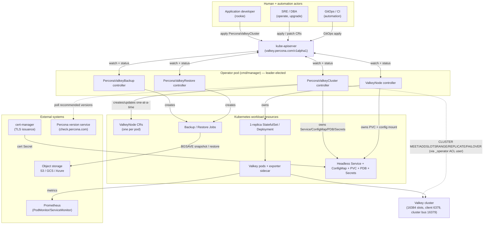
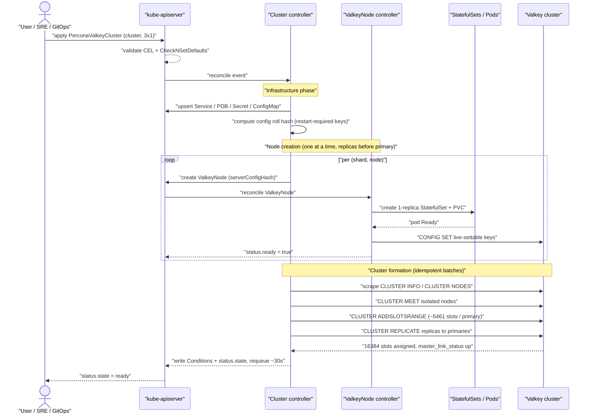
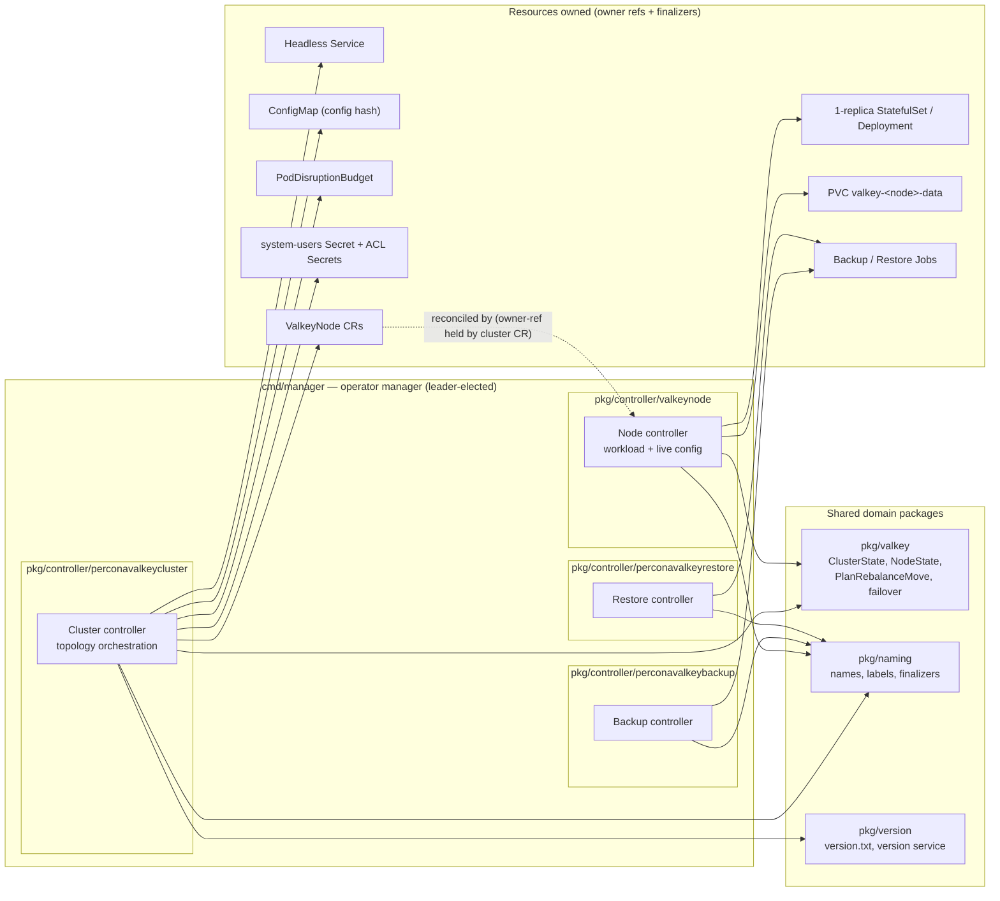

# Overview & Design Principles

> **Abstract.** The **Percona Operator for Valkey** (`percona-valkey-operator`) is a production-grade Kubernetes operator that runs, scales, secures, backs up, and upgrades [Valkey](https://valkey.io) clusters declaratively. It marries two proven lineages: the **two-CRD cluster→node topology model** adopted from the upstream `valkey-operator`, and the **operational conventions of the Percona Operator-SDK trio** (PXC / PSMDB / PS) — the same `crVersion` discipline, version-service smart updates, backup/restore CR trio, OLM and Helm distribution, and kuttl e2e harness. This document is the 10,000-foot view: what we build, who it serves, the four custom resources, the request flow, and the design principles every sibling document must honour. Read it first; everything else specialises it.

---

## 1. Mission & Scope

### What we build

The Percona Operator for Valkey is a controller-runtime / Operator SDK application (Go 1.26) under API group **`valkey.percona.com`**, version **`v1alpha1`** (graduating to `v1`). It manages the full lifecycle of Valkey deployments through four custom resources:

| Kind | Short name | Audience | Role |
|------|-----------|----------|------|
| **PerconaValkeyCluster** | `pvk` | user-facing | Top-level CR: topology, config, users, TLS, backup schedule, upgrade policy. The single object a user writes. |
| **ValkeyNode** | `vkn` | internal | Operator-created, one per pod. Wraps a single-replica StatefulSet (durable) **or** Deployment (cache). Owns the pod's PVC, ConfigMap mount, and live-config application. |
| **PerconaValkeyBackup** | `pvk-backup` | user-facing | On-demand or scheduled RDB snapshot to object storage. |
| **PerconaValkeyRestore** | `pvk-restore` | user-facing | Restore from a backup set into a new or in-place cluster. |

The operator drives a Valkey cluster from desired state to running reality: it forms the cluster (`CLUSTER MEET`), assigns the 16384 hash slots (`CLUSTER ADDSLOTSRANGE`), attaches replicas (`CLUSTER REPLICATE`), rebalances on scale (atomic slot migration via `CLUSTER MIGRATESLOTS`, Valkey 9.0+; legacy per-key `CLUSTER SETSLOT` + `MIGRATE` on older engines), performs proactive failover before rolling a primary (`CLUSTER FAILOVER`), reads live role from `CLUSTER NODES`/`INFO` (never from labels), and reflects health through `metav1.Condition`s that derive `status.state`.

### What we explicitly do not build

- **We do not run Valkey Sentinel.** Replication-mode failover is operator-driven (the operator promotes the highest-offset synced replica), consistent with the upstream model. Sentinel is out of scope.
- **We do not implement client-side proxying or a connection router.** Clients use the cluster protocol (MOVED/ASK redirection) or a headless Service for pod-direct access.
- **We do not fork the Valkey engine.** We ship `percona/percona-valkey` builds of upstream Valkey; engine behaviour is upstream behaviour.
- **We do not manage data outside Valkey's own persistence** (RDB/AOF on the pod's PVC) plus snapshots we ship to object storage.

See [API & CRD Design](03-api-design.md) for full field tables and [Reconciliation & Controllers](04-control-plane.md) for the control loops.

---

## 2. Goals and Non-Goals

### Goals (v1alpha1)

- **Cluster mode first.** Sharded Valkey (16384 slots, CRC16 hashing) is the primary topology target. The operator forms, heals, scales, and rebalances it end to end.
- **Replication mode second.** 1 primary + N replicas with **operator-driven failover, no Sentinel**, sharing the same `ValkeyNode` abstraction.
- **Two-CRD separation of concerns.** `PerconaValkeyCluster` (intent) owns and incrementally drives internal `ValkeyNode` CRs (one per pod) via owner references for automatic garbage collection.
- **Backup & restore as first-class CRs.** RDB snapshot per shard (`BGSAVE`) shipped to S3 / GCS / Azure by a backup Job/sidecar; scheduled via cron; retention and artifact GC via finalizers; restore is slot-coverage-aware.
- **Version discipline on two axes.** `spec.crVersion` gates CR API compatibility and upgrade behaviour; engine image versions move independently and are driven by `spec.upgradeOptions` against a Percona-style version service.
- **Zero-downtime rolling updates.** One pod at a time, replicas before primary, with proactive `CLUSTER FAILOVER` (with `TAKEOVER` fallback only on quorum loss) before any primary is rolled. A SHA-256 config hash stamped as a pod-template annotation triggers rolls only when restart-required keys change.
- **Security by default.** TLS in transit (client `tls-port` + cluster-bus TLS) via cert-manager or secret ref; ACL users as Secrets (`type: valkey.io/acl`) with internal `_operator` / `_exporter` system users; least-privilege RBAC in namespaced and cluster-wide (`cw-bundle`) variants; NetworkPolicy; no hardcoded secrets.
- **Observability first.** Prometheus exporter sidecar, PodMonitor/ServiceMonitor, `metav1.Condition`s + Kubernetes Events, structured logs, Grafana dashboards, and alert rules.
- **Production distribution.** Helm charts `valkey-operator` + `valkey-db`, an OLM bundle + catalog (channels `stable`/`fast`/`candidate`, OperatorHub), and a `k8svalkey-docs` MkDocs Material site.
- **Quality gates.** Unit + envtest (Ginkgo/Gomega), kuttl e2e (`run-*.csv` matrix), GitHub Actions for unit+lint on PRs, Jenkins for GKE e2e, 80 %+ coverage, and a `check-generate` CI gate.

### Non-Goals (v1alpha1 — deferred or out of scope)

- **Point-in-Time Recovery (PITR).** AOF/binlog-style streaming PITR is **explicitly deferred beyond v1alpha1.** v1alpha1 backup granularity is the RDB snapshot. We will not fake a PITR field that does nothing — the API is shaped so PITR can be added without a breaking change, but it is not implemented. See [Backup & Restore](06-backup-restore.md).
- **Standalone mode.** A single-node `standalone` topology is a *future* mode. The API (`spec.mode`) reserves the value so it can be added without breaking changes, but it is not delivered in v1alpha1.
- **Multi-region / cross-cluster replication.** No active-active or geo-replication across Kubernetes clusters in v1alpha1.
- **Valkey modules / Redis-Stack extensions.** No managed module loading (RediSearch, etc.) in v1alpha1; deferred pending a compatibility matrix.
- **In-place engine major downgrades.** Upgrades are forward-only and version-gated; downgrades require restore-from-backup.
- **Multi-tenancy isolation beyond namespace + RBAC.** Per-tenant quotas and label-based tenant gating are future work.
- **TLS certificate hot-swap without a pod roll.** Certificate rotation triggers a config-hash-driven rolling restart; live hot-reload of certs is not implemented (a known upstream limitation).

---

## 3. Personas and Capabilities

The operator serves four personas across the maturity curve. Each needs a distinct slice of capability.

### 3.1 Rookie — "deploy" (Application developer / first-time user)

Wants a working Valkey in minutes without understanding cluster internals. Needs: a one-line Helm install (`valkey-operator` + `valkey-db`), sane defaults (StatefulSet, persistence on, exporter on, TLS optional), a minimal `PerconaValkeyCluster` that just sets `shards`/`replicas`, and a clear `status.state` (`initializing → ready`) with a human-readable `status.reason`. **Capability anchor:** good defaults via `CheckNSetDefaults`, printcolumns (`State`, `Reason`, `ReadyShards`, `Age`), and quickstart docs.

### 3.2 Professional — "operate" (DBA / platform engineer)

Runs Valkey day-to-day for multiple teams. Needs: declarative scaling (change `shards`/`replicas`, operator rebalances slots one move per reconcile), ACL user management (`spec.users` → `valkey.io/acl` Secrets with multi-password rotation), TLS via cert-manager or secret ref, live-settable tuning (`maxmemory`, `maxmemory-policy`, `maxclients` applied via `CONFIG SET` without a roll), scheduled backups with retention, and restore. **Capability anchor:** the reconcile topology pipeline plus the backup/restore CR trio.

### 3.3 SRE — "upgrade & keep alive" (Reliability engineer)

Owns uptime, upgrades, and incident response. Needs: zero-downtime rolling updates (replicas-before-primary, proactive failover), smart engine upgrades via `spec.upgradeOptions {apply, schedule}` and the version service, `crVersion`-gated compatibility, PodDisruptionBudget management, NetworkPolicy, rich Conditions/Events/metrics, Grafana dashboards + alert rules, and documented break-glass recovery for quorum loss (manual `CLUSTER FAILOVER TAKEOVER` guidance). **Capability anchor:** [Upgrades & Version Management](09-upgrades-versioning.md), [Observability](08-observability.md), [Security](07-security.md).

### 3.4 Contributor — "develop" (Operator developer)

Extends the operator. Needs: the Percona-trio directory layout (`pkg/apis/valkey/v1alpha1/`, `pkg/controller/<resource>/`, `pkg/valkey/`, `pkg/naming/`, `pkg/version/`, `cmd/manager/` + sidecars), `make generate`/`make manifests` regeneration discipline, envtest + kuttl harnesses, the `check-generate` gate, and clear cross-referenced design docs. **Capability anchor:** [Project Layout & Tooling](02-repo-layout.md), [Testing Strategy](11-testing-qa.md).

### Capability matrix

| Capability | Rookie (deploy) | Professional (operate) | SRE (upgrade) | Contributor (develop) |
|---|:---:|:---:|:---:|:---:|
| One-line Helm / OLM install | ● Primary | ◐ | ◐ | ○ |
| Sensible defaults (`CheckNSetDefaults`) | ● Primary | ◐ | ○ | ◐ |
| Declarative scale (shards/replicas) | ◐ | ● Primary | ◐ | ○ |
| Slot rebalance / scale-in drain | ○ | ● Primary | ◐ | ◐ |
| ACL users + password rotation | ○ | ● Primary | ◐ | ○ |
| TLS (cert-manager / secret ref) | ◐ | ● Primary | ● Primary | ○ |
| Live config tuning (no roll) | ◐ | ● Primary | ◐ | ○ |
| Scheduled backup + retention | ○ | ● Primary | ● Primary | ◐ |
| Restore (new / in-place) | ○ | ● Primary | ● Primary | ◐ |
| Zero-downtime rolling update | ○ | ◐ | ● Primary | ◐ |
| Smart engine upgrade (version service) | ○ | ◐ | ● Primary | ◐ |
| `crVersion` compatibility gating | ○ | ◐ | ● Primary | ● Primary |
| Conditions / Events / metrics | ◐ | ◐ | ● Primary | ◐ |
| Grafana dashboards + alerts | ○ | ◐ | ● Primary | ○ |
| Break-glass recovery procedures | ○ | ◐ | ● Primary | ◐ |
| `make generate` / kuttl / envtest | ○ | ○ | ○ | ● Primary |

Legend: ● Primary need · ◐ Secondary need · ○ Not a direct concern.

---

## 4. High-Level Architecture

A single **operator pod** (the manager binary built from `cmd/manager/`) runs inside the cluster with leader election. It hosts one controller per custom resource, registered through `add_*.go` files. Each controller watches its CR and the Kubernetes/Valkey resources it owns, runs an idempotent reconcile loop, and writes status back.

**Resource ownership at a glance.** A `PerconaValkeyCluster` owns: the headless **Service** (`valkey-<cluster>`), the **ConfigMap** (`valkey-<cluster>`), the **PodDisruptionBudget**, the system-users **Secret** (`internal-<cluster>-system-passwords`), and one **ValkeyNode** per `(shardIndex, nodeIndex)`. Each **ValkeyNode** in turn owns a 1-replica **StatefulSet** (or **Deployment**), the pod's **PVC** (`valkey-<node>-data`), and its config mount. Owner references make teardown a cascade; finalizers add ordering (cluster teardown, backup-artifact cleanup) where GC alone is insufficient. See [Naming, Labels & Ownership](04-control-plane.md).

---

## 5. Topology Modes and the One ValkeyNode Abstraction

`PerconaValkeyCluster.spec.mode` selects the topology. The **same `ValkeyNode` abstraction serves all three modes** — one `ValkeyNode` is always exactly one pod (a 1-replica StatefulSet or Deployment) — which is precisely why the API does not need breaking changes to grow new modes.

| Mode | Status | Shape | Failover | Slots | `ValkeyNode` count |
|------|--------|-------|----------|-------|--------------------|
| **cluster** | ● v1alpha1 primary | `shards` shard-groups, each 1 primary + `replicas` replicas | graceful `CLUSTER FAILOVER` (planned) / `FORCE` (primary lost, quorum intact) / `TAKEOVER` (quorum lost only) | 16384 split across primaries | `shards × (1 + replicas)` |
| **replication** | ◐ v1alpha1 secondary | 1 primary + N replicas, **no Sentinel** | operator promotes highest-offset synced replica | n/a (no slots) | `1 + replicas` (single shard group) |
| **standalone** | ○ future | 1 node | none | n/a | `1` |

**Why one abstraction works.** Every mode is "some number of single-pod nodes plus a coordination policy." The cluster controller computes the desired set of `ValkeyNode`s from `mode`, `shards`, and `replicas`; names encode position as `<cluster>-<shardIndex>-<nodeIndex>`; `node-index 0` is the *initial* primary. Crucially, the **live role is always read from `CLUSTER NODES`/`INFO`**, never inferred from the name or labels — so a replica promoted by failover is correctly treated as primary even though its name still ends in a non-zero index. Replication mode is simply `shards: 1` with no slot assignment; standalone is `replicas: 0` with no cluster bus. This is the central design bet of the operator. See [Reconciliation & Controllers](04-control-plane.md).

**Workload selection.** `spec.workloadType` (immutable, enforced by CEL `self == oldSelf`) chooses StatefulSet (default, durable, required for `persistence`) or Deployment (cache, no PVC). The CRD enforces this with a validation rule (`persistence requires workloadType StatefulSet`); persistence is additionally immutable once set and may only be size-expanded — mirroring the upstream CEL guards. See [API & CRD Design](03-api-design.md).

---

## 6. Limits & Scalability

> **All figures below are *targets to be validated by load testing*, not measured guarantees.** They state the envelope the design is engineered for and the constraints that bound it; the beta phase replaces them with benchmarked numbers (see the roadmap in §11).

The operator inherits Valkey's own cluster ceilings and adds the cost of one `ValkeyNode` CR (plus its owned workload objects) per pod. The two together set the practical envelope.

### Tested / target cluster size

| Dimension | Target (to validate) | Bounded by |
|---|---|---|
| Shards per cluster | up to **64 shards** | Valkey cluster-bus gossip overhead; 16384 slots ÷ shards must stay ≥ 1 slot/shard |
| Replicas per shard | up to **5** | failover quorum math + replication fan-out from the primary |
| Pods per cluster | up to **~256 pods** (e.g. 64 shards × 1 primary + 3 replicas) | sum of `shards × (1 + replicas)`; one `ValkeyNode` CR per pod |
| Slots | fixed **16384** (CRC16) | Valkey protocol constant — independent of shard count |

Larger topologies are not blocked by the API, but anything beyond the targets above is unvalidated and should be load-tested before production use. The one-step-per-reconcile pacing (one `ValkeyNode` created, one slot-move per pass) means **formation and rebalance time grows with pod and shard count** — a deliberate trade of raw speed for safety and restartability (see Design Principle 1, §9).

### Per-pod throughput guidance

- **Plan capacity per primary, then shard.** A single Valkey primary on adequate CPU/network commonly sustains **O(10⁵) ops/sec** for simple GET/SET workloads; aggregate cluster throughput scales roughly linearly with shard count because slots (and therefore keyspace traffic) partition across primaries. Treat the per-primary figure as a planning starting point and validate against your command mix, value sizes, and pipelining.
- **Replicas add read capacity, not write capacity.** Writes always land on the slot's primary; replicas serve reads only when the client opts in (`READONLY`). Sizing for write-heavy workloads is a function of *shard count*, not replica count.
- **Memory is usually the limiter before CPU.** Size `maxmemory` (live-settable) with headroom for replication buffers, copy-on-write during `BGSAVE`, and fragmentation; an OOM-evicting primary degrades its whole shard.

### Quorum & availability requirements

- **Cluster availability needs a majority of primaries reachable.** Valkey marks the cluster down when reachable primaries owning slots fall below quorum; the operator therefore keeps shard count and PodDisruptionBudgets sized so a single node/zone loss never drops reachable primaries below a majority.
- **Graceful failover needs ≥ 1 synced replica.** The operator promotes the highest-offset *synced* replica (`HighestOffsetReplica()` / `GetSyncedReplicas()`); a shard with zero healthy replicas cannot fail over gracefully and risks data loss on primary failure. Run **at least one replica per shard** for any availability claim; two tolerate losing a replica during a primary incident.
- **`TAKEOVER` is the last resort.** Forced takeover (`CLUSTER FAILOVER TAKEOVER`) is used only when quorum is lost and no authorized election is possible — it can split-brain if misapplied, so it is gated and documented as break-glass (see [Security](07-security.md)).

### PVC / storage footprint

- **One RDB per shard, plus retention copies.** Each shard snapshots its keyspace via `BGSAVE`; a backup ships **one RDB per primary shard** to object storage. Total backup footprint ≈ `(sum of per-shard dataset sizes) × (retention count)` — budget object-storage capacity for the configured retention window, not just a single snapshot.
- **PVC sizing.** Each durable `ValkeyNode` owns one PVC (`valkey-<node>-data`) holding the live dataset plus the on-disk RDB/AOF; provision for peak dataset size plus the transient copy-on-write/RDB overhead during `BGSAVE`. PVCs are size-expand-only (immutable shrink), so size for growth up front.

### etcd / CR-count caveat

Every pod is backed by a `ValkeyNode` CR, and large fleets multiply CR count across all four kinds plus their owned objects. **As total custom-resource count approaches ~1000, etcd write latency and apiserver list/watch cost become a real constraint** — list-heavy reconciles slow down and apiserver memory grows. Watch aggregate CR count across all clusters in a namespace/cluster; very large deployments may need multiple operator instances or namespace sharding. This ceiling is a property of Kubernetes/etcd, not Valkey, and must be validated by load testing for the target fleet size.

---

## 7. End-to-End Request Flow

What happens when a user runs `kubectl apply -f pvk.yaml` for a `mode: cluster`, `shards: 3`, `replicas: 1` cluster:

1. **Admission & defaulting.** `kube-apiserver` validates the `PerconaValkeyCluster` against the CRD schema (CEL rules: workloadType/persistence constraints, etc.). On first reconcile, `CheckNSetDefaults` stamps `spec.crVersion` (operator `major.minor`) if empty, fills probe timeouts, resource defaults, secret names, and default images. (Mirrors Percona's `CheckNSetDefaults` pattern.)
2. **Infrastructure phase.** The cluster controller upserts the **headless Service** (`valkey-<cluster>`), the **PodDisruptionBudget**, the **system-users Secret** (`internal-<cluster>-system-passwords`, creating `_operator` and `_exporter` ACL users), and renders the **ConfigMap** (`valkey-<cluster>`) — user config first, operator-managed base config last so the base always wins. It computes a SHA-256 **config roll hash** over restart-required keys only (excluding live-settable keys to avoid spurious rolls).
3. **Node creation phase.** The controller creates the required **ValkeyNode** CRs **one at a time, in shard order, replicas before primary**, propagating the config hash via `spec.serverConfigHash`. Each `ValkeyNode` is named `<cluster>-<shard>-<node>` (e.g. `mycache-0-0`); the workload resources it owns are `valkey-`-prefixed (e.g. StatefulSet/Service `valkey-mycache-0-0`, PVC `valkey-mycache-0-0-data`).
4. **Node materialisation.** The `ValkeyNode` controller creates a 1-replica StatefulSet, its PVC (`valkey-<node>-data`, finalizer-guarded per reclaim policy), and config mount; stamps `serverConfigHash` as a pod-template annotation; and reports `status.ready=false` until the pod is Ready and config applied. Live-settable keys are applied via `CONFIG SET` (`LiveConfigApplied` condition).
5. **Cluster formation phase.** Once nodes are Ready, the cluster controller scrapes `CLUSTER INFO`/`CLUSTER NODES` into a `ClusterState`, then runs idempotent batch operations: `CLUSTER MEET` isolated nodes → `CLUSTER ADDSLOTSRANGE` to pending primaries (3 shards → ~5461 slots each) → `CLUSTER REPLICATE` pending replicas to their primaries by node ID.
6. **Convergence & verification.** The controller verifies shard count, replica count, all 16384 slots assigned, and `master_link_status:up` per replica. If a primary is lost while a majority of primaries is still reachable it promotes a synced replica with `CLUSTER FAILOVER FORCE` (which still earns a proper config epoch via cluster authorization); it falls back to `CLUSTER FAILOVER TAKEOVER` only when quorum is lost and no authorized election is possible. Stale nodes are forgotten with `CLUSTER FORGET`.
7. **Status & requeue.** Conditions (`Ready`, `ClusterFormed`, `SlotsAssigned`, `Progressing`, `Degraded`) are written; `status.state` is derived from those conditions by descending severity — `error` (terminal/unrecoverable) → `degraded` (serving but unhealthy) → `initializing` (still converging toward desired state) → `ready` (all conditions satisfied); `readyShards` updates. The controller requeues (~30 s steady-state, shorter while progressing) for the next idempotent pass. Events (`ServiceCreated`, `ValkeyNodeCreated`, `ClusterMeetBatch`, `PrimariesCreated`, `ReplicasAttached`, `SlotsRebalancing`, `FailoverInitiated`, …) narrate each step.

The same flow as an interaction trace (`shards: 3`, `replicas: 1` → 6 pods, 16384 slots):

Subsequent changes (scale, config, version, backup) flow through the same loop: re-fetch, diff, take one safe step, requeue. See [Reconciliation & Controllers](04-control-plane.md) for the full ordered pipeline.

---

## 8. Relationship to Prior Art

### Adopted from the upstream `valkey-operator`

We **adopt the two-CRD `Cluster → Node` topology contract wholesale** and port its proven internals:

- **Two-CRD separation**: public cluster CR drives internal per-pod node CRs, written incrementally one-per-reconcile, with the cluster reading node `status.ready`/role and propagating `configHash`. We rename to the Percona-prefixed kinds (`PerconaValkeyCluster`, `ValkeyNode`, plus the backup/restore pair) under `valkey.percona.com` to avoid collision with the upstream `valkey.io` group.
- **The cluster reconcile pipeline** (service → PDB → users/ACL → configmap → nodes → state scrape → promote-orphans → forget-stale → meet → add-slots → replicate → scale-in → rebalance → verify → ready), the `ClusterState`/`NodeState`/`ShardState` model, `PlanRebalanceMove` (one deterministic move per reconcile), and `PlanDrainMove` for scale-in.
- **Config strategy**: base config override-proof, live-settable allowlist (`maxmemory`, `maxmemory-policy`, `maxclients`) applied via `CONFIG SET`, everything else gated by the roll hash.
- **ACL system users** `_operator` (cluster orchestration commands) and `_exporter` (metrics), and the `valkey.io/acl` Secret format.
- **Valkey client conventions**: `valkey-go` with `ForceSingleClient=true` for per-node queries; proactive `CLUSTER FAILOVER` before rolling a primary; `HighestOffsetReplica()`/`GetSyncedReplicas()` for safe promotion.

### Conventions mirrored from the Percona Operator-SDK trio (PXC / PSMDB / PS)

We layer the **production operator discipline** the upstream lacks (per the gap analysis):

- **The CR trio**: add `PerconaValkeyBackup` and `PerconaValkeyRestore` alongside the cluster CR — backup spec carries `clusterName` + `storageName` (storage details resolved from the cluster's `spec.backup.storages[]`); terminal `status.state` (`Succeeded`/`Failed`/`Error`); destination prefixes (`s3://`, `gs://`, `azure://`, `pvc/`).
- **Two version axes**: operator version in `pkg/version/version.txt`; `spec.crVersion` auto-stamped and used via `CompareVersion()` to gate behaviour; `spec.upgradeOptions {apply: Disabled|Recommended|Latest|<version>, schedule}` driving smart updates against a version service.
- **Centralised naming** in `pkg/naming/`, `CheckNSetDefaults` invoked every reconcile, ordered finalizers (`percona.com/...`), CEL validation in lieu of webhooks for core logic, and Job-based backups with a sidecar status API.
- **Distribution**: Helm `valkey-operator` + `valkey-db` (`appVersion` = operator version, `version` = chart semver, `crds/` synced from `deploy/`); OLM bundle/catalog via operator-sdk/opm; MkDocs `k8svalkey-docs`.
- **Smart update**: pod-by-pod (not `OnDelete`), replicas before primary, gated on backup-not-running.

See [Distribution & Release](10-distribution-release.md) and [Upgrades & Version Management](09-upgrades-versioning.md).

---

## 9. Design Principles

These five principles are non-negotiable and recur in every sibling document.

1. **Idempotency & convergence.** Every reconcile re-fetches current state, computes one safe step toward desired state, and requeues. Synchronous orchestration commands (`CLUSTER MEET`/`ADDSLOTSRANGE`/`REPLICATE`/`FORGET`) are idempotent or wrapped to be safe to repeat. Atomic slot migration (`CLUSTER MIGRATESLOTS`, Valkey 9.0+) is *asynchronous*, so it is not re-issued blindly: the controller checks `CLUSTER GETSLOTMIGRATIONS` for an in-flight migration of the same range before starting a new one, and treats an already-migrated slot as a no-op. Re-fetch before every `Update`/`Patch` to avoid stale `resourceVersion`. *Trade-off:* progress is paced (one node created, one slot-move per reconcile), trading raw speed for safety and restartability — the right call for a stateful datastore.

2. **Separation of concerns (two CRDs, one controller each).** The public `PerconaValkeyCluster` expresses *intent*; the internal `ValkeyNode` expresses *one pod's reality*. Cluster topology logic never touches StatefulSets directly; node-level workload logic never issues cluster commands. Backup/restore are independent controllers with their own lifecycles. *Trade-off:* an extra CRD and a propagation hop (configHash, status.ready) versus the upstream's simpler-but-coupled alternative of one controller doing everything — we accept the hop for testability and clear ownership boundaries.

3. **Observability-first.** State is *derived from observation*, never assumed: live role from `CLUSTER NODES`/`INFO`, readiness from pod status, `master_link_status` from `INFO replication`. Every meaningful transition emits a `metav1.Condition` and a Kubernetes Event; metrics expose config skew, failover counts, rebalance throughput, and ACL failures. `status.state` is a pure function of conditions. If the operator cannot observe it, it does not act on it.

4. **Least privilege.** RBAC ships in namespaced and cluster-wide (`cw-bundle`) variants scoped to exactly the verbs and resources each controller touches. The `_operator` ACL user holds only the cluster/config/info commands it needs (e.g. `+@admin`/`+@slow` is *not* granted wholesale — the grant is scoped to `CLUSTER`, `CONFIG`, `INFO`, and the orchestration verbs); the `_exporter` user is restricted to the read-only `INFO`/`CLUSTER`/`LATENCY` commands the metrics exporter requires. No hardcoded secrets — passwords live in Secrets, TLS material in cert-manager-issued or referenced Secrets, with multi-password rotation. NetworkPolicy restricts cluster-bus and client traffic.

5. **Version discipline (two axes, never conflated).** `spec.crVersion` (operator `major.minor`) gates CR API compatibility and upgrade behaviour and **must equal** the value the operator stamps; engine image versions are a wholly separate axis driven by `spec.upgradeOptions` and the version service. The eight cross-repo version-pinning locations (operator `version.txt`, `crVersion`, chart `appVersion`/`version`, `release_versions`, chart `values.yaml`, docs `variables.yml`, docs `versions.md`) are hand-synced with no automation — the `#1 release footgun` — so the release process is documented exhaustively and guarded by a `check-generate` CI gate. See [Distribution & Release](10-distribution-release.md).

---

## 10. Component Overview

The four controllers are thin orchestrators; the *logic* lives in shared domain packages (`pkg/valkey`, `pkg/naming`, `pkg/version`) plus sidecar binaries that run inside DB pods, not the operator: `cmd/valkey-backup/` (snapshot/upload), `cmd/healthcheck/` (liveness/readiness probes), `cmd/peer-list/` (peer discovery). See [Project Layout & Tooling](02-repo-layout.md).

---

## 11. Document Map and Roadmap

### Architecture document map

| # | Document | Covers |
|---|----------|--------|
| 00 | **Overview & Design Principles** (this doc) | Mission, personas, high-level architecture, principles, document map |
| 01 | [Goals & Requirements](00-overview.md) | Functional/non-functional requirements, success criteria, constraints |
| 02 | [Project Layout & Tooling](02-repo-layout.md) | Directory structure, Makefile targets, `make generate`/`manifests`, sidecar binaries |
| 03 | [API & CRD Design](03-api-design.md) | Full field tables for all four CRDs, CEL validation, defaults, `crVersion` |
| 04 | [Reconciliation & Controllers](04-control-plane.md) | Ordered reconcile pipelines, topology lifecycle, `ClusterState`, failover, rebalance |
| 05 | [Upgrades & Version Management](09-upgrades-versioning.md) | Two version axes, smart updates, version service, rolling-update orchestration |
| 06 | [Backup & Restore](06-backup-restore.md) | RDB snapshot model, storage backends, scheduling, retention, restore, PITR deferral |
| 07 | [Security](07-security.md) | TLS in transit, ACL users + rotation, RBAC, NetworkPolicy, secret management |
| 08 | [Observability](08-observability.md) | Exporter, PodMonitor/ServiceMonitor, Conditions, Events, dashboards, alerts |
| 09 | [Testing Strategy](11-testing-qa.md) | Unit + envtest (Ginkgo/Gomega), kuttl e2e, `run-*.csv`, coverage, CI gates |
| 10 | [Naming, Labels & Ownership](04-control-plane.md) | Naming scheme, label sets, owner references, finalizers, GC ordering |
| 11 | [Distribution & Release](10-distribution-release.md) | Helm charts, OLM bundle/catalog, docs site, cross-repo version sync |

### Roadmap: alpha → beta → GA

| Stage | API | Theme | Scope highlights |
|-------|-----|-------|------------------|
| **v1alpha1 (alpha)** | `valkey.percona.com/v1alpha1` | Cluster mode + foundations | cluster mode (primary) + replication mode (secondary); two-CRD model; RDB backup/restore to S3/GCS/Azure; TLS + ACL + RBAC; version service smart updates; Helm + OLM + docs; 80 % coverage. **No PITR, no standalone, no multi-region.** |
| **beta** | `v1beta1` (conversion webhooks) | Harden & expand | standalone mode; richer observability (more metrics, default dashboards/alerts); cert hot-reload investigation; expanded e2e matrix; API stabilisation toward `v1`; performance tuning of rebalance/failover. |
| **GA** | `v1` | Production guarantees | **PITR (AOF streaming)** delivered; stronger upgrade-rollback guarantees; multi-tenancy patterns; documented SLAs; OperatorHub `stable` channel; full compatibility matrix; long-term support commitments. |

The API is intentionally shaped so the deferred items (PITR fields, `standalone` mode value, additional storage backends) slot in **without breaking changes** — the `v1alpha1 → v1` graduation adds capability, it does not reshape the contract.

---

*Next: read [Goals & Requirements](00-overview.md) for the detailed requirement set, or jump straight to [API & CRD Design](03-api-design.md) for the field-level contract.*
