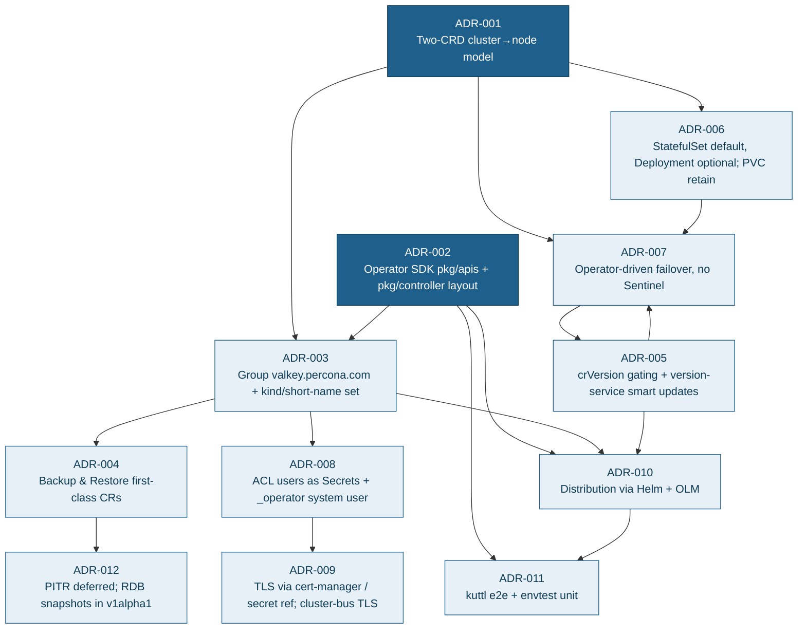
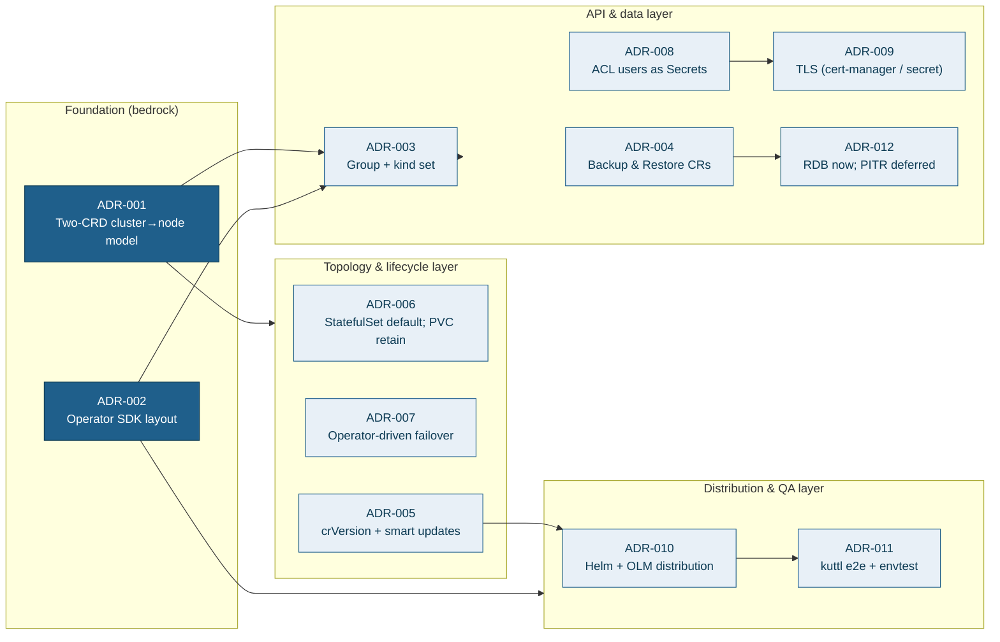
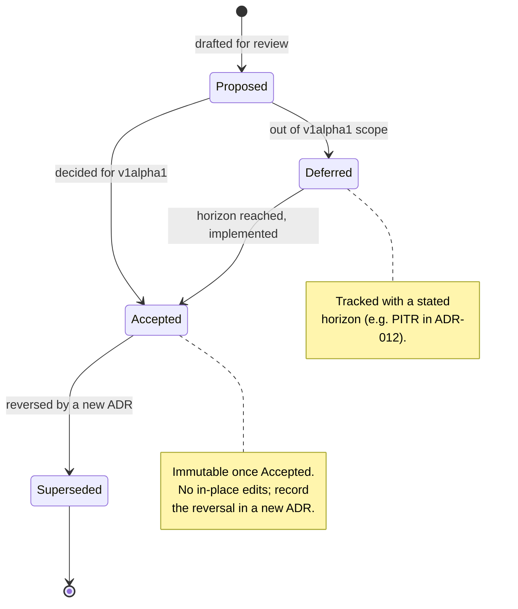

# Architecture Decision Records (ADRs) — Percona Operator for Valkey

This document captures the load-bearing architectural decisions for the **Percona Operator for Valkey** (`percona-valkey-operator`). Each ADR states its context, the decision (recommendation first), the alternatives weighed, and the concrete consequences — both the benefits we buy and the costs we accept. The decisions deliberately fuse two lineages: the upstream `valkey-operator`'s two-CRD `ValkeyCluster → ValkeyNode` topology model, and the Percona Operator-SDK trio (PXC / PSMDB / PS) conventions for layout, versioning, backups, distribution, and testing. The API group is `valkey.percona.com`, the served version is `v1alpha1` (graduating to `v1`), and the foundational kinds are `PerconaValkeyCluster`, `ValkeyNode`, `PerconaValkeyBackup`, and `PerconaValkeyRestore`. Downstream design documents (API design, controller design, backup/restore, security, distribution) elaborate the mechanics; this document explains *why*.

---

## ADR Format / Template Note

Every ADR below uses a fixed shape so reviewers can scan them uniformly:

- **Status** — one of `Accepted` (decided for v1alpha1), `Proposed` (intended, not yet locked), or `Deferred` (explicitly out of scope for v1alpha1 with a stated horizon).
- **Context** — the forces, constraints, and grounded facts that make a decision necessary.
- **Decision** — the chosen path, stated as a recommendation **first** where the choice is open; never vague.
- **Alternatives considered** — the realistic options rejected, each with the reason for rejection.
- **Consequences** — what we gain, what we pay, and which downstream ADRs/docs the decision constrains.

ADRs are immutable once `Accepted`: a reversal is a *new* ADR that supersedes the old one (recorded in the summary table's `Supersedes/Superseded-by` column). The numbering is stable and referenced across the codebase (e.g. controller comments cite `ADR-007` when issuing `CLUSTER FAILOVER TAKEOVER`). Decisions that branch behaviour by API version are gated through `spec.crVersion` and `cr.CompareVersion("x.y.z")` (see [ADR-005](#adr-005--crversion-gating--version-service-driven-smart-updates)), mirroring the Percona `crVersion` discipline.

---

## ADR-001 — Adopt the two-CRD cluster→node model from upstream

**Status:** Accepted

### Context

Valkey in **cluster** mode is a sharded, gossip-coordinated system: 16384 hash slots (0–16383), CRC16 keyspace hashing, a client port (6379) and a cluster-bus port (16379 = client + 10000), and live topology that is authoritative only when read from `CLUSTER NODES` / `CLUSTER INFO`. A single primary's live role can change at any moment via failover, so any model that pins "primary-ness" into a Kubernetes label or a StatefulSet ordinal is structurally wrong.

The Percona SDK trio (PXC / PSMDB / PS) historically models a database cluster as *one cluster CR* that directly composes several typed StatefulSets per *component* (e.g. PXC nodes + HAProxy + ProxySQL; PSMDB replsets + mongos + config servers). That "monolithic StatefulSet-per-component" shape fits MySQL/MongoDB topologies, where a StatefulSet's ordered, stable-identity pods map cleanly onto replica-set membership.

The upstream `valkey-operator` instead uses a **two-CRD contract**: a user-facing `ValkeyCluster` whose spec (image, shards, replicas, config, users, persistence, tls, exporter) drives the creation of `1..(shards × replicas)` *internal* `ValkeyNode` CRs, each named `<cluster>-<shardIdx>-<nodeIdx>`, each wrapping a single-replica StatefulSet (or Deployment). The cluster controller writes `ValkeyNode` spec incrementally — one node per reconcile, replicas-before-primary — and reads back `status.ready/role/podIP`; the node controller owns the workload, PVC, ConfigMap, and reports readiness. (See upstream `api/v1alpha1/valkeycluster_types.go:61-146`, `valkeynode_types.go:36-154`, and the cluster reconcile pipeline in `internal/controller/valkeycluster_controller.go:79-380`.)

### Decision

**Adopt the upstream two-CRD `cluster → node` model**, rebranded to the charter names: the public top-level CR is **`PerconaValkeyCluster`** (short `pvk`) and the internal, operator-created, one-per-pod CR is **`ValkeyNode`** (short `vkn`). `PerconaValkeyCluster` owns the topology and *everything* the user configures; it creates exactly one `ValkeyNode` per `(shardIndex, nodeIndex)`, named `<cluster>-<shard>-<node>`, with `node-index 0` as the initial primary. `ValkeyNode` maps 1:1 to a pod and is an implementation detail — never edited by users.

This single abstraction is reused across all three topology modes (`cluster`, `replication`, `standalone`): a `ValkeyNode` is "one Valkey server process in a pod" regardless of whether the mode shards slots, runs primary+replicas, or runs a single server. That reuse is *why* the model is foundational.

### Alternatives considered

- **Percona monolithic StatefulSet-per-component (one multi-replica StatefulSet per shard).** Rejected. A multi-replica StatefulSet forces a fixed ordinal identity, but Valkey's live primary is discovered from `CLUSTER NODES`, not from ordinal 0. Rolling a multi-replica StatefulSet gives Kubernetes control of pod order, defeating the *replicas-before-primary, proactive-graceful-`CLUSTER FAILOVER`-before-primary* ordering the engine requires (see [ADR-007](#adr-007--operator-driven-failover-no-sentinel)). Per-pod PVC reclaim semantics and per-pod config-hash rolls also become coarse-grained.
- **One controller, no internal CR (cluster controller directly manages every StatefulSet/Deployment/PVC/ConfigMap).** Rejected. This collapses two concerns — *topology orchestration* (meet/slots/replicate/rebalance) and *per-pod workload lifecycle* (PVC expansion, config-hash roll, live `CONFIG SET`) — into one reconcile, producing a large, hard-to-test controller and losing owner-reference GC granularity.
- **CRD-per-shard.** Rejected. Shards are not independently addressable Kubernetes objects in any useful way; a shard is a *set* of nodes (one primary + N replicas) and is better expressed as a label dimension (`valkey.percona.com/shard-index`) than a CR.

### Consequences

- **Gained:** clean separation of concerns (topology vs workload); per-node owner references give automatic GC; the same `ValkeyNode` abstraction serves all topology modes without breaking changes; deterministic names encode position for label-based scheduling and shard-aware spread constraints.
- **Paid:** we diverge from the Percona trio's component-StatefulSet shape, so naming/finalizer helpers must be authored fresh in `pkg/naming` rather than copied verbatim; two controllers mean two reconcile loops and a `cluster → node` status-propagation contract that must tolerate status lag (a known upstream pitfall: the cluster stalls if `ValkeyNode.status.ready` lags pod-ready events — mitigated with bounded requeue intervals).
- **Constrains:** [ADR-002](#adr-002--operator-sdk--pkgapis--pkgcontroller-layout) (one controller package per CR), [ADR-003](#adr-003--api-group-valkeyperconacom-and-the-kindshort-name-set) (the kind set), [ADR-006](#adr-006--workloadtype-statefulset-default-deployment-optional-pvc-retain-semantics) (workload-per-node), and [ADR-007](#adr-007--operator-driven-failover-no-sentinel) (failover ordering). Elaborated in [Controller Design](04-control-plane.md) and [API & CRD Design](03-api-design.md).

---

## ADR-002 — Operator SDK + `pkg/apis` / `pkg/controller` layout

**Status:** Accepted

### Context

The upstream `valkey-operator` uses the plain kubebuilder layout (`api/v1alpha1/`, `internal/controller/`). The Percona SDK trio (PXC / PSMDB / PS) uses the older Operator-SDK layout: `pkg/apis/<group>/<version>/*_types.go` for API types, `pkg/controller/<resource>/` for one controller package per CR with `add_*.go` registering each controller with the manager, `pkg/<domain>/` for domain logic, `pkg/naming` for naming, `pkg/version` for versioning, and `cmd/manager/` for the operator entrypoint plus `cmd/<helper>/` for sidecar binaries baked into the DB image. Generated code (deepcopy, CRDs, RBAC, mocks) comes from `controller-gen` / `mockgen`; `deploy/` holds generated install manifests. The charter mandates Percona conventions, the Go 1.26 toolchain, and that engineers fluent in the trio can navigate this repo without re-learning a layout.

### Decision

**Use the Operator SDK + controller-runtime layout matching the Percona SDK trio, not plain kubebuilder `internal/`.** Concretely:

| Path | Purpose |
|------|---------|
| `pkg/apis/valkey/v1alpha1/` | `*_types.go`, `*_defaults.go`, `zz_generated.deepcopy.go` (group `valkey.percona.com`) |
| `pkg/controller/perconavalkeycluster/` | `PerconaValkeyCluster` controller (+ `add_perconavalkeycluster.go`) |
| `pkg/controller/valkeynode/` | `ValkeyNode` controller (+ `add_valkeynode.go`) |
| `pkg/controller/perconavalkeybackup/` | `PerconaValkeyBackup` controller |
| `pkg/controller/perconavalkeyrestore/` | `PerconaValkeyRestore` controller |
| `pkg/valkey/` | engine domain logic (cluster state, slot planning, failover, config render) |
| `pkg/naming/` | centralized resource names, label/annotation/finalizer constants |
| `pkg/version/` | `version.txt`, `crVersion` handling, version-service client |
| `cmd/manager/` | operator entrypoint |
| `cmd/valkey-backup/`, `cmd/healthcheck/`, `cmd/peer-list/` | sidecar binaries shipped in DB/backup images |
| `deploy/` | generated `crd.yaml`, `bundle.yaml`, `cw-bundle.yaml` |
| `deploy/olm/` (`bundle/`) | OLM CSV + bundle metadata (see [ADR-010](#adr-010--distribution-via-helm--olm)) |

Controller-gen markers drive generation; `make generate` (deepcopy/CRD/RBAC/mocks) and `make manifests` (deploy manifests) are mandatory after `*_types.go` edits, enforced by a `check-generate` CI gate (see [ADR-011](#adr-011--kuttl-e2e-match-pspg--envtest-unit)).

### Alternatives considered

- **Plain kubebuilder `internal/controller` + `api/` (upstream's layout).** Rejected for the product, *kept as a porting reference*. It is perfectly idiomatic, but it does not match the Percona trio; an engineer moving from PXC/PSMDB/PS would have to relearn package boundaries, and shared muscle memory (`pkg/naming`, `pkg/version`, `cmd/<helper>`) would be lost. We will *port* upstream logic from `internal/...` into `pkg/...`.
- **Hybrid (`api/` from kubebuilder, `pkg/controller` from Percona).** Rejected. Half-and-half maximizes confusion and breaks the trio's `pkg/apis/<group>/<version>` import path convention used by generated clients and the version-gating helpers.

### Consequences

- **Gained:** drop-in familiarity for Percona maintainers; reuse of trio idioms (`CheckNSetDefaults` receiver on the CR, `pkg/naming` centralization, sidecar `cmd/` binaries, the `deploy/` + OLM split); generated-client import paths that mirror the trio.
- **Paid:** porting cost from upstream's `internal/controller` and `internal/` domain package into `pkg/controller` and `pkg/valkey` (the protocol/domain layer is locked to `pkg/valkey`, Percona-idiomatic `pkg/<domain>`; the charter-echo `internal/valkey` is rejected); we own keeping the SDK scaffolding current against Go 1.26 and newer controller-runtime.
- **Constrains:** every later ADR's file placement; the distribution flow ([ADR-010](#adr-010--distribution-via-helm--olm)) and the test layout ([ADR-011](#adr-011--kuttl-e2e-match-pspg--envtest-unit)). Elaborated in [Repository Layout & Build](02-repo-layout.md).

---

## ADR-003 — API group `valkey.percona.com` and the kind / short-name set

**Status:** Accepted

### Context

The upstream operator publishes `ValkeyCluster` / `ValkeyNode` under its own group. Percona must (a) avoid CRD kind/group collisions with the upstream Valkey operator so both can coexist in a cluster, and (b) follow the Percona convention of a `Percona*` prefix on user-facing kinds (`PerconaXtraDBCluster`, `PerconaServerMongoDB`, `PerconaServerMySQL`) under a vendor group. The trio also ships exactly three user-facing kinds (Cluster, Backup, Restore) per product.

### Decision

**Use API group `valkey.percona.com`, version `v1alpha1` (graduating to `v1`), with this exact kind / short-name set:**

| Kind | Short name | Scope | Audience | Role |
|------|-----------|-------|----------|------|
| `PerconaValkeyCluster` | `pvk` | Namespaced | User-facing | Top-level CR: topology, config, users, tls, persistence, exporter, backup schedule, upgradeOptions |
| `ValkeyNode` | `vkn` | Namespaced | **Internal** (operator-created) | One per pod; wraps a 1-replica StatefulSet or Deployment |
| `PerconaValkeyBackup` | `pvk-backup` | Namespaced | User-facing | On-demand / scheduled backup |
| `PerconaValkeyRestore` | `pvk-restore` | Namespaced | User-facing | Restore from a backup set |

The internal kind keeps the bare `ValkeyNode` name (matching the upstream internal abstraction the charter adopts) but lives under the `valkey.percona.com` group, so it does **not** collide with the upstream operator's `ValkeyNode` (different group = different fully-qualified resource). Print columns follow the upstream/trio pattern: `PerconaValkeyCluster` exposes `State`, `Reason`, `ReadyShards`, `Age`; `ValkeyNode` exposes `Ready`, `Role`, `Shard`, `Node`, `Age`. Labels are dual-namespaced: the standard `app.kubernetes.io/{name,instance,component,managed-by}` **plus** `valkey.percona.com/{cluster,shard-index,node-index,component}`. Child resources created by a `ValkeyNode` are prefixed `valkey-` (e.g. `valkey-<cluster>-0-0`); PVCs are `valkey-<node>-data`.

### Alternatives considered

- **Keep upstream group/kinds verbatim (`ValkeyCluster` under upstream group).** Rejected: collides with the upstream operator and violates the Percona `Percona*` user-facing naming convention.
- **`PerconaValkeyNode` for the internal CR.** Rejected: the charter locks `ValkeyNode`; the group qualifier already prevents collision, and keeping the upstream internal name eases porting.
- **Group `pvk.percona.com` or `valkeydb.percona.com`.** Rejected: `valkey.percona.com` is the clearest, matches the charter, and aligns with how docs macros reference annotations (`valkey.percona.com/<release>`).

### Consequences

- **Gained:** coexistence with upstream; consistent Percona branding; the trio's Cluster/Backup/Restore symmetry plus the internal `ValkeyNode`.
- **Paid:** the asymmetry (three `Percona*`-prefixed kinds + one bare `ValkeyNode`) must be documented so users do not try to create `ValkeyNode` directly.
- **Constrains:** all naming/label helpers ([ADR-002](#adr-002--operator-sdk--pkgapis--pkgcontroller-layout)), RBAC scoping ([ADR-008](#adr-008--acl-users-as-secrets--internal-_operator-system-user) / [ADR-010](#adr-010--distribution-via-helm--olm)), and webhook/CEL validation surfaces. Elaborated in [API & CRD Design](03-api-design.md).

---

## ADR-004 — Backup & Restore as first-class CRs

**Status:** Accepted

### Context

The upstream `valkey-operator` has **no** backup/restore CRs (a documented gap vs production Percona operators). Every Percona operator, by contrast, ships exactly three CRDs — Cluster, Backup, Restore — with decoupled controllers (`pxcbackup`/`pxcrestore`, `psbackup`/`psrestore`, `backup`/`restore`). The trio's Backup spec is deliberately minimal (`clusterName` + `storageName`, with storage details resolved from `cluster.spec.backup.storages[storageName]`); Restore takes `clusterName` + `backupName` xor `backupSource`; both carry a terminal-state status (`Succeeded` / `Failed` / `Error`). Execution is Job-based: the controller spawns a one-off Job whose pod runs a backup sidecar that streams to object storage (S3 / GCS / Azure), with `s3://` / `gs://` / `azure://` destination prefixes and Lease-based serialization to prevent concurrent collisions. Valkey's natural snapshot is an RDB dump produced by `BGSAVE`.

### Decision

**Introduce `PerconaValkeyBackup` and `PerconaValkeyRestore` as first-class CRs**, mirroring the trio's decoupled-controller pattern:

- **`PerconaValkeyBackup`** — `spec.clusterName`, `spec.storageName` (resolved from `PerconaValkeyCluster.spec.backup.storages[name]`), optional `spec.type` reserved for future incremental support. Status carries `state` (terminal `Succeeded`/`Failed`/`Error`), `destination` (backend-prefixed `s3://` / `gs://` / `azure://`, `pvc/` test-only), per-shard RDB metadata, and `completed` timestamp.
- **`PerconaValkeyRestore`** — `spec.clusterName`, `spec.backupName` xor `spec.backupSource`; status `state` + `stateDescription` + `completedAt`. Restore bootstraps a new cluster (or in-place), loading each shard's RDB and asserting **slot-coverage awareness** (all 16384 slots covered) before promotion.
- **Execution:** a backup Job/sidecar (`cmd/valkey-backup/`) issues `BGSAVE` on each shard's primary and ships the resulting `dump.rdb` to object storage with shard metadata. Scheduled backups are driven by a cron entry in `PerconaValkeyCluster.spec.backup.schedule[]` (robfig/cron spawned inside reconcile, lifecycle-bound to the CR). Retention/GC and ordered teardown use finalizers (`percona.com/delete-backup`).
- **Storage backends:** S3, GCS, Azure (minimum); `pvc/` is test-only and never recommended for production.

### Alternatives considered

- **No backup CRs (match upstream).** Rejected outright — a production Percona operator without backup is not shippable; the gap is explicitly called out in grounding.
- **Backup logic folded into `PerconaValkeyCluster` (a `spec.backup.runNow` field).** Rejected: violates the trio's decoupling, prevents per-backup status/lifecycle, and complicates concurrency control.
- **CSI volume-snapshot backups instead of RDB.** Rejected for v1alpha1: not portable across storage classes, no cross-shard consistency story, and Valkey's `BGSAVE` RDB is the engine-native, storage-class-agnostic snapshot.

### Consequences

- **Gained:** Cluster/Backup/Restore trio parity with PXC/PSMDB/PS; per-backup observability and GC; storage-backend abstraction reusable by docs/Helm.
- **Paid:** new controllers, a backup sidecar binary, Lease-based serialization, and the cross-shard *consistency caveat* — Valkey does not issue cluster-wide `WAIT`/fsync barriers, so an RDB-per-shard snapshot is per-shard-consistent, not a global point-in-time (documented honestly; PITR is [ADR-012](#adr-012--pitr-deferred-beyond-v1alpha1-rdb-snapshot-backups-for-v1alpha1)).
- **Constrains:** [ADR-012](#adr-012--pitr-deferred-beyond-v1alpha1-rdb-snapshot-backups-for-v1alpha1) (scope of v1alpha1 backups) and finalizer ordering. Elaborated in [Backup & Restore Design](06-backup-restore.md).

---

## ADR-005 — `crVersion` gating + version-service driven smart updates

**Status:** Accepted

### Context

Percona operators run on **two independent version axes**: the *operator version* (in `pkg/version/version.txt`, e.g. PXC `1.20.0`) which must equal `spec.crVersion` and gates CR API compatibility / upgrade behaviour; and the *engine image versions*, which move on a separate cadence and are driven by `spec.upgradeOptions.apply ∈ {Disabled, Recommended, Latest, <version>}` polling a Percona version service (`check.percona.com`). The trio auto-stamps `crVersion` on first reconcile, branches behaviour with `cr.CompareVersion("x.y.z")`, and runs a cron that mutates image fields and staggers pod updates. Forgetting to keep `version.txt` and `crVersion` in lockstep is the documented #1 release footgun. The upstream `valkey-operator` has **none** of this (no `crVersion`, no version service).

### Decision

**Adopt both Percona version axes:**

1. **Operator version + `crVersion` gating.** `pkg/version/version.txt` holds the operator semver; `PerconaValkeyCluster.spec.crVersion` MUST equal the operator `major.minor` and is auto-stamped on first reconcile if empty. All version-dependent behaviour is gated via `cr.CompareVersion("x.y.z")` — never hardcoded version checks. `crVersion` is treated as an API-compatibility decision, not a cosmetic bump; mismatch causes CR rejection / upgrade-loop, exactly as in the trio.
2. **Version-service-driven smart updates for the engine.** `spec.upgradeOptions { apply: Disabled|Recommended|Latest|<version>, schedule }` gates a cron (spawned inside reconcile) that polls the Percona version service, mutates the engine image in the CR, and triggers the smart-update rollout. The rollout uses the engine-aware ordering from [ADR-007](#adr-007--operator-driven-failover-no-sentinel): one node at a time, replicas before primary, with a **proactive graceful `CLUSTER FAILOVER`** (not `FORCE`/`TAKEOVER`) to promote a synced replica before rolling a primary. `apply: Disabled` pins images exactly; `<version>` requests a specific engine version.

The smart update blocks while a backup Job is running (mirroring the trio's `isBackupRunning` gate) to avoid corrupting an in-flight RDB stream.

### Alternatives considered

- **No `crVersion`, plain `image:` field only (upstream behaviour).** Rejected: loses declarative multi-version management, backward-compat gating, and the operator-version/`crVersion` contract the rest of Percona depends on.
- **Kubernetes-native `OnDelete` / RollingUpdate for engine upgrades.** Rejected: Kubernetes controls pod order, breaking replicas-before-primary and proactive-failover ordering ([ADR-007](#adr-007--operator-driven-failover-no-sentinel)).
- **Single conflated version field (operator == engine).** Rejected: the two axes legitimately diverge — an operator patch must not force an engine bump, and vice versa.

### Consequences

- **Gained:** declarative, version-service-driven engine upgrades; backward-compat behaviour branching; alignment with the Percona release machinery (the eight hand-edited version sync points documented in the workspace `CLAUDE.md`).
- **Paid:** the well-known footguns — `version.txt`/`crVersion` must stay in sync (CI gate recommended), and an async version-service cron mutating the CR must coordinate with reconcile via fresh status reads to avoid races.
- **Constrains:** [ADR-007](#adr-007--operator-driven-failover-no-sentinel) (rollout ordering) and the entire release flow ([ADR-010](#adr-010--distribution-via-helm--olm)). Elaborated in [Versioning & Upgrades](09-upgrades-versioning.md).

---

## ADR-006 — `WorkloadType` StatefulSet default, Deployment optional; PVC retain semantics

**Status:** Accepted

### Context

Upstream `ValkeyNode` carries an **immutable** `WorkloadType` (StatefulSet or Deployment): a 1-replica StatefulSet for durable nodes (with a PVC), a Deployment for ephemeral cache nodes (no PVC). The node controller manages the PVC with `Retain` or `Delete` reclaim policy via a finalizer, and PVC size can only expand — storage class and shrink are immutable. Upstream forbids `Persistence` with `WorkloadType=Deployment` (no PVC in a Deployment) via a CRD `XValidation` gate. Valkey's `cluster-config-file` (`/data/nodes.conf`) and any AOF/RDB live on that PVC, so for cluster/replication durability the StatefulSet path is the only safe one.

### Decision

**Default `ValkeyNode.spec.workloadType = StatefulSet` (1 replica, durable, PVC-backed); allow `Deployment` only as an opt-in cache mode.** Specifics:

- The 1-replica StatefulSet — not a multi-replica one — is deliberate: it gives stable identity and a PVC per node while leaving pod-roll *ordering* under the operator's control (required by [ADR-001](#adr-001--adopt-the-two-crd-clusternode-model-from-upstream) / [ADR-007](#adr-007--operator-driven-failover-no-sentinel)).
- `workloadType` is **immutable** after creation (CEL `XValidation`); switching durable↔cache is a rebuild, not a mutation.
- **PVC semantics:** name `valkey-<node>-data`; reclaim policy `Retain` (default) or `Delete`. `Delete` GC happens via a `percona.com/delete-pvc` finalizer. Size may **only expand**; storage class is fixed at creation.
- **Validation gate:** `Persistence` set together with `workloadType=Deployment` is rejected at apply time (CEL), matching upstream — a cache node has no PVC.
- In `cluster` and `replication` modes, durability defaults to StatefulSet; `Deployment` is reserved for pure-cache deployments where data loss on reschedule is acceptable.

### Alternatives considered

- **Always StatefulSet (no Deployment option).** Rejected: a pure-cache Valkey (e.g. session store, allkeys-lru eviction) does not need a PVC and pays needless storage cost/latency; upstream already supports the cache path.
- **Multi-replica StatefulSet per shard.** Rejected (see [ADR-001](#adr-001--adopt-the-two-crd-clusternode-model-from-upstream)): cedes pod-order control to Kubernetes.
- **Mutable `workloadType`.** Rejected: switching workload type requires re-creating the pod and PVC; modeling it as a live mutation invites data loss and confusing reconcile churn.

### Consequences

- **Gained:** durable-by-default safety; an explicit, validated cache path; per-node PVC granularity for expansion and reclaim.
- **Paid:** immutability means users who chose wrong must recreate; the "PVC can only expand, storage class fixed" rule must be surfaced clearly or users hit the documented immutability pitfall (orphaned PVCs when `Retain` is left on).
- **Constrains:** [ADR-001](#adr-001--adopt-the-two-crd-clusternode-model-from-upstream), [ADR-004](#adr-004--backup--restore-as-first-class-crs) (RDB lives on the PVC), and finalizer ordering. Elaborated in [Controller Design](04-control-plane.md).

---

## ADR-007 — Operator-driven failover, no Sentinel

**Status:** Accepted

### Context

Valkey ships Sentinel for replication-mode HA, but the charter forbids it: `replication` mode is **operator-driven failover, NO Sentinel**. In `cluster` mode, HA is intrinsic to the gossip protocol, but the *operator* must still orchestrate planned failovers during rolling updates. Valkey's failover verbs are graded: plain `CLUSTER FAILOVER` is graceful (coordinates with the primary, which pauses writes while the replica catches up to its `master_repl_offset`); `FORCE` skips the handshake with a possibly-unreachable primary but **still requires quorum** (a majority of primaries authorizing a new config epoch); `TAKEOVER` bypasses cluster authorization **entirely** — the replica unilaterally bumps the config epoch and claims its primary's slots — which is the only path when quorum is unreachable (e.g. a majority of slot-owning primaries are down or partitioned away), at the cost of risking divergent epochs if misused. The upstream operator already implements proactive failover: before rolling a primary it promotes the highest-offset *synced* replica (`master_link_status:up`, not `fail`/`pfail`) via plain `CLUSTER FAILOVER`, polling role via `INFO` for up to ~10s; it issues `TAKEOVER` only to an orphaned replica when the primary is lost and quorum cannot elect. Live role is always read from `CLUSTER NODES` — never from the `node-index 0` label.

### Decision

**All failover is operator-driven, with no Sentinel in any mode.**

- **Cluster mode (primary target):** before rolling a primary node, the operator selects the highest-`slave_repl_offset` synced replica (filtered by `master_link_status:up`, excluding `fail`/`pfail`) and issues a **proactive graceful `CLUSTER FAILOVER`**, polling `INFO replication` until the target reports `role:master` (bounded timeout). Only then does it roll the demoted ex-primary. If a primary is lost and quorum cannot elect, it issues `CLUSTER FAILOVER TAKEOVER` to an orphaned replica (`promoteOrphanedReplicas`). Live role is authoritative from `CLUSTER NODES`.
- **Replication mode (secondary target):** the operator runs 1 primary + N replicas and performs failover by promoting the best-synced replica (`REPLICAOF NO ONE`-style promotion managed through the same offset-selection logic), re-pointing the other replicas — entirely controller-driven, **no Sentinel process**.
- **Safety:** `TAKEOVER` is used only when `HasFailoverQuorum()` is false **and** the replica is genuinely orphaned; the documented deadlock (all replicas also down) is surfaced as a `Degraded` condition with a manual-recovery runbook, not silently retried into a loop.

### Alternatives considered

- **Valkey Sentinel for replication-mode HA.** Rejected by charter and on merits: Sentinel is a second control plane to deploy, monitor, and reconcile against; the operator already owns cluster state and can drive failover deterministically with offset-aware replica selection.
- **Rely on Valkey cluster auto-failover alone (no proactive promotion).** Rejected: rolling a primary without first promoting a synced replica causes an avoidable write outage during the gap; proactive `CLUSTER FAILOVER` makes primary rolls near-zero-downtime.
- **Trust `node-index` labels for role.** Rejected: roles change at runtime; the label only marks the *initial* primary. Always read `CLUSTER NODES`.

### Consequences

- **Gained:** single control plane; near-zero-downtime primary rolls; deterministic, offset-aware promotion; consistent behaviour across cluster and replication modes.
- **Paid:** the operator carries the failover-correctness burden (quorum checks, offset filtering, the TAKEOVER-deadlock recovery path must be documented); failover timing (the ~10s poll) interacts with requeue budgets.
- **Constrains:** [ADR-005](#adr-005--crversion-gating--version-service-driven-smart-updates) (smart-update rollout uses this ordering), [ADR-006](#adr-006--workloadtype-statefulset-default-deployment-optional-pvc-retain-semantics) (operator-controlled pod order). Elaborated in [Controller Design](04-control-plane.md) and [Failover & HA](05-data-plane.md).

---

## ADR-008 — ACL users as Secrets + internal `_operator` system user

**Status:** Accepted

### Context

Valkey (shipping the Redis 7.2 ACL subsystem since its first release, 7.2.5) has a full ACL subsystem: `ACL SETUSER` with rules that **must carry a `+`/`-` prefix to grant/revoke** — category rules `+@read`, `+@write`, `+@admin`, `+@all`, `+@connection`, … (category names are lowercase), individual commands `+get`, `+set`, subcommands via pipe notation `+cluster|setslot`, key patterns (`~pattern`, read-only `%R~pattern`, write-only `%W~pattern`), channels (`&pattern`), the `on`/`off` enable flag, `nopass`, `resetpass`, and multi-password rotation (`>password` to add, `<password` to remove). Upstream renders `cluster.Spec.Users` (a `UserAclSpec` with `Name`, `Enabled`, `PasswordSecret`, `Commands`, `Keys`, `Channels`, `RawAcl`) into an ACL file mounted at `/config/users/users.acl`, and auto-creates two **system users** in an `internal-<cluster>-system-passwords` Secret: `_operator` (granted `on +@connection +cluster +config|set +info` — the verbs needed for `CLUSTER MEET/REPLICATE/FAILOVER/SETSLOT` plus the newer atomic `CLUSTER MIGRATESLOTS`; bare `+cluster` grants every `CLUSTER` subcommand) and `_exporter` (for metrics). The Secret carries type `valkey.io/acl`. A documented pitfall: if a user defines `_operator`/`_exporter` themselves, the operator does not override and can lock itself out. Passwords rotate via Secret update applied live with `ACL SETUSER`.

### Decision

**Manage ACL users as Secrets, with an operator-owned internal `_operator` system user (and `_exporter` when the exporter is enabled).**

- User-defined users live in `PerconaValkeyCluster.spec.users[]` (`name`, `enabled`, `passwordSecret` with `keys[]` for multi-password rotation, `commands`, `keys`, `channels`, `rawAcl`); the operator renders them to an ACL file mounted at `/config/users/users.acl`. Password material is always referenced from Kubernetes Secrets — **never** inlined in the CR (charter: no hardcoded secrets).
- System users `_operator` and `_exporter` are auto-generated into an `internal-<cluster>-system-passwords` Secret (type `valkey.io/acl`). `_operator` receives the least-privilege orchestration verb set, rendered with the mandatory grant prefixes: `on +@connection +cluster +config|set +info` (bare `+cluster` covers all `CLUSTER` subcommands — `MEET`/`REPLICATE`/`FAILOVER`/`SETSLOT`/`MIGRATESLOTS` — so no per-subcommand enumeration is needed). The operator authenticates as `_operator` for all `CLUSTER ...` orchestration.
- **Rotation:** password changes flow through the referenced Secret and are applied live via `ACL SETUSER` (not a pod roll), using Valkey multi-password support (try keys in order) for zero-downtime rotation.
- **Guardrail:** if a user declares `name: _operator` or `_exporter`, the operator emits a `Warning` event and refuses to silently override — and validation warns that doing so risks locking the operator out.

### Alternatives considered

- **Single shared admin password (no ACL users).** Rejected: violates least privilege; the operator would run as `default`/admin, and per-application credentials would be impossible.
- **Store passwords inline in the CR.** Rejected: hardcoded-secret anti-pattern; Secrets are the only acceptable source.
- **Operator runs as `default` user.** Rejected: no scoping, and `default` is often disabled in hardened deployments; the dedicated `_operator` user with an explicit verb allowlist is auditable and minimal.

### Consequences

- **Gained:** least-privilege orchestration; per-user ACLs from Secrets; live, zero-downtime password rotation via multi-password.
- **Paid:** the `_operator` lock-out footgun must be guarded and documented; ACL rule syntax is silently unforgiving (a missing `+`/`-` prefix or a typo'd category fails parsing and can leave a user with no grants) — validation should regex-check that every rule carries a valid grant/revoke prefix and that category names are lowercase.
- **Constrains:** [ADR-009](#adr-009--tls-via-cert-manager-or-secret-ref-cluster-bus-tls) (auth + TLS together), RBAC ([ADR-010](#adr-010--distribution-via-helm--olm)). Elaborated in [Security Design](07-security.md).

---

## ADR-009 — TLS via cert-manager or secret ref; cluster-bus TLS

**Status:** Accepted

### Context

Valkey ships the Redis 7.2 TLS stack since its first release (7.2.5), including cluster-bus TLS (`tls-cluster`). TLS is enabled by serving on a `tls-port` (e.g. `tls-port 6379`); the operator additionally sets `port 0` to **disable** the plaintext port (TLS and plaintext can otherwise coexist on different ports, but a hardened deployment turns plaintext off), and enables `tls-cluster yes` (gossip over TLS) and `tls-replication yes`. Certs come from a Secret with keys `ca.crt`, `tls.crt`, `tls.key` mounted at `/etc/valkey/tls/`, wired via `tls-cert-file` / `tls-key-file` / `tls-ca-cert-file`. The charter requires TLS in-transit (client + cluster-bus) via **cert-manager OR a secret ref**, no hardcoded secrets, and NetworkPolicy. Operational facts: a TLS-only server (`port 0`) refuses plaintext connections, so clients must connect with TLS enabled (e.g. `valkey-cli --tls`, or a `rediss://`/`tls://` URL at the *client-library* level — there is no server-side `tls://` scheme). Crucially, Valkey **can** reload TLS material live: it supports an automatic background reload at a configurable interval (in seconds; default 0 = disabled, performed off the main thread) **and** a manual `CONFIG SET` reload (the TLS config keys carry a force-reload flag so re-setting them re-reads the files even when the value is unchanged) — provided the cert *content* at the existing paths is replaced in place (pointing the `tls-*-file` keys at a new path is not the supported rotation route). Expired certs will stall the cluster, so near-expiry alerting remains mandatory.

### Decision

**Support TLS in-transit for both the client port and the cluster bus, sourced from cert-manager OR a user-provided Secret ref (recommend cert-manager).**

- **Recommendation: cert-manager.** `spec.tls.certManager` references an `Issuer`/`ClusterIssuer`; the operator creates a `Certificate` whose Secret feeds the pods. This gives automated issuance and renewal.
- **Alternative: secret ref.** `spec.tls.secretName` points at a pre-existing Secret with `ca.crt`/`tls.crt`/`tls.key` for users who manage their own PKI.
- **Engine wiring:** when TLS is enabled the operator renders `port 0` (disable plaintext), `tls-port 6379`, `tls-cluster yes`, `tls-replication yes`, and `tls-cert-file`/`tls-key-file`/`tls-ca-cert-file` paths under `/etc/valkey/tls/` (operator-managed, user-non-overridable config — see [API & CRD Design](03-api-design.md)).
- **Rotation (live where possible):** because Valkey supports live TLS reload, the operator prefers to rotate **without** a pod roll — it mounts the cert Secret at a stable path and, when the Secret content changes, issues `CONFIG SET` to force a re-read of the `tls-*-file` material (or relies on the engine's background auto-reload). A pod roll is the *fallback* only when a parameter that genuinely requires restart changes (e.g. toggling TLS on/off, which moves the listening port). Because the mounted file path is stable, the cert content change is deliberately **excluded** from the config-hash roll trigger so a routine renewal does not cause an unnecessary cluster-wide restart. The operator surfaces near-expiry as a status condition / Event so operators rotate before expiry rather than after.
- **NetworkPolicy** is generated to restrict client and cluster-bus ports to authorized peers.

### Alternatives considered

- **cert-manager only.** Rejected: many enterprises have an external PKI and cannot adopt cert-manager; a secret ref is the escape hatch.
- **Secret ref only.** Rejected: forfeits automated renewal, the single biggest operational win cert-manager provides.
- **Pod-roll-only rotation (no live reload).** Rejected: it would be needlessly disruptive, because Valkey *does* support live TLS reload (background auto-reload plus a force-reload-on-`CONFIG SET` path). We use live reload for routine renewals and reserve pod rolls for changes that truly require restart.

### Consequences

- **Gained:** in-transit encryption for client and gossip; automated renewal via cert-manager with a self-managed escape hatch; live cert rotation via `CONFIG SET`/auto-reload (no pod roll for routine renewals); NetworkPolicy hardening.
- **Paid:** the live-reload path requires the cert content to be replaced at a *stable* mount path (repointing `tls-*-file` is not supported), so the operator must keep the mount path fixed across rotations; the `port 0` plaintext-disabled choice means clients must connect with TLS enabled (a sharp edge to document); expired certs stall the cluster, so near-expiry alerting is mandatory.
- **Constrains:** [ADR-008](#adr-008--acl-users-as-secrets--internal-_operator-system-user) (auth+TLS), the config-render path ([ADR-007](#adr-007--operator-driven-failover-no-sentinel)/[Controller Design](04-control-plane.md)). Elaborated in [Security Design](07-security.md).

---

## ADR-010 — Distribution via Helm + OLM

**Status:** Accepted

### Context

Percona distributes operators three ways simultaneously: plain `deploy/` manifests (`crd.yaml`, `bundle.yaml`, `cw-bundle.yaml` — the cluster-wide variant), Helm charts in `percona-helm-charts` (an operator chart + a db chart, with `appVersion` = operator version, `version` = chart's own semver, and a `crds/` copy synced from the operator's `deploy/`), and — for PS — an OLM bundle + catalog via operator-sdk/opm (channels, OperatorHub). Chart publishing is automated by chart-releaser on a `version:` bump; OLM channel membership is baked at `make bundle` time. Docs ship as a MkDocs-Material site with `mike` multi-version. The upstream `valkey-operator` has none of this (no Helm chart, no OLM bundle).

### Decision

**Distribute via plain manifests + Helm + OLM, mirroring Percona:**

- **Plain manifests:** `make manifests` generates `deploy/crd.yaml`, `deploy/bundle.yaml`, and `deploy/cw-bundle.yaml` (cluster-wide watch). RBAC ships in namespaced and cluster-wide (`cw-`) variants for least privilege.
- **Helm charts:** two charts following `percona-helm-charts` conventions — **`valkey-operator`** (the operator) and **`valkey-db`** (a `PerconaValkeyCluster` instance). `appVersion` tracks the operator version; the chart's own `version` is bumped on any chart change (and may run ahead of `appVersion`); `crds/` is synced from `deploy/` (a CRD-sync CI gate, like PSMDB's, prevents drift).
- **OLM:** an operator bundle (CSV + CRDs + metadata) and catalog via operator-sdk/opm, with channels **stable / fast / candidate**, published toward OperatorHub. Bundle/catalog images default to `perconalab/*` for dev and `percona/*` for GA.
- **Docs:** a `k8svalkey-docs` MkDocs-Material site with `mike` multi-version and `variables.yml` macros, with the same `release:`/`*recommended:` pin discipline as the trio.
- **Images (recommended):** `percona/valkey-operator`, `percona/percona-valkey` (server), `percona/valkey-backup`, plus an exporter image; `perconalab/*` for dev/main tags.

### Alternatives considered

- **Helm only.** Rejected: forfeits OperatorHub / OLM-managed upgrades, a first-class install path Percona supports for PS.
- **OLM only.** Rejected: Helm is the dominant install method and the trio's primary path; many users never touch OLM.
- **Raw manifests only (upstream's state).** Rejected: not a productized distribution; no upgrade graph, no UI install.

### Consequences

- **Gained:** three install paths matching Percona; OperatorHub presence; automated chart publishing; multi-version docs.
- **Paid:** the documented multi-repo, multi-hand-edit version-sync burden (eight sync points, `VERSION` defaults to branch name, `appVersion` ≠ `version`, OLM channels baked at bundle time, CRD-sync gate). Cross-repo PRs (operator → charts → docs) must be timed.
- **Constrains:** [ADR-005](#adr-005--crversion-gating--version-service-driven-smart-updates) (version sync), [ADR-011](#adr-011--kuttl-e2e-match-pspg--envtest-unit) (CI gates). Elaborated in [Distribution & Release](10-distribution-release.md).

---

## ADR-011 — kuttl e2e (match PS/PG) + envtest unit

**Status:** Accepted

### Context

The Percona operators use two e2e harness styles: bash-driven (PXC, PSMDB) under `e2e-tests/<test>/run`, and **kuttl-driven** (PS, PG) under `e2e-tests/tests/<name>/` as numbered `NN-step.yaml` + `NN-assert.yaml` pairs, configured by `e2e-tests/kuttl.yaml` (`testDirs: e2e-tests/tests`, `timeout: 180`). Test selection is via `run-*.csv` rows (`test-name,db-version`): `run-pr.csv` (smoke), `run-distro.csv` (full matrix), `run-minikube.csv`, `run-release.csv`. Unit tests use envtest (Ginkgo/Gomega). GitHub Actions runs `make test` (unit/envtest) + lint on PRs; Jenkins runs the real e2e on GKE. A `check-generate` gate enforces regeneration. The charter mandates kuttl e2e "like PS/PG", envtest units, 80%+ coverage, and the `check-generate` gate.

### Decision

**Use kuttl for e2e (matching PS/PG) and envtest (Ginkgo/Gomega) for unit/integration tests.**

- **Unit + integration:** Ginkgo/Gomega against envtest (a mock kube API), exercising both controllers' reconcile logic, config-hash determinism, slot-plan math, ACL rendering, and version gating. Mocks for the Valkey client (the `valkeyConfigClient` interface upstream defines) let us unit-test `CLUSTER ...` orchestration without a live engine.
- **E2E:** kuttl TestSuites under `e2e-tests/tests/<name>/` (numbered step/assert pairs), config `e2e-tests/kuttl.yaml` (`testDirs: e2e-tests/tests`, default `timeout: 180`), with a `run-*.csv` matrix (`run-pr.csv` smoke, `run-distro.csv` full, `run-minikube.csv`, `run-release.csv`) keyed by `(test-name, valkey-version)`. e2e requires cert-manager and a real cluster.
- **CI split:** GitHub Actions runs `make test` (unit/envtest) + lint + `check-generate` on PRs; Jenkins provisions GKE and runs the CSV-selected kuttl e2e (no e2e in GitHub Actions, matching the trio).
- **Coverage target:** 80%+ enforced.

### Alternatives considered

- **Bash-driven e2e (PXC/PSMDB style).** Rejected: kuttl's declarative step/assert pairs are more maintainable, are the newer Percona convention (PS/PG), and the charter explicitly says "like PS/PG".
- **No envtest (pure mocks).** Rejected: envtest validates real CRD/RBAC/owner-reference behaviour that pure mocks cannot.
- **Run e2e in GitHub Actions.** Rejected: e2e needs real GKE clusters; the trio deliberately keeps PR CI to unit+lint and runs e2e on Jenkins.

### Consequences

- **Gained:** declarative, maintainable e2e matching PS/PG; fast PR feedback; regeneration enforced; a version matrix via CSV.
- **Paid:** kuttl `shfmt` formatting gate can fail locally if files aren't formatted; the GKE/Jenkins e2e toolchain is heavyweight; golden-assert maintenance when generated manifests intentionally change.
- **Constrains:** the release validation flow ([ADR-010](#adr-010--distribution-via-helm--olm)). Elaborated in [Testing Strategy](11-testing-qa.md).

---

## ADR-012 — PITR deferred beyond v1alpha1; RDB snapshot backups for v1alpha1

**Status:** Deferred (PITR) / Accepted (RDB snapshots)

### Context

Percona's MySQL operators offer PITR via a binlog-server StatefulSet streaming binlogs to object storage, with restore `spec.pitr.type ∈ {gtid, date}`. Valkey's continuous-recovery analogue is **AOF** (append-only file) streaming. But the upstream `valkey-operator` has no backup at all, AOF-streaming-to-object-storage is non-trivial to do consistently across a sharded cluster, and Valkey provides **no cluster-wide `WAIT`/fsync barrier** — so a true global point-in-time across shards is hard. The charter is explicit: PITR (AOF streaming) is DEFERRED beyond v1alpha1 — *say so, don't fake it* — while RDB snapshots (`BGSAVE`) per shard to object storage are the v1alpha1 backup mechanism.

### Decision

**v1alpha1 ships RDB snapshot backups only; PITR (AOF streaming) is explicitly deferred.**

- **v1alpha1 (Accepted):** per-shard RDB snapshots via `BGSAVE` on each shard's primary, shipped to S3/GCS/Azure by the backup Job/sidecar ([ADR-004](#adr-004--backup--restore-as-first-class-crs)), scheduled via cron, retained/GC'd via finalizers. Restore reconstructs a slot-coverage-complete cluster from a backup set. The cross-shard consistency limitation (per-shard, not global point-in-time, because there is no cluster-wide fsync barrier) is documented, not papered over.
- **Deferred (PITR):** AOF streaming + `PerconaValkeyRestore.spec.pitr { type, target }` is **not** implemented in v1alpha1. The API is designed so a future `spec.backup.pitr.enabled` + an AOF-streamer workload can be added without breaking changes (an optional, gated field), exactly as the trio gates its binlog-server STS on `spec.backup.pitr.enabled`. We will *not* expose dummy PITR fields that do nothing.

### Alternatives considered

- **Ship AOF-streaming PITR in v1alpha1.** Rejected: the cross-shard consistency and AOF-shipping mechanics are not mature enough for a first release; rushing it risks silent data-recovery gaps — worse than honestly deferring.
- **No backup at all in v1alpha1 (upstream state).** Rejected: a production operator must offer at least snapshot backups.
- **Expose PITR fields now as no-ops to "reserve" the API.** Rejected: violates the charter's "don't fake it" rule; reserving via documented future-optional fields is honest, dead no-op fields are not.

### Consequences

- **Gained:** a shippable, honest backup story for v1alpha1; an API shaped to accept PITR later without breaking changes.
- **Paid:** users needing point-in-time recovery must wait for a later release; the per-shard-vs-global consistency nuance must be clearly documented so users don't over-trust RDB backups.
- **Constrains:** [ADR-004](#adr-004--backup--restore-as-first-class-crs) (backup scope), the version-gating discipline ([ADR-005](#adr-005--crversion-gating--version-service-driven-smart-updates)) used when PITR lands. Elaborated in [Backup & Restore Design](06-backup-restore.md).

---

## Decision-Dependency Flowchart

The foundational ADRs constrain the downstream ones. ADR-001 (two-CRD model) and ADR-002 (SDK layout) are the bedrock; everything else builds on them.

Reading the graph: ADR-001 and ADR-002 are the foundation (dark). ADR-001 forces the workload-per-node and failover decisions (ADR-006, ADR-007); ADR-006's StatefulSet-per-node in turn shapes ADR-007's pod-roll ordering. ADR-003's kind set enables the backup/ACL CRs (ADR-004, ADR-008). ADR-005 and ADR-007 are mutually reinforcing — smart updates *use* the failover ordering, and the failover ordering is *triggered by* version-driven rolls. ADR-004 bounds ADR-012's backup scope. ADR-002/003/005 all feed the distribution flow (ADR-010), and ADR-010/002 feed the test/CI strategy (ADR-011).

### Foundation-layer view (legibility split)

The full graph above is dense; this companion view isolates just the two bedrock ADRs and groups every downstream ADR by which foundation it primarily rests on. It trades edge-level detail for a clearer "what depends on the foundation" reading.

### ADR status lifecycle

The ADR Format note states that ADRs are immutable once `Accepted` and that a reversal is a *new* ADR that supersedes the old one. This state machine captures the allowed transitions of a single ADR's `Status` field (`Proposed`, `Accepted`, `Deferred`, `Superseded`). ADR-012 is the only entry currently split across two states (RDB `Accepted`, PITR `Deferred`).

---

## Summary Table of All ADRs

| ADR | Title | Status | Elaborated in |
|-----|-------|--------|---------------|
| ADR-001 | Two-CRD `PerconaValkeyCluster → ValkeyNode` model | Accepted | [Controller Design](04-control-plane.md), [API & CRD Design](03-api-design.md) |
| ADR-002 | Operator SDK `pkg/apis` + `pkg/controller` layout | Accepted | [Repository Layout & Build](02-repo-layout.md) |
| ADR-003 | API group `valkey.percona.com` + kind/short-name set | Accepted | [API & CRD Design](03-api-design.md) |
| ADR-004 | `PerconaValkeyBackup` / `PerconaValkeyRestore` first-class CRs | Accepted | [Backup & Restore Design](06-backup-restore.md) |
| ADR-005 | `crVersion` gating + version-service smart updates | Accepted | [Versioning & Upgrades](09-upgrades-versioning.md) |
| ADR-006 | `WorkloadType` StatefulSet default, Deployment optional; PVC retain | Accepted | [Controller Design](04-control-plane.md) |
| ADR-007 | Operator-driven failover, no Sentinel | Accepted | [Controller Design](04-control-plane.md), [Failover & HA](05-data-plane.md) |
| ADR-008 | ACL users as Secrets + internal `_operator` system user | Accepted | [Security Design](07-security.md) |
| ADR-009 | TLS via cert-manager / secret ref; cluster-bus TLS | Accepted | [Security Design](07-security.md) |
| ADR-010 | Distribution via Helm + OLM | Accepted | [Distribution & Release](10-distribution-release.md) |
| ADR-011 | kuttl e2e (match PS/PG) + envtest unit | Accepted | [Testing Strategy](11-testing-qa.md) |
| ADR-012 | PITR deferred; RDB snapshot backups for v1alpha1 | Deferred (PITR) / Accepted (RDB) | [Backup & Restore Design](06-backup-restore.md) |

**Status legend:** *Accepted* = decided and in scope for v1alpha1; *Proposed* = intended, not yet locked; *Deferred* = explicitly out of v1alpha1 scope with a stated horizon. No ADR is currently `Proposed` — all twelve are decided, with PITR being the single deferred sub-decision inside ADR-012.
