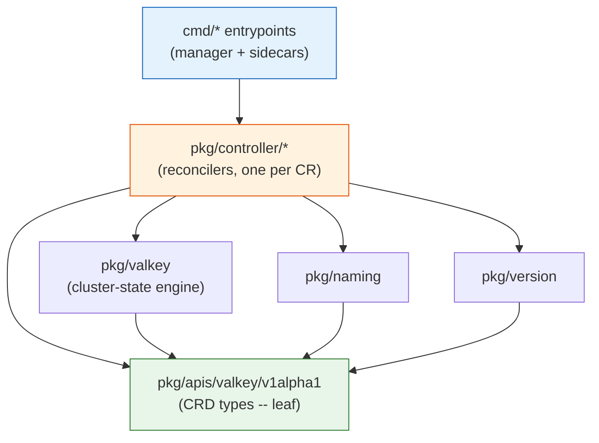
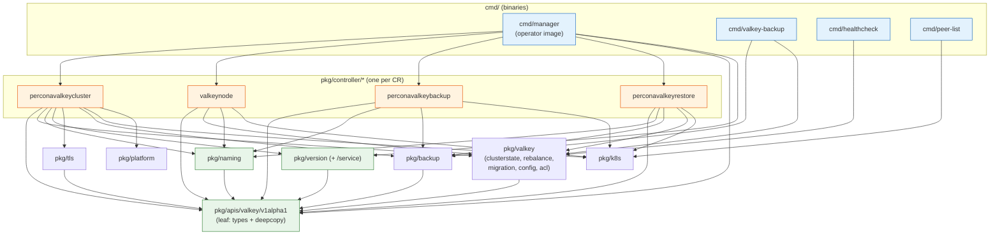

# Repository Layout & Build System

This document specifies the concrete on-disk shape of the `percona-valkey-operator`
repository: the directory tree, the Go module path and per-package responsibilities,
the hard boundary between generated and hand-written code, the Makefile target
vocabulary (mapped one-to-one onto the Percona Operator-SDK trio — PXC / PSMDB / PS),
the sidecar/helper binaries baked into the database image, and the `deploy/` install
artifacts with their namespaced-versus-cluster-wide split. The guiding decision is
deliberate and stated up front: **adopt the Percona SDK trio's layout (`pkg/apis`,
`pkg/controller/<resource>`, `pkg/naming`, `pkg/version`, `deploy/`, `e2e-tests/`
kuttl, OLM `bundle/`) rather than the upstream `valkey-operator`'s plain-kubebuilder
`internal/controller` + `api/` scaffold**, while preserving the upstream two-CRD
`PerconaValkeyCluster → ValkeyNode` topology contract inside that Percona skeleton.
For the API field tables this document references, see
[API & CRD Design](03-api-design.md); for the reconcile loops that live in
`pkg/controller`, see [Control Plane & Reconciliation](04-control-plane.md).

---

## 1. Why the Percona layout, not the upstream layout

The upstream `valkey-operator` (inspected at
`/home/corvin/AI_WORK/OPERATORS/valkey-operator`) is a plain `kubebuilder` project:
`module valkey.io/valkey-operator`, API types under `api/v1alpha1/`, controllers under
`internal/controller/`, domain logic under its own `internal/` domain package, a single `cmd/main.go`,
manifests under `config/`, and a stock kubebuilder Makefile (`make manifests generate
test build deploy`, no `bundle`/`release`/`after-release`). It has **no** backup/restore
CRDs, **no** `crVersion`/version service, **no** OLM bundle, **no** Helm chart, and
**no** `pkg/naming`/`pkg/version` centralisation (naming lives in
`internal/controller/utils.go`).

Percona's three SDK operators share a different, production-hardened skeleton:
public-API types under `pkg/apis/<group>/<version>/`, one controller package per CR
under `pkg/controller/<resource>/`, centralised naming in `pkg/naming/naming.go`,
versioning in `pkg/version/version.txt`, generated install manifests in `deploy/`,
kuttl e2e under `e2e-tests/`, and a release-aware Makefile (`make release`,
`after-release`, `bundle`, `catalog-build`). PS additionally ships the full OLM
bundle/catalog flow.

**Decision:** the Percona skeleton wins because the Charter requires every capability
the upstream layout lacks — the backup/restore CR trio, `crVersion` API-compatibility
gating, a Percona-style version service, OLM packaging, Helm charts, and centralised
naming. We therefore **port** the upstream's genuinely valuable assets — the
`ValkeyCluster→ValkeyNode` two-CRD contract, the upstream cluster-state /
rebalance / migration engine, and the reconcile phase ordering — into Percona's
`pkg/`-rooted directories (the engine lands at `pkg/valkey`) rather than keeping the kubebuilder `internal/` scaffold.
The trade-off accepted: `pkg/` exposes more of the codebase as importable surface than
`internal/` would; we mitigate this by treating `pkg/valkey` as operator-internal and
not committing to its API stability (documented in [11-testing-qa.md](11-testing-qa.md)).

---

## 2. Annotated repository tree

```text
percona-valkey-operator/
├── go.mod                          # module valkey.percona.com/percona-valkey-operator (Go 1.26)
├── go.sum
├── .go-version                     # 1.26.x — pins toolchain for CI + devcontainer
├── Makefile                        # Percona SDK Makefile family (see §5)
├── Dockerfile                      # builds percona/valkey-operator (manager) image
├── Dockerfile.sidecar              # builds percona/percona-valkey DB image w/ sidecars
├── PROJECT                         # operator-sdk/kubebuilder scaffold metadata
├── Jenkinsfile                     # e2e on GKE (Jenkins); GH Actions runs unit+lint only
│
├── cmd/                            # one main package per binary
│   ├── manager/                    # OPERATOR entrypoint → percona/valkey-operator image
│   │   └── main.go                 #   manager bootstrap, scheme reg, leader election
│   ├── valkey-backup/              # SIDECAR: RDB BGSAVE → object storage (S3/GCS/Azure)
│   │   └── main.go
│   ├── healthcheck/                # SIDECAR: liveness/readiness probe binary (in DB pod)
│   │   └── main.go
│   └── peer-list/                  # SIDECAR: headless-svc peer discovery for CLUSTER MEET
│       └── main.go
│
├── pkg/
│   ├── apis/
│   │   └── valkey/
│   │       └── v1alpha1/           # PUBLIC API types — group valkey.percona.com
│   │           ├── groupversion_info.go        # +groupName=valkey.percona.com; SchemeBuilder
│   │           ├── perconavalkeycluster_types.go   # PerconaValkeyCluster (pvk) spec/status
│   │           ├── perconavalkeycluster_defaults.go# CheckNSetDefaults + ApplyDefaults
│   │           ├── valkeynode_types.go             # ValkeyNode (vkn) INTERNAL CR
│   │           ├── valkeynode_defaults.go
│   │           ├── perconavalkeybackup_types.go    # PerconaValkeyBackup (pvk-backup)
│   │           ├── perconavalkeyrestore_types.go   # PerconaValkeyRestore (pvk-restore)
│   │           ├── backup_storage_types.go         # S3/GCS/Azure/PVC storage specs (shared)
│   │           ├── tls_types.go                    # cert-manager | secretRef TLS spec
│   │           ├── upgradeoptions_types.go         # spec.upgradeOptions {apply, schedule}
│   │           ├── conditions.go                   # condition Type/Reason constants
│   │           └── zz_generated.deepcopy.go        # GENERATED — never hand-edit
│   │
│   ├── controller/                 # one package per CR; add_*.go registers each
│   │   ├── perconavalkeycluster/   # reconciles PerconaValkeyCluster → ValkeyNode CRs
│   │   │   ├── controller.go       #   reconcile entrypoint + phase pipeline (§ port of
│   │   │   │                       #   upstream valkeycluster_controller.go ordering)
│   │   │   ├── add_perconavalkeycluster.go         # AddToManager registration
│   │   │   ├── service.go          # headless svc upsert (valkey-<cluster>)
│   │   │   ├── pdb.go              # PodDisruptionBudget
│   │   │   ├── configmap.go        # render valkey.conf, configRollHash (SHA-256)
│   │   │   ├── users.go           # ACL reconcile, _operator/_exporter system users
│   │   │   ├── nodes.go           # create/update ValkeyNodes one-at-a-time
│   │   │   ├── topology.go        # MEET / ADDSLOTSRANGE / REPLICATE / rebalance
│   │   │   ├── failover.go        # graceful CLUSTER FAILOVER (to most-synced replica)
│   │   │   │                      #   before rolling a HEALTHY primary; FAILOVER TAKEOVER
│   │   │   │                      #   only to recover orphaned replicas of a DEAD primary
│   │   │   ├── upgrade.go         # smart update orchestration (replicas before primary)
│   │   │   ├── version.go         # version-service polling, crVersion stamping
│   │   │   ├── backup.go          # cron scheduling of PerconaValkeyBackup CRs
│   │   │   ├── status.go          # conditions → derived status.state
│   │   │   └── finalizers.go      # ordered teardown finalizers
│   │   ├── valkeynode/            # reconciles ValkeyNode → StatefulSet|Deployment
│   │   │   ├── controller.go
│   │   │   ├── add_valkeynode.go
│   │   │   ├── resources.go       # workload (1-replica STS/Deploy), ConfigMap mount
│   │   │   ├── persistence.go     # PVC lifecycle, Retain/Delete reclaim via finalizer
│   │   │   └── liveconfig.go      # CONFIG SET for live-settable keys (no roll)
│   │   ├── perconavalkeybackup/   # reconciles backup CR → backup Job
│   │   │   ├── controller.go
│   │   │   └── add_perconavalkeybackup.go
│   │   └── perconavalkeyrestore/  # reconciles restore CR → bootstrap/in-place restore
│   │       ├── controller.go
│   │       └── add_perconavalkeyrestore.go
│   │
│   ├── valkey/                     # DOMAIN engine — ported from upstream's internal/ domain pkg → pkg/valkey
│   │   ├── client.go               # valkey-go wrapper, ForceSingleClient=true
│   │   ├── clusterstate.go         # GetClusterState: CLUSTER INFO/NODES → ClusterState
│   │   ├── cluster_rebalance.go    # PlanRebalanceMove (one move per reconcile)
│   │   ├── cluster_migration.go    # MigrateSlotsAtomic (CLUSTER MIGRATESLOTS, Valkey 9.0+)
│   │   ├── config.go               # buildManagedConfig, base-vs-user merge, roll hash
│   │   └── acl.go                  # buildUserAcl → users.acl rendering (Valkey aclfile)
│   │
│   ├── naming/                     # CENTRALISED names, labels, finalizers, annotations
│   │   └── naming.go               # Labels(), resource name builders, percona.com/* keys
│   │
│   ├── version/                    # operator version + Percona version service
│   │   ├── version.txt             # operator version (e.g. 0.1.0); single source of truth
│   │   ├── version.go              # //go:embed version.txt; CompareVersion()
│   │   └── service/                # version-service client (check.percona.com)
│   │       └── service.go
│   │
│   ├── k8s/                        # k8s helpers (CreateOrUpdate, status writeback, leases)
│   ├── tls/                        # cert-manager integration + secretRef cert handling
│   ├── backup/                     # storage-backend abstraction (s3://, gs://, azure://, pvc/)
│   └── platform/                   # OpenShift vs vanilla k8s detection
│
├── config/                         # kustomize bases (controller-gen + operator-sdk input)
│   ├── crd/                        # generated CRD bases + kustomization
│   ├── rbac/                       # generated Role/ClusterRole/bindings
│   ├── manager/                    # operator Deployment base
│   ├── manifests/                  # OLM CSV base (operator-sdk generate kustomize input)
│   ├── network-policy/             # NetworkPolicy base
│   ├── prometheus/                 # PodMonitor/ServiceMonitor base
│   ├── samples/                    # sample CRs (kubectl apply -k)
│   ├── scorecard/                  # OLM scorecard config
│   └── default/                    # top-level kustomization (namespaced overlay)
│
├── deploy/                         # GENERATED flat install manifests (kubectl apply -f)
│   ├── crd.yaml                    # all four CRDs concatenated
│   ├── rbac.yaml                   # namespaced Role + RoleBinding + ServiceAccount
│   ├── operator.yaml              # operator Deployment (namespaced watch)
│   ├── bundle.yaml                # crd + rbac + operator (namespaced, single-file)
│   ├── cw-rbac.yaml              # ClusterRole + ClusterRoleBinding (cluster-wide watch)
│   ├── cw-operator.yaml          # operator Deployment w/ WATCH_NAMESPACE="" (all ns)
│   ├── cw-bundle.yaml            # crd + cw-rbac + cw-operator (cluster-wide, single-file)
│   ├── cr.yaml                   # full PerconaValkeyCluster sample (GA images post-release)
│   ├── cr-minimal.yaml          # minimal viable CR
│   ├── secrets.yaml             # template Secrets (TLS, ACL users) — NO real values
│   └── backup/
│       ├── backup.yaml          # PerconaValkeyBackup sample
│       ├── restore.yaml         # PerconaValkeyRestore sample
│       ├── backup-secret-s3.yaml
│       ├── backup-secret-gcp.yaml
│       └── backup-secret-azure.yaml
│
├── bundle/                         # GENERATED OLM bundle (operator-sdk generate bundle)
│   ├── manifests/                  # ClusterServiceVersion + CRDs
│   ├── metadata/                   # annotations.yaml (channels, package name)
│   └── tests/scorecard/
├── bundle.Dockerfile               # builds the OLM bundle image
│
├── e2e-tests/                      # kuttl-driven (like PS/PG)
│   ├── kuttl.yaml                  # testDirs: e2e-tests/tests, timeout: 180
│   ├── tests/<name>/               # NN-step.yaml + NN-assert.yaml pairs
│   ├── functions / vars.sh         # shared helpers, CERT_MANAGER_VER
│   ├── release_versions            # PINNED images (source of truth for make release)
│   ├── run-pr.csv                  # PR smoke matrix (test-name, valkey-version)
│   ├── run-distro.csv              # full cross-distro matrix
│   ├── run-minikube.csv            # minikube-runnable subset
│   └── run-release.csv             # release-validation suite
│
├── build/                          # Dockerfile assets, entrypoints baked into images
├── hack/                           # boilerplate.go.txt, helper scripts
├── bin/                            # AUTO-DOWNLOADED pinned tools (gitignored)
└── .github/workflows/              # test.yml (unit+lint), scan.yml, labeler
```

---

## 3. Go module path & package responsibilities

**Module path:** `valkey.percona.com/percona-valkey-operator` (Charter-locked). The
module path intentionally equals the API group (`valkey.percona.com`) for symmetry with
the API; it is **not** a `github.com/...` path. The PROJECT file and all
`controller-gen` invocations resolve types under this module root. Go toolchain is
**1.26** (pinned in `.go-version`; `go.mod` declares `go 1.26.0`), matching the operator
toolchain and the upstream `.go-version` (`1.26.2`).

| Package | Responsibility | Imported by | May import |
|---------|----------------|-------------|------------|
| `pkg/apis/valkey/v1alpha1` | Public CRD Go types, defaults, deepcopy, condition/reason constants. The contract surface. | every controller, `cmd/manager` | only k8s `apimachinery`/`apis` — **no** controller or domain deps |
| `pkg/controller/perconavalkeycluster` | Top-level reconcile: drives `ValkeyNode` CRs, cluster topology, backups-cron, upgrades, status. | `cmd/manager` | `apis`, `valkey`, `naming`, `version`, `tls`, `backup`, `k8s`, `platform` |
| `pkg/controller/valkeynode` | Reconciles one `ValkeyNode` → 1-replica STS/Deployment + PVC + ConfigMap; live config apply. | `cmd/manager` | `apis`, `valkey`, `naming`, `k8s` |
| `pkg/controller/perconavalkeybackup` | Backup CR → backup Job; status hydration from cluster `spec.backup.storages[]`. | `cmd/manager` | `apis`, `naming`, `backup`, `k8s` |
| `pkg/controller/perconavalkeyrestore` | Restore CR → new-cluster bootstrap or in-place restore, slot-coverage aware. | `cmd/manager` | `apis`, `naming`, `backup`, `valkey`, `k8s` |
| `pkg/valkey` | Engine logic: `valkey-go` client (`ForceSingleClient=true`), `GetClusterState`, `PlanRebalanceMove`, `MigrateSlotsAtomic`, config render + roll-hash, ACL render. | controllers only | `apis` (for config types), valkey-go |
| `pkg/naming` | All resource-name builders, label/annotation key constants (`valkey.percona.com/*` + `app.kubernetes.io/*`), finalizer names. No string literals elsewhere. | everything | `apis` only |
| `pkg/version` | `//go:embed version.txt`; `CompareVersion()` for `crVersion` gating; version-service client. | controllers, `cmd/manager` | std + http client |
| `pkg/tls` | cert-manager `Certificate` issuance or `secretRef` consumption; cert hash for roll trigger. | `perconavalkeycluster` | `apis`, `naming`, cert-manager API |
| `pkg/backup` | Storage-backend abstraction; destination prefix parsing (`s3://`, `gs://`, `azure://`, `pvc/`). | backup/restore controllers | `apis` |
| `pkg/k8s` | `CreateOrUpdate`, fresh status writeback, Lease-based serialisation. | all controllers | client-go |
| `pkg/platform` | OpenShift vs vanilla detection, feeds `CheckNSetDefaults`. | controllers | client-go |
| `cmd/manager` | Manager bootstrap: scheme registration, leader election, structured logging, `AddToManager` fan-out, metrics endpoint. | — (binary) | all controllers, `apis`, `version` |
| `cmd/valkey-backup` | DB/backup-pod sidecar: BGSAVE + ship/restore RDB (§6). | — (binary) | `pkg/backup`, `pkg/valkey` (subset) |
| `cmd/healthcheck` | DB-pod liveness/readiness probe binary (§6). | — (binary) | `pkg/valkey` (subset) |
| `cmd/peer-list` | DB-pod headless-Service peer discovery for `CLUSTER MEET` (§6). | — (binary) | `pkg/k8s` (subset) |

**Dependency rule (enforced in review):** `pkg/apis` is a leaf — it imports nothing from
`pkg/controller`, `pkg/valkey`, or `pkg/naming`. `pkg/naming` and `pkg/version` are
near-leaves (depend only on `apis`/stdlib). Controllers sit at the top and may import
the engine and the leaves, never each other. This keeps the import graph acyclic and
makes `pkg/apis` safely vendorable by external consumers (Helm value-type generators,
the docs `variables.yml` tooling).

---

## 4. Generated code vs hand-written code

The single most important operational invariant: **edit the `*_types.go` source and
regenerate; never hand-edit generated output.** CI enforces this with a
`check-generate` gate (run `make generate manifests` and fail if `git diff` is dirty),
mirroring PG's `make check-generate`.

| Artifact | Generator | Source of truth | Hand-edit? |
|----------|-----------|-----------------|------------|
| `pkg/apis/**/zz_generated.deepcopy.go` | `controller-gen object` | `*_types.go` + `+kubebuilder:object` markers | **Never** |
| `config/crd/bases/*.yaml` + `deploy/crd.yaml` | `controller-gen crd` + kustomize | `*_types.go` + `+kubebuilder:validation:*` / `+kubebuilder:printcolumn` markers | **Never** |
| `config/rbac/*.yaml` + `deploy/rbac.yaml` / `cw-rbac.yaml` | `controller-gen rbac` | `+kubebuilder:rbac` markers on controllers | **Never** |
| `deploy/bundle.yaml`, `cw-bundle.yaml`, `operator.yaml`, `cw-operator.yaml` | kustomize over `config/` overlays | `config/` bases | **Never** (edit bases) |
| `bundle/manifests/*.clusterserviceversion.yaml` + `bundle/metadata/` | `operator-sdk generate bundle` | `config/manifests/` CSV base | Edit the CSV **base**, not output |
| `**/*_mock.go` (e.g. `valkeyConfigClient` mock for `pkg/valkey`) | `mockgen` | the interface declaration | **Never** |
| `deploy/cr.yaml` image tags + `crVersion` | `make release` / `after-release` text rewrite | `e2e-tests/release_versions` + `version.txt` | **Never** by hand on release |

Hand-written (the human surface): everything under `pkg/controller/**` reconcile logic,
`pkg/valkey/**` engine, `pkg/naming/naming.go`, the `*_types.go` field definitions and
their markers, `pkg/apis/**/*_defaults.go`, `cmd/**/main.go`, `e2e-tests/tests/**`, and
the kustomize bases under `config/`.

**Toolchain (auto-downloaded into `bin/` on first `make` — gitignored):**
`controller-gen` (deepcopy, CRD, RBAC), `kustomize` (overlay rendering for
`deploy/`), `setup-envtest` (KUBEBUILDER_ASSETS for unit tests), `mockgen` (interface
mocks), `golangci-lint` (lint), `operator-sdk` + `opm` (OLM bundle/catalog). This
"first invocation downloads pinned tools into `bin/`" behaviour matches both the
upstream and the Percona Operator SDK Makefiles.

**Regeneration workflow after any `*_types.go` change:**

1. Edit `pkg/apis/valkey/v1alpha1/*_types.go` (add field + markers).
2. `make generate` → refreshes `zz_generated.deepcopy.go` and mocks.
3. `make manifests` → refreshes `config/crd`, `config/rbac`, then rerenders `deploy/`.
4. If the field is version-gated, add `cr.CompareVersion("x.y")` guards in the controller.
5. `make check-generate` locally (clean `git diff`) before committing — CI repeats this.

See [03-api-design.md](03-api-design.md) for the marker-by-marker field tables that drive
this generation.

---

## 5. Makefile target vocabulary (mapped to the Percona trio)

The Makefile is the Percona Operator-SDK family Makefile, **not** the stock kubebuilder
one. Below, each target is mapped to its verified PXC/PSMDB/PS equivalent (targets
confirmed present in `/home/corvin/AI_WORK/OPERATORS/percona-server-mysql-operator/Makefile`).

| Target | Does | Percona equivalent (PS/PXC/PSMDB) |
|--------|------|-----------------------------------|
| `make generate` | `controller-gen object` + `mockgen` → deepcopy + mocks | identical (PS `generate: controller-gen mockgen`) |
| `make manifests` | `controller-gen crd,rbac` + kustomize → `config/` then `deploy/` (crd.yaml, bundle.yaml, cw-bundle.yaml, cr*.yaml) | identical (PS `manifests:` also runs `generate-cr-yaml`/`generate-backup-yaml`/`generate-restore-yaml`) |
| `make test` | `manifests generate fmt vet` then envtest unit tests (Ginkgo/Gomega) with auto-downloaded KUBEBUILDER_ASSETS | identical (PS `test: manifests generate fmt vet envtest`) |
| `make fmt` / `make vet` | `go fmt` / `go vet` | identical (PS/PXC expose both) |
| `make build` | build `percona/valkey-operator` manager image | PS `build: generate` |
| `make deploy` / `make undeploy` | kustomize-apply / delete operator to current kube-context | identical |
| `make e2e-test` | `kuttl-shfmt` then `kubectl kuttl test --config e2e-tests/kuttl.yaml` | identical to PS (`e2e-test: kuttl-shfmt`) |
| `make bundle` | `operator-sdk generate kustomize manifests` + `generate bundle VERSION=… CHANNELS=… DEFAULT_CHANNEL=…` + `bundle validate` → `bundle/` | identical to PS `bundle: manifests kustomize` |
| `make bundle-build` / `bundle-push` | build/push `percona/valkey-operator-bundle:vX.Y.Z` | identical to PS |
| `make catalog-build` / `catalog-push` | `opm index add --mode semver` → `percona/valkey-operator-catalog:vX.Y.Z` | identical to PS |
| `make release VERSION=x.y.z` | write `version.txt`; rewrite `deploy/cr*.yaml` `crVersion` + all image tags to GA `percona/*` from `e2e-tests/release_versions`; sync `CERT_MANAGER_VER` into `e2e-tests/functions`/`vars.sh` | identical to PS `release: manifests` |
| `make after-release` | derive `NEXT_VER` from `cr.yaml` `crVersion`; repoint images to `perconalab/*:main-*`; `update-version` writes `version.txt` | identical to PS `after-release: update-version manifests` |
| `make update-version` | write `NEXT_VER` into `pkg/version/version.txt` only | identical to PS |

**`VERSION` footgun (carried over from Percona):** `VERSION ?= $(git rev-parse
--abbrev-ref HEAD | sanitize)` and `IMAGE_TAG_OWNER ?= perconalab`. **Always pass
`VERSION=x.y.z`** to `release`/`bundle`/`catalog-*`/`build`, or images get tagged with
the branch name and `crVersion`/`version.txt` are written wrong. GA publishing overrides
the registry owner to `percona/*`. This is documented in detail in
[09-upgrades-versioning.md](09-upgrades-versioning.md) and
[10-distribution-release.md](10-distribution-release.md); the cross-repo sync
(operator ↔ `valkey-operator`/`valkey-db` Helm charts ↔ `k8svalkey-docs`) is the same
multi-location, zero-automation problem the trio has — enumerated as the twelve-location
checklist in [10-distribution-release.md](10-distribution-release.md) §6.

Two stock kubebuilder targets diverge from the upstream usage. `make run` (run the
controller from the host against the current kube-context) is **retained for local dev
only**, not part of any release flow. `make build-installer` (the kubebuilder
single-consolidated-YAML target) is **dropped** — it is superseded by `deploy/bundle.yaml`
generated from `manifests`.

---

## 6. Sidecar / helper binaries (in the DB image, not the operator pod)

Mirroring the trio's pattern (PXC's `pitr`/`peer-list`, PS's
`healthcheck`/`sidecar`/`bootstrap`), these `cmd/*` binaries are compiled into the
**database image** `percona/percona-valkey` (built by `Dockerfile.sidecar`), not the
operator image. They run **inside the Valkey pods**, alongside the `valkey-server`
process. The operator image (`percona/valkey-operator`) contains only `cmd/manager`.

| Binary (`cmd/`) | Runs in | Purpose | Grounding |
|-----------------|---------|---------|-----------|
| `manager` | operator pod (`percona/valkey-operator`) | The controller-runtime manager: scheme reg, leader election, all four controllers, metrics. | the only operator-image binary |
| `valkey-backup` | backup Job pod (`percona/valkey-backup`) | Issues `BGSAVE` on the shard primary, ships the resulting `dump.rdb` to S3/GCS/Azure with shard + slot-range metadata; reports status to the backup controller (HTTP status endpoint, per PS sidecar pattern). Restore path: streams an RDB set back into a freshly-bootstrapped shard. The operator itself never issues `SAVE`/`BGSAVE` — that is delegated here. | Charter "RDB snapshot (BGSAVE) per shard … by a backup Job/sidecar"; grounding "Operator does not issue SAVE/BGSAVE" |
| `healthcheck` | DB pod (`percona/percona-valkey`) | Liveness/readiness probe binary. Readiness checks `cluster_state:ok` + `master_link_status:up` (for replicas) via local INFO/CLUSTER INFO; liveness checks the server responds. Replaces the embedded shell probe scripts the upstream renders into the ConfigMap, giving a typed, testable probe. | Charter `cmd/healthcheck/`; grounding readiness/liveness scripts in upstream ConfigMap |
| `peer-list` | DB pod (`percona/percona-valkey`) | Resolves the headless Service endpoints to stable pod DNS/IPs so a newly-started node can locate peers for the operator's batch `CLUSTER MEET`. Models PXC's `peer-list` helper. | Charter `cmd/peer-list/`; grounding `meetIsolatedNodes` batch `CLUSTER MEET` |

Backup execution model (consistent with PS/PXC): the `perconavalkeybackup` controller
creates a Kubernetes `Job` whose pod runs the `valkey-backup` sidecar; the controller
watches the Job and hydrates `PerconaValkeyBackup.status.{state,destination,completed}`.
Concurrency is serialised with a Kubernetes Lease + in-process `sync.Map` (per the trio's
backup serialisation convention). PITR (AOF streaming) is **explicitly deferred** beyond
v1alpha1 — there is **no** binlog-server-equivalent binary; see
[06-backup-restore.md](06-backup-restore.md).

---

## 7. `deploy/` artifacts: namespaced vs cluster-wide split

`deploy/` holds the **generated, flat, `kubectl apply -f`-able** install manifests
(kustomize-rendered from `config/`). These are **not** OLM artifacts — the OLM operator
bundle lives separately under `bundle/`. There are two parallel install flavours; the
`cw-` prefix means "cluster-wide watch", exactly as in the trio.

| File | Scope | Contents | RBAC kind | `WATCH_NAMESPACE` |
|------|-------|----------|-----------|-------------------|
| `crd.yaml` | n/a | all four CRDs (PerconaValkeyCluster, ValkeyNode, PerconaValkeyBackup, PerconaValkeyRestore) | — | — |
| `rbac.yaml` | namespaced | `ServiceAccount` + `Role` + `RoleBinding` | `Role` | set to operator namespace |
| `operator.yaml` | namespaced | operator `Deployment` | — | operator's own namespace |
| `bundle.yaml` | namespaced | `crd.yaml` + `rbac.yaml` + `operator.yaml` concatenated (one-shot install) | `Role` | own namespace |
| `cw-rbac.yaml` | cluster-wide | `ServiceAccount` + `ClusterRole` + `ClusterRoleBinding` | `ClusterRole` | — |
| `cw-operator.yaml` | cluster-wide | operator `Deployment` with `WATCH_NAMESPACE=""` | — | empty (all namespaces) |
| `cw-bundle.yaml` | cluster-wide | `crd.yaml` + `cw-rbac.yaml` + `cw-operator.yaml` (one-shot, multi-tenant install) | `ClusterRole` | empty |
| `cr.yaml` / `cr-minimal.yaml` | sample | full / minimal `PerconaValkeyCluster`; image tags + `crVersion` rewritten by `make release` | — | — |
| `secrets.yaml` | sample | **template** Secrets (TLS bundle, ACL users) with placeholders, **never real values** | — | — |
| `backup/*.yaml` | sample | backup/restore CRs + S3/GCS/Azure credential Secret templates | — | — |

**Namespaced** = least-privilege default: operator watches and reconciles only its own
namespace via a `Role`. **Cluster-wide** (`cw-*`) = a single operator instance manages
`PerconaValkeyCluster` CRs across all namespaces via a `ClusterRole` — required for the
multi-tenant patterns in the Charter, at the cost of broader RBAC. Recommendation: ship
both, default the Helm chart and OperatorHub listing to namespaced, document `cw-bundle`
as the opt-in multi-tenant path. RBAC scopes are detailed in
[07-security.md](07-security.md). `secrets.yaml` carrying only placeholders is a hard
security rule — no hardcoded secrets in any committed manifest (see
[07-security.md](07-security.md)).

---

## 8. Inherited coding conventions

- **Scaffold markers drive generation.** Field validation (`+kubebuilder:validation:*`),
  print columns (`+kubebuilder:printcolumn:` — for `pvk`: State, Reason, ReadyShards,
  Age, mirroring upstream), short names (`+kubebuilder:resource:shortName=pvk` etc.),
  deepcopy (`+kubebuilder:object:root=true`), and RBAC (`+kubebuilder:rbac:`) all live as
  comment markers on the Go types/controllers. The CRD shape is a *consequence* of the
  markers, never edited downstream. CEL `+kubebuilder:validation:XValidation` rules
  enforce field interdependencies at apply-time (e.g. `persistence` forbidden with
  `workloadType: Deployment`) rather than via admission webhooks — see
  [03-api-design.md](03-api-design.md).
- **Never hand-edit `zz_generated.deepcopy.go`** or any file in §4's generated column.
  Run `make generate && make manifests` after every `*_types.go` change; `make
  check-generate` (CI gate) fails the build on a dirty tree.
- **`CheckNSetDefaults(ctx, platform)` on the CR type** is the single mutation entry
  point, invoked every reconcile (trio convention) — defaults, secret-name resolution,
  probe timeouts, resource defaults, and first-reconcile `crVersion` stamping all live
  there, in `perconavalkeycluster_defaults.go`.
- **Centralise naming** in `pkg/naming/naming.go`: child resources are `valkey-`-prefixed
  (`valkey-<cluster>-<shard>-<node>`), PVCs are `valkey-<node>-data`, labels are the
  `app.kubernetes.io/{name,instance,component,managed-by}` set **plus**
  `valkey.percona.com/{cluster,shard-index,node-index,component}`. No string literals for
  names anywhere else; all builders keep the 63-char DNS-label limit.
- **Version-gate behaviour** with `version.CompareVersion("x.y")` against `spec.crVersion`
  for any new field, so older CRs reconcile unchanged.
- **Idempotent, re-fetch-before-update** reconciliation with owner references for GC and
  `percona.com/`-prefixed ordered finalizers (backup-artifact cleanup, ordered teardown).
- **One main package per binary** under `cmd/` (manager + the three sidecars in §6).

---

## 9. Package dependency graph

### 9.1 Core dependency spine (the rule in one picture)

The whole import policy reduces to a single straight line: `cmd/*` entrypoints depend on
the controllers; the controllers fan out to the engine and the leaf helpers; and
**everything ultimately points down at `pkg/apis`**, which imports nothing back. This is
the `pkg/apis <- pkg/controller -> pkg/valkey / pkg/naming / pkg/version` relationship the
layout is built around, with the supporting helpers elided for clarity (the full set is in
§9.2).



### 9.2 Full package + binary dependency graph



Both graphs are the same DAG at two zoom levels — §9.1 shows the spine, §9.2 the full
fan-out — with `pkg/apis` as the bottom leaf: every arrow points down toward
the types, no controller imports another controller, and `cmd/manager` is the single
composition root wiring all four controllers into the manager. The sidecar binaries
(`cmd/valkey-backup`, `cmd/healthcheck`, `cmd/peer-list`) reuse a thin slice of the
engine/helpers and ship in the DB image, completely decoupled from the controllers.

---

## 10. Cross-references

- [API & CRD Design](03-api-design.md) — field tables, markers, CEL validation for the four CRDs.
- [Control Plane & Reconciliation](04-control-plane.md) — the reconcile pipelines living in `pkg/controller/*`.
- [Security Architecture](07-security.md) — RBAC scopes behind the namespaced/cluster-wide split; secret handling.
- [Backup & Restore](06-backup-restore.md) — the `valkey-backup` sidecar and Job model; PITR deferral.
- [Upgrades & Version Management](09-upgrades-versioning.md) — `crVersion` gating, `upgradeOptions`, version service.
- [Distribution & Release](10-distribution-release.md) — `make release`/`after-release`, the `VERSION` footgun, cross-repo sync, OLM/Helm packaging.
- [Testing & Quality Assurance](11-testing-qa.md) — envtest unit tests, kuttl e2e, `run-*.csv` matrix, `check-generate` gate.
- The Percona Operator SDK conventions (the PXC/PSMDB/PS operators) this layout mirrors.
