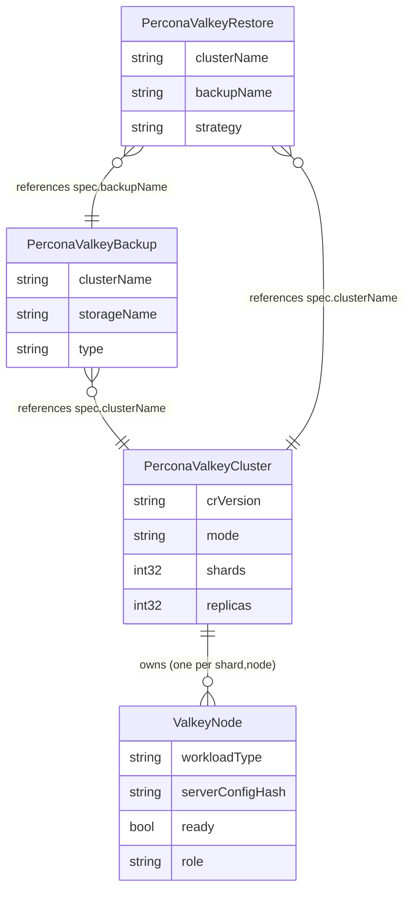
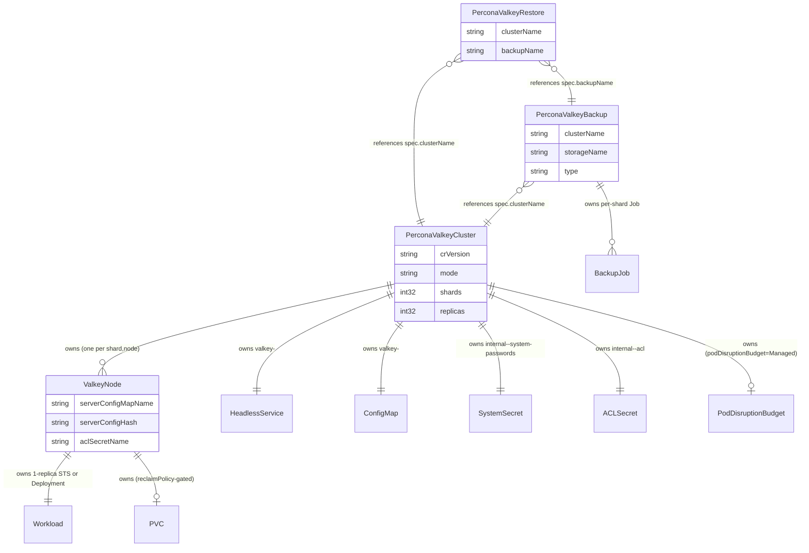
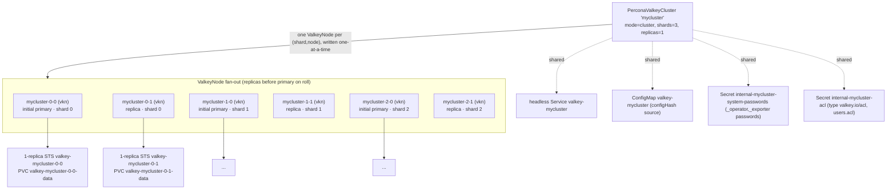

# API & CRD Design

> Part of the Percona Operator for Valkey architecture set. This document is the authoritative
> specification of the operator's Kubernetes API surface: the four Custom Resource Definitions
> in group `valkey.percona.com/v1alpha1`, every spec and status field, their defaults,
> CEL validation and immutability rules, the internal parent↔child contract between
> `PerconaValkeyCluster` and `ValkeyNode`, and worked sample manifests. It mirrors the
> Percona Operator-SDK trio (PXC / PSMDB / PS) conventions — a `Cluster`/`Backup`/`Restore`
> CRD trio, `crVersion` version gating, `CheckNSetDefaults`-style defaulting, centralised
> naming — while adopting the upstream `valkey-operator` two-CRD `Cluster→Node` topology model.
> See the sibling documents for context: [Overview & Design Principles](00-overview.md),
> [Architecture Decision Records](01-decisions.md), [Control Plane & Reconciliation](04-control-plane.md),
> [Data Plane: Topology, Sharding, Replication & Failover](05-data-plane.md),
> [Backup & Restore](06-backup-restore.md), [Security Architecture](07-security.md),
> [Observability](08-observability.md), [Upgrades & Version Management](09-upgrades-versioning.md),
> [Distribution & Release](10-distribution-release.md).

---

## 1. CRD relationships and ownership overview

The operator defines exactly **four** CRDs. Three are user-facing (`PerconaValkeyCluster`,
`PerconaValkeyBackup`, `PerconaValkeyRestore`), forming the Percona "trio" pattern; one
(`ValkeyNode`) is an internal implementation detail created and driven only by the operator.

| Kind | Short name | Scope | Audience | Created by | Owns / references |
|------|-----------|-------|----------|------------|-------------------|
| `PerconaValkeyCluster` | `pvk` | Namespaced | User | User | Owns all `ValkeyNode`s, the headless Service, ConfigMap, Secrets, PDB |
| `ValkeyNode` | `vkn` | Namespaced | **Internal only** | Operator | Owns one StatefulSet *or* Deployment, its PVC, optionally a per-node ConfigMap |
| `PerconaValkeyBackup` | `pvk-backup` | Namespaced | User | User / CronJob | Owns the backup `Job`s; references a `PerconaValkeyCluster` by name |
| `PerconaValkeyRestore` | `pvk-restore` | Namespaced | User | User | References a `PerconaValkeyBackup` (or inline source) and a target cluster |

**Ownership semantics.** Every operator-created object carries an `ownerReference` to its
controlling parent with `controller: true` and `blockOwnerDeletion: true`. This drives
Kubernetes garbage collection: deleting a `PerconaValkeyCluster` cascades to its `ValkeyNode`s,
which cascade to their StatefulSets/Deployments and (subject to `persistence.reclaimPolicy`)
their PVCs. `PerconaValkeyBackup` and `PerconaValkeyRestore` are **not** owned by the cluster —
they are independent lifecycle objects that merely *reference* a cluster by name, so a backup
artifact survives cluster deletion (the Percona convention; see
[Backup & Restore](06-backup-restore.md)).

**Why the internal `ValkeyNode` CRD instead of plain StatefulSets?** This is the load-bearing
architectural decision adopted from upstream `valkey-operator`. A `ValkeyNode` maps 1:1 to a
single Valkey pod and wraps a *one-replica* StatefulSet (durable, default) or Deployment
(cache). The cluster controller writes `ValkeyNode` specs **one at a time** in shard order
(replicas before primary) and reads back `status.ready` / `status.role` / `status.podIP`,
giving the operator a stable, addressable, per-pod control point with its own reconcile loop,
its own conditions, and its own config-hash rolling-restart mechanism — without re-implementing
pod lifecycle. The live replication role is **always** read from `CLUSTER NODES` / `INFO`,
never inferred from labels or the `nodeIndex`.

**The four CRDs at a glance.** The diagram below shows only the four custom resources and the
ownership/reference edges *between them* — the focused "trio + internal node" view. A solid
`||--o{` / `||--||` edge means *owns* (ownerReference, cascading GC); a dashed-cardinality
`}o--||` edge means *references by name* (no ownerReference, independent lifecycle).



**Full ownership graph (CRDs plus operator-managed objects).** The next diagram expands the
cluster's owned Kubernetes objects (Service, ConfigMap, Secret, PDB, Workload, PVC, backup Jobs)
so garbage-collection cascades are explicit.



---

## 2. `PerconaValkeyCluster.spec`

The top-level CR. The `spec` is grouped below by concern. Field names, JSON tags, and
validation markers mirror the upstream `ValkeyClusterSpec` where one exists, with Percona
additions (`crVersion`, `mode`, `backup`, `upgradeOptions`, `pause`) layered on. The M5/hardening
pass adds the security and access fields catalogued in §§2.7a, 2.8, 2.9, 2.10a–2.10d (`auth`,
TLS `authClients`/`ciphers`/`cipherSuites`/`dhParamsSecret`, `disableCommands`,
`podSecurityContext`, `containerSecurityContext`, `serviceAccountName`,
`automountServiceAccountToken`, `env`, `extraEnvVars`, `expose`, `networkPolicy`, and the
`exporter` `port`/`scrapeInterval`/`tls` knobs).

### 2.1 Spec field-group overview

```mermaid
flowchart TD
    PVK["PerconaValkeyCluster.spec"]
    PVK --> ID["Identity & Version<br/>crVersion · image · imagePullSecrets · pause"]
    PVK --> TOP["Topology<br/>mode · shards · replicas · workloadType"]
    PVK --> SCHED["Scheduling<br/>resources · affinity · nodeSelector<br/>tolerations · topologySpreadConstraints"]
    PVK --> STORE["Storage<br/>persistence (size · storageClassName · reclaimPolicy)"]
    PVK --> CFG["Engine Config<br/>config (map) · containers · disableCommands"]
    PVK --> ENVG["Environment<br/>env · extraEnvVars"]
    PVK --> SEC["Security<br/>users (ACL) · auth · tls · disableCommands<br/>podSecurityContext · containerSecurityContext<br/>serviceAccountName · automountServiceAccountToken"]
    PVK --> NET["Networking<br/>expose · networkPolicy"]
    PVK --> OBS["Observability<br/>exporter (port · scrapeInterval · tls)"]
    PVK --> AVAIL["Availability<br/>podDisruptionBudget"]
    PVK --> BKP["Backup<br/>backup.schedule[] · backup.storages{}"]
    PVK --> UPG["Lifecycle<br/>upgradeOptions (apply · schedule · versionServiceEndpoint)"]
```



### 2.2 Identity & version

| Field | Type | Default | Immutable | Description |
|-------|------|---------|-----------|-------------|
| `crVersion` | `string` | auto-stamped to operator `major.minor` | gated, not hard-immutable | Operator API contract version. Auto-stamped on first reconcile if empty (PSMDB/PS convention). Gates behaviour via `cr.CompareVersion("x.y.z")`. MUST equal the operator's `major.minor`; mismatch causes upgrade-loop/rejection. See [Upgrades & Version Management](09-upgrades-versioning.md). |
| `image` | `string` | `percona/percona-valkey:<engine-tag>` | no | Valkey server image. Independent of `crVersion` (the second Percona version axis). Mutated by the version service when `upgradeOptions.apply != Disabled`. |
| `imagePullSecrets` | `[]corev1.LocalObjectReference` | `nil` | no | Secrets for pulling server/exporter/sidecar images from private registries. Propagated to every `ValkeyNode`. |
| `pause` | `bool` | `false` | no | When `true`, the operator scales workloads to zero and stops topology reconciliation (Percona convention) without deleting the CR or PVCs. |

### 2.3 Topology

| Field | Type | Default | Immutable | Description |
|-------|------|---------|-----------|-------------|
| `mode` | `enum{cluster,replication,standalone}` | `cluster` | **yes** (CEL `self == oldSelf`) | Topology mode. `cluster` = sharded 16384-slot (primary v1alpha1 target); `replication` = 1 primary + N replicas, operator-driven failover, **no Sentinel**; `standalone` = single node (future). Immutable because changing topology requires a full rebuild. |
| `shards` | `int32` | `3` (`cluster`), forced `1` (`replication`/`standalone`) | no (scalable) | Number of shard groups. CEL: `mode=='cluster'` requires `shards>=1`; non-cluster modes require `shards==1`. `Minimum=1`. |
| `replicas` | `int32` | `1` | no (scalable) | Replicas **per shard**. `Minimum=0`. Total Valkey pods = `shards * (1 + replicas)`. |
| `workloadType` | `enum{StatefulSet,Deployment}` | `StatefulSet` | **yes** (CEL `self == oldSelf`) | Per-node workload kind. `StatefulSet` = durable (required with persistence); `Deployment` = cache. Propagated verbatim to each `ValkeyNode.spec.workloadType`. |

> **Naming derived from topology.** For each `(shardIndex, nodeIndex)` the operator creates a
> `ValkeyNode` named `<cluster>-<shardIndex>-<nodeIndex>`; `nodeIndex 0` is the *initial*
> primary. Child objects are prefixed `valkey-` (e.g. `valkey-<cluster>-0-0`); the PVC is
> `valkey-<node>-data`. See §6 and [Control Plane & Reconciliation](04-control-plane.md).

### 2.4 Scheduling

| Field | Type | Default | Immutable | Description |
|-------|------|---------|-----------|-------------|
| `resources` | `corev1.ResourceRequirements` | none | no | Requests/limits for the Valkey container in each pod. Propagated to every `ValkeyNode`. |
| `affinity` | `*corev1.Affinity` | `nil` | no | Pod affinity/anti-affinity. Overrides `nodeSelector` when set (upstream semantics). |
| `nodeSelector` | `map[string]string` | `nil` | no | Node selection constraints. |
| `tolerations` | `[]corev1.Toleration` | `nil` | no | Pod tolerations. |
| `topologySpreadConstraints` | `[]corev1.TopologySpreadConstraint` | `nil` | no | Spread constraints. The operator **augments** these with shard-aware selectors (`valkey.percona.com/shard-index`) so same-shard pods spread across the topology domain. |

### 2.5 Storage / persistence

`persistence` is a pointer so its absence is meaningful (cache mode). The immutability rules
are the heart of the CRD's CEL surface (§4).

| Field | Type | Default | Immutable | Description |
|-------|------|---------|-----------|-------------|
| `persistence` | `*PersistenceSpec` | `nil` | add/remove forbidden | Durable storage propagated to each `ValkeyNode`. Cannot be added after creation, cannot be removed once set. Forbidden with `workloadType=Deployment`. |
| `persistence.size` | `resource.Quantity` | — (required when block present) | expand-only | Requested PVC size. May only grow (CEL `compareTo >= 0`). |
| `persistence.storageClassName` | `*string` | cluster default SC | **yes** | StorageClass for the PVC. Immutable once set (CEL equality with `has()` guards on both sides). |
| `persistence.reclaimPolicy` | `enum{Retain,Delete}` | `Retain` | no | Whether the managed PVC is kept or GC'd (via finalizer) when the `ValkeyNode` is deleted. |

### 2.6 Engine configuration & containers

| Field | Type | Default | Immutable | Description |
|-------|------|---------|-----------|-------------|
| `config` | `map[string]string` | `nil` | no | Additional `valkey.conf` parameters. **User config is rendered first; operator-managed base config last so base wins on conflict** (upstream `buildManagedConfig`). User cannot override `cluster-enabled`, `protected-mode`, `cluster-node-timeout`, `port`, `tls-*`, `aclfile`, `dir`, `cluster-config-file` — silently ignored. The live-settable subset (`maxmemory`, `maxmemory-policy`, `maxclients`) is applied via `CONFIG SET` without a pod roll; all other changes trigger a rolling restart via the config hash. |
| `containers` | `[]corev1.Container` | `nil` | no | Strategic-merge patch of default containers (`server`, `metrics-exporter`); unknown names are appended. Propagated to each `ValkeyNode`. |
| `disableCommands` | `[]string` | `[FLUSHALL, FLUSHDB]` (when `nil`) | no | Valkey commands the operator renders as `rename-command <CMD> ""` so they are unavailable. `nil` ⇒ defaulted to the chart's safe set `[FLUSHALL, FLUSHDB]` in `CheckNSetDefaults`; an **explicit empty slice** `[]` means "disable nothing" and is preserved. Also a security knob — see [Security Architecture](07-security.md). |

### 2.7 Users (ACL)

`users` is a `listType=map` keyed by `name`. It mirrors the upstream `UserAclSpec` exactly so
the same ACL-file renderer is reused. The operator renders all users (user-defined plus the two
system users) into a single `users.acl` file held in the `internal-<cluster>-acl` Secret
(type `valkey.io/acl`, mounted at `/config/users/users.acl`); the random passwords for the
system users `_operator` and `_exporter` live separately in the `internal-<cluster>-system-passwords`
Secret. System users are **rejected** if a user tries to declare them (CEL forbids names starting
with `_`). See [Security Architecture](07-security.md) for the full ACL/secret design.

| Field | Type | Default | Description |
|-------|------|---------|-------------|
| `users[].name` | `string` (required) | — | Username. CEL: `!self.startsWith('_')` (reserves system users). |
| `users[].enabled` | `bool` | `true` | Whether the ACL user is on. |
| `users[].passwordSecret.name` | `string` | `<cluster>-users` | Secret holding the password(s). |
| `users[].passwordSecret.keys` | `[]string` | `[name]` | Keys inside the Secret. Multiple keys enable Valkey multi-password rotation. |
| `users[].nopass` | `bool` | `false` | Passwordless user. |
| `users[].resetpass` | `bool` | `false` | Apply the `resetpass` flag. |
| `users[].commands.allow` / `.deny` | `[]string` | `nil` | Categories (`@read`,`@write`,`@admin`,...), commands, or container\|subcommand pairs (`config\|get`, `client\|no-evict`, `cluster\|set-config-epoch`). Bare tokens only — the renderer prepends `+`/`-`. CEL item pattern `^@?[a-z][a-z0-9-]*(\|[a-z][a-z0-9-]*)?$` (allows the digits/hyphens/subcommand-pipe that real Valkey command and category names use; case-insensitive at the engine but normalised to lower-case here). |
| `users[].keys.readWrite` / `.readOnly` / `.writeOnly` | `[]string` | `nil` | Key patterns → `~pattern` / `%R~pattern` / `%W~pattern`. |
| `users[].channels.patterns` | `[]string` | `nil` | Pub/Sub channels → `&pattern`. |
| `users[].permissions` | `string` | `""` | Raw ACL appended verbatim after generated rules. |

### 2.7a Auth (default-user password / `requirepass`)

`spec.auth` (a `*AuthSpec` pointer) governs **only** the built-in Valkey `default` user
(`requirepass`) and is **distinct** from `spec.users[]` (named, non-default ACL users). It is the
chart's primary auth knob: when enabled (the default) the operator sets the `default` user's
password from `auth.passwordSecret`; when disabled the `default` user is left passwordless
(`nopass`). All password material is **Secret-ref only** (never inline, ADR-008). `auth == nil` is
materialised in `CheckNSetDefaults` to `{enabled:true, passwordSecret.name:<cluster>-users}`.

| Field | Type | Default | Description |
|-------|------|---------|-------------|
| `auth` | `*AuthSpec` | `{enabled:true}` (defaulted) | Default-user (`requirepass`) configuration. `nil` ⇒ defaulted to enabled. |
| `auth.enabled` | `*bool` | `true` | Toggle default-user password auth. `true` ⇒ the `default` user requires the password from `passwordSecret`; `false` ⇒ the `default` user is left passwordless (`nopass`). Pointer so absence is distinct from explicit `false`. |
| `auth.passwordSecret.name` | `string` | `<cluster>-users` (derived when enabled) | Secret holding the default user's password(s). |
| `auth.passwordSecret.keys` | `[]string` | `[name]` | Keys inside the Secret. Multiple keys enable Valkey multi-password rotation (live `ACL SETUSER`, no pod roll). |

### 2.8 TLS

> **This table is the AUTHORITATIVE field catalogue for `TLSConfig`.** [Security Architecture](07-security.md) §3.3 elaborates the runtime behaviour (provisioning sequence, mTLS, rotation), but the field shape is defined here.

`spec.tls` is a discriminated union with two mutually exclusive provisioning modes. Neither set ⇒ TLS disabled.

| Field | Type | Default | Description |
|-------|------|---------|-------------|
| `tls` | `*TLSConfig` | `nil` (TLS off) | TLS-in-transit for client port and cluster bus. When present, the operator renders `tls-port=6379`, `port=0`, `tls-cluster=yes`, `tls-replication=yes`. Cert rotation requires a pod roll (no live hot-swap). |
| `tls.secretName` | `string` | — | **Secret-reference mode (alternative).** Name of a pre-existing Secret containing `ca.crt`, `tls.crt`, `tls.key`. The operator validates the three keys exist and fails closed if any is missing. For air-gapped or externally-managed PKI. |
| `tls.certManager.issuerRef` | `*IssuerRef` | — | **cert-manager mode (recommended).** When set, the operator provisions a `cert-manager.io/v1` `Certificate` with DNS SANs for the headless Service + per-pod names; cert-manager populates the TLS Secret (auto-rotation). |
| `tls.certManager.issuerRef.name` | `string` | — | Name of the cert-manager `Issuer`/`ClusterIssuer`. |
| `tls.certManager.issuerRef.kind` | `enum{Issuer,ClusterIssuer}` | `Issuer` | Issuer scope. |
| `tls.authClients` | `enum{off,optional,require}` | `optional` | Client-certificate (mTLS) policy → Valkey `tls-auth-clients`. `optional` = `tls-auth-clients optional` (encryption + server auth, ACL password auth over the channel; the default); `require` = `tls-auth-clients yes` (mutual TLS, zero-trust); `off` = `tls-auth-clients no` (no client-cert validation). Surfaced as a single enum so the policy cannot be partially configured. See [Security Architecture](07-security.md) §3.2. |
| `tls.ciphers` | `string` | `""` (server default) | Restricts the TLSv1.2-and-below cipher list (OpenSSL cipher-string syntax) → `tls-ciphers`. FIPS/compliance knob. |
| `tls.cipherSuites` | `string` | `""` (server default) | Restricts the TLSv1.3 cipher suites (OpenSSL ciphersuites syntax) → `tls-ciphersuites`. |
| `tls.dhParamsSecret` | `*SecretRef` | `nil` (server default) | Secret-ref (`{name, key}`) holding Diffie-Hellman parameters (`dh-params.pem`) mounted and wired to `tls-dh-params-file`. `key` defaults to `dh-params.pem`. Secret-ref only — never inline (ADR-008). |

`tls.secretName` and `tls.certManager` are mutually exclusive (set at most one). The hardening
knobs (`authClients`, `ciphers`, `cipherSuites`, `dhParamsSecret`) apply regardless of which
provisioning mode is chosen. See [Security Architecture](07-security.md) §3.3 for the full TLS,
mTLS, and rotation behaviour.

### 2.9 Exporter (observability)

| Field | Type | Default | Description |
|-------|------|---------|-------------|
| `exporter` | `ExporterSpec` | `{enabled:true}` | Prometheus exporter sidecar config. |
| `exporter.enabled` | `bool` | `true` | Toggle the sidecar. When on, the `_exporter` system user is provisioned. |
| `exporter.image` | `string` | operator default exporter image | Override exporter image. |
| `exporter.resources` | `corev1.ResourceRequirements` | none | Exporter container resources. |
| `exporter.port` | `*int32` | `9121` | Exporter scrape port. Backs the named `metrics` container port and the static `PodMonitor`/`ServiceMonitor` target (`Minimum=1`, `Maximum=65535`). See [Observability](08-observability.md) §3. |
| `exporter.scrapeInterval` | `string` | `20s` | Recommended scrape cadence templated into the `PodMonitor`/`ServiceMonitor`. Avoid sub-10s on large keyspaces (`INFO` competes with client traffic on the single thread). See [Observability](08-observability.md) §2.4. |
| `exporter.tls` | `*ExporterTLSSpec` | `nil` | Metrics-over-TLS toggle. |
| `exporter.tls.enabled` | `bool` | `false` | When `true`, the exporter serves `/metrics` over HTTPS using the cluster's cert family and the generated `PodMonitor`/`ServiceMonitor` switches to `scheme: https` with the matching `tlsConfig`. See [Observability](08-observability.md) §3.3. |

### 2.10 Availability (PodDisruptionBudget)

| Field | Type | Default | Description |
|-------|------|---------|-------------|
| `podDisruptionBudget` | `enum{Managed,Disabled}` | `Managed` | When `Managed`, the operator creates a PDB sized to keep a quorum per shard. `Disabled` when managed externally or suppressed during maintenance. |

### 2.10a Pod & service-account security (hardening)

These M5/hardening fields let operators override the operator's hardened pod/container defaults and
control ServiceAccount wiring on the **data pods**. All are propagated to each `ValkeyNode`. See
[Security Architecture](07-security.md).

| Field | Type | Default | Description |
|-------|------|---------|-------------|
| `podSecurityContext` | `*corev1.PodSecurityContext` | `nil` (operator applies a hardened default) | Pod-level security context for the data pods. Overrides the operator's hardened default when set. |
| `containerSecurityContext` | `*corev1.SecurityContext` | `nil` (operator applies a hardened default) | Container-level security context for the Valkey server container. Overrides the operator's hardened default when set. |
| `serviceAccountName` | `string` | `""` ⇒ operator-created default SA | ServiceAccount for the data pods. |
| `automountServiceAccountToken` | `*bool` | `false` (hardened) | SA token automount on the data pods. Pointer so absence is distinct from explicit `false`; defaults to `false` (the chart's hardened default). |

### 2.10b Environment

| Field | Type | Default | Description |
|-------|------|---------|-------------|
| `env` | `map[string]string` | `nil` | Simple key/value environment variables added to the Valkey server container (the common "just add an env var" escape hatch). |
| `extraEnvVars` | `[]corev1.EnvVar` | `nil` | Full `corev1.EnvVar` entries (`valueFrom`, etc.) added to the Valkey server container, layered **after** `env`. |

### 2.10c Expose (external client access)

`spec.expose` (a `*ExposeSpec` pointer) controls how the cluster is reachable from outside the
operator's headless Service. `nil` ⇒ in-cluster headless Service only. When `type` is
`NodePort`/`LoadBalancer` the operator provisions the external Service(s).

| Field | Type | Default | Description |
|-------|------|---------|-------------|
| `expose` | `*ExposeSpec` | `nil` (in-cluster headless Service only) | External-access configuration. |
| `expose.type` | `enum{ClusterIP,NodePort,LoadBalancer}` | `ClusterIP` | Client Service type. `ClusterIP` keeps access in-cluster; `NodePort`/`LoadBalancer` expose the cluster externally. |
| `expose.loadBalancerSourceRanges` | `[]string` | `nil` | Restricts client CIDRs when `type` is `LoadBalancer`. |
| `expose.annotations` | `map[string]string` | `nil` | Annotations added to the generated external Service(s) (e.g. cloud LB controller hints). |
| `expose.perPod` | `bool` | `false` | **PARTIAL / deferred.** Intended to create one external Service per `ValkeyNode` and set `cluster-announce-ip` so cluster-mode clients can follow `MOVED`/`ASK` redirects to per-pod external addresses. The field is part of the v1alpha1 API, but the per-pod `cluster-announce-ip` announce-IP discovery wiring is **deferred** in the as-built operator — treat as a known partial. |

### 2.10d NetworkPolicy (hardening)

`spec.networkPolicy` (a `*NetworkPolicySpec` pointer) toggles and customizes the operator-managed
default-deny perimeter (see [Security Architecture](07-security.md) §7). It replaces the earlier
interim annotation gate (`valkey.percona.com/network-policy` + `...-monitoring-namespace`). `enabled`
is a pointer so absence is distinct from explicit `false`; the operator's default is **off unless
explicitly enabled** (opt-in; recommended `true` in production).

| Field | Type | Default | Description |
|-------|------|---------|-------------|
| `networkPolicy` | `*NetworkPolicySpec` | `nil` (no policy) | Operator-managed default-deny NetworkPolicy configuration. |
| `networkPolicy.enabled` | `*bool` | `nil`/`false` ⇒ no policy created | Turns on the operator-managed default-deny NetworkPolicy plus the required data-plane/metrics flows. |
| `networkPolicy.clientNamespaceSelectors` | `[]metav1.LabelSelector` | `nil` (same-namespace pods only) | Namespaces whose pods may reach the client port (6379). |
| `networkPolicy.clientPodSelectors` | `[]metav1.LabelSelector` | `nil` (any pod in allowed namespaces) | Pods (in allowed namespaces) that may reach the client port (6379). |
| `networkPolicy.monitoringNamespace` | `string` | `""` ⇒ the cluster's own namespace | Namespace whose Prometheus pods may scrape the exporter (9121). See [Observability](08-observability.md) §3.4. |

### 2.11 Backup (Percona addition — not in upstream)

The cluster owns **storage definitions** and **schedules**; individual on-demand backups are
separate `PerconaValkeyBackup` CRs that reference a storage by name (Percona minimalism: the
`Backup` CR carries only `clusterName` + `storageName`, the rest is resolved from here).

| Field | Type | Default | Description |
|-------|------|---------|-------------|
| `backup.image` | `string` | `percona/valkey-backup:<tag>` | Backup tool image (RDB ship-out). |
| `backup.serviceAccountName` | `string` | operator default SA | SA for backup Jobs. |
| `backup.storages` | `map[string]BackupStorageSpec` | `nil` | Named storage backends. The map key is the `storageName` referenced by backups/schedules. |
| `backup.storages[].type` | `enum{s3,gcs,azure,filesystem}` | — | Backend type. `filesystem`/`pvc` is test-only. |
| `backup.storages[].s3` | `*BackupStorageS3Spec` | `nil` | `{bucket, prefix, region, endpointUrl, credentialsSecret}`. Destinations prefixed `s3://`. |
| `backup.storages[].gcs` | `*BackupStorageGCSSpec` | `nil` | `{bucket, prefix, credentialsSecret}`. Prefix `gs://`. |
| `backup.storages[].azure` | `*BackupStorageAzureSpec` | `nil` | `{container, prefix, credentialsSecret}`. Prefix `azure://`. |
| `backup.schedule` | `[]BackupScheduleSpec` | `nil` | Cron-driven scheduled backups (robfig/cron, spawned inside reconcile — Percona convention). |
| `backup.schedule[].name` | `string` | — | Schedule identifier. |
| `backup.schedule[].schedule` | `string` (cron) | — | Cron expression. |
| `backup.schedule[].storageName` | `string` | — | Must be a key in `backup.storages` (CEL/`CheckNSetDefaults` validates). |
| `backup.schedule[].keep` | `int` | `0` (unlimited) | Retention count; GC via finalizer on the oldest `PerconaValkeyBackup`s. |
| `backup.schedule[].type` | `enum{full}` | `full` | RDB full snapshot. (Incremental/PITR deferred — see the note below and [Backup & Restore](06-backup-restore.md).) |

> **PITR is explicitly deferred** beyond v1alpha1. Unlike PXC/PS (binlog/AOF streaming), this
> operator ships **RDB snapshot (`BGSAVE`) per shard** only. There is no `backup.pitr` block and
> no binlog-server StatefulSet in v1alpha1. See [Backup & Restore](06-backup-restore.md).

### 2.12 Lifecycle (upgradeOptions — Percona smart updates)

| Field | Type | Default | Description |
|-------|------|---------|-------------|
| `upgradeOptions.apply` | `enum{Disabled,Recommended,Latest,<version>}` | `Disabled` | Smart-update policy. `Disabled` = pinned `image`; `Recommended`/`Latest` = poll the version service; `<version>` = pin to a specific engine version. |
| `upgradeOptions.schedule` | `string` (cron) | `0 4 * * *` (when enabled) | When to poll/apply. |
| `upgradeOptions.versionServiceEndpoint` | `string` | `https://check.percona.com` | Percona-style version service. See [Upgrades & Version Management](09-upgrades-versioning.md). |

---

## 3. `PerconaValkeyCluster.status`

Status is a subresource. `state` is **derived** from conditions by priority (upstream order:
`Degraded → Ready → Reconciling → Failed`, with `Initializing` as the genesis state). Status is
re-fetched fresh each reconcile (never trusting cached in-memory copies — PSMDB/PS pitfall).

| Field | Type | Default | Description |
|-------|------|---------|-------------|
| `state` | `enum{Initializing,Reconciling,Ready,Degraded,Failed}` | `Initializing` | High-level summary derived from conditions. |
| `reason` | `string` | `""` | Machine-readable reason for the current state. |
| `message` | `string` | `""` | Human-readable detail. |
| `host` | `string` | `""` | Client connection endpoint (the headless Service DNS, e.g. `valkey-<cluster>.<ns>.svc`). Percona convention for the user-facing connection target. In `cluster` mode this is a seed/bootstrap endpoint — clients are cluster-aware and follow `MOVED`/`ASK` redirects to the slot-owning shard; there is no single routable "primary". |
| `shards` | `int32` | `0` | Shards currently formed. |
| `readyShards` | `int32` | `0` | Shards fully healthy (correct replica count, `master_link_status:up`, slots covered). |
| `observedGeneration` | `int64` | `0` | Last `metadata.generation` reconciled (drift/progress detection). |
| `conditions` | `[]metav1.Condition` (`listType=map`, key `type`) | `nil` | Standard k8s conditions, see below. |

**Condition types** (`Type`, `Status`, `Reason`, `Message`, `ObservedGeneration`, `LastTransitionTime`):

| Condition `type` | Meaning |
|------------------|---------|
| `Ready` | Cluster healthy and serving traffic. |
| `Progressing` | A create/update/scale is in flight. |
| `Degraded` | Impaired but possibly partially functional. |
| `ClusterFormed` | All nodes joined to the expected shard/replica layout. |
| `SlotsAssigned` | All 16384 hash slots assigned to primaries (`cluster` mode only). |

**Representative reasons** (the wire value of the operator's `Reason<Name>` constants; the
exact set emitted by the controllers is enumerated in [Control Plane & Reconciliation](04-control-plane.md)
and [Observability](08-observability.md)): `Initializing`, `Reconciling`, `ClusterHealthy`,
`AddingNodes`, `MissingShards`, `MissingReplicas`, `AllSlotsAssigned`, `SlotsUnassigned`,
`PrimaryLost`, `RebalancingSlots`, `RebalanceFailed`, `UsersAclError`, `SystemUsersAclError`,
`ServiceError`, `ConfigMapError`, `ValkeyNodeListError`, `PodDisruptionBudgetError`,
`PodUnschedulable`, `UpdatingNodes`, `TopologyComplete`, `ReconcileComplete`.

---

## 4. CEL validations & immutability rules

Validation lives in the CRD via `kubebuilder:validation:XValidation` markers (CEL) plus the
runtime `CheckNSetDefaults` pass — **no admission webhook for core logic** (Percona convention;
the only webhook is the optional TLS/cert path). The `has()`-guard discipline is mandatory so
that **disabled/absent optional components never require fields**.

### 4.1 Cluster-level CEL rules

```go
// On PerconaValkeyClusterSpec:
// 1. Persistence requires a StatefulSet workload.
// +kubebuilder:validation:XValidation:rule="!(has(self.persistence) && self.workloadType == 'Deployment')",message="persistence requires workloadType StatefulSet"
// 2. Persistence cannot be removed once set.
// +kubebuilder:validation:XValidation:rule="!has(oldSelf.persistence) || has(self.persistence)",message="persistence cannot be removed once set"
// 3. Persistence cannot be added after creation.
// +kubebuilder:validation:XValidation:rule="has(oldSelf.persistence) || !has(self.persistence)",message="persistence cannot be added after creation"
// 4. Persistence size may only expand.
// +kubebuilder:validation:XValidation:rule="!has(self.persistence) || !has(oldSelf.persistence) || quantity(self.persistence.size).compareTo(quantity(oldSelf.persistence.size)) >= 0",message="persistence.size may only be expanded"
// 5. storageClassName immutable (both-sided has() guards so the unset case is allowed).
// +kubebuilder:validation:XValidation:rule="!has(self.persistence) || !has(oldSelf.persistence) || ((!has(self.persistence.storageClassName) && !has(oldSelf.persistence.storageClassName)) || (has(self.persistence.storageClassName) && has(oldSelf.persistence.storageClassName) && self.persistence.storageClassName == oldSelf.persistence.storageClassName))",message="persistence.storageClassName is immutable"
// 6. mode is immutable.
// +kubebuilder:validation:XValidation:rule="self.mode == oldSelf.mode",message="mode is immutable"
// 7. Non-cluster modes are single-shard.
// +kubebuilder:validation:XValidation:rule="self.mode == 'cluster' || self.shards == 1",message="shards must be 1 unless mode is cluster"
```

On `workloadType` (field-level): `+kubebuilder:validation:XValidation:rule="self == oldSelf",message="workloadType is immutable"`.

### 4.2 The `has()`-guard discipline (why disabled components don't break apply)

Every cross-field/transition rule that touches an **optional pointer or map** (`persistence`,
`tls`, `backup`, nested `storageClassName`) is wrapped so the rule short-circuits to `true` when
the component is absent. Pattern: `!has(self.X) || <rule about self.X>`, and for transition
rules add `|| !has(oldSelf.X)`. This guarantees a minimal cache cluster (no persistence, no TLS,
no backup) applies cleanly without supplying any of those sub-fields, while a cluster that *did*
declare them is held to the immutability contract.

### 4.3 Immutability summary

| Field | Rule | Enforced by |
|-------|------|-------------|
| `spec.mode` | immutable | CEL `self.mode == oldSelf.mode` |
| `spec.workloadType` | immutable | CEL `self == oldSelf` |
| `spec.persistence` (add) | forbidden after create | CEL rule 3 |
| `spec.persistence` (remove) | forbidden once set | CEL rule 2 |
| `spec.persistence.size` | expand-only | CEL `compareTo >= 0` |
| `spec.persistence.storageClassName` | immutable | CEL rule 5 |
| `spec.persistence` + `Deployment` | mutually exclusive | CEL rule 1 |
| `spec.shards` (non-cluster) | must be 1 | CEL rule 7 |
| `spec.crVersion` | gated, not blocked | runtime `CompareVersion` (intentional — allows upgrades) |
| `backup.schedule[].storageName` | must exist in `storages` | runtime `CheckNSetDefaults` |

---

## 5. Defaulting strategy

Defaults are applied in two complementary places, matching Percona conventions:

1. **`kubebuilder:default` markers** on the CRD — declarative defaults the API server fills in
   on admission. Used for simple scalar/struct defaults.
2. **`CheckNSetDefaults(ctx, platform)` receiver on `PerconaValkeyCluster`** — invoked **every
   reconcile**, in-memory (the cluster CR is not persisted just for defaulting). Handles
   everything CEL/marker defaults cannot: cross-field dependencies, image resolution,
   `crVersion` auto-stamping, secret-name derivation, probe timeouts, storage-name validation.
   A dedicated `*_defaults.go` file holds this logic (the operator keeps it in
   `pkg/apis/valkey/v1alpha1/perconavalkeycluster_defaults.go`).

| Field | Default value | Mechanism |
|-------|--------------|-----------|
| `spec.mode` | `cluster` | marker |
| `spec.shards` | `3` (cluster) / `1` (other) | `CheckNSetDefaults` (mode-dependent) |
| `spec.replicas` | `1` | `CheckNSetDefaults` |
| `spec.workloadType` | `StatefulSet` | marker |
| `spec.persistence.reclaimPolicy` | `Retain` | marker |
| `spec.exporter.enabled` | `true` | marker |
| `spec.exporter.port` | `9121` | marker |
| `spec.exporter.scrapeInterval` | `20s` | marker |
| `spec.exporter.tls.enabled` | `false` | marker |
| `spec.podDisruptionBudget` | `Managed` | marker |
| `spec.users[].enabled` | `true` | marker |
| `spec.users[].nopass` / `.resetpass` | `false` | marker |
| `spec.auth` | `{enabled:true, passwordSecret.name:<cluster>-users}` | `CheckNSetDefaults` (materialised when `nil`) |
| `spec.auth.enabled` | `true` | marker + `CheckNSetDefaults` |
| `spec.disableCommands` | `[FLUSHALL, FLUSHDB]` (only when `nil`; explicit `[]` preserved) | `CheckNSetDefaults` |
| `spec.tls.authClients` | `optional` | marker |
| `spec.tls.certManager.issuerRef.kind` | `Issuer` | marker |
| `spec.expose.type` | `ClusterIP` | marker |
| `spec.automountServiceAccountToken` | `false` | marker |
| `spec.upgradeOptions.apply` | `Disabled` | `CheckNSetDefaults` |
| `spec.crVersion` | operator `major.minor` | `CheckNSetDefaults` (auto-stamp if empty) |
| `spec.image` | `percona/percona-valkey:<engine-tag>` | `CheckNSetDefaults` |
| `spec.backup.image` | `percona/valkey-backup:<tag>` | `CheckNSetDefaults` |
| `users[].passwordSecret.name` | `<cluster>-users` | `CheckNSetDefaults` |
| `status.state` | `Initializing` | marker on status |
| `status.shards` / `status.readyShards` | `0` | marker on status |

> **Auto-stamp `crVersion` early.** Many version-gating branches fail when `crVersion == ""`,
> so `CheckNSetDefaults` stamps it on the first reconcile (PSMDB pitfall). Once stamped, all
> version-dependent logic uses `cr.CompareVersion("x.y.z")` rather than hardcoded checks.

---

## 6. `ValkeyNode` — the internal parent↔node contract

`ValkeyNode` is the operator's private API: **users must not create it directly** (documented in
the kubebuilder comment). The contract is strictly directional.

**Parent (`PerconaValkeyCluster` controller) WRITES** to `ValkeyNode.spec`:

| Field | Type | Written from | Notes |
|-------|------|--------------|-------|
| `image` | `string` | cluster `spec.image` | Resolved engine image. |
| `imagePullSecrets` | `[]LocalObjectReference` | cluster | Propagated. |
| `workloadType` | `enum{StatefulSet,Deployment}` | cluster (immutable) | One-replica STS or Deployment. |
| `persistence` | `*PersistenceSpec` | cluster | Same immutability rules as the cluster (identical CEL on `ValkeyNodeSpec`). |
| `resources`, `nodeSelector`, `affinity`, `tolerations`, `topologySpreadConstraints` | scheduling | cluster | Augmented with shard-aware selectors. |
| `exporter` | `ExporterSpec` | cluster | Sidecar config (`port`/`scrapeInterval`/`tls` included). |
| `containers` | `[]corev1.Container` | cluster | Strategic-merge patch. |
| `tls` | `*TLSConfig` | cluster | Cert secret ref plus `authClients`/`ciphers`/`cipherSuites`/`dhParamsSecret`. |
| `env` | `map[string]string` | cluster `spec.env` | Simple env vars for the server container. |
| `extraEnvVars` | `[]corev1.EnvVar` | cluster `spec.extraEnvVars` | Full `EnvVar` entries, layered after `env`. |
| `serviceAccountName` | `string` | cluster | SA for the data pod. |
| `automountServiceAccountToken` | `*bool` | cluster | SA token automount (hardened `false` default). |
| `podSecurityContext` | `*corev1.PodSecurityContext` | cluster | Pod-level security context (operator hardened default unless overridden). |
| `containerSecurityContext` | `*corev1.SecurityContext` | cluster | Server-container security context (operator hardened default unless overridden). |
| `config` | `map[string]string` | cluster `spec.config` | Verbatim copy; node applies the live-settable subset via `CONFIG SET`. |
| `serverConfigMapName` | `string` | cluster | Name of the rendered `valkey-<cluster>` ConfigMap (scripts + config). |
| `serverConfigHash` | `string` | cluster | SHA-256 of rendered `valkey.conf` **excluding live-settable keys**. Stamped into the pod-template annotation → drives rolling restart on change. |
| `aclSecretName` | `string` | cluster | Name of the rendered `internal-<cluster>-acl` Secret (type `valkey.io/acl`) holding `users.acl`, mounted at `/config/users/users.acl`. |

**Node (`ValkeyNode` controller) WRITES** to `ValkeyNode.status`; parent **READS** it:

| Field | Type | Description |
|-------|------|-------------|
| `observedGeneration` | `int64` | Last spec generation reconciled. |
| `ready` | `bool` | Pod Ready **and** all conditions true. Parent gates one-at-a-time progress on this. |
| `podName` | `string` | Managed pod name. |
| `podIP` | `string` | Live pod IP (read fresh; may lag on reschedule — parent tolerates one stale reconcile). |
| `role` | `string` | Live Valkey role from `INFO`/`CLUSTER NODES` (never from `nodeIndex`). |
| `conditions` | `[]metav1.Condition` | `Ready`, `PersistentVolumeClaimReady`, `PersistentVolumeClaimSizeReady`, `LiveConfigApplied`. |

**Node condition types & reasons.** `Ready`, `PersistentVolumeClaimReady`,
`PersistentVolumeClaimSizeReady` (resize/expansion progress), and **`LiveConfigApplied`** — the
last is set True only after the live-settable subset (`maxmemory`, `maxmemory-policy`,
`maxclients`) is successfully applied via `CONFIG SET`. The cluster controller **blocks
one-at-a-time rolling progress until `LiveConfigApplied=True`**, so a bad config value
(`maxmemory=invalid`) stalls the rollout visibly rather than silently. PVC reasons include
`PersistentVolumeClaimPending`, `PersistentVolumeClaimBound`,
`PersistentVolumeClaimResizeInProgress`, `PersistentVolumeClaimResizeInfeasible`.

### 6.1 Cluster → ValkeyNode fan-out & naming



Naming and labels (Charter-locked):

- `ValkeyNode` name: `<cluster>-<shardIndex>-<nodeIndex>` (e.g. `mycluster-0-1`).
- Child workload/PVC: `valkey-` prefix → STS/Deployment `valkey-<node>`, PVC `valkey-<node>-data`.
- Headless Service: `valkey-<cluster>`; ConfigMap: `valkey-<cluster>`; system-password Secret:
  `internal-<cluster>-system-passwords` (type `Opaque`); rendered ACL-file Secret:
  `internal-<cluster>-acl` (type `valkey.io/acl`).
- Labels on every managed object: `app.kubernetes.io/{name,instance,component,managed-by}`
  **plus** `valkey.percona.com/{cluster,shard-index,node-index,component}`.

---

## 7. `PerconaValkeyBackup`

Mirrors the Percona `Backup` CRD minimalism: the spec carries only the cluster name, the storage
name (resolved from the cluster's `backup.storages`), and the type; everything else lands in
status. Backups are **not** owned by the cluster, so the artifact outlives cluster deletion. A
`percona.com/delete-backup` finalizer cleans up the remote artifact and enforces retention GC.

### 7.1 `PerconaValkeyBackup.spec`

| Field | Type | Default | Immutable | Description |
|-------|------|---------|-----------|-------------|
| `clusterName` | `string` (required) | — | yes | Target `PerconaValkeyCluster` in the same namespace. |
| `storageName` | `string` (required) | — | yes | Key into the cluster's `spec.backup.storages`. No fallback; a typo fails at execution (Percona pitfall — validated in `CheckNSetDefaults`). |
| `type` | `enum{full}` | `full` | yes | RDB `BGSAVE` snapshot per shard. (`incremental` reserved for a future version; PITR deferred.) |
| `consistency` | `enum{strict,best-effort}` | `strict` | yes | Snapshot-coordination mode across shards. `strict` (default) fails the backup if any shard's snapshot is not freshly produced and verified (upholds the "no silent data loss" invariant); `best-effort` is the explicit opt-in relaxation that records partial coverage and marks the result `Degraded`. See [Backup & Restore](06-backup-restore.md). |
| `startingDeadlineSeconds` | `*int64` | `nil` (unset) | yes | Scheduled-backup missed-window tolerance: if the backup Job cannot start within this window (e.g. cluster not Ready), the backup is marked `Failed` (matches PXC/PSMDB). |
| `activeDeadlineSeconds` | `*int64` | `3600` | yes | Hard cap on backup Job runtime before failing the Job, preventing stuck backups. |
| `retention` | `*BackupRetentionSpec` | `nil` | no | Count/age GC policy for this backup-set (`keep` count and/or `keepAge` duration); artifact deletion is driven by the `percona.com/delete-backup` finalizer. See [Backup & Restore](06-backup-restore.md). |
| `containerOptions` | `*BackupContainerOptions` | `nil` | yes | Extra args/env and tuning knobs for the `cmd/valkey-backup` tool (e.g. `args`, `env`, compression level, `parallelShards`, `preferReplica`). See [Backup & Restore](06-backup-restore.md). |

> **Authoritative field catalogue.** This document (§7.1) is the **authoritative catalogue** of
> `PerconaValkeyBackup.spec` fields — field names, types, and defaults are defined here.
> [Backup & Restore](06-backup-restore.md) §3.1 mirrors the same field names and **elaborates the
> runtime behaviour** (e.g. the `strict`/`best-effort` consistency semantics, deadline handling,
> and retention GC flow). Keep the two in sync; on any discrepancy 03 wins on field shape and 06
> wins on behavioural detail.

### 7.2 `PerconaValkeyBackup.status`

| Field | Type | Description |
|-------|------|-------------|
| `state` | `enum{"",Starting,Running,Succeeded,Failed,Error}` | Terminal states `Succeeded`/`Failed`/`Error` (PXC/PSMDB convention; `""` = New). |
| `stateDescription` | `string` | Human-readable detail. |
| `destination` | `string` | Backend-prefixed root: `s3://bucket/prefix/<backup>`, `gs://...`, `azure://...`, `pvc/...`. |
| `storageName` | `string` | Echoed from spec (status hydration for restore). |
| `s3` / `gcs` / `azure` | `*BackupStorage*Spec` | Resolved storage details copied from the cluster at execution time (so restore is self-contained even after cluster spec changes). |
| `shards` | `[]ShardBackupStatus` | Per-shard `{shardIndex, slotRange, rdbObject, sizeBytes, checksum}` — **slot-coverage metadata** so restore can verify all 16384 slots are represented. |
| `slotCoverage` | `enum{complete,partial}` | Whether the captured shards' slot ranges union to all 16384 slots (`0–16383`) with no gap/overlap (`complete`) or not (`partial`). Gates `Succeeded` and is the field restore reads to decide it can safely promote. |
| `start` | `*metav1.Time` | Start timestamp. |
| `completed` | `*metav1.Time` | Completion timestamp. |
| `valkeyVersion` | `string` | Engine version at backup time (restore compatibility check). |

---

## 8. `PerconaValkeyRestore`

Mirrors the Percona `Restore` CRD: reference a backup by name **xor** inline a `backupSource`
(hydrated from a `PerconaValkeyBackup.status`), targeting a cluster. Restore is **slot-coverage
aware** (verifies the backup's per-shard slot ranges union to 0–16383 before promoting). PITR is
deferred — there is **no `spec.pitr` block** in v1alpha1.

### 8.1 `PerconaValkeyRestore.spec`

| Field | Type | Default | Immutable | Description |
|-------|------|---------|-----------|-------------|
| `clusterName` | `string` (required) | — | yes | Target `PerconaValkeyCluster`. |
| `backupName` | `string` | — | yes | A `PerconaValkeyBackup` in the same namespace; storage details hydrated from it. Set this **xor** `backupSource` (see CEL on `backupSource`). |
| `backupSource` | `*BackupSource` | `nil` | yes | Inline source (`destination` + `storageName` + inline storage details, hydrated from a `PerconaValkeyBackup.status`) for restoring from an artifact whose `PerconaValkeyBackup` CR no longer exists (mirrors PXC `backupSource`). CEL: exactly one of `backupName` / `backupSource` is set. |
| `strategy` | `enum{NewCluster,InPlace}` | `NewCluster` | yes | `NewCluster` = bootstrap a fresh cluster from the backup set (recommended, safest); `InPlace` = load RDB into the existing cluster (data-loss risk; flushes existing keyspace). |

### 8.2 `PerconaValkeyRestore.status`

| Field | Type | Description |
|-------|------|-------------|
| `state` | `enum{"",Starting,Running,Succeeded,Failed,Error}` | Terminal `Succeeded`/`Failed`/`Error`. |
| `stateDescription` | `string` | Human-readable detail. |
| `completed` | `*metav1.Time` | Completion timestamp. |

> **Restore concurrency.** Restores acquire a Kubernetes Lease + in-process lock per target
> cluster (Percona convention) and block while a backup is running on that cluster, preventing a
> restore from clobbering an in-flight `BGSAVE` stream. See
> [Backup & Restore](06-backup-restore.md).

---

## 9. Printer columns & short names

| Kind | Short name | `kubectl get` columns (priority-1 hidden unless `-o wide`) |
|------|-----------|------------------------------------------------------------|
| `PerconaValkeyCluster` | `pvk` | `State` (`.status.state`), `Reason` (`.status.reason`), `Shards` (`.status.shards`), `Ready` (`.status.readyShards`), `Host` (`.status.host`, p1), `Age` |
| `ValkeyNode` | `vkn` | `Ready` (`.status.ready`), `Role` (`.status.role`), `Pod` (`.status.podName`), `IP` (`.status.podIP`, p1), `Age` |
| `PerconaValkeyBackup` | `pvk-backup` | `Cluster` (`.spec.clusterName`), `Storage` (`.spec.storageName`), `State` (`.status.state`), `Coverage` (`.status.slotCoverage`), `Destination` (`.status.destination`, p1), `Completed` (`.status.completed`), `Age` |
| `PerconaValkeyRestore` | `pvk-restore` | `Cluster` (`.spec.clusterName`), `Backup` (`.spec.backupName`), `State` (`.status.state`), `Completed` (`.status.completed`), `Age` |

---

## 10. API versioning & conversion plan

**Current:** all four kinds are served at `valkey.percona.com/v1alpha1`, `storage: true`.

**Graduation to `v1`** follows the upstream-Kubernetes deprecation policy and the Percona
crVersion model:

1. **Introduce `v1` as a served, non-storage version** alongside `v1alpha1`. Implement a
   conversion webhook (`spoke` ↔ `hub`) with `v1` as the hub. v1alpha1→v1 is expected to be a
   field-compatible, lossless conversion (the field set is designed to be additive); any
   v1-only field defaults sanely when round-tripping from v1alpha1.
2. **Flip the storage version** to `v1` and run a storage-migration pass (re-write existing
   objects) before removing `v1alpha1` as a stored version.
3. **Deprecate `v1alpha1`** (mark `deprecated: true` with a warning) for at least one minor
   release, then stop serving it.

`spec.crVersion` is the *operator-behaviour* contract and is **orthogonal** to the apiVersion:
a `v1` CRD can still carry `crVersion: "1.0"`. The operator gates feature behaviour on
`crVersion` (e.g. enabling `incremental` backups or PITR in a later release) so that newly
introduced fields don't silently change behaviour for clusters created under an older contract.

**Deprecation policy.** No field is removed within a served apiVersion; fields are deprecated via
doc comments + (where applicable) CEL warnings, kept for one minor cycle, and only removed at the
next apiVersion bump. Enum values are additive only (clients MUST tolerate unknown values — e.g.
a future `podDisruptionBudget` value beyond `Managed`/`Disabled`, following the upstream
`PDBPolicy` enum-tolerance precedent).

---

## 11. Sample CRs

### 11.1 Minimal cluster (cache, no persistence)

```yaml
apiVersion: valkey.percona.com/v1alpha1
kind: PerconaValkeyCluster
metadata:
  name: cache
  namespace: valkey
spec:
  mode: cluster
  shards: 3
  replicas: 1
  workloadType: Deployment        # cache: no PVCs
  # persistence omitted -> has() guards keep this valid
  # exporter defaults to {enabled:true}; pdb defaults to Managed
```

### 11.2 Full production cluster (durable, TLS, ACL, scheduled backups, smart updates)

```yaml
apiVersion: valkey.percona.com/v1alpha1
kind: PerconaValkeyCluster
metadata:
  name: prod
  namespace: valkey
spec:
  crVersion: "1.0"
  image: percona/percona-valkey:9.0.0
  imagePullSecrets:
    - name: percona-registry
  mode: cluster
  shards: 3
  replicas: 2
  workloadType: StatefulSet
  pause: false

  resources:
    requests: { cpu: "1", memory: 4Gi }
    limits:   { cpu: "2", memory: 4Gi }
  topologySpreadConstraints:
    - maxSkew: 1
      topologyKey: topology.kubernetes.io/zone
      whenUnsatisfiable: DoNotSchedule
      labelSelector:
        matchLabels: { app.kubernetes.io/instance: prod }

  persistence:
    size: 50Gi
    storageClassName: fast-ssd     # immutable once set
    reclaimPolicy: Retain

  config:
    maxmemory: "3gb"               # live-settable via CONFIG SET
    maxmemory-policy: "allkeys-lru" # live-settable
    appendonly: "yes"              # requires pod roll (config hash)

  tls:
    secretName: prod-valkey-tls     # secret-ref mode: Secret with ca.crt / tls.crt / tls.key
    # --- cert-manager mode (recommended; mutually exclusive with secretName) ---
    # certManager:
    #   issuerRef:
    #     name: prod-ca-issuer
    #     kind: ClusterIssuer         # Issuer | ClusterIssuer

  users:
    - name: app
      enabled: true
      passwordSecret:
        name: prod-users
        keys: [app-current, app-previous]   # multi-password rotation
      commands:
        allow: ["@read", "@write"]
        deny:  ["@admin", "flushall", "flushdb"]
      keys:
        readWrite: ["app:*"]

  exporter:
    enabled: true

  podDisruptionBudget: Managed

  backup:
    image: percona/valkey-backup:9.0.0
    storages:
      s3-primary:
        type: s3
        s3:
          bucket: percona-valkey-backups
          prefix: prod
          region: eu-central-1
          credentialsSecret: prod-s3-creds
    schedule:
      - name: nightly-full
        schedule: "0 2 * * *"
        storageName: s3-primary
        keep: 7
        type: full

  upgradeOptions:
    apply: Recommended
    schedule: "0 4 * * *"
    versionServiceEndpoint: https://check.percona.com
```

### 11.3 On-demand backup

```yaml
apiVersion: valkey.percona.com/v1alpha1
kind: PerconaValkeyBackup
metadata:
  name: prod-2026-06-22
  namespace: valkey
spec:
  clusterName: prod
  storageName: s3-primary          # resolved from prod.spec.backup.storages
  type: full
```

### 11.4 Restore (bootstrap a new cluster from a backup set)

```yaml
apiVersion: valkey.percona.com/v1alpha1
kind: PerconaValkeyRestore
metadata:
  name: prod-restore-2026-06-22
  namespace: valkey
spec:
  clusterName: prod-restored       # target cluster
  backupName: prod-2026-06-22      # xor backupSource
  strategy: NewCluster             # safest: rebuild from RDB, slot-coverage verified
```

---

## 12. Design decisions (summary)

1. **Adopt the upstream two-CRD `Cluster→Node` model wholesale**, renamed to the Charter kinds
   (`PerconaValkeyCluster`, `ValkeyNode`). Rationale: reuses the proven slot/meet/replicate/
   rebalance machinery and the per-node config-hash rolling-restart, while giving Percona its
   familiar top-level CR. Alternative (plain StatefulSet-per-shard, no node CRD) was rejected: it
   loses the per-pod control point and forces re-implementing pod lifecycle and live-config apply.
2. **Add the Percona Backup/Restore trio** (`PerconaValkeyBackup`/`PerconaValkeyRestore`) as
   independent, cluster-referencing CRs with finalizer-based artifact GC — the single biggest gap
   versus upstream. RDB-snapshot-only; **PITR explicitly deferred** (no fake AOF streaming).
3. **`crVersion` + `upgradeOptions` version gating** layered on top of the engine `image` axis,
   exactly per PXC/PSMDB/PS, enabling smart updates via a Percona version service.
4. **CEL + `CheckNSetDefaults`, no core webhook**, with strict `has()`-guard discipline so a
   minimal cache cluster applies without persistence/TLS/backup fields.
5. **`mode` and `workloadType` immutable; persistence add/remove forbidden, size expand-only,
   storageClass immutable** — the immutability contract that keeps stateful topology safe.
6. **API designed so all three modes (`cluster`/`replication`/`standalone`) fit without breaking
   changes**, reusing the `ValkeyNode` abstraction across modes; `cluster` is the v1alpha1 target,
   `replication` secondary, `standalone` future.

See [Control Plane & Reconciliation](04-control-plane.md) and
[Data Plane: Topology, Sharding, Replication & Failover](05-data-plane.md) for how these fields are consumed.
