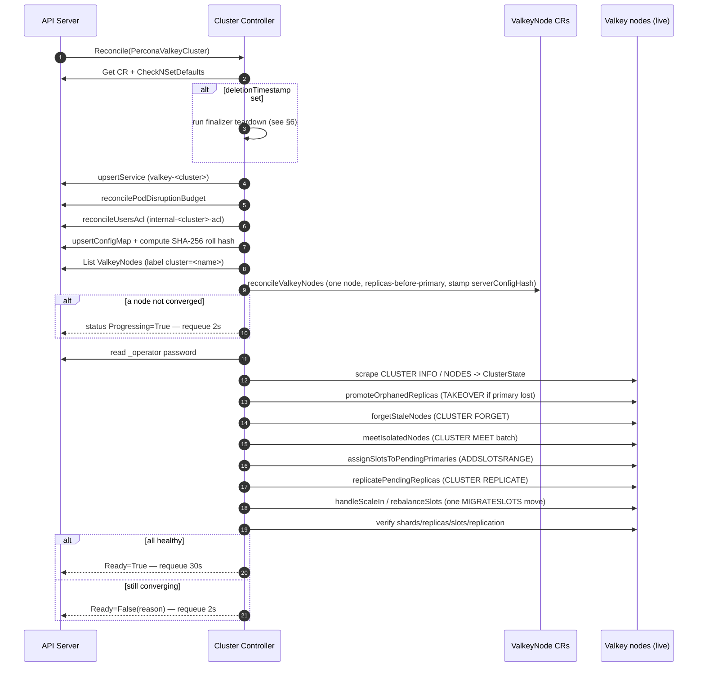
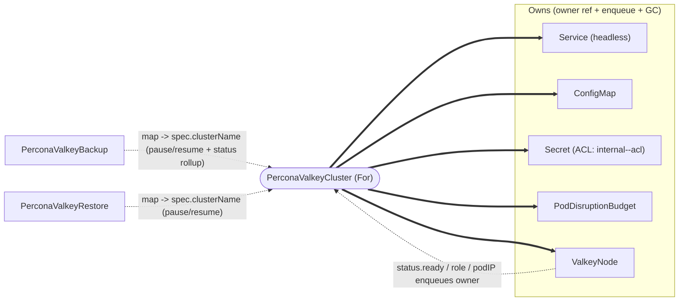
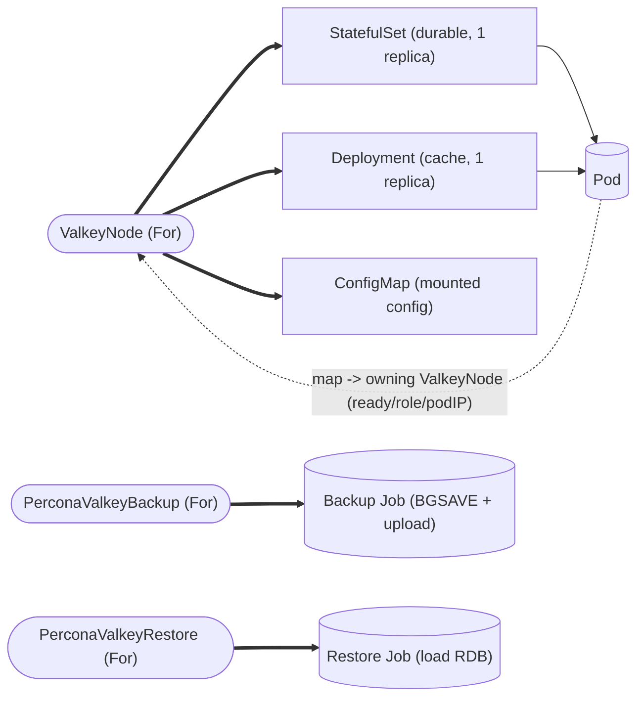
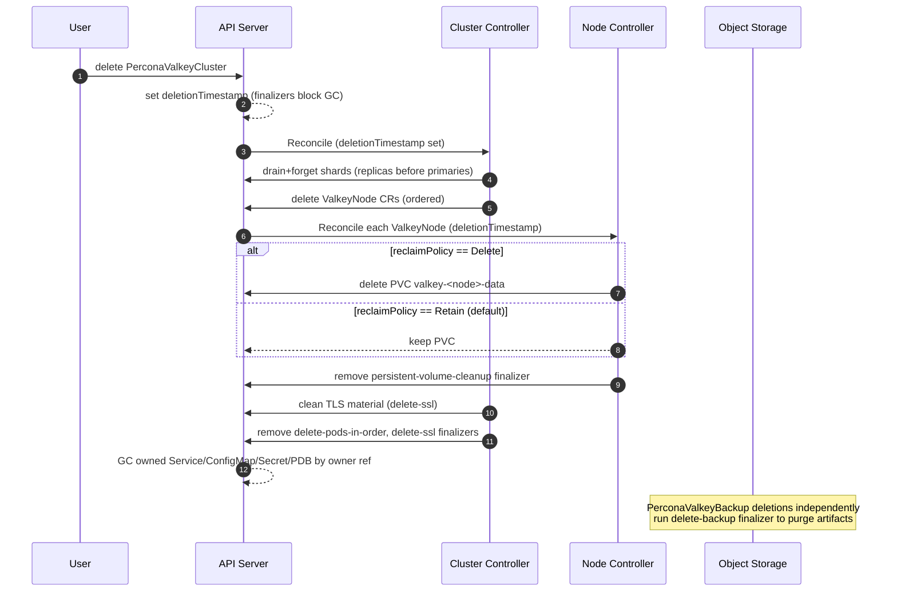
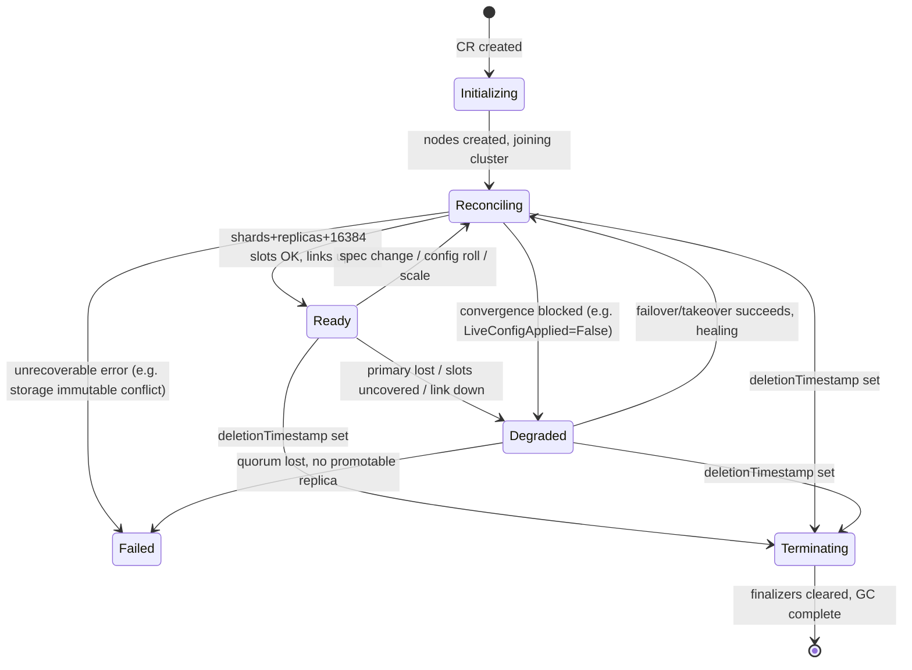

# Control Plane & Reconciliation

> **Abstract.** This document specifies the runtime behaviour of the Percona Operator for Valkey control plane: the four controllers (`PerconaValkeyCluster`, `ValkeyNode`, `PerconaValkeyBackup`, `PerconaValkeyRestore`), their ordered reconcile pipelines, the `Watches`/`Owns` wiring that drives requeues, the finalizer-based ordered-teardown protocol, the `metav1.Condition`→`status.state` derivation rules, and operator HA (leader election, namespaced vs. cluster-wide watch). It is grounded in the upstream `valkey-operator` two-CRD model (cluster→node) and the Percona Operator-SDK trio (PXC/PSMDB/PS) conventions, renamed and extended to the `valkey.percona.com` API group and the Percona backup/restore CRD trio. For the CRD field schemas referenced here see [API & CRD Design](03-api-design.md); for resource layout and naming helpers see [Overview & Design Principles](00-overview.md) and [Data Plane](05-data-plane.md); for the backup/restore data path see [Backup & Restore](06-backup-restore.md); for engine-image upgrades and the version service see [Upgrades & Version Management](09-upgrades-versioning.md).

---

## 1. Controller inventory and responsibilities

The operator binary (`cmd/manager/`) registers exactly four controllers with a single controller-runtime `Manager`. Each lives in its own package under `pkg/controller/<resource>/` with an `add_<resource>.go` that calls `SetupWithManager`, mirroring the Percona SDK trio layout (`pkg/controller/ps`, `psbackup`, `psrestore`).

| Controller | Package | Reconciles (`For`) | Audience | Core responsibility |
|---|---|---|---|---|
| **Cluster** | `pkg/controller/perconavalkeycluster/` | `PerconaValkeyCluster` (`pvk`) | user-facing | Owns topology. Renders config, creates/updates one `ValkeyNode` per `(shardIndex, nodeIndex)` one-at-a-time, scrapes live `CLUSTER NODES`/`INFO`, drives `CLUSTER MEET`/`ADDSLOTSRANGE`/`REPLICATE`/`MIGRATESLOTS`, performs proactive failover before rolling primaries, derives `status.state`. |
| **Node** | `pkg/controller/valkeynode/` | `ValkeyNode` (`vkn`) | internal only | Maps 1:1 to a pod. Owns a 1-replica StatefulSet (durable) **or** Deployment (cache), its PVC, ConfigMap mount, applies live `CONFIG SET` for the allowlisted subset, and publishes `status.{ready,role,podIP}` read from the live pod and `INFO`. |
| **Backup** | `pkg/controller/perconavalkeybackup/` | `PerconaValkeyBackup` (`pvk-backup`) | user-facing | Phase machine that runs a per-shard RDB snapshot (`BGSAVE`) Job, ships artifacts to object storage, and records `status.{state,destination,completed}`. Holds the artifact-cleanup finalizer. |
| **Restore** | `pkg/controller/perconavalkeyrestore/` | `PerconaValkeyRestore` (`pvk-restore`) | user-facing | Phase machine that pauses/quiesces the target cluster (or bootstraps a new one), loads RDB per shard, validates 16384-slot coverage, then resumes reconciliation. |

**Design rule — separation of concerns is load-bearing.** The Cluster controller never touches a StatefulSet, PVC, or pod directly; it only writes `ValkeyNode` specs (and reads their status) and issues Valkey cluster commands. The Node controller never reasons about slots, shards, or sibling nodes; it only converges one pod. This keeps each reconcile loop small, idempotent, and independently testable (envtest can exercise the Node controller without a real cluster, and the Cluster controller against fake `ValkeyNode` status). It also means a `ValkeyNode` is an *implementation detail*: users create `PerconaValkeyCluster`, the operator creates `ValkeyNode`s with owner references for GC.

**Naming reminder (from the charter, used verbatim below).** `ValkeyNode` CR name = `<cluster>-<shardIndex>-<nodeIndex>`; node-index `0` is the *initial* primary; child workloads/PVCs are prefixed `valkey-` (`valkey-<cluster>-0-0`, PVC `valkey-<node>-data`). The **live** role is always read from `CLUSTER NODES`/`INFO`, never from the name or labels — post-failover, node `…-0-1` may be the primary while `…-0-0` is a replica.

---

## 2. `PerconaValkeyCluster` reconcile pipeline

This is the heart of the operator. The loop is a **single linear pipeline of phases**; each phase is idempotent and **returns early with a short requeue** (`2s`) when it has made progress or is waiting, so that the next reconcile observes fresh cluster state before advancing. This "one effect per reconcile, then requeue" discipline (adopted directly from upstream) is what makes the loop safe against partial failure: a crash between any two phases simply re-runs from the top.

### 2.1 Ordered phases

> Requeue legend: **[fast 2s]** = made progress / waiting on convergence; **[scheduling]** = `handlePodSchedulingIssues` may surface a longer backoff; **[steady 30s]** = healthy, periodic re-verify.

0. **Fetch CR & defaults.** `Get` the `PerconaValkeyCluster`. On `NotFound`, delete per-cluster metrics and return (the object is gone; GC handles children via owner refs). Run `CheckNSetDefaults(ctx, platform)` (Percona convention — a receiver method on the CR type, not a separate webhook): stamp `spec.crVersion` (defaulting to the operator's `major.minor` from `pkg/version/version.txt` when empty), fill secret names, probe timeouts, resource defaults, and resolve `spec.upgradeOptions`. **crVersion gate:** if `spec.crVersion` is newer than the running operator's `major.minor`, set `Ready=False/ReasonUnsupportedCRVersion` and stop (an older operator must not reconcile a CR authored for a newer API); an older `crVersion` is accepted and drives version-specific upgrade behaviour (see [Upgrades & Version Management](09-upgrades-versioning.md)). Engine-image smart updates from `spec.upgradeOptions {apply, schedule}` are driven by the version service and *resolved* here (the target image is computed in this phase), but the image-roll itself is **not** a separate pipeline phase: it is **integrated into step 6** (the one-at-a-time `ValkeyNode` rolling-update step) and reuses the §11 one-at-a-time mechanism. Doc 09 references the smart-update roll by **step 6**. **Deletion branch:** if `metadata.deletionTimestamp != nil`, jump to the finalizer teardown protocol in §6.

1. **Headless Service** — `upsertService`. Ensures the headless `Service` `valkey-<cluster>` exists for pod-direct addressing (cluster bus + client). On error: set `Ready=False/ReasonServiceError`, write status, return error (rate-limited backoff).

2. **PodDisruptionBudget** — `reconcilePodDisruptionBudget`. Ensures a PDB so voluntary disruptions never break per-shard quorum. On error: `Ready=False/ReasonPodDisruptionBudgetError`.

3. **ACL / system users** — `reconcileUsersAcl`. Renders user-defined `spec.users` plus the internal system users into the Secret `internal-<cluster>-acl` (Secret `type: valkey.io/acl`), mounted into every pod at `/config/users/users.acl` and referenced by `aclfile /config/users/users.acl`. The three system users are rendered **verbatim from the canonical least-privilege ACL spec** (the authoritative definitions are reproduced immediately below, and are byte-identical across [Data Plane](05-data-plane.md) and [Security Architecture](07-security.md)). The renderer fills each `#<sha256-hex...>` slot from the cluster's password material; the rendered file is deterministic (sorted users, fixed rule order) so its hash is suitable for triggering rolling restarts only on real ACL changes. The general grammar: every grant carries an explicit `+`/`-` prefix; a **bare** command (e.g. `+cluster`) grants **all** of that command's subcommands while `+cluster|info` grants only that one; categories use `+@<category>`; `resetchannels`/`resetkeys` flush the channel/key lists so the user starts from *deny*; a hashed password is the bare rule `#<sha256-hex>` (64 lowercase hex chars) and `>` (cleartext) must **not** be combined with `#`. On error: `Ready=False/ReasonUsersAclError`. **Pitfall guarded:** if a user defines `_operator`/`_exporter`/`_backup` themselves, the operator must not silently override — but it must also refuse to lock itself out; the CRD CEL validation rejects reserved names (see [API & CRD Design](03-api-design.md)).

   #### Valkey system-user ACLs (canonical, least-privilege)

   > Valkey 9 syntax. Every grant carries an explicit `+`/`-` prefix. A **bare** command (e.g. `+cluster`) grants **all** of that command's subcommands; `+cluster|info` grants only that one subcommand. `resetchannels` and `resetkeys` flush the channel/key pattern lists so the user starts from *deny* (no keyspace, no pub/sub). A hashed password is the bare rule `#<sha256-hex>` (64 lowercase hex chars); `>` is for cleartext and must **not** be combined with `#`. Passwords are sourced from the operator-managed Secret and injected verbatim by the renderer at the `#<...>` position.

   ```acl
   user _operator on #<sha256-hex-of-operator-password> resetchannels resetkeys -@all +cluster +config|get +config|set +info +client|setname +client|setinfo +replicaof +wait +ping
   user _exporter on #<sha256-hex-of-exporter-password> resetchannels resetkeys -@all +info +cluster|info +latency +ping
   user _backup   on #<sha256-hex-of-backup-password>   resetchannels resetkeys -@all +bgsave +lastsave +save +info +wait +ping +sync +psync +replconf
   ```

   **Rationale (one line per user):**

   - **`_operator`** — Cluster-orchestration user. Uses a **bare `+cluster`** because the operator drives nearly every CLUSTER subcommand (MEET, ADDSLOTSRANGE, SETSLOT, REPLICATE, FAILOVER, FORGET, MIGRATESLOTS, GETSLOTMIGRATIONS, NODES, INFO, SHARDS, MYID, RESET, plus 9.0's SYNCSLOTS for atomic slot migration); enumerating them invites silent drift as Valkey adds subcommands, while the still-tight `-@all` floor and `resetkeys`/`resetchannels` keep it off all keys and channels. Plus scoped `config|get`/`config|set`, `info`, `client|setname`/`client|setinfo`, `replicaof` (replication mode), `wait`, and `ping` — no broader `@admin`/`@dangerous` and no keyspace/pub-sub.
   - **`_exporter`** — Read-only metrics scraper: `+info`, `+cluster|info` (single subcommand only, **not** bare `+cluster`, since it must never orchestrate), `+latency` (LATEST/HISTORY/RESET; read-only metrics in practice), and `+ping` for liveness; `-@all` + `resetkeys`/`resetchannels` deny everything else, all keys, and all channels. Kept password-protected (not `nopass`) because the operator Secret already supplies a credential.
   - **`_backup`** — Snapshot + replication user; **the backup Job authenticates as `_backup`** (not `_operator`). Grants `+bgsave`, `+lastsave`, `+save`, `+info`, optional `+wait`, `+ping`, **plus `+sync`, `+psync`, `+replconf`** so the backup Job can capture the RDB by acting as a replica (SYNC-as-replica). No keyspace access (`resetkeys`) and no channels (`resetchannels`); `-@all` blocks everything else including CONFIG and CLUSTER. *(M6 security refactor: these snapshot + replication grants moved here off `_operator`, which is now orchestration-only.)*

   **Secret shape (single source of truth):** The operator builds a Kubernetes Secret of type **`valkey.io/acl`** named **`internal-<cluster>-acl`**, containing one data key whose value is the full ACL file (the three `user ...` lines above, deterministically ordered and rendered with each `#<sha256-hex...>` filled from the cluster's password material). It is mounted into every Valkey pod at **`/config/users/users.acl`** and referenced by the server config as **`aclfile /config/users/users.acl`**. Because the file is generated deterministically from the operator's Secret (sorted users, fixed rule order), the rendered output is byte-stable across reconciles, so the file hash is suitable for triggering rolling restarts only on real ACL changes.

4. **ConfigMap + roll hash** — `upsertConfigMap`. Renders the full `valkey.conf` (user config first so user wins where allowed, operator-managed base config last so base is override-proof: `cluster-enabled yes`, `protected-mode no` (safe only because in-cluster traffic is gated by ACL auth + TLS — see [Security Architecture](07-security.md)), `aclfile`, `dir`, `cluster-config-file /data/nodes.conf`, `tls-*`). `cluster-node-timeout` is **not** in the override-proof set: it defaults to the Valkey default (15000ms) and is user-tunable via `spec.config`, because a too-aggressive value triggers spurious failovers on brief network blips. Then compute `configHash = serverConfigRollHash(cluster)` — **SHA-256 over the rendered config with the live-settable keys (`maxmemory`, `maxmemory-policy`, `maxclients`) excluded** and with **sorted, order-insensitive** key serialization. Computing from `spec` (not by reading the ConfigMap back) avoids a cache-staleness race. On error: `Ready=False/ReasonConfigMapError`.

5. **List nodes.** `List` all `ValkeyNode`s with label `valkey.percona.com/cluster=<cluster>`. On error: `Ready=False/ReasonValkeyNodeListError`.

6. **Create/update ValkeyNodes one-at-a-time (smart-update / rolling-upgrade step)** — `reconcileValkeyNodes(cluster, nodes, configHash)`. Walks `(shardIndex, nodeIndex)` in **shard order, replicas before the primary**, and reconciles **exactly one** node per call (creating missing ones, or stamping `spec.serverConfigHash = configHash` to trigger a roll). **This is also the engine-image smart-update / rolling-upgrade step:** the image target resolved in step 0 from `spec.upgradeOptions {apply, schedule}` + version service is applied here by stamping the new image on the same one-at-a-time path (no distinct pipeline phase exists for image rolls — config-hash rolls and image rolls share this single mechanism, §11). Doc 09 cites this as **§2.1 step 6**. Before rolling a **primary** (config *or* image), it performs proactive failover (§10). Returns `requeue=true` if a node is not yet converged.
   - If `requeue`: call `handlePodSchedulingIssues` (surfaces `Unschedulable`/`ImagePull` reasons with a longer backoff **[scheduling]**); otherwise set `Ready=False/ReasonUpdatingNodes`, `Progressing=True`, write status, requeue **[fast 2s]**.

7. **Fetch operator password & build ClusterState** — `getValkeyClusterState`. Read `_operator` password from the system Secret `internal-<cluster>-acl` (on miss: `Ready=False/ReasonSystemUsersAclError`, requeue without error). Connect to every node address with `valkey-go` using `ForceSingleClient=true` (prevents redirect loops when talking to a single node), scrape `CLUSTER INFO` + `CLUSTER NODES` per node, parse flags/slots/replication-offset into `ClusterState`. `defer state.CloseClients()`.

8. **Promote orphaned replicas** — `promoteOrphanedReplicas(state)`. If a primary is lost and its slots would otherwise be uncovered, issue `CLUSTER FAILOVER TAKEOVER` to the orphaned replica with the highest last-known `slave_repl_offset` **before** any `FORGET`, so slots stay continuously owned. (Its `master_link_status` is necessarily `down` — the primary is gone — so synced-link gating from §10 does not apply here; offset is the only available freshness signal, and `TAKEOVER` is used precisely because graceful `CLUSTER FAILOVER` cannot complete without a reachable primary.) If it acted: emit `FailoverInitiated`, requeue **[fast 2s]**.

9. **Forget stale nodes** — `forgetStaleNodes(state, nodes)`. `CLUSTER FORGET` nodes present in gossip but absent from the desired topology, broadcasting the FORGET to every surviving node (so the 60s ban window is consistent cluster-wide); an "unknown node" reply for an already-forgotten id is treated as success.

10. **Meet isolated nodes** — `meetIsolatedNodes(state)`. Batch `CLUSTER MEET` for every isolated pending node (`cluster_known_nodes <= 1`). If any meet happened: emit `ClusterMeetBatch`, requeue **[fast 2s]** (gossip needs a beat to propagate before slots can be assigned).

11. **Assign slots to pending primaries** — `assignSlotsToPendingPrimaries(state, nodes)`. Batch `CLUSTER ADDSLOTSRANGE` to non-isolated primaries that own zero slots, computing ranges deterministically by address-sorted order (prevents churn). Emit `PrimariesCreated`/`SlotsAssigned`; requeue **[fast 2s]**.

12. **Replicate pending replicas** — `replicatePendingReplicas(state, nodes)`. Batch `CLUSTER REPLICATE <primaryId>` for replica nodes not yet attached (skip genuine new primaries handled in step 11). Emit `ReplicasAttached`; requeue **[fast 2s]**.

13. **Scale-in** — `handleScaleIn(state, nodes)`. If desired shards < current, drain the excess shard's slots into survivors (`PlanDrainMove` → atomic `CLUSTER MIGRATESLOTS`), then delete its `ValkeyNode`s once it owns zero slots (cleanup via `forgetStaleNodes` next pass). Any drain/delete returns requeue **[fast 2s]**.

14. **Rebalance** — `rebalanceSlots(allShards)`. **One deterministic `(src,dst,slots)` move per reconcile** via `PlanRebalanceMove` + `CLUSTER MIGRATESLOTS`, tolerating ±1-slot rounding. Returns `false`/no-op when balanced. If it moved: emit `SlotsRebalancing`, requeue **[fast 2s]**.

15. **Verify & mark Ready.** Confirm shard count, per-shard replica count, all 16384 slots assigned and covered (`cluster_state:ok` from `CLUSTER INFO`), and `master_link_status:up` on **every** replica. If all pass: set `Ready=True/ReasonClusterHealthy`, clear `Progressing`, set `ClusterFormed=True`, `SlotsAssigned=True`, write status, requeue **[steady 30s]**. If any check fails: set the appropriate `False` condition (`MissingShards`, `RebalancingSlots`, …) and requeue **[fast 2s]**.

### 2.2 Sequence diagram — one full cluster reconcile



---

## 3. `ValkeyNode` reconcile pipeline

The Node controller converges a single pod. It is intentionally small and never reasons about the cluster.

### 3.1 Ordered phases

1. **Fetch & persistence finalizer** — `reconcilePersistenceFinalizer(node)`. Adds the finalizer `valkey.percona.com/persistent-volume-cleanup` **iff** `spec.persistence != nil && reclaimPolicy == Delete`; removes it otherwise. On `deletionTimestamp`, run the PVC cleanup branch (delete PVC, remove finalizer) — see §6.3. Default `reclaimPolicy` is **`Retain`** (durable-by-default; orphan PVCs survive). If it mutated the finalizer set, requeue **[1s]**.

2. **WorkloadType dispatch (immutable).** `spec.workloadType ∈ {StatefulSet, Deployment}` is immutable (CEL-enforced). `StatefulSet` is the **default** (durable). `Deployment` is cache-only and is **forbidden with persistence** (no PVC) — CEL rejects the combination.

3. **ConfigMap / mounted config.** Use the parent's ConfigMap (`spec.serverConfigMapName` set by the Cluster controller) or render the node's own. The `serverConfigHash` from the parent is stamped as a **pod-template annotation** so a hash change rolls the pod (the rolling-restart mechanism — §11).

4. **Workload + PVC.** `CreateOrUpdate` the 1-replica StatefulSet (with `volumeClaimTemplate` → PVC `valkey-<node>-data`) or Deployment. PVC size may **expand only**; storage class and shrink are immutable (CEL + reconcile guard).

5. **Live CONFIG SET** — `applyLiveConfig(node)`. Runs **before** the `Ready` derivation so its outcome can gate readiness. If the pod is not Ready, requeue **[10s]**. Otherwise apply the allowlisted live-settable keys (`maxmemory`, `maxmemory-policy`, `maxclients`) via `CONFIG SET` over a `ForceSingleClient` connection to `status.podIP`. On success set `LiveConfigApplied=True`; on `CONFIG SET` error (e.g. `maxmemory=<garbage>`) set `LiveConfigApplied=False`. When no live keys apply, set `LiveConfigApplied=True` with reason `NoLiveKeys` (do **not** leave it unknown, or readiness gating in step 6 would stall). Note these keys are **excluded from the config-roll hash** (§11), so a bad value is *only* caught here — it never triggers a pod roll.
   - **Escalation on `CONFIG SET` failure.** `LiveConfigApplied=False` forces `status.ready=false` (step 6), which **blocks rolling progress**: the Cluster controller's §2.1 step 6 waits on `status.ready`, so the whole one-at-a-time roll halts on this node. The Node controller **retries `CONFIG SET` each reconcile with controller-runtime exponential backoff**, but **never auto-remediates an invalid key** — it cannot guess a valid value, so it fails closed and surfaces the bad key via the condition message + a `Warning` event. **Recovery is user-driven only:** the user must correct `spec.config` (the offending live-settable value), after which the next reconcile applies it and clears the condition. **Recommended alert:** page when `LiveConfigApplied` stays `False` for **> ~5min** on any `ValkeyNode` (a wedged live-config roll that no amount of retrying will clear without a spec fix).

6. **Status: ready / role / podIP.** Re-`Get` the pod. Set `status.podIP` (cleared to `""` when the pod is absent), and when the pod is `Ready`, derive `status.role` from live `INFO replication` — **never** inferred from the node name. **Terminology mapping:** the Valkey engine reports `role:master` / `role:slave` in `INFO replication`; the operator **maps these to the Percona-API terms `primary` / `replica`** when writing `status.role` (`role:master` → `primary`, `role:slave` → `replica`). The CR API never surfaces `master`/`slave`. Set `status.ready=true` / the `Ready` condition only when the pod is Ready **and** all gating conditions hold (`PersistentVolumeClaimReady`, `PersistentVolumeClaimSizeReady`, **and `LiveConfigApplied=True`**). A `LiveConfigApplied=False` therefore drives `status.ready=false`, which is precisely what **blocks cluster progress** (the Cluster controller waits on `status.ready` in §2.1 step 6) until the user fixes `spec.config` — retried each reconcile, no other automatic recovery.

7. **Requeue** **[60s]** steady (periodic re-verify of pod readiness and live config).

**Status-lag pitfall (called out explicitly).** The Cluster controller reads `ValkeyNode.status.ready` to drive progress. If status updates lag pod-Ready events, the cluster stalls waiting for `ready=true`. The Node controller therefore writes status **eagerly** (after the pod transitions) and the in-memory `node.Status.{PodIP,Ready}` are refreshed from the just-written values before `applyLiveConfig` consumes them, so a single reconcile sees a consistent view. `status.podIP`/`status.role` are read from the *live* pod each pass — a stale IP after eviction self-corrects on the next reconcile; commands sent to a momentarily-stale IP fail fast and retry.

---

## 4. Backup & Restore reconcile loops (phase machines)

Both are **phase machines** keyed on `status.state` (terminal states match the Percona convention: `Succeeded`, `Failed`, `Error`), Job-orchestrated like PXC/PS `pxcbackup`/`psbackup`. They resolve storage details from the parent cluster's `spec.backup.storages[<storageName>]` (the Percona "backup CRD minimalism" rule — the backup CR carries only `clusterName` + `storageName`).

### 4.1 `PerconaValkeyBackup` phases

| State | Action | Transition |
|---|---|---|
| *(empty)* | `CheckNSetDefaults`; add finalizer `valkey.percona.com/delete-backup`; resolve `storageName`→storage config (fail fast on miss); hydrate `status.storageInfo`, `status.destination` (prefixed `s3://`/`gs://`/`azure://`/`pvc/`) | → `New` |
| `New` | Acquire per-storage serialization Lease (block if another backup/restore holds it); create per-shard snapshot **Job** that runs `cmd/valkey-backup/` against each shard's **primary** (`BGSAVE`, then upload RDB + shard/slot metadata) | → `Running` |
| `Running` | Watch Job; poll the sidecar HTTP status endpoint | Job success → `Succeeded`; failure → `Failed`; deadline exceeded (`activeDeadlineSeconds`) → `Error` |
| `Succeeded`/`Failed`/`Error` | Set `status.completed`; release Lease; stop requeuing (terminal) | — |

Scheduled backups are spawned from cron entries declared in the **cluster** spec (`robfig/cron` registered/updated inside the Cluster reconcile, lifecycle tied to the CR — never a detached goroutine). Retention/GC is finalizer-driven (§6.2). **PITR (AOF streaming) is explicitly deferred** beyond v1alpha1; the backup model is RDB snapshot only — see [Backup & Restore](06-backup-restore.md).

### 4.2 `PerconaValkeyRestore` phases

| State | Action | Transition |
|---|---|---|
| *(empty)* | `CheckNSetDefaults`; resolve `backupName` xor `backupSource`; acquire serialization Lease; verify the target cluster is reconcile-paused/quiescable | → `New` |
| `New` | Bootstrap a fresh cluster from the backup set **or** quiesce the in-place target; create restore Job(s) that load each shard's RDB | → `Running` |
| `Running` | Watch Job; on completion verify **16384-slot coverage** across the restored shards | coverage OK → `Succeeded`; load failure → `Failed`; partial coverage → `Error` |
| `Succeeded`/`Failed`/`Error` | Resume cluster reconciliation; release Lease; terminal | — |

Concurrency safety uses a Kubernetes **Lease + in-process `sync.Map`** (Percona pattern) so a backup and a restore can never run against the same cluster simultaneously; the cluster's `SmartUpdate`-equivalent rolling restart (§11) also blocks while a backup Job is running, preventing pod churn from corrupting the snapshot stream.

---

## 5. Watches and `Owns` wiring (`SetupWithManager`)

Each controller declares the resources it owns (so create/update/delete of a child enqueues the owner) and any cross-resource `Watches` (so an unowned dependency change triggers reconciliation of the right owner via a mapping function).

Two complementary edge kinds appear below: a solid arrow is an **`Owns`** relationship (owner reference set; child create/update/delete enqueues the owner and the API server GCs the child), and a dotted arrow is a **`Watches`** relationship (an unowned object change is mapped to an owner key and enqueues it). To keep the picture legible it is split into two views — the Cluster controller (which owns the most) first, then the Node/Backup/Restore controllers.

**View A — Cluster controller `For(PerconaValkeyCluster)`:**



**View B — Node, Backup, and Restore controllers:**



**Cluster controller** (`For(&PerconaValkeyCluster{})`):
`Owns(&Service{})`, `Owns(&ConfigMap{})`, `Owns(&Secret{})`, `Owns(&policyv1.PodDisruptionBudget{})`, `Owns(&ValkeyNode{})`. A `ValkeyNode` status flip (ready/role) re-enqueues its owning cluster, which is how step 6/15 see progress. (Mirrors upstream `Owns(Service/ConfigMap/ValkeyNode/Secret/PodDisruptionBudget)`.) It additionally `Watches` `PerconaValkeyBackup`/`PerconaValkeyRestore` mapped to `spec.clusterName` so restore-driven pause/resume and backup-running gating take effect promptly.

**Node controller** (`For(&ValkeyNode{})`):
`Owns(&appsv1.StatefulSet{})`, `Owns(&appsv1.Deployment{})`, `Owns(&ConfigMap{})`. It `Watches` `Pod` (mapped to the owning `ValkeyNode` via owner ref) so a pod becoming Ready or changing IP triggers a status update without waiting for the 60s steady requeue.

**Backup / Restore controllers**: `For(&PerconaValkeyBackup{})` / `For(&PerconaValkeyRestore{})`, each `Owns(&batchv1.Job{})` so Job completion enqueues the phase machine.

---

## 6. Finalizers and ordered deletion

Finalizers are prefixed `valkey.percona.com/` (Percona convention). Because Kubernetes runs finalizers in **arbitrary** order, ordering is enforced *within* the cluster controller's teardown branch, not by relying on finalizer-array order.

| Finalizer | On resource | Purpose |
|---|---|---|
| `valkey.percona.com/delete-pods-in-order` | `PerconaValkeyCluster` | Ordered cluster teardown (replicas before primaries, shard by shard) so gossip/slots wind down cleanly. |
| `valkey.percona.com/delete-ssl` | `PerconaValkeyCluster` | Clean up operator-issued TLS material not GC'd by owner refs. |
| `valkey.percona.com/delete-backup` | `PerconaValkeyBackup` | Delete the backup artifacts in object storage before the CR is removed (retention/GC). |
| `valkey.percona.com/persistent-volume-cleanup` | `ValkeyNode` | Delete the PVC `valkey-<node>-data` **only** when `reclaimPolicy=Delete`. Default `Retain` ⇒ no finalizer, PVC is preserved. |

### 6.1 Cluster ordered teardown
On `deletionTimestamp`, the cluster controller, while its finalizer is present:
1. Issues per-shard graceful shutdown: drains/forgets in replicas-before-primary order so the last primary releases its slots last.
2. Deletes `ValkeyNode`s (owner-ref GC also handles this, but explicit ordered deletion avoids quorum thrash mid-teardown).
3. Cleans TLS material (`delete-ssl`).
4. Removes the finalizers; the API server then garbage-collects owned `Service`/`ConfigMap`/`Secret`/`PDB` by owner reference.

### 6.2 Backup artifact cleanup
On `PerconaValkeyBackup` deletion, the backup controller deletes the remote objects at `status.destination`, then removes `delete-backup`. Retention policies trigger CR deletion (and thus this finalizer) on schedule.

### 6.3 PVC retain/delete
The Node controller's `valkey.percona.com/persistent-volume-cleanup` only exists when `reclaimPolicy=Delete`. On deletion it deletes the PVC (ignoring `NotFound`) and removes the finalizer. With the default `Retain`, the PVC survives node deletion — protecting data during scale-in or accidental CR removal.

### 6.4 Re-entrancy semantics, wedge scenarios, and the finalizer-audit loop

**Re-entrancy / ordering semantics.** Kubernetes makes **no guarantee about the order in which finalizers run** — they are an unordered set on `metadata.finalizers`, and the API server removes the object only once the set is empty. The operator therefore **does not rely on finalizer-array order** for correctness. Instead each teardown is **idempotent and re-entrant**: every reconcile of a deleting object re-derives "what still needs cleaning" from live state (e.g. "are there `ValkeyNode`s still present?", "do the remote backup objects still exist?") and performs the next outstanding action, removing its finalizer only once that action has verifiably completed. A reconcile that crashes or is preempted mid-teardown simply re-runs from the top on the next pass and skips already-completed steps. **Semantic ordering** (replicas-before-primaries, slots drained before node deletion, TLS cleaned before finalizer removal) is enforced **within the cluster controller's own teardown branch** (§6.1) — i.e. inside one reconcile's control flow — not by the finalizer set's iteration order.

**Wedge scenarios (CR stuck `Terminating`).** Because a finalizer is removed *only* after its cleanup succeeds, a cleanup that **persistently fails** leaves the finalizer in place and the CR pinned in `Terminating` indefinitely (the API server will not GC an object with a non-empty finalizer set). Concrete wedges:
- **Backup artifact deletion fails** (object-store outage, revoked/expired credentials, bucket deleted, network policy) → `delete-backup` is never removed → the `PerconaValkeyBackup` CR is stuck `Terminating`.
- **PVC deletion fails / hangs** (storage driver wedged, volume still attached/`Terminating`) → `persistent-volume-cleanup` lingers → the `ValkeyNode` (and transitively the cluster teardown) stalls.
- **Cluster drain/forget cannot complete** (an unreachable node never releases its slots) → ordered teardown blocks before finalizer removal.

In every wedge, the controller keeps emitting a `Warning` event + a `False` condition with the failing reason each retry, so the wedge is observable rather than silent.

**Periodic finalizer-audit reconcile.** To keep wedged teardowns retrying (rather than going quiet once controller-runtime's per-object backoff stretches out), the operator runs a **periodic finalizer-audit**: deleting objects (`deletionTimestamp != nil`) that still carry an operator finalizer are **re-enqueued on a steady interval** so each stuck finalizer's cleanup is retried indefinitely. The audit is purely a retry/visibility mechanism — it **never force-removes a finalizer** (doing so could orphan real artifacts); it only re-attempts the legitimate cleanup and refreshes the `Warning`/condition so operators see the object is still wedged and why.

### 6.5 Break-glass runbook — force-deleting a wedged CR

When a teardown is wedged on an unrecoverable external dependency (object store permanently gone, storage backend that will never release a volume) and you must clear the stuck object **immediately**, force-remove the blocking finalizer(s). **This bypasses the operator's cleanup, so it can orphan resources** — only do it when you accept that and will clean up out-of-band.

1. **Confirm the wedge and its cause** — inspect the object and its events:
   ```sh
   kubectl get perconavalkeybackup <name> -o jsonpath='{.metadata.deletionTimestamp} {.metadata.finalizers}{"\n"}'
   kubectl describe perconavalkeybackup <name>   # read the Warning events for the failing reason
   ```
2. **Force-remove the offending finalizer** (drops it from the set so the API server can GC the object):
   ```sh
   kubectl patch perconavalkeybackup <name> --type=json \
     -p='[{"op":"remove","path":"/metadata/finalizers/0"}]'
   # or clear all finalizers: kubectl patch ... -p='[{"op":"replace","path":"/metadata/finalizers","value":[]}]'
   ```
3. **Force-delete with no grace period** if the object still lingers:
   ```sh
   kubectl delete perconavalkeybackup <name> --grace-period=0 --force
   ```

> **⚠ Orphaned-resource warning.** Force-removing a finalizer skips the cleanup it was guarding. **Whatever that finalizer was responsible for is now orphaned and will NOT be reclaimed by the operator:**
> - `delete-backup` → **backup artifacts remain in object storage** (and keep incurring cost) — delete the `s3://`/`gs://`/`azure://`/`pvc/` objects at the old `status.destination` by hand.
> - `persistent-volume-cleanup` → the **PVC `valkey-<node>-data` (and its PV) survive** — delete them manually if the data is no longer wanted.
> - cluster `delete-pods-in-order` / `delete-ssl` → child workloads still GC by owner ref, but **operator-issued TLS material may be left behind** — remove it by hand.
>
> Force-deletion is a last resort: prefer fixing the underlying dependency (restore object-store credentials, unstick the storage driver) and letting the periodic finalizer-audit (§6.4) complete the teardown cleanly.

### 6.6 Sequence diagram — finalizer-driven ordered deletion



---

## 7. Status conditions → derived state machine

The CR carries standard `metav1.Condition`s with `ObservedGeneration` (set via a `setCondition` helper). `status.state` is **derived** from those conditions by a fixed **priority** so a human/dashboard reads one field.

**Cluster condition types:** `Ready`, `Progressing`, `Degraded`, `ClusterFormed`, `SlotsAssigned`.
**Representative reasons** (string values; the Go constants are `Reason`-prefixed, e.g. `ReasonServiceError = "ServiceError"`, matching the `Ready=False/Reason…` references in §2): `ClusterHealthy`, `Reconciling`, `UpdatingNodes`, `AddingNodes`, `MissingShards`, `RebalancingSlots`, `ServiceError`, `ConfigMapError`, `UsersAclError`, `PodDisruptionBudgetError`, `ValkeyNodeListError`, `SystemUsersAclError`, `UnsupportedCRVersion`.
**ValkeyNode condition types:** `Ready`, `PersistentVolumeClaimReady`, `PersistentVolumeClaimSizeReady`, `LiveConfigApplied`.

**Derivation priority (highest first):** `deletionTimestamp → Degraded → Ready → Progressing → (else) Failed`. The three condition *types* consulted are `Degraded`, `Ready`, and `Progressing` (`Reconciling`/`Initializing`/`Failed`/`Terminating` are derived *states* / condition *reasons*, not condition types — see the type list above):
- If `metadata.deletionTimestamp != nil` → `state = terminating` (checked first so a deleting cluster never reports `ready`/`degraded`).
- else if `Degraded=True` → `state = degraded`.
- else if `Ready=True` → `state = ready`.
- else if `Progressing=True` → `state = reconciling` (or `initializing` before `ClusterFormed=True` is ever set).
- else → `state = failed`.

**`status.state` is always recomputed, never written directly.** On every reconcile the controller (re)evaluates the `Degraded`/`Ready`/`Progressing` condition types through the priority rule above and **overwrites** `status.state` from the result — no code path assigns `status.state` as a primitive. This guarantees `status.state` can never disagree with the conditions array: the conditions are the source of truth and `state` is a pure projection of them.

**`observedGeneration` is set at end-of-reconcile and may lag `metadata.generation`.** The controller writes `status.observedGeneration = metadata.generation` only at the **successful tail** of a reconcile, after all phases have run. Consequently, between a `spec` edit (which bumps `metadata.generation`) and the reconcile that finishes acting on it, `status.observedGeneration < metadata.generation` — and `status.state` may still reflect the *previous* spec. A loop that keeps early-returning (e.g. a wedged live-config roll, §3.1 step 5) can leave `observedGeneration` lagging indefinitely.

**Consumers must watch BOTH `status.state` and `observedGeneration`.** Reading `status.state` alone is insufficient: a `ready` state that predates the latest spec edit is stale. A correct readiness check is "`status.state == ready` **and** `status.observedGeneration == metadata.generation`" — only then has the operator both converged *and* acted on the current spec. **Recommended alert:** page when `status.observedGeneration != metadata.generation` for **> ~15min** (the operator is stuck and not making the spec real — distinct from, and complementary to, the `LiveConfigApplied=False > ~5min` alert in §3.1 step 5).

Recommended printer columns (kubebuilder): `State`, `Reason`, `ReadyShards`, `Age`.



**Event recording.** Each major action emits a Kubernetes `Event` (Normal or Warning): `ServiceCreated`, `ConfigMapCreated`, `ValkeyNodeCreated`, `ClusterMeetBatch`, `PrimariesCreated`, `ReplicasAttached`, `SlotsRebalancing`, `SlotsDraining`, `FailoverInitiated`, `FailoverCompleted`, plus `Warning` events on every error path. Events complement conditions: conditions express *current state*, events express *what just happened* (and are rate-limited/aggregated by Kubernetes).

---

## 8. Leader election and operator HA

- **Leader election: ON by default** (`--leader-elect`, controller-runtime `LeaderElectionID` via a coordination.k8s.io `Lease` in the operator namespace). Run the operator Deployment with `replicas: 2+`; only the leader reconciles, standbys idle and take over on lease loss. This is the recommended production posture; single-replica is acceptable for dev.
- **Why a single active reconciler matters here:** the cluster loop issues stateful Valkey commands (`MEET`/`ADDSLOTSRANGE`/`MIGRATESLOTS`/`FAILOVER`). Two concurrent reconcilers could double-issue migrations. Leader election guarantees a single writer; the backup/restore **Lease + `sync.Map`** adds a second, finer lock for snapshot serialization.
- **Kubernetes Lease-based election mechanics (controller-runtime defaults).** Election is implemented over a single `Lease` object using three tunables:
  - **`LeaseDuration` (~15s)** — how long a non-leader waits without a renewal before it considers the leader dead and tries to acquire.
  - **`RenewDeadline` (~10s)** — how long the *current* leader keeps trying to renew before it gives up leadership and **stops reconciling** (so it never keeps acting past a lease it can no longer hold).
  - **`RetryPeriod` (~2s)** — how often both leader and candidates poll/retry the Lease.
  The acquiring replica writes its identity (`holderIdentity`) and a renew timestamp into the Lease; the leader re-`Update`s it every `RetryPeriod`.
- **Standby takeover on lease loss.** When the leader stops renewing (crash, OOM, network partition, node drain), its `RenewDeadline` elapses and it self-demotes; after `LeaseDuration` passes without renewal, a standby observes the stale Lease, acquires it (writes its own `holderIdentity`), and **only then starts its controllers**. Worst-case failover latency is bounded by roughly `LeaseDuration + RetryPeriod` (~15–17s) — there is a deliberate quiet window with **no** active reconciler, which is correct: better a brief gap than two reconcilers issuing overlapping cluster commands.
- **Split-brain mitigation via lease params.** The lease invariant prevents split-brain: the old leader **stops reconciling at `RenewDeadline`**, which is strictly **less than** the `LeaseDuration` a candidate must wait before acquiring — so the previous holder has already gone passive before any successor can win the Lease. Keep `RenewDeadline < LeaseDuration` (the defaults satisfy this); do **not** shrink `LeaseDuration` toward `RenewDeadline`, or a slow renewal on a busy API server can let a standby acquire while the old leader still believes it holds the lease (true split-brain → double-issued migrations). If anything, *raise* `LeaseDuration`/`RenewDeadline` on congested clusters to trade slower failover for a wider safety margin.
- **Forcing a leader change.** To deterministically move leadership (e.g. to drain the node running the active replica, or to recover from a thrashing leader), **delete the Lease object**: `kubectl delete lease <leader-election-id> -n <operator-namespace>`. The next candidate to poll (within `RetryPeriod`) recreates and acquires it; a rolling restart / `kubectl rollout restart` of the operator Deployment achieves the same effect more gracefully.
- **Surfacing leader-election thrash via metrics.** controller-runtime exports leader-election signals (e.g. `leader_election_master_status` per identity, and leader-change/acquire counters) on the operator's metrics endpoint. **Alert on thrash:** a rapidly toggling `leader_election_master_status` or a climbing leader-transition rate means the holder cannot renew within `RenewDeadline` (API-server latency, CPU starvation, or too-tight lease params) — each flip drops the quiet no-reconciler window onto the cluster. Treat sustained transitions as a paging condition and remediate by relieving API-server/CPU pressure or widening `LeaseDuration`/`RenewDeadline` (see [Observability](08-observability.md)).
- **Namespaced vs. cluster-wide watch.** Default = **single-namespace** (operator watches its own namespace; least privilege). Cluster-wide (`WATCH_NAMESPACE=""`) is opt-in and ships as the **`cw-bundle.yaml`** variant with `ClusterRole`/`ClusterRoleBinding`; the namespaced install (`bundle.yaml`) uses `Role`/`RoleBinding`. Both are generated under `deploy/` (Percona convention) — see [Distribution & Release](10-distribution-release.md).
- **Structured logging** via `logf.FromContext(ctx)` with the reconciled object in scope; leader identity and reconcile keys are logged for traceability.

---

## 9. Error handling, requeue/backoff, and re-fetch-before-update

- **Re-fetch before update (mandatory rule).** Every controller `Get`s the object at the top of `Reconcile` and re-`Get`s (or uses `CreateOrUpdate`/`Patch`) immediately before any write, so it never writes against a stale `resourceVersion`. Status writes use a fresh read of the object (`status.go` `setCondition` operates on the freshly-fetched CR) — never trusting in-memory status, which would race the version-service/backup crons.
- **Requeue taxonomy:**

  | Situation | Requeue | Rationale |
  |---|---|---|
  | Made progress / waiting on convergence (meet, slots, replicate, rebalance, node not ready) | `2s` | tight loop to observe fresh cluster state |
  | Finalizer set mutated (node) | `1s` | re-enter to act on the now-present finalizer |
  | Pod not yet Ready (node, before live config) | `10s` | avoid hammering an unready pod |
  | Healthy cluster periodic re-verify | `30s` | cheap drift detection without API load |
  | Node steady periodic re-verify | `60s` | live-config + readiness recheck |
  | Returned `error` | controller-runtime exponential backoff | transient API/connection failures |
- **Idempotency everywhere.** `CreateOrUpdate` for k8s objects. The Valkey cluster commands are **made effectively idempotent by precondition guards**, since several are *not* idempotent on their own: `CLUSTER MEET` and `CLUSTER REPLICATE` re-issue as no-ops, but `CLUSTER ADDSLOTSRANGE` errors with "slot is already busy" if a slot is owned (guarded by only targeting primaries that own *zero* slots, step 11), `CLUSTER MIGRATESLOTS` errors if a migration for those slots is already in flight (guarded by the one-move-per-reconcile planner re-reading live ownership, steps 13–14), and `CLUSTER FORGET` errors on an unknown node and enforces a 60s ban window (guarded by only forgetting node-ids still present in gossip, step 9 — and a `NotFound`/already-forgotten reply is treated as success). A crash mid-pipeline re-runs from phase 0 and these guards prevent double effect.
- **Fail-closed on user misconfig:** an invalid live-settable value (`LiveConfigApplied=False`) or a missing `storageName` halts the relevant loop with a clear `Reason`/Warning event rather than guessing — surfaced to the user, retried each reconcile.

---

## 10. Proactive failover before rolling a primary

When step 6 must roll a node that is the **live** primary of its shard:
1. Identify synced replicas via `GetSyncedReplicas()` — exclude `fail`/`pfail` flags, require `master_link_status:up`.
2. If none exist, **skip** failover (rolling would lose the primary; better to surface `Degraded` than to promote a stale replica).
3. Otherwise select the **highest `slave_repl_offset`** replica (`HighestOffsetReplica()`) and issue **graceful `CLUSTER FAILOVER` against that replica** (the command can only be sent to a replica; it instructs its primary to pause writes until the replica is fully caught up, then atomically swaps roles — no data loss). Emit `FailoverInitiated`, poll `INFO replication` up to **10s** for `role:master` on the target, then emit `FailoverCompleted` and proceed to roll the now-demoted ex-primary. If the replica does not report `role:master` within the deadline (e.g. the primary stopped responding and the scheduled failover aborted on its 5s internal timeout), surface `Degraded` and retry next reconcile rather than escalating to `FORCE`/`TAKEOVER` while the primary is still live.
4. **Quorum-loss path** (handled earlier in step 8): if the primary is already *lost*, use `CLUSTER FAILOVER TAKEOVER` on the highest-offset orphaned replica — this bypasses cluster authorization, so it is the only promotion that succeeds when a majority of primaries is unreachable, at the cost of generating a new `configEpoch` unilaterally (acceptable only because the old primary is gone). If all replicas are also down, the shard is stuck and requires the documented manual recovery (see [Data Plane](05-data-plane.md)).

---

## 11. Config-hash rolling restart, end to end

```
spec.config change
  -> Cluster: upsertConfigMap renders valkey.conf (user-first, base-last)
  -> Cluster: configHash = SHA-256(rendered config, EXCLUDING maxmemory/maxmemory-policy/maxclients, keys sorted)
  -> Cluster: reconcileValkeyNodes stamps ValkeyNode.spec.serverConfigHash = configHash (one node at a time, replicas before primary, proactive failover before a primary)
  -> Node: serverConfigHash applied as a POD-TEMPLATE ANNOTATION on the StatefulSet/Deployment
  -> Kubernetes: annotation change rolls the single-replica workload (new pod with new config)
  -> Node: on pod Ready, applyLiveConfig issues CONFIG SET for the live-settable keys (no roll needed for those); sets LiveConfigApplied
  -> Node: status.ready flips true ONLY IF LiveConfigApplied=True (a bad live value holds the node not-ready) -> Cluster's next reconcile advances to the next node
```

**Why exclude live-settable keys from the hash:** changing only `maxmemory`/`maxmemory-policy`/`maxclients` must **not** roll pods — those are applied hot via `CONFIG SET`. Excluding them from the roll hash is what prevents spurious restarts. **Determinism guarantee:** the hash is computed from sorted, order-insensitive serialization of `spec`, so semantically identical configs always hash identically (no phantom rolls). **Staleness guard:** the hash is computed from `spec` (not by reading the ConfigMap back), and propagated on **every** reconcile, so `ValkeyNode.spec.serverConfigHash` can never silently lag the desired config. Changes to embedded readiness/liveness scripts are deliberately **not** part of the hash (per the upstream design) to avoid restart storms on operator upgrades that only touch probe scripts.

---

## 12. Open trade-offs (decisions taken, with the road not travelled)

- **One effect per reconcile + short requeue** (chosen) vs. drive the whole topology to convergence in a single pass. Chosen for crash-safety and observability; cost is more reconciles. Mitigated by the 2s/30s split.
- **`Retain` PVC default** (chosen) vs. `Delete`. Chosen to protect data on accidental deletion/scale-in; users opt into `Delete` per node. Aligns with durable-by-default.
- **Single-namespace watch default** (chosen) vs. cluster-wide. Chosen for least privilege; `cw-bundle.yaml` is the documented opt-in.
- **Job-based backups** (chosen) vs. always-on sidecar. Chosen to match Percona PXC/PS `pxcbackup` and keep DB pods lean; a long-running sidecar exposes only the HTTP status endpoint the operator polls.

See also: [API & CRD Design](03-api-design.md) · [Data Plane](05-data-plane.md) · [Backup & Restore](06-backup-restore.md) · [Security Architecture](07-security.md) · [Observability](08-observability.md) · [Upgrades & Version Management](09-upgrades-versioning.md) · [Distribution & Release](10-distribution-release.md).
