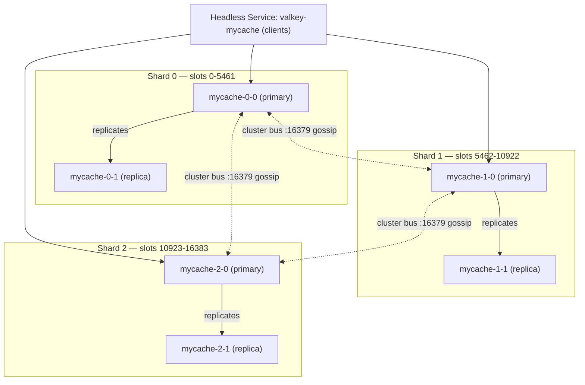
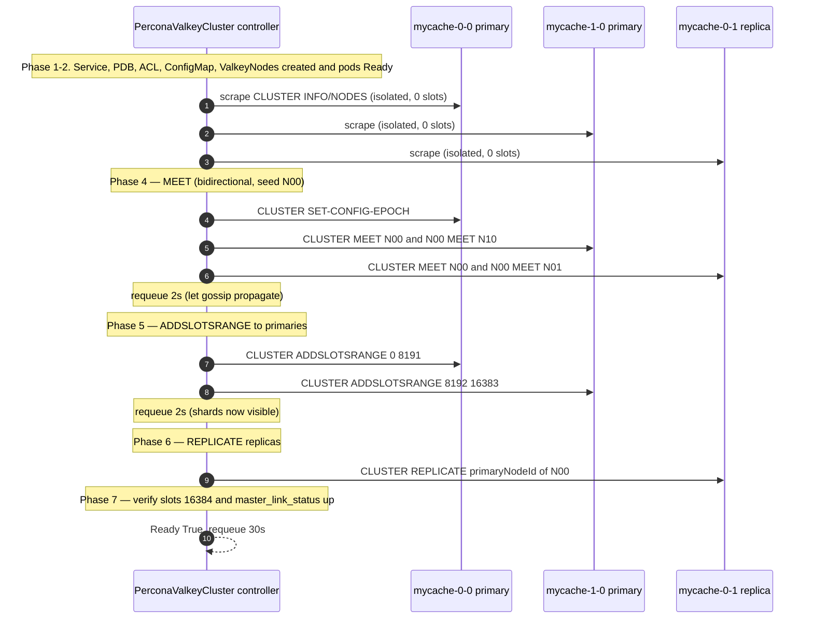
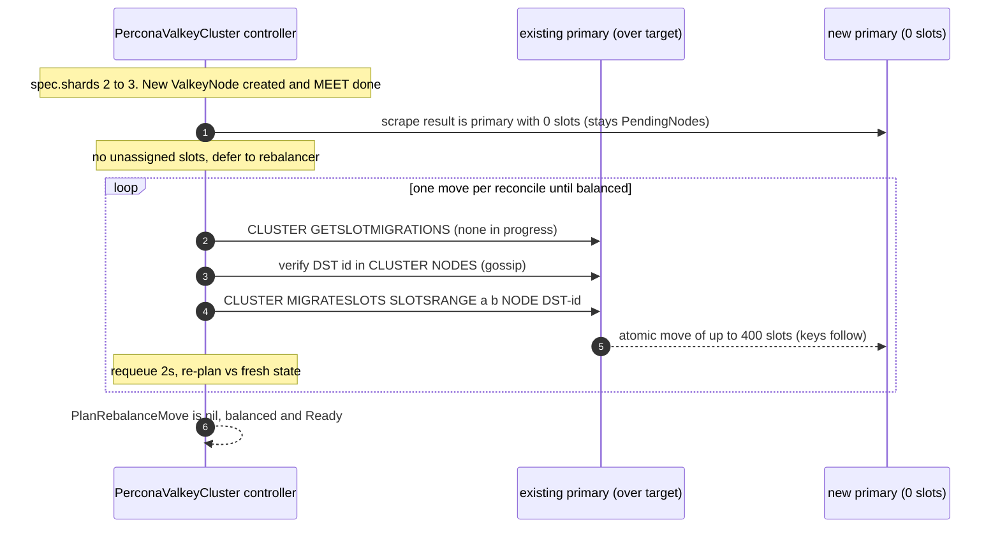
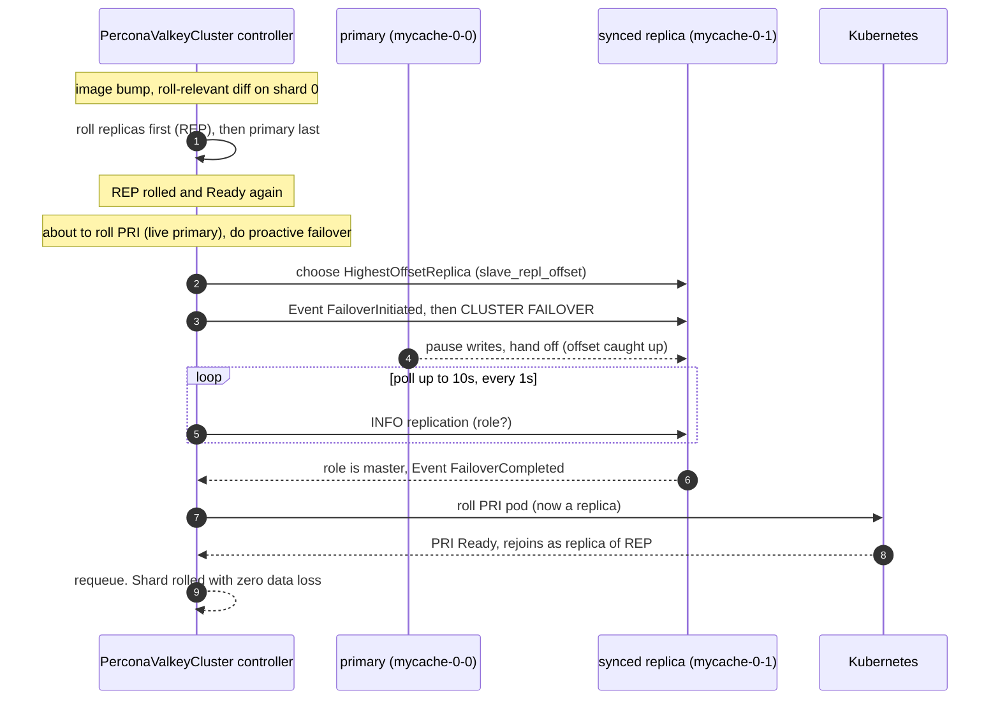

# Data Plane: Topology, Sharding, Replication & Failover

> Percona Operator for Valkey — architecture series, document 05.

This document specifies the Valkey-side mechanics of the **Percona Operator for Valkey**: how the operator forms, scales, heals, and fails over a Valkey deployment across the three topology modes (`cluster`, `replication`, `standalone`). It is the data-plane counterpart to the control-plane and API documents in this series. Every command, field, condition, and ordering rule described here is grounded in the upstream `valkey-operator` reconciliation engine that this operator adopts, re-skinned to the Percona two-axis versioning, naming, and CRD-trio conventions. The `PerconaValkeyCluster` (short name `pvk`) is the user-facing top-level CR; it drives an internal fleet of `ValkeyNode` (short name `vkn`) CRs, one per pod, which own the actual workloads. See [API & CRD Design](03-api-design.md) for the field-level schema, [Control Plane & Reconciliation](04-control-plane.md) for the control-plane loop structure, and [Backups & Restore](06-backup-restore.md) for the snapshot/restore path that sits on top of this topology.

---

## 1. Topology modes recap and per-mode node layout

`PerconaValkeyCluster.spec.mode` selects one of three engine topologies. The `ValkeyNode` abstraction — one CR per pod, each wrapping a single-replica StatefulSet (durable, default) or Deployment (cache) — is reused identically across all three modes, so the API is forward-compatible: adding `replication` and `standalone` requires no breaking change to `pvk` or `vkn`.

| Mode | v1alpha1 status | Engine shape | Slots | Failover | Node count formula |
|------|-----------------|--------------|-------|----------|--------------------|
| `cluster` | **Primary target** | Sharded, gossip bus, 16384 hash slots | Yes (CRC16) | Operator-assisted + Valkey native election | `shards × (1 + replicas)` |
| `replication` | **Secondary target** | 1 primary + N replicas, no sharding | No (single keyspace) | **Operator-driven** election + `REPLICAOF`, **no Sentinel** | `1 + replicas` |
| `standalone` | Future | Single node, no HA | No | None | `1` |

### Naming and label scheme (all modes)

`ValkeyNode` CR names encode position as `<cluster>-<shardIndex>-<nodeIndex>`. Child resources a `ValkeyNode` creates are prefixed `valkey-`. Node-index `0` is the **initial** primary; the **live** role is always read from `CLUSTER NODES` / `INFO replication`, never inferred from the label after failover.

> **Terminology — engine tokens vs. semantic roles.** This document uses **primary**/**replica** as the semantic role names throughout, but quotes Valkey's engine output **verbatim** where it matters for matching: `INFO replication` reports `role:master` / `role:slave` and `master_link_status` / `slave_repl_offset`, and `CLUSTER NODES` emits `master` / `slave` flags (alongside `myself`, `fail`, `fail?`, `pfail`). Read `master` as **primary** and `slave` as **replica**; the exact tokens are preserved only because the operator parses them literally.

| Object | Name pattern | Example (`mycache`, shard 0, node 0) |
|--------|--------------|--------------------------------------|
| `ValkeyNode` CR | `<cluster>-<shard>-<node>` | `mycache-0-0` |
| Headless Service | `valkey-<cluster>` | `valkey-mycache` |
| ConfigMap | `valkey-<cluster>` | `valkey-mycache` |
| PVC | `valkey-<node>-data` | `valkey-mycache-0-0-data` |
| System-user ACL Secret | `internal-<cluster>-acl` | `internal-mycache-acl` |

Standard labels applied to every child: `app.kubernetes.io/{name,instance,component,managed-by}` plus the operator-specific `valkey.percona.com/{cluster,shard-index,node-index,component}`. Pod selectors and the rolling-update logic key off `valkey.percona.com/shard-index` and `valkey.percona.com/node-index`; topology-spread constraints set on `pvk` propagate down to each `vkn` pod so replicas of the same shard land on distinct failure domains.

### Per-mode layout

- **`cluster`** — `shards` shards, each `1 + replicas` nodes. With `shards: 3, replicas: 1` the fleet is `mycache-0-0` … `mycache-2-1` (6 `ValkeyNode`s), three primaries owning disjoint slot ranges, each with one replica.

The diagram below shows that `shards: 3, replicas: 1` cluster: three shards, each a primary (node-index 0) plus one replica (node-index 1), with the 16384 slots split `5462 / 5461 / 5461` across the primaries. Replicas track their primary over the cluster bus; clients reach any node through the headless `valkey-mycache` Service and follow `MOVED`/`ASK` redirects.



- **`replication`** — modeled as a **single shard** (`shardIndex` fixed at `0`) with `1 + replicas` nodes. No `CLUSTER ADDSLOTSRANGE`; the operator wires replicas to the primary with `REPLICAOF` and runs the failover state machine itself. This reuse of the single-shard layout is why `replication` needs no new CRD field.
- **`standalone`** — a single `ValkeyNode` (`<cluster>-0-0`), cluster-mode disabled, no replication, no failover. Reserved for v1+.

> **Recommendation:** default `spec.mode: cluster` for new production deployments. Use `replication` only when the working set fits one shard and clients cannot speak the cluster protocol. `standalone` is dev/test only and is deliberately deferred.

---

## 2. Cluster mode internals

Valkey cluster mode partitions the keyspace into a fixed **16384 hash slots** (0–16383). A key's slot is `CRC16(key) mod 16384` (with hash-tag support: only the substring between the first `{` and `}` is hashed when present). Each primary owns a disjoint set of slot ranges; the union of all owned ranges must cover all 16384 slots before the operator marks the cluster `Ready`.

### Slot distribution

For `N` shards the operator targets `16384 / N` slots per primary, distributing the remainder `16384 % N` one extra slot at a time to the lowest-addressed shards (deterministic, address-sorted — see `PlanRebalanceMove`). For `N = 3` this yields `5462, 5461, 5461`.

| Shards | Slots per primary (target) |
|--------|----------------------------|
| 1 | 16384 |
| 2 | 8192, 8192 |
| 3 | 5462, 5461, 5461 |
| 4 | 4096 × 4 |
| 6 | 2731, 2731, 2731, 2731, 2730, 2730 |

### Ports and the cluster bus

| Port | Purpose | Default |
|------|---------|---------|
| Client port | Client commands (`GET`/`SET`/…) | `6379` |
| Cluster bus | Gossip + failover voting (binary protocol) | `16379` (client + 10000) |

The bus port carries the gossip protocol used for node discovery, health (PING/PONG, `pfail`/`fail` propagation), config-epoch reconciliation, and failover elections. Both ports must be reachable pod-to-pod; the [NetworkPolicy](07-security.md) must allow ingress on both. When TLS is enabled, the bus is secured with `tls-cluster yes` (see §10).

### Full-coverage requirement and operator-managed cluster directives

Valkey refuses to serve keys for unassigned slots when `cluster-require-full-coverage` is in effect. The operator therefore gates `Ready` on `state.GetUnassignedSlots()` returning empty (zero unassigned ranges). A set of cluster directives is **operator-managed and not user-overridable** — they are written last in the rendered `valkey.conf` so they win over any user `spec.config`:

| Directive | Value | Why operator-owned |
|-----------|-------|--------------------|
| `cluster-enabled` | `yes` | Defines the mode; toggling it requires a full rebuild |
| `protected-mode` | `no` | Pods reach each other over the pod network, not loopback; ACL auth (the `_operator`/`_exporter` users) and NetworkPolicy provide the access control that protected-mode would otherwise approximate |
| `cluster-require-full-coverage` | `yes` | The operator owns slot coverage and gates `Ready` on zero unassigned slots; keeping the engine default `yes` makes a coverage gap fail loudly instead of silently serving a partial keyspace |
| `cluster-node-timeout` | `2000` (ms) | Tunes `pfail`→`fail` promotion timing |
| `cluster-config-file` | `/data/nodes.conf` | Persistent node identity (config epoch, node ID) |
| `cluster-allow-replica-migration` | `no` | Operator manages replica placement explicitly |
| `cluster-replica-validity-factor` | `0` | A replica with any replication lag may still be elected, so a stale-but-alive replica is never barred from failover (maximum availability) |
| `aclfile` | `/config/users/users.acl` | ACL source of truth (see §10) |
| `dir` | `/data` | RDB/AOF + `nodes.conf` location |

User `spec.config` is rendered **first** (so user values are visible) and the managed block **last** (so the managed block overrides on conflict). A user attempt to set `cluster-enabled no` is silently overridden, not honored — document this clearly to avoid confusion (it is a known upstream pitfall).

---

## 3. Bootstrap sequence

Bootstrap is the path from "`pvk` created" to "all 16384 slots assigned, all replicas in sync, `Ready`". The `PerconaValkeyCluster` controller drives it across multiple reconcile passes, each pass advancing one phase and requeuing (`RequeueAfter: 2s`) to let gossip settle. The phases, in exact order:

1. **Infrastructure** — upsert the headless Service, the PodDisruptionBudget, the internal ACL Secret `internal-<cluster>-acl` (with the `_operator`, `_exporter`, and `_backup` system users), and the ConfigMap (rendered `valkey.conf` + embedded liveness/readiness scripts). Compute the **config roll hash** (SHA-256 over the rendered config *excluding* live-settable keys).
2. **Create `ValkeyNode`s** — ensure one `vkn` exists per `(shardIndex, nodeIndex)`, stamping `spec.serverConfigHash`. New nodes are created; nodes are not advanced until each reports `status.ready` (pod Ready + `LiveConfigApplied`). The cluster controller reads `status.podIP` and `status.ready` from each `vkn`; it never talks to pods directly until IPs are known.
3. **Scrape state** — connect to every known `status.podIP` and build `ClusterState` from `CLUSTER MYID`, `CLUSTER MYSHARDID`, `INFO`, `CLUSTER INFO`, `CLUSTER NODES`. Fresh nodes report `cluster_known_nodes <= 1` (`IsIsolated()`) and zero slots, so they land in `PendingNodes`.
4. **MEET (batch)** — `CLUSTER MEET` every isolated pending node against a single **meet target** (a slot-owning primary if one exists, else a prior-batch non-isolated node, else the first isolated node as a bootstrap seed). The MEET is **bidirectional** (target→node and node→target) to avoid the gossip-fragmentation race where one-way MEET creates sub-clusters. Before MEET, each isolated node's config epoch is bumped (`CLUSTER SET-CONFIG-EPOCH currentEpoch+i+1`) so it joins with authority above any dead node it might replace. Requeue to let gossip propagate.
5. **ADDSLOTSRANGE (batch)** — for every primary-labeled (`node-index 0`) non-isolated pending node, assign its share of the **unassigned** slots via a single `CLUSTER ADDSLOTSRANGE` per primary, ceiling-dividing the remaining unassigned count across the remaining primaries. During fresh bootstrap all 16384 are unassigned, so every primary is filled in one pass. Requeue so the next pass sees the new shards.
6. **REPLICATE (batch)** — for every replica-labeled (`node-index ≥ 1`) pending node, `CLUSTER REPLICATE <primaryNodeId>` against the primary of its shard (matched by `shard-index` label). Different replicas target different primaries, so all attach in one pass.
7. **Verify & mark Ready** — confirm shard count `== spec.shards`, each slot-owning shard has `1 + spec.replicas` nodes, zero unassigned slots, and every replica reports `master_link_status:up` (`IsReplicationInSync()`). Set `Ready=True`, `ClusterFormed=True`, `SlotsAssigned=True`; requeue after **30s** for periodic health checks.

The ordering invariant is strict: **MEET before ADDSLOTSRANGE before REPLICATE.** A node must be a known cluster member before it can own slots; a primary must own slots and be gossip-visible before a replica can attach to it. The slot-assignment phase explicitly skips isolated nodes so a node can never receive slots before passing through MEET.



---

## 4. Scale-out: add shards and rebalance slots

Scaling out is `spec.shards: N → N+k`. The cluster controller creates the new `ValkeyNode`s, MEETs them, but **finds no unassigned slots** (the existing shards already own all 16384). New primaries therefore stay in `PendingNodes`; `assignSlotsToPendingPrimaries` returns `0` and defers to the rebalancer. New shards are surfaced for health/rebalancing via `effectiveShards()` (state shards plus slot-less primaries identified by their `RolePrimary` pod label).

### Rebalance algorithm

Once all shards are healthy, all slots assigned, and all replicas synced, the controller calls `rebalanceSlots`, which uses `PlanRebalanceMove`:

1. Compute the per-shard target (`16384 / N`, remainder spread to lowest-addressed shards).
2. Sort shards by a **stable shard key** (the primary's address) for determinism (so initial assignment order does not cause churn).
3. Find the first **over-target** shard (`numSlots − target > 1`) as `src` and the first **under-target** shard (`target − numSlots > 1`) as `dst`. The `±1` tolerance avoids ping-ponging on rounding.
4. Move `min(src surplus, dst deficit, batchSize)` slots, where `batchSize = 400`.
5. Return `nil` when balanced → rebalance complete.

**Deterministic, reproducible planning.** `PlanRebalanceMove` orders candidate moves deterministically by a stable shard key (steps 1–3 above are a pure function of the scraped `ClusterState`): the same input topology always yields the same `(src, dst, range)` decision, with no randomness or map-iteration nondeterminism. This is deliberate for **testability and reproducibility** — a given cluster shape produces an asserted, replayable move sequence in unit tests, and two operator instances (or a leader re-election mid-rebalance) compute the identical next move. The plan is **idempotent but non-transactional**: if the operator crashes between planning a move and the migration completing, the next pass simply re-scrapes live state and re-plans from scratch — a partially-applied or fully-applied move is observed in the fresh `ClusterState` and the planner picks up from wherever the slots actually landed, never double-counting; there is no cross-reconcile transaction or journal to replay, only the convergent re-plan.

> **Caveat — address-based sort can shift on reschedule.** The "stable shard key" is the primary's **address/IP**, which is stable for the lifetime of a pod but **can change after a pod is rescheduled** (eviction + reschedule yields a new `status.podIP`). A changed address can reorder the shard list and therefore which shard is selected as `src`/`dst` for the *next* move. This never corrupts coverage (every plan still converges to the same balanced end-state) but it can change the *path* taken, so the move sequence is reproducible only while addresses are stable. A future refinement could key on a reschedule-stable identifier (e.g. shard index or node ID) instead of the address.

**One move per reconcile (~30s pacing).** Each pass migrates one `src→dst` batch via the atomic `CLUSTER MIGRATESLOTS SLOTSRANGE <start> <end> NODE <dstId>`, then requeues so the next pass re-plans against fresh state. Pacing rebalancing at a single move per reconcile (the health-check requeue cadence is ~30s) is **deliberate**: it gives cluster-aware clients time to absorb each `-MOVED` and refresh their slot maps, and it keeps slot ownership stable between moves rather than churning many ranges at once. Before issuing, the controller checks `SlotMigrationInProgress` (via `CLUSTER GETSLOTMIGRATIONS`) and that the destination node ID is already in the source's `CLUSTER NODES` (gossip-visible); otherwise it requeues and waits.

### Keys-in-flight safety (atomic flip, single MOVED)

`CLUSTER MIGRATESLOTS` is **atomic** at the slot-range level: the source ships an AOF-formatted snapshot of the slot's keyspace to the destination followed by a replication stream of subsequent changes, and **keeps serving the slot from the source the entire time**. The source retains all keys and continues answering reads and writes until the final hand-off, at which point ownership flips to the destination in a single step. This is the key difference from the legacy key-by-key `MIGRATE`/`CLUSTER SETSLOT` dance: there is **no half-migrated window**, so clients never see per-key `-ASK` redirects mid-migration — they keep hitting the source until ownership transfers, then receive a single `-MOVED` to the destination on their next request (which cluster-aware clients follow transparently). The operator never issues per-key `MIGRATE` and never the legacy slot-by-slot `CLUSTER SETSLOT` dance — atomic migration removes the half-migrated-slot hazard. `IsSlotsNotServedByNode` errors (the source no longer owns the slots, e.g. a concurrent move completed) are treated as benign and trigger a requeue with fresh state rather than a failure.

> **Version requirement:** atomic `CLUSTER MIGRATESLOTS` / `CLUSTER GETSLOTMIGRATIONS` require **Valkey 9.0+** (the operator's default image is `percona/percona-valkey` tracking `valkey:9.0.0`). On older engines the command returns "unknown subcommand"; the operator wraps this as an actionable error advising an upgrade and blocks scale-out/scale-in (initial bootstrap with `ADDSLOTSRANGE` still works on 7.2+).



---

## 5. Scale-in: drain excess shards

Scaling in is `spec.shards: N → N−k`. The controller identifies **draining** shards as those whose pod `shard-index` label is `>= spec.shards`, and **remaining** shards as the rest. It then drains slots away from each draining shard before deleting its `ValkeyNode`s.

1. `PlanDrainMove(src, remaining, batchSize=400)` picks the draining shard's primary as `src` and the first valid remaining primary as `dst`, taking up to 400 slots. (Destination choice is intentionally simple; `PlanRebalanceMove` re-equalizes the remaining shards afterward.)
2. Guard with `SlotMigrationInProgress` and the gossip-visibility check, exactly as in rebalance.
3. `CLUSTER MIGRATESLOTS` the batch; requeue. Repeat until the draining shard owns **0 slots**.
4. When a draining shard is fully drained, delete its `ValkeyNode`s (`<cluster>-<drainedShard>-*`). On the next pass `forgetStaleNodes` issues `CLUSTER FORGET` for the now-backing-less node IDs, removing them from the topology.
5. `deleteExcessValkeyNodes` also reaps any `vkn` whose `shard-index >= spec.shards` **or** `node-index >= 1 + spec.replicas` (covers the symmetric replica scale-in case).

After draining, a final `rebalanceSlots` pass evens out the surviving shards.

> **Safety / pitfall:** scale-in is only safe while **all destination shards stay healthy** for the duration of the drain. If a destination primary loses quorum mid-migration, slots can be orphaned. The drain is one batch per reconcile precisely so a mid-flight failure is recoverable on the next pass. Do not scale in while a backup is running (see [Backups & Restore](06-backup-restore.md)) or during an in-progress rolling update.

---

## 6. Rolling updates

Any change that alters a `ValkeyNode`'s roll-relevant spec — image, resources, the config **roll hash** (non-live-settable config keys), persistence/scheduling fields — triggers a rolling restart. Changes confined to **live-settable** keys (`maxmemory`, `maxmemory-policy`, `maxclients`) do **not** roll; the `ValkeyNode` controller applies them in place via `CONFIG SET` and reports `LiveConfigApplied` (see §8).

### Trigger mechanism

The cluster controller computes `serverConfigRollHash(cluster)` (SHA-256 over the rendered config minus live-settable keys, with sorted-key serialization for determinism) and stamps it onto each `vkn.spec.serverConfigHash`. The `ValkeyNode` controller propagates that hash to its pod-template annotation; a changed annotation rolls the underlying StatefulSet/Deployment pod. Liveness/readiness scripts are deliberately excluded from the hash so script-only tweaks don't churn pods.

### Ordering guarantees

- **One node at a time.** After updating any `vkn`, the controller returns and requeues; it will not touch the next node until the updated one reports `status.ready` again (and `LiveConfigApplied`, and `observedGeneration == generation`). A ready, unchanged node is safe to skip past.
- **Replicas before the primary, per shard.** Within each shard the controller orders nodes **replica-first**, using *live* cluster state to identify the actual primary (which may not be `node-index 0` after a prior failover) and rolling it **last**.
- **Proactive failover before rolling a primary.** Immediately before rolling the node that is currently the shard's live primary, the controller demotes it gracefully (see below). If the primary's live role can't be determined for an active shard, the roll is **deferred** rather than risking an unknown-order restart.

### Proactive failover

`proactiveFailover` runs only when the primary has **synced** replicas (`GetSyncedReplicas`: not `fail`/`pfail`, `master_link_status:up`):

1. Select the most caught-up replica via `HighestOffsetReplica` (max `slave_repl_offset`) to minimize the write-pause window.
2. Emit a `FailoverInitiated` Event, then issue `CLUSTER FAILOVER` (graceful — Valkey pauses writes on the old primary until the target catches up) **on the target replica**.
3. Poll `INFO replication` on the target every **1s** up to a **10s** timeout until it reports `role:master`. On success emit `FailoverCompleted` and increment `failovers_total{type="proactive"}`; on timeout emit `FailoverTimeout` and proceed with the roll anyway (the old primary is about to restart; native election will recover).
4. If the primary has **no** synced replicas, the roll is **deferred** (`nodeDeferred`) so we don't roll the only data-serving node of the shard; the controller MEETs/REPLICATEs any isolated nodes to help a replica rejoin, then retries next pass.



---

## 7. Failure handling & recovery

The reconcile loop is the recovery engine; there is no separate watchdog. On every pass the controller scrapes live state and corrects drift.

### Native vs. operator-assisted failover

For a transient primary loss **with quorum intact** (a majority of slot-owning primaries reachable, `HasFailoverQuorum`), Valkey's own election promotes a replica automatically — the operator does nothing but observe and update status. The operator's role is the case Valkey *cannot* self-heal.

### Orphaned-replica promotion on quorum loss

`promoteOrphanedReplicas` handles the no-quorum case:

- It runs **only** when `HasFailoverQuorum()` is false **and** persistence is **disabled** (`spec.persistence == nil`). With persistence enabled, a restarted pod returns with the **same node ID** (persisted in `nodes.conf`) and reclaims its slots, so a unilateral takeover is unnecessary and would risk a split.
- For each shard whose primary is confirmed failed (`IsNodeFailed`: `fail` or `fail?`), it selects `BestReplicaOf(deadPrimaryId)` (highest offset) and issues `CLUSTER FAILOVER TAKEOVER` — a unilateral promotion that does **not** require an election quorum.
- TAKEOVER is issued **before** `CLUSTER FORGET` so the slots remain continuously owned (no coverage gap). Emits `ReplicasTakenOver`.

### Forgetting stale nodes

`forgetStaleNodes` issues `CLUSTER FORGET` for node IDs present in the topology but lacking a backing `ValkeyNode` (deleted during scale-in, or a permanently dead pod). It is suppressed while a failover is pending for that node — `HasReplicaOf` checks whether any live node still lists the failed node as its primary; forgetting it prematurely would strip the failed primary from peers' tables and prevent them from voting in the replica's election. With persistence enabled (pod will return with the same ID) or quorum intact, forget is also deferred.

### Recovery edge cases (document, don't paper over)

- **Total replica loss in a shard (no quorum, all replicas also down):** the cluster is stuck for that shard's slots. This is a genuine availability outage; recovery is manual intervention (restore a node from a backup, or re-seed). The operator surfaces this via `Degraded` + Events; it will not fabricate data.
- **Stale `status.podIP`:** after eviction+reschedule a pod's IP changes; the controller may briefly target the old IP until the next scrape refreshes `status.podIP`. Commands are idempotent and the next pass corrects it.
- **`pfail` under majority-down:** when most primaries are down, a `pfail` can never be promoted to `fail` by gossip; `IsNodeFailed` deliberately treats `fail?` as failed so the operator can act in this exact scenario.

---

## 8. Replication mode: operator-driven failover without Sentinel

`spec.mode: replication` is a single-shard topology (`shardIndex` 0) of one primary + N replicas with **no hash slots** and **no Sentinel**. The operator itself is the failover coordinator — this is the secondary target for v1alpha1 and reuses the `ValkeyNode` abstraction unchanged.

- **Wiring:** node-index 0 is the initial primary; replicas attach with `REPLICAOF <primary-host> <port>` (the non-cluster analog of `CLUSTER REPLICATE`). Replica health is read from `INFO replication` (`master_link_status`, `slave_repl_offset`), identical to cluster mode.
- **Failover:** when the primary is unreachable, the operator selects the highest-offset synced replica (`HighestOffsetReplica` over `GetSyncedReplicas`), promotes it (`REPLICAOF NO ONE`), and re-points the surviving replicas at the new primary (`REPLICAOF <new-primary>`). The live primary is always re-derived from `INFO`, never from the `node-index` label.
- **Rolling updates:** same replicas-before-primary, one-at-a-time discipline as cluster mode; the proactive-failover step promotes a replica before rolling the live primary.
- **Why no Sentinel:** the Kubernetes control plane (the operator + the API server as the source of truth) replaces Sentinel's discovery/quorum role. Clients reach the current primary through a primary-targeting Service (label-selected on the live role) rather than via Sentinel lookups.

> **Recommendation:** prefer `cluster` mode even at small scale unless clients cannot speak the cluster protocol — `replication` trades horizontal scalability and per-slot ownership guarantees for client simplicity. The single-shard layout means a `replication` cluster can later be migrated toward `cluster` mode without an API change.

---

## 9. Persistence interaction with rolls and restarts

Persistence is configured on `spec.persistence` and is propagated identically to every `ValkeyNode`. RDB/AOF semantics are owned by the Valkey engine via config directives; the operator does **not** issue runtime `SAVE`/`BGSAVE` during normal reconciliation (those belong to the [backup path](06-backup-restore.md)).

| Aspect | Behavior | Source / rationale |
|--------|----------|--------------------|
| **Durable default** | `workloadType: StatefulSet` (1 replica) with a PVC `valkey-<node>-data` | Stable identity + durable `/data` |
| **Cache mode** | `workloadType: Deployment`, no PVC | Persistence is **forbidden** with Deployment (CRD `XValidation` gate) |
| **`nodes.conf`** | `cluster-config-file /data/nodes.conf` on the PVC | Survives restart → **same node ID + config epoch**, which is why takeover is skipped when persistence is on |
| **RDB** | `save` directives via `spec.config` | **Not** live-settable → changing them triggers a pod roll |
| **AOF** | `appendonly yes` via `spec.config` | **Not** live-settable → roll-triggering |
| **PVC reclaim** | `spec.persistence.reclaimPolicy: Retain` (default) or `Delete` | `Retain` keeps the PVC on `vkn` deletion; `Delete` GCs it via a finalizer |
| **Resize** | Size may **expand** only | StorageClass and shrink are immutable once set |

Because `appendonly`/`save`/`dir`/`cluster-config-file` are restart-required, changing them is a rolling update governed by §6 (replicas-first, proactive failover, one at a time). The key durability win of persistence: on a primary pod restart the engine reloads `nodes.conf` and rejoins as the **same** node with its slots intact, so the operator does not need to MEET/REPLICATE/takeover it — it simply waits for `Ready`. Conversely, with persistence **off**, a lost primary's replica must be promoted via TAKEOVER (§7) because the restarted pod is a brand-new node.

> **Pitfall:** never enable PVC `Delete` reclaim on a production cluster without a verified backup — deleting a `ValkeyNode` (e.g. during scale-in) will then erase its data volume. The default `Retain` is the safe choice.

---

## 10. How the operator connects and authenticates to nodes

All node-level operations (MEET, ADDSLOTSRANGE, REPLICATE, MIGRATESLOTS, FAILOVER, INFO/CLUSTER scrapes) go over a per-node client connection. The operator never relies on the cluster client's redirect handling — it must talk to *specific* nodes.

### Addressing

The controller collects each `ValkeyNode.status.podIP` (skipping empty ones) and connects directly to `<podIP>:6379`. Pod-direct addressing (not the Service VIP) is required so the operator can target an individual node deterministically; the headless `valkey-<cluster>` Service exists so pods get stable DNS for the bus and for clients.

### Client configuration

Connections use the Valkey Go client with **`ForceSingleClient=true`** so the client does not auto-follow `-MOVED`/`-ASK` to a different node — essential when the intent is to inspect or command one exact node. Each connection runs a single `DoMulti` of `CLUSTER MYID`, `CLUSTER MYSHARDID`, `INFO`, `CLUSTER INFO`, `CLUSTER NODES` to build `NodeState`. Clients are closed at the end of each reconcile (`CloseClients`).

### Authentication: the `_operator` system user

The operator authenticates as the internal **`_operator`** ACL user, whose password lives in the `internal-<cluster>-acl` Secret (type `valkey.io/acl`). `_operator` is granted exactly the commands the data plane needs — its canonical, least-privilege rule string is (see the [authoritative system-user ACL spec](#valkey-system-user-acls-canonical-least-privilege) below, identical to [Control Plane & Reconciliation](04-control-plane.md) and [Security](07-security.md)):

```acl
user _operator on #<sha256-hex-of-operator-password> resetchannels resetkeys -@all +cluster +config|get +config|set +info +client|setname +client|setinfo +replicaof +wait +ping
```

This is least-privilege: the `-@all` floor plus `resetkeys`/`resetchannels` keep `_operator` off all keys and channels, so it cannot read or write user data — only orchestrate topology and read state. It uses a **bare `+cluster`** because the operator drives nearly every CLUSTER subcommand (MEET, ADDSLOTSRANGE, SETSLOT, REPLICATE, FAILOVER, FORGET, MIGRATESLOTS, GETSLOTMIGRATIONS, NODES, INFO, SHARDS, MYID, RESET, plus 9.0's SYNCSLOTS); enumerating them invites silent drift as Valkey adds subcommands. A second system user, **`_exporter`**, holds a metrics-only ACL for the Prometheus exporter sidecar, and **`_backup`** holds a snapshot-only ACL for the backup path — both defined verbatim in the canonical spec below. If a user defines `name: _operator`, `name: _exporter`, or `name: _backup` in `spec.users`, the operator does **not** override it — a documented foot-gun that can lock the operator out (validate against this in the webhook/`CheckNSetDefaults`).

- **Auth fallback:** if a connection fails with `WRONGPASS` (e.g. mid-rotation), the client retries **unauthenticated** against the default user so the operator can still scrape and recover. Password rotation uses Valkey multi-password support (`PasswordSecret.Keys[]`) applied live via `ACL SETUSER` (not `CONFIG SET`).

### Valkey system-user ACLs (canonical, least-privilege)

> Valkey 9 syntax. Every grant carries an explicit `+`/`-` prefix. A **bare** command (e.g. `+cluster`) grants **all** of that command's subcommands; `+cluster|info` grants only that one subcommand. `resetchannels` and `resetkeys` flush the channel/key pattern lists so the user starts from *deny* (no keyspace, no pub/sub). A hashed password is the bare rule `#<sha256-hex>` (64 lowercase hex chars); `>` is for cleartext and must **not** be combined with `#`. Passwords are sourced from the operator-managed Secret and injected verbatim by the renderer at the `#<...>` position.

```acl
user _operator on #<sha256-hex-of-operator-password> resetchannels resetkeys -@all +cluster +config|get +config|set +info +client|setname +client|setinfo +replicaof +wait +ping
user _exporter on #<sha256-hex-of-exporter-password> resetchannels resetkeys -@all +info +cluster|info +latency +ping
user _backup   on #<sha256-hex-of-backup-password>   resetchannels resetkeys -@all +bgsave +lastsave +save +info +wait +ping
```

**Rationale (one line per user):**

- **`_operator`** — Cluster-orchestration user. Uses a **bare `+cluster`** because the operator drives nearly every CLUSTER subcommand (MEET, ADDSLOTSRANGE, SETSLOT, REPLICATE, FAILOVER, FORGET, MIGRATESLOTS, GETSLOTMIGRATIONS, NODES, INFO, SHARDS, MYID, RESET, plus 9.0's SYNCSLOTS for atomic slot migration); enumerating them invites silent drift as Valkey adds subcommands, while the still-tight `-@all` floor and `resetkeys`/`resetchannels` keep it off all keys and channels. Plus scoped `config|get`/`config|set`, `info`, `client|setname`/`client|setinfo`, `replicaof` (replication mode), `wait`, and `ping` — no broader `@admin`/`@dangerous` and no keyspace/pub-sub.
- **`_exporter`** — Read-only metrics scraper: `+info`, `+cluster|info` (single subcommand only, **not** bare `+cluster`, since it must never orchestrate), `+latency` (LATEST/HISTORY/RESET; read-only metrics in practice), and `+ping` for liveness; `-@all` + `resetkeys`/`resetchannels` deny everything else, all keys, and all channels. Kept password-protected (not `nopass`) because the operator Secret already supplies a credential.
- **`_backup`** — Server-side snapshot user: `+bgsave`, `+lastsave`, `+save`, `+info`, optional `+wait` (await replica acks before snapshotting), and `+ping`. RDB is produced server-side, so **no keyspace access** (`resetkeys`) and no channels (`resetchannels`); `-@all` blocks everything else including CONFIG and CLUSTER.

**Secret shape (single source of truth):** The operator builds a Kubernetes Secret of type **`valkey.io/acl`** named **`internal-<cluster>-acl`**, containing one data key whose value is the full ACL file (the three `user ...` lines above, deterministically ordered and rendered with each `#<sha256-hex...>` filled from the cluster's password material). It is mounted into every Valkey pod at **`/config/users/users.acl`** and referenced by the server config as **`aclfile /config/users/users.acl`**. Because the file is generated deterministically from the operator's Secret (sorted users, fixed rule order), the rendered output is byte-stable across reconciles, so the file hash is suitable for triggering rolling restarts only on real ACL changes.

### TLS

When `spec.tls` is set (via `spec.tls.secretName` or `spec.tls.certManager.issuerRef`), the operator builds a `tls.Config` from the TLS Secret (`ca.crt`, `tls.crt`, `tls.key`) with `ServerName = valkey-<cluster>.<ns>.svc.cluster.local` and uses it for every node connection. On the engine side TLS means `port 0` (plain TCP disabled), `tls-port 6379`, `tls-cluster yes`, and `tls-replication yes` — so both client traffic and the cluster bus are encrypted. Certificates come from cert-manager or a referenced Secret; **rotation is not live** — a cert change rolls pods (it is a restart-required config change). See [Security](07-security.md) for the full TLS, ACL, and NetworkPolicy design.

---

## 11. Live config vs. roll-triggering config (reference)

A single, authoritative split governs whether a config change rolls pods:

| Config key | Live-settable? | Effect of change |
|------------|----------------|------------------|
| `maxmemory` | **Yes** | `CONFIG SET`, no roll; `LiveConfigApplied` condition |
| `maxmemory-policy` | **Yes** | `CONFIG SET`, no roll |
| `maxclients` | **Yes** | `CONFIG SET`, no roll |
| `appendonly`, `save`, `dir` | No | Excluded from no-roll set → rolling restart |
| `cluster-*`, `tls-*`, `port`, `aclfile` | No (operator-managed) | Rolling restart; user cannot override |
| everything else in `spec.config` | No | Rolling restart |

If a live `CONFIG SET` fails (e.g. `maxmemory invalid`), the `ValkeyNode` sets `LiveConfigApplied=False`, which **blocks rolling-update progress** for that node until the user fixes `spec.config`; there is no auto-retry backoff beyond the node's normal requeue. This is intentional fail-fast behavior.

---

## 12. Summary of data-plane invariants

- Slots: **16384**, CRC16, full coverage required before `Ready`; one atomic `MIGRATESLOTS` move per reconcile, batch **400**.
- Bootstrap order: **MEET → ADDSLOTSRANGE → REPLICATE**, each phase batched, requeue between phases.
- Rolling updates: **one node at a time, replicas before primary, proactive `CLUSTER FAILOVER` (10s/1s poll) before rolling a live primary**.
- Failover: native election when quorum holds; `CLUSTER FAILOVER TAKEOVER` only on quorum loss **and** persistence off; TAKEOVER before FORGET.
- Live role is read from `CLUSTER NODES` / `INFO`, never from `node-index`.
- Operator talks to pods by `status.podIP` as the least-privilege `_operator` ACL user over (optionally) TLS, with `ForceSingleClient` and a `WRONGPASS` unauthenticated fallback.
- Atomic slot migration requires **Valkey 9.0+**; cluster mode/ACL/cluster-TLS require 7.x+.

See also: [API & CRD Design](03-api-design.md) · [Control Plane & Reconciliation](04-control-plane.md) · [Backups & Restore](06-backup-restore.md) · [Security](07-security.md) · [Observability](08-observability.md).
