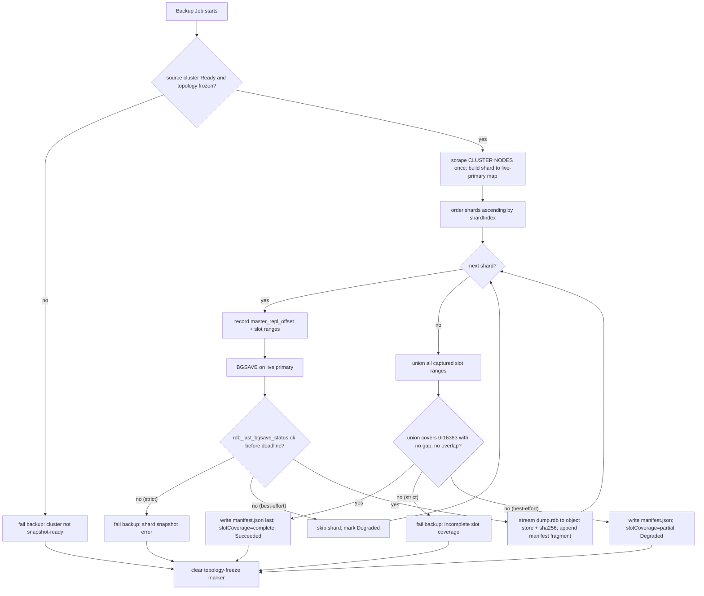
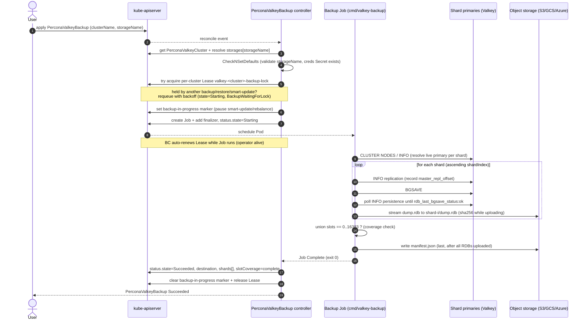
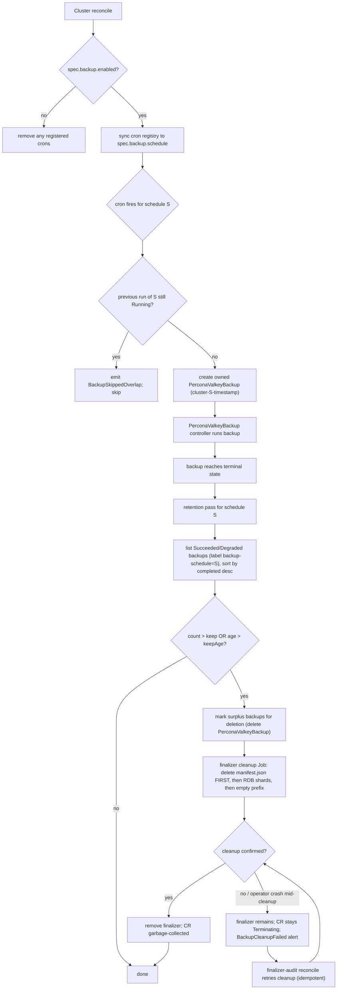
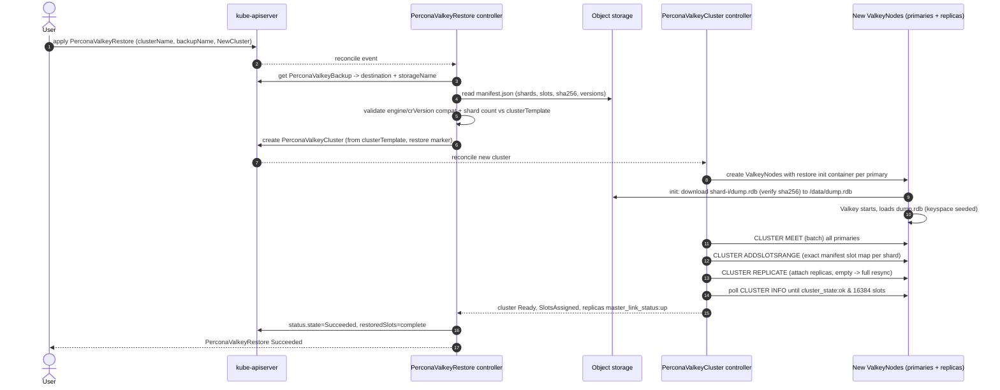

# Backup & Restore

> Percona Operator for Valkey — Architecture, Document 06 of the series.

This document specifies how the **Percona Operator for Valkey** captures and restores
data for a sharded `cluster`-mode `PerconaValkeyCluster`. The model is deliberately
conservative: an **RDB snapshot per shard** (one `BGSAVE` against each shard's live
primary) shipped to object storage (S3 / GCS / Azure) by a one-shot Kubernetes `Job`
running the `cmd/valkey-backup` binary, orchestrated by the `PerconaValkeyBackup`
controller; scheduling lives as a cron field in the cluster spec; retention and artifact
GC are enforced through finalizers; and `PerconaValkeyRestore` provisions a fresh target
cluster, seeds each shard's RDB, re-forms cluster topology, and validates that all 16384
slots are covered before declaring success. **Point-in-time recovery (PITR) via AOF
streaming is explicitly deferred beyond v1alpha1** — the reasoning and a forward design
sketch are given at the end. This design mirrors the Percona CR trio
(`Cluster`/`Backup`/`Restore`) and storage-by-name resolution conventions used by PXC,
PSMDB, and PS, while respecting the upstream valkey-operator's two-CRD
`PerconaValkeyCluster` → `ValkeyNode` topology model.

See sibling documents:
[API & CRD Design](03-api-design.md),
[Control Plane & Reconciliation](04-control-plane.md),
[Data Plane: Topology, Sharding, Replication & Failover](05-data-plane.md),
[Security Architecture](07-security.md),
[Observability](08-observability.md),
[Upgrades & Version Management](09-upgrades-versioning.md),
[Distribution & Release](10-distribution-release.md).

---

## 1. Goals & Scope

### 1.1 In scope (v1alpha1)

| Capability | Decision |
|---|---|
| **Backup unit** | One **RDB snapshot per shard**, taken from that shard's live primary. A backup is the **set** of N shard snapshots plus a manifest. |
| **Snapshot mechanism** | `BGSAVE` (non-blocking fork-and-dump) issued over the Valkey protocol by the backup Job, producing `dump.rdb` on the primary's data volume. |
| **Destinations** | Object storage: **S3 (recommended primary), GCS, Azure Blob**. `pvc/` (local PVC) supported **for testing only**, never recommended for production. |
| **Trigger modes** | On-demand (`PerconaValkeyBackup` applied by a user) and **scheduled** (cron in `PerconaValkeyCluster.spec.backup.schedule[]`, operator creates owned `PerconaValkeyBackup` objects). |
| **Retention / GC** | Count- and/or age-based retention per schedule; artifact deletion driven by a **finalizer** on each `PerconaValkeyBackup`. |
| **Restore** | `PerconaValkeyRestore` into a **freshly provisioned** target cluster (recommended) or **in-place** into an existing cluster (alternative); slot-coverage-validated. |
| **Topology coverage** | Designed for `mode: cluster` (sharded). The same machinery degenerates cleanly to `mode: replication` (single logical shard) and the future `standalone` mode. |

### 1.2 Out of scope (deferred) — and why

- **Point-in-time recovery (PITR).** Valkey's continuous-durability primitive is the
  **AOF** (append-only file), not a server-side binary log streamed to a remote sink like
  MySQL's binlog. The upstream valkey-operator does **not** coordinate snapshots at all and
  does **not** issue `SAVE`/`BGSAVE`; persistence (`appendonly`, `save`) is left to the
  engine at runtime and is **not live-settable** (changing it triggers a pod roll). There
  is no operator-managed binlog-server equivalent to lean on. Building a correct,
  slot-aware, cross-shard PITR (continuous AOF shipping + replay-to-timestamp across 16384
  slots that may have *moved* between shards during the recovery window) is a substantial
  subsystem. We ship a correct snapshot/restore story first and **defer PITR** rather than
  fake it. A concrete future sketch is in [§11](#11-pitr-future-design-sketch-deferred).
- **CSI volume snapshots.** Possible future optimization for very large datasets; not in
  v1alpha1 (logical RDB is portable across storage classes and cloud providers; CSI
  snapshots are not).
- **Incremental backups.** Percona's MySQL operators support `type: incremental`; Valkey
  RDB has no native incremental-against-base format, so v1alpha1 ships **full snapshots
  only**. The `PerconaValkeyBackup.spec.type` field is reserved for forward compatibility
  (see [§3](#3-perconavalkeybackup-crd)).

### 1.3 Non-negotiable invariants

1. **Slot completeness.** A backup is only `Succeeded` when its manifest proves that the
   union of slots across the captured shards covers **all 16384 slots** (0–16383) with no
   gaps and no overlaps. A restore is only `Succeeded` when the rebuilt cluster reports
   `cluster_state:ok` and all 16384 slots assigned (the same gate the cluster controller
   uses to set `SlotsAssigned`).
2. **Never trust labels for role.** The backup Job selects each shard's **live primary**
   by reading `CLUSTER NODES` / `INFO replication`, never from the `node-index 0` label —
   live role can have moved via failover. This mirrors the cluster reconcile principle.
3. **No silent data loss.** Any shard that cannot produce a fresh, verified RDB fails the
   whole backup. This is the **default** (`consistency: strict`); the opt-in
   `consistency: best-effort` mode explicitly relaxes it and marks the result `Degraded`
   (loudly, never silently) — see [§9](#9-consistency-model--limitations).

---

## 2. Where backup configuration lives

Two surfaces, by Percona convention:

- **`PerconaValkeyCluster.spec.backup`** — the durable, declarative configuration:
  named **storages** (credentials + bucket coordinates), **schedules** (cron + retention),
  the backup **image**, and resource/affinity hints for backup Jobs. This is the single
  source of truth; individual `PerconaValkeyBackup` objects reference a storage **by name**
  and inherit the rest (exactly as PXC/PSMDB backups resolve `spec.backup.storages[name]`).
- **`PerconaValkeyBackup` / `PerconaValkeyRestore`** — minimal, per-operation CRs. A backup
  needs only `clusterName` + `storageName`; a restore needs `clusterName` + a backup
  reference. Everything else is hydrated from the cluster spec at execution time.

```yaml
# PerconaValkeyCluster (excerpt) — backup configuration block
apiVersion: valkey.percona.com/v1alpha1
kind: PerconaValkeyCluster
metadata:
  name: prod
spec:
  mode: cluster
  shards: 3
  replicas: 2
  backup:
    enabled: true
    image: percona/valkey-backup:9.0.0      # cmd/valkey-backup container (engine-axis tag, not crVersion)
    storages:
      s3-primary:
        type: s3
        s3:
          bucket: percona-valkey-backups
          prefix: prod/
          region: eu-central-1
          endpointUrl: ""                    # empty => default AWS endpoint
          credentialsSecret: prod-s3-creds   # keys: AWS_ACCESS_KEY_ID / AWS_SECRET_ACCESS_KEY
    schedule:
      - name: nightly-full
        schedule: "0 2 * * *"                # robfig/cron spec
        storageName: s3-primary
        keep: 7                              # retention: keep N most-recent Succeeded
        type: full
```

---

## 3. `PerconaValkeyBackup` CRD

`kind: PerconaValkeyBackup` (short name **`pvk-backup`**), group `valkey.percona.com`,
version `v1alpha1`. One CR == one backup-set (N shard snapshots + manifest).

### 3.1 Spec fields

| Field | Type | Required | Default | Description |
|---|---|---|---|---|
| `clusterName` | `string` | yes | — | Name of the `PerconaValkeyCluster` (same namespace) to back up. |
| `storageName` | `string` | yes | — | Key into `cluster.spec.backup.storages`. **No fallback**; a typo fails at execution, not admission (mirrors Percona). Validated in `CheckNSetDefaults`. |
| `type` | `enum{full}` | no | `full` | Reserved for forward compat. Only `full` accepted in v1alpha1; `incremental` rejected by CEL. |
| `consistency` | `enum{strict,best-effort}` | no | `strict` | `strict` (default) fails the backup if any shard's snapshot is not freshly produced and verified, upholding the §1.3 "no silent data loss" invariant; `best-effort` is the explicit opt-in relaxation that records partial coverage and marks `Degraded`. See [§9](#9-consistency-model--limitations). |
| `startingDeadlineSeconds` | `*int64` | no | unset | If the Job cannot start within this window (e.g. cluster not Ready), the backup is marked `Failed` (matches PXC/PSMDB). |
| `activeDeadlineSeconds` | `*int64` | no | `3600` | Hard cap on Job runtime to prevent stuck backups. |
| `containerOptions` | `object` | no | — | Extra args/env for `cmd/valkey-backup` (e.g. compression level, parallel-upload concurrency). |

> **API-doc reconciliation.** [API & CRD Design](03-api-design.md) §7.1 currently lists only
> `clusterName`, `storageName`, `type`, and `containerOptions` (`*BackupContainerOptions`) for
> `PerconaValkeyBackup`. The field names used in this document match that catalogue exactly —
> `storageName` (not `storage`), `credentialsSecret` (not `credentials`), and `backupSource`
> (not `source`, on the restore side) — and retention is expressed as the schedule's `keep` /
> `keepAge` (doc 03 §2.9), never a `retention` block. The `consistency`,
> `startingDeadlineSeconds`, and `activeDeadlineSeconds` fields above are the intended fuller
> surface not yet in doc 03 §7.1; the API doc should be expanded to match (cross-doc
> reconciliation item). `clusterName`/`storageName`/`type` are immutable (CEL), per doc 03.

### 3.2 Status fields

| Field | Type | Description |
|---|---|---|
| `state` | `enum{"",Starting,Running,Succeeded,Failed,Error,Degraded}` | `""` = New (PXC/PSMDB convention, matching [API & CRD Design](03-api-design.md) §7.2). Terminal states: `Succeeded`, `Failed`, `Error`. `Degraded` is terminal-success-with-warning (partial coverage under `best-effort`). **Note:** doc 03 §7.2 currently omits `Degraded`; the API doc must add it so the two stay in sync (recorded as a cross-doc reconciliation item). |
| `stateDescription` | `string` | Human-readable detail (e.g. `shard 2 primary unreachable`). |
| `storageName` | `string` | Resolved storage name (hydrated from spec). |
| `destination` | `string` | Backend-prefixed root of the backup-set: `s3://bucket/prefix/<backup-name>/`, `gs://...`, `azure://...`, or `pvc/...`. Prefixes disambiguate the backend (Percona convention). |
| `shards` | `[]ShardBackupStatus` | Per-shard: `shardIndex`, `sourcePrimaryNodeID`, `sourcePodIP`, `slots` (assigned ranges at snapshot time), `rdbKey` (object key), `rdbSizeBytes`, `rdbSha256`, `replOffset` (`master_repl_offset` at `BGSAVE` issuance). |
| `slotCoverage` | `string` | `complete` (all 16384) or `partial`. Gate for `Succeeded`. |
| `valkeyVersion` | `string` | Engine version captured (`INFO server: valkey_version`), used by restore for compatibility checks. |
| `crVersion` | `string` | `spec.crVersion` of the source cluster, recorded for restore-time gating. |
| `manifestKey` | `string` | Object key of `manifest.json` (the authoritative backup-set descriptor; see [§4.5](#45-the-backup-set-manifest)). |
| `completed` | `*metav1.Time` | Completion timestamp (used for age-based retention). |
| `conditions` | `[]metav1.Condition` | `Initialized`, `Running`, `Uploaded`, `Verified`, `Complete`. |

### 3.3 Print columns

`State` (`.status.state`), `Cluster` (`.spec.clusterName`), `Storage` (`.status.storageName`),
`Destination` (`.status.destination`), `Coverage` (`.status.slotCoverage`),
`Completed` (`.status.completed`), `Age`.

### 3.4 Storage spec shape (in cluster `spec.backup.storages[name]`)

A discriminated union keyed by `type`, mirroring `BackupStorageS3Spec` /
`BackupStorageGCSSpec` / `BackupStorageAzureSpec` / `BackupStorageFilesystemSpec`:

| `type` | Sub-object | Key fields |
|---|---|---|
| `s3` | `s3` | `bucket`, `prefix`, `region`, `endpointUrl`, `credentialsSecret` (`AWS_ACCESS_KEY_ID`, `AWS_SECRET_ACCESS_KEY`) |
| `gcs` | `gcs` | `bucket`, `prefix`, `endpointUrl`, `credentialsSecret` (holds the service-account JSON key; mounted as a file, `GOOGLE_APPLICATION_CREDENTIALS` points at that path) |
| `azure` | `azure` | `container`, `prefix`, `endpointUrl`, `credentialsSecret` (`AZURE_STORAGE_ACCOUNT`, `AZURE_STORAGE_KEY`) |
| `filesystem` | `filesystem` | `volume` (PVC claim) — **test-only**; CEL warns. |

Credentials are **always** Secret references — never inline, never in CR status, never
logged. See [§8](#8-storage-backend-abstraction--credentials).

---

## 4. Backup execution model

### 4.1 Overview

The `PerconaValkeyBackup` controller is a thin orchestrator: it resolves storage, creates a
single Kubernetes `Job` (one Pod) running `cmd/valkey-backup`, and tracks that Job's
progress into status. **All Valkey/object-store interaction happens inside the Job**, not
the operator process — this keeps the operator's RBAC narrow, isolates large data transfers
from the reconcile loop, and matches Percona's Job-based backup orchestration (PXC/PSMDB
spawn one-off Jobs rather than doing data movement in-process).

> **Recommendation:** a **single backup Job per backup-set** that iterates all shards
> sequentially (the default). Rationale: deterministic ordering, one place to assemble the
> slot-coverage manifest, bounded concurrency against the object store, and a single Pod to
> watch. **Alternative:** fan-out one Job per shard for very large datasets to parallelize
> uploads — selectable via `containerOptions` (`parallelShards: true`); the controller then
> watches N Jobs and assembles the manifest after all complete. Start with the single-Job
> default; expose fan-out as opt-in.

### 4.2 Why `BGSAVE` and where it runs

`BGSAVE` forks the primary and writes `dump.rdb` to the data dir (`/data`) **without
blocking the foreground**; the engine reports progress via `INFO persistence`
(`rdb_bgsave_in_progress`, `rdb_last_bgsave_status`, `rdb_changes_since_last_save`). The
Job connects to the shard's **live primary** (resolved from `CLUSTER NODES`/`INFO`),
authenticating as the internal **`_operator`** ACL user, issues `BGSAVE`, then **polls
`rdb_last_bgsave_status:ok`** before reading the file.

> **ACL note (must align with [Security](07-security.md) §4).** `BGSAVE` is **not** a
> `CLUSTER`/`CONFIG`/`INFO` command — it lives in the `@admin @dangerous` category — so the
> least-privilege `_operator` grant described in the security doc must be widened to include
> the exact persistence commands the backup/restore paths invoke: `+bgsave` (backup) and
> `+config|set` (the restore re-enables AOF via `CONFIG SET appendonly yes`; restore also
> uses `+cluster` for `MEET`/`ADDSLOTSRANGE`/`REPLICATE`). Granting only `~* +@all` would
> violate least privilege; granting only `CLUSTER`/`CONFIG`/`INFO` would make `BGSAVE` fail
> with `NOPERM`. The `_operator` ACL is therefore `+@admin`-narrowed to exactly these tokens.

> **Recommendation:** snapshot the **primary** of each shard (it owns the authoritative
> slot data and the highest write offset). **Alternative:** snapshot a synced **replica**
> (`master_link_status:up`, selected like the failover path does via highest
> `slave_repl_offset`) to offload the fork from the primary. v1alpha1 default is
> primary-source for correctness simplicity; replica-source is a forward option behind
> `containerOptions.preferReplica: true`.

The Job reads the produced `dump.rdb` either by (a) mounting the primary's data PVC
read-only is **not** possible while the pod owns it, so instead (b) the Job streams the file
out of the running pod. **Recommendation:** the backup container execs into / co-locates a
small reader that ships the just-written `dump.rdb` over the network via the engine's data
path. Concretely, the `cmd/valkey-backup` binary uses the Valkey replication/`DUMP`-free
path: after `BGSAVE` completes it copies the on-disk `dump.rdb` via a sidecar reader in the
DB pod (the `cmd/healthcheck`/`cmd/peer-list` family of in-pod helpers establishes the
precedent for in-pod binaries). The simplest robust mechanism is: the **DB pod runs a
lightweight file-exposer** (part of the server image's entrypoint helpers) that the backup
Job pulls `dump.rdb` from over an authenticated, optionally TLS, channel; the Job then
streams it to object storage. This avoids a second full copy on the data PVC.

### 4.3 Ordered steps of a single-shard snapshot (performed by the Job per shard)

1. **Resolve primary.** Scrape `CLUSTER NODES` from any reachable node; pick the
   `master`-flagged node owning this shard's slots; record its node ID, pod IP, port, and
   assigned slot ranges.
2. **Record pre-state.** `INFO replication` → capture `master_repl_offset`; `INFO
   persistence` → capture `rdb_changes_since_last_save`, prior `rdb_last_save_time`.
3. **Trigger snapshot.** Issue `BGSAVE`. (If a `BGSAVE` is already in progress, wait for it
   to finish, then re-issue, so the snapshot reflects the offset recorded in step 2 or
   later — never an older fork.)
4. **Wait for completion.** Poll `INFO persistence` until `rdb_bgsave_in_progress:0` and
   `rdb_last_bgsave_status:ok`, bounded by `activeDeadlineSeconds`. On `err`, fail this
   shard.
5. **Stream & upload.** Read `dump.rdb`, compute SHA-256 while streaming, multipart-upload
   to `<destination>/shard-<idx>/dump.rdb`. Optionally gzip (`containerOptions`).
6. **Record per-shard status** into the manifest fragment: slot ranges, node ID, offset,
   size, sha256.

### 4.4 Multi-shard coordination

Because Valkey has **no cross-shard atomic snapshot** and the operator does **not** issue
`WAIT` (consistent with upstream), a backup-set is a *set of independent per-shard
snapshots*. The coordination the operator **does** guarantee:

- **Topology freeze window.** Before snapshotting, the backup controller checks the source
  cluster is `Ready` and **not mid-rebalance/scale** — i.e. `status.state == Ready` with the
  `RebalancingSlots` condition reason absent and no in-flight `SlotsRebalancing`/`SlotsDraining`
  Events (the event vocabulary fixed in [Control Plane & Reconciliation](04-control-plane.md)).
  It then acquires the per-cluster Lease + in-process lock the control plane uses
  (see [Control Plane & Reconciliation](04-control-plane.md) — backup/restore/smart-update are
  mutually exclusive per cluster) and sets a backup-in-progress marker so the cluster
  controller **pauses smart updates / slot moves** for the duration — the same mutual-exclusion
  principle Percona uses (`isBackupRunning()` gates SmartUpdate and pod churn). This prevents a
  slot from migrating *between* shards mid-backup and landing in two snapshots or none.
- **Full-coverage assertion.** After all shards complete, the Job unions every captured
  slot range. If the union ≠ 0–16383 (gap or overlap), the backup is `Failed`
  (`strict`) or `Degraded` (`best-effort`).
- **Deterministic shard ordering.** Shards are processed in ascending `shardIndex`
  (address-sorted, matching `PlanRebalanceMove`'s determinism) so manifests are stable and
  diffable.

The multi-shard snapshot coordination performed by the backup Job:



### 4.5 The backup-set manifest

`manifest.json` at the destination root is the authoritative descriptor and the **only**
artifact restore reads first:

```json
{
  "apiVersion": "valkey.percona.com/v1alpha1",
  "backupName": "prod-20260622-020000",
  "clusterName": "prod",
  "mode": "cluster",
  "crVersion": "1.0",
  "valkeyVersion": "9.0.0",
  "createdAt": "2026-06-22T02:00:31Z",
  "consistency": "strict",
  "slotCoverage": "complete",
  "shards": [
    { "shardIndex": 0, "slots": "0-5460",     "rdbKey": "shard-0/dump.rdb",
      "rdbSha256": "…", "rdbSizeBytes": 734003200, "sourcePrimaryNodeId": "…",
      "masterReplOffset": 91823771 },
    { "shardIndex": 1, "slots": "5461-10922", "rdbKey": "shard-1/dump.rdb", "…": "…" },
    { "shardIndex": 2, "slots": "10923-16383","rdbKey": "shard-2/dump.rdb", "…": "…" }
  ]
}
```

The controller copies the manifest's coverage/version fields into
`PerconaValkeyBackup.status`. The manifest is written **last**, after all RDBs and their
checksums are confirmed uploaded — its presence is the durable "backup-set is complete"
signal (critical for crash-safe retention GC: a backup-set without a manifest is treated as
incomplete and is itself a GC candidate).

### 4.6 On-demand backup sequence



### 4.7 Backup concurrency & the per-cluster Lease

Backup, restore, and smart-update are **mutually exclusive per cluster** — never two at once
against the same `PerconaValkeyCluster`. The serialization primitive is a single Kubernetes
`coordination.k8s.io/Lease` named `valkey-<cluster>-backup-lock` (one Lease per cluster,
shared with the control plane), backed by an in-process lock so the same operator replica
never races itself. The §4.4 topology-freeze step is the *acquire* of this Lease.

- **Mutual exclusion (second backup requeues).** Before creating its Job, the
  `PerconaValkeyBackup` controller attempts to acquire the cluster's Lease. If the Lease is
  already held (another backup, a restore, or an in-flight smart-update holds it), the
  controller does **not** fail the second backup — it leaves it in `state: Starting`, emits a
  `BackupWaitingForLock` Event, and **requeues with backoff**. It re-attempts acquisition on
  each reconcile until the holder releases, then proceeds. This means a second on-demand
  backup (or a scheduled fire that overlaps an on-demand run) queues behind the first rather
  than corrupting a shared snapshot stream.
- **Auto-renew while the controller is alive.** Once acquired, the holder **renews the Lease
  periodically** (`renewTime` updated well inside `leaseDurationSeconds`, the standard
  `leaderelection`-style cadence) for as long as the backup Job runs and the operator is up.
  A live, long-running backup therefore keeps the Lease fresh and other actors keep backing
  off. On normal completion (or failure) the controller **releases** the Lease and clears the
  backup-in-progress marker.
- **Fail-open if the Lease is missing.** The Lease is a coordination convenience, not the
  source of truth. If the cluster controller cannot find the backup Lease — e.g. it was never
  created, was manually deleted, or its `renewTime` is stale beyond `leaseDurationSeconds`
  with no holder — it **fails open**: it assumes no backup is running (backup "done") so
  cluster rolls, slot moves, and smart updates can resume rather than wedging forever waiting
  on a phantom holder. An expired/orphaned Lease is treated as free and is reacquired by the
  next actor. (Correctness is still guaranteed by the §4.4 topology-freeze check and the
  manifest slot-coverage assertion; the Lease only *optimizes* away contention.)
- **Smart-update gate reads backup-running status.** The cluster controller's smart-update
  path calls the equivalent of Percona's `isBackupRunning()` before any pod churn: it reads
  the backup-in-progress marker / Lease holder and **skips smart updates and slot rebalances
  while a backup holds the lock**, requeuing until the backup releases. This is the consumer
  side of the same mutual exclusion — backups pause smart-update, and smart-update refuses to
  start while a backup is live.
- **Alert on backup Job eviction.** If the backup Job's Pod is **evicted** (node pressure,
  preemption, drain) the Lease holder goes away; the controller detects the evicted Job, marks
  the backup `Failed`, releases the Lease (so the cluster resumes — see §4.8 on eviction),
  and fires a `BackupJobEvicted` `Warning` Event wired to an alert (see
  [Observability](08-observability.md)) so operators notice an evicted backup rather than a
  silently incomplete one.

### 4.8 Backup Job resources & eviction handling

The backup Job is a **streaming** workload, not a buffering one. `cmd/valkey-backup` reads
`dump.rdb` from the source pod and pipes it straight to the object store with a small fixed
ring buffer (multipart-upload part size), computing the SHA-256 incrementally over the stream.
It **never loads the whole RDB into memory**, so the Job's memory footprint is **independent
of dataset size** — a 5 GiB shard and a 500 GiB shard use the same handful of megabytes of
buffer. CPU is dominated by checksumming and (optional) gzip, not by dataset size.

- **Recommended requests (conservative, no hard limits).** Default the backup/cleanup/restore
  Job to modest **requests** — roughly **`cpu: 500m`, `memory: 256Mi`** — and set **no hard
  `limits`**. Rationale: because memory is bounded by the streaming buffer it will sit far
  below the request, so a `memory` limit only risks an OOM-kill of an otherwise-healthy
  backup; omitting limits lets transient gzip/CPU spikes burst without throttling the upload.
  These are overridable via `cluster.spec.backup` resource hints (propagated to the Job) and
  `containerOptions` for per-backup tuning.
- **Eviction handling (interrupted stream → backup fails → cluster resumes).** Because the Job
  has no memory limit it is not OOM-killed, but it can still be **evicted** by node pressure,
  preemption, or a node drain. An eviction interrupts the in-flight multipart upload stream;
  the partial multipart upload is aborted (no manifest is written, so the set is recognizably
  incomplete and a GC candidate per §4.5), the backup is marked **`Failed`**, and — crucially
  — the **cluster resumes when the Lease expires**: the evicted holder stops renewing, the
  Lease ages out past `leaseDurationSeconds`, the smart-update gate fails open (§4.7), and slot
  moves / smart updates resume without manual intervention. A scheduled backup's next fire (or
  a manual retry) re-drives a fresh full snapshot.
- **Job-evicted alert.** The same `BackupJobEvicted` `Warning` Event (§4.7) is raised on
  eviction and wired to an alert in [Observability](08-observability.md), so an evicted backup
  is surfaced loudly rather than appearing as a silent gap in the backup history.

---

## 5. Scheduled backups

### 5.1 Mechanism

Schedules live in `PerconaValkeyCluster.spec.backup.schedule[]` (each: `name`, `schedule`
cron string, `storageName`, `keep`/`keepAge` retention, `type`). The **cluster** controller
owns scheduling — not a separate CronJob resource:

> **Recommendation:** maintain an **in-operator cron registry** (`robfig/cron`) keyed by
> `(cluster, schedule.name)`, created/updated/removed **inside the cluster reconcile loop**
> so the schedule's lifecycle is tied to the CR (this is exactly how Percona runs backup
> schedules and version-service polls — crons spawned/updated in reconcile, not as free
> goroutines or k8s `CronJob`s). On each fire, the cron callback **creates an owned
> `PerconaValkeyBackup`** object (it does not run the backup itself); the
> `PerconaValkeyBackup` controller then does all the work described in [§4](#4-backup-execution-model).
> **Alternative:** emit a Kubernetes `CronJob` per schedule. Rejected for v1alpha1 because
> it splits ownership/observability across two controllers and loses the
> backup-in-progress mutual-exclusion the operator needs with smart updates.

Generated backups are named `<cluster>-<schedule.name>-<UTC-timestamp>` and carry:

- an **owner reference** to the `PerconaValkeyCluster` (GC if the cluster is deleted),
- labels `valkey.percona.com/cluster=<cluster>`,
  `valkey.percona.com/backup-schedule=<schedule.name>`,
  `app.kubernetes.io/managed-by=valkey-operator`,
  `app.kubernetes.io/component=backup`,
- an annotation recording the intended fire time (`valkey.percona.com/scheduled-at`).

### 5.2 Missed-schedule policy

If the operator was down across a fire time, or the previous run is still active:

| Situation | Policy (v1alpha1) |
|---|---|
| Operator restarted, missed N fires | **Run at most one** catch-up backup for the most recent missed slot (forward-only); older missed slots are skipped and an `Event`/log records the skip. (Cron callbacks are not re-run for historical ticks.) |
| Previous scheduled run of the **same schedule** still `Running` | **Skip** this fire (`ConcurrencyPolicy: Forbid` semantics); emit `BackupSkippedOverlap` Event. |
| `startingDeadlineSeconds` exceeded before Job starts | Mark the generated backup `Failed`; do not block the next fire. |

### 5.3 Scheduled-backup creation + retention GC flow



Retention is evaluated **after each successful run of a schedule** (and on a low-frequency
sweep). Only `Succeeded`/`Degraded` backups count toward `keep`; `Failed`/`Error` backups
are retained briefly for diagnosis then GC'd by a separate age threshold.

---

## 6. Retention & GC via finalizers

Every `PerconaValkeyBackup` carries the finalizer **`percona.com/delete-backup`** (Percona
naming convention; the operators use `FinalizerDeleteBackup` for backup-artifact cleanup).

Delete path (the `checkFinalizers` loop, ordered, matching Percona's
delete-pods → delete-ssl → delete-pvc pattern):

1. User or retention GC issues `delete PerconaValkeyBackup`. The API server sets
   `deletionTimestamp`; the object persists because of the finalizer.
2. The controller reconciles the deletion: it spawns a short **cleanup Job** (reusing
   `cmd/valkey-backup --cleanup`) authenticated with the storage credentials, which deletes
   the backup-set **manifest-first**: it removes `manifest.json` **first** (atomically
   invalidating the set so any concurrent restore/GC immediately sees it as incomplete and
   never reads a manifest that points at already-deleted RDBs), then reclaims the RDB blobs
   (`<destination>/shard-*/dump.rdb`), then the now-empty prefix. Object-store deletion
   happens in the Job, never in the operator process — same isolation rationale as backups.
3. On confirmed deletion (or if the destination is already gone), the controller **removes
   the finalizer**; the API server then GCs the CR.
4. If cleanup fails (e.g. credentials revoked, network), the finalizer **remains**, the CR
   stays `Terminating`, and the controller requeues with backoff and emits a `Warning`
   Event. This is intentional: an artifact leak is surfaced loudly rather than silently
   orphaning storage.

**Pitfalls handled (from Percona experience):**

- **Stuck finalizers.** If the cleanup Job panics mid-delete, the finalizer is *not*
  removed; a periodic finalizer-audit reconcile re-attempts cleanup so the CR can't hang
  forever without operator attention.
- **Manifest-as-completion-marker (write-last / delete-first).** The `manifest.json` is the
  atomic completeness marker: it is **written last** on create (a set without a manifest is
  incomplete and is itself a GC candidate) and **deleted first** on teardown (so a crash mid-
  delete leaves a manifest-less, recognizably-incomplete set that is eligible for re-cleanup,
  never a manifest pointing at missing RDBs). The two phases are mirror images, which is what
  makes partial-delete recovery safe.
- **Cluster deletion & credentials race.** Owner references mean deleting the
  `PerconaValkeyCluster` cascades to scheduled `PerconaValkeyBackup` objects; each still runs
  its own finalizer, so cluster teardown also reclaims object-store artifacts (ordered after
  the cluster's own delete-pods-in-order / delete-pvc finalizers). **Caveat:** the cleanup Job
  needs the storage credentials Secret, so that Secret **must not** carry an owner reference to
  the cluster (it must outlive the cluster, or the backup finalizers will wedge in
  `Terminating` once the Secret is GC'd). The operator therefore never owner-references the
  user-provided `credentialsSecret`; if a Secret is nonetheless missing at cleanup time the
  finalizer stays and a `Warning` Event names the orphaned prefix for manual reclamation.

### 6.1 Partial-cleanup recovery (crash-safety of artifact teardown)

Create and teardown are deliberate **mirror images**, which is what makes a partially-completed
delete recoverable rather than corrupting:

- **Write order on create — RDB shards first, `manifest.json` LAST.** The backup Job uploads
  every `shard-<i>/dump.rdb` (with its checksum) and only **after all RDBs are confirmed
  uploaded** writes `manifest.json` at the destination root. The manifest's *presence* is the
  durable "backup-set is complete" signal; a set without a manifest is by definition incomplete
  and is itself a GC candidate.
- **Delete order on teardown — manifest FIRST, then RDBs, then the empty prefix.** The cleanup
  Job (`cmd/valkey-backup --cleanup`) removes `manifest.json` **first** (atomically
  invalidating the set so any concurrent restore/GC immediately sees it as incomplete and never
  reads a manifest that points at already-deleted RDBs), **then** reclaims the RDB blobs
  (`<destination>/shard-*/dump.rdb`), **then** removes the now-empty prefix.
- **Operator crash mid-cleanup.** If the operator (or the cleanup Job) crashes partway through
  the delete, the `percona.com/delete-backup` **finalizer is never removed**, so the
  `PerconaValkeyBackup` CR **stays in `Terminating`** with its `deletionTimestamp` set. Because
  the manifest was deleted first, the remaining artifacts are a manifest-less, recognizably-
  incomplete set — never a manifest pointing at missing RDBs. No corruption window exists.
- **Recovery via finalizer-audit retry.** A periodic **finalizer-audit reconcile** re-drives
  any `PerconaValkeyBackup` stuck in `Terminating`: it re-runs the cleanup Job (deletes are
  idempotent — already-gone keys are treated as success), and once the prefix is empty it
  **removes the finalizer** so the API server GCs the CR. A `Terminating` backup therefore self-
  heals on the next audit pass without operator intervention.
- **Alert on cleanup failures.** Each failed cleanup attempt emits a `BackupCleanupFailed`
  `Warning` Event (naming the orphaned prefix) and is wired to an alert in
  [Observability](08-observability.md), so a backup wedged in `Terminating` (revoked
  credentials, network, missing Secret) is surfaced loudly rather than silently leaking
  object-storage artifacts.
- **Manual-finalizer-removal caveat (use with care).** Force-removing the
  `percona.com/delete-backup` finalizer (e.g. `kubectl patch ... --type=merge -p
  '{"metadata":{"finalizers":[]}}'`) makes the CR disappear immediately **but bypasses the
  cleanup Job entirely**, leaving the RDB blobs and (if it survived) the manifest as **orphaned
  object-storage artifacts** that the operator can no longer track or reclaim. Only do this when
  the underlying storage is known-gone (bucket already deleted) or after manually deleting the
  prefix; otherwise you are knowingly leaking storage. Prefer fixing the root cause (restore the
  credentials Secret, fix network) and letting the finalizer-audit retry drain the CR cleanly.

---

## 7. `PerconaValkeyRestore` CRD & restore flow

`kind: PerconaValkeyRestore` (short name **`pvk-restore`**).

### 7.1 Spec fields

| Field | Type | Required | Description |
|---|---|---|---|
| `clusterName` | `string` | yes | Target `PerconaValkeyCluster`. For fresh-cluster restore this is the cluster the operator will **create** from `clusterTemplate`; for in-place it must already exist. Immutable (CEL). |
| `backupName` | `string` | one-of | Reference to a `PerconaValkeyBackup` in the same namespace; storage details hydrated from it (mirrors PXC `backupName`). |
| `backupSource` | `object` | one-of | Direct destination reference (`destination`, `storageName`, inline storage) for restoring from an artifact whose `PerconaValkeyBackup` CR no longer exists (mirrors PXC `backupSource`). Exactly one of `backupName`/`backupSource` is required (CEL). |
| `strategy` | `enum{NewCluster,InPlace}` | no (default `NewCluster`) | Restore strategy. See below. (Field name matches [API & CRD Design](03-api-design.md) §8.1 `strategy`.) |
| `clusterTemplate` | `object` | when `strategy=NewCluster` | Embedded `PerconaValkeyClusterSpec` for the cluster to provision (image, shards, replicas, persistence, tls, users...). `shards` **must** equal the manifest's shard count, or be omitted to inherit it. |

### 7.2 Status fields

`state` (`enum{"",Provisioning,Seeding,Forming,Validating,Succeeded,Failed,Error}`, where
`""` = New per the PXC/PSMDB convention; terminal `Succeeded`/`Failed`/`Error`),
`stateDescription`, `targetCluster`, `restoredSlots`, `completed` (`*metav1.Time`),
`conditions` (`SourceResolved`, `TargetProvisioned`, `DataSeeded`, `ClusterFormed`,
`SlotsValidated`, `Complete`).
**Note:** doc 03 §8.2 currently lists a minimal restore status (`state`, `stateDescription`,
`completed`); this richer phase set + conditions is the intended shape and the API doc should
be expanded to match (cross-doc reconciliation item).

### 7.3 Restore strategy

> **Recommendation:** `strategy: NewCluster` — provision a brand-new
> `PerconaValkeyCluster` from `clusterTemplate`, seed it, and let the user cut over
> traffic. This is the safest, most testable path (the source backup is never the live
> system; a failed restore destroys nothing). It directly implements the grounding
> recommendation: *"Restore controller creates temporary cluster, loads RDB into each
> shard, promotes from temp to live topology."*
> **Alternative:** `strategy: InPlace` — restore into an existing, **scaled-to-zero-data**
> cluster (operator quiesces clients, flushes, seeds). Riskier; reserved for explicit
> disaster-recovery into the same cluster name and gated behind an annotation
> acknowledgement to prevent accidental wipes.

### 7.4 Seeding RDB into a node — the mechanism

A Valkey node loads `dump.rdb` **at startup** (it is not hot-loadable via a command). The
restore therefore seeds **before** the node serves cluster traffic:

1. For `NewCluster`, the operator creates the cluster's `ValkeyNode`s but injects a
   **restore init step**: an init container in each shard-primary pod fetches that shard's
   `dump.rdb` from object storage (via `cmd/valkey-backup --download
   --shard=<i>`) into the node's data dir (`/data/dump.rdb`) **before** the Valkey
   process starts, so the engine loads it on boot.
   **Critical AOF interaction:** when `appendonly yes`, Valkey loads the **AOF** on boot and
   **ignores `dump.rdb`** entirely — so a naive RDB drop would silently restore *zero* keys.
   The seed boot therefore runs with **`appendonly no`** (or, equivalently, starts with
   `aof-use-rdb-preamble`-style RDB ingestion) so the engine loads the RDB; once the keyspace
   is in memory the operator re-enables AOF on the running node via `CONFIG SET appendonly yes`
   (which triggers an immediate AOF rewrite from the loaded dataset) and, if the cluster spec
   requested AOF durably, persists it on the next config roll. This is the one place the
   restore path must override the cluster's persistence config for the initial boot.
2. **Cluster metadata is *not* restored** from the snapshot — `nodes.conf` /
   `cluster-config-file` from the source would carry stale node IDs and bus addresses.
   The restore boots each seeded primary as a **fresh cluster member** (keyspace from RDB,
   identity from the new pod) and then **re-forms topology** from scratch.
3. Replicas are **not** seeded from RDB; they are attached empty and sync from their
   (already-seeded) primary via `CLUSTER REPLICATE` — full resync copies the dataset, which
   is correct and avoids slot-ownership ambiguity.

### 7.5 Re-forming cluster topology after seeding

Reusing the cluster controller's existing topology pipeline (see
[Data Plane: Topology, Sharding, Replication & Failover](05-data-plane.md)):

1. **`CLUSTER MEET`** all seeded primaries into one cluster (batch, idempotent).
2. **`CLUSTER ADDSLOTSRANGE`** assign each primary the slot ranges recorded in the manifest
   for its `shardIndex` — i.e. the restore reproduces the **exact slot map** captured at
   backup time (no rebalance churn). This is why the manifest records per-shard slot ranges.
3. **`CLUSTER REPLICATE`** attach each shard's replicas to their seeded primary.
4. **Wait & validate**: poll `CLUSTER INFO` until `cluster_state:ok` and
   `cluster_slots_assigned:16384` — i.e. the union of assigned slots covers all 16384 slots
   (indices 0–16383) with no gap or overlap (`restoredSlots` complete). Verify
   `master_link_status:up` on every replica.
5. Mark `PerconaValkeyRestore` `Succeeded` only when slot coverage is proven complete; a
   gap or overlap is `Failed` with `stateDescription` naming the missing range.

> **Source-coverage precondition.** A `Degraded` backup (manifest `slotCoverage: partial`)
> cannot produce a healthy cluster — its missing slot ranges would leave `cluster_state:fail`
> after re-form. The restore controller therefore **rejects a partial-coverage source at
> validation time** (`SourceResolved=False`, restore `Failed`) **unless** the user sets the
> explicit annotation `valkey.percona.com/allow-partial-restore: "true"`, in which case it
> proceeds and the resulting cluster is left in `cluster-require-full-coverage no` /
> degraded-but-serving mode with a loud `Warning` Event. Default is reject. This mirrors the
> backup-side rule that only a slot-complete set is restorable.



---

## 8. Storage backend abstraction & credentials

### 8.1 Repository pattern

Backends are hidden behind a single interface, instantiated by `type` (the repository
pattern from the project conventions — encapsulate data access behind a consistent
interface so backends are swappable and mockable in tests):

```go
// pkg/valkey/backup — implemented in cmd/valkey-backup
type ArtifactStore interface {
    Upload(ctx context.Context, key string, r io.Reader) (sha256 string, size int64, err error)
    Download(ctx context.Context, key string, w io.Writer) (sha256 string, err error)
    Delete(ctx context.Context, prefix string) error          // prefix-recursive, for GC
    WriteManifest(ctx context.Context, key string, m Manifest) error
    ReadManifest(ctx context.Context, key string) (Manifest, error)
    URL(key string) string                                    // backend-prefixed destination
}
```

Concrete implementations: `s3Store` (AWS SDK; honors `endpointUrl` for MinIO / non-AWS S3),
`gcsStore`, `azureStore`, `fsStore` (test-only). The controller depends only on
`ArtifactStore`; unit tests inject a fake. **Destination prefixes** (`s3://`, `gs://`,
`azure://`, `pvc/`) are produced by `URL()` and parsed by helpers, exactly mirroring the
PXC `BackupDestination` `StorageTypePrefix`/`BucketAndPrefix`/`BackupName` helpers.

### 8.2 Credential handling

- Credentials are referenced by `credentialsSecret` (a Secret name in the cluster
  namespace) — **never** inline in any CR, never in status, never logged.
- `CheckNSetDefaults` validates at reconcile time that the referenced Secret exists and has
  the expected keys (fail-fast on misconfig, not at backup runtime — addresses the Percona
  "storage name mismatch silently fails at execution" pitfall). This **key-presence** check is
  the *only* time the operator process touches the Secret: it confirms the expected keys are
  set; it never uses the credential values to authenticate to object storage and never copies
  them into status or logs.
- The actual credential *use* happens only in the backup/cleanup/restore Jobs, which mount
  the Secret as env (`AWS_*` / Google JSON path / `AZURE_*`); the long-running operator process
  never authenticates to object storage. (RBAC therefore grants the operator only `get` on the
  named credential Secret — for the presence check — not blanket Secret access; see [§10](#10-rbac-observability--events).)
- `endpointUrl` for S3/GCS must be handled carefully (custom endpoints bypass default SDK
  region routing — a documented Percona trap); the store constructs bucket URLs explicitly
  rather than relying on regional auto-routing.

### 8.3 TLS to object storage

Object-store transport uses HTTPS by default; a custom CA bundle for private MinIO/Ceph can
be supplied via the credentials Secret and mounted into the Job. (Engine-side TLS — the
client/cluster-bus TLS the backup Job uses to talk to Valkey — is covered in
[Security & TLS](07-security.md); the Job authenticates as `_operator` and uses the
cluster's TLS material when `spec.tls` is set, since with TLS enabled `port=0` and only
`tls-port` is reachable.)

---

## 9. Consistency model & limitations

### 9.1 What "consistent" means here

A Valkey cluster has **no global consistency point**: each shard's `BGSAVE` forks
independently at a slightly different wall-clock instant, and Valkey replication is
asynchronous. A backup-set is therefore **per-shard point-in-time consistent** but **not
globally transactionally consistent across shards**. For a key/value cache or data store
without cross-shard transactions, this is the correct and expected model — and it matches
upstream, which performs no `WAIT` and no cross-node coordination.

The operator's job is to make the set **slot-complete and gap-free**, which it guarantees by
(a) freezing topology (pausing rebalance/scale/smart-update) for the backup window, and
(b) asserting full 16384-slot coverage from the manifest before declaring `Succeeded`.

### 9.2 `strict` vs `best-effort`

| Mode | Behavior | When to use |
|---|---|---|
| `strict` (**default**, recommended for DR backups) | Every shard must produce a fresh, checksum-verified RDB and the union must cover all 16384 slots, else `Failed`. | Backups you intend to restore from (i.e. all production backups). |
| `best-effort` (opt-in) | Skips an unreachable shard, records `slotCoverage: partial`, marks `Degraded` (terminal-success-with-warning). A `partial` set is **not** restorable without an explicit override (see [§7.5](#75-re-forming-cluster-topology-after-seeding)). | Routine diagnostic snapshots where partial is better than none; surfaced loudly. |

### 9.3 Failure & retry handling

| Failure | Handling |
|---|---|
| Shard primary unreachable | `strict`: fail backup. `best-effort`: skip shard, mark `Degraded`, Event `BackupShardSkipped`. |
| `BGSAVE` returns `rdb_last_bgsave_status:err` (e.g. fork OOM) | Retry once after backoff; persistent failure fails that shard. |
| Object-store upload error mid-stream | Multipart upload aborted; retried with backoff up to a Job-level limit; checksum mismatch on re-read fails the shard. |
| Topology change detected mid-backup | Backup-in-progress marker should prevent this; if a manual change slips through and coverage is broken, backup `Failed` — never a silently wrong set. |
| Job exceeds `activeDeadlineSeconds` | Job killed; backup `Failed` with `stateDescription: deadline exceeded`. |
| Backup Job **evicted** (node pressure/preemption/drain) | In-flight multipart upload interrupted and aborted (no manifest written); backup `Failed`; Lease released/expires so the cluster resumes smart-update/rebalance (§4.8); `BackupJobEvicted` `Warning` Event + alert. |
| Second backup/restore/smart-update contends for the cluster | Per-cluster Lease already held: the later backup stays `Starting`, emits `BackupWaitingForLock`, and requeues with backoff until the Lease frees (§4.7). Missing/expired Lease fails open (assume backup done). |
| Operator crash mid-backup | On restart the controller re-adopts the Job by labels; if the Job is gone, the backup is re-driven from `New` (idempotent: `BGSAVE` is safe to re-issue, uploads are overwrite-by-key). |
| Operator crash mid-cleanup (delete path) | Finalizer remains; CR stays `Terminating`; finalizer-audit reconcile retries the (idempotent) cleanup; `BackupCleanupFailed` alert until drained (§6.1). |
| Restore: shard count mismatch | `Failed` at validation (`clusterTemplate.shards` ≠ manifest) before any cluster is provisioned. |
| Restore: sha256 mismatch on download | Init container fails; pod not started; restore `Failed` with the offending shard named. |
| Restore: slot gap after re-form | `Failed`; the partially-built cluster is left for inspection (not auto-deleted) so an operator can diagnose. |

### 9.4 Known limitations (stated plainly)

- **No PITR.** Recovery granularity is "last successful backup-set" (see [§11](#11-pitr-future-design-sketch-deferred)).
- **No incremental backups.** Each backup is a full RDB per shard; storage cost scales with
  dataset size × retention count.
- **Backup window pauses rebalancing.** While a backup runs, slot moves and smart updates
  are paused for that cluster; very large datasets lengthen this window. Mitigate with
  per-shard fan-out (§4.1) and/or replica-source snapshots (§4.2).
- **Restore is offline cutover** for `NewCluster` (clients must be repointed). `InPlace`
  incurs downtime by design.
- **Quorum-loss interaction.** If a shard has lost its primary and all synced replicas at
  backup time, that shard cannot be snapshotted (no source); this is the same failover
  quorum-loss situation the cluster controller documents, and requires manual intervention.

---

## 10. RBAC, observability & events

- **RBAC.** The backup/restore controllers need: `get/list/watch` on
  `PerconaValkeyCluster`/`ValkeyNode` (plus `create/update` on `PerconaValkeyCluster` for the
  `NewCluster` restore path, which provisions a cluster from `clusterTemplate`);
  `create/get/list/watch/delete` on `batch/v1 Job`; `get` on the named credential `Secret`s
  (presence check only — see [§8.2](#82-credential-handling)); full verbs **including
  `update`/`patch` on `/finalizers` and `/status`** for
  `PerconaValkeyBackup`/`PerconaValkeyRestore`; `create/get/update` on
  `coordination.k8s.io/leases` (the per-cluster mutual-exclusion Lease shared with the control
  plane); and `create/patch` on `Events`. These permissions are added to both the namespaced
  and cluster-wide (`cw-bundle`) RBAC variants. Least-privilege: the operator never gets
  blanket Secret access — only the named credential Secrets, and the credential *values* are
  consumed by the Job's service account, never by the operator.
- **Conditions** drive `status.state` for both CRs (the same condition→state derivation the
  cluster uses).
- **Events** (mirroring the upstream Event vocabulary style): `BackupStarted`,
  `BackupShardSnapshotted`, `BackupUploaded`, `BackupSucceeded`, `BackupDegraded`,
  `BackupFailed`, `BackupShardSkipped`, `BackupSkippedOverlap`, `BackupWaitingForLock`
  (Lease contention, §4.7), `BackupJobEvicted` (Job evicted, §4.7/§4.8), `ArtifactsDeleted`,
  `BackupCleanupFailed` (teardown stuck in `Terminating`, §6.1), `RestoreStarted`,
  `RestoreSeeding`, `RestoreClusterFormed`, `RestoreSucceeded`, `RestoreFailed`.
- **Alerts** (see [Observability](08-observability.md)): `BackupJobEvicted` and
  `BackupCleanupFailed` are wired to alerts so an evicted backup or a backup wedged in
  `Terminating` (leaking object-storage artifacts) is surfaced loudly, never silently.
- **Metrics** (Prometheus, see [Observability](08-observability.md)): last-success
  timestamp per schedule, backup duration, bytes uploaded, per-shard RDB size, restore
  duration, retention deletions, backup Job evictions, cleanup failures, and a
  `backup_slot_coverage` gauge (1=complete).

---

## 11. PITR future design sketch (DEFERRED)

> **Status: NOT in v1alpha1.** This section is a forward design only. Nothing here is
> implemented or promised for the first release. It is included so the snapshot CRDs above
> are forward-compatible (hence the reserved `type` field and the per-shard `replOffset` in
> the manifest).

**Goal.** Restore to an arbitrary timestamp between two snapshots, not just to a snapshot
boundary.

**Approach (AOF streaming — the binlog-equivalent for Valkey).** Valkey's continuous
durability primitive is the **AOF**. A future PITR subsystem would:

1. **Enable AOF** per shard (`appendonly yes`) — note this is **not live-settable** and
   would require a controlled pod roll to turn on, so PITR is an opt-in cluster mode.
2. Run a **continuous AOF-shipping sidecar** in each shard's primary pod (a new
   `cmd/valkey-aof-shipper`, analogous to the Percona MySQL **binlog-server** STS that
   continuously replicates binlog to S3). It tails the rotating AOF segments and uploads
   them to `<destination>/shard-<i>/aof/` with sequence + time metadata, anchored to the
   last full RDB snapshot's `master_repl_offset` (already recorded in the manifest).
3. Track **latest-restorable-time** per shard in backup status (as PSMDB/PS do), so users
   see the achievable recovery horizon.
4. **Restore-to-time** would: seed each shard from the nearest preceding RDB, then replay
   AOF segments up to the target timestamp/offset, then re-form topology.

**The hard part (why it's deferred).** Slots **move between shards** over time
(rebalance/scale). A correct cross-shard replay-to-timestamp must reconstruct *which shard
owned a given slot at time T* and replay the right AOF stream for each slot range —
effectively a slot-aware, time-indexed log merge across shards. Add `restore spec.pitr.type
∈ {offset, date}` (mirroring PXC/PSMDB `{gtid, date}`) when this is built. Until then, the
honest statement to users is: **recovery granularity is the last successful
`PerconaValkeyBackup`.**

---

## 12. Summary of decisions

| Decision | Choice | Rationale |
|---|---|---|
| Backup primitive | RDB via `BGSAVE`, one per shard | Non-blocking, portable across storage/clouds, matches engine capability; upstream issues no snapshots so we own this. |
| Execution | One-shot `Job` running `cmd/valkey-backup` | Narrow operator RBAC, isolate data movement, mirrors Percona Job-based backups. |
| Snapshot source | Live **primary** (default), replica opt-in | Authoritative slot data; replica-source offloads fork for large data. |
| Coverage gate | Manifest-proven full 16384-slot union | The only safe definition of a complete sharded backup. |
| Scheduling | In-operator `robfig/cron`, creates owned `PerconaValkeyBackup` | CR-tied lifecycle + mutual exclusion with smart updates; matches Percona. |
| Retention/GC | Finalizer `percona.com/delete-backup` + Job-based delete | Loud artifact-leak surfacing; crash-safe via manifest-last. |
| Restore | **NewCluster** (default), InPlace (gated) | Failed restore destroys nothing; reproduces exact manifest slot map. |
| Storage | Repository-pattern `ArtifactStore`; S3/GCS/Azure; `pvc/` test-only | Swappable, mockable; matches Percona prefix conventions. |
| PITR | **Deferred** | No binlog-equivalent to lean on; cross-shard slot-aware AOF replay is a major subsystem — ship correct snapshots first. |
