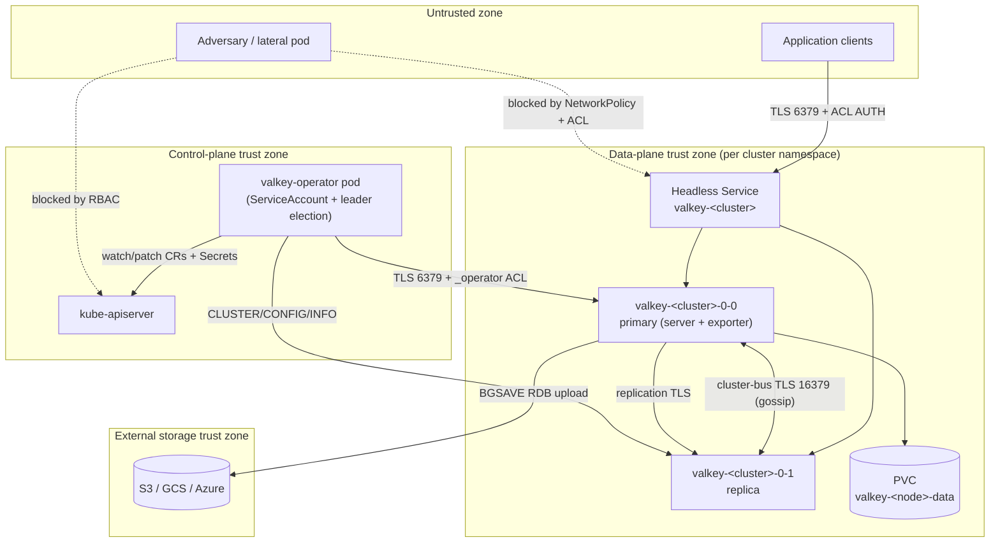
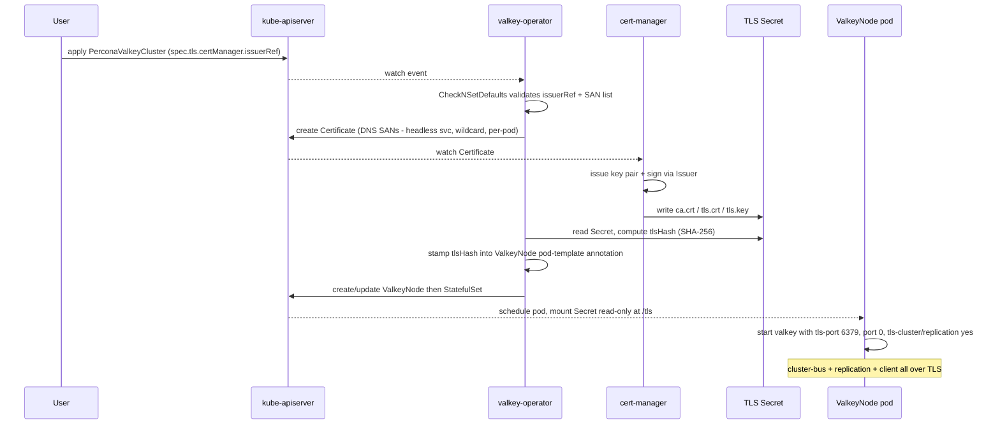
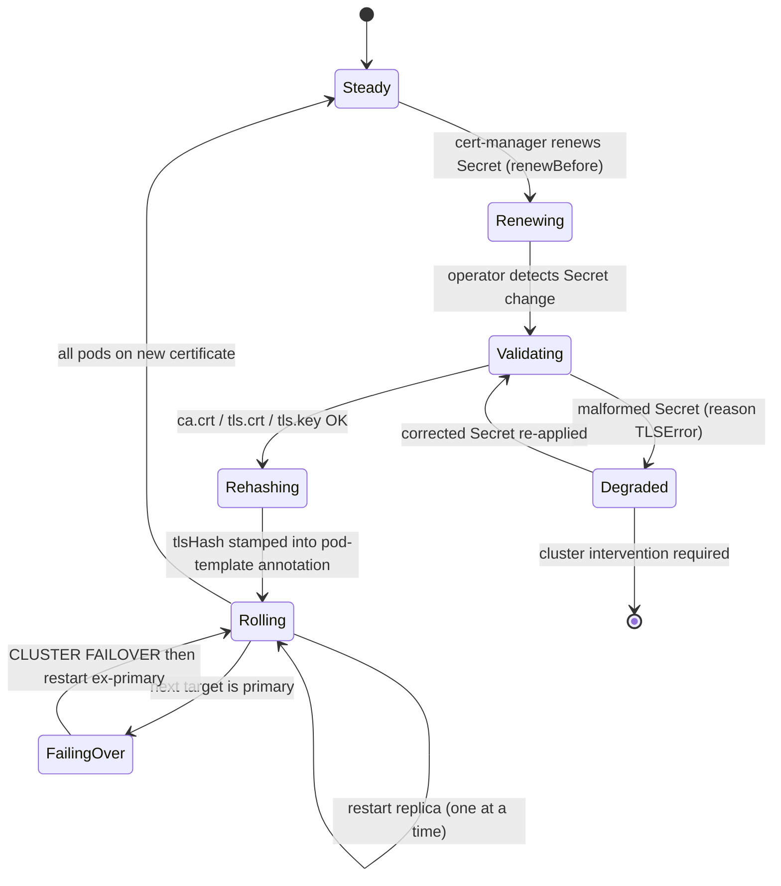
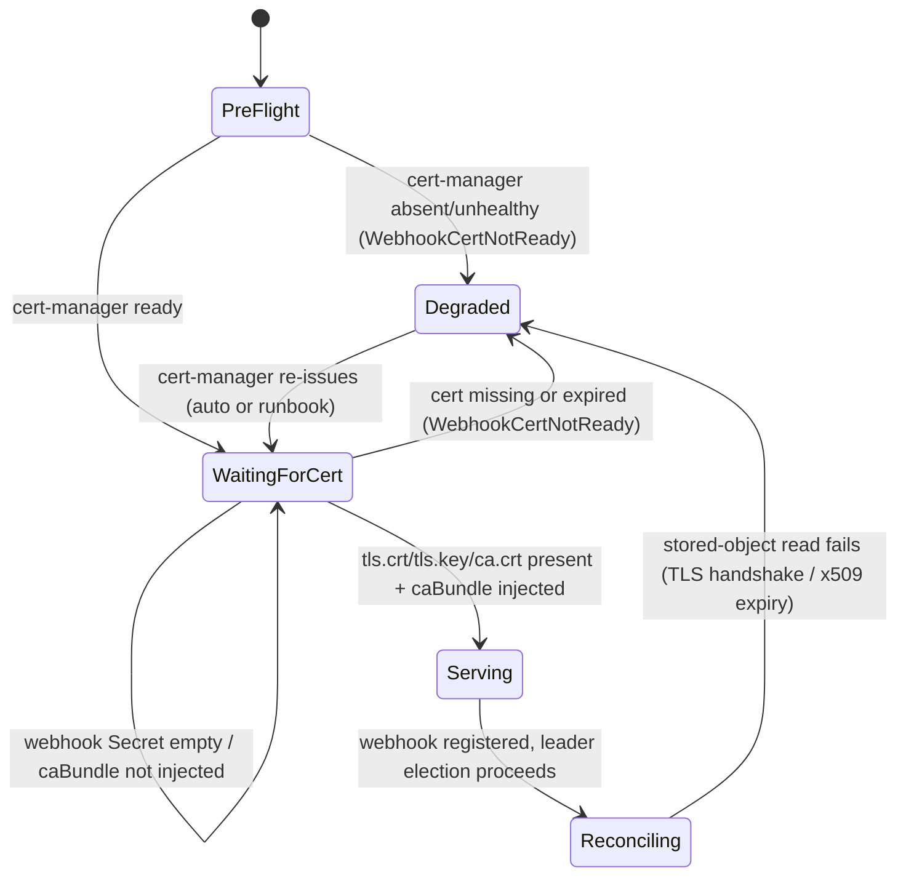
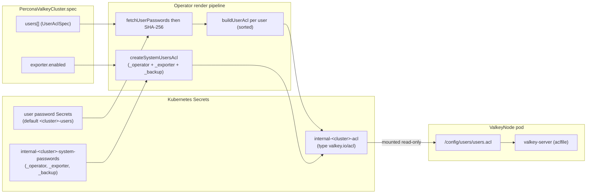
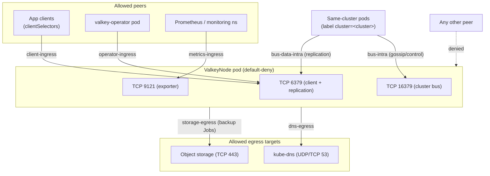

# Security Architecture

This document specifies the security architecture of the **Percona Operator for Valkey** (`percona-valkey-operator`, API group `valkey.percona.com`, version `v1alpha1`). It defines the threat model and trust boundaries; the in-transit TLS design (client `tls-port`, cluster-bus TLS, replication TLS) backed by cert-manager or a secret reference; the ACL/user model mapping `UserAclSpec` to `ACL SETUSER` directives, including the internal `_operator`, `_exporter`, and `_backup` system users and Valkey multi-password rotation; operator-to-node authentication; least-privilege RBAC with namespaced and cluster-wide (`cw-bundle`) variants; NetworkPolicy for data, cluster-bus, and metrics ports; secret management and encryption at rest; pod security context and image provenance; and an explicit mapping of every control back to the mandatory security checklist. All component, kind, label, and config-key names are used exactly as fixed by the design charter and grounded in the upstream `valkey-operator` and the Percona Operator-SDK trio (PXC / PSMDB / PS). Sibling documents are cross-referenced where they own a topic in depth: see [API & CRD Design](03-api-design.md), [Reconciliation Architecture](04-control-plane.md), [Backup & Restore](06-backup-restore.md), and [Observability](08-observability.md).

---

## 1. Scope and security principles

The operator is a privileged control-plane component that manages stateful database workloads. Its security posture rests on five non-negotiable principles, each of which maps to a concrete control later in this document:

1. **No hardcoded secrets.** Passwords, TLS keys, and object-storage credentials live only in Kubernetes `Secret` objects, never in CR specs, ConfigMaps, container images, or operator source. Required secrets are validated at startup and at every reconcile.
2. **Least privilege everywhere.** The operator `ClusterRole`/`Role` is scoped to exactly the API groups and verbs it uses; the Valkey `_operator` system user is granted only the `CLUSTER`/`CONFIG`/`INFO` subcommands it needs; NetworkPolicy denies all traffic not explicitly required.
3. **Defence in depth.** TLS in transit, ACL authentication, RBAC, NetworkPolicy, pod security context, and encryption at rest are independent layers; compromise of one does not collapse the others.
4. **Immutable, deterministic configuration.** Operator-managed security directives (`aclfile`, `tls-*`, `protected-mode`, `cluster-enabled`) are written last in the rendered config so they always win over user input; the config SHA-256 hash drives auditable rolling restarts.
5. **Fail closed, log clean.** Security-relevant failures (missing TLS secret, unreadable password key, ACL parse error) stall the reconcile with a `Degraded` condition and a Kubernetes Event rather than silently degrading; error messages never echo secret material.

---

## 2. Threat model and trust boundaries

### 2.1 Assets

| Asset | Where it lives | Primary protection |
|-------|----------------|--------------------|
| Valkey keyspace data | Pod memory + PVC (`valkey-<node>-data`) | ACL authz, TLS, encryption at rest, NetworkPolicy |
| System user passwords (`_operator`, `_exporter`, `_backup`) | `internal-<cluster>-system-passwords` Secret | RBAC on secrets, never in CR/logs |
| End-user ACL passwords | user-referenced Secrets (default `<cluster>-users`) | RBAC, multi-password rotation |
| Rendered ACL file | `internal-<cluster>-acl` Secret -> mounted `/config/users/users.acl` | Secret type, mount permissions |
| TLS private keys / CA | cert-manager-issued or referenced TLS Secret -> `/tls` | cert-manager, RBAC, file mode |
| Object-storage credentials | `PerconaValkeyBackup` storage Secret | RBAC, scoped backup Job SA |
| Cluster-bus gossip | Network (port 16379) | cluster-bus TLS, NetworkPolicy |

### 2.2 Actors and trust boundaries



**Boundary B1 — clients to data plane.** Untrusted application traffic crosses into the data plane only through the headless Service on the TLS client port (`6379`). It is authenticated by Valkey ACL (`AUTH`/`HELLO` with a user from `spec.users`) and encrypted by TLS. `protected-mode` is not the network perimeter here: it only gates loopback-vs-remote access when the server is bound broadly with no password, and since the operator always provisions ACL passwords it is effectively a no-op for security — so **NetworkPolicy, not protected-mode, is the enforced network perimeter** (the operator sets `protected-mode no` so pod-to-pod and operator connections to the non-loopback pod IP are accepted, and relies on ACL + NetworkPolicy + TLS for actual control).

**Boundary B2 — operator to API server.** The operator authenticates to `kube-apiserver` with its ServiceAccount token. Its blast radius is bounded entirely by RBAC (Section 6). Leader election ensures a single active reconciler, preventing split-brain mutation of CRs and Secrets.

**Boundary B3 — operator to data plane.** The operator connects to each node as the `_operator` system user over TLS using `valkey-go` with `ForceSingleClient=true` (grounding) to issue orchestration commands. This is a privileged but narrowly-scoped channel (Sections 4 and 5).

**Boundary B4 — intra-cluster traffic.** Two distinct intra-cluster channels exist: node-to-node gossip/heartbeat/failover-coordination crosses the **cluster bus** (port 16379), while the **replication stream** (and atomic slot-migration data) flows over the **data port** (6379) — the cluster bus carries control-plane messages only, not replication payload. With TLS enabled the operator sets `tls-cluster yes` (encrypts the bus) and `tls-replication yes` (encrypts the replication link on 6379) (grounding: `config.go`), so both channels are encrypted and validated against the shared CA.

**Boundary B5 — data plane to object storage.** Backup Jobs/sidecars ship RDB snapshots to S3/GCS/Azure using credentials from a storage Secret. Credentials are scoped to the backup ServiceAccount and never mounted into the long-running server pods. See [Backup & Restore](06-backup-restore.md).

### 2.3 Threats and mitigations (abridged STRIDE)

| Threat | Vector | Mitigation |
|--------|--------|-----------|
| **Spoofing** a client | Connect without auth | ACL `AUTH` required for all non-system users; system users hold strong random 26-char passwords |
| **Spoofing** a node | Rogue pod joins via `CLUSTER MEET` | cluster-bus TLS (`tls-cluster yes`) + NetworkPolicy restrict 16379 to cluster pods; operator-driven `MEET` only |
| **Tampering** with config | Edit ConfigMap to disable TLS/ACL | Operator-managed directives written last (override-proof); config hash triggers reconcile that reasserts them |
| **Repudiation** | Untraceable privileged action | Kubernetes Events + structured logs for every privileged op (`FailoverInitiated`, `ClusterMeetBatch`, etc.) |
| **Information disclosure** | Sniff client/replication traffic | TLS in transit on client, bus, and replication channels |
| **Information disclosure** | Read PVC at rest | Encryption at rest via encrypted StorageClass (Section 9) |
| **Denial of service** | Connection flood / memory exhaustion | `maxclients` (concurrent-connection cap), `maxmemory` + eviction policy (live-settable); PDB preserves quorum; NetworkPolicy + ACL restrict *who* can connect (access control, not request-rate limiting — Valkey has no built-in rate limiter) |
| **Elevation of privilege** | Compromised pod uses operator rights | Operator SA is separate from node SA; node SA has no API write rights; ACL denies `@admin`/`@dangerous` to app users |

---

## 3. TLS in transit

### 3.1 What gets encrypted

Valkey supports three independent TLS surfaces, all of which the operator enables together when `spec.tls` is set (grounded in upstream `buildManagedConfig`, `internal/controller/config.go`):

| Surface | Config key (operator-managed) | Value when TLS on |
|---------|-------------------------------|-------------------|
| Client connections | `tls-port` | `6379` (the `DefaultPort`) |
| Plain TCP (disabled) | `port` | `0` |
| Cluster-bus gossip | `tls-cluster` | `yes` |
| Replication stream | `tls-replication` | `yes` |
| Server certificate | `tls-cert-file` | `/tls/tls.crt` |
| Server private key | `tls-key-file` | `/tls/tls.key` |
| Trust anchor | `tls-ca-cert-file` | `/tls/ca.crt` |
| Client-cert policy | `tls-auth-clients` | `optional` (default) |

> **Critical TLS behaviour (grounding pitfall):** when TLS is enabled the operator sets `port 0`, fully disabling the plaintext client port. Clients **must** use the `tls://` scheme against port 6379; a plain TCP connection is refused. This is documented prominently for users in [Observability](08-observability.md) and the user docs, because it is the single most common connection error.

The expected Secret shape is exactly three keys (grounding: `utils.go` constants `tlsSecretKeyCA="ca.crt"`, `tlsSecretKeyCert="tls.crt"`, `tlsSecretKeyKey="tls.key"`), mounted read-only at `/tls`:

```
ca.crt   # trust anchor (CA bundle)
tls.crt  # server certificate (leaf + chain)
tls.key  # server private key
```

The metrics exporter sidecar is wired with `--tls-ca-cert-file=/tls/ca.crt` (grounding: `metrics_exporter.go`) so it scrapes the local node over TLS using the same CA.

### 3.2 `tls-auth-clients`: recommendation and alternatives

- **Recommendation (default): `tls-auth-clients optional`** (matches upstream). The server presents and validates its own certificate and encrypts all traffic, but does not *require* a client certificate — clients still authenticate by ACL password over the encrypted channel. This gives encryption-in-transit and server authentication without forcing every application to provision a client cert, which is the right default for most deployments.
- **Hardened alternative: `tls-auth-clients yes` (mutual TLS).** Exposed via `spec.tls.authClients: required`, this rejects any client that does not present a CA-signed certificate, adding network-level client authentication on top of ACL. Recommended for zero-trust environments where client identity must be cryptographically proven, at the cost of client-side cert lifecycle management. The operator surfaces this as a single enum field rather than raw config so it cannot be partially configured.

Within the cluster, `tls-cluster yes` and `tls-replication yes` always apply mutual validation of the shared CA on the bus and replication channels regardless of the client-cert policy — gossip and replication are never optional-mTLS.

### 3.3 Certificate provisioning: cert-manager vs secret reference

`spec.tls` is a discriminated union with two mutually exclusive provisioning modes. **Recommendation: cert-manager-issued certificates**, because they rotate automatically and integrate with the platform PKI; the secret-reference mode exists for air-gapped or externally-managed PKI.

| Field | Mode | Behaviour |
|-------|------|-----------|
| `spec.tls.certManager.issuerRef` | cert-manager (recommended) | Operator creates a `cert-manager.io/v1` `Certificate` with DNS SANs for the headless Service and per-pod names; cert-manager populates the TLS Secret |
| `spec.tls.secretName` | secret reference (alternative) | User supplies a pre-existing Secret with `ca.crt`/`tls.crt`/`tls.key`; operator validates the three keys exist and fails closed if any is missing (grounding: upstream parses `ca.crt` and errors if it cannot) |

The provisioning sequence for cert-manager mode:



### 3.4 Certificate rotation

**Honest limitation (grounding pitfall):** Valkey does not hot-reload TLS material; a certificate change requires the pod to restart, and an expired certificate causes pod startup failure that stalls the cluster. The operator therefore makes rotation *safe and automatic* rather than zero-restart:

1. cert-manager renews the Secret ahead of expiry (configurable `renewBefore`).
2. The operator watches the TLS Secret, recomputes the `tlsHash`, and stamps it into the ValkeyNode pod-template annotation (same mechanism as the config hash, see [Reconciliation Architecture](04-control-plane.md)).
3. The annotation change triggers a **one-at-a-time rolling restart, replicas before primary, with proactive `CLUSTER FAILOVER` before rolling a primary** (grounding: charter reconcile principles). The cluster keeps serving throughout.
4. A `Degraded` condition with reason `TLSError` plus a Warning Event is raised if the renewed Secret is malformed, so rotation never silently breaks the cluster.

The rotation state machine the operator drives off the TLS-Secret watch:



For the secret-reference mode the same watch-and-roll mechanism applies; the user is responsible for rotating the referenced Secret before the certificate expires. A validating consideration (future): warn via Event when the leaf certificate is within N days of `notAfter`.

### 3.5 Conversion-webhook / cert-manager bootstrap ordering (upgrade race)

`PerconaValkeyCluster` is served at multiple API versions across the operator's life: the GA charter ships `v1alpha1`, and a future `v1` promotion is served *through a conversion webhook* so that objects stored at the old version are transparently converted on read. That webhook is itself served over TLS, with the serving certificate issued by **cert-manager** (a `Certificate` whose Secret backs the webhook server, plus a `caBundle` injected into the `CustomResourceDefinition`'s `conversion.webhook.clientConfig` via cert-manager's CA-injector). This creates a **bootstrap ordering hazard during an operator upgrade**, when `v1alpha1` and `v1` CRDs coexist and the API server must call the webhook to convert *every* stored object — including the operator's own reads of its CRs. If the webhook TLS material is not ready, those reads fail with a TLS/connection error, the reconcile cannot fetch the cluster CR, and the upgrade stalls cluster-wide.

The operator handles this in three layers:

1. **Pre-flight requirement: cert-manager must be ready.** Before the new operator version begins serving the conversion webhook, a pre-flight check verifies cert-manager is installed and healthy (its CRDs are present and its CA-injector/webhook Deployments are Available). The operator install docs make cert-manager a hard prerequisite for the `v1` conversion path; if it is absent the operator refuses to advertise the conversion webhook and surfaces a `Degraded` condition with reason `WebhookCertNotReady` rather than presenting a CRD that the API server cannot call.
2. **Webhook startup gate.** The manager process **blocks startup of the webhook server until the cert Secret is populated** and parseable. On boot the operator waits (with bounded backoff) for cert-manager to write `tls.crt`/`tls.key`/`ca.crt` into the webhook Secret and for the `caBundle` to be injected into the CRD; only then does it register the webhook handler and report ready. Leader election does not begin reconciling clusters until this gate passes, so the API server never routes a conversion call to a webhook whose TLS material is missing.
3. **Recovery if the webhook TLS cert is missing or expired.** Because conversion happens on every read of a stored object, a missing or expired webhook certificate makes **stored-object reads fail** — not just writes — which would otherwise silently brick reconciliation. The operator detects the failure mode (TLS handshake / x509 expiry errors on its own client reads, or the webhook server failing to load its keypair), raises a `Degraded` condition with reason `WebhookCertNotReady` plus a Warning Event, and re-enters the startup gate: it re-watches the webhook Secret and resumes only once cert-manager re-issues a valid certificate. A documented recovery runbook covers forcing cert-manager to re-issue (delete the webhook `Certificate`/Secret so cert-manager regenerates it and re-injects the `caBundle`) for the case where automatic renewal has already lapsed.



> **Why this is HIGH, not cosmetic:** during the window where `v1alpha1` and `v1` coexist, the conversion webhook sits on the read path for the operator's own CRs. A webhook cert that is missing or expired turns a routine upgrade into a cluster-wide reconcile outage, and the failure manifests as opaque API-server errors rather than an obvious cert problem — hence the explicit pre-flight, startup gate, and recovery path above.

---

## 4. ACL and users

Authentication and authorization at the database layer are governed entirely by the Valkey ACL subsystem (Valkey 7.0+; charter targets 9.0.0). The operator renders a single `users.acl` file into the `internal-<cluster>-acl` Secret, which is mounted at `/config/users/users.acl` and loaded by Valkey via the operator-managed `aclfile` directive (grounding: `config.go` sets `aclfile=/config/users/users.acl`). See [API & CRD Design](03-api-design.md) for the full CRD field reference.

### 4.1 `UserAclSpec` to `ACL SETUSER` mapping

Each `spec.users[]` entry is a `UserAclSpec`; the operator's `buildUserAcl` deterministically emits one `user <name> ...` line (grounding: `users.go`). The mapping is exact:

| `UserAclSpec` field | ACL token emitted | Notes |
|---------------------|-------------------|-------|
| `name` | `user <name>` | Must NOT start with `_` (CEL rule reserves `_`-prefixed names for system users) |
| `enabled: true/false` | `on` / `off` | Disabled users cannot authenticate |
| `passwordSecret.{name,keys}` | `#<sha256-hash>` per password | Passwords fetched from Secret, SHA-256-hashed before write; multiple keys -> multiple `#` tokens for rotation |
| `nopass: true` | `nopass` | Passwordless; emitted only when not resetting |
| `resetpass: true` | (suppresses password/nopass tokens) | Strips all passwords; user cannot auth until a password is re-added |
| `commands.allow[]` | `+<cmd>` each | Categories `@read`/`@write`/`@admin`/`@all`, commands `get`, subcommands `cluster\|nodes`; validated against `^[@a-z0-9|_-]+$` (allows hyphens/digits/underscores so real tokens like `cluster\|set-config-epoch`, `client\|no-evict`, `bitfield_ro` pass) |
| `commands.deny[]` | `-<cmd>` each | Same syntax, denies |
| `keys.readWrite[]` | `~<pattern>` each | Full key access |
| `keys.readOnly[]` | `%R~<pattern>` each | Read-only key class |
| `keys.writeOnly[]` | `%W~<pattern>` each | Write-only key class |
| `channels.patterns[]` | `resetchannels` (once) then `&<pattern>` per entry | `resetchannels` is emitted exactly once, before the patterns, to drop default channel access; each pattern then adds `&<pattern>` |
| `permissions` (`RawAcl`) | appended verbatim | Escape hatch for advanced ACL tokens |

Token emission order is fixed (name, on/off, password, keys, channels, allow, deny, raw) and `spec.users` is sorted by name before rendering (grounding: `slices.SortFunc`), guaranteeing a **deterministic ACL file** so the config/ACL hash does not churn and trigger spurious rolling restarts.

Example: a least-privilege application user.

```yaml
spec:
  users:
    - name: app
      enabled: true
      passwordSecret:
        name: app-creds
        keys: ["password", "password-next"]   # multi-password rotation
      commands:
        allow: ["@read", "@write"]
        deny: ["@admin", "@dangerous", "flushall", "flushdb"]
      keys:
        readWrite: ["app:*"]
      channels:
        patterns: ["app.*"]
```

renders to:

```
user app on #<sha256(password)> #<sha256(password-next)> ~app:* resetchannels &app.* +@read +@write -@admin -@dangerous -flushall -flushdb
```

### 4.2 ACL Secret to aclfile to Valkey pod



Render order: user-defined users first, then the system users appended last (grounding: `reconcileUsersAcl` appends `createSystemUsersAcl` output after the loop).

**Secret shape (single source of truth):** the operator builds a Kubernetes Secret of type **`valkey.io/acl`** named **`internal-<cluster>-acl`**, containing one data key whose value is the full ACL file (all `user ...` lines, deterministically ordered and rendered with each `#<sha256-hex...>` filled from the cluster's password material). It is mounted into every Valkey pod at **`/config/users/users.acl`** and referenced by the server config as **`aclfile /config/users/users.acl`**. Because the file is generated deterministically from the operator's Secret (sorted users, fixed rule order), the rendered output is byte-stable across reconciles, so the file hash is suitable for triggering rolling restarts only on real ACL changes.

### 4.3 System users: `_operator`, `_exporter`, `_backup`

The operator auto-creates three system users in `internal-<cluster>-system-passwords`, each with a 26-character random password, and is forbidden from overriding them if a user defines a `_`-prefixed name (the CEL `XValidation` on `UserAclSpec.name` rejects `_`-prefixed user names, eliminating the upstream lock-out pitfall by construction). The three ACL lines below are the **canonical, least-privilege** definitions — they are identical to the ones in [API & CRD Design](03-api-design.md) and [Reconciliation Architecture](04-control-plane.md), and the renderer emits them verbatim.

> Valkey 9 syntax. Every grant carries an explicit `+`/`-` prefix. A **bare** command (e.g. `+cluster`) grants **all** of that command's subcommands; `+cluster|info` grants only that one subcommand. `resetchannels` and `resetkeys` flush the channel/key pattern lists so the user starts from *deny* (no keyspace, no pub/sub). A hashed password is the bare rule `#<sha256-hex>` (64 lowercase hex chars); `>` is for cleartext and must **not** be combined with `#`. Passwords are sourced from the operator-managed Secret and injected verbatim by the renderer at the `#<...>` position.

```acl
user _operator on #<sha256-hex-of-operator-password> resetchannels resetkeys -@all +cluster +config|get +config|set +info +client|setname +client|setinfo +replicaof +wait +ping
user _exporter on #<sha256-hex-of-exporter-password> resetchannels resetkeys -@all +info +cluster|info +latency +ping
user _backup   on #<sha256-hex-of-backup-password>   resetchannels resetkeys -@all +bgsave +lastsave +save +info +wait +ping
```

**Rationale (one line per user):**

- **`_operator`** — Cluster-orchestration user. Uses a **bare `+cluster`** because the operator drives nearly every CLUSTER subcommand (MEET, ADDSLOTSRANGE, SETSLOT, REPLICATE, FAILOVER, FORGET, MIGRATESLOTS, GETSLOTMIGRATIONS, NODES, INFO, SHARDS, MYID, RESET, plus 9.0's SYNCSLOTS for atomic slot migration); enumerating them invites silent drift as Valkey adds subcommands, while the still-tight `-@all` floor and `resetkeys`/`resetchannels` keep it off all keys and channels. Plus scoped `config|get`/`config|set`, `info`, `client|setname`/`client|setinfo`, `replicaof` (replication mode), `wait`, and `ping` — no broader `@admin`/`@dangerous` and no keyspace/pub-sub. A compromised operator credential cannot exfiltrate user data through this account.
- **`_exporter`** — Read-only metrics scraper: `+info`, `+cluster|info` (single subcommand only, **not** bare `+cluster`, since it must never orchestrate), `+latency` (LATEST/HISTORY/RESET; read-only metrics in practice), and `+ping` for liveness; `-@all` + `resetkeys`/`resetchannels` deny everything else, all keys, and all channels. Created only when `spec.exporter.enabled` is true (grounding: skipped in `createSystemUsersAcl` when exporter disabled). Kept password-protected (not `nopass`) because the operator Secret already supplies a credential.
- **`_backup`** — Server-side snapshot user: `+bgsave`, `+lastsave`, `+save`, `+info`, optional `+wait` (await replica acks before snapshotting), and `+ping`. RDB is produced server-side, so **no keyspace access** (`resetkeys`) and no channels (`resetchannels`); `-@all` blocks everything else including CONFIG and CLUSTER.

### 4.4 Multi-password rotation, `resetpass`, `nopass`

Valkey supports multiple passwords per user (grounding: engine facts, `PasswordSecret.keys[]`). Rotation is zero-downtime:

1. Add the new password as an additional key in the user's Secret and list it in `passwordSecret.keys` alongside the old one. The operator emits two `#<hash>` tokens; clients authenticating with either succeed.
2. Migrate clients to the new password.
3. Remove the old key from `passwordSecret.keys`. The next reconcile re-renders the ACL with only the new hash; the old password stops working.

`resetpass: true` strips every password (emergency lock-out of a user without deleting it); `nopass: true` makes a user passwordless (test-only — discouraged and flagged in docs). System-user password changes are applied via `ACL SETUSER` semantics on the next reconcile by re-rendering the aclfile and rolling, consistent with the upstream model.

> **Operational guardrail (grounding pitfall):** deleting a user's password Secret removes the auth material and breaks that user's clients; there is no automatic recovery beyond restoring the Secret. RBAC restricts who can delete Secrets, and finalizers protect operator-managed Secrets from premature GC.

### 4.5 ACL validation, the malformed-rule trap, and mitigations

The ACL file is built **deterministically from the spec, not from a live `CONFIG`/`ACL SETUSER` round-trip against a running server.** The renderer emits `users.acl` from typed builders (Section 4.1) and writes it into the `internal-<cluster>-acl` Secret; the engine loads it from disk at startup via `aclfile`. There is no apply-time dialogue with Valkey in which a bad rule could be rejected interactively — the first time the engine sees the rules is when it parses the file on boot.

**The trap:** Valkey treats a malformed `aclfile` as a fatal startup error. A single bad token — a command typo (`+getx`), a category typo (`+@reed`), or a token **missing its `+`/`-` prefix** (e.g. `getrange` instead of `+getrange`) — makes the server **refuse to start**, so the affected pod enters a **crash-loop**. Critically, **the operator does not validate ACL syntax at apply-time**: CEL only constrains token *shape* (`^[@a-z0-9|_-]+$`, plus the `_`-prefix name rule), and the renderer escape hatch (`permissions` / `RawAcl`, appended verbatim, Section 4.1) bypasses even that. A rule that passes CEL can still be semantically invalid to the engine, and the failure surfaces only as a crashing pod, not as an admission rejection.

Mitigations layer admission-time, runtime-detection, and operator recovery:

- **CEL validation for command tokens where feasible.** The CRD's `XValidation` rules catch the cheap, statically-checkable mistakes at admission: the `^[@a-z0-9|_-]+$` pattern rejects whitespace, stray prefixes embedded mid-token, and obvious garbage, and the `_`-prefix rule protects the system users. This narrows the blast radius but **cannot** verify that a command/category actually exists in the target engine — full validation would require the engine's command table, which the API server does not have.
- **Crash-loop detection surfaced as a condition.** The operator watches node-pod state and treats a pod that crash-loops immediately after an ACL change as an ACL-parse failure: it raises a `Degraded`/`UsersAclError` condition (the same reason already used elsewhere for ACL problems) plus a Warning Event naming the offending user/secret, so the failure reads as "bad ACL" rather than an opaque `CrashLoopBackOff`. Because the rendered file is byte-stable (Section 4.2), the operator can correlate the crash with the specific reconcile that changed the ACL hash.
- **Revert-`spec.users` runbook.** Recovery is to revert the offending `spec.users` change (or remove the bad `permissions`/`RawAcl` escape-hatch token): the next reconcile re-renders a valid `users.acl`, the Secret updates, and the crash-looping pod recovers on its next restart. The runbook documents reverting the last edit (or `kubectl edit`/GitOps rollback) as the first response, and recommends staging risky ACL changes — especially raw `permissions` tokens — on a non-production cluster first, since there is no apply-time engine validation to catch them.

---

## 5. Operator-to-node authentication

The operator's privileged connection to each node (Boundary B3) is itself an authenticated, encrypted, least-privilege channel:

1. **Identity:** the operator authenticates as `_operator`, reading its password from `internal-<cluster>-system-passwords` (grounding: `operatorUserPasswordSecret` returns a `SecretKeySelector` for key `_operator`). The password is fetched per reconcile from the API, never cached in the CR or logs.
2. **Transport:** when TLS is enabled the operator dials the node over `tls://...:6379` validating the node certificate against the same `ca.crt` it provisions. It connects using the per-pod **DNS name** (`valkey-<cluster>-<shard>-<node>.<headless-svc>...`), which is present in the certificate SAN list (Section 3.3), so standard TLS hostname verification succeeds; dialing a bare pod IP would fail verification unless an IP SAN is issued, so the DNS path is the contract. When TLS is disabled it uses plaintext within the NetworkPolicy-fenced namespace.
3. **Client mode:** `valkey-go` with `ForceSingleClient=true` (grounding) pins each connection to a single node and disables client-side `MOVED`/`ASK` redirect following, so an orchestration command always lands on the intended node and cannot be silently redirected to a stale or attacker-controlled node.
4. **Authorization:** bounded by the `_operator` ACL (Section 4.3) — the database itself enforces that the operator cannot touch keyspace data.
5. **Staleness safety (grounding pitfall):** pod endpoint state (IP behind the per-pod DNS name, readiness) is read live from pod state each reconcile, not cached; after a pod reschedule the DNS record / endpoint may briefly lag, so connection failures are treated as transient and the reconcile requeues with backoff rather than acting on a wrong or stale target.

---

## 6. RBAC: least-privilege operator permissions

The operator ServiceAccount is granted only the API access the controllers exercise. Markers are generated by `controller-gen` from the controller source and materialized into `deploy/` (`bundle.yaml` namespaced, `cw-bundle.yaml` cluster-wide), matching the Percona convention.

### 6.1 Operator ClusterRole/Role (least privilege)

Derived directly from the upstream marker set (grounding: `valkeycluster_controller.go` and `valkeynode_controller.go` `+kubebuilder:rbac` markers), re-homed to the `valkey.percona.com` group:

| API group | Resources | Verbs | Why |
|-----------|-----------|-------|-----|
| `valkey.percona.com` | `perconavalkeyclusters`, `valkeynodes`, `perconavalkeybackups`, `perconavalkeyrestores` | `get;list;watch;create;update;patch;delete` | Own and drive all CRs |
| `valkey.percona.com` | `.../status` | `get;update;patch` | Write derived `status.state` + conditions |
| `valkey.percona.com` | `.../finalizers` | `update` | Ordered teardown + backup-artifact cleanup |
| `""` (core) | `services`, `configmaps` | `get;list;watch;create;update;patch;delete` | Headless Service, config render |
| `""` (core) | `secrets` | `get;list;watch;create;update;patch;delete` | System-password, ACL, TLS Secrets |
| `""` (core) | `persistentvolumeclaims` | `get;list;watch;create;update;patch;delete` | PVC `valkey-<node>-data` lifecycle |
| `""` (core) | `pods` | `get;list;watch` | Read live role/IP/readiness (no write) |
| `apps` | `statefulsets`, `deployments` | `get;list;watch;create;update;patch;delete` | ValkeyNode workloads |
| `batch` | `jobs` | `get;list;watch;create;update;patch;delete` | Backup/restore Jobs |
| `policy` | `poddisruptionbudgets` | `get;list;watch;create;update;patch;delete` | Quorum-preserving PDBs |
| `events.k8s.io` | `events` | `create;patch` | Audit-grade Events |
| `cert-manager.io` | `certificates` | `get;list;watch;create;update;patch;delete` | cert-manager TLS mode only |
| `coordination.k8s.io` | `leases` | `get;list;watch;create;update;patch;delete` | Leader election + backup serialization |

The operator deliberately holds **read-only** access to `pods` (it never writes pod objects directly — workloads are mutated via StatefulSet/Deployment) and **no** access to nodes, namespaces, RBAC objects, or cluster-scoped infrastructure. There is no wildcard verb or wildcard resource.

### 6.2 Node ServiceAccount

ValkeyNode pods run under a separate, **near-zero-privilege** ServiceAccount with no Kubernetes API write access. This enforces Boundary B5: a compromised data pod cannot manipulate CRs, Secrets, or other workloads via the API. Token automounting is disabled for server pods unless a sidecar provably needs it.

### 6.3 Namespaced vs cluster-wide (`cw-bundle`)

Two install profiles, both shipped from `deploy/`:

- **Namespaced (`bundle.yaml`) — recommended default.** A `Role`/`RoleBinding` in the watched namespace; the operator watches only that namespace. Smallest blast radius; preferred for multi-tenant clusters.
- **Cluster-wide (`cw-bundle.yaml`).** A `ClusterRole`/`ClusterRoleBinding`; the operator watches all (or a configured set of) namespaces. Convenient for platform teams but larger blast radius; use only when one operator must serve many namespaces.

### 6.4 Per-CRD aggregated viewer/editor/admin roles

For human/automation RBAC, the operator ships aggregation-labeled `ClusterRole`s per CRD (Percona/Kubebuilder convention), so platform admins can bind end users without granting operator-level rights:

| Role | Verbs on `perconavalkeyclusters`/backups/restores | Audience |
|------|---------------------------------------------------|----------|
| `*-viewer` | `get;list;watch` | Read-only / on-call |
| `*-editor` | `get;list;watch;create;update;patch;delete` (CR only) | App teams managing their own clusters |
| `*-admin` | editor + status + cross-namespace where granted | Platform operators |

These carry `rbac.authorization.k8s.io/aggregate-to-*` labels so they compose with the cluster's built-in admin/edit/view roles. `ValkeyNode` is intentionally **not** given a user-facing editor role — it is an internal implementation CR and users must never edit it directly.

---

## 7. NetworkPolicy

The operator can render NetworkPolicies (opt-in via `spec.networkPolicy.enabled`, recommended `true` in production) that default-deny and then allow only the explicitly required flows (client, operator, intra-cluster bus, intra-cluster replication, metrics scrape, plus DNS and object-storage egress). Ports follow the Valkey contract: client `6379`, cluster bus `16379` (= client + 10000), metrics `9121` (exporter).

| Policy | Direction | Peer | Port | Purpose |
|--------|-----------|------|------|---------|
| client-ingress | Ingress | namespaces/pods matching `spec.networkPolicy.clientSelectors` | TCP 6379 | Application data access (TLS + ACL) |
| operator-ingress | Ingress | operator pod (label `app.kubernetes.io/name=valkey-operator`) | TCP 6379 | `_operator` orchestration |
| bus-intra | Ingress + Egress | pods labeled `valkey.percona.com/cluster=<cluster>` | TCP 16379 | Cluster bus: gossip/heartbeat, config propagation, failover coordination (cluster-bus TLS) |
| bus-data-intra | Ingress + Egress | same cluster pods | TCP 6379 | Replication stream + slot migration between nodes (replication TLS) |
| metrics-ingress | Ingress | monitoring namespace / Prometheus selector | TCP 9121 | Scrape exporter |
| storage-egress | Egress | object-storage CIDR/FQDN | TCP 443 | Backup upload (backup Jobs) |
| dns-egress | Egress | kube-dns | UDP/TCP 53 | Name resolution |

Everything else is denied. The cluster-bus rules are scoped by the `valkey.percona.com/cluster` label so one cluster's gossip cannot reach another's pods, mitigating cross-cluster `CLUSTER MEET` spoofing (Boundary B4).

The default-deny perimeter and the only permitted flows:



---

## 8. Secret management

### 8.1 Inventory and ownership

| Secret | Default name | Type | Owner / lifecycle |
|--------|--------------|------|-------------------|
| System passwords | `internal-<cluster>-system-passwords` | `Opaque` | Operator-created, 26-char random, owner-ref to cluster |
| Rendered ACL | `internal-<cluster>-acl` | `valkey.io/acl` | Operator-rendered each reconcile |
| User passwords | `<cluster>-users` (or per-user `passwordSecret.name`) | `Opaque` | User-supplied; operator reads only |
| TLS material | cert-manager-issued or `spec.tls.secretName` | `kubernetes.io/tls`-shaped (`ca.crt`/`tls.crt`/`tls.key`) | cert-manager or user |
| Object-storage creds | per-storage in `PerconaValkeyBackup` | `Opaque` | User-supplied; backup Job only |

### 8.2 Controls

- **No hardcoded secrets.** Source, images, ConfigMaps, and CR specs contain only Secret *references*. Passwords are SHA-256-hashed before they ever touch the ACL file (grounding: `passwordHash := sha256.Sum256(...)`), so plaintext passwords are never persisted in the rendered config.
- **Required-at-startup validation.** `CheckNSetDefaults` (invoked every reconcile, Percona convention) verifies that referenced Secrets and keys exist and are readable; a missing system-password Secret is auto-created, but a missing user/TLS/storage Secret fails the reconcile closed with a `Degraded` condition and a Warning Event — never silent degradation.
- **Rotation.** User passwords rotate via multi-password (Section 4.4); TLS rotates via cert-manager + roll (Section 3.4); system passwords can be re-randomized by deleting the system Secret (operator recreates and rolls).
- **GC protection.** Operator-managed Secrets carry owner references for automatic cleanup on cluster deletion, gated by finalizers so backup-artifact and credential cleanup is ordered (charter finalizer principle).
- **Least exposure.** Object-storage credentials are mounted only into short-lived backup Jobs, never the long-running server pods (Boundary B5).

### 8.3 Encryption at rest

Keyspace data persists to the `valkey-<node>-data` PVC and to RDB snapshots in object storage. The operator does not implement application-level encryption; instead it relies on platform encryption at rest:

- **Recommendation:** provision PVCs from an **encrypted StorageClass** (e.g., a CSI driver with cloud-KMS or LUKS-backed volumes). The cluster spec accepts `spec.persistence.storageClassName`; document the encrypted class as the default.
- **Object storage:** enable server-side encryption (SSE-S3/SSE-KMS, GCS CMEK, Azure SSE) on the backup bucket/container. See [Backup & Restore](06-backup-restore.md).
- **Immutability constraints (grounding pitfall):** once set, the storage class cannot be changed and storage can only expand — choose the encrypted class at cluster creation.

---

## 9. Pod security and image provenance

### 9.1 Pod security context

Server, exporter, backup, and sidecar containers run under a hardened, non-root context that satisfies the Kubernetes **restricted** Pod Security Standard:

| Setting | Value | Rationale |
|---------|-------|-----------|
| `runAsNonRoot` | `true` | No root in container |
| `runAsUser`/`fsGroup` | non-zero (e.g., 1001) | Owns `/data`, `/tls`, `/config` mounts |
| `allowPrivilegeEscalation` | `false` | Block setuid escalation |
| `readOnlyRootFilesystem` | `true` (writable `emptyDir` for scratch) | Immutable image surface |
| `capabilities.drop` | `["ALL"]` | No Linux capabilities needed |
| `seccompProfile.type` | `RuntimeDefault` | Syscall filtering |
| automountServiceAccountToken | `false` for server pods | Reduce API-token exposure |

TLS and ACL mounts are read-only; the only writable persistent path is the data volume.

### 9.2 Image provenance and signing

- **Registry split (Percona convention):** GA images under `percona/*` (`percona/valkey-operator`, `percona/percona-valkey`, `percona/valkey-backup`, exporter image); dev/main builds under `perconalab/*`. Never ship a release built from a tree repointed at `perconalab/*:main-*` dev tags.
- **Pin by digest in production.** Recommend referencing images by `@sha256:` digest (or at minimum immutable version tags) so the running bits are provenance-verifiable.
- **Signature verification.** Recommend signing release images (cosign/Sigstore) and enforcing verification with an admission policy (e.g., Kyverno/policy-controller) at the cluster level. The operator does not perform verification itself but documents the supported signing flow and ships the public key reference with the OLM bundle.
- **Compatibility (grounding pitfall):** all containers in a pod (server, exporter, sidecars) must be mutually compatible — the operator pins matched defaults (server `percona/percona-valkey` based on Valkey 9.0.0, exporter, backup) and exposes overrides, but performs no runtime version negotiation; mismatches are the user's responsibility and are documented.

### 9.3 Platform differences

The hardened context in 9.1 is designed to pass the strictest admission controls on every supported platform, but each platform enforces it differently and needs platform-specific setup:

- **OpenShift (restricted SCC).** OpenShift admits pods through SecurityContextConstraints rather than (only) Pod Security Admission. The operator and DB pods are built to pass the default **`restricted`/`restricted-v2` SCC**: containers run **nonroot** with `runAsNonRoot: true`, `allowPrivilegeEscalation: false`, all capabilities dropped, and a `RuntimeDefault` seccomp profile. Crucially, the pods do **not** pin a fixed `runAsUser`/`fsGroup` that fights OpenShift's per-namespace UID allocation — they tolerate the arbitrary, namespace-assigned non-root UID the SCC injects (the `/data`, `/tls`, `/config` mounts are group-writable via the assigned `fsGroup`), so no custom SCC or `anyuid` grant is required. The operator ServiceAccount needs no elevated SCC binding.
- **Kubernetes 1.30+ Pod Security Admission.** On upstream Kubernetes with Pod Security Admission enabled, the target namespace **must be labeled `pod-security.kubernetes.io/enforce: restricted`** (optionally with matching `audit`/`warn` labels) for the intended posture to be enforced. Because the pod security context in 9.1 already satisfies the `restricted` profile, no exception or `privileged`/`baseline` downgrade is needed — but the operator does not label the namespace for the user; the install docs call out applying the `enforce: restricted` label (and, for cluster-wide installs, labeling each watched namespace) so PSA actually gates the workload.
- **CSI driver selection for encrypted PVCs.** Encryption at rest (Section 8.3) is delivered by the **StorageClass / CSI driver**, which differs per platform; choose an encrypted class at cluster creation (it cannot be changed later — Section 8.3 immutability note). Representative encrypted classes: **AWS EBS `gp3`** (KMS-encrypted via the EBS CSI driver), **GKE `pd-ssd`** (Google-managed or CMEK encryption via the PD CSI driver), and **AKS `Premium_LRS`** (platform/Key Vault encryption via the Azure Disk CSI driver). Set `spec.persistence.storageClassName` to the platform's encrypted class.

---

## 10. Mapping to the mandatory security checklist

The mandatory pre-commit security checklist maps to concrete controls as follows:

| Checklist item | How this architecture satisfies it | Section |
|----------------|------------------------------------|---------|
| **No hardcoded secrets** | All credentials in `Secret` objects referenced by name/key; passwords SHA-256-hashed into the ACL file; nothing secret in source/images/CRs | 8.1, 8.2 |
| **All user input validated** | CRD `XValidation` (CEL) rules: ACL command pattern `^[@a-z0-9|_-]+$` (permits hyphen/digit/underscore tokens), user names cannot start with `_`, persistence/Deployment mutual exclusion; `CheckNSetDefaults` validates Secret refs each reconcile; fail-closed at the boundary | 4.1, 4.3, 8.2 |
| **Injection prevention** | No SQL/command string concatenation against the engine; ACL/config rendered through typed builders with sorted, validated tokens — not raw interpolation; cluster commands are fixed verbs via `valkey-go` | 4.1, 5 |
| **XSS prevention** | N/A (no HTML/UI surface); status/Events are structured data | — |
| **CSRF protection** | N/A (no browser-facing endpoints); the only external HTTP surface is the Prometheus `/metrics` exporter, which is read-only and NetworkPolicy-scoped | 7 |
| **Authentication/authorization verified** | Three layers — ACL (database), RBAC (control plane), optional mTLS (network); least-privilege `_operator`/`_exporter`/`_backup`; separate node SA | 4, 5, 6 |
| **Rate limiting on all endpoints** | Partial / by design: Valkey exposes no request-rate limiter, so the analogous controls are a `maxclients` connection cap + `maxmemory`/eviction (DoS containment), NetworkPolicy restricting who may reach 6379/16379/9121, and a PDB preserving quorum under churn; true per-request rate limiting must be applied at an upstream proxy if required | 2.3, 7 |
| **Error messages don't leak sensitive data** | Passwords are hashed before any persisted artifact; reconcile errors reference Secret *names/keys*, never values; structured logs omit secret material; failures surface as conditions/Events with safe reasons (`TLSError`, `UsersAclError`) | 4, 8.2 |
| **Rotate exposed secrets** | Multi-password user rotation (zero-downtime), cert-manager TLS rotation + safe roll, system-password re-randomization | 3.4, 4.4, 8.2 |

### Security review triggers honored

Per the team security-review standard, the following areas in this design are flagged for mandatory `security-reviewer` agent review before implementation merges: ACL/user handling (Section 4), operator-to-node authentication (Section 5), Secret management (Section 8), and RBAC scope (Section 6). Any change to the `_operator` ACL grant, the RBAC verb set, or the TLS config keys is treated as a CRITICAL-severity change requiring explicit re-review, because each directly widens a trust boundary.

---

## 11. Cross-references

- [API & CRD Design](03-api-design.md) — full `UserAclSpec`, `PasswordSecretSpec`, `TLSConfig`, and CEL validation rules.
- [Reconciliation Architecture](04-control-plane.md) — config/TLS hash propagation and the rolling-restart mechanism that drives safe rotation.
- [Backup & Restore](06-backup-restore.md) — object-storage credential scoping and server-side encryption.
- [Observability](08-observability.md) — exporter TLS, PodMonitor/ServiceMonitor, security-relevant Events and alert rules.
