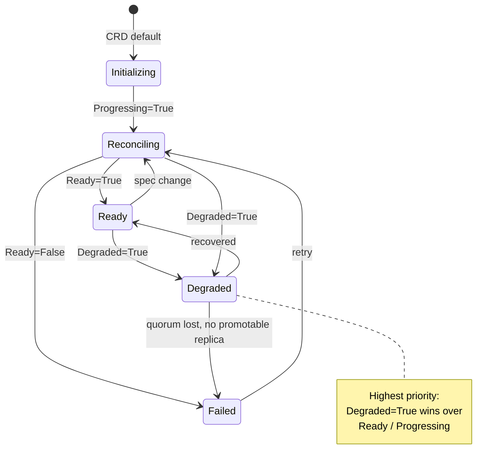
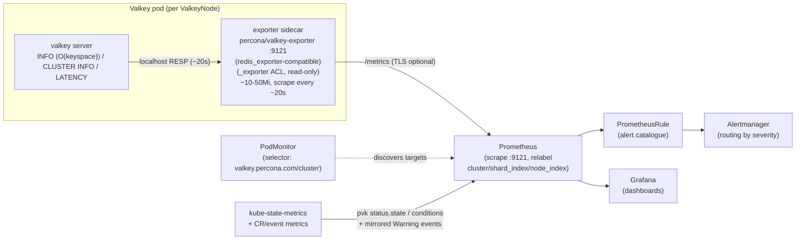
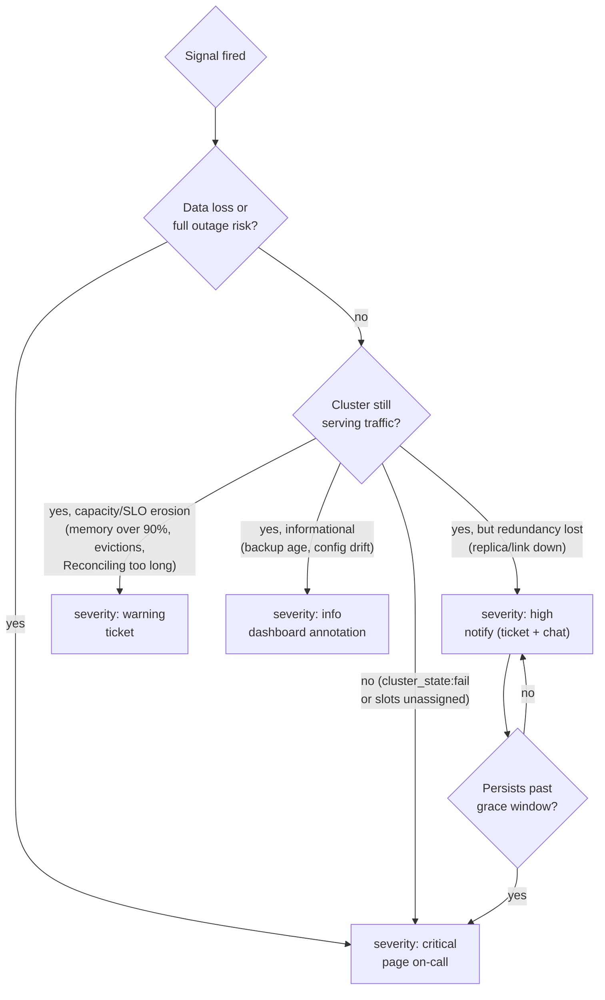

# Observability

> Part of the **Percona Operator for Valkey** (`percona-valkey-operator`) architecture set.
> API group `valkey.percona.com`, version `v1alpha1`. Kinds: `PerconaValkeyCluster` (`pvk`),
> `ValkeyNode` (`vkn`), `PerconaValkeyBackup` (`pvk-backup`), `PerconaValkeyRestore` (`pvk-restore`).

This document specifies how a `PerconaValkeyCluster` is made observable end-to-end: a per-pod Prometheus exporter sidecar that scrapes the Valkey engine and emits shard/role-labelled metrics; native Prometheus Operator integration via `PodMonitor`/`ServiceMonitor` with optional metrics TLS and a metrics-scoped `NetworkPolicy`; the `metav1.Condition` array and Kubernetes `Event` vocabulary as first-class signals; structured `logf` logging conventions in the operator and sidecars; liveness/readiness probe scripts embedded in the rendered `valkey.conf` ConfigMap; a set of Grafana dashboards (cluster health, slot coverage, replication lag, memory/eviction, ops/sec); a complete `PrometheusRule` alert catalogue keyed to the operator's own conditions and events; and SLO/SLI recommendations. Every condition type, reason, event name, and exporter ACL referenced here is the exact contract the controllers emit — see [Control Plane & Reconciliation](04-control-plane.md) and [API & CRD Design](03-api-design.md) for the field-level definitions.

---

## 1. Design principles

Observability for `percona-valkey-operator` rests on four layered signal sources, each with a distinct consumer and retention horizon. The operator never invents a parallel metrics pipeline; it leans on the standard Kubernetes and Prometheus ecosystem and exposes its *own* reconciliation state through conditions and events.

| Layer | Source | Consumer | Horizon | Authoritative for |
|-------|--------|----------|---------|-------------------|
| Engine metrics | exporter sidecar → Prometheus | dashboards, alerts | weeks (TSDB retention) | memory, ops/sec, replication lag, keyspace, eviction |
| Operator state | `PerconaValkeyCluster.status.conditions[]` + `status.state` | `kubectl`, alerts, UIs | live (current generation) | "is the cluster Ready / Degraded / Reconciling" |
| Operator actions | Kubernetes `Event`s | `kubectl describe`, alerts, audit | ~1h default (configurable) | "what did the operator just do / fail to do" |
| Process diagnostics | structured logs (`logf`) | log aggregation, debugging | per log-retention policy | causal detail behind an event/condition |

Recommendation: **treat conditions as the primary alerting surface for control-plane health** (they are stable, generation-aware, and survive event expiry), and **treat exporter metrics as the primary alerting surface for data-plane health** (latency, memory, lag). Events are a forensic timeline, not a long-lived alerting source, because Kubernetes garbage-collects them after roughly one hour by default.

---

## 2. Metrics exporter sidecar

### 2.1 Recommendation

Run **one exporter container per Valkey pod**, injected by the `ValkeyNode` controller into the same pod (StatefulSet or Deployment) as the Valkey server, gated on `PerconaValkeyCluster.spec.exporter.enabled`. The exporter connects to its co-located Valkey process over `localhost` and authenticates as the operator-managed `_exporter` ACL user.

Recommended image: a Percona-branded **`percona/valkey-exporter`** as the GA default (so the metrics surface and CVE cadence are Percona-owned), built from / wire-compatible with **`oliver006/redis_exporter`** (upstream `valkey-operator` defaults to `oliver006/redis_exporter:v1.80.0`, which is the documented fallback for users who prefer the upstream exporter). This matches the image-ownership stance in [Distribution & Release](10-distribution-release.md) §images (`IMAGE_EXPORTER`). `redis_exporter` is fully compatible with the Valkey RESP/`INFO` surface (its `_exporter` ACL string is copied verbatim from the `redis_exporter` authentication docs). The exporter image is pinned in `deploy/cr.yaml`/Helm `values.yaml` and is swappable without API change — the sidecar is wired entirely through `spec.exporter.image`.

Rationale for a **sidecar over a standalone exporter Deployment**: a per-pod sidecar (a) auto-scales 1:1 with cluster size, (b) reaches Valkey over loopback so no cross-pod auth/TLS hop is needed for the scrape source, (c) inherits the pod's lifecycle, labels, and NetworkPolicy, and (d) lets Prometheus discover targets by pod selector with the exact same shard/node labels the operator already stamps. The trade-off is N exporter containers for N pods (a few MiB each) — acceptable and the industry norm.

### 2.2 What it scrapes

The exporter periodically issues `INFO` (all sections), `CLUSTER INFO`, `CLUSTER NODES`/`CLUSTER SLOTS`, `CONFIG GET`, and `LATENCY`/`SLOWLOG` against the local Valkey and translates the reply into Prometheus gauges/counters. The metric families below are the ones the dashboards and alerts in this document depend on (names follow the `redis_exporter` `valkey_*`/`redis_*` convention; treat the prefix as exporter-image-defined and pin it once in the dashboards):

| Metric family | Source | Used by |
|---------------|--------|---------|
| `redis_up` | exporter reachability | "exporter/pod down" alerts |
| `redis_memory_used_bytes`, `redis_memory_max_bytes` | `INFO memory` (`used_memory`, `maxmemory`) | memory dashboard, memory-pressure alert |
| `redis_evicted_keys_total`, `redis_expired_keys_total` | `INFO stats` | eviction panel/alert |
| `redis_commands_processed_total`, `redis_instantaneous_ops_per_sec` | `INFO stats` | ops/sec dashboard |
| `redis_keyspace_hits_total`, `redis_keyspace_misses_total` | `INFO stats` | hit-ratio panel |
| `redis_connected_clients`, `redis_blocked_clients`, `redis_rejected_connections_total` | `INFO clients`/`stats` | connection-saturation alert |
| `redis_connected_slaves` | `INFO replication` | replica-count alert |
| `redis_master_link_up` | `INFO replication` (`master_link_status:up`) | replication-broken alert |
| `redis_master_repl_offset`, `redis_slave_repl_offset` | `INFO replication` | replication-lag computation |
| `redis_cluster_enabled`, `redis_cluster_state`, `redis_cluster_slots_assigned`, `redis_cluster_slots_ok`, `redis_cluster_known_nodes`, `redis_cluster_size` | `CLUSTER INFO` | slot-coverage dashboard, "slots unassigned" alert |
| `redis_db_keys`, `redis_db_keys_expiring` | `INFO keyspace` | keyspace dashboard |
| `redis_latency_percentiles_usec` / `redis_commands_latencies_usec` | `LATENCY`/`INFO commandstats` | latency SLI |

Grounding note: replication lag is derived as `master_repl_offset − slave_repl_offset`, which mirrors exactly how the operator selects the highest-offset replica for graceful failover (`HighestOffsetReplica()` reads `slave_repl_offset`). `redis_master_link_up` corresponds to the `master_link_status:up` check the operator uses before marking a shard healthy. Slot coverage maps to the `SlotsAssigned` condition (all 16384 slots). This keeps dashboards, alerts, and the operator's own health logic reading from one consistent set of engine signals.

> **Terminology note — upstream field names vs. operator semantics.** The exporter metric and `INFO` field names above (`redis_connected_slaves`, `redis_master_link_up`, `redis_master_repl_offset`, `redis_slave_repl_offset`, and the underlying `INFO replication` fields `master_link_status` and `role:master`/`role:slave`) are **upstream Redis/Valkey field names** emitted verbatim by the engine and the `redis_exporter`-compatible image. They **cannot be renamed** — Prometheus series, dashboard queries, and alert expressions must use them exactly as shown. The operator's own API and vocabulary, however, are **primary/replica**: a `master` is a **primary**, a `slave` is a **replica**, `connected_slaves` is the **connected-replica count**, and `master_link_status` is the **replica→primary link state**. Throughout this document the surrounding prose deliberately says *primary*/*replica* while the literal metric/field tokens retain the upstream `master`/`slave` spelling; read the two as the same concept under different naming. (Slot-owning primaries are what the cluster fails over between; replicas are the failover targets — see §2.3.)

### 2.3 Per-shard / per-role labelling

Prometheus relabelling attaches the operator's identity labels to every series so that dashboards and alerts can `sum`/`by` over shard and role without scraping the engine for topology. The pod carries both label families (see [API & CRD Design](03-api-design.md) §6.1 for the Charter-locked label contract):

```yaml
# Stamped by the operator on every Valkey pod
app.kubernetes.io/name: valkey
app.kubernetes.io/instance: <cluster>          # e.g. my-pvk
app.kubernetes.io/component: valkey            # exporter is a sidecar in the same pod, so it inherits these pod labels
app.kubernetes.io/managed-by: percona-valkey-operator
valkey.percona.com/cluster: <cluster>
valkey.percona.com/shard-index: "<shardIndex>"
valkey.percona.com/node-index: "<nodeIndex>"   # 0 = initial primary position
valkey.percona.com/component: valkey
```

These become Prometheus target labels (`cluster`, `shard_index`, `node_index`) via the `PodMonitor` relabel config in §3.2.

**Critical subtlety — role is not a label.** Per the design charter, *the live role is always read from `CLUSTER NODES`/`INFO`, never from labels*: `node-index 0` is only the **initial** primary and is not rewritten after a failover. Therefore dashboards must derive primary/replica from the **engine metric** `redis_master_link_up` / `redis_connected_slaves` (or `redis_instance_info{role=...}` exported from `INFO replication`), **not** from `node_index`. Treating `node-index 0` as "the primary" is the single most common observability mistake for this operator and will mislabel panels the moment a failover occurs. The `node_index` label is for *position/identity* (which pod, which PVC), the engine `role` is for *current function*.

Note that `redis_master_link_up`, `redis_connected_slaves`, and `role=master`/`role=slave` are the **upstream Redis/Valkey field names** (see the terminology note in §2.2); in this operator's vocabulary they denote the **replica→primary link**, the **connected-replica count**, and **primary/replica** role respectively. A pod with `role=master` is the **current primary** of its shard regardless of its `node_index`.

### 2.4 Sidecar resource & security footprint

| Concern | Setting | Rationale |
|---------|---------|-----------|
| Requests/limits | small default (e.g. `50m`/`64Mi` request) overridable via `spec.exporter.resources` | exporter is cheap; never let it OOM the pod |
| Auth | `_exporter` ACL user, password from `internal-<cluster>-system-passwords` Secret | least privilege — primarily INFO/CLUSTER introspection (but see the ACL caveat below: the upstream policy also grants `+get`/`+eval`) |
| TLS to engine | reuses cluster TLS material when `spec.tls` is set; otherwise loopback plaintext | localhost scrape source is in-pod |
| Port | container port `9121` (redis_exporter default), named `metrics` | stable target for PodMonitor |
| Probes | exporter has its own readiness on `/` | exporter outage must not roll Valkey |

> **API note.** The v1alpha1 `ExporterSpec` defined in [API & CRD Design](03-api-design.md) §2.9 currently carries only `enabled`, `image`, and `resources`. The additional knobs this document references — the exporter `port`, `scrapeInterval`, and the `tls` sub-block (`tls.enabled`, `tls.certificateSecret`) — are **proposed extensions to `ExporterSpec`**, not yet part of the published schema. Until they land in 03-api-design.md they are operator-internal defaults (port `9121`, scrape interval `20s`, metrics TLS derived from `spec.tls`); treat any `spec.exporter.<field>` path below as a forward-looking option and keep 03-api-design.md as the field-level source of truth.

The `_exporter` ACL is the redis_exporter-recommended minimal policy (denies `@all`, then re-adds only the commands the exporter issues), generated by the operator only when `spec.exporter.enabled` is true. It is reproduced **verbatim** from the canonical copy in [Security Architecture](07-security.md) §4.3 so both documents stay in lockstep:

```text
-@all +@connection +memory -readonly +strlen +config|get +xinfo +pfcount -quit +zcard
+type +xlen -readwrite -command +client -wait +scard +llen +hlen +get +eval +slowlog
+cluster|info +cluster|slots +cluster|nodes -hello -echo +info +latency +scan -reset
-auth -asking
```

The credential cannot mutate topology (`-readwrite`, no `cluster|meet`/`addslots`/`failover`) and cannot reset its own auth (`-reset`, `-auth`). **Caveat (least-privilege hardening):** this upstream policy still grants `+get`, `+eval`, and `+scan`, which the `redis_exporter` uses for optional per-key/keyspace-size metrics but which can read keyspace data (and, via `+eval`, run Lua). It is therefore *not* a pure read-only-introspection credential. If your deployment does not enable redis_exporter key-level checks, drop `+get +eval +scan` to make `_exporter` truly introspection-only — coordinate any such change with the canonical string in [Security Architecture](07-security.md) §4.3 so the two copies do not diverge. See that document for the full ACL and system-user model.

### 2.5 Exporter performance impact & operating guidance

The exporter is a low-overhead introspection sidecar, but it is not free: it executes engine commands on every scrape, so the scrape interval directly governs its cost. Operators should size the interval against the engine's working set rather than scrape as fast as Prometheus allows.

**What each scrape costs the engine.** On every interval the exporter issues (in its core, key-disabled mode) `INFO` (all sections), `CLUSTER INFO`, and `LATENCY` against the local Valkey over loopback:
- **`INFO`** is the dominant cost. Most sections are O(1), but `INFO keyspace`/full `INFO` work is **O(keyspace)** in the number of databases/keys it must summarise, so on a very large keyspace the periodic `INFO` is the single most expensive thing the exporter does. (The optional `+get`/`+scan` key-level checks — see the ACL caveat in §2.4 — add further per-key cost and are off by default.)
- **`CLUSTER INFO`** is O(1) — it returns the cached cluster summary (state, slots assigned/ok, known nodes, size), not a per-slot walk.
- **`LATENCY`** (latency history / `INFO commandstats`) is cheap, bounded by the number of tracked events/commands.

**Recommended scrape interval: ~20s.** This is the operator-internal default (§2.4) and the value templated into the `PodMonitor` (§3.2); it matches the operator's own 30s steady-state requeue cadence without over-scraping. **Do not run aggressive sub-10s intervals (e.g. 5s) on large keyspaces** — an O(keyspace) `INFO` every 5s competes with client traffic on the single-threaded engine and can measurably raise p99 command latency for no monitoring benefit (Prometheus alerting windows here are minutes, not seconds). Tune via the proposed `spec.exporter.scrapeInterval`; lower it only on small instances where `INFO` is demonstrably cheap.

**ACL is read-only introspection.** In its recommended configuration the `_exporter` user is a **read-only introspection credential** — it issues only `INFO`/`CLUSTER INFO`/`LATENCY`-class commands and never mutates state (this is the least-privilege intent described in [Security Architecture](07-security.md) §4.3). The one caveat is the upstream `+get`/`+eval`/`+scan` grants flagged in §2.4: leave key-level checks disabled and the credential stays effectively read-only; drop those grants to make it strictly so.

**Typical memory footprint: ~10–50 Mi.** A core-mode `redis_exporter`-compatible sidecar steady-states at roughly **10–50 Mi** RSS (toward the low end for a single instance with key checks off, higher with many tracked command stats or key-level metrics enabled). The §2.4 default `64Mi` request comfortably covers this; raise the limit only if enabling per-key metrics on a large keyspace.

**`redis_up == 0` is a data-plane signal, not an operator fault.** The `ValkeyExporterDown` alert (§7.4) fires on `redis_up == 0`, which means **the exporter could not reach its co-located Valkey process** — a data-plane outage (the engine is down, unreachable over loopback, or rejecting the `_exporter` auth), *not* a malfunction of the operator control plane. Triage it as a Valkey/pod problem (check the pod, liveness probe, and engine logs), and correlate with the operator's own conditions/events (§4): a healthy `Ready` condition alongside `redis_up == 0` points squarely at the engine or the exporter→engine hop, not at reconciliation.

**Measuring the sidecar's latency cost.** To validate the interval choice for a given workload, measure the **p99 command-latency delta with and without the exporter sidecar** under representative load using `valkey-benchmark` (e.g. run a fixed `valkey-benchmark` profile against a pod with `spec.exporter.enabled: false`, then with it enabled at the candidate interval, and compare p99). If the delta at 20s is negligible (the expected case), the default is safe; if a large keyspace shows a meaningful p99 increase, raise the interval rather than disabling monitoring.

---

## 3. Prometheus integration

### 3.1 Recommendation: PodMonitor (primary), ServiceMonitor (secondary)

Ship a **`PodMonitor`** as the default discovery resource because metrics are exposed *per pod* and the operator already stamps per-pod shard/node labels — a `PodMonitor` scrapes each pod directly and preserves those labels natively. Provide a **`ServiceMonitor`** variant as an opt-in alternative for environments that route all scraping through Services (or that lack pod-level RBAC for the Prometheus instance), pointed at a dedicated headless metrics Service. Both are templated in the `valkey-db` Helm chart and gated on `spec.exporter.enabled` plus a `monitoring.enabled` toggle so clusters without Prometheus Operator installed don't get orphaned CRs.

Decision summary:
- **Default:** `PodMonitor` — least indirection, per-pod labels intact, scales with pods automatically.
- **Alternative:** `ServiceMonitor` — for Service-centric scrape policies; loses per-pod granularity unless endpoint relabelling re-derives it.
- **Fallback (no Prometheus Operator):** raw `prometheus.io/scrape` pod annotations, also templated, for vanilla Prometheus scrape-config discovery.

### 3.2 PodMonitor shape

```yaml
apiVersion: monitoring.coreos.com/v1
kind: PodMonitor
metadata:
  name: valkey-<cluster>          # operator child resources are prefixed "valkey-"
  labels:
    app.kubernetes.io/name: valkey
    app.kubernetes.io/instance: <cluster>
    app.kubernetes.io/managed-by: percona-valkey-operator
spec:
  selector:
    matchLabels:
      valkey.percona.com/cluster: <cluster>
      valkey.percona.com/component: valkey
  podMetricsEndpoints:
    - port: metrics                 # named exporter port (9121)
      interval: 20s
      scrapeTimeout: 10s
      relabelings:
        - sourceLabels: [__meta_kubernetes_pod_label_valkey_percona_com_cluster]
          targetLabel: cluster
        - sourceLabels: [__meta_kubernetes_pod_label_valkey_percona_com_shard_index]
          targetLabel: shard_index
        - sourceLabels: [__meta_kubernetes_pod_label_valkey_percona_com_node_index]
          targetLabel: node_index
        - sourceLabels: [__meta_kubernetes_pod_name]
          targetLabel: pod
```

A 20s interval with a 10s timeout matches the operator's own 30s steady-state requeue cadence (see [Control Plane & Reconciliation](04-control-plane.md)) without over-scraping; tune via the proposed `spec.exporter.scrapeInterval` (see the API note in §2.4).

### 3.3 Metrics TLS

When `spec.tls` is enabled for the cluster bus/client, the exporter SHOULD also serve its `/metrics` endpoint over TLS (proposed `spec.exporter.tls.enabled`; see the API note in §2.4). Two recommended modes:

1. **Recommended — cert-manager-issued metrics cert:** reuse the cluster's cert-manager `Issuer` to mint a metrics serving certificate; the `PodMonitor` references it via `tlsConfig` (`ca`, optional client cert for mTLS) sourced from the same Secret family. This gives automatic rotation, consistent with [Security Architecture](07-security.md).
2. **Alternative — secret-ref:** point the proposed `spec.exporter.tls.certificateSecret` at an existing Secret with `ca.crt`/`tls.crt`/`tls.key`. No auto-rotation; a cert change requires an exporter restart (the exporter is a separate container, so this does **not** roll the Valkey server).

`PodMonitor.spec.podMetricsEndpoints[].scheme: https` plus `tlsConfig` complete the loop:

```yaml
      scheme: https
      tlsConfig:
        ca:
          secret:
            name: valkey-<cluster>-metrics-tls   # prefixed "valkey-" like other child resources
            key: ca.crt
        # serverName MUST match a SAN on the exporter serving cert. With per-pod scraping the
        # cert is issued for the pod's headless-service DNS, so this is the headless Service name
        # valkey-<cluster> (NOT a "<cluster>-valkey" suffix form); when each pod presents its own
        # cert, set serverName to the pod FQDN (<pod>.valkey-<cluster>.<ns>.svc) instead.
        serverName: valkey-<cluster>
        insecureSkipVerify: false
```

Caveat (from grounding): there is **no live TLS hot-swap** for the engine — TLS changes for the *Valkey server* require a pod roll. The metrics exporter is decoupled, so metrics-cert rotation is cheaper, but a Prometheus instance that pins an old CA will fail scrapes until its `tlsConfig` Secret is refreshed; prefer cert-manager so both ends rotate in lockstep.

### 3.4 NetworkPolicy for metrics

Expose `/metrics` only to the monitoring namespace. The `valkey-db` chart templates a `NetworkPolicy` (gated on `networkPolicy.enabled`) that, in addition to the data-plane rules in [Security Architecture](07-security.md), permits ingress to the exporter port **only** from pods carrying the Prometheus identity label in the configured monitoring namespace:

```yaml
apiVersion: networking.k8s.io/v1
kind: NetworkPolicy
metadata:
  name: valkey-<cluster>-metrics
spec:
  podSelector:
    matchLabels:
      valkey.percona.com/cluster: <cluster>
      valkey.percona.com/component: valkey
  policyTypes: [Ingress]
  ingress:
    - from:
        - namespaceSelector:
            matchLabels:
              kubernetes.io/metadata.name: <monitoring-namespace>
          podSelector:
            matchLabels:
              app.kubernetes.io/name: prometheus
      ports:
        - protocol: TCP
          port: 9121     # exporter metrics port
```

This confines the exporter credential's blast radius to the monitoring stack — defence in depth, which matters because the upstream `_exporter` ACL is not strictly read-only (it grants `+get`/`+eval`; see the caveat in §2.4).

---

## 4. Status conditions & Events as first-class observability

The operator's own state is observable **without any metrics stack**, through the `metav1.Condition` array on each CR and through Kubernetes `Event`s. These are the source of truth the alert catalogue in §7 keys against for control-plane health.

### 4.1 PerconaValkeyCluster conditions and derived state

`status.state` is derived from conditions in strict priority order — this is the same `metav1.Condition`→`status.state` derivation owned by [Control Plane & Reconciliation](04-control-plane.md) §6 (`Degraded → Ready → Reconciling → Failed`); reproduced here only so the alert catalogue in §7.4 is self-contained:

1. `Degraded=True` → `state=Degraded`
2. `Ready=True` → `state=Ready`
3. `Progressing=True` → `state=Reconciling`
4. `Ready=False` with no stronger signal → `state=Failed`
   (`Initializing` is the CRD-default value of `status.state`, visible briefly before the first reconcile.)

The same priority order, expressed as the state surface that alerts in §7.4 select on:



> Evaluation is strictly ordered: `Degraded=True` takes precedence over `Ready=True`, which takes precedence over `Progressing=True`; `Failed` is the fallback when `Ready=False` with no stronger signal.

| Condition type | True means | Key `False` reasons (machine-readable, stable) |
|----------------|-----------|------------------------------------------------|
| `Ready` | All shards present, cluster healthy, topology complete | `ServiceError`, `ConfigMapError`, `UsersAclError`, `SystemUsersAclError`, `ValkeyNodeError`, `ValkeyNodeListError`, `PodDisruptionBudgetError`, `Reconciling`, `UpdatingNodes`, `MissingShards`, `MissingReplicas`, `PodUnschedulable` |
| `Progressing` | Reconciliation in progress | reasons: `Initializing`, `Reconciling`, `AddingNodes`, `UpdatingNodes`, `RebalancingSlots`, `ReconcileComplete` |
| `Degraded` | Impaired but may still serve | `NodeAddFailed`, `RebalanceFailed`, `PodUnschedulable` |
| `ClusterFormed` | All nodes joined, shard/replica layout met | `MissingShards`, `MissingReplicas` |
| `SlotsAssigned` | All 16384 hash slots assigned | `SlotsUnassigned` (True reason: `AllSlotsAssigned`) |

`status.shards` / `status.readyShards` give the at-a-glance fraction; printer columns surface `State` (`.status.state`), `Reason`, `Shards`, `Ready` (`.status.readyShards`), `Host`, and `Age` for `kubectl get pvk` (see [API & CRD Design](03-api-design.md) §9).

### 4.2 ValkeyNode conditions

`ValkeyNode` (`vkn`) conditions are the drill-down when a cluster will not progress — especially `LiveConfigApplied`, which **blocks one-at-a-time rolling progress** in the cluster controller exactly like `Ready=False`:

| Condition | True means | Notable reasons |
|-----------|-----------|-----------------|
| `Ready` | Pod running/ready, workload rolled out | `PodRunning` (T); `PodNotReady`, `PersistentVolumeClaimPending` (F) |
| `PersistentVolumeClaimReady` | Managed PVC `Bound` | `PersistentVolumeClaimBound` / `PersistentVolumeClaimPending` |
| `PersistentVolumeClaimSizeReady` | PVC capacity ≥ requested size | `...ResizePending`, `...ResizeInProgress`, `...ResizeInfeasible` |
| `LiveConfigApplied` | Allowlisted `CONFIG SET` keys applied | `Applied` (T); `ApplyFailed` (F) — absent ≡ True when no allowlisted keys |

Operational guidance: a stuck cluster reconcile almost always traces to one `vkn` with `Ready=False` (look at `PersistentVolumeClaimPending`) or `LiveConfigApplied=False` (`ApplyFailed`, e.g. an invalid `maxmemory`). The latter clears only when `CONFIG SET` succeeds or the offending key is removed from `spec.config`.

### 4.3 Event vocabulary

Events are the **historical timeline** (`Normal` = success/info, `Warning` = failure). The complete, stable event catalogue the controllers emit — alerts in §7 select on the `Warning` ones:

| Category | Events |
|----------|--------|
| Infrastructure | `ServiceCreated`, `ServiceUpdateFailed`(W), `ConfigMapCreated`, `ConfigMapUpdateFailed`(W), `ValkeyNodeCreated`, `ValkeyNodeUpdated`, `ValkeyNodeFailed`(W), `PodDisruptionBudgetCreated/Updated/Deleted` |
| Cluster topology | `ClusterMeetBatch`, `ClusterMeetFailed`(W), `PrimariesCreated`, `PrimaryCreated`, `SlotAssignmentFailed`(W), `ReplicasAttached`, `ReplicaCreated`, `ReplicaCreationFailed`(W) |
| Slot rebalancing | `SlotsRebalancing`, `SlotsRebalancePending`, `SlotRebalanceFailed`(W) |
| Scale-in | `SlotsDraining`, `ValkeyNodeDeleted`, `DrainFailed`(W) |
| Proactive failover | `FailoverInitiated`, `FailoverFailed`(W), `FailoverTimeout`(W), `FailoverCompleted` |
| Recovery | `ReplicasTakenOver` (orphan promote via `CLUSTER FAILOVER TAKEOVER` after quorum loss) |
| Maintenance | `StaleNodeForgotten`, `NodeForgetFailed`(W) |
| Status | `WaitingForShards`, `WaitingForReplicas`, `ClusterReady` |
| Live config | `LiveConfigApplyFailed`(W) |
| Users/ACL | `InternalSecretsCreated`, `InternalSecretsUpdated`, `InternalSecretsCreationFailed`(W), `InternalSecretsUpdateFailed`(W) |

Backup/restore controllers extend this with their own events (`BackupStarted`, `BackupCompleted`, `BackupFailed`(W), `RestoreStarted`, `RestoreCompleted`, `RestoreFailed`(W)) — see [Backup & Restore](06-backup-restore.md). Because Kubernetes expires events (~1h default) and rate-limits/aggregates duplicates, **do not** build long-horizon dashboards on raw events; mirror critical `Warning` events into Prometheus via `kube-state-metrics`/event-exporter if long retention is needed (see §7.4).

---

## 5. Structured logging conventions

The operator and all sidecars log through controller-runtime's `logr`/`logf` (`sigs.k8s.io/controller-runtime/pkg/log`), producing structured **key/value** records (JSON in production via zap). Conventions:

- **Obtain the logger from context:** `log := logf.FromContext(ctx)`. The reconciler seeds it with the reconciled object's `namespace`/`name`, so every line is correlatable to a CR.
- **Message is a constant noun-phrase; variables go in key/value pairs**, never interpolated into the message. Right: `log.Info("creating ValkeyNode", "shard", s, "node", n)`. Wrong: `log.Info(fmt.Sprintf("creating node %d-%d", s, n))`.
- **Errors via `log.Error(err, "msg", kv...)`** — never swallow; wrap with `fmt.Errorf("...: %w", err)` for the returned error and log the wrapped error once at the boundary.
- **Stable key vocabulary** so logs join cleanly with metric/CR labels:

| Key | Meaning |
|-----|---------|
| `cluster` | `PerconaValkeyCluster` name |
| `namespace` | CR namespace |
| `valkeynode` | `ValkeyNode` name (`<cluster>-<shard>-<node>`) |
| `shard` / `node` | shard-index / node-index |
| `nodeID` | Valkey `CLUSTER MYID` (live identity, survives reschedule) |
| `addr` | pod IP:port the command was sent to |
| `command` | Valkey command issued (e.g. `CLUSTER FAILOVER`) |
| `phase` | reconcile phase (`service`, `configmap`, `nodes`, `topology`, `rebalance`) |
| `configHash` | SHA-256 of rendered `valkey.conf` (rolling-restart trigger) |
| `generation` / `observedGeneration` | spec vs. observed generation |

- **Verbosity (`log.V(n)`):** `V(0)` for state transitions and actions that also emit an Event; `V(1)` for per-phase decisions; `V(2+)` for command-level tracing (e.g. each `CLUSTER NODES` scrape). Default deployment runs at `V(0..1)`; raise via `--zap-log-level`.
- **Pair logs with events:** every `Warning` event has a matching `log.Error` line carrying the same `cluster`/`valkeynode`/`command` keys, so an alert firing on an event can be traced to the exact failing command via logs. Conversely, the SHA-256 `configHash` appears in both the pod-template annotation and the log line that triggered the roll, making rolling-restart causation auditable.

Sidecars (`cmd/valkey-backup`, `cmd/healthcheck`, `cmd/peer-list`) use the same `logf` setup and key vocabulary so their logs are uniform with the operator's.

---

## 6. Health probes

The Valkey server container's liveness and readiness probes are **scripts embedded in the rendered `valkey.conf` ConfigMap** (the upstream contract this operator adopts embeds liveness/readiness scripts in the ConfigMap alongside the config). The scripts are mounted and invoked via `exec` probes so they run with the in-pod credentials and TLS context.

Recommendation:

| Probe | Intent | Check | Failure semantics |
|-------|--------|-------|-------------------|
| **Startup** | gate liveness until first responsive | `valkey-cli PING` returns `PONG` (TLS-aware) | generous `failureThreshold`; long-loading RDB/AOF doesn't trip liveness |
| **Liveness** | "process is alive" | `PING` over the active port (TLS-port when `spec.tls` set, plain otherwise) | restart container on sustained failure |
| **Readiness** | "safe to receive traffic / proceed in rolling update" | `PING` **and**, in `cluster` mode, `CLUSTER INFO` reports `cluster_state:ok`; in `replication` mode a replica additionally checks `master_link_status:up` | remove from endpoints; gates the operator's one-at-a-time roll |

Design rules grounded in the engine and operator behaviour:
- **Liveness must not depend on cluster health** — a node whose primary is momentarily down is still a live process; only readiness should reflect `cluster_state`. Coupling liveness to cluster state causes restart storms during failover.
- **TLS dual-port awareness:** with TLS enabled the operator sets `port=0` and serves on `tls-port`; probe scripts must invoke `valkey-cli` with `--tls` and the mounted CA/cert, or they will fail against a TLS-only listener. This is a documented connection-refused pitfall.
- **Readiness is the rolling-update gate.** The cluster controller advances one node at a time, replicas before primaries, and waits on `ValkeyNode.status.ready` (driven by pod Ready, i.e. the readiness probe). A too-aggressive readiness check stalls upgrades; a too-lax one lets the controller roll the next node before the cluster reconverges.
- **Probe scripts are excluded from the config roll hash** (per design, script changes do not bump `configHash`), so editing a probe script does not by itself trigger a cluster-wide restart — version probe-script changes deliberately if a roll is intended.

The exporter sidecar has its **own** readiness probe (HTTP `/`) so that exporter unavailability never marks the Valkey pod unready or triggers a failover.

---

## 7. Dashboards & alerting

### 7.1 Metrics pipeline



### 7.2 Grafana dashboards

Ship dashboards in the `valkey-db` chart (`grafana_dashboards` ConfigMaps with the `grafana_dashboard` label for the Grafana sidecar). All panels template a `$cluster` variable from the `cluster` label and break down by `shard_index`; **role-sensitive panels derive role from `redis_master_link_up`/`redis_connected_slaves`, never from `node_index`** (§2.3).

| Dashboard | Key panels | Primary metrics |
|-----------|-----------|-----------------|
| **Cluster Health** | `cluster_state` per node, known-nodes vs expected, `redis_up` heatmap, operator `state` (from kube-state-metrics), Ready/Degraded condition timeline | `redis_cluster_state`, `redis_cluster_known_nodes`, `redis_up` |
| **Slot Coverage** | assigned vs 16384, `slots_ok`, slots-per-primary distribution, in-flight migration indicator | `redis_cluster_slots_assigned`, `redis_cluster_slots_ok`, `redis_cluster_size` |
| **Replication** | lag = primary minus replica offset, grouped `by(shard_index)` so each replica is diffed against its own shard primary, `master_link_up` per replica, connected-slaves vs desired | `redis_master_repl_offset`, `redis_slave_repl_offset`, `redis_master_link_up`, `redis_connected_slaves` |
| **Memory & Eviction** | `used/maxmemory` per node, fragmentation ratio, eviction & expiration rates, keyspace hit ratio | `redis_memory_used_bytes`, `redis_memory_max_bytes`, `redis_mem_fragmentation_ratio`, `redis_evicted_keys_total`, `redis_keyspace_hits/misses_total` |
| **Throughput (Ops/sec)** | instantaneous ops/sec per shard, command rate by type, connected/blocked/rejected clients, command latency percentiles | `redis_instantaneous_ops_per_sec`, `redis_commands_processed_total`, `redis_connected_clients`, `redis_commands_latencies_usec` |

A sixth **Backup/Restore** dashboard (last-successful-backup age per shard, backup duration, restore progress) is fed by `PerconaValkeyBackup`/`PerconaValkeyRestore` status surfaced through kube-state-metrics — see [Backup & Restore](06-backup-restore.md).

### 7.3 Alert severity decision tree



Mapping principle: **page (critical)** only when the cluster cannot serve correct results (no quorum, `cluster_state:fail`, slots unassigned, primary with no surviving replica during memory pressure); **notify (high)** when redundancy or durability is degraded but reads/writes still succeed (broken replication link, a `Warning` failover/rebalance event, `Degraded=True`); **ticket (warning)** for capacity/SLO erosion (memory pressure, sustained `Reconciling`, eviction spikes); **info** for slow-burn signals (stale backup, config-hash drift).

### 7.4 Alerting rules (`PrometheusRule`)

Templated in the chart, gated on `monitoring.prometheusRule.enabled`. Rules combine **engine metrics** (data plane) with **operator state mirrored via kube-state-metrics** (control plane). Representative catalogue:

| Alert | Expression (sketch) | Severity | Grounding |
|-------|--------------------|----------|-----------|
| `ValkeyExporterDown` | `redis_up == 0 for 2m` | high | exporter/pod unreachable |
| `ValkeyClusterStateFail` | `redis_cluster_state == 0 for 1m` (any node) | **critical** | `CLUSTER INFO cluster_state:fail` → keys may fail |
| `ValkeySlotsUnassigned` | `min by(cluster) (redis_cluster_slots_assigned) < 16384 for 2m` | **critical** | full-coverage requirement; mirrors `SlotsAssigned=False` |
| `ValkeyPrimaryDownNoQuorum` | reachable slot-owning primaries `< (total/2)+1` per cluster | **critical** | failover quorum loss → `CLUSTER FAILOVER` cannot elect |
| `ValkeyReplicationBroken` | `redis_master_link_up == 0 for 3m` | high | replica→primary link down (`master_link_status` ≠ `up`, upstream field name); no failover target if the primary then dies |
| `ValkeyReplicationLagHigh` | `(max by(cluster,shard_index)(redis_master_repl_offset) - redis_slave_repl_offset) > <bytes> for 5m` | high | lag erodes RPO and graceful-failover safety — **must group by `cluster,shard_index`** so each replica is diffed against its own shard's primary, not a global offset (multi-primary cluster) |
| `ValkeyNoReplicas` | `redis_connected_slaves < on(cluster,shard_index) pvk_desired_replicas for 5m` | high | redundancy lost (charter: replicas before primary in rolls); `desired` comes from spec via kube-state-metrics, not the engine |
| `ValkeyMemoryPressure` | `redis_memory_max_bytes > 0 and redis_memory_used_bytes / redis_memory_max_bytes > 0.9 for 10m` | warning | approaching `maxmemory`; evictions imminent — guarded with `redis_memory_max_bytes > 0` because `maxmemory 0` (unlimited, the default) would otherwise divide by zero and the alert would never fire |
| `ValkeyEvictionSpike` | `rate(redis_evicted_keys_total[5m]) > <threshold>` | warning | working set exceeds memory budget |
| `ValkeyClusterNotReady` | `pvk status.state != "Ready" for 15m` (via kube-state-metrics) | high | sustained control-plane unhealthiness |
| `ValkeyClusterDegraded` | `pvk Degraded condition == True for 5m` | high | mirrors `Degraded` condition (`NodeAddFailed`/`RebalanceFailed`/`PodUnschedulable`) |
| `ValkeyReconcileStuck` | `Progressing=True for 30m` with `Ready=False` | warning | reconcile not converging (e.g. `LiveConfigApplied=ApplyFailed`) |
| `ValkeyFailoverFailing` | mirrored `FailoverFailed`/`FailoverTimeout` event rate > 0 | high | proactive failover not completing during a roll |
| `ValkeyBackupFailed` | mirrored `BackupFailed` event > 0, or last-success age > 2× schedule | high | scheduled RDB backup not landing in object storage |
| `ValkeyBackupStale` | last successful `PerconaValkeyBackup` age > SLO | warning | durability drift |

> Control-plane alerts (`ValkeyClusterNotReady`, `ValkeyClusterDegraded`, `ValkeyReconcileStuck`, `ValkeyFailoverFailing`, `ValkeyBackup*`) require exposing `PerconaValkeyCluster`/`PerconaValkeyBackup` status and selected `Warning` events to Prometheus. Recommended: a kube-state-metrics **custom-resource-state** config that emits `pvk_status_state`, `pvk_condition{type,status}`, `pvk_ready_shards`, `pvk_shards`, and `pvk_desired_replicas{shard_index}` (so spec-derived targets like desired replica count are alertable), plus an event-exporter for the `Warning` events the alerts select on. This is the bridge that makes the operator's first-class conditions/events alertable alongside engine metrics.

---

## 8. SLO / SLI suggestions

Define SLIs from the exporter and operator-state signals, then set SLOs per environment tier (dev/stage/prod). Recommended starting set:

| SLI | Definition | Source | Suggested SLO (prod) |
|-----|-----------|--------|----------------------|
| **Availability** | fraction of scrape intervals where every shard has `cluster_state:ok` and all 16384 slots assigned | `redis_cluster_state`, `redis_cluster_slots_assigned` | ≥ 99.9% monthly |
| **Command latency** | p99 of `redis_commands_latencies_usec` (or `LATENCY` percentiles) per shard | exporter | p99 ≤ 5 ms (cache) / ≤ 10 ms (durable) |
| **Durability / RPO** | max replication lag bytes + time since last successful per-shard backup | repl offsets, backup status | lag ≤ small N MB; backup age ≤ schedule + grace |
| **Failover success** | `FailoverCompleted` / (`FailoverCompleted` + `FailoverFailed` + `FailoverTimeout`) — outcome events only; equivalently `FailoverCompleted` / `FailoverInitiated` if every attempt resolves to exactly one outcome | events | ≥ 99% of proactive failovers complete in-window |
| **Control-plane convergence** | time `state` spends ≠ `Ready` after a spec change | `pvk status.state` | p95 reconvergence ≤ rolling-update budget |
| **Slot coverage** | continuous `slots_assigned == 16384 && slots_ok == 16384` | `CLUSTER INFO` | 100% outside maintenance windows |

Error-budget guidance:
- **Availability** burns on `ValkeyClusterStateFail` / `ValkeySlotsUnassigned` / `ValkeyPrimaryDownNoQuorum` (all critical) — these are the SLO-defining events; everything else is leading-indicator.
- **Durability** budget is governed by replication lag and backup recency; pair the RPO SLO with `ValkeyReplicationLagHigh` (leading) and `ValkeyBackupStale`/`ValkeyBackupFailed` (lagging). Note PITR (AOF streaming) is **deferred beyond v1alpha1** (see [Backup & Restore](06-backup-restore.md)), so the RPO floor in v1alpha1 is bounded by snapshot cadence + replication lag, not continuous log shipping — state this explicitly in any SLO contract.
- **Failover-success** SLI is event-derived; because events expire, compute it over the mirrored event stream (§7.4), not raw `kubectl` events.

A multi-window, multi-burn-rate policy (fast burn → page via critical alerts; slow burn → ticket via warning alerts) maps cleanly onto the severity tree in §7.3: critical alerts protect the availability/coverage SLOs, high alerts protect durability/redundancy, warning alerts protect capacity headroom before it becomes an availability breach.

---

## 9. Cross-references

- [API & CRD Design](03-api-design.md) — `spec.exporter`, `spec.tls`, `status.conditions[]`, `status.state`, and the `app.kubernetes.io/*` / `valkey.percona.com/*` label contract (§6.1) used by `PodMonitor`/`ServiceMonitor` and dashboards.
- [Control Plane & Reconciliation](04-control-plane.md) — reconcile phases, requeue cadence, the `metav1.Condition`→`status.state` derivation, the event vocabulary, config-hash rolling restart, and proactive failover.
- [Backup & Restore](06-backup-restore.md) — backup/restore events, status surfacing, and the deferral of PITR.
- [Security Architecture](07-security.md) — `_operator`/`_exporter` system users, the full `_exporter` ACL, cert-manager integration, NetworkPolicy data-plane rules.
- [Distribution & Release](10-distribution-release.md) — where the `PodMonitor`, `PrometheusRule`, Grafana dashboards, and exporter image tags are templated and version-pinned.
