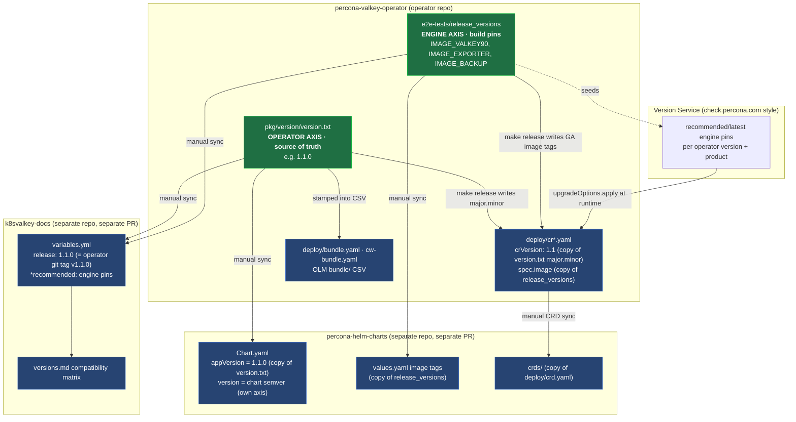
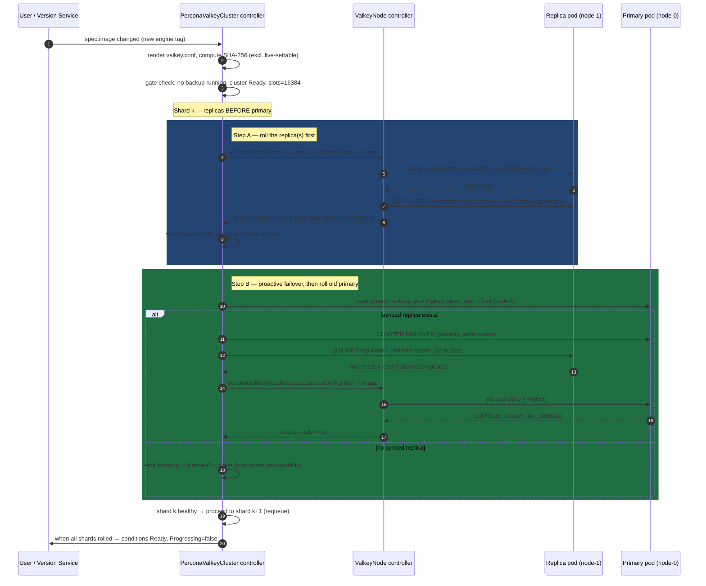
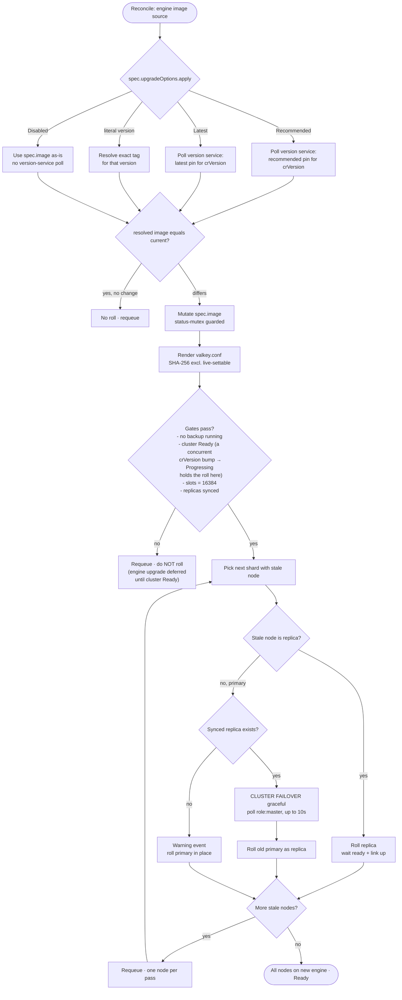

# Upgrades & Version Management

> **Abstract.** This document specifies how the **Percona Operator for Valkey** (`percona-valkey-operator`) manages versions and performs upgrades. Like every Percona operator, it tracks **two orthogonal version axes** — the *operator* version (the controller binary and the CR API contract) and the *engine image* version (the Valkey server, exporter, and backup tool images). Conflating these two axes is the single most common source of broken releases, so this document treats them separately and explicitly. We define how `pkg/version/version.txt` and `PerconaValkeyCluster.spec.crVersion` relate and the must-match rule that gates CR API compatibility; how `spec.upgradeOptions` and a Percona-style version service drive recommended engine pins; the failover-aware *smart update* that rolls the engine one shard at a time, replicas before primary; the `v1alpha1 → v1` CRD conversion strategy and conversion webhooks; and the downgrade / unsupported-jump policy. All names, the `valkey.percona.com` group, kinds, short names, and labels are used exactly as fixed by the design charter.

---

## 1. The two independent version axes

Percona operators deliberately separate two version numbers that move on completely different cadences. This operator mirrors that model exactly.

| Axis | What it versions | Where it is authoritative | Cadence | CR field |
|------|------------------|---------------------------|---------|----------|
| **Operator version** | The controller binary (`percona/valkey-operator`) **and** the CR API contract (CRD schema + reconcile semantics) | `pkg/version/version.txt` | Per operator release (e.g. `1.0.0`, `1.1.0`) | `spec.crVersion` (must equal `major.minor` of the operator) |
| **Engine image version** | The Valkey server image (`percona/percona-valkey`), the metrics exporter image, and the backup tool image (`percona/valkey-backup`) | `e2e-tests/release_versions` (build-time pins) + the version service (runtime pins) | Independent — driven by upstream Valkey releases (e.g. `9.0.0`) | `spec.image`, `spec.exporter.image`, `spec.backup.image`, governed by `spec.upgradeOptions` |

**Why they must stay separate.** The operator version describes *what the controller knows how to do* and *which CR API shape it speaks*. The engine version describes *which Valkey binary runs in the data pods*. A single operator release (say `1.1.0`) is validated against a *matrix* of engine versions (Valkey `8.0.x`, `9.0.x`), and a single Valkey CVE fix may ship as a new engine image with **no operator change at all**. Tying them together would force a full operator release for every engine patch and would make the compatibility matrix unmanageable.

### The #1 footgun — and how this operator avoids it

In the Percona SDK trio, `VERSION` defaults to the current git branch name (`git rev-parse --abbrev-ref HEAD`), so `make release` / `make build` without an explicit `VERSION=x.y.z` silently stamps `version.txt` and image tags with a branch name. The same Makefile inheritance applies here. **Always pass `VERSION=x.y.z` to any release target.** Beyond that footgun, the *axis-confusion* footgun is structural: editing `version.txt` (operator axis) when you meant to bump an engine image (engine axis), or vice versa. The mitigations baked into this design:

1. **One source of truth per axis.** Operator axis lives only in `version.txt`; engine pins live only in `release_versions` (build) and the version service (runtime). Nothing else originates a version — every other location (cr.yaml `crVersion`, Chart `appVersion`, docs `release:`) is a *copy* synced from `version.txt`.
2. **A `check-generate` / `check-version` CI gate** (see [Distribution & Release](10-distribution-release.md)) fails the build when `version.txt`'s `major.minor` ≠ `crVersion` in `deploy/cr*.yaml`.
3. **`crVersion` is `major.minor` only** (e.g. `1.1`), never the full patch — patch-level operator fixes do not change the CR API contract, so they must not churn `crVersion` and force CR rewrites.

### Where each number lives across repos

> The two **green** nodes are the only origins of version truth. Everything **blue** is a synced copy. The arrows are the manual sync edges that must all land for a coherent release — see [Distribution & Release](10-distribution-release.md) for the per-edge checklist.

---

## 2. `pkg/version/version.txt` and `spec.crVersion`

### Meaning

- **`pkg/version/version.txt`** holds the full operator semver (e.g. `1.1.0`). It is compiled into the operator binary via `pkg/version` and reported in logs and the operator Deployment image tag. It is the source of truth for the *operator axis*.
- **`spec.crVersion`** is a field on `PerconaValkeyCluster` only. It records *which operator API contract this CR was written against*, expressed as `major.minor` (e.g. `1.1`). It is the runtime gate for backward-compatibility branching. It is **not** copied onto the internal `ValkeyNode` children — `crVersion` is a cluster-level contract, and the parent applies any `crVersion`-gated decisions before it writes the per-node `ValkeyNode.spec` (image, `serverConfigHash`, config, scheduling). See the parent→child contract in [API & CRD Design](03-api-design.md).

### The must-match rule

> `spec.crVersion` MUST equal the `major.minor` of the operator that reconciles it.

- **Auto-stamping.** On first reconcile, if `spec.crVersion` is empty, `CheckNSetDefaults` stamps it from `version.txt`'s `major.minor` (mirroring Percona's `pkg/k8s/utils.go` / `*_defaults.go` auto-stamp). A freshly applied CR therefore always converges to the running operator's contract.
- **Version gating.** Throughout the controllers, behaviour that depends on the contract is guarded by `cr.CompareVersion("1.1")` (a helper on the CR type), never by hardcoded checks. New fields and new reconcile behaviour added in `1.1` are only activated when `crVersion >= 1.1`, so an unchanged `1.0` CR keeps `1.0` behaviour even under a `1.1` operator until the user opts in.
- **Patch immateriality.** `crVersion` is `major.minor`; operator patch releases (`1.1.0 → 1.1.1`) never change it, so bug-fix operator upgrades never trigger a CR API migration.

### What a stale `crVersion` breaks

A `crVersion` that does not match the operator's `major.minor` is the canonical Percona release breakage. Concretely:

| Failure mode | Cause | Symptom |
|--------------|-------|---------|
| **Upgrade loop / CR rejection** | `version.txt` bumped to `1.1.0` but `deploy/cr.yaml` `crVersion` left at `1.0` (e.g. only `make update-version` ran, not the full `make release`) | The operator keeps reconciling toward `1.1` defaults while the CR advertises `1.0`; CEL/admission and `CompareVersion` branches disagree, the cluster never reaches `Ready`, status flaps `Progressing`/`Degraded`. |
| **Silent feature non-activation** | User bumped the operator but left `crVersion` at the old minor | New `1.1` fields are ignored (gated off); user thinks a feature is enabled but it never reconciles. |
| **Skipped-minor confusion** | CR carries `crVersion: 0.9` under a `1.1` operator (jumped two minors) | No `0.9 → 1.0 → 1.1` migration path was exercised; behaviour is undefined and the operator refuses to manage it (see §7 unsupported-jump handling). |

Because `crVersion` gates *API compatibility*, treat any change to it as an API-compatibility decision, not a cosmetic bump. The `make release` flow rewrites `version.txt` **and** `crVersion` together; running only `make update-version` (which touches `version.txt` alone) is the trap.

---

## 3. `upgradeOptions` and the version service

Engine-image upgrades are declarative and driven by `spec.upgradeOptions`, mirroring Percona's `upgradeOptions.apply` model but expressed with this operator's charter vocabulary.

### `spec.upgradeOptions` fields

| Field | Type | Default | Meaning |
|-------|------|---------|---------|
| `apply` | enum: `Disabled` \| `Recommended` \| `Latest` \| `<version>` | `Disabled` | Policy for selecting the engine image. See decision table below. |
| `schedule` | string (cron) | `"0 4 * * *"` (when not `Disabled`) | When the version-service poll + smart-update window runs. A robfig/cron job is spawned/updated **inside reconcile** (Percona convention) and its lifecycle is tied to the CR. |
| `versionServiceEndpoint` | string | `https://check.percona.com` | Override for air-gapped / private version services. |

**Recommendation:** ship with `apply: Disabled` by default. Auto-upgrade of a stateful datastore is opt-in; an operator that silently rolls the engine on first install violates least-surprise. Operators who want managed updates set `apply: Recommended` (the recommended production value) which tracks Percona-validated, CVE-patched pins without jumping to bleeding-edge.

### `apply` decision semantics

| `apply` value | Behaviour | Recommended for |
|---------------|-----------|-----------------|
| `Disabled` | No version-service poll. The image is exactly what the user pinned in `spec.image`. Upgrades are purely manual (user edits the tag → smart update rolls it). | **Default.** Production users who pin images explicitly and gate upgrades through their own change control. |
| `Recommended` | Poll the version service for the *recommended* engine image for this operator `crVersion` + product. The operator mutates `spec.image` to that pin and triggers a smart update. Skips known-bad / yanked tags. | **Managed-update production.** Stays on validated, security-patched engine builds without surprises. |
| `Latest` | Poll for the newest engine image the version service offers for this operator. Triggers a smart update to it. | Dev / staging that wants the freshest engine. **Not recommended for production** — newest is not always the most-validated. |
| `<version>` (literal, e.g. `9.0.1`) | Resolve that exact engine version via the version service (to get the fully-qualified `percona/percona-valkey:9.0.1-N` tag) and roll to it. | Pinning to a specific validated engine while still letting the version service resolve the exact build tag. |

### How the version service works

The version service is a Percona-hosted (or self-hosted) HTTP endpoint that, given `(operator product, operator version/crVersion, current engine version, k8s platform)`, returns the **recommended** and **latest** engine image tags plus the exporter and backup-tool image tags that were validated *together* (the "multi-image compatibility" guarantee — all containers in a pod must be mutually compatible; the version service is what enforces that match, since Valkey itself does no version negotiation).

Flow each `schedule` tick (this matches Percona's async-cron-mutates-CR model in `pkg/controller/.../vs.go`):

1. The reconcile-spawned cron fires.
2. The operator POSTs the cluster's coordinates to `versionServiceEndpoint`.
3. The service responds with recommended/latest engine + sidecar pins.
4. The operator resolves the pin per the `apply` policy and, **only if it differs** from the current `spec.image`, mutates the CR's image fields (a status-mutex-guarded write to avoid racing the main reconcile).
5. The mutation changes the rendered pod template → the smart update in §5 rolls the engine.

If `apply: Disabled`, none of this runs and the image is whatever the user set. The build-time pins in `e2e-tests/release_versions` seed the version-service database for each operator release, so "Recommended" defaults to the same engine the release was validated against.

### Poll cadence and resilience to version-service downtime

The version service is polled **per cluster, once per `schedule` window** — not continuously and not on every reconcile. The default `schedule` is `"0 4 * * *"` (daily), so each cluster contacts the endpoint roughly once a day; clusters with `apply: Disabled` never poll at all. This bounded cadence is deliberate: it keeps load on a shared endpoint low and makes the operator's behaviour insensitive to short version-service outages.

**Version-service downtime is tolerated by design — it is a feature, not a bug.** If the endpoint is unreachable or returns an error when a `schedule` tick fires:

1. The operator logs the failure, emits an informational event (e.g. `VersionCheckFailed`), and **does not** mutate `spec.image`. The cluster keeps running its current, already-pinned engine image — there is no roll, no degraded condition, and no data-pod disruption from the failed poll.
2. There is **no aggressive in-window retry storm**: the failed poll is simply retried on the **next `schedule` window** (the next daily tick). A single transient outage therefore costs at most one skipped recommendation cycle, never availability.
3. Because the engine image is a concrete, already-resolved tag in `spec.image`, the data plane is fully decoupled from the version service at steady state — the endpoint is consulted only to *discover* a newer pin, never to *run* the current one.

**Air-gapped / private deployments.** Set `spec.upgradeOptions.versionServiceEndpoint` to a self-hosted mirror (the Percona version service is runnable on-prem) so `apply: Recommended`/`Latest` work without reaching `check.percona.com`. If no version service is reachable at all, do **not** use `Recommended`/`Latest` (every poll would fail and skip); instead use one of the deterministic fallbacks below.

**Deterministic fallbacks that never need the version service to roll:**

- **Pin an exact version (`apply: <version>`, e.g. `apply: 9.0.1`).** The literal still resolves through the version service to obtain the fully-qualified build tag, so in a fully air-gapped cluster prefer the next option.
- **Pin `spec.image` directly with `apply: Disabled`.** This is the truest air-gapped/offline path: the user supplies the exact `percona/percona-valkey:<tag>` (mirrored into their private registry), no poll ever runs, and the smart update in §5 rolls to it on edit. Use this when the cluster has no path to any version service.

---

## 4. Operator upgrade procedure & backward-compatibility guarantees

Upgrading the **operator** (the controller) is distinct from upgrading the **engine**. The operator is a stateless Deployment; the procedure is a standard controller rollout plus a CRD apply.

### Procedure (ordered)

1. **Apply the new CRDs first.** `kubectl apply -f deploy/crd.yaml` (or via Helm/OLM). New CRDs are *additive* within a minor line — new optional fields, new printer columns, new conditions — so existing stored CRs remain valid. (Cross-minor API version changes are handled by conversion webhooks, §6.)
2. **Roll the operator Deployment** to the new `percona/valkey-operator:x.y.z` image. With leader election enabled, the new replica acquires the lease and begins reconciling; the old replica steps down. There is **no data-pod disruption** from an operator upgrade by itself — the engine pods are untouched until an engine upgrade is separately triggered.
3. **`crVersion` convergence.** On the first reconcile under the new operator, `CheckNSetDefaults` observes the existing `crVersion` (e.g. `1.0`). The operator keeps honouring `1.0` semantics (gated by `CompareVersion`) so the running cluster's behaviour does not change implicitly.
4. **Opt into the new contract.** When the user is ready, they bump `spec.crVersion` to the new `major.minor` (`1.1`). This activates `1.1`-gated fields/behaviour. This is a deliberate, user-driven API migration, never automatic across a minor.

> **Order matters.** Apply CRDs *before* rolling the operator; an operator that expects a new CRD field against an old CRD schema will fail to read/write it. CI's `check-generate` ensures `deploy/crd.yaml` matches the types in the image.

### Backward-compatibility guarantees

- **Forward-readable CRs.** A new operator MUST reconcile an old-`crVersion` CR without error, preserving old behaviour until the user opts in (`CompareVersion`-gated branches).
- **Idempotent reconcile.** Reconciling the same CR twice yields the same result; operator upgrades must not churn resources merely because the controller binary changed. Config-hash determinism (sorted, order-insensitive serialization, excluding live-settable keys) guarantees an operator upgrade alone does not spuriously roll pods.
- **No silent engine rolls on operator upgrade.** Operator upgrade ≠ engine upgrade. The engine image is only touched by an explicit `spec.image` change or a version-service mutation under `apply != Disabled`.
- **Additive CRD evolution within a minor.** Within `v1alpha1`, schema changes are additive; removing or narrowing a field requires a new API version + conversion (§6).

### Bumping BOTH `spec.crVersion` and `spec.image` in one apply (dual-axis upgrade)

A user may legitimately edit both axes in a single `kubectl apply` — bump `spec.crVersion` (operator/API axis) **and** `spec.image` (engine axis) at once. The operator treats the two changes independently and orders them safely; it does **not** roll the engine just because the contract changed.

**How the operator handles a simultaneous bump:**

1. **`crVersion` is processed first, in memory.** During step 0 (`CheckNSetDefaults`), the operator validates the new `crVersion` against its own `major.minor` (must be ≤ its own minor and within the one-step-back rule of §8; a forward bump to the operator's own minor is accepted, a too-old or too-new value is rejected per §2 / §7). Accepting the bump activates the `CompareVersion`-gated `1.1` reconcile branches **for this reconcile onward** — this is pure logic activation, with no pod disruption of its own.
2. **The engine image change is gated by smart update, not applied immediately.** The new `spec.image` is detected as a config/image-hash change (§5) and feeds the smart-update path. **The smart-update gate blocks the roll if the cluster is not `Ready` or a `PerconaValkeyBackup` is running** (deleting a pod mid-backup corrupts the stream; rolling an unhealthy cluster risks slot/quorum loss). While gated, the operator requeues and does **not** touch data pods.
3. **Engine upgrade is deferred until the cluster is `Ready`.** A `crVersion` bump can itself put the cluster into `Progressing` transiently (new defaults/fields reconciling). The engine roll waits behind the gate until the cluster settles back to `Ready` and no backup is in flight — only then does step 6 begin rolling nodes one at a time (replicas before primary, proactive failover before a primary). So even in a single apply, the contract change effectively lands before the engine roll starts.

**Recommended sequence (avoids stacking two migrations under load):**

1. **Upgrade the operator/CRD first** (apply new CRDs, roll the operator Deployment — see the ordered procedure above). Do **not** change `spec.crVersion` or `spec.image` yet.
2. **Wait for the cluster to be `Ready`** under the new operator (it keeps old `crVersion` behaviour, `CompareVersion`-gated, so this is non-disruptive).
3. **Then bump `spec.crVersion` + `spec.image` together.** With the operator already in place and the cluster healthy, the contract activates and the smart-update gate immediately permits the engine roll.
4. **Or delegate engine sequencing to the version service:** set `spec.upgradeOptions.apply: Recommended` and bump only `spec.crVersion`. The version service then resolves the engine pin validated *for that `crVersion`* and the scheduled smart update rolls it during the next `schedule` window — letting version-service-driven sequencing pick a mutually-compatible engine/exporter/backup image set rather than the user hand-pinning `spec.image`.

> **Anti-pattern:** bumping `spec.image` to a brand-new engine *before* the operator that understands the matching `crVersion` is in place. The old operator may not know how to drive the newer engine (e.g. slot-migration commands that require Valkey 9.0+, see §7), and the smart-update gate cannot rescue a contract mismatch. Always land the operator/CRD first.

See [Control Plane & Reconciliation](04-control-plane.md) for leader election and the `CheckNSetDefaults` invocation point, and [API & CRD Design](03-api-design.md) for the field-level contract.

---

## 5. Engine rolling upgrade (smart update)

When the engine image changes (manual edit or version-service mutation), the operator performs a **failover-aware smart update**, not a naïve Kubernetes rolling restart. This is the heart of zero-downtime engine upgrades and follows both the Percona SmartUpdate convention (secondaries before primary, gated on health/backup) and the upstream valkey-operator's proactive-failover behaviour.

### Invariants

1. **Trigger = config/image hash change.** The rendered pod template (image + `valkey.conf` SHA-256, excluding the live-settable allowlist `maxmemory`, `maxmemory-policy`, `maxclients`) changes → the operator stamps the new `serverConfigHash` onto the target `ValkeyNode.spec`, which the `ValkeyNode` controller maps to a pod-template annotation, driving the roll. Changes confined to the live-settable allowlist are applied via `CONFIG SET` and **do not** roll the pod.
2. **One `ValkeyNode` at a time.** Never more than one pod under churn cluster-wide. The cluster controller updates `ValkeyNode`s sequentially and waits for `status.ready=true` before proceeding.
3. **One shard at a time.** Within a shard, **replicas first, primary last**. Across shards, complete one shard before starting the next, so slot coverage and quorum are never simultaneously degraded in two shards.
4. **Proactive failover before rolling a primary.** Before deleting a primary pod, the operator promotes the best replica so the roll never causes an unplanned election (cluster mode) or write outage (replication mode).
5. **Health gates.** A node must pass readiness *and* the cluster must satisfy shard-count, replica-count, all-16384-slots-assigned (cluster mode), and `master_link_status:up` checks before the next node is touched. Smart update also blocks while a `PerconaValkeyBackup` is running (deleting a pod mid-backup corrupts the stream).

### Failover-aware primary roll (the critical step)

Before rolling a **primary** (`cluster` and `replication` modes):

1. Compute the set of **synced replicas** of that primary: exclude `fail`/`pfail` flagged nodes, require `master_link_status:up` (filtered exactly as upstream `GetSyncedReplicas`).
2. If **no synced replica** exists, **skip the proactive failover** and roll in place (there is no safe promotion target; rolling anyway is the only option, accepting a brief unavailability of that shard's slots). Emit a `Warning` event.
3. If synced replicas exist, select the one with the **highest replication offset** (`slave_repl_offset`, via `HighestOffsetReplica`).
4. Issue a **graceful** `CLUSTER FAILOVER` to that replica (write-pausing until the replica catches up). Poll the target's role via `INFO replication` for up to 10s until it reports `role:master`.
5. Emit `FailoverInitiated` before the command and `FailoverCompleted` on success.
6. The old primary is now a replica; roll it like any replica.

> `CLUSTER FAILOVER TAKEOVER` (unilateral, no quorum) is **only** for the recovery path when a primary is already lost and quorum is unavailable — see [Data Plane](05-data-plane.md) (§7, failure handling & recovery) and §7 below. It is never used as part of a *planned* upgrade.

### Sequence: failover-aware engine rolling upgrade of one shard

### Smart-update apply-policy decision

See [Control Plane & Reconciliation](04-control-plane.md) for where the smart-update phase sits in the reconcile pipeline — it is **step 6 of the §2.1 `PerconaValkeyCluster` ordered phases** (`reconcileValkeyNodes`, "create/update `ValkeyNode`s one-at-a-time"), which stamps the new `serverConfigHash`/image onto one `ValkeyNode` per pass (replicas before primary, proactive failover before a primary) and drives the actual pod roll via the **§11 config-hash rolling-restart mechanism**. The engine pin is *resolved* earlier (step 0, `CheckNSetDefaults`, from `spec.upgradeOptions`), but the roll itself is unambiguously step 6 — not a separate phase. See also [Data Plane](05-data-plane.md) for replica selection internals.

---

## 6. CRD conversion strategy (`v1alpha1 → v1`) and conversion webhooks

The charter graduates the API from `v1alpha1` to `v1`. This is a *contract* change (the operator axis), handled with Kubernetes' standard multi-version CRD machinery — not to be confused with `crVersion` (which gates *behaviour* within a contract).

### Strategy (recommended): hub-and-spoke conversion via a webhook

1. **Storage version.** During the graduation window, `v1alpha1` and `v1` are both *served*; exactly one is the **storage version**. Recommendation: keep `v1alpha1` as storage version until `v1` is field-stable, then flip storage to `v1` and run a one-time **storage migration** (re-write every stored object through the new version) before dropping `v1alpha1` from `served`.
2. **Hub version.** Designate `v1` as the in-memory **hub**; `v1alpha1` is a **spoke** implementing `ConvertTo(hub)` / `ConvertFrom(hub)` (controller-runtime `conversion.Convertible`). All controllers operate on the hub type only.
3. **Conversion webhook.** Register a conversion webhook (`deploy/` includes the `CustomResourceDefinition.spec.conversion.strategy: Webhook` wiring and the webhook Service/Certificate). The API server invokes it to convert between served versions on read/write. The webhook's TLS cert is provisioned by cert-manager (preferred) or a secret ref, consistent with [Security Architecture](07-security.md).
4. **Lossless round-trip.** Conversion MUST be lossless: any `v1alpha1`-only field that has no `v1` home is preserved via an annotation (`valkey.percona.com/conversion-data`) so `v1 → v1alpha1 → v1` round-trips without data loss. Removed/renamed fields get explicit mapping in the converter, covered by round-trip fuzz tests in envtest.

### Dual-serving behaviour: `v1alpha1` (storage) + `v1` (served) coexistence

During the graduation window both versions are *served* while exactly one — initially `v1alpha1` — is the *storage* version. The two settings interact in ways that the controllers must tolerate explicitly:

- **`v1alpha1` writes are stored as-is.** A client applying a `v1alpha1` object writes it straight to etcd in the storage version (`v1alpha1`) with no conversion. The stored bytes are exactly what the user sent.
- **`v1` reads get a converted copy that is *not* persisted.** When a client `GET`s the object as `v1`, the API server invokes the conversion webhook to produce a `v1` view of the `v1alpha1`-stored object and returns that copy. **The conversion is not written back** — the stored object stays `v1alpha1` until something *writes* it (e.g. a `kubectl apply` as `v1`, a controller status update, or the one-time storage migration). Reading as `v1` therefore never silently migrates storage.
- **The operator works on the hub version in memory and must tolerate both stored versions.** Because client-go/controller-runtime requests the object in the controller's configured version, the operator always sees the hub (`v1`) shape regardless of which version is on disk. But the *stored* form can be either `v1alpha1` or `v1` at any moment during the window (some objects migrated, some not), so the reconciler must never assume a particular storage version — it operates only on the converted hub object and writes back through the hub, letting the webhook handle the storage form.
- **Round-trip validation in envtest.** The conversion functions are exercised by `v1alpha1 → v1 → v1alpha1` (and `v1 → v1alpha1 → v1`) round-trip fuzz tests under envtest (which serves a real conversion webhook), asserting no field is dropped or corrupted — the same harness that validates the lossless-annotation mechanism above. This is the gate that lets dual-serving be safe before the storage flip.
- **One-time storage migration caveat.** Flipping the storage version to `v1` does **not** rewrite existing objects automatically; objects stay in their original stored version until individually written. Before dropping `v1alpha1` from `served`, run an explicit **storage migration** (e.g. the `storage-version-migrator`, or a controlled `kubectl get … -o yaml | kubectl apply` / no-op patch sweep) so every stored object is re-encoded as `v1`. Dropping a served version while objects are still stored in it makes them unreadable.

### What changes at graduation

| Concern | `v1alpha1` | `v1` | Conversion handling |
|---------|-----------|------|---------------------|
| API maturity | Alpha; fields may change | Stable; fields are API-frozen | Webhook converts both directions |
| Defaulting | `CheckNSetDefaults` per reconcile | Same | Defaults reapplied on hub after conversion |
| `crVersion` | `0.x` / `1.x` (behaviour gate) | Continues `1.x` (orthogonal) | **Unchanged by conversion** — `crVersion` is data, copied verbatim |
| Stored objects | Storage version initially | Becomes storage version after flip | One-time storage migration job |

> **Do not couple the two.** `crVersion` is a *field value* carried through conversion unchanged; the `v1alpha1 → v1` move is an *apiVersion* change handled by the webhook. A CR can be served as `v1` while still carrying `crVersion: 1.0`. The internal `ValkeyNode` CR converts on the same schedule and the same hub-and-spoke pattern.

See [API & CRD Design](03-api-design.md) for the full field tables of both versions.

---

## 7. Downgrade policy and unsupported-jump handling

### Operator downgrade

**Policy: operator downgrades are not supported and are blocked by default.** Once a cluster has been reconciled by operator `1.1` (and especially once `crVersion` is bumped to `1.1`, or storage flipped to `v1`), reverting to operator `1.0` is unsafe: the older operator cannot read newer storage objects, lacks the `1.1`-gated reconcile branches, and may misinterpret status it never wrote. If a rollback is genuinely required, the supported path is **restore from backup into a fresh cluster** running the older operator (see [Backup & Restore](06-backup-restore.md)) — not an in-place operator downgrade.

### `crVersion` downgrade

Lowering `spec.crVersion` (e.g. `1.1 → 1.0`) is **rejected**. `crVersion` is monotonic within a cluster's life; downgrading it would silently disable behaviour the cluster already depends on. Per [API & CRD Design](03-api-design.md), `crVersion` is deliberately **not** hard-immutable at the CEL/admission layer (a forward bump must be allowed for the opt-in upgrade flow, and Percona convention keeps core logic out of admission webhooks — the only webhook is the optional conversion/TLS path of §6). The monotonicity rule is therefore enforced at **runtime**: `CheckNSetDefaults` compares the incoming `crVersion` against the value last reconciled (mirrored on status), and on a decrease refuses to proceed — it leaves the prior contract in force, emits a `Warning` event, and sets a `Degraded` condition with reason `CrVersionDowngradeRejected`. (This is the same runtime-gating philosophy as the forward `CompareVersion` branches, not a separate admission rule.)

### Engine downgrade

**Policy: engine downgrades are discouraged and gated.** Valkey persistence formats (RDB version, `nodes.conf`) and AOF can move forward across feature (minor) engine lines in ways an older binary cannot read. (Valkey numbers its feature lines `7.2`, `8.0`, `9.0`, …; this document refers to a change of the leading line — e.g. `9.0` vs `8.0` — as a feature-line change, and a change within a line — e.g. `9.0.2` vs `9.0.1` — as a patch-level change.) The operator therefore:

- Refuses a downgrade across a **feature (minor) line** outright (e.g. `9.0.x → 8.0.x`) — emits a `Warning` and a `Degraded` condition with reason `UnsupportedDowngrade`, and does not roll.
- Permits **patch-level** downgrades within the same feature line (e.g. `9.0.2 → 9.0.1`) when explicitly pinned (`apply: 9.0.1`), since the on-disk format is identical — but recommends restore-from-backup for anything broader.

### Unsupported version jumps

| Jump kind | Example | Handling |
|-----------|---------|----------|
| **Operator minor skip** | operator `1.0 → 1.2` (skipping `1.1`) | **Discouraged.** Step through each minor (`1.0 → 1.1 → 1.2`) so each conversion/migration is exercised. The operator refuses to manage a CR whose `crVersion` is more than one minor behind the operator (reason `CrVersionTooOld`), prompting a stepwise upgrade. |
| **`crVersion` two-minor gap** | CR `crVersion: 0.9` under operator `1.1` | Reconcile is **halted** with `Degraded` / `CrVersionTooOld`; the user must bump `crVersion` one minor at a time (each bump validated) rather than jumping. |
| **Engine multi-minor jump** | engine `8.0 → 9.2` in one step | **Allowed but warned.** Valkey supports forward minor jumps, but the operator emits an informational event recommending the version-service `Recommended` pin and confirming the new engine still satisfies feature requirements (e.g. atomic `CLUSTER MIGRATESLOTS` / `CLUSTER GETSLOTMIGRATIONS` need Valkey 9.0+; below 9.0 the operator blocks scale-out/scale-in — reason `MigrateSlotsUnsupported` — though cluster bootstrap with `CLUSTER ADDSLOTSRANGE` still works on 7.2+). See [Data Plane](05-data-plane.md). |

> **Quorum-loss recovery note (not an upgrade path).** If a planned primary roll cannot proceed because all synced replicas are also down, the cluster can stall. The break-glass recovery — `CLUSTER FAILOVER TAKEOVER` to the highest-offset reachable replica when quorum is lost (and only when persistence is off; with persistence on, the restarted primary rejoins with the same node ID and reclaims its slots) — is documented in [Data Plane](05-data-plane.md). It is a recovery action, never part of the smart-update happy path.

---

## 8. `crVersion` compatibility matrix

The following matrix defines which operator versions accept which `crVersion` values and the resulting behaviour. "Accepted" means the operator will reconcile the CR; "Stamped" is what `CheckNSetDefaults` writes when `crVersion` is empty.

| Operator version (`version.txt`) | Stamped `crVersion` (empty CR) | Accepted `crVersion` range | API version(s) served | Behaviour notes |
|----------------------------------|--------------------------------|----------------------------|-----------------------|-----------------|
| `1.0.x` | `1.0` | `1.0` | `v1alpha1` (storage) | Baseline: `cluster` + `replication` modes; backup/restore; smart update; version service. |
| `1.1.x` | `1.1` | `1.0`, `1.1` | `v1alpha1` (storage) | Adds `1.1`-gated fields; `1.0` CRs keep `1.0` behaviour until user bumps `crVersion`. Rejects `crVersion < 1.0`. |
| `1.2.x` | `1.2` | `1.1`, `1.2` | `v1alpha1` served, `v1` served (graduation begins) | One-minor-back rule: refuses `crVersion 1.0` (gap > 1) with `CrVersionTooOld`. Conversion webhook active. |
| `2.0.x` (hypothetical GA) | `2.0` | `1.2`, `2.0` | `v1` (storage), `v1alpha1` served (deprecated) | Storage flipped to `v1`; one-time storage migration required. `standalone` mode may land here. |

Rules encoded by the matrix:

- **Operator accepts its own minor and the immediately preceding released minor line.** ("One step back" is by release order, not by raw arithmetic — across a major boundary the preceding line of `2.0` is `1.2`, so `2.0.x` accepts `{1.2, 2.0}`.) This guarantees a tested upgrade edge for every step and forbids silent multi-minor jumps.
- **Stamping always uses the operator's own `major.minor`.** New clusters are born on the current contract.
- **API graduation lags `crVersion`.** The `v1alpha1 → v1` apiVersion move (§6) is independent of the `crVersion` value carried inside the object.
- **Downgrade of `crVersion` is never accepted** (monotonic), per §7.

---

## 9. Summary of decisions

1. **Two axes, never conflated.** Operator version (`version.txt` → `crVersion` `major.minor`) and engine image version (`release_versions` + version service) are independent; CI gates their sync.
2. **`apply: Disabled` is the default.** Auto-engine-upgrade is opt-in; `Recommended` is the production managed-update value; `Latest` is dev-only.
3. **Smart update is failover-aware.** Replicas before primary, one shard at a time, proactive graceful `CLUSTER FAILOVER` before rolling a primary, health-gated, backup-blocked, config-hash-driven (excluding the live-settable allowlist).
4. **Operator upgrade ≠ engine upgrade.** Rolling the controller never touches data pods; `crVersion` convergence preserves old behaviour until the user opts in.
5. **Dual-axis bumps are safely ordered.** A single apply touching both `spec.crVersion` and `spec.image` activates the contract in memory first, then defers the engine roll behind the smart-update gate until the cluster is `Ready` and no backup is running. Recommended order: upgrade operator/CRD → wait `Ready` → bump `crVersion`+`image` (or use `apply: Recommended` for version-service-driven sequencing).
6. **Version-service downtime is tolerated.** Polling is per-cluster, once per `schedule` window (default daily); a failed poll skips silently and retries next window, never rolling or degrading. Air-gapped clusters set `versionServiceEndpoint` or pin (`apply: <version>` / direct `spec.image` with `apply: Disabled`).
7. **Dual-serving during graduation.** `v1alpha1` (storage) + `v1` (served) coexist: `v1alpha1` writes store as-is, `v1` reads return a non-persisted converted copy, the operator works on the hub in memory and tolerates both stored versions; round-trip is envtest-validated.
8. **`v1alpha1 → v1` via hub-and-spoke conversion webhook**, lossless round-trip, storage flip + one-time migration before dropping `v1alpha1`.
9. **No operator/`crVersion` downgrades; gated engine downgrades; stepwise minor upgrades only** — multi-minor `crVersion` gaps are halted with `CrVersionTooOld`.

### Cross-references

- [API & CRD Design](03-api-design.md) — `spec.crVersion`, `spec.upgradeOptions`, `spec.image` field definitions; `v1alpha1`/`v1` schemas.
- [Control Plane & Reconciliation](04-control-plane.md) — `CheckNSetDefaults`, leader election, config-hash propagation, smart-update phase placement.
- [Data Plane](05-data-plane.md) — replica selection, graceful `CLUSTER FAILOVER`, `TAKEOVER` recovery for quorum loss.
- [Backup & Restore](06-backup-restore.md) — restore-from-backup as the supported rollback path; backup gating of smart update.
- [Security Architecture](07-security.md) — cert-manager provisioning of the conversion-webhook TLS cert.
- [Distribution & Release](10-distribution-release.md) — the per-edge version-sync checklist, `check-version`/`check-generate` gates, `make release` flow, Helm/OLM/docs propagation.
