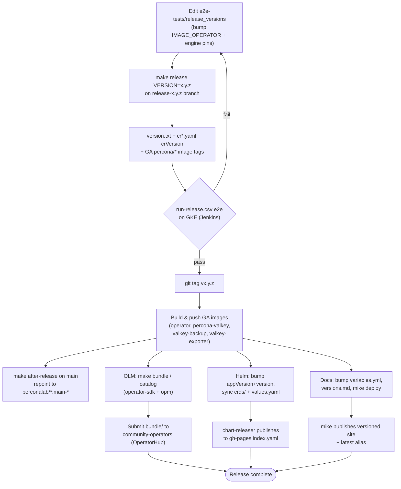
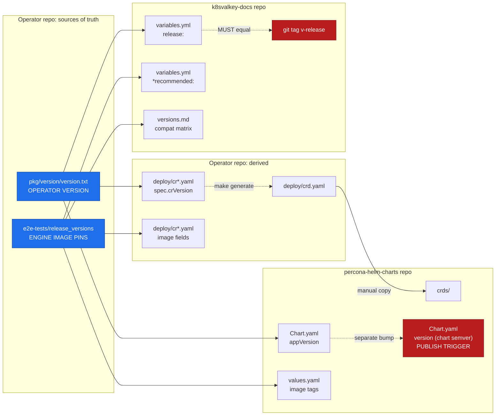
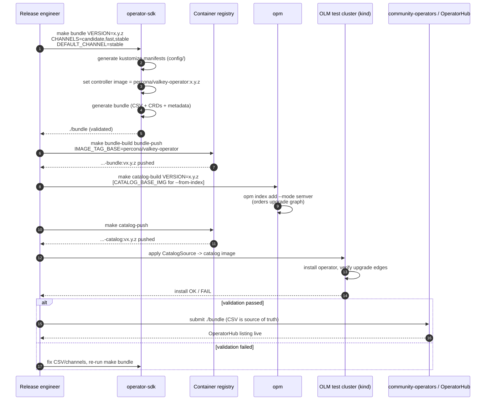

# Distribution & Release

> **Abstract.** This document specifies how the **Percona Operator for Valkey** (`percona-valkey-operator`) is built, packaged, published, and released. It covers the four container images (operator, server, backup tool, exporter) and the `percona/` vs `perconalab/` registry split; the two Helm charts (`valkey-operator` + `valkey-db`) and the `appVersion`/`version`/`crds/` sync rules; the OLM bundle + catalog flow via `operator-sdk`/`opm`; the `k8svalkey-docs` MkDocs Material site with `mike` multi-version publishing; the CI/CD split between GitHub Actions (unit + lint + `check-generate` on PRs) and Jenkins (kuttl e2e on GKE); and — most importantly — the **cross-repo version-bump ritual** that keeps the operator, charts, and docs in lockstep. Every value here mirrors the Percona Operator-SDK trio (PXC / PSMDB / PS) conventions and adopts the upstream `valkey-operator` topology model. The two version axes (`spec.crVersion` for API/upgrade compatibility, engine image tags for the database) are governed exactly as in PXC/PSMDB/PS: `pkg/version/version.txt` is the single source of truth for the operator version, and `e2e-tests/release_versions` is the single source of truth for every pinned engine/sidecar image.

This is the distribution-and-release chapter of the architecture set. For the controller behaviour that produces the manifests packaged here, see [Control Plane & Reconciliation](04-control-plane.md); for the CRD shapes that the bundle/CRDs sync, see [API & CRD Design](03-api-design.md); for the backup tooling images, see [Backup & Restore](06-backup-restore.md); for testing mechanics referenced by CI, see [Testing & Quality Assurance](11-testing-qa.md).

---

## 1. Scope and the two version axes

Releasing this operator means moving the **same set of numbers** through **three independent git repositories** — `percona-valkey-operator`, `percona-helm-charts`, and `k8svalkey-docs` — with **no tooling that crosses repo boundaries**. Getting one repo out of step is the single most common cause of broken releases across the Percona operator family, so this document is organised to make every copy of every number explicit.

Two **orthogonal** version axes exist; never conflate them (they move on completely different cadences):

| Axis | What it is | Source of truth | Where it propagates | Gates |
|------|-----------|-----------------|---------------------|-------|
| **Operator version** | The operator's own semver (e.g. `0.1.0` while `v1alpha1`, `1.0.0` at `v1`). | `pkg/version/version.txt` | `spec.crVersion` in `deploy/cr*.yaml`; Helm `Chart.yaml` `appVersion`; docs `variables.yml` `release:` | `spec.crVersion` gates CR API compatibility and upgrade behaviour (`cr.CompareVersion(...)`). |
| **Engine / sidecar image versions** | Valkey server, backup tool, exporter image tags (e.g. `valkey 9.0.0`). | `e2e-tests/release_versions` | `deploy/cr*.yaml` image fields; chart `values.yaml`; docs `variables.yml` `*recommended:` pins; docs `versions.md` matrix | `spec.upgradeOptions.apply` (`Disabled`/`Recommended`/`Latest`/`<version>`) drives the version service. |

`spec.crVersion` **MUST equal the operator `major.minor`** and is auto-stamped on first reconcile if empty (mirroring PS `pkg/k8s/utils.go` and PSMDB `psmdb_defaults.go`). The engine axis is purely declarative and is resolved by the Percona-style version service — see [Upgrades & Version Management](09-upgrades-versioning.md) for the `upgradeOptions` semantics; this document only covers how those image tags are *pinned and shipped*.

> **Trap (the #1 Percona footgun): `VERSION` defaults to the branch name.** In the Percona Makefiles `VERSION ?= $(git rev-parse --abbrev-ref HEAD | sanitized)`. Running `make release`/`make build`/`make bundle` **without an explicit `VERSION=x.y.z`** will tag images and rewrite `version.txt`/`crVersion` from the *current branch name*. **Always pass `VERSION=x.y.z`** for any release action. Likewise `IMAGE_TAG_OWNER ?= perconalab` — GA images live under `percona/...`, dev/main builds under `perconalab/...`.

---

## 2. Images

The operator ships **four** images. The operator binary is built from this repo's `Dockerfile` (distroless `nonroot`, Go 1.26 toolchain, multi-arch `linux/amd64,linux/arm64`); the server/backup/exporter images are built and pinned separately and referenced from `deploy/cr*.yaml`.

| Image | Repository (GA) | Built from | Contents / role | Pinned in `release_versions` as |
|-------|-----------------|-----------|-----------------|----------------------------------|
| **Operator** | `percona/valkey-operator` | this repo `Dockerfile` (`cmd/manager/`) | The manager binary; runs in the operator pod. | `IMAGE_OPERATOR` |
| **Server** | `percona/percona-valkey` | Percona server build pipeline | Valkey engine + the in-pod sidecar binaries `cmd/valkey-backup/`, `cmd/healthcheck/`, `cmd/peer-list/` (they ride in the DB container/pod, **not** the operator pod). | `IMAGE_VALKEY90`, `IMAGE_VALKEY80`, … (one per supported engine minor) |
| **Backup tool** | `percona/valkey-backup` | backup build | The `cmd/valkey-backup/` snapshot/ship binary used by the backup Job/sidecar. (May be folded into the server image to reduce surface; see open questions.) | `IMAGE_BACKUP` |
| **Exporter** | `percona/valkey-exporter` (recommendation; alternative: vendor `oliver006/redis_exporter`) | exporter build | Prometheus metrics sidecar. Upstream `valkey-operator` defaults to `oliver006/redis_exporter:v1.80.0`; **recommendation:** ship a Percona-branded `percona/valkey-exporter` so the metrics surface and CVE cadence are owned by Percona, falling back to `oliver006/redis_exporter` as a documented alternative for users who prefer the upstream exporter. | `IMAGE_EXPORTER` |

### 2.1 Registry split: `percona/` (GA) vs `perconalab/` (dev/main)

This is the same split PXC/PSMDB/PS use and it is load-bearing:

- **`percona/<image>:<version>`** — **GA, immutable, signed.** Only `make release VERSION=x.y.z` writes these into `deploy/cr*.yaml`. These are what end users run.
- **`perconalab/<image>:main-<component>`** (and `perconalab/valkey-exporter:3-dev-latest`-style dev tags) — **development / `main` builds.** `make after-release` repoints `cr.yaml` back to these for the next dev cycle. **Never ship a release from a tree in the post-`after-release` state.**

Image **tag scheme** (recommended, mirroring `percona/percona-server:8.4.8-8.1`):

- Operator: `percona/valkey-operator:<operator-version>` (e.g. `0.1.0`).
- Server: `percona/percona-valkey:<valkey-version>-<build>` (e.g. `9.0.0-1`).
- Backup/exporter: pinned to specific build tags, bumped independently of the operator version.
- Multi-arch: every image is a manifest list for `linux/amd64,linux/arm64` (matching the upstream publish workflow and this repo's `Dockerfile` `TARGETOS`/`TARGETARCH` args). `s390x`/`ppc64le` are available via `docker buildx` but are **not** part of the default GA matrix unless demand warrants — call this out in release notes rather than silently building them.

> **Trap:** all containers in a pod must be compatible — the exporter image version must understand the running Valkey version, and the backup tool must match the server's RDB format. There is **no** version negotiation (grounding pitfall). The release process pins a *consistent set* in `release_versions`; do not bump one image in isolation.

---

## 3. Helm charts: `valkey-operator` + `valkey-db`

Following `percona-helm-charts` conventions, the operator ships **two charts** as a pair (mirroring `pxc-operator`/`pxc-db`, `psmdb-operator`/`psmdb-db`):

| Chart | Installs | Analogue |
|-------|----------|----------|
| **`valkey-operator`** | the operator Deployment, RBAC (namespaced + cluster-wide variants), the operator `ServiceAccount`, and the CRDs (under `crds/`). | `psmdb-operator` |
| **`valkey-db`** | a `PerconaValkeyCluster` CR plus its referenced Secrets (ACL users, TLS), `values.yaml` driving `spec.mode`, shards/replicas, storage, exporter, backup storages. | `psmdb-db` |

**Recommendation:** also publish a standalone **`valkey-operator-crds`** CRD-only chart (mirroring `psmdb-operator-crds`/`ps-operator-crds`) so that cluster admins can manage CRD lifecycle separately from RBAC/Deployment in GitOps setups. This is optional for the first release but cheap to add later.

### 3.1 `Chart.yaml`: `appVersion` vs `version`

Two distinct semver fields, and confusing them is a documented Percona trap:

| Field | Meaning | When it bumps | Controls publishing? |
|-------|---------|---------------|----------------------|
| **`appVersion`** | The operator/product version the chart deploys. Tracks `pkg/version/version.txt`. | On every operator release. | **No** — metadata only. |
| **`version`** | The chart's **own** semver. The **only** field that triggers publishing. | On *any* chart change, including chart-only fixes with no operator bump. | **Yes** — `chart-releaser` publishes a chart only if its `version` has no existing release. |

Real in-tree precedent: `psmdb-db` is `version: 1.22.2` while `appVersion: "1.22.0"` — the chart legitimately runs **ahead** of `appVersion`. **Do not blindly set them equal.** For an operator release, bump **both**; for a chart-only template fix, bump **only** `version`.

> **Trap:** forgetting the `version` bump means `chart-releaser` (with `skip_existing: true`) **silently skips** the chart — no error, no release. CI (`ct lint`) enforces a version increment on any PR that touches a chart, which catches this.

### 3.2 `values.yaml` image pins

Default image tags in `valkey-operator/values.yaml` (operator image) and `valkey-db/values.yaml` (server/backup/exporter images) are **a third hand-edited copy** of the versions that already live in `e2e-tests/release_versions` and `deploy/cr*.yaml`. They must match the operator's GA pins after `make release`. There is **no** automation syncing these — see the checklist in §6.

### 3.3 `crds/` sync gate

Charts ship their **own copy** of the operator CRDs under `crds/`. After any CRD change in the operator repo (`make generate && make manifests`), the regenerated `deploy/crd.yaml` **must be copied into** `charts/valkey-operator/crds/crd.yaml` (and the standalone `valkey-operator-crds` chart if present).

**Recommendation:** add a `valkey-operator-crd-sync-check` CI gate in `percona-helm-charts` (mirroring `psmdb-operator-crd-sync-check.yaml`) that diffs the chart's `crds/` against the operator repo's `deploy/crd.yaml` and fails on divergence. Without it, chart CRDs drift silently and only surface as runtime apply failures.

### 3.4 Publishing mechanism (fully automated)

Publishing is **triggered by the `Chart.yaml` `version:` bump alone** — there is no manual package/push:

1. On every push to `main` in `percona-helm-charts`, `.github/workflows/release.yaml` runs `helm/chart-releaser-action` with `skip_existing: true`.
2. It packages each chart whose `version:` has no existing GitHub Release, creates a per-chart GitHub Release, and updates `index.yaml` on the **`gh-pages`** branch.
3. `gh-pages` is served at `https://percona.github.io/percona-helm-charts/`; consumers run `helm repo add percona https://percona.github.io/percona-helm-charts/`.

CI on PRs runs `ct lint` (version-increment check) and `helm unittest charts/valkey-operator` / `helm unittest charts/valkey-db` (assertion suites under each chart's `tests/*.yaml`). Coverage target for chart unit tests is **80%+ of templated paths** (matching the operator coverage bar in [Testing & Quality Assurance](11-testing-qa.md)).

---

## 4. OLM: bundle + catalog

Among the Percona operators, **only PS** builds OLM artefacts; PXC/PSMDB ship only flat install bundles. **For Valkey, OLM is in scope** (the charter lists OperatorHub distribution), so this operator follows the **PS `operator-sdk`/`opm` flow**.

> **Two meanings of "bundle" — keep them distinct:**
> - **`deploy/bundle.yaml` + `deploy/cw-bundle.yaml`** (generated by `make manifests`) are flat `kubectl apply -f` install manifests (operator + CRDs + RBAC; `cw-` = cluster-wide watch). These are **not** OLM artefacts.
> - **OLM operator bundle** — an image carrying a `ClusterServiceVersion` (CSV) + CRDs + metadata/annotations. This is the OperatorHub artefact, built below.

### 4.1 Channels

| Channel | Purpose | `replaces`/`skips` policy |
|---------|---------|---------------------------|
| **`candidate`** | Pre-release / RC builds for validation. | May `skip` intermediate RCs. |
| **`fast`** | Latest GA, early adopters. | Linear `replaces` from previous GA. |
| **`stable`** | Conservative GA, default for production. | Linear `replaces`; lags `fast` if a GA needs soak time. |

`DEFAULT_CHANNEL=stable`. **Channel membership is baked into the CSV at `make bundle` time, not at catalog time** — changing channels requires re-running `make bundle`.

### 4.2 Build sequence

Run every target with an explicit `VERSION=x.y.z` (the branch-name footgun applies here too):

```bash
# 1. Generate the OLM bundle (CSV + CRDs + metadata) into ./bundle/
make bundle VERSION=x.y.z CHANNELS=candidate,fast,stable DEFAULT_CHANNEL=stable
#   - operator-sdk generate kustomize manifests (from config/)
#   - kustomize sets controller image = $(IMAGE)
#   - operator-sdk generate bundle --version $(VERSION) $(BUNDLE_METADATA_OPTS)
#   - operator-sdk bundle validate ./bundle

# 2. Build & push the bundle image
make bundle-build bundle-push VERSION=x.y.z
#   BUNDLE_IMG ?= $(IMAGE_TAG_BASE)-bundle:v$(VERSION)
#   default IMAGE_TAG_BASE=perconalab/valkey-operator -> ...-bundle:vx.y.z
#   for GA: override IMAGE_TAG_BASE=percona/valkey-operator

# 3. Build & push the catalog (index) image from one or more bundles
make catalog-build catalog-push VERSION=x.y.z
#   opm index add --mode semver --tag $(CATALOG_IMG) --bundles $(BUNDLE_IMGS) [$(FROM_INDEX_OPT)]
#   CATALOG_IMG ?= $(IMAGE_TAG_BASE)-catalog:v$(VERSION)
```

**Key knobs:**

- **Incremental catalogs:** set `CATALOG_BASE_IMG=<existing-catalog>` to append (`--from-index`) the new bundle to a prior index rather than rebuilding a one-bundle catalog. `opm index add --mode semver` orders upgrades by semver, so **bundle versions must be valid semver or the upgrade graph breaks.**
- **`opm` is auto-fetched** to `./bin/opm` (operator-registry) if not on `PATH`; building catalogs uses `docker` as the container tool.
- **Registry owner:** bundle/catalog images default to `perconalab/...`; for GA, override `IMAGE_TAG_BASE` (or `*_IMG`) to `percona/...`, matching the GA operator image.

### 4.3 OperatorHub submission

The generated `./bundle/` (CSV with channels, `replaces`/`skips` upgrade edges, image refs) is submitted to **`operator-framework/community-operators`** for the OperatorHub listing. The CSV in `bundle/` is the **source of truth** for the listing. Validate the upgrade graph locally before submitting by deploying the freshly built catalog as a `CatalogSource` against an OLM-running cluster — the vendored `operator-lifecycle-manager` repo's `make run-local` (kind + OLM) is the validation harness for this; it is **not** a publishing target.

---

## 5. Docs site: `k8svalkey-docs`

The docs site is an **MkDocs Material** project with **`mike`** multi-version publishing and a **`macros`**-plugin `variables.yml`, mirroring the `k8spxc-docs`/`k8spsmdb-docs`/`k8sps-docs`/`k8spg-docs` sites.

- **`mkdocs.yml` inherits `mkdocs-base.yml`** (`INHERIT:`). The base file owns the shared `nav:`, `plugins:`, and `extra:`. **Edit nav and plugin config in `mkdocs-base.yml`, not `mkdocs.yml`.**
- **Multi-version** via `mike` (`extra.version.provider: mike`): each release is its own versioned site; `mike` manages the version dropdown and the `latest` alias. Plain `mkdocs build` produces a single unversioned site for local preview only.
- **`variables.yml` injected via the `macros` plugin** (`macros.include_yaml: ["variables.yml"]`). Markdown references values as `{{release}}`, `{{valkey90recommended}}`, `{{exporterrecommended}}`, etc. A `main.py` adds function macros (e.g. a `k8svalkeyjira(...)` helper for Jira links).

### 5.1 `variables.yml` contents

| Key | Value | Source |
|-----|-------|--------|
| `release:` | operator version (e.g. `0.1.0`) — **must equal the operator git tag `v<release>`** | operator `version.txt` |
| `*recommended:` (e.g. `valkey90recommended`, `backuprecommended`, `exporterrecommended`, `certmanagerrecommended`, platform versions) | engine/tool image pins | operator `e2e-tests/release_versions` |
| `date:` (e.g. `0_1_0: "2026-06-22"`) | release date entry | manual, per release |

> **Trap:** `{{release}}` is wired to the operator's git tag — docs link to operator files as `.../percona-valkey-operator/blob/v{{release}}/deploy/cr.yaml` and set CRD annotation examples like `valkey.percona.com/{{release}}`. **The operator must be tagged `v<release>` BEFORE bumping `release:` in `variables.yml`**, or every such link 404s.

### 5.2 Per-release docs checklist (all manual, one PR)

1. `variables.yml` — bump `release:`; update **every** `*recommended:` pin to match the operator's `release_versions`; add the new `date:` entry.
2. `docs/ReleaseNotes/` — add `Kubernetes-Operator-for-Valkey-RN<version>.md`.
3. `mkdocs-base.yml` — add that release-notes file to the `Release Notes:` `nav:` (newest first).
4. `docs/versions.md` — add a row to the **Versions compatibility** matrix (operator version → tested Valkey versions, backup tool, exporter, cert-manager, platform/k8s versions). This table **duplicates** the `*recommended` values — keep them consistent.
5. Publish with `mike deploy <version>` — append the `latest` alias (`mike deploy <version> latest`) **only** for a GA release, not for pre-release/`v1alpha1` builds.

> **Trap:** the `*recommended` pins in `variables.yml` **and** the `versions.md` matrix are **two separate hand-edited copies** of the same versions that already live in the operator repo — three places, no automation. A doc-only fix to an *older* release must be published to that version's `mike` branch, not just `main`/`latest`.

---

## 6. Cross-repo version-bump checklist

This is the heart of the chapter. The same numbers touch **twelve locations across three repos with zero cross-repo sync tooling** — two of them (`deploy/cr*.yaml` `crVersion` and image fields) are rewritten by `make release`, the other ten are hand-edited. Use this checklist for **every** release; each line is a place a release can silently break.

```
OPERATOR REPO (percona-valkey-operator)
  [ ] pkg/version/version.txt            = operator version          (source of truth, operator axis)
  [ ] deploy/cr*.yaml  spec.crVersion    = operator major.minor      (written by `make release`)
  [ ] e2e-tests/release_versions         = all IMAGE_* engine pins    (source of truth, engine axis)
  [ ] deploy/cr*.yaml  image fields      = GA percona/* engine tags   (written by `make release`)

HELM REPO (percona-helm-charts)
  [ ] charts/valkey-operator/Chart.yaml  appVersion = operator version
  [ ] charts/valkey-db/Chart.yaml        appVersion = operator version
  [ ] both Chart.yaml                    version    = chart semver (the publish trigger; >= prior)
  [ ] charts/valkey-operator/crds/       = copied from operator deploy/crd.yaml (CRD sync gate)
  [ ] charts/*/values.yaml               image tags = release_versions GA pins

DOCS REPO (k8svalkey-docs)
  [ ] variables.yml  release:            = operator version (and git tag v<release> MUST exist)
  [ ] variables.yml  *recommended:       = release_versions pins
  [ ] docs/versions.md                   compatibility matrix row added
```

### 6.1 The Percona traps, called out explicitly

1. **`VERSION` defaults to the branch name.** Always pass `VERSION=x.y.z` to `make release`/`build`/`bundle`/`catalog-*`. (#1 footgun.)
2. **`crVersion` mismatch breaks CR API compatibility.** `crVersion` is the operator `major.minor` only (e.g. `1.1`), never the full patch — so patch operator upgrades (`1.1.0 → 1.1.1`) must not change it. Bumping `version.txt` without re-running `make release` leaves `crVersion` stale at the wrong minor; the operator then rejects or upgrade-loops CRs whose `crVersion` doesn't match. `make update-version` only writes `version.txt` — it does **not** touch `crVersion`.
3. **Helm `version` ≠ `appVersion`.** `version` controls publishing and can legitimately run ahead of `appVersion` (precedent: `psmdb-db` `1.22.2` / `1.22.0`). Forgetting the `version` bump = chart silently skipped by `chart-releaser`.
4. **Three hand-edited image-pin copies drift.** `e2e-tests/release_versions`, chart `values.yaml`, and docs `variables.yml` have no sync — all three must match after `make release`.
5. **Docs `release:` must equal an existing operator tag `v<release>`** or all `blob/v{{release}}/...` links 404. Tag the operator **before** publishing docs.
6. **`make after-release` repoints `cr.yaml` to `perconalab/*:main-*` dev tags.** Never build/ship a GA release from a tree in that state; cherry-pick/rebase from the release branch.
7. **CRD sync between operator and charts is manual.** Copy `deploy/crd.yaml` → `charts/valkey-operator/crds/` after every `make generate`; the proposed CRD-sync CI gate catches this.
8. **Operator and charts/docs are separate repos with separate PRs.** A version bump in the operator is **not done** until the matching `percona-helm-charts` and `k8svalkey-docs` PRs land. The chart repo typically **lags** the operator.

**Recommendation — add CI drift guards** (cheap, high-value):
- Operator repo `check-generate` gate (CI) already fails if `make generate`/`make manifests` produce a diff — extend it to assert `pkg/version/version.txt` equals `deploy/cr*.yaml` `crVersion`.
- A warning job comparing `e2e-tests/release_versions` against chart `values.yaml` (cross-repo, scheduled) to surface drift early.
- Docs CI job verifying `variables.yml release:` matches an existing operator git tag before `mike` publish.

---

## 7. CI/CD split

The split is identical to the Percona trio: **GitHub Actions runs only fast checks on PRs; Jenkins runs the real e2e on GKE.** GitHub Actions **never spins up a Valkey cluster.**

### 7.1 GitHub Actions (on `pull_request` and pushes to `main`)

| Workflow | Runs | Gate |
|----------|------|------|
| `tests.yml` | `make test` (unit + **envtest**, Ginkgo/Gomega), `go mod tidy` clean check | Blocks merge on failure. Coverage target **80%+**. |
| `lint.yml` | `golangci-lint run` (custom plugin build via `.custom-gcl.yml`), `make fmt vet` | Blocks merge. |
| `check-generate.yml` | `make generate && make manifests` then `git diff --exit-code` | **Blocks merge** if generated code (deepcopy, CRDs, RBAC) is stale — enforces the regeneration discipline from [API & CRD Design](03-api-design.md). |
| `scan.yml` | image/dependency vulnerability scan (Trivy/Grype), `reviewdog` annotations | Reports; HIGH/CRITICAL block per security policy. |
| `publish.yml` | multi-arch `docker buildx` build of the operator image; pushes on `main`/tag only (PRs build but don't push) | Tags: branch, PR number, semver from git tag, short SHA — to `perconalab/` for `main`, `percona/` for GA tags. |

### 7.2 Jenkins (e2e on GKE)

The `Jenkinsfile` provisions **GKE** clusters via `gcloud` (needs `GCP_PROJECT_ID` + `gcloud-key-file` credentials), builds & pushes the operator image, then runs the **kuttl** e2e suites (PS/PG-style) selected from the `run-*.csv` matrix in parallel across cluster suffixes, uploading artefacts to S3 (`percona-jenkins-artifactory-public`). Clusters self-destruct via a `delete-cluster-after-hours=6` label.

E2E uses **kuttl** (`e2e-tests/kuttl.yaml`, `testDirs: e2e-tests/tests`, `timeout: 180`), with numbered `NN-<step>.yaml` + `NN-assert.yaml` pairs. Test selection per CSV row (`test-name,valkey-major-version`):

| CSV | Purpose |
|-----|---------|
| `run-pr.csv` | PR smoke suite (kicked off manually from a PR comment / Jenkins trigger). |
| `run-distro.csv` | Full cross-platform + cross-engine-version matrix. |
| `run-minikube.csv` | Minikube-runnable subset for local/cheap runs. |
| `run-release.csv` | Release-validation suite (run on `release-x.y.z` branches before GA). |

> **Trap:** kuttl format validation (`kuttl-shfmt`) runs before tests; hand-edited test YAML that isn't formatted fails. `make e2e-test` runs the formatter automatically.

See [Testing & Quality Assurance](11-testing-qa.md) for the full envtest/kuttl test design and the golden-file conventions.

---

## 8. Release workflow

Releases are cut on **`release-X.Y.Z` branches** (not `main`). The single source of truth for pinned images is **`e2e-tests/release_versions`** — edit it first.

### 8.1 `make release VERSION=x.y.z` (on the release branch — GA pinning)

Mirrors PXC/PSMDB/PS; edits tracked files in place:

1. `echo VERSION > pkg/version/version.txt`.
2. Rewrites `deploy/cr.yaml` + `deploy/cr-minimal.yaml`: sets `crVersion` to the **`major.minor`** of `VERSION` (e.g. `VERSION=1.1.0` → `crVersion: 1.1`; see [Upgrades & Version Management](09-upgrades-versioning.md) — `crVersion` is `major.minor` only so patch releases never churn the CR API contract) and replaces **every** component image (operator / server / backup / exporter, plus any `initImage`/`initContainer`) with the GA `percona/...` tags from `release_versions` (`IMAGE_OPERATOR`, `IMAGE_VALKEY90`, `IMAGE_BACKUP`, `IMAGE_EXPORTER`, …).
3. Syncs `CERT_MANAGER_VER` into `e2e-tests/vars.sh` (kuttl-style, as PS) from `go.mod`.
4. Regenerates any test fixtures that assert GA images (regenerate — do **not** hand-edit).

### 8.2 `make after-release` (on `main` — next dev cycle)

- `NEXT_VER` is auto-derived from the current `crVersion` in `cr.yaml` as `major.(minor+1).0` (override with `NEXT_VER=`). It does **not** read `version.txt`.
- Sets `crVersion` to the **`major.minor`** of `NEXT_VER` (e.g. `NEXT_VER=1.2.0` → `crVersion: 1.2`) and repoints all images to `perconalab/...:main-*` dev tags (and exporter to its dev tag).
- `make update-version` is the narrower piece — it only writes `NEXT_VER` into `version.txt`.

### 8.3 Typical end-to-end sequence

1. **Operator repo:** edit `e2e-tests/release_versions` (bump `IMAGE_OPERATOR` + engine images) → on `release-x.y.z`, `make release VERSION=x.y.z` → verify `cr*.yaml` `crVersion` + image tags → commit → run `run-release.csv` e2e on Jenkins → tag `vx.y.z` → build & push GA `percona/...` images (operator via `publish.yml`/buildx; server/backup/exporter via their pipelines).
2. **Operator repo (`main`):** `make after-release` → verify images repointed to `perconalab/...:main-*` → commit.
3. **OLM:** `make bundle VERSION=x.y.z CHANNELS=candidate,fast,stable DEFAULT_CHANNEL=stable` → `bundle-build/bundle-push` → `catalog-build/catalog-push` (override `IMAGE_TAG_BASE=percona/...` for GA) → validate via OLM kind cluster → submit `bundle/` to `community-operators`.
4. **Helm repo:** bump `appVersion`+`version` (both charts), copy `deploy/crd.yaml` → `crds/`, sync `values.yaml` image tags, `helm unittest`, merge to `main` (chart-releaser auto-publishes).
5. **Docs repo:** bump `variables.yml` `release:` + `*recommended:` + `date:`, add release-notes page, update `mkdocs-base.yml` nav + `versions.md`, then `mike deploy <version>` (add the `latest` alias only for a GA release, per §5.2). (Operator tag `vx.y.z` must already exist.)

**Merge order across repos:** operator first (sets tag `vx.y.z`, pins GA images) → helm-charts next (auto-publishes) → docs last (`mike` publish needs the tag).

---

## 9. Diagrams

### 9.1 End-to-end release pipeline (code → images → helm → OLM → docs)



### 9.2 Cross-repo version-number flow (one source → three repos)



### 9.3 OLM bundle + catalog publishing



---

## 10. Summary of decisions

| Decision | Choice | Rationale |
|----------|--------|-----------|
| Images | 4: `percona/valkey-operator`, `percona/percona-valkey`, `percona/valkey-backup`, `percona/valkey-exporter` | Matches Percona naming; Percona-owned exporter (fallback `oliver006/redis_exporter`). |
| Registry split | `percona/*` GA, `perconalab/*` dev/main | Identical to PXC/PSMDB/PS; gates GA vs dev artefacts. |
| Charts | `valkey-operator` + `valkey-db` (+ optional `valkey-operator-crds`) | Operator/db pair mirrors trio; CRD-only chart aids GitOps. |
| Chart versioning | `appVersion` = operator version; `version` = chart semver = publish trigger | `version` may run ahead; both bump on operator release. |
| OLM | Full bundle + catalog (PS-style), channels `candidate`/`fast`/`stable`, default `stable` | Charter requires OperatorHub; PS is the in-family precedent. |
| Docs | `k8svalkey-docs`, MkDocs Material + `mike` + `macros`/`variables.yml` | Identical to existing docs sites. |
| CI/CD | GitHub Actions = unit+lint+`check-generate` on PR; Jenkins = kuttl e2e on GKE | Matches the trio; e2e never runs in Actions. |
| Version sources of truth | `version.txt` (operator), `release_versions` (engine) | Single edit point per axis; all other locations derive. |

---

## 11. Open questions

- **Backup image folding.** Should `cmd/valkey-backup/` ship as a standalone `percona/valkey-backup` image or be folded into `percona/percona-valkey` to reduce image surface and avoid version-skew between backup tool and server? Recommendation leans toward a separate image for independent CVE cadence; revisit after [Backup & Restore](06-backup-restore.md) finalises the Job-vs-sidecar execution model.
- **Exporter ownership.** Build `percona/valkey-exporter` from day one, or vendor `oliver006/redis_exporter` for the first release and switch later? The latter is faster to ship; the former is the long-term Percona-owned stance.
- **OLM at `v1alpha1`.** OperatorHub listings imply API stability; should the OLM catalog be limited to the `candidate` channel until the API graduates to `v1`, with `fast`/`stable` opening at GA?
- **CRD-only chart timing.** Ship `valkey-operator-crds` in the first release or defer until GitOps demand is demonstrated?
- **`s390x`/`ppc64le` GA support.** Include in the default multi-arch GA matrix, or build on demand only? Upstream `docker buildx` supports them; Percona GA precedent is `amd64`+`arm64`.
- **Cross-repo drift automation.** Worth investing in a scheduled CI job (or a small release CLI) that compares the eight version locations across the three repos, given Percona has historically accepted manual drift risk?
