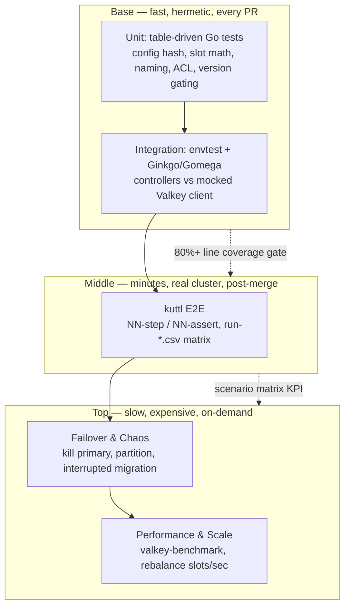
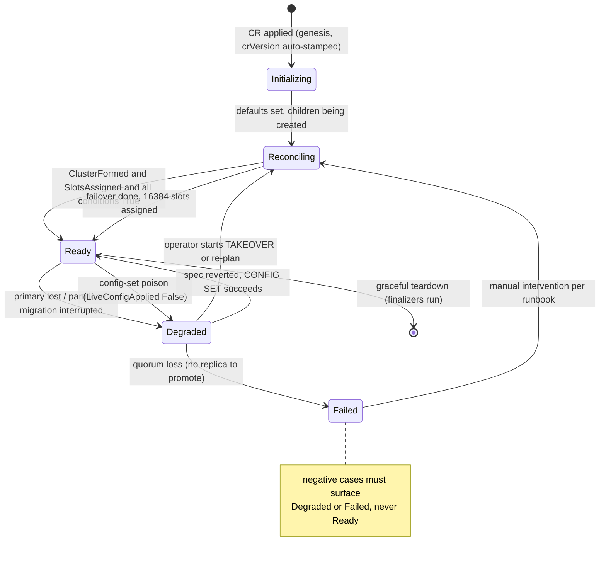
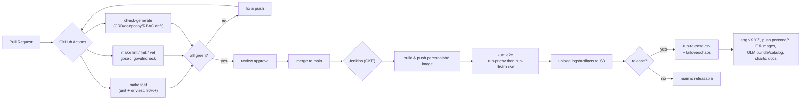

# Testing & Quality Assurance

This document defines the testing strategy for the **Percona Operator for Valkey** (`percona-valkey-operator`). It specifies a four-layer test pyramid — fast `envtest` unit/integration tests, deterministic `kuttl` end-to-end suites on a real cluster, failover/chaos scenarios, and performance/scale probes — wired into a two-stage CI/CD pipeline (GitHub Actions for unit + lint on every PR; Jenkins for `kuttl` e2e on GKE). It also defines the mandatory CI gates (`golangci-lint`, `go vet`, `gosec`, `check-generate` CRD/deepcopy drift), a local **Kind**-based reproduction harness (`lib.sh` + numbered `setup`/`reproduce`/`teardown` scripts) modelled on the in-tree `repro-K8SPS-732` pattern, and a QA verification runbook for signing off a fix. Every claim about Valkey cluster behaviour and Percona conventions is grounded in the upstream `valkey-operator`, the Percona SDK trio (PXC/PSMDB/PS), and the Valkey engine semantics. Coverage target across the pyramid is **80%+**, enforced as a CI gate. See [API & CRD Design](03-api-design.md), [Control Plane & Reconciliation](04-control-plane.md), [Backup & Restore](06-backup-restore.md), and [Distribution & Release](10-distribution-release.md) for the surfaces under test.

---

## 1. Test pyramid and coverage target

We adopt a classic pyramid: a wide base of fast, hermetic unit/`envtest` tests; a narrower band of `kuttl` end-to-end tests on a real Kubernetes API + real Valkey pods; a thin top of failover/chaos and performance scenarios run on demand. The shape is deliberate — the cheap layers must catch the overwhelming majority of regressions because the expensive layers (real GKE clusters pulling real `percona/percona-valkey` images, forming 16384-slot clusters) cost minutes-to-hours and dollars per run.

| Layer | Tooling | Where it runs | Speed | What it proves | Gate |
|-------|---------|---------------|-------|----------------|------|
| **Unit** | Go `testing`, table-driven | `go test ./...` | ms | Pure functions: config rendering, `serverConfigRollHash` → `configHash` (SHA-256), slot-range math, `PlanRebalanceMove`, naming builders, ACL string generation, version gating (`CompareVersion`) | PR-blocking |
| **Integration (envtest)** | Ginkgo/Gomega + `setup-envtest` | `make test` (mock kube-apiserver, no kubelet) | seconds | Controller reconcile loops against a real API server with a **mocked Valkey client**: CR creation → child `ValkeyNode`/StatefulSet/Service/ConfigMap/Secret, conditions, finalizers, owner refs | PR-blocking |
| **E2E (kuttl)** | `kubectl-kuttl` step/assert + Kind/GKE | `make e2e-test` | minutes | Real pods forming a real Valkey cluster: `CLUSTER MEET`, slot assignment, replication, rolling update, backup→restore | Jenkins (post-merge / release) |
| **Failover / Chaos** | `kuttl` + injected faults | `make e2e-test TEST=<chaos>` | minutes | Recovery from primary loss, partition, interrupted slot migration | Jenkins (release) |
| **Performance / Scale** | `valkey-benchmark` + scrape | manual / nightly | tens of min | Throughput, rebalance slots/sec, scale-out latency, regression deltas | Manual / nightly |

**Coverage target: 80%+.** `make test` emits `cover.out`; CI fails the build if the merged unit+envtest line coverage for `pkg/...` drops below 80% (mirrors the Percona testing standard). Coverage is measured on `pkg/` (domain + controller logic), **excluding** `zz_generated.deepcopy.go`, `cmd/` entrypoints, and `test/` helpers — generated and glue code would otherwise dilute the signal. `kuttl` e2e is **not** counted toward the line-coverage number (it is behavioural, not statement-level); instead we track an e2e *scenario* coverage matrix (the `run-*.csv` rows) as a separate KPI.



---

## 2. Unit + envtest (Ginkgo/Gomega)

### 2.1 Layout and tooling

The operator mirrors the Percona SDK trio layout. Tests live next to the code:

- `pkg/valkey/*_test.go` — domain logic (cluster-state parsing, slot planning, ACL rendering, config rendering/hashing). Pure, no cluster.
- `pkg/naming/naming_test.go` — every name/label builder (DNS-63 compliance, prefixes).
- `pkg/version/version_test.go` — `CompareVersion`, `crVersion` stamping, `upgradeOptions.apply` gating.
- `pkg/controller/<resource>/*_test.go` — reconcile loops under **envtest** (Ginkgo/Gomega), one suite per controller: `perconavalkeycluster`, `valkeynode`, `perconavalkeybackup`, `perconavalkeyrestore`.

`make test` runs the full unit+integration suite. It chains `manifests generate fmt vet setup-envtest` and then `go test`, downloading the pinned kube-apiserver/etcd binaries via `setup-envtest` and exporting `KUBEBUILDER_ASSETS` (identical mechanism to upstream `valkey-operator` and PS):

```bash
make test
# under the hood (paraphrased from upstream Makefile):
# KUBEBUILDER_ASSETS="$(bin/setup-envtest use <k8s-ver> -p path)" \
#   go test $(go list ./... | grep -v /e2e) -coverprofile cover.out
```

Run a single suite once envtest assets exist:

```bash
KUBEBUILDER_ASSETS="$(bin/setup-envtest use 1.34.1 -p path)" \
  go test ./pkg/controller/perconavalkeycluster/... -run TestReconcile -v -ginkgo.v
```

### 2.2 What each controller test MUST cover

`envtest` gives a real kube-apiserver + etcd but **no kubelet** — pods never actually run. That is exactly right for controller logic: we assert the operator creates/updates the correct child objects and status, and we **mock everything that talks to a live Valkey** (since no real server exists). Each suite must cover, at minimum:

**`perconavalkeycluster` controller (the public `PerconaValkeyCluster`, short `pvk`):**
1. **Defaulting** — `CheckNSetDefaults` stamps `crVersion` when empty, fills probe timeouts, resource defaults, secret names, default `mode: cluster`, default image. Assert idempotence (run twice → identical object).
2. **CR validation gating** — `mode` ∈ {cluster, replication, standalone}; `persistence` forbidden with `workloadType: Deployment`; `shards`/`replicas` (replicas-per-shard) bounds, and `shards == 1` enforced for non-cluster modes. (CEL `XValidation` is also exercised, but reconcile-side `CheckNSetDefaults` must reject what CEL cannot express.)
3. **Child creation, in order** — headless Service `valkey-<cluster>`; PodDisruptionBudget; `internal-<cluster>-system-passwords` Secret (type `valkey.io/acl`) carrying `_operator` and, **when `spec.exporter.enabled` is true (the default)**, `_exporter`; the rendered ACL `internal-<cluster>-acl` Secret; ConfigMap `valkey-<cluster>` with the rendered `valkey.conf` and a deterministic `configHash` (computed by `serverConfigRollHash(cluster)`); then one `ValkeyNode` per `(shardIndex, nodeIndex)` named `<cluster>-<shard>-<node>`, created **one-at-a-time, replicas-before-primary**, with `spec.serverConfigHash` propagated.
4. **Owner references** — every child has the `PerconaValkeyCluster` as controller owner (GC correctness).
5. **Config hash → roll** — changing a restart-requiring key in `spec.config` changes `configHash` (from `serverConfigRollHash`), which re-stamps `ValkeyNode.spec.serverConfigHash`; changing only a live-settable key (`maxmemory`, `maxmemory-policy`, `maxclients`) does **not** change the roll hash (those keys are excluded from the hash). This is the single highest-value unit assertion.
6. **Status derivation** — given a mocked `ClusterState`, conditions (`Ready`, `Progressing`, `Degraded`, `ClusterFormed`, `SlotsAssigned`) are set with correct `Reason`/`ObservedGeneration`, and `status.state` is derived by priority `Degraded → Ready → Reconciling → Failed`.
7. **Finalizers** — on delete, finalizers run in order: ordered cluster teardown → backup-artifact cleanup → PVC reclaim (per `ReclaimPolicy`). Assert finalizer removed only after cleanup.
8. **Scale-out / scale-in spec deltas** — increasing `shards` creates pending primaries; decreasing triggers drain bookkeeping (the actual `CLUSTER MIGRATESLOTS` is mocked, but the *plan* and event emission are asserted).
9. **Events** — `ServiceCreated`, `ConfigMapCreated`, `ValkeyNodeCreated`, `PrimariesCreated`, `ReplicasAttached`, `SlotsRebalancing`, `FailoverInitiated` emitted at the right transitions; Warning events on errors.

**`valkeynode` controller (internal `ValkeyNode`, short `vkn`):**
1. **WorkloadType immutability** — `StatefulSet` (default, durable) vs `Deployment` (cache) is set once and rejected on change.
2. **Workload + PVC + ConfigMap** — correct StatefulSet/Deployment, PVC `valkey-<node>-data`, mount of the users-ACL Secret at `/config/users/users.acl` and TLS Secret at `/etc/valkey/tls/`.
3. **PVC lifecycle** — Retain vs Delete reclaim via finalizer; size **expand-only** (shrink rejected, storageClass change rejected).
4. **Config-hash rolling restart** — `spec.serverConfigHash` stamped as a pod-template annotation drives the rollout; identical hash → no roll.
5. **Live config** — `LiveConfigApplied` condition set true only when the pod is Ready and the allowlisted keys (`maxmemory`, `maxmemory-policy`, `maxclients`) applied via `CONFIG SET` through the **mocked** `valkeyConfigClient`; a `CONFIG SET` error keeps the condition false (and must not crash-loop).
6. **Status** — `ready` flips true only when the pod is Ready and all conditions true; `status.role`/`status.podIP` are read from the (mocked) live `INFO`, never from labels.

**`perconavalkeybackup` / `perconavalkeyrestore` controllers:**
1. Storage resolution: `spec.storageName` resolves against `cluster.spec.backup.storages[name]` with no fallback (typo → explicit error, not silent skip).
2. Backup `Job` shape (RDB `BGSAVE` per shard → object store with `s3://`/`gs://`/`azure://` destination prefix); terminal `status.state` ∈ {Succeeded, Failed, Error}; `status.destination` and `completed` populated.
3. Finalizer-driven artifact GC and retention enforcement.
4. Restore: `backupName` xor `backupSource`; slot-coverage-aware bootstrap of a new cluster; terminal state transitions. (See [Backup & Restore](06-backup-restore.md).)

### 2.3 Mocking the Valkey client

The operator talks to Valkey via `valkey-go` (`ForceSingleClient=true` per node, to avoid client-side `MOVED`/`ASK` redirect loops). For unit and `envtest` tests, **never** dial a real server. Define a narrow interface and inject a fake:

- A `ValkeyClient` (per-node) interface exposes exactly the operations the controllers use: `ClusterInfo`, `ClusterNodes`, `ClusterMeet`, `ClusterAddSlotsRange`, `ClusterReplicate`, `ClusterFailover` (graceful/FORCE/TAKEOVER), `ClusterMigrateSlots`, `ClusterForget`, `ClusterGetSlotMigrations`, `Info` (replication), `ConfigSet`, `AclSetUser`.
- A `valkeyConfigClient` interface (subset) covers the live-config path used by the `ValkeyNode` controller.
- A `ClientFactory` (`func(addr, port, tls) ValkeyClient`) is the injection seam; production wires `valkey-go`, tests wire a `fakeValkey`.

The fake is a **scriptable state machine**, not a one-shot stub: it returns canned `CLUSTER NODES`/`CLUSTER INFO`/`INFO replication` payloads (raw text, parsed by the real parser so we exercise field-by-field parsing of flags `myself,master,slave,fail,fail?`, slot ranges, `slave_repl_offset`, `master_link_status`). It records issued commands so tests assert ordering invariants — **`CLUSTER MEET` before `ADDSLOTSRANGE` before `REPLICATE` before `MIGRATESLOTS`** — and idempotence (re-issuing `MEET` is a no-op).

> **Terminology note:** the `master`/`slave` tokens above (engine flags such as `myself,master,slave` and `INFO` fields such as `slave_repl_offset`, `master_link_status`, `role:master`) are upstream Valkey/exporter field names; throughout this operator they map to **primary/replica** semantics. Keep these literal strings **exact** in test assertions and fixtures — they must match the engine's wire output verbatim — even though the operator's own API, status, and prose use primary/replica.

Recommended fixtures to bake in (real-shaped, so parser bugs surface):
- A healthy 3-shard cluster (each primary owns one of `0-5460`, `5461-10922`, `10923-16383`), one synced replica each (`master_link_status:up`).
- A degraded cluster: one primary `fail`-flagged, its replica orphaned (drives `promoteOrphanedReplicas`/`TAKEOVER` logic).
- An isolated node (`cluster_known_nodes <= 1`, zero slots) — drives `meetIsolatedNodes`.
- A pending primary (known but zero slots) — drives `assignSlotsToPendingPrimaries`.
- A mid-rebalance state (`CLUSTER GETSLOTMIGRATIONS` non-empty) — proves the one-move-per-reconcile guard and tolerance for ±1 slot rounding.

> **Recommendation:** generate the per-node `ValkeyClient` mock with `mockgen` (matching the Percona convention of generated mocks) for the strict call/return assertions, and keep one hand-written stateful `fakeValkey` for the multi-command scenario tests where a mock's expectation chains become unreadable. Prefer the stateful fake for reconcile-pipeline tests; use the generated mock for single-method error-path tests (e.g. `CONFIG SET` returns `ERR`).

### 2.4 Ginkgo/Gomega conventions

- One `Describe` per controller, `Context` per scenario, `It` per assertion; `BeforeEach` provisions a fresh namespace and CR.
- Use `Eventually(...).Should(...)` for the reconcile-driven object/status convergence (envtest is asynchronous); never `time.Sleep`.
- Lint with `ginkgolinter` (already in the `.golangci.yml` enable-list) to catch focused specs (`FIt`/`FDescribe`) and bad matcher usage before merge.
- Beware the **status-lag race**: the cluster controller reads child `ValkeyNode.status.ready`; in envtest, set that status explicitly in the test (no kubelet flips it) before asserting the parent progresses, or the suite will hang waiting for `ready=true`.

---

## 3. kuttl end-to-end

E2E uses [kuttl](https://kuttl.dev/), matching PS and PG (PXC/PSMDB use the older bash harness; we deliberately choose kuttl for declarative, golden-style assertions). Real Valkey pods form a real cluster; we assert the *observable* contract.

### 3.1 TestSuite layout

```
e2e-tests/
  kuttl.yaml                 # TestSuite: testDirs: [e2e-tests/tests], timeout: 180
  functions                  # shared bash sourced by script steps (deploy_operator, deploy_cert_manager, ...)
  run-pr.csv                 # smoke matrix (PR validation)
  run-distro.csv             # full cross-platform / engine matrix
  run-minikube.csv           # local subset
  run-release.csv            # release validation
  conf/                      # CR templates (cr-cluster.yaml, cr-replication.yaml)
  tests/
    init-cluster/
      00-deploy-cert-manager.yaml   00-assert.yaml
      01-deploy-operator.yaml       01-assert.yaml
      02-create-cluster.yaml        02-assert.yaml
      03-write-data.yaml            03-assert.yaml
      99-remove-cluster-gracefully.yaml
    scaling/ ...
    config-rolling-update/ ...
    demand-backup-s3/ ...
    restore/ ...
    tls/ ...
    acl-users/ ...
    failover-kill-primary/ ...     # see §4
    partition/ ...
    slot-migration-interrupt/ ...
```

`e2e-tests/kuttl.yaml` is the suite config (`testDirs: [e2e-tests/tests]`, default `timeout: 180` — kuttl's `timeout` is an integer number of seconds, not a duration string), exactly mirroring the PS layout. Each test directory is a `kuttl` **TestCase**: numbered **step** files (`NN-<action>.yaml`, kind `TestStep`) paired with **assert** files (`NN-assert.yaml`, kind `TestAssert`). Steps either apply manifests or run `commands:`/`script:` blocks that `source ../../functions`; asserts declare the desired *partial* state of named objects and kuttl polls until it matches or times out.

A step that applies a CR and a paired assert that waits for readiness:

```yaml
# tests/init-cluster/02-create-cluster.yaml  (TestStep)
apiVersion: kuttl.dev/v1beta1
kind: TestStep
timeout: 300
commands:
  - script: |-
      set -o xtrace
      source ../../functions
      apply_cluster "${TEST_DIR}/../../conf/cr-cluster.yaml"   # mode: cluster, shards: 3, replicas: 1 (per shard)
```

```yaml
# tests/init-cluster/02-assert.yaml  (TestAssert)
apiVersion: kuttl.dev/v1beta1
kind: TestAssert
timeout: 600
---
apiVersion: valkey.percona.com/v1alpha1
kind: PerconaValkeyCluster
metadata:
  name: cluster1
status:
  state: Ready
  conditions:
    - type: ClusterFormed
      status: "True"
    - type: SlotsAssigned
      status: "True"
    - type: Ready
      status: "True"
```

### 3.2 The run-*.csv engine-version matrix

Test selection and engine-version fan-out use `run-*.csv`, exactly as PS/PXC/PSMDB do. Each row is `test-name,engine-major-version`, so the same test runs once per listed Valkey version:

```csv
# e2e-tests/run-pr.csv  (smoke)
init-cluster,9.0
scaling,9.0
config-rolling-update,9.0
demand-backup-s3,9.0
restore,9.0
tls,9.0
acl-users,9.0
failover-kill-primary,9.0
```

```csv
# e2e-tests/run-distro.csv  (full matrix — note engine-version gating)
init-cluster,9.0
init-cluster,8.0
init-cluster,7.2
tls,9.0
tls,8.0
acl-users,9.0
acl-users,8.0
scaling,9.0
slot-migration-interrupt,9.0
# NOTE: scaling and slot-migration-interrupt are listed for 9.0 ONLY.
# Atomic CLUSTER MIGRATESLOTS / CLUSTER GETSLOTMIGRATIONS require Valkey 9.0+
# (see 05-data-plane.md). On 7.2 and 8.0 the migrate subcommand returns
# "unknown subcommand"; the operator wraps this as an actionable error and
# blocks scale-out/scale-in, so any test that rebalances or drains slots
# would (correctly) fail. Keep 7.2/8.0 rows to cluster-mode basics only
# (init/tls/acl), where bootstrap uses ADDSLOTSRANGE (works on 7.2+).
```

Run a single test locally against Kind:

```bash
make e2e-test TEST=failover-kill-primary IMAGE=perconalab/valkey-operator:main
# wraps: kubectl kuttl test --config e2e-tests/kuttl.yaml --test failover-kill-primary
# (PS prepends kuttl-shfmt formatting validation; we do the same)
```

> **Engine matrix policy (recommendation):** default to `9.0.0` everywhere (the charter default image). Run migration/scale tests (`scaling`, `slot-migration-interrupt`, scale-in drain) on **`9.0` only** — atomic `CLUSTER MIGRATESLOTS`/`CLUSTER GETSLOTMIGRATIONS` are Valkey 9.0+ (see [Data Plane](05-data-plane.md)). Include `8.0` and `7.2` only for cluster-mode/replication/TLS/ACL basics, where bootstrap uses `CLUSTER ADDSLOTSRANGE` (the floor for cluster mode + ACL is 7.x). Never list a migration/rebalance/scale test below `9.0`. Typos in the version column silently skip rows — lint the CSV (see §6).

### 3.3 Golden-file / compare approach

kuttl's native `TestAssert` is itself a golden assertion: it diffs the live object against the embedded expected (partial) spec/status and retries until match or timeout. For richer rendered-manifest checks (the full StatefulSet a `ValkeyNode` produces, the rendered `valkey.conf` ConfigMap, the generated ACL Secret), we add a `compare`-style step that captures live YAML and diffs it against committed golden files, mirroring the PXC/PSMDB `compare_kubectl`/`compare/*.yml` convention:

```yaml
# tests/config-rolling-update/04-compare.yaml  (TestStep)
apiVersion: kuttl.dev/v1beta1
kind: TestStep
commands:
  - script: |-
      source ../../functions
      compare_kubectl statefulset/valkey-cluster1-0-0        # vs compare/statefulset_valkey-cluster1-0-0.yml
      compare_kubectl configmap/valkey-cluster1              # vs compare/configmap_valkey-cluster1.yml
```

- Golden files live in `tests/<case>/compare/*.yml`, with platform/version variants (e.g. `-oc` for OpenShift, `-90`/`-80` for engine version, `-eks`) selected by `compare_kubectl` from the environment.
- **When an intended change alters generated manifests, regenerate the matching golden file** (`compare_kubectl ... > compare/<name>.yml`) — never edit the test logic to paper over a real diff. This is the same discipline as the operator-trio golden-file rule.
- Normalize volatile fields (timestamps, `resourceVersion`, `uid`, image digests, generated suffixes) in `compare_kubectl` before diffing, or every run shows spurious diffs.

---

## 4. Failover & chaos tests

These prove the operator's HA promises hold under real failure. Each is a `kuttl` case that establishes a healthy cluster, injects a fault in a step, then asserts recovery in the paired assert. The single fast, deterministic headline case — `failover-kill-primary` — is cheap enough to sit in the smoke matrix (`run-pr.csv`); the heavier, more disruptive cases (`partition`, `slot-migration-interrupt`, the negative quorum-loss and config-poison cases) are gated to release runs (`run-release.csv`) because they are slow and disruptive.

### 4.1 Scenarios and recovery assertions

> **Terminology note:** recovery assertions below grep engine output literally (`role:master`, `master_link_status:up`); these are upstream Valkey field names mapped to primary/replica semantics in this operator. Keep the literal strings exact in assertions — they must match `valkey-cli`/`INFO` output verbatim.

| Scenario | Fault injection (step) | Expected operator action (grounded) | Recovery assertion (assert) |
|----------|------------------------|-------------------------------------|-----------------------------|
| **Kill a primary (quorum holds, persistence ON)** | `kubectl delete pod valkey-cluster1-0-0` (node 0 = initial primary) on the durable default cluster | A majority of slot-owning primaries stays reachable, so **Valkey's own election** promotes the synced replica automatically — the operator only **observes** and updates status (it does **not** issue `TAKEOVER`). The restarted pod reloads `nodes.conf` and rejoins with the **same** node ID, reclaiming its old role as a replica; `forgetStaleNodes` is deferred while the pod is expected back | `cluster_state:ok`; all 16384 slots assigned; `status.state: Ready`; `ClusterFormed=True`; no slot loss; data compare pre/post equal |
| **Kill a primary (quorum lost, persistence OFF)** | scale a cache-mode (`workloadType: Deployment`, no persistence) shard to a single primary + replica, then `kubectl delete pod` on the primary so `HasFailoverQuorum()` is false | `promoteOrphanedReplicas` runs **only** because `HasFailoverQuorum()==false` **and** `spec.persistence==nil`: it selects `BestReplicaOf` (highest `slave_repl_offset`) and issues `CLUSTER FAILOVER TAKEOVER` (TAKEOVER **before** `CLUSTER FORGET` so slots stay owned) | `cluster_state:ok`; all slots assigned; `status.state: Ready`; a `ReplicasTakenOver` event (the orphan-promote path — **not** `FailoverInitiated`/`FailoverCompleted`, which belong to the proactive graceful path); no slot loss |
| **Graceful primary roll** | trigger a rolling update touching a primary (config hash change) | **Before** rolling a primary, `proactiveFailover` issues graceful `CLUSTER FAILOVER` (Valkey pauses writes on the old primary until the target catches up) on the highest-offset synced replica, then polls `INFO replication` every **1s up to a 10s** timeout for `role:master`. On success: `FailoverInitiated` then `FailoverCompleted`; on timeout: `FailoverTimeout` (Warning) and the roll proceeds anyway (native election recovers). If the primary has **no** synced replica the roll is **deferred** rather than risking the only data-serving node | Zero un-acked writes lost during the window (data compare pre/post); old primary returns as replica `master_link_status:up`; one-at-a-time roll order observed |
| **Network partition** | inject a NetworkPolicy / iptables drop isolating one shard's primary from the majority | Operator must **not** issue `TAKEOVER` while a quorum-holding majority of slot-owning primaries is reachable (avoid split-brain) — native election (if any) handles it. The operator only runs `promoteOrphanedReplicas` → `TAKEOVER` when `HasFailoverQuorum()` is false **and** `spec.persistence == nil` **and** the replica is genuinely orphaned | After partition heals: single primary per shard (no split-brain duplicate slot ownership), `cluster_state:ok`, slots intact |
| **Slot-migration interruption** | start scale-in (drain), then kill the destination primary mid-`CLUSTER MIGRATESLOTS` | Migration is atomic per move (one move/reconcile via `PlanDrainMove` + `CLUSTER MIGRATESLOTS SLOTSRANGE … NODE …`); on destination loss, operator must not orphan slots — re-plan via `PlanDrainMove`, retry against a healthy destination, or halt and surface `Degraded` | No slot loss — `cluster_slots_assigned:16384` throughout (the real `CLUSTER INFO` field); either the drain completes against a healthy destination or the cluster reports `Degraded` with a clear reason (never silent slot loss); **`Valkey 9.0+` only** |
| **Quorum loss (negative)** | kill primary **and** all its replicas | `TAKEOVER` impossible (no replica to promote) — documented stuck state | Operator surfaces `Degraded`/`Failed` with reason indicating manual intervention; does **not** silently mark `Ready`; runbook recovery steps documented |
| **Config-set poison (negative)** | set an invalid live key (e.g. `maxmemory: notanumber`) | `CONFIG SET` fails → `LiveConfigApplied=False`, blocks progress; **no** pod roll, no crash-loop | `LiveConfigApplied=False` with the engine's error in the message; reverting the spec clears it on next reconcile |

### 4.2 How chaos is injected in kuttl

- **Pod kill / partition:** `commands:` step using `kubectl delete pod`, or apply a deny-all `NetworkPolicy` selecting the target pod; the healing step deletes the policy.
- **Mid-migration kill:** a step starts scale-in (patch `shards` down), then a follow-up step polls `CLUSTER GETSLOTMIGRATIONS` (via a `valkey-cli` exec or the operator status) and, once a migration is in flight, deletes the destination pod — deterministic interruption rather than racing a sleep.
- **Assertions** combine kuttl `TestAssert` on the CR `status` with `script:` probes that exec `valkey-cli CLUSTER INFO`/`CLUSTER NODES` and grep for `cluster_state:ok` and `cluster_slots_assigned:16384` (the real `CLUSTER INFO` field — there is no `cluster_slots_unassigned`; unassigned = `16384 - cluster_slots_assigned`), plus absence of duplicate slot owners.

The diagram below traces the **quorum-lost, persistence-OFF** kill-primary case — the only one where the operator itself issues `TAKEOVER`. In the durable default (persistence ON, quorum holds), the `CLUSTER FAILOVER TAKEOVER` and `ReplicasTakenOver` steps do **not** occur: Valkey's native election promotes the replica and the operator merely observes.

```mermaid
sequenceDiagram
    autonumber
    participant K as kuttl runner
    participant API as kube-apiserver
    participant OP as percona-valkey-operator
    participant C as Valkey cluster pods
    K->>API: apply PerconaValkeyCluster (mode=cluster, cache/no-persistence)
    OP->>C: CLUSTER MEET / ADDSLOTSRANGE / REPLICATE
    OP->>API: status.state=Ready (ClusterFormed, SlotsAssigned)
    K->>API: assert state=Ready  (00-assert)
    K->>C: write seed data (valkey-cli)  (01-step)
    K->>API: delete pod valkey-cluster1-0-0  (primary, 02-step)
    OP->>C: CLUSTER NODES  (detect primary fail; HasFailoverQuorum()==false)
    OP->>C: CLUSTER FAILOVER TAKEOVER (BestReplicaOf, highest-offset synced replica)
    OP->>API: emit ReplicasTakenOver event
    OP->>C: CLUSTER FORGET stale node (after TAKEOVER, so slots stay owned)
    OP->>API: status.state=Ready, all 16384 slots assigned
    K->>API: assert state=Ready + slots intact  (02-assert)
    K->>C: read seed data == written  (03-step/assert, no data loss)
```

### 4.3 Cluster status state machine under fault (what the asserts wait on)

Each chaos `TestAssert` polls `status.state` until it reaches the expected terminal value. The operator derives `status.state` by the priority order `Degraded -> Ready -> Reconciling -> Failed`; the diagram below shows the transitions the failover/chaos cases exercise. Recoverable faults converge back to `Ready`; the negative cases (quorum loss, config-set poison) must land in `Degraded`/`Failed` and never silently report `Ready`.



---

## 5. Performance & scale testing

Performance tests are not PR-gated; they run nightly/on-demand to catch regressions and to size guidance. They run on a real cluster (GKE) with production-shaped resource requests.

**Workloads & probes:**
- **Throughput / latency:** `valkey-benchmark` against the cluster (cluster-mode aware via the headless Service), recording p50/p99 GET/SET, ops/sec at fixed payload sizes; track deltas vs the previous release as a regression gate (fail if p99 regresses > N%).
- **Eviction behaviour:** set `maxmemory` + `maxmemory-policy` (e.g. `allkeys-lru`) — these are live-settable via `CONFIG SET`, so the test asserts the policy takes effect *without* a pod roll, then drives the keyspace past `maxmemory` and verifies eviction.
- **Rebalance throughput:** measure slots/sec during scale-out/in. Because the operator deliberately does **one `PlanRebalanceMove` per reconcile** (with a 30s steady-state requeue), the metric of interest is wall-clock to rebalance N slots and number of reconciles, not raw migrate bandwidth — guards against accidental slot churn from non-deterministic planning.
- **Scale-out latency:** time from `shards: 3 → 6` to `cluster_state:ok` with even slot distribution (~`16384/N` per primary, ±1 tolerance).
- **Rolling-update window:** time and write-availability during a full one-at-a-time rolling restart with proactive failover.

**Metrics source:** scrape the exporter sidecar (`PodMonitor`/`ServiceMonitor`) plus operator-emitted metrics (failover count per shard, rebalance moves, config-mismatch gauge, failed-AUTH counter). See [Observability](08-observability.md). Persist runs (CSV/JSON to object storage) so nightly trends are diffable.

> **Recommendation:** keep a small, fixed `perf-smoke` profile (single 3-shard cluster, 60s benchmark) runnable in CI nightly for trend detection, and a larger `perf-scale` profile (6→12 shards, large keyspace) run only at release. Do not block PRs on perf — it is too noisy on shared runners.

---

## 6. CI gates

Two stages, mirroring the Percona split: **GitHub Actions** runs fast, hermetic checks on every PR and never provisions a database cluster; **Jenkins** runs the real `kuttl` e2e on GKE post-merge / for releases.

### 6.1 GitHub Actions (PR-blocking)

Modelled on the upstream `valkey-operator` workflows (`test.yml`, `lint.yml`) plus the Percona `gosec`/scan and `reviewdog` additions:

| Job | Command | Gate |
|-----|---------|------|
| **Unit + envtest** | `go mod tidy && make test` | Fail on any test failure or coverage < 80% |
| **Lint** | `make lint-config && make lint` (`golangci-lint` v2) | Fail on any enabled linter (see below) |
| **Format** | `gofmt -s -l .` must be empty; `goimports` clean | Fail if unformatted |
| **go.mod tidy** | `go mod tidy && git diff --exit-code go.mod go.sum` | Fail on dirty module files |
| **check-generate** | `make manifests && make generate && git diff --exit-code` | Fail if generated CRDs/deepcopy/RBAC drift |
| **Vet** | `go vet ./...` (also chained inside `make test`) | Fail on vet errors |
| **Security (gosec)** | `gosec ./...` (Percona addition) | Fail on HIGH findings |
| **Vuln / image scan** | `govulncheck` + Trivy on the built image (`scan.yml`) | Warn/Fail per severity policy |
| **reviewdog** | inline PR annotations for lint/vet | Non-blocking annotations |

**Enabled linters** (from `.golangci.yml`, Go 1.26): `errcheck`, `govet`, `staticcheck`, `revive`, `gocyclo`, `dupl`, `goconst`, `ineffassign`, `unused`, `unparam`, `unconvert`, `prealloc`, `nakedret`, `lll`, `misspell`, `copyloopvar`, `modernize`, `ginkgolinter`, `logcheck` (Kubernetes logging conventions), and `depguard` (forbids `sort` in favour of `slices`). `lll`/`dupl` are relaxed under `api/*` and `internal/*`; `goconst` is relaxed in `_test.go`.

**`check-generate` is non-negotiable.** Editing `pkg/apis/valkey/v1alpha1/*_types.go` requires `make generate` (deepcopy/RBAC) **and** `make manifests` (CRD/`deploy/`) before commit; CI re-runs both and fails if `git diff` is non-empty. Never hand-edit `zz_generated.deepcopy.go`. (See [Distribution & Release](10-distribution-release.md).)



### 6.2 Jenkins e2e on GKE (post-merge / release)

The `Jenkinsfile` provisions GKE clusters via `gcloud` (needs `GCP_PROJECT_ID` + `gcloud-key-file`), builds & pushes the operator image (`perconalab/valkey-operator:<branch/main>` for dev; GA images live under `percona/valkey-operator`), runs the CSV-listed `kuttl` tests in parallel across cluster suffixes, and uploads artifacts to S3. Clusters self-destruct via a `delete-cluster-after-hours` label. Selection: `run-pr.csv` for the smoke gate, `run-distro.csv` for the full matrix, `run-release.csv` (including §4 failover/chaos) for release validation. GitHub Actions never runs e2e — it has no database cluster.

---

## 7. Local Kind-based reproduction harness

For reproducing reported issues before/after a fix, ship a self-contained harness per issue under `repro-<JIRA-KEY>/`, modelled exactly on the in-tree `repro-K8SPS-732` pattern: a sourced `lib.sh` (config + helpers) plus numbered, idempotent scripts. This gives QA and engineers a deterministic, laptop-sized (single-node Kind) before/after demonstration without a cloud cluster.

### 7.1 Files

```
repro-K8SVK-<n>/
  00-install-tools.sh    # kind, kubectl, yq into ~/.local/bin (no sudo), idempotent
  01-setup.sh            # kind cluster + cert-manager + operator + apply CR, wait ready
  02-reproduce.sh        # deterministic before/after demonstration of the root cause
  03-teardown.sh         # kind delete cluster [--tools] [--images]
  04-deploy-patched-operator.sh   # build fix-branch image, kind load, redeploy (optional)
  lib.sh                 # shared config + helpers (sourced by every script)
  cr-cluster.yaml        # the PerconaValkeyCluster CR under test
  README.md  QA.md       # how to run + sign-off runbook
```

### 7.2 `lib.sh` (config + helpers)

Identical structure to the PS harness, adapted to Valkey names/labels. It centralizes the cluster name, kube-context, namespace, CR name, operator bundle location, and cert-manager version; provides `k`/`kk` wrappers, colored `say`/`ok`/`warn`, and readiness helpers that count Ready pods by the charter labels.

```bash
#!/usr/bin/env bash
# Shared config + helpers for a percona-valkey-operator reproduction.
set -euo pipefail

export CLUSTER="${CLUSTER:-vk-repro}"
export KCTX="${KCTX:-kind-$CLUSTER}"
# NOTE: do NOT name the namespace after a real ccTLD; CoreDNS may forward the
# per-pod short FQDN upstream. Use a clearly non-TLD suffix.
export NS="${NS:-valkey-repro}"
export CR_NAME="${CR_NAME:-cluster1}"
export OPERATOR_BUNDLE_URL="${OPERATOR_BUNDLE_URL:-}"     # empty => repo deploy/bundle.yaml
export CERT_MANAGER_VER="${CERT_MANAGER_VER:-v1.16.2}"
export LOCAL_BIN="${LOCAL_BIN:-$HOME/.local/bin}"

HERE="$(cd "$(dirname "${BASH_SOURCE[0]}")" && pwd)"
export OPERATOR_REPO="${OPERATOR_REPO:-$(cd "$HERE/.." && pwd)/percona-valkey-operator}"
export CR_FILE="${CR_FILE:-$HERE/cr-cluster.yaml}"
export PATH="$LOCAL_BIN:$PATH"

k()  { kubectl --context "$KCTX" -n "$NS" "$@"; }
kk() { kubectl --context "$KCTX" "$@"; }
say(){ printf '\n\033[1;36m== %s ==\033[0m\n' "$*"; }
ok() { printf '\033[1;32m%s\033[0m\n' "$*"; }
warn(){ printf '\033[1;33m%s\033[0m\n' "$*"; }

# Ready Valkey pods by charter labels (app.kubernetes.io/* + valkey.percona.com/*)
valkey_ready_count() {
  k get pods -l app.kubernetes.io/instance="$CR_NAME",app.kubernetes.io/name=valkey \
    --no-headers 2>/dev/null | grep -c 'Running' || true
}
wait_valkey_ready() {  # $1 expected count, $2 timeout seconds
  local want="${1:-6}" deadline=$(( SECONDS + ${2:-600} ))
  while [ "$SECONDS" -lt "$deadline" ]; do
    [ "$(valkey_ready_count)" = "$want" ] && return 0; sleep 5
  done; return 1
}
cluster_state() { k get pvk "$CR_NAME" -o jsonpath='{.status.state}' 2>/dev/null; }
```

### 7.3 The numbered scripts

- **`00-install-tools.sh`** — downloads pinned `kind`/`kubectl`/`yq` into `~/.local/bin` (no sudo), idempotent; notes that the optional patched-image build (`04-*`) additionally needs Go + Docker.
- **`01-setup.sh`** — creates the Kind cluster (`kind create cluster --name "$CLUSTER" --wait 120s` if absent); installs cert-manager and waits `--for=condition=Available`; creates `$NS`; applies the operator bundle (`$OPERATOR_REPO/deploy/bundle.yaml` or `$OPERATOR_BUNDLE_URL`) with `--server-side`; `kubectl rollout status deploy/percona-valkey-operator`; applies `cr-cluster.yaml`; polls `cluster_state`/`valkey_ready_count` until `state=Ready`. Idempotent (safe to re-run).
- **`02-reproduce.sh`** — the deterministic before/after. The canonical technique (from K8SPS-732): scale the operator to 0 so it cannot revert live state, isolate the single variable the fix changes, drive the failing condition, observe a definite signal, restore. It must end with an explicit machine-greppable `REPRODUCED:` / `VERDICT` line. For Valkey, examples: on a **cache-mode (no-persistence) shard whose primary loses quorum**, prove an unpatched binary leaves the shard stuck `Degraded` while the patched operator runs `promoteOrphanedReplicas` → `CLUSTER FAILOVER TAKEOVER` and converges to `state=Ready` (emitting `ReplicasTakenOver`); or prove a config-hash bug causes a spurious roll (BEFORE) that the fix eliminates (AFTER), measured by StatefulSet generation deltas.
- **`03-teardown.sh`** — `kind delete cluster`; `--tools` also removes the installed binaries; `--images` prunes docker images.
- **`04-deploy-patched-operator.sh`** (optional) — `make build`/`docker build` the fix branch, `kind load docker-image`, redeploy, so the *real operator* (not a manual patch) is exercised end-to-end.

> **Namespace gotcha (carry it forward):** never name the repro namespace such that the per-pod short FQDN ends in a real ccTLD — CoreDNS forwards it upstream and returns bogus answers. Use a clearly non-TLD suffix (`valkey-repro`) and always resolve full `…svc.cluster.local` names in probes.

> **Resource note:** single-node Kind needs roughly 4 CPU / 6 GB RAM / 6 GB disk to pull the Valkey + exporter images and form a 3-shard×2 cluster; document this in each repro `README.md`.

---

## 8. QA verification runbook

Every fix is verified at three escalating levels; **Level A is mandatory** before sign-off. This mirrors the `repro-K8SPS-732` `QA.md` and is the gate before a change is considered "done".

### Level A — Unit / envtest (mandatory, fast, no cluster)

```bash
cd percona-valkey-operator
git checkout <fix-branch>
# the specific regression test that encodes the bug:
go test ./pkg/controller/perconavalkeycluster/... -run <TestThatEncodesTheBug> -v -ginkgo.v
make test          # full unit+envtest suite must stay green
```
**PASS criteria:** the new regression test PASSES; sibling tests for *other modes* (e.g. `replication` while fixing `cluster`) still PASS (proves no cross-mode regression); `make test` exits 0; coverage stays ≥ 80%.

### Level B — Mechanism reproduction (recommended, ~10–15 min, Kind)

```bash
export PATH="$HOME/.local/bin:$PATH"
cd repro-K8SVK-<n>
./00-install-tools.sh        # one-time
./01-setup.sh                # wait for "cluster ready"
./02-reproduce.sh            # before/after demonstration
```
**PASS criteria:** `02-reproduce.sh` ends with `REPRODUCED:`/`VERDICT` showing the failing condition in the BEFORE phase and its absence in the AFTER phase. If a run is timing-inconclusive (the cluster self-healed before observation), re-run with a longer window (`WINDOW=120 ./02-reproduce.sh`).

### Level C — Full e2e with the patched operator (optional, ~20+ min, needs Go + Docker)

```bash
cd repro-K8SVK-<n>
./04-deploy-patched-operator.sh        # build fix image, kind load, redeploy
# Exercise the real scenario (repeatedly kill shard 0's CURRENT primary).
# NOTE: after the first failover the live primary is no longer node 0-0
# (role is read from CLUSTER NODES / INFO, never from the pod name), so
# resolve the current primary each iteration by parsing CLUSTER NODES
# instead of hard-coding -0-0.
for i in 1 2 3; do
  # find the pod whose IP is flagged 'master' for shard 0 in CLUSTER NODES
  PRIMARY=$(kubectl --context kind-vk-repro -n valkey-repro exec valkey-cluster1-0-1 -c valkey -- \
    valkey-cli -a "$OPERATOR_PASS" --no-auth-warning cluster nodes \
    | awk '/master/ {split($2,a,":"); print a[1]}' | head -1)   # primary IP; map back to pod
  kubectl --context kind-vk-repro -n valkey-repro delete pod \
    "$(kubectl --context kind-vk-repro -n valkey-repro get pod -o jsonpath="{.items[?(@.status.podIP=='${PRIMARY}')].metadata.name}")"
  sleep 90
  kubectl --context kind-vk-repro -n valkey-repro get pvk,pods
done
```
**PASS criteria:** after each fault the cluster returns to `state: Ready` with all 16384 slots assigned and one primary per shard; operator logs show no persistent error loop for the affected node.

### Pre-fix baseline (to prove the bug exists)

Run Level B/C against the **unpatched** `main` operator (skip `04-*`). Note timing-sensitivity: some bugs self-heal on some runs — Level B's forced BEFORE condition is the reliable signal.

### Evidence to attach for sign-off

1. **Level A:** `go test` output (regression test PASS) + `make test` summary + coverage number.
2. **Level B:** the `VERDICT`/`REPRODUCED:` block from `02-reproduce.sh`.
3. **Level C (if run):** CR/pod state after repeated faults; relevant operator log excerpt.
4. **CI:** green GitHub Actions run (unit, lint, `check-generate`, gosec) and, for release-blocking fixes, the relevant Jenkins `kuttl` test (e.g. `failover-kill-primary`) green on GKE.

### Regression-test discipline

Every fixed bug **must** ship with a test at the lowest layer that can encode it (almost always Level A unit/envtest). A `kuttl` e2e is added when the bug only manifests against a live cluster (e.g. a real failover or slot-migration interruption). The new test, run against `main` *before* the fix, must FAIL; against the fix branch, must PASS — this is the proof the test actually guards the regression.

---

## Cross-references

- [API & CRD Design](03-api-design.md) — CR shapes, CEL `XValidation`, short names exercised by tests.
- [Control Plane & Reconciliation](04-control-plane.md) — the reconcile pipeline whose ordering invariants the mocks assert.
- [Backup & Restore](06-backup-restore.md) — backup/restore controller behaviours covered by §2.2 and the `demand-backup-s3`/`restore` kuttl cases.
- [Observability](08-observability.md) — exporter metrics scraped by performance tests and chaos assertions.
- [Distribution & Release](10-distribution-release.md) — `make generate`/`manifests`, `check-generate`, image registries, and the release pipeline the CI/CD diagram feeds.
