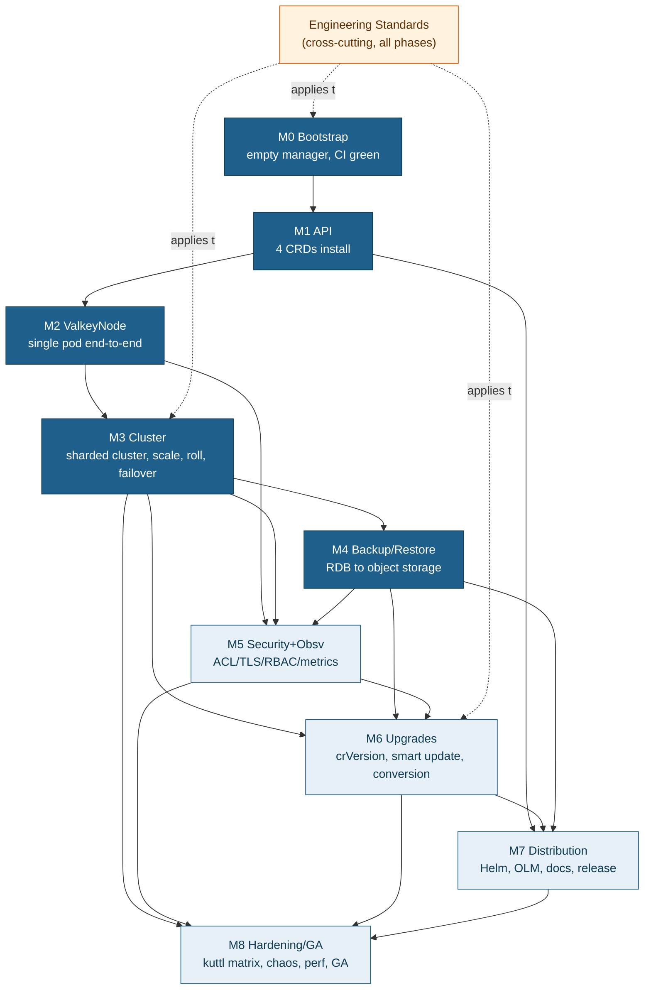
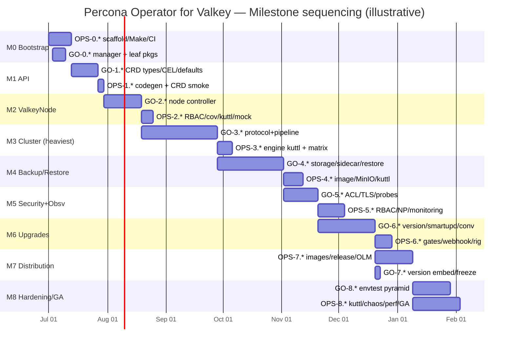

# Implementation Overview — Percona Operator for Valkey

> **STATUS (as-built): all phases implemented (M0–M8 complete, 8 commits on `main`) — not yet GA.**
> This document was written as the forward-looking master plan; every milestone it sequences
> (M0 Bootstrap → M8 Hardening/GA) is now **built and committed**. All four controllers,
> reconciliation, security/observability hardening, backup/restore, smart updates, and
> Helm/kustomize/OLM distribution are in the tree. Two items are **deferred to GA**: the `v1`
> conversion webhook (only the webhook-cert startup gate is wired; the conversion logic is not
> built) and the `expose.perPod` cluster-announce-ip wiring (partial). The fast, hermetic
> quality layer is green (build, envtest, ≥80% merged coverage, CI gates); cluster-only
> validation (kuttl e2e, chaos, perf) and a few process items remain. The authoritative
> sign-off gate is **[GA-readiness.md](GA-readiness.md)** — read it for the per-milestone
> evidence, coverage table, known deferrals, and the GA checklist.

> **Master plan.** This is the top-level map that ties the nine phase plans together into a
> single, sequenced delivery. It is *not* a substitute for the per-phase docs — it summarises
> their goals, fixes the milestone build order (M0 → M8), reconciles the effort rollups, and
> aggregates the risks and open questions so a delivery lead and two engineers can run the
> programme end-to-end.
>
> **Source of truth.** Every phase plan traces to the architecture docs under
> [`../architecture/`](../architecture/) — primarily the ADRs in
> [`../architecture/01-decisions.md`](../architecture/01-decisions.md) and the design docs
> ([02 repo-layout](../architecture/02-repo-layout.md) … [11 testing-qa](../architecture/11-testing-qa.md)).
> Where the docs are silent, the gap is recorded as an **OPEN QUESTION** (see §9), never invented.

---

## 1. Executive summary

**What we are building.** A production-grade Kubernetes operator — `percona-valkey-operator`,
API group `valkey.percona.com`, served version `v1alpha1` — that manages sharded **Valkey**
clusters the Percona way: four CRDs (`PerconaValkeyCluster`/`pvk`, `ValkeyNode`/`vkn`,
`PerconaValkeyBackup`/`pvk-backup`, `PerconaValkeyRestore`/`pvk-restore`), a two-CRD
cluster→node topology model ([ADR-001](../architecture/01-decisions.md)), the Percona
Operator-SDK `pkg/apis` / `pkg/controller` layout ([ADR-002](../architecture/01-decisions.md)),
operator-driven failover with no Sentinel ([ADR-007](../architecture/01-decisions.md)),
RDB-snapshot backup/restore ([ADR-004](../architecture/01-decisions.md), [ADR-012](../architecture/01-decisions.md)),
ACL/TLS security ([ADR-008](../architecture/01-decisions.md)/[ADR-009](../architecture/01-decisions.md)),
`crVersion` gating + version-service smart updates ([ADR-005](../architecture/01-decisions.md)),
and Helm + OLM distribution ([ADR-010](../architecture/01-decisions.md)) validated by kuttl
e2e + envtest ([ADR-011](../architecture/01-decisions.md)).

**Delivery strategy.** Nine milestones (M0–M8), each a **demoable, independently-testable
increment**. Every phase is written with two parallel tracks — a **Go Developer Track**
(operator Go: `pkg/apis`, controllers, `pkg/valkey` protocol layer, `cmd/*` sidecars) and a
**DevOps / Platform Track** (scaffolding, Makefile, codegen, images, CI/CD, Helm, OLM, docs,
e2e infra) — so two engineers can work concurrently within each phase. The plan is sized at
**≈506 person-days** of raw work (§7); with the two tracks run in parallel and the cross-track
edges respected, the realistic calendar is multi-engineer, multi-quarter.

**Build order (strictly bottom-up).** Nothing is built before the layer it depends on
exists and is green to contract:

```
M0 Bootstrap → M1 API → M2 ValkeyNode → M3 Cluster → M4 Backup/Restore
                                                          ↓
                        (cross-cutting, hang off the right milestone)
                        M5 Security+Obsv  → M6 Upgrades → M7 Distribution → M8 Hardening/GA
```

The API is the floor (M1); the `ValkeyNode` single-pod controller (M2) is the dependency
floor for the cluster controller (M3), the single heaviest phase; backup/restore (M4) rides
on the M3 protocol layer; security/observability (M5), upgrades/versioning (M6), distribution
(M7), and GA hardening (M8) are the cross-cutting layers that productise the running operator.
This ordering is the charter **BUILD ORDER** and [ADR-002](../architecture/01-decisions.md)'s
dependency rule made concrete.

---

## 2. Team model

The plan is structured around **two tracks** that run in parallel within every phase. Some
phases are dominated by one track; even then the other track has explicit supporting work.

### Go Developer Track

Owns operator Go code: `pkg/apis/valkey/v1alpha1` (CRD types, defaults, CEL), the four
controllers under `pkg/controller/<resource>`, the `pkg/valkey` (locked per
[OQ-PKG](#9-open-questions-log)) protocol/domain layer, `pkg/naming`, `pkg/version`,
`cmd/manager`, and the `cmd/valkey-backup` / `cmd/healthcheck` / `cmd/peer-list` sidecars.
Go is the lead track for M1, M2, M3, M4, M6, and co-lead for M5 and M8.

### DevOps / Platform Track

Owns repo scaffolding, the Percona-family Makefile + pinned `bin/` toolchain, codegen
(`controller-gen`/`kustomize`/`mockgen`), container images (`Dockerfile`/`Dockerfile.sidecar`),
GitHub Actions (unit + lint on PR) and the Jenkins/GKE e2e pipeline, Helm charts
(`valkey-operator` + `valkey-db`), the OLM bundle/catalog, the `k8svalkey-docs` site, RBAC
regeneration, and the kuttl `run-*.csv` matrices. DevOps is the lead track for M0 and M7, and
co-lead for M5 and M8.

### Suggested staffing & parallelism

| Phase | Lead | Suggested staffing | How the tracks parallelise |
|-------|------|--------------------|----------------------------|
| **M0** Bootstrap | DevOps | 1 DevOps + 1 Go (Go light) | Go builds the empty manager + leaf pkgs while DevOps scaffolds the tree, Makefile, CI; rejoin at CI (OPS-0.7 needs GO-0.2/0.3). |
| **M1** API | Go | 1–2 Go + 0.5 DevOps | Go authors the four CRD type sets in parallel sub-tracks (shared sub-structs first); DevOps wires codegen + the CRD-install smoke. |
| **M2** ValkeyNode | Go | 1–2 Go + 0.5 DevOps | Go splits builder vs reconcile vs client; DevOps owns RBAC regen, coverage gate, mockgen, kuttl node smoke. |
| **M3** Cluster | Go | **2–3 Go** + 1 DevOps | Protocol layer and controller skeleton run as two Go sub-tracks converging at bootstrap-join; DevOps stands up the real-engine kuttl + 9.0 matrix. |
| **M4** Backup/Restore | Go | **2 Go** + 1 DevOps | One Go engineer on storage→sidecar→restore, a second on backup-controller/scheduling, decoupled by the `ArtifactStore` fake; DevOps runs image/MinIO/kuttl. |
| **M5** Security+Obsv | Dual | 2 (1 Go + 1 DevOps) | Genuinely dual: ACL/TLS Go work vs monitoring/RBAC/NetworkPolicy/dashboards DevOps work; neither dominates. |
| **M6** Upgrades | Go | 2 Go + 0.5 DevOps | Three Go sub-tracks (version-service, smart-update, conversion) partially parallel; DevOps supplies the `check-version` gate + webhook wiring. |
| **M7** Distribution | DevOps | 1 platform/release + 1 Go-capable DevOps | OPS critical path images→release→OLM; Helm/docs/CI fan out; Go track is supporting (ldflags, webhook config freeze). |
| **M8** Hardening/GA | Co-equal | 2 (1 Go + 1 DevOps) | Go builds envtest pyramid; DevOps builds kuttl/chaos/Jenkins/GA checklist — the DevOps track is the critical path here. |

The cross-phase ideal: a **steady core of two engineers (one Go, one DevOps)**, scaling to
**three Go engineers across M3–M4** (the heavy middle), and folding back to two for M5–M8.

---

## 3. Milestone table (M0–M8)

| Milestone | Goal (charter) | Key exit criteria | Phase doc |
|-----------|----------------|-------------------|-----------|
| **M0 Bootstrap** | Repo scaffolded, builds, CI green on an empty manager. | `make {generate,manifests,test,build,lint,check-generate}` green on empty tree; empty manager boots, serves probes/metrics, takes a leader Lease; multi-arch distroless image; `make deploy` → `Ready` pod on Kind. | [01-phase0-bootstrap.md](01-phase0-bootstrap.md) |
| **M1 API** | Four CRDs install; CEL/defaults/generation work; no controllers yet. | Four CRDs reach `Established`; marker defaults apply; CEL immutability bites server-side; `CheckNSetDefaults` unit-tested; printer columns + short names resolve; coverage gate **hard 80%** on `pkg/apis/...`. | [02-phase1-api.md](02-phase1-api.md) |
| **M2 ValkeyNode** | A single Valkey pod is managed end-to-end (workload, PVC, status, live `CONFIG SET`). | STS/Deployment dispatch; PVC expand-only + reclaim finalizer; `status.{ready,role,podIP}` from live pod + `INFO`; live `CONFIG SET` allowlist fail-closed; `serverConfigHash` roll; exporter sidecar + TLS-aware probes; `Owns`/`Watches`. | [03-phase2-valkeynode.md](03-phase2-valkeynode.md) |
| **M3 Cluster** | `PerconaValkeyCluster` forms a healthy sharded cluster, scales, rolls, fails over. | `pkg/valkey` parses cluster state; deterministic slot planners; 16-phase reconcile; MEET→ADDSLOTSRANGE→REPLICATE bootstrap; scale-out/in (9.0 atomic `MIGRATESLOTS`); one-at-a-time roll + proactive failover; `TAKEOVER`-before-`FORGET`; leader election ON. | [04-phase3-valkeycluster.md](04-phase3-valkeycluster.md) |
| **M4 Backup/Restore** | On-demand + scheduled RDB backup to object storage; restore into a new cluster. | `ArtifactStore` (S3/GCS/Azure/fs-test); `cmd/valkey-backup` `BGSAVE`→ship; phase machines walk to `Succeeded`; Lease serialization; cron schedules + retention GC (write-last/delete-first); `NewCluster` restore at proven 16384-slot coverage. | [05-phase4-backup-restore.md](05-phase4-backup-restore.md) |
| **M5 Security+Obsv** | ACL/users, TLS, RBAC, metrics exporter + Prometheus wiring. | Verbatim system-user ACL + zero-downtime password rotation; TLS (cert-manager/secret-ref) with live reload + `tlsHash` roll; least-privilege RBAC; NetworkPolicy; PodMonitor/dashboards/PrometheusRule; webhook-cert bootstrap **scaffold**. | [06-phase5-security-observability.md](06-phase5-security-observability.md) |
| **M6 Upgrades** | `crVersion` gating, smart engine upgrade, version service, conversion webhook. | Two version axes enforced (`check-version`); `crVersion` gate + downgrade reject; `upgradeOptions` + version-service cron; failover-aware smart engine roll, backup-gated; `v1alpha1↔v1` conversion (lossless, fuzz-validated) + dual-serving. | [07-phase6-upgrades-versioning.md](07-phase6-upgrades-versioning.md) |
| **M7 Distribution** | Helm charts, OLM bundle/catalog, docs site, release pipeline. | `make release`/`after-release` on `release-X.Y.Z`; four multi-arch images on `percona/`↔`perconalab/`; `valkey-operator` + `valkey-db` charts published; OLM bundle/catalog submittable; versioned `k8svalkey-docs`; CI/CD split + drift guards. | [08-phase7-devops-distribution.md](08-phase7-devops-distribution.md) |
| **M8 Hardening/GA** | kuttl e2e matrix, chaos/failover tests, coverage, perf, GA readiness. | Four-layer pyramid to ≥80% coverage; four controller envtest suites; kuttl `run-*.csv` matrix + golden compares; failover/chaos + perf suites; PR-blocking CI gates; Kind repro harness; GA-readiness checklist signed. | [09-phase8-testing-qa.md](09-phase8-testing-qa.md) |
| **Cross-cutting** | Engineering standards & conventions (apply to every phase). | Package/import direction, generated-code boundary, controller idioms, error/logging/secrets rules, testing conventions, per-PR checklist. | [10-engineering-standards.md](10-engineering-standards.md) |

---

## 4. Milestone dependency DAG

The strictly bottom-up chain is M0 → M1 → M2 → M3 → M4; the cross-cutting phases (M5–M8) hang
off the milestones they harden. M5 depends on M2/M3/M4 (it productises their renderer/sidecar/
backup); M6 depends on M3 (roll/failover) + M4 (backup gate) + M5 (cert scaffold); M7 depends
on M1 (CRDs) + M6 (version/webhook config); M8 depends on everything.



Reading the graph: the dark **core spine** (M0–M4) is the unavoidable serial backbone; the
light **cross-cutting layer** (M5–M8) fans off M3/M4 and re-converges at M8 (GA). The dashed
Engineering-Standards node is a conventions layer every phase consumes, not a scheduled
deliverable.

---

## 5. Master Gantt (illustrative sequencing)

Durations are illustrative, rolled up from each phase's per-task effort (§7) and that phase's
own internal critical path; they assume the staffing in §2 (the heavy middle is multi-Go). GO
and OPS swimlanes are shown where a phase splits cleanly; M3/M4 GO bars are the long poles.



> The bars overlap deliberately where the build order allows it: M4 can start as soon as the
> M3 protocol layer (not all of M3) lands; M5 extends M2/M3 seams once those are green; M7
> images can be built off M6 outputs while docs/Helm fan out. The serial floor is M0→M1→M2→M3.

---

## 6. Critical path analysis

**Longest dependency chain (the schedule driver):**

```
M0 (OPS scaffold → manager smoke)
  → M1 (GO CRD types → CEL → CheckNSetDefaults → codegen)
    → M2 (GO client/factory → reconcile pipeline → Owns/Watches)
      → M3 (GO protocol layer → reconcile skeleton → bootstrap-join → roll+failover → envtest)
        → M4 (GO storage → sidecar → restore re-form)
          → M6 (GO version-service → smart-update → conversion)
            → M7 (OPS images → make release → OLM bundle/catalog)
              → M8 (OPS kuttl scaffold → core cases → chaos → Jenkins → GA checklist)
```

The dominant single phase is **M3 (~88 person-days, GO ≈ 78)** — its own internal critical
path (`GO-3.1 → 3.3 → 3.4 → 3.5` protocol layer, converging through `GO-3.11 → 3.12 → 3.13`
bootstrap-join, then `GO-3.16` roll+failover, trailed by `GO-3.23` envtest) is the programme's
spine. **M4 (~92.5 raw person-days)** is the largest raw number but compresses heavily with two
Go engineers because storage/sidecar/restore and backup-controller/scheduling decouple cleanly
behind the `ArtifactStore` fake (≈5–6 calendar weeks). **M8 (~76.5)** is the only phase whose
critical path runs through the **DevOps** track (kuttl scaffold → chaos → Jenkins → GA).

**Where parallelism helps most:**

- **Within M3:** the protocol layer (`pkg/valkey`) and the controller skeleton + infra
  (`upsertService`/`reconcileUsersAcl`/`upsertConfigMap`) are independent until bootstrap-join
  — two Go engineers halve the wall-clock of the heaviest phase.
- **Within M4:** the storage→sidecar→restore leg and the backup-controller→scheduling→retention
  leg run on two engineers decoupled by the `ArtifactStore` fake.
- **M5 is genuinely dual** — the Go security work and the OPS monitoring/RBAC/NetworkPolicy
  work proceed simultaneously with almost no cross-track blocking.
- **M7** is OPS-critical-path on `images → release → OLM`; Helm, docs, and CI fan out off
  `make release` in parallel.
- **DevOps supporting work** in M1/M2/M3/M4/M6 (RBAC regen, coverage gates, mockgen, kuttl
  scaffolds) runs alongside the lead Go track and rarely blocks it.

The hard serial floor that *cannot* be parallelised away is **M0 → M1 → M2 → M3-bootstrap-join**:
no controller can be exercised end-to-end before the API installs, no cluster loop before the
node controller honours its status contract.

---

## 7. Effort rollup

Person-days per phase, split GO vs OPS (from each phase's §11 rollup). Sizing scale is roughly
XS≈0.5–1d, S≈1–2d, M≈2–3d, L≈3–4d, XL≈5d+ (the scale tightens slightly in later phases).

| Milestone | Phase | GO person-days | OPS person-days | Phase total |
|-----------|-------|---------------:|----------------:|------------:|
| M0 | Bootstrap | 5.5 | 16.5 | **22.0** |
| M1 | API | 17.5 | 2.5 | **20.0** |
| M2 | ValkeyNode | 32.5 | 7.5 | **40.0** |
| M3 | Cluster | 78.0 | 10.0 | **88.0** |
| M4 | Backup/Restore | 76.5 | 16.0 | **92.5** |
| M5 | Security+Obsv | 33.0 | 22.0 | **55.0** |
| M6 | Upgrades | 53.0 | 17.0 | **70.0** |
| M7 | Distribution | 2.75 | 39.0 | **41.75** |
| M8 | Hardening/GA | 33.5 | 43.0 | **76.5** |
| **Totals** | | **332.25** | **173.5** | **≈505.75** |

**Reading the rollup.** GO carries ~66% of the raw effort (332 of ~506 person-days), concentrated
in the M3+M4+M6 middle (≈207 GO person-days — the cluster/backup/upgrade logic). OPS carries
~34%, front-loaded in M0 (bootstrap) and back-loaded in M7+M8 (distribution + e2e). The two
phases where OPS dominates are M7 (release engineering) and M8 (test infrastructure). Raw
person-days are *not* calendar time: with the §2 parallel staffing the wall-clock is materially
shorter than 506 days because the two tracks (and, in M3/M4, multiple Go engineers) overlap.

---

## 8. Consolidated risk register

Top risks across phases, with severity and the owning phase. Full per-phase registers live in
each doc's §10.

| # | Risk | Sev | Phase | Mitigation |
|---|------|-----|-------|------------|
| CR-1 | **`check-generate` non-determinism** — `controller-gen`/`kustomize` emit byte-different output across machines, flapping the gate that guards every `*_types.go` change. | HIGH | M0 | Pin every tool exactly in `bin/`; CI uses the same pins; prove stability in the bootstrap PR before M1. |
| CR-2 | **`operator-sdk init` → Percona re-home drift** — a half-kubebuilder/half-Percona tree confuses all later codegen paths. | HIGH | M0 | Do the re-home once (OPS-0.1), document the delta, lock the tree to [02 §2](../architecture/02-repo-layout.md) in review. |
| CR-3 | **CEL is the most error-prone API surface** — `quantity().compareTo`, both-sided `has()` guards, cost limits are subtle; a wrong rule blocks or permits the wrong mutation. | HIGH | M1 | One positive + one negative envtest per rule against a real apiserver; explicit "minimal cluster applies" test. |
| CR-4 | **`CLUSTER NODES`/`INFO` parsing brittleness** — a missed flag (`fail?`/`handshake`/`noaddr`) or multi-range slot mis-parse silently corrupts every downstream decision (the #1 latent-bug source). | HIGH | M3 | Exhaustive golden fixtures; tolerant parsing of trailing/unknown fields; role from live `INFO` only; fuzz the parser. |
| CR-5 | **Proactive-failover correctness** — rolling a live primary without a successful graceful failover risks data loss / split-brain. | HIGH | M3 | Defer (never `FORCE`) when no synced replica; 10s/1s poll; `TAKEOVER` only on quorum-loss+persistence-off, before `FORGET`; envtest defer/timeout/takeover paths. |
| CR-6 | **Mis-ordered / double-issued cluster commands** (ADDSLOTS on a busy slot, double MIGRATESLOTS, premature FORGET) corrupt slot ownership. | HIGH | M3 | Precondition guards (zero-slot primaries, `GETSLOTMIGRATIONS`, gossip-visible dst, in-gossip-only FORGET); one-effect-per-reconcile; leader election; mock asserts command sequences. |
| CR-7 | **`status.ready` lag from the Node controller stalls the cluster loop** at step 6. | MED | M2/M3 | Eager status writeback (M2); cluster gates on `ready` + `observedGeneration==generation`; Pod-watch re-enqueue; alert on lag > 15min. |
| CR-8 | **Silent zero-key restore** — seed booting with `appendonly yes` loads AOF and ignores the seeded RDB. | HIGH | M4 | Hard-code `appendonly no` seed boot + post-load `CONFIG SET appendonly yes`; envtest asserts the override; kuttl `compare_data`. |
| CR-9 | **Lease wedge / double-issue** — a missed release wedges smart-update; a double-held Lease double-issues stateful commands. | HIGH | M4 | Fail-open on missing/expired Lease; in-proc lock + single leader; auto-renew; release on every terminal path incl. eviction. |
| CR-10 | **RDB exfiltration wire protocol under-specified** ([06 §4.2] non-prescriptive) — how the Job reads `dump.rdb` out of a running pod. | HIGH | M4 | Prototype early (GO-4.4); default to a co-located reader in the DB image; record the decision → ADR follow-up (OQ-Q1). |
| CR-11 | **System-user ACL drift** — hand-editing `_operator`/`_exporter`/`_backup` away from canonical strings silently widens a trust boundary / locks the operator out. | CRITICAL | M3/M5 | String consts + golden-equality test vs [07 §4.3](../architecture/07-security.md); CEL rejects `_`-prefixed user names; `WRONGPASS`→unauth fallback; mandatory security-reviewer. |
| CR-12 | **Cert rotation storm / forgetting `port 0` with TLS on** — rolling instability during renewal, or a plaintext leak past the TLS perimeter. | HIGH | M5 | Reuse the proven one-at-a-time + proactive-failover roll; `tlsHash` only changes on real cert change; explicit `port 0` assertion + kuttl plain-connect-refused. |
| CR-13 | **Axis confusion** — `version.txt` bumped without `crVersion` sync → upgrade loop / CR rejection (the documented #1 Percona release footgun). | CRITICAL | M6/M7 | `check-version` CI gate fails on drift; `crVersion` is a `major.minor` copy of `version.txt` written by `make release`, never hand-edited. |
| CR-14 | **Engine roll mid-backup corrupts the backup stream.** | CRITICAL | M6 | Smart-update gate hard-blocks while any `PerconaValkeyBackup` runs (reads the M4 marker/Lease); envtest + kuttl assert the block. |
| CR-15 | **Lossy `v1alpha1↔v1` conversion silently drops user data** / cert-bootstrap race bricks all reads. | HIGH | M6 | Lossless-annotation mechanism + round-trip fuzz gate before any storage flip; webhook advertises only after cert + `caBundle` ready (M5 gate). |
| CR-16 | **`make release` misses an image field** → a GA release silently ships a `perconalab/*` dev tag, or `VERSION` defaults to the branch name. | CRITICAL | M7 | `hack/release.sh` enumerates every image key; post-release CI greps `cr*.yaml` for `perconalab/` on release branches; `VERSION=x.y.z` guard. |
| CR-17 | **Chart `crds/` drift / docs published before the operator tag** → runtime apply failures or 404 doc links. | HIGH | M7 | CRD-sync CI gate; `verify-release-tag` docs job; merge order operator→helm→docs enforced in `RELEASE.md`. |
| CR-18 | **envtest cannot simulate a live cluster / chaos-test non-determinism** — suites hang or flake. | HIGH | M3/M8 | Scriptable `ValkeyConfigClient` mock + fake `ValkeyNode.status`; deterministic chaos injection (scale-to-0, migration-gated kill — never `sleep`); `Eventually` with bounded timeouts. |
| CR-19 | **NetworkPolicy not enforced** by kind's default CNI → tests green but policy inert. | MED | M5 | Use a policy-enforcing CNI (Calico) in the kind harness; document the CNI requirement. |
| CR-20 | **Atomic `MIGRATESLOTS` is Valkey 9.0+** — scale on older engines fails with "unknown subcommand". | MED | M3 | Version-gate scale tests to 9.0; wrap the error as actionable; CSV matrix runs scale on 9.0, bootstrap on 7.2+. |

---

## 9. Open questions log

Aggregated from every phase's open-questions section. These are items the architecture docs are
silent or inconsistent on; each carries a provisional choice and is to be confirmed before the
relevant phase freezes — none is a licence to invent design.

**Repo-wide (settle once, before M5):**

- **OQ-PKG — protocol/domain package path — RESOLVED to `pkg/valkey`.** The protocol/domain engine
  lives at `pkg/valkey` (Percona-idiomatic `pkg/<domain>`, matching `pkg/pxc`, `pkg/mysql`), as the
  architecture docs (repo-layout §216, testing-qa §2.1) and most phase plans already use. The charter
  echo `internal/valkey` is **rejected**. All imports (M3 §5, M5 §3, M8) land at `pkg/valkey`. *(M3, M5, M8)*

**M0 Bootstrap:** OQ1 workflow filename `test.yml` vs `tests.yml`; OQ2 exact pinned tool versions
(`controller-gen`/`kustomize`/`golangci-lint`/`setup-envtest`/`mockgen`/`opm`/`operator-sdk`);
OQ3 `config/cluster-wide` overlay shape (produces the `cw-*` artifacts); OQ4 `ENVTEST_K8S_VERSION`
+ `CERT_MANAGER_VER` pins; OQ5 whether M0 scaffolds the OLM `bundle`/`catalog-*` shells.

**M3 Cluster:** OQ-3.A `replication`/`standalone` mode depth in M3 (structure-now vs complete-later
— plan scopes to `cluster`); OQ-3.B PDB sizing formula (`minAvailable`/`maxUnavailable` per shard);
OQ-3.C `cluster-node-timeout` default (15000ms vs 2000ms) **and** whether it is override-proof or
user-tunable (doc inconsistency between [04 §2.1](../architecture/04-control-plane.md) and
[05 §2](../architecture/05-data-plane.md)); OQ-3.D meet-target tie-break; OQ-3.E `spec.pause`
mechanics + pipeline placement + the `ValkeyNode`-side scale-to-zero contract (no such field exists
in [03 §6](../architecture/03-api-design.md) yet).

**M4 Backup/Restore:** Q1 RDB exfiltration wire protocol (also CR-10); Q2 `BackupRetentionSpec` vs
schedule `keep`/`keepAge` authority; Q3 richer status fields not yet in [03](../architecture/03-api-design.md)
(`Degraded`, restore `Provisioning/Seeding/Forming/Validating`); Q4 fan-out / replica-source scope
(`parallelShards`/`preferReplica` reserved); Q5 `_operator` ACL widening wording — the true delta is
`+bgsave` only (`+config|set`/`+cluster` already granted).

**M5 Security+Obsv:** OQ-1 `_exporter` ACL tight ([07 §4.3](../architecture/07-security.md)) vs broad
([08 §2.4](../architecture/08-observability.md)) — emit tight by default; OQ-2 `spec.exporter` schema
gap (`port`/`scrapeInterval`/`tls` are proposed, not in arch 03); OQ-3 `spec.networkPolicy` field
shape; **OQ-4 (RESOLVED)** `TLSConfig` shape locked in arch 03 §2.8 to the dual `tls.secretName`
(secret-ref) + `tls.certManager.issuerRef` (cert-manager) discriminated union, mutually exclusive
(the nested `tls.certificate.secretName` shape is rejected) — GO-5.6/5.7 may proceed;
OQ-5 webhook Secret name/flag for the bootstrap gate; OQ-6 CEL ACL command-token pattern
contradiction (arch 03 vs arch 07) — treat arch 03 as authoritative (it is CEL-generated into the
CRD); OQ-7 ACL renderer already exists from M3 — M5 must **extend**, not duplicate.

**M6 Upgrades:** OQ-6.A version-service wire contract (exact request/response JSON — confirm vs the
live `check.percona.com` Valkey endpoint before M7 GA); OQ-6.B storage-version migration tooling
(bundled migrator vs documented `kubectl` sweep — deferred to the release that flips storage);
OQ-6.C `lastObservedCrVersion` status-field placement (plan adds it to `status`).

**M7 Distribution:** OQ-1 backup image folding (separate `percona/valkey-backup` vs baked into the
server image); OQ-2 exporter ownership (`percona/valkey-exporter` vs vendor `redis_exporter`); OQ-3
OLM channel set at `v1alpha1` (candidate-only until GA); OQ-4 `valkey-operator-crds` chart timing;
OQ-5 `s390x`/`ppc64le` GA matrix; OQ-6 cross-repo drift automation depth.

**M8 Hardening/GA:** perf regression threshold `N%`; graceful-`CLUSTER FAILOVER` 10s-retry/escalation
policy; config-roll gating retries before paging; restore `SlotRange` boundary inclusivity (coverage
gate itself is specified); whether the conversion webhook ships at v1alpha1 GA; OpenShift e2e lane at
GA; `failover-takeover` as one parametrized case vs two directories; healthy-cluster slot-range
fixture split (`5462,5461,5461` per the data-plane planner — testing-qa §110 text is a typo); the
event the orphan-promote `TAKEOVER` path emits (`ReplicasTakenOver` vs `FailoverInitiated` — cross-doc
conflict, plan follows the two-doc majority `ReplicasTakenOver` and asks to add it to the
[04](../architecture/04-control-plane.md) §381 event vocabulary).

---

## 10. Getting started for engineers (first week)

The concrete week-one actions that unblock the critical path. M0 is the only phase with **no**
prerequisites — start here.

**Day 1 — read & align.**
1. Read [`../architecture/01-decisions.md`](../architecture/01-decisions.md) (all 12 ADRs) and the
   [`10-engineering-standards.md`](10-engineering-standards.md) conventions (package layout, the
   generated-code boundary, controller idioms, the per-PR checklist).
2. Apply the repo-wide naming decisions that bite everywhere: **OQ-PKG** (resolved — protocol/domain
   layer is `pkg/valkey`) and **M0/OQ1** (`test.yml` vs `tests.yml` — pick one). Cheap now, expensive later.

**Days 2–3 — DevOps track (OPS-0.1 → OPS-0.3).**
3. `operator-sdk init --domain valkey.percona.com --repo valkey.percona.com/percona-valkey-operator`,
   then **re-home** the scaffold from kubebuilder `api/`+`internal/` into the Percona
   `pkg/apis/valkey/v1alpha1` + `pkg/controller/*` tree (OPS-0.1); document the delta. This is the
   single structurally tricky step — do it once and lock the tree to [02 §2](../architecture/02-repo-layout.md).
4. Create the full directory skeleton, `.go-version` (1.26.x), `.gitignore` (OPS-0.2); author the
   Percona-family Makefile with the full target vocabulary and the **preserved `VERSION`-defaults-to-
   branch footgun** (OPS-0.3).

**Days 2–4 — Go track in parallel (GO-0.1 → GO-0.2 → GO-0.3).**
5. `go.mod` (`module valkey.percona.com/percona-valkey-operator`, `go 1.26.0`) + the empty scheme
   (GO-0.1); the empty `cmd/manager` manager — probes, metrics, leader election **ON by default**,
   `WATCH_NAMESPACE` handling, the empty `addToManagerFuncs` seam (GO-0.2); the manager-boot envtest
   smoke (GO-0.3) that proves the whole test/coverage harness works.

**Days 4–5 — close the gates.**
6. Pin every tool into `bin/` (OPS-0.4); wire the `check-generate` gate green on the empty tree
   (OPS-0.5); port the golangci-lint v2 enable-list + logcheck plugin (OPS-0.6).
7. Stand up GitHub Actions (unit+lint+check-generate+scan, build-only on PR) (OPS-0.7); build the
   multi-arch distroless `Dockerfile` (OPS-0.8); `config/` bases + `deploy/` + `make deploy` onto Kind
   (OPS-0.9).

**End-of-week exit gate (M0 demo):** clone → `make test lint build check-generate` all green →
`make deploy` onto Kind → operator pod `Ready` holding its leader Lease, **with no CRDs and no
controllers**. Once that is green, M1 (the four CRD type sets) can start immediately on the Go track
while DevOps polishes pre-commit + placeholders (OPS-0.10).

---

## 11. Document map

**Implementation phase plans** (this directory):

| Doc | Milestone | Lead track |
|-----|-----------|------------|
| [00-implementation-overview.md](00-implementation-overview.md) | — (this master doc) | both |
| [01-phase0-bootstrap.md](01-phase0-bootstrap.md) | M0 Bootstrap | DevOps |
| [02-phase1-api.md](02-phase1-api.md) | M1 API | Go |
| [03-phase2-valkeynode.md](03-phase2-valkeynode.md) | M2 ValkeyNode | Go |
| [04-phase3-valkeycluster.md](04-phase3-valkeycluster.md) | M3 Cluster | Go |
| [05-phase4-backup-restore.md](05-phase4-backup-restore.md) | M4 Backup/Restore | Go |
| [06-phase5-security-observability.md](06-phase5-security-observability.md) | M5 Security+Obsv | Dual |
| [07-phase6-upgrades-versioning.md](07-phase6-upgrades-versioning.md) | M6 Upgrades | Go |
| [08-phase7-devops-distribution.md](08-phase7-devops-distribution.md) | M7 Distribution | DevOps |
| [09-phase8-testing-qa.md](09-phase8-testing-qa.md) | M8 Hardening/GA | Co-equal |
| [10-engineering-standards.md](10-engineering-standards.md) | cross-cutting | both |

**Architecture (the source of truth):**

| Doc | Covers |
|-----|--------|
| [../architecture/00-overview.md](../architecture/00-overview.md) | System overview |
| [../architecture/01-decisions.md](../architecture/01-decisions.md) | ADR-001…012 (the load-bearing decisions) |
| [../architecture/02-repo-layout.md](../architecture/02-repo-layout.md) | Repo layout, Makefile, codegen boundary, `deploy/` |
| [../architecture/03-api-design.md](../architecture/03-api-design.md) | CRD fields, CEL, defaults, printer columns, parent↔node contract |
| [../architecture/04-control-plane.md](../architecture/04-control-plane.md) | Reconcile pipelines, finalizers, conditions, leader election, config-hash roll |
| [../architecture/05-data-plane.md](../architecture/05-data-plane.md) | Modes, slot math, bootstrap, scale, failover, connect/auth |
| [../architecture/06-backup-restore.md](../architecture/06-backup-restore.md) | Backup/restore design, Lease, scheduling, retention, storage |
| [../architecture/07-security.md](../architecture/07-security.md) | ACL/system users, TLS, RBAC, NetworkPolicy, secrets |
| [../architecture/08-observability.md](../architecture/08-observability.md) | Exporter, Prometheus, conditions/events, probes, dashboards/alerts |
| [../architecture/09-upgrades-versioning.md](../architecture/09-upgrades-versioning.md) | Two version axes, `crVersion`, smart updates, conversion |
| [../architecture/10-distribution-release.md](../architecture/10-distribution-release.md) | Images, Helm, OLM, docs, CI/CD split, release workflow |
| [../architecture/11-testing-qa.md](../architecture/11-testing-qa.md) | Test pyramid, envtest, kuttl, `run-*.csv`, CI gates, repro harness |
| [../architecture/glossary.md](../architecture/glossary.md) | Terminology |
