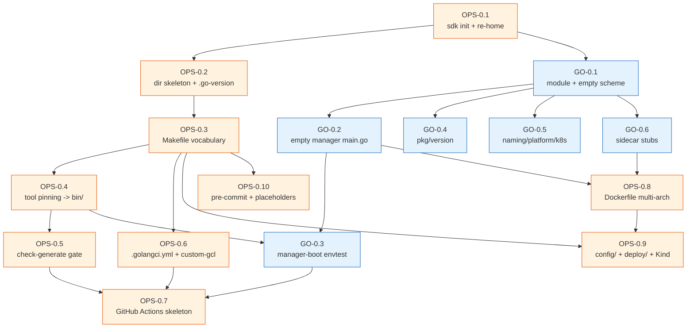

# Phase 0 — Project Bootstrap & Toolchain

> **Milestone M0 (Bootstrap).** DevOps-led, Go-light. This phase scaffolds the
> `percona-valkey-operator` repository in the Percona Operator-SDK trio layout, wires the
> full Makefile target vocabulary and the auto-downloaded codegen toolchain, pins Go 1.26,
> stands up an **empty controller-runtime manager** (no controllers, just healthz / metrics
> / leader election), and turns CI green (build + lint + unit + `check-generate`). It also
> ships the operator `Dockerfile`, `.golangci.yml`, pre-commit hooks, and a Kind-based local
> dev loop. **No CRDs, no controllers, no reconcile logic** — those land in M1+.
>
> Every task below traces to a section of the authoritative architecture docs:
> [02-repo-layout.md](../architecture/02-repo-layout.md),
> [10-distribution-release.md](../architecture/10-distribution-release.md),
> [11-testing-qa.md](../architecture/11-testing-qa.md), and
> [01-decisions.md](../architecture/01-decisions.md). Where the docs are silent on
> something needed to build, it is recorded as an **OPEN QUESTION**, not invented.

---

## 1. Objective & demoable outcome

When Phase 0 is done, the following concretely works, with **zero CRDs and zero
controllers**:

1. `git clone` → `make build` produces the `percona/valkey-operator` manager image from
   `cmd/manager/main.go` via the operator `Dockerfile`
   ([02 §2, §6](../architecture/02-repo-layout.md),
   [10 §2](../architecture/10-distribution-release.md)).
2. The manager binary **boots and stays up**: it serves `/healthz` and `/readyz` on the
   probe address, exposes the controller-runtime metrics endpoint, and (with
   `--leader-elect`) acquires a leader-election `Lease` in its own namespace, logging
   `Starting manager` and then idling because **no controllers are registered**
   ([02 §3 `cmd/manager`](../architecture/02-repo-layout.md);
   leader-election rationale [04 §8](../architecture/04-control-plane.md)).
3. The Percona-family Makefile vocabulary exists and runs:
   `make generate manifests test fmt vet build lint check-generate` all succeed on the
   empty tree; `make help` lists the documented targets
   ([02 §5](../architecture/02-repo-layout.md)).
4. The codegen toolchain (`controller-gen`, `kustomize`, `setup-envtest`, `mockgen`,
   `golangci-lint`, and the OLM `operator-sdk`/`opm` later) **auto-downloads pinned
   versions into `bin/`** (gitignored) on first invocation
   ([02 §4](../architecture/02-repo-layout.md)).
5. `make check-generate` is **green on a clean tree** — the CI gate that will guard every
   later `*_types.go` change is wired and proven against empty input
   ([02 §4](../architecture/02-repo-layout.md), [ADR-011](../architecture/01-decisions.md),
   [11 §6.1](../architecture/11-testing-qa.md)).
6. GitHub Actions runs on PR and is green: `make test` (unit + envtest harness, even with
   no suites yet), `make lint` (golangci-lint v2 with the Go-1.26 enable-list), `make fmt
   vet`, the `check-generate` job, `gosec`, and a multi-arch `docker buildx` build that
   **does not push** on PRs ([11 §6.1](../architecture/11-testing-qa.md),
   [10 §7.1](../architecture/10-distribution-release.md)).
7. A developer can `make deploy` the empty manager onto a Kind cluster and see the pod
   `Running` / `Ready` with leader election held — the local dev loop
   ([02 §5](../architecture/02-repo-layout.md), [11 §7](../architecture/11-testing-qa.md)).

**One-sentence demo:** "Clone the repo, run `make test lint build check-generate` (all
green), `make deploy` onto Kind, and watch the operator pod go `Ready` and grab its
leader-election Lease — with no CRDs and no controllers yet."

---

## 2. Milestone & exit criteria

| # | Exit criterion | Verified by | Arch trace |
|---|----------------|-------------|------------|
| E1 | `go build ./...` and `make build` succeed; module path is `valkey.percona.com/percona-valkey-operator`, Go 1.26 pinned in `.go-version` + `go.mod` | OPS-0.1, GO-0.1 | [02 §2-3](../architecture/02-repo-layout.md) |
| E2 | Empty manager boots, serves `/healthz`+`/readyz`, exposes metrics, and acquires a leader Lease under `--leader-elect`; supports namespaced and cluster-wide (`WATCH_NAMESPACE`) modes | GO-0.2 + envtest manager-boot smoke (GO-0.3) | [02 §3](../architecture/02-repo-layout.md), [04 §8](../architecture/04-control-plane.md) |
| E3 | Full Makefile vocabulary present and runnable: `generate manifests test fmt vet build deploy/undeploy lint check-generate run`; tools auto-download into `bin/` | OPS-0.3, OPS-0.4 | [02 §4-5](../architecture/02-repo-layout.md) |
| E4 | `make check-generate` green on clean tree (CRD/RBAC/deepcopy drift gate operates with empty input) | OPS-0.5 + CI | [02 §4](../architecture/02-repo-layout.md), [11 §6.1](../architecture/11-testing-qa.md) |
| E5 | `.golangci.yml` (v2, the Go-1.26 enable-list) + `.custom-gcl.yml` (logcheck plugin) present; `make lint`/`make lint-config` clean | OPS-0.6 | [11 §6.1](../architecture/11-testing-qa.md) |
| E6 | GitHub Actions green on PR: unit+envtest, lint, fmt, vet, check-generate, gosec, go-mod-tidy, multi-arch buildx (no push on PR) | OPS-0.7 | [10 §7.1](../architecture/10-distribution-release.md), [11 §6.1](../architecture/11-testing-qa.md) |
| E7 | Operator `Dockerfile` builds a distroless `nonroot` multi-arch (`linux/amd64,linux/arm64`) image from `cmd/manager/` | OPS-0.8 | [10 §2](../architecture/10-distribution-release.md) |
| E8 | `pkg/version` embeds `version.txt`, exposes `CompareVersion()`; `pkg/naming` and `pkg/platform` skeletons compile | GO-0.4, GO-0.5 | [02 §3](../architecture/02-repo-layout.md), [ADR-005](../architecture/01-decisions.md) |
| E9 | `make deploy` onto Kind → operator pod `Running`/`Ready`, holds Lease; pre-commit hooks installable | OPS-0.9, OPS-0.10 | [02 §5](../architecture/02-repo-layout.md), [11 §7](../architecture/11-testing-qa.md) |

**Phase is NOT done until** E1–E9 pass in CI and a fresh clone reaches a `Ready` operator
pod on Kind via `make deploy`.

---

## 3. Prerequisites (build-order dependencies)

Phase 0 is the **root of the bottom-up build order** ([01 build-order flowchart, ADR-002](../architecture/01-decisions.md)).
It depends on **no prior phase**. Its only external inputs are the locked tech facts and
the architecture docs:

| Input | Source |
|-------|--------|
| Layout decision (Percona SDK trio `pkg/apis` / `pkg/controller`, **not** kubebuilder `internal/`) | [ADR-002](../architecture/01-decisions.md), [02 §1](../architecture/02-repo-layout.md) |
| Module path `valkey.percona.com/percona-valkey-operator`, Go 1.26 | [02 §3](../architecture/02-repo-layout.md) |
| Makefile target vocabulary + `VERSION` footgun | [02 §5](../architecture/02-repo-layout.md), [10 §1](../architecture/10-distribution-release.md) |
| CI split (Actions = unit+lint+check-generate; Jenkins = e2e) | [10 §7](../architecture/10-distribution-release.md), [11 §6](../architecture/11-testing-qa.md) |
| Generated-vs-handwritten boundary | [02 §4](../architecture/02-repo-layout.md) |

**Provides to downstream phases:** M1 (API) needs the `pkg/apis/valkey/v1alpha1` package
shell, the `config/` kustomize bases, the Makefile `generate`/`manifests`/`check-generate`
targets, and `pkg/version` (for `crVersion` auto-stamping in `CheckNSetDefaults`); M2–M6
controllers need `cmd/manager`'s `AddToManager` fan-out seam, `pkg/naming`, `pkg/k8s`,
`pkg/platform`; M7 (Distribution) reuses the `Dockerfile`, `config/` bases, and the
release-target stubs scaffolded (but not exercised) here.

---

## 4. Scope — In / Out

### In scope (M0)

- Repo scaffold via `operator-sdk init` (domain `valkey.percona.com`, module
  `valkey.percona.com/percona-valkey-operator`) **then re-homed** from kubebuilder
  `api/`+`internal/` into the Percona `pkg/apis` / `pkg/controller` tree
  ([02 §1-2](../architecture/02-repo-layout.md), [ADR-002](../architecture/01-decisions.md)).
- The full directory skeleton of [02 §2](../architecture/02-repo-layout.md) (empty but
  compiling packages, `.gitkeep` where needed).
- The Percona-family Makefile and tool pinning ([02 §4-5](../architecture/02-repo-layout.md)).
- Go 1.26 toolchain pin (`.go-version`, `go.mod`).
- Empty `cmd/manager/main.go`: scheme, healthz/readyz, metrics, leader election,
  namespaced-vs-cluster-wide watch flag, `AddToManager` fan-out seam (empty list).
- Three sidecar `main.go` **stubs** (`cmd/valkey-backup`, `cmd/healthcheck`,
  `cmd/peer-list`) that compile and print usage — the binaries exist so the layout and
  `Dockerfile.sidecar` resolve; their real logic is M4/M5
  ([02 §6](../architecture/02-repo-layout.md)).
- `pkg/version` (`//go:embed version.txt`, `CompareVersion`), `pkg/naming`,
  `pkg/platform`, `pkg/k8s` package shells.
- `.golangci.yml` (v2) + `.custom-gcl.yml`, `.pre-commit-config.yaml`, `hack/boilerplate.go.txt`.
- Operator `Dockerfile` (distroless nonroot, multi-arch); `Dockerfile.sidecar` skeleton.
- GitHub Actions skeleton: `tests.yml`, `lint.yml`, `check-generate.yml`, `scan.yml`,
  `publish.yml` (build-only on PR).
- `config/` kustomize base skeleton (`crd`, `rbac`, `manager`, `default`, `samples`, plus a
  `cluster-wide` overlay) so `make manifests` renders cleanly with no CRDs yet. **Note:** the
  architecture doc [02 §2](../architecture/02-repo-layout.md) enumerates `config/` subdirs as
  `crd, rbac, manager, manifests, network-policy, prometheus, samples, scorecard, default` but
  does **not** name a `config/cluster-wide` overlay — yet [02 §7](../architecture/02-repo-layout.md)
  requires the generated `cw-rbac.yaml`/`cw-operator.yaml`/`cw-bundle.yaml` artifacts. The
  `config/cluster-wide` overlay is the implementation seam that produces those (trio convention);
  `manifests`/`network-policy`/`prometheus`/`scorecard` are scaffolded as empty dirs here and
  populated in M5/M7 (see Out-of-scope).
- `deploy/` placeholder so `make deploy` (kustomize-apply of the empty manager + RBAC)
  works on Kind.
- Kind-based local dev loop docs/scripts (`make deploy`/`undeploy`/`run`).

### Out of scope (deferred to later milestones)

- **All CRD Go types, defaults, CEL** → M1 ([02-phase1-api.md](02-phase1-api.md)).
- **All controllers / reconcile logic** → M2+ (registered via the empty `AddToManager`
  seam scaffolded here).
- **Real sidecar logic** (BGSAVE/ship, health probes, peer discovery) → M4/M5 (only stubs here).
- **OLM bundle/catalog targets** (`make bundle`/`catalog-*`) → fully exercised in M7; M0
  may scaffold the empty target shells but **must not** wire OperatorHub publishing
  ([10 §4](../architecture/10-distribution-release.md)).
- **Helm charts, docs site (`k8svalkey-docs`), `release_versions`, `make release`/`after-release`** → M7
  ([10 §3, §5, §8](../architecture/10-distribution-release.md)).
- **Jenkins / GKE e2e, kuttl suites, `run-*.csv`** → M8 ([11 §3, §6.2](../architecture/11-testing-qa.md)).
- **cert-manager, TLS, NetworkPolicy, PodMonitor bases** beyond empty `config/` dirs → M5.

---

## 5. Go Developer Track

Light track this phase: the only Go is the empty manager, the sidecar stubs, and the
near-leaf `pkg/version` / `pkg/naming` / `pkg/platform` shells. No CRD types
(those are M1). Every file traces to [02 §3, §6](../architecture/02-repo-layout.md).

| id | title | description | files / packages | key types / funcs | depends-on | Definition of Done | tests | effort | risk |
|----|-------|-------------|------------------|-------------------|------------|--------------------|-------|--------|------|
| **GO-0.1** | Module + scheme skeleton | Create `go.mod` (`module valkey.percona.com/percona-valkey-operator`, `go 1.26.0`), `groupversion_info.go` stub registering an **empty** scheme for group `valkey.percona.com/v1alpha1` (no kinds yet), `hack/boilerplate.go.txt`. | `go.mod`, `go.sum`, `pkg/apis/valkey/v1alpha1/groupversion_info.go`, `hack/boilerplate.go.txt` | `GroupVersion`, `SchemeBuilder`, `AddToScheme` (empty) | OPS-0.1, OPS-0.2 | `go build ./...` clean; `AddToScheme` compiles & is callable from `cmd/manager`; module path exact | `go vet ./...`; build smoke | XS (0.5) | Low |
| **GO-0.2** | Empty manager `main.go` | controller-runtime manager bootstrap: register `clientgoscheme` + `v1alpha1.AddToScheme`; flags `--metrics-bind-address`, `--health-probe-bind-address`, `--leader-elect` (**default `true`**, [04 §8](../architecture/04-control-plane.md)); `LeaderElectionID` (DNS-1123 Lease name, namespace via in-cluster detection); healthz `ping` + readyz checks; `WATCH_NAMESPACE` env → `cache.Options.DefaultNamespaces` (empty = cluster-wide); HTTP/2 disabled; structured zap logging; an **empty `addToManagerFuncs` slice** as the controller fan-out seam. **`main()` is a thin shell that parses flags + `GetConfigOrDie()` then calls a testable `newManager(cfg, Options) (manager.Manager, error)` builder** (so GO-0.3 can construct the manager without `os.Exit`/flag parsing). Manager `Start(ctx)` blocks. | `cmd/manager/main.go`, `cmd/manager/manager.go` (the `newManager` builder), `cmd/manager/addtomanager.go` | `main()`, `newManager(cfg, opts)`, `watchNamespaces()`, `addToManagerFuncs []func(manager.Manager) error` | GO-0.1 | Binary boots, idles, serves probes+metrics, takes Lease with `--leader-elect` (default on); honours namespaced vs cluster-wide; `nolint:gocyclo` only on `main` if needed | envtest manager-boot smoke (GO-0.3) | S (1.5) | Medium — leader-election + cache-namespace wiring is the one non-trivial bit ([04 §8](../architecture/04-control-plane.md)) |
| **GO-0.3** | Manager-boot envtest smoke | A Ginkgo/Gomega suite that builds the manager via GO-0.2's `newManager(cfg, opts)` against the `envtest` rest.Config with **no controllers and `LeaderElection:false`** (so the test does not wait out a Lease-acquisition cycle), starts it in a goroutine, asserts `/readyz` returns 200, and asserts `Start` returns nil on context cancel. Gives `make test` a real (tiny) suite so the CI / coverage plumbing is exercised. | `cmd/manager/manager_test.go`, `cmd/manager/suite_test.go` (Ginkgo `TestMain`/`envtest.Environment` setup) | `TestManagerBoots` | GO-0.2, OPS-0.4 (envtest) | `make test` passes; KUBEBUILDER_ASSETS resolved by setup-envtest; coverage tooling emits `cover.out` | this **is** the test | S (1) | Medium — envtest asset download flakiness; mitigate with pinned `ENVTEST_K8S_VERSION` |
| **GO-0.4** | `pkg/version` (embed + CompareVersion) | `//go:embed version.txt` (seed `0.1.0`); `Version()` returns operator semver; `CompareVersion(target string)` parsing `major.minor[.patch]` for `crVersion` gating (used by M1+ `CheckNSetDefaults`); `service/` client **stub** (interface only, no HTTP yet — wired in M6). | `pkg/version/version.txt`, `pkg/version/version.go`, `pkg/version/service/service.go` (interface stub) | `Version() string`, `CompareVersion(string) int`, `type Client interface` | GO-0.1 | Embed compiles; `CompareVersion` table-tested (`1.0`<`1.1`, equal, patch-immaterial); ≥80% pkg coverage | unit table tests `version_test.go` | S (1) | Low |
| **GO-0.5** | `pkg/naming` + `pkg/platform` + `pkg/k8s` shells | `pkg/naming`: label/finalizer key **constants** only (`app.kubernetes.io/*`, `valkey.percona.com/{cluster,shard-index,node-index,component}`, finalizer prefixes from [04 §6](../architecture/04-control-plane.md)) + a `Labels()` helper; **no** name builders yet (those need types → M1). `pkg/platform`: `Detect()` returning `vanilla` (OpenShift detection stubbed, real in M5). `pkg/k8s`: package doc + empty seam. | `pkg/naming/naming.go`, `pkg/platform/platform.go`, `pkg/k8s/k8s.go` | label/finalizer consts, `Labels(...)`, `Detect()` | GO-0.1 | Packages compile; constants match charter exactly; `Labels()` DNS-safe; `naming_test.go` asserts key strings | unit `naming_test.go`, `platform_test.go` | S (1) | Low — keep `pkg/apis` a leaf (no back-imports), enforced in review ([02 §3](../architecture/02-repo-layout.md)) |
| **GO-0.6** | Sidecar `main.go` stubs | Three compiling `main()` stubs that print `not implemented (Phase M4/M5)` and exit non-zero, so `cmd/valkey-backup`, `cmd/healthcheck`, `cmd/peer-list` build and `Dockerfile.sidecar` resolves. No engine logic. | `cmd/valkey-backup/main.go`, `cmd/healthcheck/main.go`, `cmd/peer-list/main.go` | `main()` ×3 | GO-0.1 | All three build; `go vet` clean; documented as stubs in package comment | build smoke only | XS (0.5) | Low |

**Go track total: ~5.5 person-days.** No mutation, errors handled at every boundary,
functions < 50 lines (the only watch item is `main()`'s flag block — kept under control
with helper extraction, `nolint:gocyclo` as last resort, mirroring upstream
`cmd/main.go`).

---

## 6. DevOps / Platform Track

**Heavy track this phase** — Phase 0 is fundamentally a DevOps/platform milestone. Every
task traces to [02-repo-layout.md](../architecture/02-repo-layout.md),
[10-distribution-release.md](../architecture/10-distribution-release.md), or
[11-testing-qa.md](../architecture/11-testing-qa.md).

| id | title | description | files / artifacts | depends-on | Definition of Done | tests / checks | effort | risk |
|----|-------|-------------|-------------------|------------|--------------------|----------------|--------|------|
| **OPS-0.1** | `operator-sdk init` + re-home to Percona layout | Run `operator-sdk init --domain valkey.percona.com --repo valkey.percona.com/percona-valkey-operator`, then **move** scaffold from kubebuilder `api/`+`internal/` into `pkg/apis/valkey/v1alpha1` + `pkg/controller/*` (per [ADR-002](../architecture/01-decisions.md)); rewrite `PROJECT` (`domain: valkey.percona.com`, `repo:` matching). Delete `cmd/main.go`, create `cmd/manager/main.go`. | `PROJECT`, repo root, `cmd/manager/` | — | Tree matches [02 §2](../architecture/02-repo-layout.md); `PROJECT` self-consistent; `go build ./...` clean | layout review checklist | M (2) | Medium — the re-home is the structurally tricky step; do it once, document the delta from stock kubebuilder |
| **OPS-0.2** | Full directory skeleton + `.go-version` + `.gitignore` | Create every dir from [02 §2](../architecture/02-repo-layout.md) (`cmd/*`, `pkg/*`, `config/*`, `deploy/`, `deploy/backup/`, `bundle/`, `e2e-tests/`, `build/`, `hack/`, `.github/workflows/`) with `.gitkeep`/package-doc stubs; `.go-version` = `1.26.x`; `.gitignore` ignoring `bin/`, `cover.out`, build artefacts. | `.go-version`, `.gitignore`, dir tree | OPS-0.1 | All packages compile empty; `bin/` gitignored; tree matches doc 1:1 | `git status` clean after `make`; `go build ./...` | S (1) | Low |
| **OPS-0.3** | Percona-family Makefile | Author the Makefile with the [02 §5](../architecture/02-repo-layout.md) vocabulary: `generate`, `manifests`, `test`, `fmt`, `vet`, `build`, `deploy`/`undeploy`, `run`, `lint`/`lint-config`/`lint-fix`, `help`. **`VERSION ?= $(branch-name)` footgun preserved**, `IMAGE_TAG_OWNER ?= perconalab`, `VERSION_LDFLAGS` embed. Stub (with clear `not-yet: M7` echoes) `release`/`after-release`/`update-version`/`bundle`/`catalog-*` so the vocabulary is complete but not wired. | `Makefile` | OPS-0.2 | `make help` lists targets; `generate manifests fmt vet build` run clean on empty tree; release targets echo a guard, do nothing | `make help`; dry-run each dev target | M (2) | Medium — the `VERSION` footgun and the `manifests`→`deploy/` rerender chain need care ([10 §1, §8](../architecture/10-distribution-release.md)) |
| **OPS-0.4** | Tool pinning into `bin/` | Add Makefile `LOCALBIN`/`bin/` auto-download stanzas (pinned versions) for `controller-gen`, `kustomize`, `setup-envtest`, `mockgen`, `golangci-lint` (and `operator-sdk`/`opm` declared-but-deferred for M7). `ENVTEST_K8S_VERSION` pinned. `bin/` gitignored. | `Makefile` (tool block), `bin/` (gitignored) | OPS-0.3 | First `make test`/`make generate` downloads exact pinned tool versions; second run is a no-op (cached) | `make generate` twice → idempotent; tool versions asserted | S (1.5) | Medium — version pin drift; pin every tool, no `@latest` except the logcheck plugin per upstream `.custom-gcl.yml` |
| **OPS-0.5** | `check-generate` gate | Implement the gate: `make manifests && make generate && git diff --exit-code` (mirrors PG/PS, [02 §4](../architecture/02-repo-layout.md), [11 §6.1](../architecture/11-testing-qa.md)). Wire as a Makefile target and a CI job. On the empty tree it must pass (no drift). | `Makefile` (`check-generate`), `.github/workflows/check-generate.yml` | OPS-0.3, OPS-0.4 | Green on clean tree; goes red if any generated file is hand-edited (proven by a deliberate dirty-edit test in review) | local `make check-generate`; CI job | S (1) | Medium — generated output must be byte-stable across machines; pin `controller-gen` exactly |
| **OPS-0.6** | `.golangci.yml` v2 + `.custom-gcl.yml` + fmt | Port the upstream Go-1.26 enable-list verbatim ([11 §6.1](../architecture/11-testing-qa.md)): `errcheck, govet, staticcheck, revive, gocyclo, dupl, goconst, ineffassign, unused, unparam, unconvert, prealloc, nakedret, lll, misspell, copyloopvar, modernize, ginkgolinter, logcheck, depguard` (forbid `sort` → `slices`); `gofmt`+`goimports` formatters; relax `lll`/`dupl` under `pkg/apis/*`, `goconst` in `_test.go`. `.custom-gcl.yml` builds the logcheck module plugin. | `.golangci.yml`, `.custom-gcl.yml` | OPS-0.2 | `make lint-config` validates config; `make lint` clean on empty tree; custom binary builds | `make lint-config`; `make lint` | S (1) | Low — copy from upstream, adjust `api/*`→`pkg/apis/*` path exclusions |
| **OPS-0.7** | GitHub Actions PR skeleton | Author `tests.yml` (`go mod tidy` clean check + `make test`, coverage ≥80% gate), `lint.yml` (`make lint-config && make lint`, `make fmt vet`), `check-generate.yml`, `scan.yml` (`gosec ./...` + `govulncheck` + Trivy on image), `publish.yml` (multi-arch buildx, **PR = build-only, no push**; push only on `main`/tag → `perconalab/`). reviewdog annotations non-blocking. | `.github/workflows/{tests,lint,check-generate,scan,publish}.yml` | OPS-0.3..0.6, GO-0.2/0.3 | All workflows green on the bootstrap PR; e2e is **absent** (Actions never spins a cluster) | the PR itself is the test | M (2) | Medium — coverage gate must tolerate the tiny initial suite; gosec HIGH-only blocking ([11 §6.1](../architecture/11-testing-qa.md)) |
| **OPS-0.8** | Operator `Dockerfile` (multi-arch distroless) | Distroless `gcr.io/distroless/static:nonroot`, Go 1.26 builder, `TARGETOS`/`TARGETARCH` args, `VERSION_LDFLAGS`, builds `cmd/manager` → `/manager`, `USER 65532:65532`. `.dockerignore`. Also a `Dockerfile.sidecar` skeleton building the three `cmd/*` sidecar stubs into the DB image base (logic in M4/M5). | `Dockerfile`, `Dockerfile.sidecar`, `.dockerignore` | OPS-0.1, GO-0.2, GO-0.6 | Single-arch `make build` (buildx `--load`) produces a locally-runnable image whose `docker run … /manager --help` works; multi-arch `make build PUSH=true --platform linux/amd64,linux/arm64` produces & pushes a manifest list (multi-arch lists cannot `--load` into the local store, so the run-smoke uses the single-arch build) | local buildx single-arch run-smoke + 2-arch build dry-run | S (1.5) | Low — mirror upstream `Dockerfile` ([10 §2](../architecture/10-distribution-release.md)) |
| **OPS-0.9** | `config/` bases + `deploy/` placeholder + Kind dev loop | Minimal kustomize bases: `config/manager` (Deployment with metrics/healthz/leader-elect args, `WATCH_NAMESPACE`, and `POD_NAMESPACE` via the downward API so leader election resolves its namespace off-cluster-safely), `config/rbac` (SA + minimal Role/binding — **no CRD verbs yet, but it MUST grant `coordination.k8s.io` leases create/get/update/list/watch and `""` events create/patch, or leader-election crash-loops the pod**), `config/default` overlay + a cluster-wide overlay, empty `config/crd`/`config/samples`. `make manifests` renders `deploy/operator.yaml`+`deploy/rbac.yaml`+`deploy/bundle.yaml` (and `cw-` variants). `make deploy`/`undeploy` kustomize-apply to current context. Kind setup target/notes. | `config/{manager,rbac,default,cluster-wide,crd,samples}/`, `deploy/*.yaml`, Makefile `deploy`/`undeploy` | OPS-0.3, OPS-0.8 | `make deploy` onto Kind → pod `Running`/`Ready`, holds Lease; `make manifests` rerenders `deploy/` reproducibly | manual Kind deploy; `kubectl rollout status` | M (2) | Medium — namespaced vs cluster-wide (`cw-`) RBAC + `WATCH_NAMESPACE` wiring ([02 §7](../architecture/02-repo-layout.md)) |
| **OPS-0.10** | pre-commit + `Jenkinsfile`/`e2e-tests` placeholders + README | `.pre-commit-config.yaml` (make-generate, go-mod-tidy, make-lint, merge-conflict — port from upstream). Placeholder `Jenkinsfile` (commented GKE stages, real in M8) and `e2e-tests/kuttl.yaml` + empty `tests/`/`run-*.csv` headers so the layout resolves. Bootstrap `README.md` with the `make` quickstart + `VERSION=` footgun warning. | `.pre-commit-config.yaml`, `Jenkinsfile`, `e2e-tests/kuttl.yaml`, `e2e-tests/run-*.csv` (headers), `README.md` | OPS-0.3 | `pre-commit run --all-files` green; `e2e-tests/` layout matches [11 §3.1](../architecture/11-testing-qa.md); README documents the footgun | `pre-commit run --all-files` | S (1.5) | Low |

**DevOps track total: ~16.5 person-days.**

---

## 7. Key technical decisions to honour (with arch-doc citations)

1. **Percona SDK layout, not kubebuilder `internal/`.** `operator-sdk init` is the
   bootstrap convenience, but the scaffold is **re-homed** into `pkg/apis/valkey/v1alpha1`
   + `pkg/controller/<resource>` + `pkg/naming` + `pkg/version` + `cmd/manager` +
   `deploy/`. This is non-negotiable — [ADR-002](../architecture/01-decisions.md),
   [02 §1](../architecture/02-repo-layout.md).
2. **Module path = API group.** `valkey.percona.com/percona-valkey-operator`, **not** a
   `github.com/...` path; Go 1.26 in `.go-version` and `go.mod`
   ([02 §3](../architecture/02-repo-layout.md)).
3. **`pkg/apis` is a leaf.** Even in M0, `pkg/naming`/`pkg/version`/`pkg/platform` must not
   create import cycles back through controllers; the empty scheme keeps `pkg/apis`
   importing only apimachinery ([02 §3 dependency rule, §9](../architecture/02-repo-layout.md)).
4. **The `VERSION` footgun is real from day one.** `VERSION ?= $(branch-name)` and
   `IMAGE_TAG_OWNER ?= perconalab` are deliberately preserved so muscle memory matches the
   trio; the README must warn `Always pass VERSION=x.y.z` even though M0 does not run
   `make release` ([10 §1, §6.1](../architecture/10-distribution-release.md),
   [02 §5](../architecture/02-repo-layout.md)).
5. **`check-generate` discipline is wired before any types exist.** The gate must be green
   on empty input so M1's first `*_types.go` change is immediately guarded — never
   hand-edit generated output ([02 §4](../architecture/02-repo-layout.md),
   [ADR-011](../architecture/01-decisions.md), [11 §6.1](../architecture/11-testing-qa.md)).
6. **GitHub Actions never runs e2e.** PR CI is unit+envtest+lint+check-generate+gosec+buildx
   only; e2e is Jenkins/GKE (M8). M0 only scaffolds the Jenkinsfile placeholder
   ([10 §7](../architecture/10-distribution-release.md), [11 §6](../architecture/11-testing-qa.md)).
7. **Leader election is a single-active-reconciler requirement** and is **ON by default**
   (`--leader-elect=true`), not optional polish — the manager must support it from M0 because
   all stateful Valkey commands (M3+) demand one active reconciler. The production posture is
   `replicas: 2+`; `--leader-elect=false` is only for off-cluster `make run`. The minimal RBAC
   in OPS-0.9 therefore **must** grant `coordination.k8s.io` Lease verbs + events, or the pod
   crash-loops ([04 §8](../architecture/04-control-plane.md)).
8. **Namespaced default, cluster-wide opt-in.** `WATCH_NAMESPACE` empty ⇒ cluster-wide;
   the `config/` bases ship a namespaced `Role` by default with a `cw-` `ClusterRole`
   variant ([02 §7](../architecture/02-repo-layout.md)).
9. **Distroless nonroot multi-arch image** (`linux/amd64,linux/arm64`); `s390x`/`ppc64le`
   are buildx-capable but out of the default GA matrix ([10 §2](../architecture/10-distribution-release.md)).
10. **Sidecar binaries live in the DB image, not the operator image** — only `cmd/manager`
    ships in `percona/valkey-operator`; the three stubs exist for layout/build only in M0
    ([02 §6](../architecture/02-repo-layout.md)).

---

## 8. Illustrative skeletons (DevOps-heavy phase)

These are *illustrative*, grounded in the upstream `valkey-operator` and the trio
conventions cited above — not final code. Exact tool versions are pinned in OPS-0.4.

### 8.1 `cmd/manager/main.go` — empty manager (the only non-trivial Go)

```go
// Package main is the percona/valkey-operator manager entrypoint.
// In M0 it registers NO controllers; it only proves the manager boots,
// serves probes/metrics, and can hold a leader-election Lease.
// Controllers are appended to addToManagerFuncs in M2+.  ([02 §3])
//
// NOTE (per GO-0.2/GO-0.3): in the real implementation the NewManager call below
// is extracted into a testable `newManager(cfg *rest.Config, opts ...) (manager.Manager, error)`
// builder so GO-0.3's envtest smoke can construct the manager from the envtest
// rest.Config without flag parsing or os.Exit. It is inlined here only for
// readability of the illustrative skeleton.
package main

import (
	"crypto/tls"
	"flag"
	"os"
	"strings"

	"go.uber.org/zap/zapcore"
	_ "k8s.io/client-go/plugin/pkg/client/auth"
	"k8s.io/apimachinery/pkg/runtime"
	utilruntime "k8s.io/apimachinery/pkg/util/runtime"
	clientgoscheme "k8s.io/client-go/kubernetes/scheme"
	ctrl "sigs.k8s.io/controller-runtime"
	"sigs.k8s.io/controller-runtime/pkg/cache"
	"sigs.k8s.io/controller-runtime/pkg/healthz"
	crlog "sigs.k8s.io/controller-runtime/pkg/log/zap"
	"sigs.k8s.io/controller-runtime/pkg/manager"
	metricsserver "sigs.k8s.io/controller-runtime/pkg/metrics/server"

	valkeyv1alpha1 "valkey.percona.com/percona-valkey-operator/pkg/apis/valkey/v1alpha1"
)

var (
	scheme   = runtime.NewScheme()
	setupLog = ctrl.Log.WithName("setup")
)

func init() {
	utilruntime.Must(clientgoscheme.AddToScheme(scheme))
	utilruntime.Must(valkeyv1alpha1.AddToScheme(scheme)) // empty in M0
}

// addToManagerFuncs is the controller fan-out seam. EMPTY in M0;
// M2+ append their controller AddToManager funcs here.  ([02 §3, §9])
var addToManagerFuncs []func(manager.Manager) error

func main() {
	var metricsAddr, probeAddr string
	var enableLeaderElection, enableHTTP2 bool
	flag.StringVar(&metricsAddr, "metrics-bind-address", ":8080", "metrics endpoint")
	flag.StringVar(&probeAddr, "health-probe-bind-address", ":8081", "probe endpoint")
	// Leader election defaults to TRUE — the operator's production posture is
	// replicas: 2+ with a single active reconciler ([04 §8]). Pass --leader-elect=false
	// only for single-binary local dev (`make run`).
	flag.BoolVar(&enableLeaderElection, "leader-elect", true,
		"Enable leader election to ensure a single active controller manager.")
	flag.BoolVar(&enableHTTP2, "enable-http2", false, "enable HTTP/2 (off mitigates Rapid Reset CVEs)")
	opts := crlog.Options{Development: true, StacktraceLevel: zapcore.FatalLevel}
	opts.BindFlags(flag.CommandLine)
	flag.Parse()
	ctrl.SetLogger(crlog.New(crlog.UseFlagOptions(&opts)))

	tlsOpts := []func(*tls.Config){}
	if !enableHTTP2 {
		tlsOpts = append(tlsOpts, func(c *tls.Config) { c.NextProtos = []string{"http/1.1"} })
	}

	mgr, err := ctrl.NewManager(ctrl.GetConfigOrDie(), ctrl.Options{
		Scheme:                 scheme,
		Metrics:                metricsserver.Options{BindAddress: metricsAddr, TLSOpts: tlsOpts},
		HealthProbeBindAddress: probeAddr,
		LeaderElection:         enableLeaderElection,
		LeaderElectionID:       "valkey-operator-lock", // Lease name (DNS-1123 label, no dots) ([04 §8])
		// LeaderElectionNamespace left unset → controller-runtime uses the in-cluster
		// namespace (POD_NAMESPACE / serviceaccount file). When running off-cluster via
		// `make run`, leadership is disabled (--leader-elect=false) so this is unset there too.
		Cache: cache.Options{DefaultNamespaces: watchNamespaces()}, // empty => cluster-wide ([02 §7])
	})
	if err != nil {
		setupLog.Error(err, "unable to start manager")
		os.Exit(1)
	}

	for _, add := range addToManagerFuncs { // no-op in M0
		if err := add(mgr); err != nil {
			setupLog.Error(err, "unable to register controller")
			os.Exit(1)
		}
	}

	if err := mgr.AddHealthzCheck("healthz", healthz.Ping); err != nil {
		setupLog.Error(err, "unable to set up health check")
		os.Exit(1)
	}
	if err := mgr.AddReadyzCheck("readyz", healthz.Ping); err != nil {
		setupLog.Error(err, "unable to set up ready check")
		os.Exit(1)
	}

	setupLog.Info("starting manager (no controllers registered — M0 bootstrap)")
	if err := mgr.Start(ctrl.SetupSignalHandler()); err != nil {
		setupLog.Error(err, "manager exited non-zero")
		os.Exit(1)
	}
}

// watchNamespaces reads WATCH_NAMESPACE (comma-separated). Empty => cluster-wide. ([02 §7])
func watchNamespaces() map[string]cache.Config {
	raw := os.Getenv("WATCH_NAMESPACE")
	if raw == "" {
		return nil
	}
	m := map[string]cache.Config{}
	for _, ns := range strings.Split(raw, ",") {
		if ns = strings.TrimSpace(ns); ns != "" {
			m[ns] = cache.Config{}
		}
	}
	return m
}
```

### 8.2 `pkg/version/version.go` — embed + gating (consumed by M1+)

```go
package version

import (
	_ "embed"
	"strconv"
	"strings"
)

//go:embed version.txt
var raw string // seed: "0.1.0"

// Version returns the operator semver from version.txt (single source of truth). ([10 §1])
func Version() string { return strings.TrimSpace(raw) }

// CompareVersion compares the operator major.minor against target "x.y[.z]".
// Returns -1, 0, +1. Used by CheckNSetDefaults / crVersion gating in M1+. ([ADR-005])
func CompareVersion(target string) int {
	aMaj, aMin := majorMinor(Version())
	bMaj, bMin := majorMinor(target)
	switch {
	case aMaj != bMaj:
		return sign(aMaj - bMaj)
	case aMin != bMin:
		return sign(aMin - bMin)
	default:
		return 0 // patch is immaterial to crVersion ([10 §6.1 trap 2])
	}
}

func majorMinor(v string) (int, int) {
	p := strings.SplitN(v, ".", 3)
	maj, _ := strconv.Atoi(p[0])
	mnr := 0 // not `min`: avoids shadowing the Go 1.21+ builtin (predeclared/revive)
	if len(p) > 1 {
		mnr, _ = strconv.Atoi(p[1])
	}
	return maj, mnr
}

func sign(n int) int {
	if n == 0 {
		return 0
	}
	if n < 0 {
		return -1
	}
	return 1
}
```

### 8.3 Makefile — vocabulary + tool pinning + the footgun (excerpt)

```makefile
# Module / image identity
MODULE              := valkey.percona.com/percona-valkey-operator
# VERSION FOOTGUN (preserved from the Percona trio): defaults to the branch name.
# ALWAYS pass VERSION=x.y.z for any release action.  ([10 §1], [02 §5])
VERSION             ?= $(shell git rev-parse --abbrev-ref HEAD | tr '/' '-' | tr -cd 'A-Za-z0-9._-')
IMAGE_TAG_OWNER     ?= perconalab            # GA overrides to percona/
IMG                 ?= $(IMAGE_TAG_OWNER)/valkey-operator:$(VERSION)
ENVTEST_K8S_VERSION ?= 1.34.1

LOCALBIN            ?= $(shell pwd)/bin
CONTROLLER_GEN      ?= $(LOCALBIN)/controller-gen
KUSTOMIZE           ?= $(LOCALBIN)/kustomize
ENVTEST             ?= $(LOCALBIN)/setup-envtest
MOCKGEN             ?= $(LOCALBIN)/mockgen
GOLANGCI_LINT       ?= $(LOCALBIN)/golangci-lint
# Pinned versions (OPS-0.4 fills exact pins):
CONTROLLER_GEN_VERSION ?= v0.x.y
KUSTOMIZE_VERSION      ?= v5.x.y
GOLANGCI_LINT_VERSION  ?= v2.x.y

.PHONY: generate manifests test fmt vet build lint check-generate deploy undeploy run help

generate: controller-gen mockgen ## deepcopy + mocks  ([02 §5])
	$(CONTROLLER_GEN) object:headerFile="hack/boilerplate.go.txt" paths="./pkg/apis/..."

manifests: controller-gen kustomize ## CRD+RBAC -> config/ -> rerender deploy/  ([02 §4-5,§7])
	$(CONTROLLER_GEN) rbac:roleName=valkey-operator crd paths="./..." \
	  output:crd:artifacts:config=config/crd/bases
	# Render the full deploy/ artifact set the architecture doc lists ([02 §2,§7]):
	# crd.yaml, namespaced rbac/operator/bundle, and the cluster-wide (cw-) trio.
	$(KUSTOMIZE) build config/crd          > deploy/crd.yaml
	$(KUSTOMIZE) build config/rbac         > deploy/rbac.yaml
	$(KUSTOMIZE) build config/manager      > deploy/operator.yaml
	$(KUSTOMIZE) build config/default      > deploy/bundle.yaml
	$(KUSTOMIZE) build config/cluster-wide/rbac    > deploy/cw-rbac.yaml
	$(KUSTOMIZE) build config/cluster-wide/manager > deploy/cw-operator.yaml
	$(KUSTOMIZE) build config/cluster-wide > deploy/cw-bundle.yaml

test: manifests generate fmt vet envtest ## unit + envtest, coverage  ([11 §6.1])
	KUBEBUILDER_ASSETS="$$($(ENVTEST) use $(ENVTEST_K8S_VERSION) -p path)" \
	  go test $$(go list ./... | grep -v /e2e) -coverprofile cover.out

check-generate: manifests generate ## CRD/deepcopy/RBAC drift gate  ([02 §4])
	@git diff --exit-code || (echo "generated artifacts are stale — run make generate manifests"; exit 1)

# Multi-arch manifest lists cannot load into the local docker image store, so the
# multi-platform build only runs when PUSH=true (CI on main/tag). Local `make build`
# builds a single-arch image with --load so `docker run … /manager --help` works.  ([10 §2])
PLATFORMS ?= linux/amd64,linux/arm64
build: generate ## build operator image  ([10 §2])
ifeq ($(PUSH),true)
	docker buildx build --platform $(PLATFORMS) --push -t $(IMG) .
else
	docker buildx build --load -t $(IMG) .
endif

deploy: manifests kustomize ## apply empty manager to current kube-context  ([02 §5])
	$(KUSTOMIZE) build config/default | kubectl apply --server-side -f -

# M7-only — present so the vocabulary is complete; guarded so M0 cannot misfire.  ([10 §8])
release after-release update-version bundle catalog-build catalog-push:
	@echo "[$@] not wired until M7 (Distribution). Pass VERSION=x.y.z when implemented."; exit 1
```

### 8.4 GitHub Actions — `check-generate.yml` (the load-bearing gate)

```yaml
name: check-generate
on: { pull_request: {}, push: { branches: [main] } }
jobs:
  check-generate:
    runs-on: ubuntu-latest
    steps:
      - uses: actions/checkout@v4
      - uses: actions/setup-go@v5
        with: { go-version-file: .go-version }
      - run: make manifests generate
      - run: git diff --exit-code   # fails if CRDs/deepcopy/RBAC drift  ([02 §4], [11 §6.1])
```

---

## 9. Test plan

Phase 0 has no business logic, so testing focuses on **plumbing correctness** and proving
the gates work before any types exist.

### Unit (table-driven, `go test`)

- `pkg/version/version_test.go` — `CompareVersion` ordering: `1.0 < 1.1`, equality,
  patch-immateriality (`1.1.0` vs `1.1.7` ⇒ equal at major.minor), and `Version()` reads
  the embed. **Target ≥80% on `pkg/version`** ([11 §1](../architecture/11-testing-qa.md)).
- `pkg/naming/naming_test.go` — label/finalizer constant strings match the charter
  (`valkey.percona.com/{cluster,shard-index,node-index,component}`, finalizer prefixes from
  [04 §6](../architecture/04-control-plane.md)); `Labels()` output is DNS-safe.
- `pkg/platform/platform_test.go` — `Detect()` returns `vanilla` in a non-OpenShift env.

### Integration (envtest, Ginkgo/Gomega)

- `cmd/manager` manager-boot smoke (GO-0.3): start the manager against `envtest` with
  **no controllers**, assert `/readyz` 200 and clean shutdown on context cancel. This is
  the canary that `setup-envtest`, `KUBEBUILDER_ASSETS`, scheme registration, and the
  coverage harness all work — the exact plumbing every M1+ controller suite reuses
  ([11 §2.1](../architecture/11-testing-qa.md)).
- Coverage: `make test` emits `cover.out`; the CI gate is ≥80% on `pkg/...`, **excluding**
  `zz_generated.deepcopy.go` (none yet), `cmd/`, and `test/` per
  [11 §1](../architecture/11-testing-qa.md). With only `pkg/version`/`pkg/naming`/
  `pkg/platform` carrying logic, this is easily met.

### CI gates (the real Phase-0 deliverable)

- `make check-generate` green on a clean tree, and **deliberately red** when a generated
  file is hand-edited (proven once in review) — [02 §4](../architecture/02-repo-layout.md).
- `make lint` / `make lint-config` clean with the v2 enable-list + logcheck plugin.
- `gofmt -s -l .` empty; `goimports` clean; `go vet ./...` clean; `go mod tidy` no-op.
- `gosec ./...` no HIGH findings; `govulncheck` advisory.
- `docker buildx` 2-arch build succeeds on PR (build-only, **no `--load`, no push** — a
  multi-arch manifest list cannot load into the local docker store; the local run-smoke
  uses a single-arch `--load` build, see OPS-0.8).

### kuttl / e2e

**None in M0.** The `e2e-tests/kuttl.yaml` + `run-*.csv` headers and the `repro-K8SVK-<n>/`
harness convention are scaffolded ([11 §3, §7](../architecture/11-testing-qa.md)) but the
first real kuttl case (`init-cluster`) needs a working cluster controller (M3); the
matrix and Jenkins wiring land in M8. The Kind `make deploy` of the empty manager is a
**manual smoke**, not an automated e2e.

---

## 10. Risks & mitigations

| # | Risk | Severity | Mitigation | Trace |
|---|------|----------|------------|-------|
| R1 | **`operator-sdk init` → Percona re-home drift** — half-kubebuilder, half-Percona layout that confuses M1+ codegen paths. | HIGH | Do the re-home once in OPS-0.1, document the delta from stock kubebuilder, lock the tree against [02 §2](../architecture/02-repo-layout.md) in review; keep upstream `valkey-operator` as a porting reference only. | [ADR-002](../architecture/01-decisions.md), [02 §1](../architecture/02-repo-layout.md) |
| R2 | **`check-generate` non-determinism** — `controller-gen`/`kustomize` emit byte-different output on different machines/versions, making the gate flap. | HIGH | Pin every tool version exactly in `bin/` (OPS-0.4); CI uses the same pins; run the gate in the bootstrap PR to prove stability before M1. | [02 §4](../architecture/02-repo-layout.md), [11 §6.1](../architecture/11-testing-qa.md) |
| R3 | **`VERSION`-defaults-to-branch footgun** fires accidentally (e.g. `make build` on a feature branch tags `:my-feature`). | MEDIUM | README warning + Makefile comment; release targets stubbed to refuse without `VERSION=` until M7; CI publish only on `main`/tag. | [10 §1, §6.1](../architecture/10-distribution-release.md) |
| R4 | **Coverage gate too strict for the tiny initial suite** — the 80% gate fails because there's little code. | MEDIUM | Coverage measured on `pkg/...` only (excludes `cmd/`, generated, `test/`); the small `pkg/version`/`naming`/`platform` logic is fully testable, so 80% is reachable; if needed, gate keyed to packages-with-code. | [11 §1, §6.1](../architecture/11-testing-qa.md) |
| R5 | **envtest asset download flakiness** in CI (network to k8s release artifacts). | MEDIUM | Pin `ENVTEST_K8S_VERSION`; cache `bin/` in Actions; `setup-envtest` retries; the manager-boot smoke is the only consumer in M0. | [11 §2.1](../architecture/11-testing-qa.md) |
| R6 | **`pkg/apis` leaf-rule violation** — a helper in `pkg/naming`/`pkg/version` imports a controller, creating a cycle that bites in M1. | MEDIUM | Enforce the [02 §3](../architecture/02-repo-layout.md) dependency rule in review from day one; `pkg/apis` imports only apimachinery; keep `pkg/naming` constants type-free until M1 adds builders. | [02 §3, §9](../architecture/02-repo-layout.md) |
| R7 | **Leader-election / cache-namespace misconfig** — manager boots but can't serve namespaced vs cluster-wide correctly, surfacing only in M3. | MEDIUM | Cover both modes in the GO-0.3 smoke (set/unset `WATCH_NAMESPACE`); ship `cw-` RBAC variant in OPS-0.9; document `LeaderElectionID` Lease placement. | [04 §8](../architecture/04-control-plane.md), [02 §7](../architecture/02-repo-layout.md) |
| R8 | **golangci-lint v2 custom-plugin build (logcheck) breaks CI** — `.custom-gcl.yml` builds a custom binary that can fail on toolchain mismatch. | LOW | Port upstream `.custom-gcl.yml` verbatim, pin the golangci-lint version, run `make lint-config` in CI before `make lint`. | [11 §6.1](../architecture/11-testing-qa.md) |
| R9 | **Multi-arch buildx unavailable** on a runner (no QEMU/buildx). | LOW | Set up `docker/setup-buildx-action` + `setup-qemu-action` in `publish.yml`; allow single-arch local builds for dev. | [10 §2](../architecture/10-distribution-release.md) |

---

## 10a. Open questions (docs silent — resolved provisionally, confirm before M1 freeze)

Per the charter, items the architecture docs do not specify are flagged here rather than
silently invented. Each carries the provisional choice this phase makes and what to confirm.

| # | Open question | Provisional choice in this plan | Why it is open / what to confirm |
|---|---------------|--------------------------------|----------------------------------|
| OQ1 | **Workflow filename: `test.yml` vs `tests.yml`.** [02 §2](../architecture/02-repo-layout.md) tree shows `test.yml`; [10 §7.1](../architecture/10-distribution-release.md) and [11 §6.1](../architecture/11-testing-qa.md) tables show `tests.yml`. | `tests.yml` (follows the authoritative CI/CD section [10 §7.1]). | Internal doc inconsistency. Pick one and align all three docs in M0; cheap to change. |
| OQ2 | **Exact pinned tool versions** (`controller-gen`, `kustomize`, `golangci-lint` v2, `setup-envtest`, `mockgen`, `opm`, `operator-sdk`). Docs say "pinned" but give no numbers; the Makefile excerpt shows `v0.x.y` placeholders. | OPS-0.4 fills real pins (controller-gen ≥ v0.16, kustomize v5.x, golangci-lint v2.x) by porting the upstream `valkey-operator` / Percona-trio versions. | Docs are silent on the numbers; the byte-stability of `check-generate` (R2) depends on the exact `controller-gen`/`kustomize` pins. Lock from upstream before M1. |
| OQ3 | **`config/cluster-wide` overlay shape.** [02 §2](../architecture/02-repo-layout.md) does not list a `config/cluster-wide` dir, but [02 §7](../architecture/02-repo-layout.md) requires `cw-rbac.yaml`/`cw-operator.yaml`/`cw-bundle.yaml`. | A `config/cluster-wide/{rbac,manager}` overlay set produces the `cw-*` artifacts (trio convention). | Confirm the overlay layout against a trio repo (PS) so M5/M7 RBAC additions slot in cleanly. |
| OQ4 | **`ENVTEST_K8S_VERSION` and `CERT_MANAGER_VER` pins.** [11 §2.1](../architecture/11-testing-qa.md) uses `1.34.1` and [11 §7.2](../architecture/11-testing-qa.md) uses `v1.16.2` only in examples, not as locked values. | `ENVTEST_K8S_VERSION ?= 1.34.1`; repro harness `CERT_MANAGER_VER ?= v1.16.2`. | Examples, not mandates; confirm against the Kubernetes/cert-manager support window at M0 freeze. |
| OQ5 | **Whether M0 scaffolds empty `make bundle`/`catalog-*` shells at all.** Out-of-scope says M0 "may scaffold the empty target shells but must not wire OperatorHub publishing"; OPS-0.3 stubs them with a guard. | Stub `bundle`/`catalog-build`/`catalog-push` alongside `release`/`after-release` as guarded no-ops so the vocabulary is complete. | "may" is discretionary; confirm the team wants the OLM shells present in M0 vs deferred entirely to M7. |

---

## 11. Effort summary (rollup)

| Track | Tasks | Person-days |
|-------|-------|-------------|
| **Go Developer** | GO-0.1 … GO-0.6 | **~5.5** |
| **DevOps / Platform** | OPS-0.1 … OPS-0.10 | **~16.5** |
| **Phase 0 total** | 16 tasks | **~22 person-days** |

Per-task effort (XS≈0.5, S≈1–1.5, M≈2, L≈3–4, XL≈5+ person-days):

- **GO:** GO-0.1 XS(0.5), GO-0.2 S(1.5), GO-0.3 S(1), GO-0.4 S(1), GO-0.5 S(1), GO-0.6 XS(0.5).
- **OPS:** OPS-0.1 M(2), OPS-0.2 S(1), OPS-0.3 M(2), OPS-0.4 S(1.5), OPS-0.5 S(1), OPS-0.6 S(1),
  OPS-0.7 M(2), OPS-0.8 S(1.5), OPS-0.9 M(2), OPS-0.10 S(1.5).

Critical path (≈ 6–7 working days with two engineers in parallel): **OPS-0.1 → OPS-0.2 →
OPS-0.3 → OPS-0.4 → OPS-0.5 / OPS-0.6 → OPS-0.7**, with the Go track (GO-0.1 → GO-0.2 →
GO-0.3) running in parallel after OPS-0.2 and rejoining at OPS-0.7 (CI needs the manager +
its smoke test). OPS-0.8 / 0.9 / 0.10 finish alongside.

### Phase-0 task dependency graph



### Phase-0 mini-Gantt

```mermaid
gantt
    title Phase 0 — Bootstrap (≈6-7 working days, 2 engineers)
    dateFormat  D
    axisFormat  d%d
    section DevOps
    OPS-0.1 sdk init + re-home         :ops1, 0, 2d
    OPS-0.2 dir skeleton               :ops2, after ops1, 1d
    OPS-0.3 Makefile                   :ops3, after ops2, 2d
    OPS-0.4 tool pinning               :ops4, after ops3, 1d
    OPS-0.5 check-generate             :ops5, after ops4, 1d
    OPS-0.6 golangci + custom-gcl      :ops6, after ops3, 1d
    OPS-0.10 pre-commit + placeholders :ops10, after ops3, 1d
    OPS-0.8 Dockerfile (needs GO-0.2/0.6) :ops8, after go2 go6, 1d
    OPS-0.9 config/deploy/Kind         :ops9, after ops8, 2d
    OPS-0.7 GitHub Actions             :ops7, after ops5 go3, 2d
    section Go
    GO-0.1 module + scheme             :go1, after ops2, 1d
    GO-0.2 empty manager               :go2, after go1, 1d
    GO-0.4 pkg/version                 :go4, after go1, 1d
    GO-0.5 naming/platform/k8s         :go5, after go1, 1d
    GO-0.6 sidecar stubs               :go6, after go1, 1d
    GO-0.3 manager-boot envtest        :go3, after go2 ops4, 1d
```



---

## 12. References

- [../architecture/01-decisions.md](../architecture/01-decisions.md) — ADR-002 (SDK layout),
  ADR-005 (`crVersion`/version axes), ADR-010 (distribution), ADR-011 (kuttl+envtest, `check-generate`).
- [../architecture/02-repo-layout.md](../architecture/02-repo-layout.md) — §1 layout rationale,
  §2 directory tree, §3 module path + package responsibilities + dependency rule, §4
  generated-vs-handwritten boundary + toolchain, §5 Makefile vocabulary + `VERSION` footgun,
  §6 sidecar binaries, §7 namespaced vs cluster-wide `deploy/`, §9 dependency graph.
- [../architecture/04-control-plane.md](../architecture/04-control-plane.md) — §8 leader
  election & operator HA (informs the empty manager's leader-election wiring); §6
  finalizer prefixes (consumed by `pkg/naming` constants).
- [../architecture/10-distribution-release.md](../architecture/10-distribution-release.md) —
  §1 two version axes + `VERSION` footgun, §2 images (operator `Dockerfile`, multi-arch,
  registry split), §7 CI/CD split (Actions vs Jenkins), §8 release workflow (stubbed in M0).
- [../architecture/11-testing-qa.md](../architecture/11-testing-qa.md) — §1 pyramid +
  coverage target, §2 unit/envtest layout, §6 CI gates (`golangci-lint` enable-list, `gosec`,
  `check-generate`), §7 Kind repro harness convention.
- [02-phase1-api.md](02-phase1-api.md) — the immediate downstream consumer of this phase's
  `pkg/apis` shell, `config/` bases, and codegen targets.
