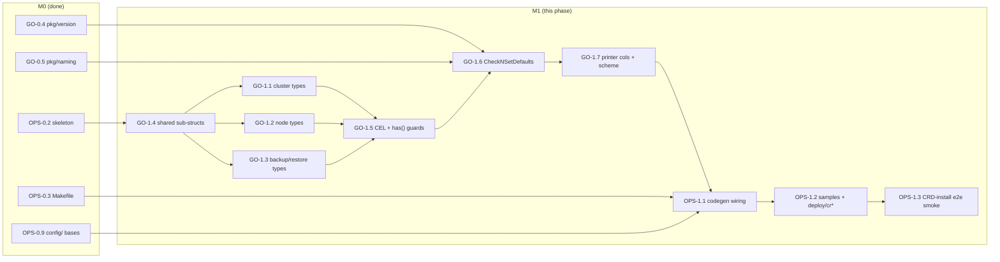
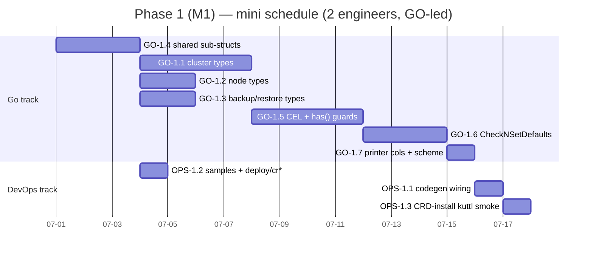

# Phase 1 — API & CRD Layer

> **Milestone:** M1 API · **Lead track:** Go Developer · **DevOps track:** light (codegen wiring + CRD-install smoke)
>
> **One-line goal:** define the four `valkey.percona.com/v1alpha1` CRD Go types
> (`PerconaValkeyCluster`, `ValkeyNode`, `PerconaValkeyBackup`, `PerconaValkeyRestore`) with every
> spec/status field, CEL `XValidation` immutability rules (with `has()` guards), `kubebuilder:default`
> markers, printer columns and the `CheckNSetDefaults` receiver — then regenerate deepcopy/CRD/RBAC
> cleanly so all four CRDs **install** into a kind cluster, accept the §11 sample CRs, and reject the
> immutability-violating mutations. **No controllers yet.**

This is the second phase of the implementation plan. Every task traces to a section of the
authoritative architecture docs (`docs/architecture/NN-*.md`); where the docs are silent on a
build detail, it is recorded as an **OPEN QUESTION** rather than invented. The locked tech facts
(Go 1.26; API group `valkey.percona.com`, version `v1alpha1`; the four kinds with short names
`pvk`/`vkn`/`pvk-backup`/`pvk-restore`; the `pkg/apis/valkey/v1alpha1` layout; CEL + `CheckNSetDefaults`
with no core webhook; `crVersion` gating) are taken from the Charter and confirmed against
[../architecture/03-api-design.md](../architecture/03-api-design.md) and
[../architecture/01-decisions.md](../architecture/01-decisions.md) (ADR-001, ADR-003, ADR-006).

> **Trace anchor.** This phase implements the API surface specified in
> [../architecture/03-api-design.md](../architecture/03-api-design.md) §§1–11 in full, plus the
> defaulting strategy (§5), the immutability/CEL contract (§4), printer columns (§9) and the
> parent↔node contract (§6). Behaviour that *consumes* these fields (reconcile pipelines, slot
> planning, ACL rendering) is **out of scope** here — it lands in M2 (`ValkeyNode`) and M3 (Cluster).

---

## 1. Objective & demoable outcome

When Phase 1 is done, a clone with the M1 changes supports this exact loop:

```bash
make generate          # controller-gen object → zz_generated.deepcopy.go for all 4 kinds
make manifests         # controller-gen crd,rbac + kustomize → deploy/crd.yaml, deploy/bundle.yaml, deploy/cw-bundle.yaml
make check-generate    # generate + manifests idempotent → clean git diff
make test              # envtest: install the CRDs, apply samples, assert defaults + CEL rejections

# kind smoke (CRD install only, no controllers running):
kubectl apply -f deploy/crd.yaml
kubectl get crd | grep valkey.percona.com           # 4 CRDs Established
kubectl apply -f deploy/cr-minimal.yaml             # §11.1 minimal cache cluster accepted
kubectl explain perconavalkeycluster.spec.mode      # field docs render from Go comments
kubectl get pvk,vkn,pvk-backup,pvk-restore          # short names resolve
```

**Concretely working at end of phase:**

- **Four CRDs install and reach `Established`.** `pkg/apis/valkey/v1alpha1/*_types.go` define
  `PerconaValkeyCluster`/`ValkeyNode`/`PerconaValkeyBackup`/`PerconaValkeyRestore` with every field
  catalogued in [03 §§2–8](../architecture/03-api-design.md), generating valid OpenAPI v3 schemas.
- **Defaults apply.** A minimal cache cluster (§11.1) applies with no persistence/TLS/backup fields
  and the API server fills `mode=cluster`, `workloadType=StatefulSet`, `exporter.enabled=true`,
  `podDisruptionBudget=Managed`, `users[].enabled=true`, `persistence.reclaimPolicy=Retain` (marker
  defaults, [03 §5](../architecture/03-api-design.md)).
- **CEL immutability bites.** Applying then editing `spec.mode`, `spec.workloadType`, removing/adding
  `persistence`, shrinking `persistence.size`, or changing `persistence.storageClassName` is rejected
  by the API server with the [03 §4.1](../architecture/03-api-design.md) messages — **with no
  operator running** (CEL is server-side). Disabled optional components (no persistence/tls/backup)
  apply cleanly thanks to `has()` guards ([03 §4.2](../architecture/03-api-design.md)).
- **`CheckNSetDefaults` exists and is unit-tested.** The
  `pkg/apis/valkey/v1alpha1/perconavalkeycluster_defaults.go` receiver stamps `crVersion` to the
  operator `major.minor`, resolves `image`/`backup.image`, validates `backup.schedule[].storageName`
  against `backup.storages`, derives `users[].passwordSecret.name`, and sets probe defaults — exercised
  by unit tests though **not yet called by a reconciler** ([03 §5](../architecture/03-api-design.md)).
- **Printer columns & short names** resolve (`kubectl get pvk` shows `State/Reason/Shards/Ready/Age`;
  `vkn` shows `Ready/Role/Pod/IP/Age`; etc., [03 §9](../architecture/03-api-design.md)).
- **Sample CRs ship** under `config/samples/` and `deploy/cr*.yaml` (minimal + full + backup + restore,
  [03 §11](../architecture/03-api-design.md)) and are validated in CI by a CRD-install smoke.
- **CI is green and `check-generate` is now load-bearing:** the coverage gate (advisory in M0) is
  flipped **hard at 80%** for `pkg/apis/valkey/v1alpha1` now that there is real code to cover.

The demo: install four CRDs into an empty cluster, apply the samples, watch the API server enforce
the immutability contract — all before a single controller exists. That is the M1 contract — a
**validated, installable API** the M2 node controller can build on.

---

## 2. Milestone & exit criteria

**Milestone:** M1 API — "four CRDs install; CEL/defaults/generation work; no controllers yet."

**Exit criteria (all must hold):**

| # | Criterion | Verified by | Trace |
|---|-----------|-------------|-------|
| E1 | All four `*_types.go` compile; `go build ./...` clean | local + CI | 03 §§2–8; ADR-002 |
| E2 | `make generate` emits `zz_generated.deepcopy.go` for all 4 kinds + nested structs; no hand-edits | CI `check-generate` | 02 §4; 03 §5 |
| E3 | `make manifests` renders `deploy/crd.yaml` (4 CRDs), `deploy/bundle.yaml`, `deploy/cw-bundle.yaml` with CRDs included | CI `check-generate` | ADR-010; 03 §1 |
| E4 | `kubectl apply -f deploy/crd.yaml` → 4 CRDs reach `Established=True`; short names `pvk/vkn/pvk-backup/pvk-restore` resolve | kind smoke + envtest | 03 §1, §9; ADR-003 |
| E5 | §11.1 minimal cluster applies with marker defaults filled; `has()` guards permit absent persistence/tls/backup | envtest | 03 §4.2, §5, §11.1 |
| E6 | §11.2 full cluster applies; §11.3 backup + §11.4 restore apply against it | envtest + kind smoke | 03 §11 |
| E7 | CEL rejects: mode change, workloadType change, persistence add/remove, size shrink, storageClassName change, non-cluster `shards!=1`, `persistence`+`Deployment`, `users[].name` starting `_` | envtest negative tests | 03 §4.1, §4.3, §2.7 |
| E8 | `CheckNSetDefaults(ctx, platform)` stamps `crVersion`, resolves images, validates `storageName`, derives secret names; unit-tested | unit (`*_defaults_test.go`) | 03 §5; ADR-005 |
| E9 | `PerconaValkeyRestore` CEL enforces `backupName` **xor** `backupSource` | envtest negative test | 03 §8.1 |
| E10 | Printer columns render for all four kinds (incl. priority-1 `-o wide` columns) | kind smoke | 03 §9 |
| E11 | `make check-generate` clean diff; coverage gate **hard 80%** on `pkg/apis/valkey/v1alpha1` | CI | 02 §4; 11 §6.1; Charter DoD |
| E12 | `gosec`/`golangci-lint`/`gofmt`/`go vet` clean on the new package | CI | Charter DoD baseline |

**Out of M1 (deferred):** any reconcile logic (M2+), `pkg/valkey` domain (config render / slot plan /
ACL render — M2/M3), the conversion webhook & `v1` hub (M6, [03 §10](../architecture/03-api-design.md)),
the version-service client (M6), Helm/OLM packaging of the CRDs (M7). M1 produces *types + generated
artifacts + samples*, not behaviour.

> **Webhook scope note.** [03 §4](../architecture/03-api-design.md) and ADR-008/ADR-009 state the
> *only* webhook is the optional TLS/conversion path, deferred to M6. M1 therefore ships **zero**
> webhooks — all core validation is CEL `XValidation` (server-side) plus the runtime
> `CheckNSetDefaults` pass (which a controller invokes later). This is a deliberate non-goal, not an
> omission.

---

## 3. Prerequisites

**Depends on Phase 0 (M0) only.** The critical-path inputs:

| Phase-0 task | Why M1 needs it |
|--------------|-----------------|
| **OPS-0.2** (directory skeleton) | `pkg/apis/valkey/v1alpha1/` package dir must already exist with `doc.go`/`groupversion_info.go` placeholders so M1 only *adds files*. |
| **OPS-0.3** (Makefile dev/build/test) | `make generate` (controller-gen object), `make manifests` (controller-gen crd,rbac + kustomize), `make test` (envtest) targets must work — M1 is the first phase that produces non-trivial output from them. |
| **OPS-0.4** (tool pinning into `bin/`) | pinned `controller-gen`, `kustomize`, `setup-envtest`, `mockgen`, `golangci-lint` in `bin/` (Phase-0 task OPS-0.4 — *not* OPS-0.5, which is the `check-generate` gate). |
| **OPS-0.5** (`check-generate` gate) | the `make manifests && make generate && git diff --exit-code` gate (Makefile target + CI job) already exists; M1 is the first phase where it has real generated output to police. |
| **OPS-0.7** (GitHub Actions CI) | `tests.yml` (incl. coverage gate), `lint.yml`, `check-generate.yml`, `scan.yml` jobs exist; M1 flips the coverage gate from advisory to hard for `pkg/apis/...`. (Phase-0 task OPS-0.7 — *not* OPS-0.10, which is pre-commit + Jenkinsfile + e2e placeholders + README.) |
| **OPS-0.9** (`config/` kustomize bases + `deploy/` placeholders) | `config/crd/` and `config/samples/` bases (empty in M0) are now populated; `make manifests` must fold the generated CRD bases into `deploy/bundle.yaml`/`cw-bundle.yaml`. |
| **OPS-0.10** (`e2e-tests/` placeholders) | `e2e-tests/kuttl.yaml` + empty `tests/`/`run-*.csv` headers exist so OPS-1.3 only *adds* a suite directory and CSV rows. |
| **GO-0.1 / GO-0.2** (empty manager, scheme reg) | `cmd/manager/main.go` registers the scheme; M1 adds `SchemeBuilder.Register(...)` for the new types so the existing `AddToScheme` serves them later — but registers **no reconcilers**. |
| **GO-0.4** (`pkg/version` embed + `CompareVersion`) | `CheckNSetDefaults` calls `version.Version()` (to derive the operator `major.minor`) and `cr.CompareVersion(...)` to auto-stamp `crVersion`. GO-0.4 ships `Version()` + `CompareVersion()`; M1 adds any small `major.minor`/default-image helpers it needs to `pkg/version` (see OQ-1.3 on the `pkg/apis`-leaf import rule). Full version-service work is M6. |
| **GO-0.5** (`pkg/naming` + `pkg/platform` skeletons) | M1 adds the name *builders* the API layer needs (`pkg/naming` currently has constants + `Labels()` only; GO-0.5 deliberately defers builders to "when types exist" = M1). `CheckNSetDefaults` derives `users[].passwordSecret.name = <cluster>-users`; whether this calls `pkg/naming` or an inline format depends on the leaf-import resolution in **OQ-1.3**. `pkg/platform.Detect()` supplies the `platform` argument. |

**Every later phase depends on M1**: M2 (`ValkeyNode` controller) consumes `ValkeyNodeSpec`/`Status`;
M3 (Cluster controller) consumes `PerconaValkeyClusterSpec` + calls `CheckNSetDefaults`; M4 consumes
`PerconaValkeyBackup`/`Restore`; M6 graduates the API to `v1` via a conversion webhook; M7 packages
the CRDs into Helm/OLM. The API is the bottom of the strictly bottom-up build order (Charter BUILD ORDER).



---

## 4. Scope — In / Out

### In scope

- `pkg/apis/valkey/v1alpha1/perconavalkeycluster_types.go` — `PerconaValkeyClusterSpec`/`Status`
  with all field groups of [03 §2–§3](../architecture/03-api-design.md): identity/version, topology,
  scheduling, storage, engine config, users (ACL), tls, exporter, pdb, backup, upgradeOptions; status
  (`state`/`reason`/`message`/`host`/`shards`/`readyShards`/`observedGeneration`/`conditions`).
- `pkg/apis/valkey/v1alpha1/valkeynode_types.go` — `ValkeyNodeSpec`/`Status` per the parent↔node
  contract ([03 §6](../architecture/03-api-design.md)); internal-only kubebuilder doc-comment.
- `pkg/apis/valkey/v1alpha1/perconavalkeybackup_types.go` and `perconavalkeyrestore_types.go`
  ([03 §7, §8](../architecture/03-api-design.md)).
- `pkg/apis/valkey/v1alpha1/shared_types.go` — `PersistenceSpec`, `TLSConfig`, `UserAclSpec`,
  `ExporterSpec`, `BackupSpec`/`BackupStorageSpec`(+`S3`/`GCS`/`Azure`), `BackupScheduleSpec`,
  `BackupRetentionSpec`, `BackupContainerOptions`, `UpgradeOptions`, `BackupSource`, `ShardBackupStatus`.
- CEL `XValidation` markers ([03 §4.1](../architecture/03-api-design.md)) — the 7 cluster-level rules,
  field-level `workloadType` immutability, restore `backupName`-xor-`backupSource`, `users[].name`
  `!startsWith('_')`, the `commands` item regex, with `has()`-guard discipline ([03 §4.2](../architecture/03-api-design.md)).
- `kubebuilder:default` markers + `*_defaults.go` (`CheckNSetDefaults` receiver) ([03 §5](../architecture/03-api-design.md)).
- Printer-column + short-name + `subresource:status` + `resource:scope=Namespaced` markers
  ([03 §9](../architecture/03-api-design.md)).
- `groupversion_info.go` `AddToScheme` registration of all four kinds (so the M0 manager scheme
  knows them — still no reconcilers).
- `make generate`/`manifests` wiring for the new types; `deploy/crd.yaml`, `bundle.yaml`,
  `cw-bundle.yaml` regenerated to carry the CRDs.
- Sample CRs (`config/samples/*.yaml`, `deploy/cr.yaml`, `deploy/cr-minimal.yaml`, `deploy/backup.yaml`,
  `deploy/restore.yaml`) per [03 §11](../architecture/03-api-design.md).
- envtest suite that installs the CRDs and asserts defaults/CEL; CRD-install kuttl/kind smoke.

### Out of scope (explicit)

- Any controller / reconcile logic, `add_*.go` watch wiring (→ **M2/M3/M4**).
- `pkg/valkey` domain (config render, `serverConfigHash`, slot plan, ACL render) — M1 declares the
  *fields* (`serverConfigHash`, `aclSecretName`, `config`) but does **not** compute/render them (M2/M3).
- Conversion webhook, `v1` hub, storage-version flip ([03 §10](../architecture/03-api-design.md)) → **M6**.
- Version-service client and smart-update gating (only the `crVersion` auto-stamp + `CompareVersion`
  scaffolding needed for defaulting is in M1) → **M6**.
- Helm `crds/` sync, OLM bundle CSV CRD embedding → **M7**.
- Metrics/exporter wiring; **controller RBAC** — `+kubebuilder:rbac` markers belong on the controller
  packages (a *controller* concern per 02 §3) and land in **M2/M3** when those controllers exist; M1
  ships **no** RBAC markers (no controller to scope a Role to) and leaves `config/rbac/role.yaml` at the
  M0 minimal Role. M1's codegen output is CRDs + deepcopy + samples only.

---

## 5. Go Developer Track

> This phase is **Go-dominated**. Tasks GO-1.1…GO-1.7 implement the entire API surface. Effort
> sizes use XS≈0.5d, S≈1d, M≈2–2.5d, L≈3–4d, XL≈5d+.

| ID | Title | Description | Files / packages | Key types / funcs | Depends on | Definition of Done | Tests | Effort | Risk |
|----|-------|-------------|------------------|-------------------|------------|--------------------|-------|--------|------|
| **GO-1.1** | `PerconaValkeyCluster` types | Author `PerconaValkeyClusterSpec` (all field groups of 03 §2.2–§2.12: `crVersion`, `image`, `imagePullSecrets`, `pause`, `mode`, `shards`, `replicas`, `workloadType`, `resources`, `affinity`, `nodeSelector`, `tolerations`, `topologySpreadConstraints`, `persistence`, `config`, `containers`, `users`, `tls`, `exporter`, `podDisruptionBudget`, `backup`, `upgradeOptions`) and `Status` (03 §3). JSON tags + doc comments mirror 03 verbatim. Enum markers for `mode`/`workloadType`/`podDisruptionBudget`/`state`. `users` is `+listType=map +listMapKey=name`; `conditions` is `+listType=map +listMapKey=type`. | `pkg/apis/valkey/v1alpha1/perconavalkeycluster_types.go` | `PerconaValkeyCluster`, `PerconaValkeyClusterSpec`, `PerconaValkeyClusterStatus`, `ClusterMode`, `WorkloadType`, `PDBPolicy`, `ClusterState` | GO-1.4 | Type compiles; every 03 §2/§3 field present w/ correct type, JSON tag, default/enum marker; doc comment per field; `kubebuilder:object:root` + `subresource:status`; review checklist vs 03 §2–3 | unit: round-trip JSON marshal of a fully-populated struct; field-presence reflection test asserting each 03 field exists | L (3.5d) | Med — large surface; enum-tolerance for `PDBPolicy`/`ClusterState` per 03 §10 must allow unknown values |
| **GO-1.2** | `ValkeyNode` (internal) types | Author `ValkeyNodeSpec` (03 §6 parent-written fields: `image`, `imagePullSecrets`, `workloadType`, `persistence`, scheduling, `exporter`, `containers`, `tls`, `config`, `serverConfigMapName`, `serverConfigHash`, `aclSecretName`) and `Status` (node-written: `observedGeneration`, `ready`, `podName`, `podIP`, `role`, `conditions[Ready,PersistentVolumeClaimReady,PersistentVolumeClaimSizeReady,LiveConfigApplied]`). Add the **internal-only** kubebuilder doc-comment (03 §6). Reuse the same `PersistenceSpec` CEL on `ValkeyNodeSpec` (03 §6 note). `role` enum `{primary,replica}`. | `pkg/apis/valkey/v1alpha1/valkeynode_types.go` | `ValkeyNode`, `ValkeyNodeSpec`, `ValkeyNodeStatus`, `NodeRole` | GO-1.4 | Compiles; all 03 §6 fields present; internal-only comment; node condition types documented; `subresource:status` | unit: marshal round-trip; assert `serverConfigHash`/`aclSecretName`/`serverConfigMapName` are plain strings (parent writes, node reads) | M (2d) | Low |
| **GO-1.3** | Backup & Restore types | Author `PerconaValkeyBackupSpec` (03 §7.1: `clusterName`, `storageName`, `type`, `consistency`, `startingDeadlineSeconds`, `activeDeadlineSeconds`, `retention`, `containerOptions`) + `Status` (03 §7.2: `state`, `stateDescription`, `destination`, `storageName`, `s3`/`gcs`/`azure`, `shards[]ShardBackupStatus`, `slotCoverage`, `start`, `completed`, `valkeyVersion`); `PerconaValkeyRestoreSpec` (03 §8.1: `clusterName`, `backupName`, `backupSource`, `strategy`) + `Status` (03 §8.2). Enum markers `type{full}`, `consistency{strict,best-effort}`, backup/restore `state`, `slotCoverage{complete,partial}`, `strategy{NewCluster,InPlace}`. | `pkg/apis/valkey/v1alpha1/perconavalkeybackup_types.go`, `perconavalkeyrestore_types.go` | `PerconaValkeyBackup`/`Spec`/`Status`, `PerconaValkeyRestore`/`Spec`/`Status`, `BackupState`, `RestoreStrategy`, `SlotCoverage` | GO-1.4 | Compiles; all 03 §7/§8 fields present; `""`-as-New state documented; `subresource:status` | unit: marshal round-trip; assert immutable-tagged fields documented | M (2d) | Low |
| **GO-1.4** | Shared sub-structs | Author the shared types referenced by GO-1.1/1.2/1.3 so they generate one deepcopy set: `PersistenceSpec` (size `resource.Quantity`, `storageClassName *string`, `reclaimPolicy` enum `{Retain,Delete}` default `Retain`), `TLSConfig`+`CertificateSpec`, `ExporterSpec`, `UserAclSpec` (+`UserPasswordSecret`, `UserCommands`, `UserKeys`, `UserChannels`), `BackupSpec`+`BackupStorageSpec`(+`S3`/`GCS`/`Azure`Spec), `BackupScheduleSpec`, `BackupRetentionSpec`, `BackupContainerOptions`, `UpgradeOptions` (`apply`/`schedule`/`versionServiceEndpoint`), `BackupSource`, `ShardBackupStatus` (`shardIndex`/`slotRange`/`rdbObject`/`sizeBytes`/`checksum`). | `pkg/apis/valkey/v1alpha1/shared_types.go` | the structs above | — | Compiles; field shapes match 03 §2.5–2.12, §7, §8; pointers for every optional component so `has()` is meaningful; `resource.Quantity` import correct | unit: marshal round-trip of each struct; assert pointer-ness of `persistence`/`tls`/`backup`/`storageClassName` | M (2.5d) | Med — `Quantity` deepcopy + CEL `quantity()` compatibility; pointer discipline drives `has()` guards |
| **GO-1.5** | CEL `XValidation` + `has()` guards | Add the markers from 03 §4.1: cluster rules 1–7 (persistence↔Deployment, persistence remove/add forbidden, size expand-only, storageClassName immutable, mode immutable, non-cluster shards==1) on `PerconaValkeyClusterSpec`; field-level `workloadType self==oldSelf`; mirror persistence rules onto `ValkeyNodeSpec` (03 §6); restore `backupName` **xor** `backupSource`; `users[].name !startsWith('_')`; `commands` item pattern `^@?[a-z][a-z0-9-]*(\|[a-z][a-z0-9-]*)?$` (03 §2.7). All transition rules wrapped with both-sided `has()` guards (03 §4.2) so disabled components don't require fields. | `*_types.go` (markers) | `+kubebuilder:validation:XValidation` markers | GO-1.1, GO-1.2, GO-1.3, GO-1.4 | `make manifests` emits the CEL into CRD `x-kubernetes-validations`; envtest proves each rule rejects/permits per 03 §4.3; minimal cache cluster (no persistence/tls/backup) applies | envtest: one positive + one negative apply per rule; explicit "minimal cluster applies" test | L (4d) | **High** — CEL is the most error-prone surface; `quantity().compareTo`, both-sided `has()`, and cost limits are subtle; needs envtest against a real apiserver |
| **GO-1.6** | `CheckNSetDefaults` receiver | Implement `func (cr *PerconaValkeyCluster) CheckNSetDefaults(ctx context.Context, platform Platform) error` (03 §5, 04 §0): auto-stamp `crVersion` to operator `major.minor` if empty, set mode-dependent `shards` default (3 cluster / 1 other), `replicas=1` *(NOTE — doc inconsistency: the §8.1 skeleton puts `+kubebuilder:default=1` on `replicas`, but 03 §5 assigns the `replicas` default to `CheckNSetDefaults`. Pick **one** mechanism: either the marker (then drop this line, it is a no-op for API-server applies) or `CheckNSetDefaults` (then drop the marker from `Replicas` in GO-1.1). Recommend the **marker** — it is simpler and matches `mode`/`workloadType`/`pdb` — and amend GO-1.1's skeleton accordingly.)*, `upgradeOptions.apply=Disabled`, resolve `image`/`backup.image` defaults, derive `users[].passwordSecret.name = <cluster>-users`, validate every `backup.schedule[].storageName` exists in `backup.storages` (fail-closed error, 03 §4.3 / §2.11), set probe timeouts. In-memory only (not persisted just for defaulting). **Leaf-rule constraint (02 §3): `pkg/apis` must NOT import `pkg/naming` or `pkg/platform`** — the `<cluster>-users` name is built inline; the `Platform` arg is a leaf-safe local type. The version helpers `version.MajorMinor()`/`DefaultServerImage()`/`DefaultBackupImage()` are **added to `pkg/version` as part of this task** (GO-0.4 only shipped `Version()`/`CompareVersion()`); `pkg/version` is a near-leaf (std+http only, 02 §3) so `pkg/apis → pkg/version` is permitted. See OQ-1.3. | `pkg/apis/valkey/v1alpha1/perconavalkeycluster_defaults.go`, `pkg/version/version.go` (add `MajorMinor`/default-image helpers) | `CheckNSetDefaults`, `Platform` (local type), helpers `setProbeDefaults`, `stampCrVersion`; `version.MajorMinor`/`DefaultServerImage`/`DefaultBackupImage` | GO-1.1, GO-1.4, GO-0.4, GO-0.5 | All 03 §5 `CheckNSetDefaults`-mechanism rows handled; storageName validation errors clearly; `crVersion` stamped only when empty; idempotent (second call no-ops); no `pkg/naming`/`pkg/platform` import in `pkg/apis`; 80%+ unit coverage | unit (`*_defaults_test.go`): table tests — empty `crVersion`→stamped; mode→shards default; bad `storageName`→error; idempotency; `passwordSecret.name` derivation; a `go list`/import-graph assertion that `pkg/apis` does not import `pkg/naming`/`pkg/controller`/`pkg/platform` | M (2.5d) | Med — must stay in lockstep with `version.txt` (ADR-005 #1 footgun); avoid stamping a stale `crVersion`; leaf-rule violation if `pkg/naming` leaks in |
| **GO-1.7** | Printer columns, short names, scheme reg | Add `+kubebuilder:resource:shortName=...,scope=Namespaced`, `+kubebuilder:subresource:status`, and the printer-column markers from 03 §9 to all four kinds (incl. priority-1 `Host`/`IP`/`Destination` hidden columns). Register all four kinds + their `List` types in `groupversion_info.go` `SchemeBuilder`; ensure `cmd/manager` `AddToScheme` (GO-0.1) now includes them. | `*_types.go` (markers), `pkg/apis/valkey/v1alpha1/groupversion_info.go` | `SchemeBuilder.Register(...)`, `AddToScheme` | GO-1.1, GO-1.2, GO-1.3 | `kubectl get pvk/vkn/pvk-backup/pvk-restore` shows the 03 §9 columns; short names resolve; manager scheme serves the types | envtest: assert `additionalPrinterColumns` present in the installed CRD; scheme registration smoke | S (1d) | Low |

**Go track sub-total: ~17.5 person-days.**

---

## 6. DevOps / Platform Track

> This phase is **light on DevOps** — the heavy scaffolding (Makefile targets, CI, kustomize bases)
> already exists from M0. The DevOps work here is (a) confirming the codegen pipeline produces clean
> artifacts for the *first real* types, (b) shipping the sample CRs and regenerated `deploy/` manifests,
> and (c) a CRD-install e2e smoke. There is **no** new Makefile target and **no** new CI workflow —
> only wiring/config changes and one new kuttl smoke directory.

| ID | Title | Description | Files / packages | Key artifacts | Depends on | Definition of Done | Tests | Effort | Risk |
|----|-------|-------------|------------------|---------------|------------|--------------------|-------|--------|------|
| **OPS-1.1** | Codegen wiring for real types | Confirm/extend `make generate` (controller-gen `object`) and `make manifests` (controller-gen `crd,rbac` + `kustomize build config/crd` folded into `deploy/`) now emit: `zz_generated.deepcopy.go`, `config/crd/bases/valkey.percona.com_*.yaml` (4 files), `deploy/crd.yaml` (concatenated 4 CRDs), `deploy/bundle.yaml` + `deploy/cw-bundle.yaml` (CRDs + RBAC + Deployment). **Wire the 4 generated CRD bases into `config/crd/kustomization.yaml`** so they fold into `deploy/`. **RBAC: M1 ships zero controllers, so `+kubebuilder:rbac` markers have no natural home yet** — do **not** put RBAC markers on `pkg/apis` `*_types.go` (controller-gen scans them anywhere, but RBAC is a *controller* concern per 02 §3 and the role would have no consumer). Leave `config/rbac/role.yaml` as the M0 minimal Role (no CRD verbs); the CRD-group RBAC markers land in **M2/M3 on the controller packages** (already noted in §4 Out-of-scope). Flip the CI coverage gate to **hard 80%** for `pkg/apis/...`. | `Makefile` (verify), `config/crd/kustomization.yaml`, `.github/workflows/tests.yml` (gate flip) | regenerated `deploy/*`, `config/crd/bases/*` | OPS-0.3, OPS-0.9, GO-1.7 | `make generate manifests` idempotent; `make check-generate` clean; `deploy/crd.yaml` has 4 CRDs; coverage gate hard for the new pkg; CI green | CI `check-generate` proves idempotency (deliberate dirty diff fails once); coverage job blocks <80% | S (1d) | Med — kustomize CRD folding into `cw-bundle` vs `bundle` must stay correct (02 §7); CEL cost must not blow CRD apply size |
| **OPS-1.2** | Sample CRs + `deploy/cr*.yaml` | Author the four samples verbatim from 03 §11: `config/samples/valkey_v1alpha1_perconavalkeycluster.yaml` (minimal §11.1) + a full variant (§11.2), `..._perconavalkeybackup.yaml` (§11.3), `..._perconavalkeyrestore.yaml` (§11.4). Mirror to `deploy/cr-minimal.yaml`, `deploy/cr.yaml`, `deploy/backup.yaml`, `deploy/restore.yaml` (Percona convention). Image tags use `perconalab/*:main-*` dev tags (M0/M7 footgun: GA `percona/*` tags only set by `make release` in M7). | `config/samples/*.yaml`, `deploy/cr*.yaml`, `deploy/backup.yaml`, `deploy/restore.yaml` | sample manifests | GO-1.1–1.4 | All four samples `kubectl apply --dry-run=server` clean against installed CRDs; minimal cluster needs no optional blocks; full cluster exercises persistence/tls/users/backup/upgradeOptions | applied in OPS-1.3 smoke | XS (0.5d) | Low |
| **OPS-1.3** | CRD-install e2e smoke (kuttl) | First kuttl TestSuite (ADR-011 style) under `e2e-tests/tests/crd-install/` — numbered `NN-step.yaml`/`NN-assert.yaml` pairs: (00) `kubectl apply -f deploy/crd.yaml`; (01) assert all 4 CRDs `Established`; (02) apply §11.1 minimal cluster, assert defaults appear (`mode=cluster`, `workloadType=StatefulSet`, `podDisruptionBudget=Managed`); (03) apply a mode-change patch and assert **rejection** (CEL); (04) apply §11.3 backup + §11.4 restore. Add `crd-install,9.0` and `crd-install,8.0` rows to `run-pr.csv`/`run-minikube.csv`. No operator deployed — CRD install + API-server validation only. | `e2e-tests/tests/crd-install/**`, `e2e-tests/kuttl.yaml` (verify), `e2e-tests/run-pr.csv`, `e2e-tests/run-minikube.csv` | kuttl suite + CSV rows | OPS-1.1, OPS-1.2 | suite passes on kind locally; CEL-rejection step proves negative path; CSV rows present (Jenkins-run, not GH Actions per ADR-011) | the kuttl suite *is* the test; runs under `make e2e-test` | S (1d) | Med — kuttl `shfmt`/format gate (ADR-011 paid-cost); asserting a *rejection* in kuttl needs a `commands` step with expected non-zero exit |

**DevOps track sub-total: ~2.5 person-days.**

> **Cross-track note (what the "other" track does).** The Go track produces the *inputs* to every
> DevOps task (the markers controller-gen reads, the structs deepcopy generates, the sample-shaped
> types). DevOps produces no Go code this phase; its job is to keep the generated-artifact boundary
> clean (02 §4 — never hand-edit `zz_generated.deepcopy.go`/`deploy/crd.yaml`) and to prove the CRDs
> install and the API server validates.

---

## 7. Key technical decisions to honour (cited)

1. **Two-CRD `Cluster→Node` model; `ValkeyNode` is internal.** `ValkeyNode` carries the
   `serverConfigHash`/`aclSecretName`/`serverConfigMapName` the *parent writes* and the
   `ready`/`role`/`podIP` the *node writes* — the directional contract of
   [03 §6](../architecture/03-api-design.md) / ADR-001. The kubebuilder comment must mark it
   internal ("users must not create it directly").

2. **Group `valkey.percona.com/v1alpha1`, exact kind/short-name set** `pvk`/`vkn`/`pvk-backup`/`pvk-restore`
   ([03 §1, §9](../architecture/03-api-design.md), ADR-003). The bare `ValkeyNode` name is intentional
   (group qualifier prevents collision with the upstream operator's `ValkeyNode`).

3. **CEL + `CheckNSetDefaults`, no core webhook.** All immutability via `XValidation`
   ([03 §4.1](../architecture/03-api-design.md)); cross-field/runtime defaults via the receiver
   ([03 §5](../architecture/03-api-design.md)). The `has()`-guard discipline
   ([03 §4.2](../architecture/03-api-design.md)) is **mandatory** so a minimal cache cluster applies
   without persistence/tls/backup.

4. **Immutability contract:** `mode` and `workloadType` immutable; `persistence` add/remove forbidden;
   `persistence.size` expand-only; `persistence.storageClassName` immutable; `persistence`+`Deployment`
   mutually exclusive; non-cluster modes `shards==1` ([03 §4.3](../architecture/03-api-design.md),
   ADR-006). `crVersion` is **gated, not blocked** — `CompareVersion`, not CEL (intentional, allows
   upgrades, [03 §4.3](../architecture/03-api-design.md), ADR-005).

5. **Auto-stamp `crVersion` early.** `CheckNSetDefaults` stamps it on first reconcile to avoid the
   PSMDB `crVersion==""` pitfall ([03 §5](../architecture/03-api-design.md), ADR-005). M1 builds the
   stamping logic; the *caller* (reconciler) arrives in M3.

6. **System-user reservation at the API.** `users[].name !startsWith('_')` reserves `_operator`/
   `_exporter`/`_backup` ([03 §2.7](../architecture/03-api-design.md), ADR-008). The *rendering* of
   those system users is M2/M3 (`pkg/valkey` ACL render) — M1 only enforces the name guard.

7. **Backup minimalism.** `PerconaValkeyBackup.spec` carries only `clusterName`+`storageName`+`type`
   (the rest resolves from the cluster / lands in status); backups are **not** owned by the cluster
   ([03 §7](../architecture/03-api-design.md), ADR-004). `storageName` validity is a *runtime*
   `CheckNSetDefaults` check, not CEL ([03 §4.3](../architecture/03-api-design.md)).

8. **PITR deferred — no `pitr` block, no `incremental`.** `type` enum is `{full}` only; no
   `spec.backup.pitr` ([03 §2.11](../architecture/03-api-design.md), ADR-012). Do **not** add no-op
   fields to "reserve" the API (ADR-012 "don't fake it").

9. **Additive enum tolerance.** `PDBPolicy`/`ClusterState`/state enums must tolerate unknown values
   for forward-compat ([03 §10](../architecture/03-api-design.md)).

10. **Generated-artifact boundary.** `zz_generated.deepcopy.go`, `config/crd/bases/*`, `deploy/crd.yaml`,
    `deploy/bundle*.yaml` are controller-gen/kustomize output — never hand-edited; `check-generate`
    enforces it (02 §4, ADR-002/ADR-011).

---

## 8. Illustrative code skeletons / function signatures (Go)

> Illustrative only — the field set is authoritative in [03 §§2–8](../architecture/03-api-design.md);
> these skeletons show the **marker placement and shapes**, not the full field list.

### 8.1 `PerconaValkeyCluster` (markers + spec shape)

```go
// pkg/apis/valkey/v1alpha1/perconavalkeycluster_types.go
package v1alpha1

import (
	corev1 "k8s.io/api/core/v1"
	metav1 "k8s.io/apimachinery/pkg/apis/meta/v1"
)

// +kubebuilder:object:root=true
// +kubebuilder:subresource:status
// +kubebuilder:resource:shortName=pvk,scope=Namespaced
// +kubebuilder:printcolumn:name="State",type=string,JSONPath=`.status.state`
// +kubebuilder:printcolumn:name="Reason",type=string,JSONPath=`.status.reason`
// +kubebuilder:printcolumn:name="Shards",type=integer,JSONPath=`.status.shards`
// +kubebuilder:printcolumn:name="Ready",type=integer,JSONPath=`.status.readyShards`
// +kubebuilder:printcolumn:name="Host",type=string,JSONPath=`.status.host`,priority=1
// +kubebuilder:printcolumn:name="Age",type=date,JSONPath=`.metadata.creationTimestamp`
type PerconaValkeyCluster struct {
	metav1.TypeMeta   `json:",inline"`
	metav1.ObjectMeta `json:"metadata,omitempty"`
	Spec   PerconaValkeyClusterSpec   `json:"spec,omitempty"`
	Status PerconaValkeyClusterStatus `json:"status,omitempty"`
}

// PerconaValkeyClusterSpec — see 03 §2 for the authoritative field catalogue.
//
// CEL immutability + has()-guard rules (03 §4.1):
// +kubebuilder:validation:XValidation:rule="!(has(self.persistence) && self.workloadType == 'Deployment')",message="persistence requires workloadType StatefulSet"
// +kubebuilder:validation:XValidation:rule="!has(oldSelf.persistence) || has(self.persistence)",message="persistence cannot be removed once set"
// +kubebuilder:validation:XValidation:rule="has(oldSelf.persistence) || !has(self.persistence)",message="persistence cannot be added after creation"
// +kubebuilder:validation:XValidation:rule="!has(self.persistence) || !has(oldSelf.persistence) || quantity(self.persistence.size).compareTo(quantity(oldSelf.persistence.size)) >= 0",message="persistence.size may only be expanded"
// +kubebuilder:validation:XValidation:rule="!has(self.persistence) || !has(oldSelf.persistence) || ((!has(self.persistence.storageClassName) && !has(oldSelf.persistence.storageClassName)) || (has(self.persistence.storageClassName) && has(oldSelf.persistence.storageClassName) && self.persistence.storageClassName == oldSelf.persistence.storageClassName))",message="persistence.storageClassName is immutable"
// +kubebuilder:validation:XValidation:rule="self.mode == oldSelf.mode",message="mode is immutable"
// +kubebuilder:validation:XValidation:rule="self.mode == 'cluster' || self.shards == 1",message="shards must be 1 unless mode is cluster"
type PerconaValkeyClusterSpec struct {
	// crVersion is gated (CompareVersion), NOT CEL-immutable — see 03 §4.3 / ADR-005.
	CrVersion        string                        `json:"crVersion,omitempty"`
	Image            string                        `json:"image,omitempty"`
	ImagePullSecrets []corev1.LocalObjectReference `json:"imagePullSecrets,omitempty"`
	// +kubebuilder:default=false
	Pause bool `json:"pause,omitempty"`

	// +kubebuilder:validation:Enum=cluster;replication;standalone
	// +kubebuilder:default=cluster
	Mode ClusterMode `json:"mode,omitempty"`
	// +kubebuilder:validation:Minimum=1
	Shards int32 `json:"shards,omitempty"`
	// +kubebuilder:validation:Minimum=0
	// +kubebuilder:default=1
	Replicas int32 `json:"replicas,omitempty"`
	// +kubebuilder:validation:Enum=StatefulSet;Deployment
	// +kubebuilder:default=StatefulSet
	// +kubebuilder:validation:XValidation:rule="self == oldSelf",message="workloadType is immutable"
	WorkloadType WorkloadType `json:"workloadType,omitempty"`

	Persistence *PersistenceSpec  `json:"persistence,omitempty"` // pointer → has() meaningful
	Config      map[string]string `json:"config,omitempty"`
	// +listType=map
	// +listMapKey=name
	Users    []UserAclSpec `json:"users,omitempty"`
	TLS      *TLSConfig    `json:"tls,omitempty"`
	Exporter ExporterSpec  `json:"exporter,omitempty"`
	// +kubebuilder:validation:Enum=Managed;Disabled
	// +kubebuilder:default=Managed
	PodDisruptionBudget PDBPolicy      `json:"podDisruptionBudget,omitempty"`
	Backup              BackupSpec     `json:"backup,omitempty"`
	UpgradeOptions      UpgradeOptions `json:"upgradeOptions,omitempty"`
	// ... scheduling fields (resources/affinity/nodeSelector/tolerations/topologySpreadConstraints), containers — 03 §2.4, §2.6
}

type PerconaValkeyClusterStatus struct {
	// +kubebuilder:validation:Enum=Initializing;Reconciling;Ready;Degraded;Failed
	// +kubebuilder:default=Initializing
	State              ClusterState `json:"state,omitempty"`
	Reason             string       `json:"reason,omitempty"`
	Message            string       `json:"message,omitempty"`
	Host               string       `json:"host,omitempty"`
	Shards             int32        `json:"shards,omitempty"`
	ReadyShards        int32        `json:"readyShards,omitempty"`
	ObservedGeneration int64        `json:"observedGeneration,omitempty"`
	// +listType=map
	// +listMapKey=type
	Conditions []metav1.Condition `json:"conditions,omitempty"`
}
```

### 8.2 `UserAclSpec` (system-user reservation + command regex, 03 §2.7)

```go
type UserAclSpec struct {
	// +kubebuilder:validation:XValidation:rule="!self.startsWith('_')",message="usernames starting with _ are reserved for system users"
	Name string `json:"name"`
	// +kubebuilder:default=true
	Enabled  bool          `json:"enabled,omitempty"`
	Commands *UserCommands `json:"commands,omitempty"`
	// ... keys / channels / passwordSecret / nopass / resetpass / permissions — 03 §2.7
}

type UserCommands struct {
	// item pattern allows categories (@read), commands (get), container|subcommand (config|get)
	// +kubebuilder:validation:items:Pattern=`^@?[a-z][a-z0-9-]*(\|[a-z][a-z0-9-]*)?$`
	Allow []string `json:"allow,omitempty"`
	// +kubebuilder:validation:items:Pattern=`^@?[a-z][a-z0-9-]*(\|[a-z][a-z0-9-]*)?$`
	Deny []string `json:"deny,omitempty"`
}
```

### 8.3 `PerconaValkeyRestore` (xor CEL, 03 §8.1)

```go
// +kubebuilder:object:root=true
// +kubebuilder:subresource:status
// +kubebuilder:resource:shortName=pvk-restore,scope=Namespaced
// +kubebuilder:printcolumn:name="Cluster",type=string,JSONPath=`.spec.clusterName`
// +kubebuilder:printcolumn:name="Backup",type=string,JSONPath=`.spec.backupName`
// +kubebuilder:printcolumn:name="State",type=string,JSONPath=`.status.state`
// +kubebuilder:printcolumn:name="Completed",type=date,JSONPath=`.status.completed`
type PerconaValkeyRestore struct {
	metav1.TypeMeta   `json:",inline"`
	metav1.ObjectMeta `json:"metadata,omitempty"`
	Spec   PerconaValkeyRestoreSpec   `json:"spec,omitempty"`
	Status PerconaValkeyRestoreStatus `json:"status,omitempty"`
}

// +kubebuilder:validation:XValidation:rule="has(self.backupName) != has(self.backupSource)",message="set exactly one of backupName or backupSource"
type PerconaValkeyRestoreSpec struct {
	ClusterName  string        `json:"clusterName"`
	BackupName   string        `json:"backupName,omitempty"`
	BackupSource *BackupSource `json:"backupSource,omitempty"`
	// +kubebuilder:validation:Enum=NewCluster;InPlace
	// +kubebuilder:default=NewCluster
	Strategy RestoreStrategy `json:"strategy,omitempty"`
}
```

### 8.4 `CheckNSetDefaults` receiver (03 §5)

```go
// pkg/apis/valkey/v1alpha1/perconavalkeycluster_defaults.go
package v1alpha1

import (
	"context"
	"fmt"

	"valkey.percona.com/percona-valkey-operator/pkg/version"
)

// Platform is the OpenShift-vs-vanilla discriminator supplied by the caller. It is declared
// as a small leaf-safe type (e.g. `type Platform string`) so that pkg/apis does NOT import
// pkg/platform (which imports client-go) and the pkg/apis leaf rule (02 §3) holds. The
// reconciler passes platform.Detect()'s result in as this value. See OQ-1.3.
type Platform string

// CheckNSetDefaults applies cross-field defaults that CEL/markers cannot. Invoked every
// reconcile, in-memory (the CR is not persisted just for defaulting). 03 §5, 04 §0.
//
// IMPORTANT (02 §3 leaf rule): pkg/apis must NOT import pkg/naming or pkg/platform. The
// `<cluster>-users` secret-name derivation therefore uses an inline format here (the single
// name builder the API layer needs), NOT naming.UsersSecretName(...). All other name builders
// live in pkg/naming and are called only from controllers. See OQ-1.3 for the resolution.
func (cr *PerconaValkeyCluster) CheckNSetDefaults(ctx context.Context, platform Platform) error {
	// Auto-stamp crVersion to operator major.minor if empty (PSMDB pitfall). 03 §5, ADR-005.
	if cr.Spec.CrVersion == "" {
		cr.Spec.CrVersion = version.MajorMinor() // major.minor of version.Version(); add to pkg/version (GO-0.4 ships Version()/CompareVersion()).
	}
	// mode-dependent shards default. 03 §2.3, §5.
	if cr.Spec.Shards == 0 {
		if cr.Spec.Mode == ModeCluster {
			cr.Spec.Shards = 3
		} else {
			cr.Spec.Shards = 1
		}
	}
	// upgradeOptions.apply default. 03 §5, §2.12.
	if cr.Spec.UpgradeOptions.Apply == "" {
		cr.Spec.UpgradeOptions.Apply = UpgradeApplyDisabled
	}
	if cr.Spec.Image == "" {
		cr.Spec.Image = version.DefaultServerImage() // add to pkg/version, keeping pkg/apis leaf-clean.
	}
	if cr.Spec.Backup.Image == "" {
		cr.Spec.Backup.Image = version.DefaultBackupImage()
	}
	for i := range cr.Spec.Users {
		if cr.Spec.Users[i].PasswordSecret.Name == "" {
			cr.Spec.Users[i].PasswordSecret.Name = cr.Name + "-users" // inline; NOT naming.UsersSecretName (leaf rule, OQ-1.3).
		}
	}
	// fail-closed: every schedule storageName must exist in backup.storages. 03 §4.3, §2.11.
	for _, s := range cr.Spec.Backup.Schedule {
		if _, ok := cr.Spec.Backup.Storages[s.StorageName]; !ok {
			return fmt.Errorf("backup.schedule[%q]: unknown storageName %q", s.Name, s.StorageName)
		}
	}
	return nil
}
```

### 8.5 Scheme registration (GO-1.7)

```go
// pkg/apis/valkey/v1alpha1/groupversion_info.go
func init() {
	SchemeBuilder.Register(
		&PerconaValkeyCluster{}, &PerconaValkeyClusterList{},
		&ValkeyNode{}, &ValkeyNodeList{},
		&PerconaValkeyBackup{}, &PerconaValkeyBackupList{},
		&PerconaValkeyRestore{}, &PerconaValkeyRestoreList{},
	)
}
```

---

## 9. Test plan

### Unit tests (Go, `go test`, no apiserver)
- **Marshal round-trips** for every type (GO-1.1…1.4) — fully-populated struct → JSON → struct equality.
- **Field-presence reflection tests** asserting each 03 §2–§8 field exists with the documented JSON
  tag (guards against accidental field drift vs the authoritative catalogue).
- **`CheckNSetDefaults` table tests** (GO-1.6): empty `crVersion`→stamped; `mode=cluster`→`shards=3`,
  `mode=replication`→`shards=1`; unknown `backup.schedule[].storageName`→error; idempotency (2nd call
  no-op); `users[].passwordSecret.name` derivation; image defaulting.
- **deepcopy** correctness (generated) — `DeepCopyObject` does not alias `Quantity`/slices/maps/pointers.
- **Coverage gate: hard 80%** on `pkg/apis/valkey/v1alpha1` (E11, Charter DoD).

### envtest (Ginkgo/Gomega, real apiserver, ADR-011)
- **CRD install:** envtest boots with `deploy/crd.yaml`; all 4 CRDs reach `Established`.
- **Defaulting via API server:** apply §11.1 minimal cluster; read back; assert marker defaults present.
- **`has()`-guard positive paths:** minimal cluster (no persistence/tls/backup) applies cleanly.
- **CEL negative paths (one per rule, 03 §4.1/§4.3):** create-then-update rejections for
  mode/workloadType/persistence-add/persistence-remove/size-shrink/storageClassName; create-time
  rejections for `persistence`+`Deployment`, non-cluster `shards!=1`, `users[].name` starting `_`,
  bad `commands` item, restore `backupName`+`backupSource` both-set / both-unset.
- **Status subresource** behaves (a spec update doesn't clobber status and vice versa).

### kuttl e2e (CRD-install smoke, OPS-1.3, ADR-011)
- `e2e-tests/tests/crd-install/` numbered step/assert pairs: install CRDs → assert Established →
  apply minimal cluster + assert defaults → apply mode-change patch + assert **rejection** → apply
  backup+restore samples. Wired into `run-pr.csv`/`run-minikube.csv` as `crd-install,9.0` and
  `crd-install,8.0`. **No operator deployed** (pure API-server validation). Runs on Jenkins (not GH
  Actions) per ADR-011.



---

## 10. Risks & mitigations

| # | Risk | Severity | Mitigation | Trace |
|---|------|----------|------------|-------|
| R1 | **CEL rule errors** — a subtly-wrong `has()` guard makes a minimal cache cluster un-appliable, or an immutability rule fails to bite. | High | GO-1.5 ships one positive + one negative envtest per rule (03 §4.3 table) against a real apiserver; the "minimal cluster applies" test is a hard gate. Lift the exact CEL strings from 03 §4.1 verbatim. | 03 §4.1–4.3 |
| R2 | **CEL transition-rule cost** — `quantity().compareTo` + nested `has()` chains can exceed the per-CRD CEL cost budget, rejecting the CRD at install. | Med | OPS-1.1 verifies `kubectl apply -f deploy/crd.yaml` succeeds (cost is checked at CRD admission); keep rules flat; if budget hit, record **OQ-1.1** and consider moving the costliest check to `CheckNSetDefaults`. | 03 §4 |
| R3 | **`crVersion` / `version.txt` drift** — `CheckNSetDefaults` stamps a value that disagrees with `pkg/version/version.txt`, the #1 Percona release footgun. | Med | GO-1.6 sources `MajorMinor()` solely from `pkg/version` (single source of truth, GO-0.4); a unit test asserts stamped value == `version.MajorMinor()`. A CI `check-version`-style gate is wired in M6/M7. | ADR-005; 03 §5 |
| R4 | **Generated-artifact hand-edit** — someone edits `zz_generated.deepcopy.go` or `deploy/crd.yaml` directly. | Med | `check-generate` CI gate (OPS-1.1) fails on any drift; generated files carry the controller-gen header; 02 §4 boundary documented in CONTRIBUTING. | 02 §4; ADR-002 |
| R5 | **`Quantity` deepcopy / CEL `quantity()` mismatch** — `resource.Quantity` needs special deepcopy handling and the CEL `quantity()` library must be enabled in the apiserver version. | Med | GO-1.4 uses the standard `resource.Quantity` (controller-gen handles its DeepCopy); OPS-1.3 smoke runs on the pinned envtest/kind k8s version supporting the CEL `quantity` library (record minimum k8s version as **OQ-1.2** if unconfirmed). | 03 §2.5, §4.1 |
| R6 | **Field drift vs the authoritative catalogue** — a field is mistyped or omitted vs 03 §2–§8. | Low | Reflection-based field-presence unit tests (GO-1.1…1.3) + a manual review checklist against 03. | 03 §2–8 |
| R7 | **Coverage gate flip breaks CI** if `pkg/apis` has un-covered branches. | Low | GO-1.6 is the main logic to cover; types are mostly data. Land tests with the types in the same PR; flip the gate (OPS-1.1) only after coverage is green. | Charter DoD; 11 §6.1 |
| R8 | **`backupSource` xor expressed wrong** — `has(a) != has(b)` is the correct xor but easy to invert. | Low | Dedicated envtest for both-set and both-unset rejection plus each-single acceptance (GO-1.5 / E9). | 03 §8.1 |

---

## 11. Effort summary

| Track | Tasks | Person-days |
|-------|-------|-------------|
| **Go Developer** | GO-1.1 … GO-1.7 | **~17.5** |
| **DevOps / Platform** | OPS-1.1 … OPS-1.3 | **~2.5** |
| **Phase total** | | **~20.0** |

Wall-clock with two engineers in parallel: the Go developer is on the critical path
(GO-1.4 → GO-1.1 → GO-1.5 → GO-1.6 → GO-1.7 ≈ 13.5 sequential person-days; GO-1.2/1.3 parallelise
against GO-1.1). DevOps work (OPS-1.2 early, OPS-1.1/1.3 after GO-1.7) is ~2.5 days and overlaps.
Realistic phase duration ≈ **2.5–3 calendar weeks** for one Go engineer plus a part-time DevOps engineer.

---

## 12. References

- [../architecture/03-api-design.md](../architecture/03-api-design.md) — **authoritative** for this
  phase: §1 ownership, §2 cluster spec, §3 status, §4 CEL/immutability, §5 defaulting, §6 ValkeyNode
  contract, §7 backup, §8 restore, §9 printer columns, §10 versioning/conversion (M6), §11 samples.
- [../architecture/01-decisions.md](../architecture/01-decisions.md) — ADR-001 (two-CRD model),
  ADR-002 (`pkg/apis` layout), ADR-003 (group + kind set), ADR-004 (Backup/Restore CRs),
  ADR-005 (`crVersion` gating), ADR-006 (workloadType / PVC), ADR-008 (`_operator` reservation),
  ADR-011 (kuttl e2e + envtest), ADR-012 (PITR deferred / RDB only).
- [../architecture/02-repo-layout.md](../architecture/02-repo-layout.md) — §2 tree, §4 generated-code
  boundary, §5 Makefile targets, §7 bundle/cw-bundle split.
- [../architecture/11-testing-qa.md](../architecture/11-testing-qa.md) — §2 envtest, §3 kuttl harness,
  §6.1 CI gates / coverage.
- [01-phase0-bootstrap.md](01-phase0-bootstrap.md) — Phase 0 prerequisites
  (OPS-0.2/0.3/0.4/0.5/0.7/0.9/0.10, GO-0.1/0.2/0.4/0.5).

---

## Open Questions

- **OQ-1.1** — If the combined CEL transition rules (rules 4 + 5 with nested `has()` and
  `quantity().compareTo`) exceed the apiserver per-CRD CEL cost budget at install time, which rule
  moves to runtime `CheckNSetDefaults`? (03 §4 specifies the rules but is silent on the cost budget.)
- **OQ-1.2** — The minimum Kubernetes/apiserver version that supports the CEL `quantity()` library
  and the `XValidation` transition features used (03 §4.1) is not stated in the architecture docs;
  needs pinning against the `setup-envtest`/kind versions chosen in **OPS-0.4** (`ENVTEST_K8S_VERSION`).
  (Inherited dependency on the toolchain pin, not a design gap.)
- **OQ-1.3** — **`pkg/apis` leaf rule vs `CheckNSetDefaults` cross-package needs.** 02 §3 (lines 211/228)
  states `pkg/apis` is a leaf importing "only k8s apimachinery/apis — no controller or domain deps"
  and *explicitly forbids importing `pkg/naming`*, yet 03 §5 / 04 §0 put `CheckNSetDefaults` (which
  must derive the `<cluster>-users` secret name and take a `platform` argument) **on the CR type in
  `pkg/apis`**. The two docs conflict. This plan resolves it conservatively: (a) the `<cluster>-users`
  name is built **inline** in `*_defaults.go` (the one name the API layer needs), not via
  `naming.UsersSecretName`; (b) the `Platform` parameter is a **leaf-safe local type** declared in
  `v1alpha1` (`type Platform string`), so `pkg/apis` does not import `pkg/platform` (which pulls in
  client-go); (c) `version.MajorMinor()`/`DefaultServerImage()`/`DefaultBackupImage()` are added to
  `pkg/version`, a *near-leaf* (std+http only, 02 §3), which the leaf rule permits. **Confirm with the
  architecture owner** that this is the intended reading (alternative: relax the rule to allow
  `pkg/apis → pkg/naming`/`pkg/version` as near-leaves, or move `CheckNSetDefaults` out of `pkg/apis`).
- **OQ-1.4** — **Home of the `Platform` type and `platform.Detect()`'s return type.** Phase-0 GO-0.5
  ships `pkg/platform.Detect()` but does not specify its return type, and no architecture doc states
  where the `Platform` type used in `CheckNSetDefaults(ctx, platform Platform)` lives. If `Detect()`
  returns a `pkg/platform.Platform`, the reconciler must convert it to the leaf-safe `v1alpha1.Platform`
  (or pass a primitive) at the call site (M3) to preserve the leaf rule. Pin the exact type contract
  when GO-0.5/M3 land; M1 only needs the leaf-safe local declaration.
- **OQ-1.5** — **CEL rule 7 (`self.mode == 'cluster' || self.shards == 1`) runs at admission, but the
  mode-dependent `shards` default is in `CheckNSetDefaults` (in-reconcile), not a marker.** 03 §2.3/§5
  default `shards` via `CheckNSetDefaults` (3 cluster / 1 other) with no `kubebuilder:default`. So a
  *non-cluster* CR that **omits** `shards` is admitted with `shards=0` and CEL rule 7 evaluates
  `0 == 1` → **rejected at apply time**, before the reconciler can force `shards=1`. The §11.1 minimal
  sample sidesteps this only because it is `mode: cluster` and sets `shards: 3` explicitly. Options to
  confirm with the architecture owner: (a) add `+kubebuilder:default=1` to `shards` and let
  `CheckNSetDefaults` bump cluster mode to 3 (changes the demoable "marker defaults" list); (b) relax
  rule 7 to `self.mode == 'cluster' || !has(self.shards) || self.shards == 1` (allow omission, let the
  reconciler set it) — note `int32` with `omitempty` makes `has()` true only when non-zero, so this
  needs care; (c) require `shards` explicitly for non-cluster modes. The architecture docs are silent
  on the admission-vs-reconcile ordering here; GO-1.5 must pick one and add an envtest for "non-cluster
  mode, `shards` omitted" rather than only the "`shards!=1`" negative case currently in E7/§9.
