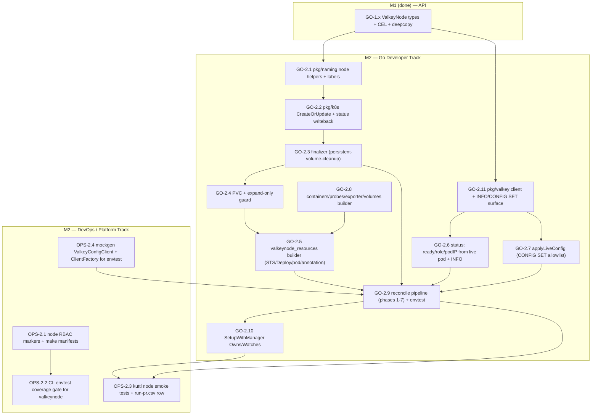

# Phase 2 — ValkeyNode Controller (single-pod infra)

> **Milestone M2 (ValkeyNode).** Go-led, DevOps-supported. This phase delivers the
> `pkg/controller/valkeynode` reconcile loop, the `valkeynode_resources` workload/PVC/pod
> builder, the live `CONFIG SET` allowlist apply path, the config-hash → pod-template-annotation
> rolling-restart mechanism, status (`ready`/`role`/`podIP`) derivation from the **live** pod and
> `INFO`, `SetupWithManager` `Owns()`/`Watches`, and an envtest suite. **No cluster orchestration
> yet** — the Node controller converges exactly **one pod** and never reasons about slots, shards,
> or sibling nodes.
>
> **This phase is the dependency floor for M3 (Cluster controller).** Everything the cluster
> controller relies on — `ValkeyNode.status.{ready,role,podIP,observedGeneration}`, the
> `serverConfigHash`-driven roll, the `LiveConfigApplied` readiness gate — is built and tested
> here in isolation, exactly as the separation-of-concerns rule in
> [04 §1](../architecture/04-control-plane.md) demands.
>
> **Source of truth.** Every task traces to a section of the authoritative architecture docs:
> [../architecture/04-control-plane.md](../architecture/04-control-plane.md) (§3 Node pipeline, §5
> Watches/Owns, §6 finalizers, §7 conditions, §9 requeue, §11 config-hash roll),
> [../architecture/03-api-design.md](../architecture/03-api-design.md) (§6 parent↔child contract,
> §2.5 persistence immutability, §9 printer columns),
> [../architecture/05-data-plane.md](../architecture/05-data-plane.md) (§10 connect/auth, §11
> live-vs-roll config split, §9 persistence interaction),
> [../architecture/08-observability.md](../architecture/08-observability.md) (§2 exporter sidecar,
> §4.2 node conditions, §6 probes). Where the docs are silent on a build detail it is recorded as an
> **Open Question**, never invented.

---

## 1. Objective & demoable outcome

**Objective.** Stand up the `ValkeyNode` (`vkn`) controller so a single `ValkeyNode` CR is managed
end-to-end: it materialises a 1-replica StatefulSet (durable) **or** Deployment (cache), its PVC, a
mounted config, the Valkey server container + exporter sidecar + probes; it applies live-settable
config hot via `CONFIG SET`; it rolls the pod on a `serverConfigHash` change; and it publishes
`status.{ready,role,podIP,observedGeneration}` read from the **live** pod and `INFO replication`
([04 §3](../architecture/04-control-plane.md)).

**Demoable outcome (what concretely works when this phase is done):**

1. `kubectl apply` a single `ValkeyNode` CR (created by hand for the demo — in production only the
   cluster controller creates them) with `workloadType: StatefulSet` + `persistence` → the
   controller creates STS `valkey-<node>`, PVC `valkey-<node>-data`, a pod with the Valkey server
   container, exporter sidecar on `:9121`, startup/liveness/readiness probes; the pod reaches Ready
   and `vkn.status.ready=true`, `status.role=primary`, `status.podIP=<ip>`
   ([04 §3.1](../architecture/04-control-plane.md), [03 §6](../architecture/03-api-design.md)).
2. `kubectl apply` a `ValkeyNode` with `workloadType: Deployment` (no persistence) → a Deployment is
   created instead, no PVC, and the `persistence`+`Deployment` combination is **rejected by CEL**
   ([03 §4.1 rule 1](../architecture/03-api-design.md)).
3. Change `spec.serverConfigHash` on the CR → the controller stamps it as a **pod-template
   annotation**, the single-replica workload rolls, and on the new pod becoming Ready
   `status.ready` flips back to `true` ([04 §11](../architecture/04-control-plane.md),
   [05 §6](../architecture/05-data-plane.md)).
4. Set `spec.config.maxmemory: "200mb"` (a live-settable key) → the controller issues `CONFIG SET`
   over a `ForceSingleClient` connection to `status.podIP`, sets `LiveConfigApplied=True`, **no pod
   roll** ([04 §3.1 step 5](../architecture/04-control-plane.md),
   [05 §11](../architecture/05-data-plane.md)).
5. Set `spec.config.maxmemory: "not-a-size"` → `CONFIG SET` fails, `LiveConfigApplied=False`,
   `status.ready=false`, a `Warning` event `LiveConfigApplyFailed` is emitted, and the node stays
   not-ready until the value is corrected — **fail-closed, user-driven recovery only**
   ([04 §3.1 step 5/§9](../architecture/04-control-plane.md),
   [05 §11](../architecture/05-data-plane.md), [08 §4.2](../architecture/08-observability.md)).
6. Grow `spec.persistence.size` (e.g. `1Gi → 2Gi`) → the PVC expands and
   `PersistentVolumeClaimSizeReady` reflects resize progress; a shrink / storageClass change is
   rejected ([03 §2.5](../architecture/03-api-design.md), [05 §9](../architecture/05-data-plane.md)).
7. With `reclaimPolicy: Delete`, deleting the `ValkeyNode` runs the
   `valkey.percona.com/persistent-volume-cleanup` finalizer and the PVC is deleted; with the default
   `Retain`, the PVC survives ([04 §6.3](../architecture/04-control-plane.md),
   [05 §9](../architecture/05-data-plane.md)).

> **One-sentence demo:** "Create one `ValkeyNode`; watch a single Valkey pod (+ exporter) come up,
> report `ready/role/podIP`, accept a hot `maxmemory` change without restarting, roll only on a
> `serverConfigHash` change, refuse a bad live value visibly, and (on `Delete` reclaim) clean its
> PVC on teardown — with **no cluster controller running**."

---

## 2. Milestone & exit criteria

**Milestone:** **M2 ValkeyNode** — "a single Valkey pod is managed end-to-end (workload, PVC,
status, live `CONFIG SET`)."

**Exit criteria (all must hold):**

| # | Exit criterion | Verified by | Arch trace |
|---|----------------|-------------|------------|
| E1 | `ValkeyNode` controller reconciles a `StatefulSet`-backed node: STS `valkey-<node>` (1 replica) + PVC `valkey-<node>-data` + pod created with owner refs | envtest (GO-2.9); kuttl `node-statefulset` (OPS-2.3) | [04 §3.1 steps 2,4](../architecture/04-control-plane.md), [03 §6.1](../architecture/03-api-design.md) |
| E2 | `Deployment`-backed (cache) node reconciles with **no PVC**; `persistence`+`Deployment` rejected by CEL upstream and guarded in reconcile | envtest (GO-2.9) | [04 §3.1 step 2](../architecture/04-control-plane.md), [03 §4.1](../architecture/03-api-design.md) |
| E3 | `status.{ready,role,podIP,observedGeneration}` derived from the **live** pod + `INFO replication` (`role:master→primary`, `role:slave→replica`); never from `nodeIndex` | envtest with fake `INFO` (GO-2.6/2.9) | [04 §3.1 step 6](../architecture/04-control-plane.md), [03 §6](../architecture/03-api-design.md), [05 §10](../architecture/05-data-plane.md) |
| E4 | Live `CONFIG SET` of `maxmemory`/`maxmemory-policy`/`maxclients` applied post-pod-Ready; `LiveConfigApplied=True`/`NoLiveKeys`/`False`; bad value fails closed and blocks readiness | envtest + fake client (GO-2.7/2.9) | [04 §3.1 step 5/§9](../architecture/04-control-plane.md), [05 §11](../architecture/05-data-plane.md) |
| E5 | A `serverConfigHash` change stamps the pod-template annotation → workload rolls; the hash is **not** recomputed by the node (it consumes the parent's value verbatim) | envtest (GO-2.5/2.9) | [04 §3.1 step 3/§11](../architecture/04-control-plane.md), [03 §6](../architecture/03-api-design.md) |
| E6 | PVC size expand-only honoured; resize surfaces `PersistentVolumeClaimSizeReady` with `ResizeInProgress`/`ResizeInfeasible` reasons | envtest (GO-2.4/2.9) | [03 §2.5](../architecture/03-api-design.md), [05 §9](../architecture/05-data-plane.md) |
| E7 | `valkey.percona.com/persistent-volume-cleanup` finalizer added iff `persistence && reclaimPolicy==Delete`; PVC deleted on teardown for `Delete`, retained for `Retain` | envtest (GO-2.3/2.9); kuttl `node-pvc-reclaim` (OPS-2.3) | [04 §6.3](../architecture/04-control-plane.md), [05 §9](../architecture/05-data-plane.md) |
| E8 | Exporter sidecar injected on `:9121` (named `metrics`) when `exporter.enabled`, with its **own** readiness probe; absent when disabled | envtest (GO-2.8/2.9) | [08 §2.1/§2.4](../architecture/08-observability.md) |
| E9 | Probes (startup/liveness/readiness) mounted from the rendered config; TLS-aware (`--tls`); readiness uses `PING` (+`CLUSTER INFO cluster_state:ok` in cluster mode) | envtest asserts probe specs (GO-2.8/2.9) | [08 §6](../architecture/08-observability.md) |
| E10 | `SetupWithManager` `Owns(STS/Deployment/ConfigMap)` + `Watches(Pod)` → owning `vkn`; pod Ready/IP change enqueues without waiting 60s | envtest event-driven enqueue (GO-2.10) | [04 §5 View B](../architecture/04-control-plane.md) |
| E11 | `make check-generate` green (deepcopy/CRD/RBAC regenerated incl. node RBAC); gofmt/vet/golangci-lint/gosec clean; ≥80% coverage on `pkg/controller/valkeynode` + new `pkg/naming`/`pkg/k8s` helpers | CI (OPS-2.1/2.2) | [ADR-011](../architecture/01-decisions.md), [11 §6.1](../architecture/11-testing-qa.md) |

**Phase is NOT done until** E1–E11 pass in CI and the single-`ValkeyNode` demo (objective §1) runs
green on kind.

---

## 3. Prerequisites (build-order dependencies)

Strictly bottom-up per the Charter. M2 depends on **M0 (Bootstrap)** and **M1 (API)** only — no
later phase:

| Needs from | Task ids | Why M2 needs it |
|------------|----------|-----------------|
| **M1 (API)** | GO-1.x (`valkeynode_types.go` spec/status incl. `serverConfigHash`, `serverConfigMapName`, `aclSecretName`, `LiveConfigApplied` condition); CEL on `ValkeyNodeSpec` (persistence add/remove/expand, storageClass, `workloadType` immutable); `zz_generated.deepcopy.go`; printer columns ([03 §6/§9](../architecture/03-api-design.md)) | The Node controller reconciles `ValkeyNode` and reads/writes its spec/status; CEL is the first guard before the reconcile-time guard. |
| **M1 (API)** | GO-1.x shared sub-structs (`PersistenceSpec`, `ExporterSpec`, `TLSConfig`, condition/reason constants) | Builder and status code consume these verbatim. |
| **M0 (Bootstrap)** | OPS-0.x repo skeleton (`pkg/controller/valkeynode/`, `pkg/naming/`, `pkg/k8s/`, `pkg/valkey/` dirs exist), `cmd/manager` no-op manager, Makefile (`generate`/`manifests`/`test`/`check-generate`/`fmt`/`vet`/`lint`), `setup-envtest` auto-download, GitHub Actions PR workflow | M2 *adds files* into the existing tree, runs codegen, and is gated by the existing CI. |
| **M0 (Bootstrap)** | OPS-0.x `pkg/version` (`CompareVersion`) — only indirectly: the node consumes the parent's already-resolved image/hash and does not version-gate itself | No new version logic in M2. |

> **What M2 does *not* need (and must not pull forward):** the cluster reconcile pipeline, slot
> planners (`PlanRebalanceMove`/`PlanDrainMove`), ACL **rendering** (`renderUsersAcl`), `CLUSTER
> MEET/ADDSLOTSRANGE/REPLICATE/MIGRATESLOTS/FAILOVER`, the version service, backup/restore. Those
> are M3+/M4+. The Node controller consumes the **already-rendered** ConfigMap and the
> **already-rendered** ACL Secret by name (`serverConfigMapName`, `aclSecretName`) and never
> renders cluster-level artifacts ([04 §1 separation-of-concerns](../architecture/04-control-plane.md)).

**This phase provides to downstream phases:** the entire `ValkeyNode.status` contract that the M3
Cluster controller reads to gate its one-at-a-time rolling progress
([04 §2.1 step 6](../architecture/04-control-plane.md),
[05 §6 ordering](../architecture/05-data-plane.md)), plus the `pkg/valkey` *client construction +
minimal `INFO`/`CONFIG SET` surface* that M3 extends with the full `CLUSTER` command set.

### 3.1 Phase task-dependency graph



---

## 4. Scope — In / Out

### In scope

- `pkg/controller/valkeynode/valkeynode_controller.go` — `Reconcile`, phases 1–7 of
  [04 §3.1](../architecture/04-control-plane.md).
- `pkg/controller/valkeynode/valkeynode_resources.go` — STS/Deployment/PVC/ConfigMap-mount/pod-spec
  builder (containers, probes, exporter sidecar, volumes, affinity/scheduling propagation).
- `pkg/controller/valkeynode/finalizer.go` — `reconcilePersistenceFinalizer` +
  `valkey.percona.com/persistent-volume-cleanup` teardown ([04 §6.3](../architecture/04-control-plane.md)).
- `pkg/controller/valkeynode/liveconfig.go` — `applyLiveConfig` allowlist `CONFIG SET`
  ([04 §3.1 step 5](../architecture/04-control-plane.md), [05 §11](../architecture/05-data-plane.md)).
- `pkg/controller/valkeynode/status.go` — `ready`/`role`/`podIP`/conditions derivation
  ([04 §3.1 step 6/§7](../architecture/04-control-plane.md), [03 §6](../architecture/03-api-design.md)).
- `pkg/controller/valkeynode/add_valkeynode.go` — `SetupWithManager`
  ([04 §5 View B](../architecture/04-control-plane.md)).
- `pkg/naming` — node-scoped helpers (`NodeWorkloadName`, `NodePVCName`, `NodeConfigMapName`) +
  the Charter label/annotation/finalizer constants used here ([03 §6.1](../architecture/03-api-design.md)).
- `pkg/k8s` — `CreateOrUpdate`, status-writeback, re-fetch-before-update helper
  ([04 §9](../architecture/04-control-plane.md)).
- `pkg/valkey` — **client construction only** (`ForceSingleClient=true`, `_operator`/`default`
  auth from the ACL Secret, `WRONGPASS` fallback) plus the **minimal** `INFO replication` parse and
  `CONFIG SET` wrapper behind the `ValkeyConfigClient` interface, **and** the `ClientFactory` seam
  (`For(ctx,node)` → resolves `aclSecretName` auth + `status.podIP` address + `spec.tls` → builds a
  client) that the reconciler holds and envtest mocks
  ([05 §10](../architecture/05-data-plane.md)). The full `CLUSTER` surface and `ClusterState` land
  in M3.
- Node-scoped `+kubebuilder:rbac` markers (STS/Deployment/ConfigMap/Pod/PVC/PVC-status/events).
- envtest Ginkgo/Gomega suite + mockgen `ValkeyConfigClient` mock; kuttl node smoke tests.

### Out of scope (explicitly deferred)

- **All cluster orchestration** — slot planning, `CLUSTER MEET/ADDSLOTSRANGE/REPLICATE/MIGRATESLOTS`,
  proactive `CLUSTER FAILOVER`, `getValkeyClusterState`/`ClusterState` → **M3**
  ([04 §2.1, §8–§10](../architecture/04-control-plane.md), [05 §2–§7](../architecture/05-data-plane.md)).
- **ACL/config rendering** (`renderUsersAcl`, `serverConfigRender`, `serverConfigRollHash`) — the
  node *consumes* the rendered ConfigMap/Secret and the parent-stamped hash; it never renders or
  recomputes them → **M3** ([04 §2.1 steps 3–4/§11](../architecture/04-control-plane.md)).
- **`replication`/`standalone` mode specifics** beyond what the single-pod builder needs (the
  readiness-probe variant for replication-mode `master_link_status:up` is *templated* here but the
  operator's failover wiring is M3) ([05 §8](../architecture/05-data-plane.md)).
- **Backup/Restore**, **conversion webhook**, **version service**, **Helm/OLM/docs** → M4/M6/M7.
- **Metrics TLS exporter sub-block / PodMonitor** — those are cluster-level chart artifacts (M5/M7);
  M2 only injects the exporter container + its readiness probe
  ([08 §2.4/§3](../architecture/08-observability.md)).

---

## 5. Go Developer Track

> Task ids `GO-2.n`. DoD baseline (Charter): code compiles; unit/envtest added (≥80% pkg
> coverage); generated artifacts regenerated; gofmt/go vet/golangci-lint/gosec clean; relevant docs
> updated; CI passes. The per-task DoD column appends phase-specifics.

| id | title | description | files / packages | key types / funcs | depends-on | DoD (phase-specific) | tests | effort | risk |
|----|-------|-------------|------------------|-------------------|------------|----------------------|-------|--------|------|
| **GO-2.1** | naming + label/finalizer constants | Add node-scoped name builders and the Charter label/annotation/finalizer constants the Node controller stamps. | `pkg/naming/names.go`, `pkg/naming/labels.go` | `NodeWorkloadName(node)`→`valkey-<node>`, `NodePVCName(node)`→`valkey-<node>-data`, `NodeConfigMapName(node)`; const `FinalizerPVCleanup="valkey.percona.com/persistent-volume-cleanup"`, `AnnServerConfigHash`, label keys `valkey.percona.com/{cluster,shard-index,node-index,component}` + `app.kubernetes.io/*` | GO-1.x | Names match [03 §6.1](../architecture/03-api-design.md)/[05 naming table](../architecture/05-data-plane.md) **exactly**; pure funcs, no I/O | table unit tests (every pattern) | **S** (1.0) | L — wrong name breaks GC/selectors; mitigate w/ golden tests |
| **GO-2.2** | `pkg/k8s` CreateOrUpdate + status writeback | Generic `CreateOrUpdate` with owner-ref set + re-fetch-before-update + status subresource writeback helper. | `pkg/k8s/createorupdate.go`, `pkg/k8s/status.go` | `CreateOrUpdate(ctx,c,obj,owner,mutate)`, `WriteStatus(ctx,c,obj)`, `SetControllerOwnerRef` | GO-2.1 | Honours [04 §9](../architecture/04-control-plane.md) re-fetch rule; idempotent; sets `controller:true`,`blockOwnerDeletion:true` ([03 §1](../architecture/03-api-design.md)) | unit w/ fake client incl. conflict-retry | **M** (2.0) | M — stale-write race; covered by conflict test |
| **GO-2.3** | persistence finalizer | `reconcilePersistenceFinalizer`: add `persistent-volume-cleanup` iff `persistence && reclaimPolicy==Delete`, remove otherwise; teardown branch deletes PVC (ignore NotFound) then removes finalizer; requeue 1s on mutate. | `pkg/controller/valkeynode/finalizer.go` | `reconcilePersistenceFinalizer(ctx,node)`, `cleanupPVC(ctx,node)` | GO-2.2 | Exactly [04 §6.3/§3.1 step 1](../architecture/04-control-plane.md); default `Retain`⇒no finalizer; re-entrant & idempotent ([04 §6.4](../architecture/04-control-plane.md)) | envtest: Delete→PVC gone, Retain→PVC kept, NotFound tolerated | **M** (2.0) | M — wedged PVC delete (storage driver) surfaced via Warning, not force-removed |
| **GO-2.4** | PVC builder + expand-only guard | Build the PVC (via `volumeClaimTemplate` for STS) and a reconcile-time guard that rejects shrink / storageClass change (defence-in-depth behind CEL); drive `PersistentVolumeClaimReady`/`PersistentVolumeClaimSizeReady`. | `pkg/controller/valkeynode/valkeynode_resources.go` (pvc section), `status.go` | `buildPVCTemplate(node)`, `guardPVCImmutable(cur,desired)`, PVC condition setters | GO-2.3 | Expand-only per [03 §2.5](../architecture/03-api-design.md)/[05 §9](../architecture/05-data-plane.md); reasons `ResizeInProgress`/`ResizeInfeasible` per [08 §4.2](../architecture/08-observability.md) | envtest: grow OK, shrink rejected, SC change rejected | **M** (2.5) | M — resize infeasible on some SCs; reason surfaced |
| **GO-2.5** | workload + annotation builder | `buildWorkload`: dispatch on `workloadType` to a **1-replica** STS (durable, `volumeClaimTemplate`) or Deployment (cache, no PVC); stamp `serverConfigHash` (from `spec`, verbatim) into the **pod-template annotation** so a hash change rolls the pod. | `pkg/controller/valkeynode/valkeynode_resources.go` | `buildWorkload(node, podSpec)`, `applyConfigHashAnnotation(tmpl, node.Spec.ServerConfigHash)` | GO-2.8, GO-2.4 | STS=1 replica always ([04 §3.1 step 2](../architecture/04-control-plane.md), [03 §6](../architecture/03-api-design.md)); annotation = roll trigger ([04 §11](../architecture/04-control-plane.md), [05 §6](../architecture/05-data-plane.md)); Deployment+persistence guarded | envtest: STS vs Deploy, replicas==1, annotation rolls pod | **L** (3.0) | M — wrong replica count or merge clobbers user `containers` patch |
| **GO-2.6** | status ready/role/podIP | Re-`Get` pod (selection = **OQ-2.2**); set `podIP` (`""` if absent); when pod Ready derive `role` from live `INFO replication` (`role:master→primary`, `role:slave→replica`) — **never** from `nodeIndex`; set `Ready` only when pod Ready **and** PVC + `LiveConfigApplied` gates hold; set `observedGeneration` at successful tail. | `pkg/controller/valkeynode/status.go` | `deriveStatus(ctx,node,pod,client)`, `roleFromInfo(info)`, `setNodeConditions(...)` | GO-2.11 | Live-role mapping per [05 §10/§Terminology](../architecture/05-data-plane.md); gating per [04 §3.1 step 6](../architecture/04-control-plane.md); eager writeback to beat status-lag pitfall ([04 §3 pitfall](../architecture/04-control-plane.md)); pod discovery resolves OQ-2.2 (§13) | envtest + fake `INFO`: master→primary, slave→replica, absent pod→podIP="" | **L** (3.0) | H — mis-derived role would mislead M3 rolls; pinned by table tests |
| **GO-2.7** | applyLiveConfig (CONFIG SET) | Runs **only after** the pipeline (GO-2.9) confirms the pod is Ready (the pod-not-Ready→requeue-10s gate lives in the reconciler, not here): `CONFIG SET` the allowlist (`maxmemory`,`maxmemory-policy`,`maxclients`) over the `ForceSingleClient` connection the factory built to `status.podIP`; `LiveConfigApplied=True`; `NoLiveKeys` when none; `False`+Warning on error (fail-closed, no auto-remediation, retried each reconcile). On `False`, the **reconciler** (GO-2.9) flips `status.ready=false` so the cluster roll halts. | `pkg/controller/valkeynode/liveconfig.go` | `applyLiveConfig(ctx,node,vc)`, `liveSettableKeys()` (allowlist) | GO-2.11 | Allowlist exactly [05 §11](../architecture/05-data-plane.md); fail-closed blocks readiness ([04 §3.1 step 5/§9](../architecture/04-control-plane.md)); emits `LiveConfigApplyFailed`(W) ([08 §4.3](../architecture/08-observability.md)) | envtest+mock: good value→True, bad→False blocks ready, none→NoLiveKeys | **M** (2.5) | H — applying a roll-only key would be a bug; allowlist hard-coded + tested |
| **GO-2.8** | containers/probes/exporter/volumes | Build server container (ports 6379 client / 16379 bus), exporter sidecar (`:9121` named `metrics`, `_exporter` auth, own readiness, `~50m`/`64Mi`), startup/liveness/readiness probes (TLS-aware `--tls`), config + ACL + TLS + data volume mounts, and propagate `resources`/`nodeSelector`/`affinity`/`tolerations`/`topologySpreadConstraints`; apply strategic-merge `spec.containers` patch. | `pkg/controller/valkeynode/valkeynode_resources.go` | `buildPodSpec(node)`, `buildServerContainer`, `buildExporterSidecar`, `buildProbes`, `buildVolumes`, `mergeContainerPatch` | GO-2.1 | Ports/exporter per [05 §ports](../architecture/05-data-plane.md)/[08 §2.4](../architecture/08-observability.md); probes per [08 §6](../architecture/08-observability.md) (liveness **not** cluster-health-dependent; readiness `PING`+`cluster_state:ok`); volume mounts `/data`,`/config`,`/config/users/users.acl` per [04 §2.1 step 3](../architecture/04-control-plane.md); exporter credential source/injection = **OQ-2.1/OQ-2.3**, probe thresholds = **OQ-2.4** (§13) | envtest asserts container/port/probe/volume shape; exporter present iff enabled | **L** (3.5) | M — probe/TLS mis-wiring causes restart storms; pinned by spec asserts |
| **GO-2.9** | reconcile pipeline (phases 1–7) + envtest | Wire phases 1–7 in order: finalizer → workloadType dispatch → ConfigMap mount → workload+PVC CreateOrUpdate → applyLiveConfig → status → requeue 60s. Eager status writeback; refresh in-memory `{PodIP,Ready}` before `applyLiveConfig`; requeue taxonomy from [04 §9](../architecture/04-control-plane.md). | `pkg/controller/valkeynode/valkeynode_controller.go` | `Reconcile(ctx,req)`, `Reconciler{Client,Scheme,Recorder,ClientFactory}` | GO-2.3,2.5,2.6,2.7,2.11, OPS-2.4 | Phase order + requeues exactly [04 §3.1/§9](../architecture/04-control-plane.md); on `LiveConfigApplied=False` flip `status.ready=false` before writeback (fail-closed, [04 §3.1 step 5/6](../architecture/04-control-plane.md)); ≥80% coverage | full envtest happy-path + each phase failure path | **XL** (5.0) | H — ordering/gating bugs cascade into M3; covered by §9 plan |
| **GO-2.10** | SetupWithManager Owns/Watches | `Owns(StatefulSet)`,`Owns(Deployment)`,`Owns(ConfigMap)`; `Watches(&Pod{})` mapped to owning `vkn` via owner-ref so pod Ready/IP change enqueues without the 60s wait. Register in `cmd/manager`. | `pkg/controller/valkeynode/add_valkeynode.go`, `cmd/manager/main.go` | `SetupWithManager(mgr)`, `mapPodToValkeyNode(obj)` | GO-2.9 | Wiring exactly [04 §5 View B](../architecture/04-control-plane.md); registered alongside future controllers | envtest: pod Ready event re-enqueues vkn | **S** (1.5) | M — missing Watch makes status lag; tested via event injection |
| **GO-2.11** | pkg/valkey client + factory + INFO/CONFIG SET | `ValkeyConfigClient` interface + valkey-go impl: `ForceSingleClient=true`, connect `<podIP>:6379`, auth as configured user from the ACL Secret, `WRONGPASS`→unauth fallback, optional TLS (`ServerName=valkey-<cluster>.<ns>.svc...`); methods `InfoReplication()`, `ConfigSet(k,v)`, `Ping()`, `Close()`. **Also ship the `ClientFactory` seam** — `For(ctx,node)` resolves the `_operator` password from `aclSecretName`, builds `<status.podIP>:6379` + the TLS config from `spec.tls`, and calls `NewClient`; this factory (not the raw client) is what the reconciler holds and what OPS-2.4 mocks for envtest. **No `CLUSTER` commands** (M3 extends). | `pkg/valkey/client.go`, `pkg/valkey/info.go`, `pkg/valkey/interface.go`, `pkg/valkey/factory.go` | `type ValkeyConfigClient interface{...}`, `type ClientFactory interface{ For(ctx,node) (ValkeyConfigClient,error) }`, `NewClient(addr,auth,tls)`, `NewClientFactory(c client.Client)`, `ParseInfoReplication(string)` | GO-1.x | Client config exactly [05 §10](../architecture/05-data-plane.md); **both** `ValkeyConfigClient` and `ClientFactory` are the seams mockgen targets (OPS-2.4); factory reads `aclSecretName` (`internal-<cluster>-acl`) for `_operator` auth | unit: `INFO` parse table; `WRONGPASS` fallback; factory resolves auth/addr/TLS (fake k8s client); (integration w/ real valkey behind build tag) | **L** (3.5) | M — auth/TLS edge cases; `WRONGPASS` fallback tested |

**GO subtotal: ~32.5 person-days** (see §11 rollup).

---

## 6. DevOps / Platform Track

> This phase is **Go-led**; the DevOps track is **supporting** but non-trivial: it owns the
> node-scoped RBAC regeneration, the envtest coverage gate, the kuttl node smoke tests + their
> `run-pr.csv` row, and the mockgen seam. Task ids `OPS-2.n`.

| id | title | description | files / packages | depends-on | DoD (phase-specific) | tests | effort | risk |
|----|-------|-------------|------------------|------------|----------------------|-------|--------|------|
| **OPS-2.1** | node RBAC markers + `make manifests` | Author the node controller `+kubebuilder:rbac` markers (statefulsets/deployments CRUD; configmaps CRUD; pods get/list/watch; pvcs CRUD + pvcs/status; events create/patch; `valkeynodes`+`/status`+`/finalizers`) and regenerate `config/rbac` → `deploy/{bundle,cw-bundle}.yaml`. Least-privilege per [07 §6](../architecture/07-security.md). | `pkg/controller/valkeynode/*.go` (markers), `config/rbac/`, `deploy/` | GO-2.9 | No wildcard verbs/resources; `make check-generate` green; namespaced (`Role`) + cluster-wide (`ClusterRole`) variants both render ([04 §8](../architecture/04-control-plane.md)) | `make manifests` diff clean; rbac assertion test | **M** (2.0) | M — over-broad RBAC fails security review; checklist gate |
| **OPS-2.2** | CI envtest + coverage gate | Extend GitHub Actions `tests.yml` so `make test` exercises the new `valkeynode`/`naming`/`k8s`/`valkey` packages under envtest (KUBEBUILDER_ASSETS auto-download) and enforce **≥80%** package coverage on the new packages; keep `check-generate`/`gosec`/`golangci-lint` green. | `.github/workflows/tests.yml`, `Makefile` (coverage target) | OPS-2.1 | Coverage gate fails the PR below 80% on M2 packages; envtest assets cached ([11 §6.1](../architecture/11-testing-qa.md), [02 §codegen](../architecture/02-repo-layout.md)) | CI dry-run on a seeded PR | **S** (1.5) | L — flaky envtest boot; mitigate w/ asset cache + retry |
| **OPS-2.3** | kuttl node smoke + `run-pr.csv` | Add kuttl TestSuites `e2e-tests/tests/node-statefulset/`, `node-deployment/`, `node-liveconfig/`, `node-pvc-reclaim/` (numbered step/assert pairs); add the rows to `e2e-tests/run-pr.csv` (`node-statefulset,9.0` etc.). Reuse `deploy_operator`/`apply` helpers; assert pod Ready, `vkn.status.ready/role/podIP`, PVC presence/absence. | `e2e-tests/tests/node-*/`, `e2e-tests/run-pr.csv`, `e2e-tests/kuttl.yaml` | GO-2.9, GO-2.10 | kuttl steps assert the §1 demo on kind; engine pin `9.0` (atomic ops floor) but node-only tests also valid on `8.0`/`7.2` ([11 §3](../architecture/11-testing-qa.md), CLAUDE.md kuttl harness) | `kubectl kuttl test --config e2e-tests/kuttl.yaml` locally | **L** (3.0) | M — needs real cluster + cert-manager for TLS variant; gate TLS test behind a label |
| **OPS-2.4** | mockgen `ValkeyConfigClient` + `ClientFactory` | Wire `go:generate`/`make generate` to produce `*_mock.go` for **both** the `ValkeyConfigClient` **and** the `ClientFactory` interfaces (GO-2.11) so envtest can inject a fake factory whose `For()` returns a fake client with scripted `INFO`/`CONFIG SET` responses — no live engine; never hand-edit the generated mocks. | `pkg/valkey/interface.go` (`//go:generate mockgen` for both interfaces), `pkg/valkey/mock_client.go` (generated) | GO-2.11 | Both mocks regenerate via `make generate`; `check-generate` clean; the `ClientFactory` mock is what GO-2.9's reconciler is wired with, the `ValkeyConfigClient` mock is what its `For()` returns (used by GO-2.6/2.7/2.9) ([02 §4 generated-code boundary](../architecture/02-repo-layout.md)) | mocks compile + used in unit/envtest | **S** (1.0) | L — generator drift; pinned tool version |

**OPS subtotal: ~7.5 person-days** (see §11 rollup).

---

## 7. Key technical decisions to honour (with arch-doc citations)

1. **Separation of concerns is load-bearing.** The Node controller **never** touches slots/shards/
   siblings and **never** renders cluster artifacts — it converges one pod, owns its STS/Deployment/
   PVC/ConfigMap-mount, applies live config, and publishes status. The Cluster controller never
   touches a StatefulSet/PVC/pod directly. ([04 §1](../architecture/04-control-plane.md))
2. **WorkloadType dispatch is immutable and persistence-gated.** `StatefulSet` (default, durable,
   1-replica with `volumeClaimTemplate`) vs `Deployment` (cache, no PVC); `persistence` is
   **forbidden** with `Deployment` (CEL upstream + reconcile guard). ([04 §3.1 step 2](../architecture/04-control-plane.md), [03 §4.1 rule 1](../architecture/03-api-design.md))
3. **The node consumes the config-roll hash; it does not compute it.** `serverConfigHash` arrives
   from the parent verbatim and is stamped as a **pod-template annotation** to trigger the roll.
   Recomputing it in the node would break the determinism guarantee. ([04 §3.1 step 3/§11](../architecture/04-control-plane.md), [03 §6](../architecture/03-api-design.md))
4. **Live-settable allowlist is exactly `{maxmemory, maxmemory-policy, maxclients}`.** Applied via
   `CONFIG SET` post-pod-Ready, **no roll**; these keys are excluded from the roll hash, so a bad
   value is caught **only** at apply time. ([04 §3.1 step 5/§11](../architecture/04-control-plane.md), [05 §11](../architecture/05-data-plane.md))
5. **`LiveConfigApplied` gates readiness and is fail-closed.** A failed `CONFIG SET` →
   `LiveConfigApplied=False` → `status.ready=false`, which **blocks the cluster's one-at-a-time
   roll**. The operator never guesses a valid value; recovery is user-driven (fix `spec.config`),
   retried each reconcile with controller-runtime backoff. ([04 §3.1 step 5/§9](../architecture/04-control-plane.md), [05 §11](../architecture/05-data-plane.md))
6. **Live role is read from `INFO replication`, never from the name/label.** Engine `role:master`/
   `role:slave` map to the Percona-API `primary`/`replica`; the CR never surfaces `master`/`slave`.
   ([04 §3.1 step 6](../architecture/04-control-plane.md), [05 §10/§Terminology](../architecture/05-data-plane.md), [03 §6](../architecture/03-api-design.md))
7. **Status-lag pitfall mitigation.** Write status **eagerly** after a pod transition and refresh
   in-memory `{PodIP,Ready}` from the just-written values before `applyLiveConfig` consumes them, so
   one reconcile sees a consistent view; `podIP`/`role` are read from the *live* pod each pass and a
   stale IP self-corrects next reconcile. ([04 §3 pitfall](../architecture/04-control-plane.md))
8. **PVC is durable-by-default.** `reclaimPolicy` defaults to `Retain` (no finalizer, PVC survives);
   `Delete` adds `valkey.percona.com/persistent-volume-cleanup`; size is **expand-only**, storageClass
   immutable. ([04 §6.3](../architecture/04-control-plane.md), [03 §2.5](../architecture/03-api-design.md), [05 §9](../architecture/05-data-plane.md))
9. **Connect/auth discipline.** Per-node client to `<podIP>:6379` with `ForceSingleClient=true`,
   authenticate as the configured ACL user (`_operator`/`default`), `WRONGPASS`→unauth fallback,
   optional TLS with `ServerName=valkey-<cluster>.<ns>.svc...`; close clients each reconcile.
   ([05 §10](../architecture/05-data-plane.md))
10. **Probes.** Startup/liveness use `PING` (TLS-aware) and **liveness must not depend on cluster
    health** (avoids failover restart storms); readiness adds `CLUSTER INFO cluster_state:ok` in
    cluster mode; probe scripts are **excluded from the config hash**. The exporter has its **own**
    readiness so its outage never marks Valkey unready. ([08 §6](../architecture/08-observability.md))
11. **Requeue taxonomy.** finalizer-mutated `1s`; pod-not-Ready-before-live-config `10s`; node
    steady `60s`; returned error → controller-runtime exponential backoff.
    ([04 §3.1 step 7/§9](../architecture/04-control-plane.md))
12. **`Owns`/`Watches` wiring.** `Owns(STS/Deployment/ConfigMap)` + `Watches(Pod)` mapped to the
    owning `vkn` via owner-ref. ([04 §5 View B](../architecture/04-control-plane.md))

---

## 8. Illustrative code skeletons / function signatures (Go)

> Sketches only — they pin the **shape** (signatures, ordering, gating) the implementation must
> honour, not final code. All trace to [04 §3](../architecture/04-control-plane.md),
> [05 §10–§11](../architecture/05-data-plane.md), [08 §6](../architecture/08-observability.md).

### 8.1 Reconcile pipeline (phases 1–7) — `valkeynode_controller.go`

```go
// Reconciler converges exactly ONE Valkey pod. It never reasons about slots/shards/siblings.
type Reconciler struct {
    client.Client
    Scheme        *runtime.Scheme
    Recorder      record.EventRecorder
    ClientFactory valkey.ClientFactory // builds a ValkeyConfigClient for status.podIP (mockable)
}

const (
    requeueFinalizer = 1 * time.Second  // finalizer set mutated             (04 §9)
    requeueNotReady  = 10 * time.Second // pod not Ready, before live config (04 §9)
    requeueSteady    = 60 * time.Second // node steady re-verify             (04 §3.1 step 7)
)

func (r *Reconciler) Reconcile(ctx context.Context, req ctrl.Request) (ctrl.Result, error) {
    log := logf.FromContext(ctx)

    // Phase 0: re-fetch-before-update rule (04 §9). NotFound => GC handles children.
    node := &valkeyv1alpha1.ValkeyNode{}
    if err := r.Get(ctx, req.NamespacedName, node); err != nil {
        return ctrl.Result{}, client.IgnoreNotFound(err)
    }

    // Phase 1: persistence finalizer (+ deletion teardown branch). 04 §3.1 step 1 / §6.3
    if mutated, res, err := r.reconcilePersistenceFinalizer(ctx, node); err != nil || mutated {
        return res, err // requeueFinalizer on mutate; teardown returns when PVC cleaned
    }
    if !node.DeletionTimestamp.IsZero() {
        return ctrl.Result{}, nil // teardown owned by the finalizer branch above
    }

    // Phase 2: workloadType dispatch (immutable; Deployment forbids persistence). 04 §3.1 step 2
    if err := guardWorkloadType(node); err != nil {
        return r.failNode(ctx, node, "InvalidWorkloadType", err)
    }

    // Phase 3: ConfigMap mount — use parent's serverConfigMapName (never render here). 04 §3.1 step 3
    podSpec, err := r.buildPodSpec(node) // GO-2.8 (containers/probes/exporter/volumes)
    if err != nil {
        return r.failNode(ctx, node, "BuildPodSpec", err)
    }

    // Phase 4: Workload + PVC CreateOrUpdate (1-replica STS or Deployment). 04 §3.1 step 4
    if err := r.reconcileWorkload(ctx, node, podSpec); err != nil { // stamps serverConfigHash annotation
        return r.failNode(ctx, node, "Workload", err)
    }

    // Phase 5: applyLiveConfig BEFORE readiness derivation. 04 §3.1 step 5
    pod, podReady := r.getManagedPod(ctx, node) // pod discovery mechanism = OQ-2.2 (§13)
    refreshInMemoryStatus(node, pod) // beat the status-lag pitfall (04 §3)
    if !podReady {
        _ = r.writeStatus(ctx, node) // eager writeback
        return ctrl.Result{RequeueAfter: requeueNotReady}, nil
    }
    vc, err := r.ClientFactory.For(ctx, node) // ForceSingleClient, _operator auth, TLS (05 §10)
    if err != nil {
        return r.failNode(ctx, node, "Connect", err)
    }
    defer vc.Close()
    if err := r.applyLiveConfig(ctx, node, vc); err != nil { // sets LiveConfigApplied=False, fail-closed
        // Fail-closed: a bad live value MUST force status.ready=false (04 §3.1 step 5/6) so the
        // cluster's one-at-a-time roll halts on this node. We do NOT derive role here (the engine
        // is reachable but rejecting the config) — only flip Ready off and surface the condition.
        node.Status.Ready = false
        setCondition(node, CondReady, metav1.ConditionFalse, "LiveConfigApplyFailed", "")
        _ = r.writeStatus(ctx, node)
        return ctrl.Result{RequeueAfter: requeueSteady}, nil // blocks readiness; retried (04 §9)
    }

    // Phase 6: status ready/role/podIP from live pod + INFO. 04 §3.1 step 6
    if err := r.deriveStatus(ctx, node, pod, vc); err != nil {
        return r.failNode(ctx, node, "Status", err)
    }
    node.Status.ObservedGeneration = node.Generation // set only at successful tail (04 §7)
    if err := r.writeStatus(ctx, node); err != nil {
        return ctrl.Result{}, err
    }

    // Phase 7: steady requeue. 04 §3.1 step 7
    return ctrl.Result{RequeueAfter: requeueSteady}, nil
}
```

### 8.2 Persistence finalizer — `finalizer.go` (04 §3.1 step 1 / §6.3)

```go
func (r *Reconciler) reconcilePersistenceFinalizer(
    ctx context.Context, node *valkeyv1alpha1.ValkeyNode,
) (mutated bool, res ctrl.Result, err error) {
    want := node.Spec.Persistence != nil &&
        node.Spec.Persistence.ReclaimPolicy == valkeyv1alpha1.ReclaimDelete

    if !node.DeletionTimestamp.IsZero() {
        // Re-entrant teardown: delete PVC (ignore NotFound) THEN drop finalizer. 04 §6.3/§6.4
        if controllerutil.ContainsFinalizer(node, naming.FinalizerPVCleanup) {
            if err := r.cleanupPVC(ctx, node); err != nil {
                r.Recorder.Event(node, corev1.EventTypeWarning, "PVCCleanupFailed", err.Error())
                return false, ctrl.Result{}, err // stays Terminating; finalizer-audit retries (04 §6.4)
            }
            controllerutil.RemoveFinalizer(node, naming.FinalizerPVCleanup)
            return true, ctrl.Result{}, r.Update(ctx, node)
        }
        return false, ctrl.Result{}, nil
    }

    switch {
    case want && controllerutil.AddFinalizer(node, naming.FinalizerPVCleanup):
        return true, ctrl.Result{RequeueAfter: requeueFinalizer}, r.Update(ctx, node)
    case !want && controllerutil.RemoveFinalizer(node, naming.FinalizerPVCleanup):
        return true, ctrl.Result{RequeueAfter: requeueFinalizer}, r.Update(ctx, node)
    }
    return false, ctrl.Result{}, nil
}
```

### 8.3 Live config apply — `liveconfig.go` (04 §3.1 step 5; 05 §11)

```go
// The ONLY live-settable keys. Hard-coded so a roll-only key can never be hot-applied. 05 §11
func liveSettableKeys() []string { return []string{"maxmemory", "maxmemory-policy", "maxclients"} }

func (r *Reconciler) applyLiveConfig(
    ctx context.Context, node *valkeyv1alpha1.ValkeyNode, vc valkey.ValkeyConfigClient,
) error {
    pending := map[string]string{}
    for _, k := range liveSettableKeys() {
        if v, ok := node.Spec.Config[k]; ok {
            pending[k] = v
        }
    }
    if len(pending) == 0 {
        setCondition(node, CondLiveConfigApplied, metav1.ConditionTrue, "NoLiveKeys", "")
        return nil
    }
    for k, v := range pending {
        if err := vc.ConfigSet(ctx, k, v); err != nil { // fail-closed; no auto-remediation (04 §9)
            r.Recorder.Eventf(node, corev1.EventTypeWarning, "LiveConfigApplyFailed",
                "CONFIG SET %s=%q failed: %v", k, v, err)
            setCondition(node, CondLiveConfigApplied, metav1.ConditionFalse, "ApplyFailed",
                fmt.Sprintf("CONFIG SET %s=%q: %v", k, v, err))
            return err // -> caller leaves node not-ready, blocking cluster roll until user fixes spec
        }
    }
    setCondition(node, CondLiveConfigApplied, metav1.ConditionTrue, "Applied", "")
    return nil
}
```

### 8.4 Status derivation — `status.go` (04 §3.1 step 6 / §7; 05 §10)

```go
// roleFromInfo maps engine tokens to Percona-API roles. The CR NEVER surfaces master/slave. 05 §10
func roleFromInfo(infoRepl map[string]string) valkeyv1alpha1.NodeRole {
    switch infoRepl["role"] {
    case "master":
        return valkeyv1alpha1.RolePrimary
    case "slave":
        return valkeyv1alpha1.RoleReplica
    default:
        return "" // unknown until INFO is readable
    }
}

func (r *Reconciler) deriveStatus(
    ctx context.Context, node *valkeyv1alpha1.ValkeyNode, pod *corev1.Pod, vc valkey.ValkeyConfigClient,
) error {
    if pod == nil { // cleared to "" when the pod is absent (04 §3.1 step 6)
        node.Status.PodIP, node.Status.Ready, node.Status.Role = "", false, ""
        return nil
    }
    node.Status.PodName, node.Status.PodIP = pod.Name, pod.Status.PodIP

    podReady := isPodReady(pod)
    if podReady {
        repl, err := vc.InfoReplication(ctx) // live role, never nodeIndex (04 §3.1 step 6, 05 §10)
        if err != nil {
            return err
        }
        node.Status.Role = roleFromInfo(repl)
    }
    // Ready iff pod Ready AND PVC gates AND LiveConfigApplied=True (04 §3.1 step 6, 03 §6)
    node.Status.Ready = podReady &&
        conditionTrue(node, CondPVCReady) &&
        conditionTrue(node, CondPVCSizeReady) &&
        conditionTrue(node, CondLiveConfigApplied)
    setCondition(node, CondReady, boolToStatus(node.Status.Ready), readyReason(node), "")
    return nil
}
```

### 8.5 Exporter sidecar + probes — `valkeynode_resources.go` (08 §2.4 / §6)

```go
const (
    portClient   = 6379  // 05 §ports
    portBus      = 16379 // 05 §ports
    portExporter = 9121  // 08 §2.4 (redis_exporter default), named "metrics"
)

func buildExporterSidecar(node *valkeyv1alpha1.ValkeyNode) *corev1.Container {
    if !node.Spec.Exporter.Enabled {
        return nil // exporter absent when disabled (08 §2.1)
    }
    return &corev1.Container{
        Name:  "metrics-exporter",
        Image: node.Spec.Exporter.Image,
        Ports: []corev1.ContainerPort{{Name: "metrics", ContainerPort: portExporter}},
        // _exporter ACL auth from internal-<cluster>-system-passwords (08 §2.4); env wired in builder.
        // NOTE: that Secret is NOT in the 03 §6 parent↔child contract — see OQ-2.1/OQ-2.3 (§13).
        Resources:      exporterResourcesOrDefault(node), // ~50m / 64Mi default (08 §2.4)
        ReadinessProbe: httpGetProbe("/", portExporter),  // own readiness; never rolls Valkey (08 §2.4)
    }
}

// Readiness gates the cluster's one-at-a-time roll; liveness must NOT depend on cluster health. 08 §6
func buildProbes(node *valkeyv1alpha1.ValkeyNode) (startup, liveness, readiness *corev1.Probe) {
    cli := valkeyCliArgs(node) // adds --tls + CA/cert when spec.tls set (08 §6 TLS dual-port)
    // generousThreshold/defaultThreshold are placeholders — concrete probe numbers are OQ-2.4 (§13).
    startup = execProbe(append(cli, "PING"), generousThreshold)  // gate liveness until responsive
    liveness = execProbe(append(cli, "PING"), defaultThreshold)  // process-alive only (08 §6)
    readiness = execReadiness(node, cli)                         // PING (+ cluster_state:ok cluster mode)
    return
}
```

### 8.6 `SetupWithManager` — `add_valkeynode.go` (04 §5 View B)

```go
func (r *Reconciler) SetupWithManager(mgr ctrl.Manager) error {
    return ctrl.NewControllerManagedBy(mgr).
        For(&valkeyv1alpha1.ValkeyNode{}).
        Owns(&appsv1.StatefulSet{}).  // durable
        Owns(&appsv1.Deployment{}).   // cache
        Owns(&corev1.ConfigMap{}).    // mounted config
        Watches(&corev1.Pod{},        // pod Ready/IP change -> enqueue owner, no 60s wait (04 §5)
            handler.EnqueueRequestsFromMapFunc(r.mapPodToValkeyNode)).
        Complete(r)
}
```

### 8.7 `ValkeyConfigClient` + `ClientFactory` — `pkg/valkey/interface.go` (05 §10; mockgen seam OPS-2.4)

```go
//go:generate mockgen -destination=mock_client.go -package=valkey . ValkeyConfigClient,ClientFactory
type ValkeyConfigClient interface {
    InfoReplication(ctx context.Context) (map[string]string, error) // role:master/slave, master_link_status
    ConfigSet(ctx context.Context, key, value string) error          // live-settable allowlist only
    Ping(ctx context.Context) error
    Close() error
}

// ClientFactory is the seam the reconciler holds (so envtest injects a fake). For() resolves the
// _operator password from node.Spec.AclSecretName (internal-<cluster>-acl), builds the address
// <node.Status.PodIP>:6379 and the TLS config from node.Spec.TLS, then dials via NewClient. 05 §10
type ClientFactory interface {
    For(ctx context.Context, node *valkeyv1alpha1.ValkeyNode) (ValkeyConfigClient, error)
}
// NewClient builds a ForceSingleClient connection to <podIP>:6379, _operator/default auth,
// WRONGPASS->unauth fallback, optional TLS (ServerName valkey-<cluster>.<ns>.svc...). 05 §10
```

---

## 9. Test plan

> Coverage target **≥80%** on `pkg/controller/valkeynode`, `pkg/naming`, `pkg/k8s`, and the new
> `pkg/valkey` client surface ([11 §6.1](../architecture/11-testing-qa.md)). TDD per
> [11 testing-qa](../architecture/11-testing-qa.md): write the failing test first.

### 9.1 Unit tests (no API server)

| Area | Cases | Trace |
|------|-------|-------|
| `pkg/naming` | `NodeWorkloadName`/`NodePVCName`/`NodeConfigMapName` golden patterns; label/finalizer constants | [03 §6.1](../architecture/03-api-design.md), [05 naming](../architecture/05-data-plane.md) |
| `roleFromInfo` | `role:master→primary`, `role:slave→replica`, unknown→`""` | [05 §10](../architecture/05-data-plane.md) |
| `ParseInfoReplication` | parses `role`, `master_link_status`, `slave_repl_offset`; malformed input | [05 §10](../architecture/05-data-plane.md) |
| `liveSettableKeys` / `applyLiveConfig` (mock) | exactly the 3 keys; good→`Applied`, bad→`ApplyFailed`+error, none→`NoLiveKeys` | [05 §11](../architecture/05-data-plane.md), [04 §3.1 step 5](../architecture/04-control-plane.md) |
| `guardPVCImmutable` | grow OK, shrink rejected, storageClass change rejected | [03 §2.5](../architecture/03-api-design.md) |
| `pkg/k8s.CreateOrUpdate` | create, no-op update, conflict-retry, owner-ref set | [04 §9](../architecture/04-control-plane.md) |
| `pkg/valkey.NewClient` | `WRONGPASS`→unauth fallback path; TLS config built from Secret | [05 §10](../architecture/05-data-plane.md) |

### 9.2 envtest (Ginkgo/Gomega, real API server, fake engine via `ValkeyConfigClient` mock)

| Scenario | Assert | Trace |
|----------|--------|-------|
| STS-backed node happy path | STS `valkey-<node>` (1 replica) + PVC `valkey-<node>-data` + owner refs; pod marked Ready (manually) → `vkn.status.ready=true`, `role=primary`, `podIP` set | E1/E3, [04 §3.1](../architecture/04-control-plane.md) |
| Deployment-backed node | Deployment created, **no PVC**; persistence+Deployment guarded | E2, [04 §3.1 step 2](../architecture/04-control-plane.md) |
| serverConfigHash roll | changing `spec.serverConfigHash` updates pod-template annotation → workload pod-template changes; `status.ready` flips false→true on new pod Ready | E5, [04 §11](../architecture/04-control-plane.md) |
| live config good | `maxmemory` set → mock `ConfigSet` called → `LiveConfigApplied=True`, **no annotation change** (no roll) | E4, [05 §11](../architecture/05-data-plane.md) |
| live config bad (fail-closed) | mock `ConfigSet` errors → `LiveConfigApplied=False`, `status.ready=false`, `LiveConfigApplyFailed`(W) event; stays not-ready across reconciles until value fixed | E4, [04 §3.1 step 5/§9](../architecture/04-control-plane.md) |
| PVC expand | grow `size` → PVC capacity request grows, `PersistentVolumeClaimSizeReady` reasons surface | E6, [03 §2.5](../architecture/03-api-design.md) |
| finalizer reclaim | `Delete`→finalizer added, PVC deleted on teardown; `Retain`→no finalizer, PVC kept | E7, [04 §6.3](../architecture/04-control-plane.md) |
| exporter toggle | sidecar present on `:9121` named `metrics` w/ own readiness when enabled; absent when disabled | E8, [08 §2.4](../architecture/08-observability.md) |
| probes | startup/liveness/readiness exec probes present; liveness independent of cluster state; TLS args when `spec.tls` set | E9, [08 §6](../architecture/08-observability.md) |
| Watches enqueue | injecting a Pod Ready transition re-enqueues the owning `vkn` before the 60s steady requeue | E10, [04 §5](../architecture/04-control-plane.md) |

### 9.3 kuttl e2e (real cluster — OPS-2.3, `run-pr.csv`)

| Suite | Steps → asserts | Trace |
|-------|-----------------|-------|
| `node-statefulset` | apply operator + one `vkn`(STS+persistence) → STS/PVC/pod exist, `vkn` Ready, `role=primary`, `podIP` populated | E1, [04 §3.1](../architecture/04-control-plane.md) |
| `node-deployment` | apply one `vkn`(Deployment) → Deployment, no PVC, `vkn` Ready | E2, [04 §3.1 step 2](../architecture/04-control-plane.md) |
| `node-liveconfig` | patch `maxmemory` → applied hot (pod uid unchanged); patch bad value → `vkn` not Ready + Warning | E4, [05 §11](../architecture/05-data-plane.md) |
| `node-pvc-reclaim` | `Delete` reclaim → PVC gone after `vkn` delete; `Retain` → PVC survives | E7, [04 §6.3](../architecture/04-control-plane.md) |

> **CI placement** ([CLAUDE.md](../../../CLAUDE.md) / [11 §7](../architecture/11-testing-qa.md)): GitHub
> Actions runs **unit + envtest** on every PR (the M2 gate); the kuttl suites run on Jenkins/GKE
> from `run-pr.csv`, never on the PR. The TLS-probe variant requires cert-manager and is gated
> behind a kuttl label so the smoke set stays cert-manager-free.

---

## 10. Risks & mitigations

| # | Risk | Severity | Likelihood | Mitigation |
|---|------|----------|------------|------------|
| R1 | **Mis-derived live role** (`role` from `nodeIndex` instead of `INFO`) silently corrupts M3's replicas-before-primary roll. | High | Med | `roleFromInfo` is the single source; table-tested; envtest asserts post-"failover" role flip; never reads `nodeIndex` ([05 §10](../architecture/05-data-plane.md)). |
| R2 | **Live-config allowlist drift** — a roll-only key (`appendonly`) accidentally hot-applied, or a live key accidentally rolling the pod. | High | Low | `liveSettableKeys()` hard-coded + unit-pinned; roll hash excludes exactly these keys; envtest asserts no annotation change on `maxmemory` ([05 §11](../architecture/05-data-plane.md), [04 §11](../architecture/04-control-plane.md)). |
| R3 | **Status-lag race** — node reports stale `ready/podIP`, stalling the cluster roll. | High | Med | Eager status writeback + in-memory `{PodIP,Ready}` refresh before `applyLiveConfig`; `Watches(Pod)` re-enqueues on Ready/IP change ([04 §3 pitfall/§5](../architecture/04-control-plane.md)). |
| R4 | **Wedged PVC-cleanup finalizer** (storage driver hangs) pins the `vkn` `Terminating`. | Med | Low | Idempotent re-entrant teardown; never force-remove finalizer; Warning event + condition each retry; relies on cluster-controller finalizer-audit (M3) for periodic re-enqueue ([04 §6.4/§6.5](../architecture/04-control-plane.md)). |
| R5 | **Probe mis-wiring** (liveness coupled to cluster health, or non-TLS probe against TLS-only listener) → restart storms / connection-refused. | High | Med | Liveness = bare `PING` only; readiness adds `cluster_state:ok`; `--tls` args when `spec.tls` set; envtest asserts probe specs ([08 §6](../architecture/08-observability.md)). |
| R6 | **`buildWorkload` clobbers user `spec.containers` strategic-merge patch** or sets replicas≠1. | Med | Med | `mergeContainerPatch` unit-tested for append-unknown + patch-known; replicas hard-coded to 1 with assertion ([03 §6](../architecture/03-api-design.md)). |
| R7 | **Over-broad node RBAC** fails security review. | Med | Low | OPS-2.1 markers least-privilege per [07 §6](../architecture/07-security.md); no wildcard verbs; reviewed against checklist; pods read-only. |
| R8 | **envtest flakiness** (asset download, pod-Ready simulation timing) destabilises CI. | Med | Med | Cache KUBEBUILDER_ASSETS (OPS-2.2); Gomega `Eventually` with bounded timeouts; deterministic fake `INFO` via mockgen (OPS-2.4). |
| R9 | **`pkg/valkey` over-reach** — pulling `CLUSTER` commands forward into M2 blurs the M2/M3 boundary. | Low | Med | Interface restricted to `InfoReplication/ConfigSet/Ping/Close`; `CLUSTER` surface explicitly deferred to M3 (§4 Out of scope). |

---

## 11. Effort summary (rollup)

| Track | Tasks | Person-days |
|-------|-------|-------------|
| **Go Developer** | GO-2.1 (1.0), GO-2.2 (2.0), GO-2.3 (2.0), GO-2.4 (2.5), GO-2.5 (3.0), GO-2.6 (3.0), GO-2.7 (2.5), GO-2.8 (3.5), GO-2.9 (5.0), GO-2.10 (1.5), GO-2.11 (3.5) | **32.5** |
| **DevOps / Platform** | OPS-2.1 (2.0), OPS-2.2 (1.5), OPS-2.3 (3.0), OPS-2.4 (1.0) | **7.5** |
| **Phase total** | 15 tasks | **40.0** |

**Critical path:** `GO-1.x (M1) → GO-2.11 → GO-2.6/2.7 → GO-2.9 → GO-2.10 → OPS-2.3`, with
`GO-2.8 → GO-2.5 → GO-2.9` joining it. The builder (GO-2.5/2.8) and the client/status/liveconfig
trio (GO-2.6/2.7/2.11) can proceed **in parallel** until they converge on GO-2.9. The DevOps track
(OPS-2.1/2.2/2.4) runs alongside and only OPS-2.3 (kuttl) needs the finished controller.

```mermaid
gantt
    title M2 — ValkeyNode (indicative, person-day scale)
    dateFormat X
    axisFormat %s
    section Go
    GO-2.1 naming            :g1, 0, 1
    GO-2.11 valkey client    :g11, 0, 4
    GO-2.2 k8s helpers       :g2, after g1, 2
    GO-2.8 containers/probes :g8, after g1, 4
    GO-2.3 finalizer         :g3, after g2, 2
    GO-2.4 pvc               :g4, after g3, 3
    GO-2.6 status            :g6, after g11, 3
    GO-2.7 liveconfig        :g7, after g11, 3
    GO-2.5 workload builder  :g5, after g8, 3
    GO-2.9 reconcile+envtest :g9, after g5, 5
    GO-2.10 setupwithmanager :g10, after g9, 2
    section DevOps
    OPS-2.4 mockgen          :o4, after g11, 1
    OPS-2.1 rbac             :o1, after g9, 2
    OPS-2.2 ci coverage      :o2, after o1, 2
    OPS-2.3 kuttl smoke      :o3, after g10, 3
```



---

## 12. References

- [../architecture/04-control-plane.md](../architecture/04-control-plane.md) — §1 separation of
  concerns; §3 `ValkeyNode` reconcile pipeline (phases 1–7) + status-lag pitfall; §5 View B
  Watches/Owns; §6.3/§6.4/§6.5 PVC finalizer & teardown; §7 conditions→state; §9 requeue taxonomy &
  re-fetch rule; §11 config-hash rolling restart.
- [../architecture/03-api-design.md](../architecture/03-api-design.md) — §2.5 persistence
  immutability; §4.1 CEL rules (persistence+Deployment, expand-only, storageClass); §6 parent↔child
  `ValkeyNode` spec/status contract; §6.1 naming/labels; §9 printer columns.
- [../architecture/05-data-plane.md](../architecture/05-data-plane.md) — §ports (6379/16379); §9
  persistence interaction with rolls/restarts; §10 connect/auth (`ForceSingleClient`, `_operator`
  ACL, `WRONGPASS` fallback, TLS); §11 live-vs-roll config split (the allowlist).
- [../architecture/08-observability.md](../architecture/08-observability.md) — §2.1/§2.4 exporter
  sidecar (port `9121`, `_exporter`, `~50m/64Mi`, own readiness); §4.2 `ValkeyNode` conditions; §4.3
  event vocabulary (`LiveConfigApplyFailed`); §6 health probes.
- [../architecture/02-repo-layout.md](../architecture/02-repo-layout.md) — codegen toolchain,
  generated-code boundary (mockgen), Makefile vocabulary.
- [../architecture/07-security.md](../architecture/07-security.md) — §6 RBAC least-privilege (node
  controller markers).
- [../architecture/11-testing-qa.md](../architecture/11-testing-qa.md) — envtest + kuttl harness,
  `run-*.csv`, 80% coverage gate.
- [../architecture/01-decisions.md](../architecture/01-decisions.md) — ADR-001 (two-CRD
  cluster→node), ADR-006 (workloadType per node), ADR-011 (testing).

---

## 13. Open Questions (docs silent — do not invent)

Per the phase header and the Charter ("if the docs are silent on something needed to build, record
it as an OPEN QUESTION — do NOT invent new design"), the following build details are **not** pinned
by the architecture docs. Each must be resolved (preferably by an arch-doc amendment) before the
owning task closes; the listed *interim* choice is the lowest-risk reading of the existing docs, not
new design.

| # | Open question | Where the docs are silent | Owning task | Interim choice (not authoritative) |
|---|---------------|---------------------------|-------------|------------------------------------|
| OQ-2.1 | **How does the node reference `internal-<cluster>-system-passwords` for the `_exporter` sidecar credential?** The parent↔child contract ([03 §6](../architecture/03-api-design.md)) passes only `serverConfigMapName`, `serverConfigHash`, and `aclSecretName` to `ValkeyNode.spec` — there is **no** field carrying the system-passwords Secret, yet [08 §2.4](../architecture/08-observability.md)/[07 §4.3](../architecture/07-security.md) require the exporter to authenticate as `_exporter` with that Secret's password. | 03 §6 spec table; 08 §2.4 | GO-2.8 | Derive the name by Percona convention (`internal-<cluster>-system-passwords`) from the `valkey.percona.com/cluster` label rather than adding a spec field; flag for an 03 §6 contract amendment (add `systemSecretName`) if a future mode breaks the convention. |
| OQ-2.2 | **How does the controller select the managed pod (`getManagedPod`)?** §8.1 calls `getManagedPod(ctx,node)` but [04 §3](../architecture/04-control-plane.md) does not specify pod discovery (label selector vs. owner-ref walk vs. STS `.status`). | 04 §3.1 step 6 | GO-2.6/2.9 | List pods by the Charter label set (`valkey.percona.com/{cluster,shard-index,node-index}`) scoped to the node's namespace, expecting exactly one; treat 0/>1 as not-Ready. |
| OQ-2.3 | **`_exporter` password injection mechanism into the sidecar** — env var vs. mounted file, and the exact env/flag name the chosen exporter image consumes (`REDIS_PASSWORD`/`--redis.password` for `redis_exporter`-compatible images). [08 §2.4](../architecture/08-observability.md) states the source Secret but not the wiring. | 08 §2.4 | GO-2.8 | `valueFrom.secretKeyRef` env (`REDIS_PASSWORD`, key `_exporter`) per the `redis_exporter` convention; revisit if the Percona-branded image diverges. |
| OQ-2.4 | **Probe `failureThreshold`/`periodSeconds`/`timeoutSeconds` numbers** — [08 §6](../architecture/08-observability.md) fixes probe *intent* and commands (PING / `cluster_state:ok`, TLS-aware, liveness cluster-independent) but no concrete thresholds; §8.5 uses placeholder `generousThreshold`/`defaultThreshold`. | 08 §6 | GO-2.8 | Borrow PXC/PSMDB defaults (startup generous enough to load a large RDB/AOF, e.g. 30×10s; liveness/readiness 3×10s); make them overridable later, do not bake into the config hash (probe scripts are hash-excluded per [04 §11](../architecture/04-control-plane.md)). |
