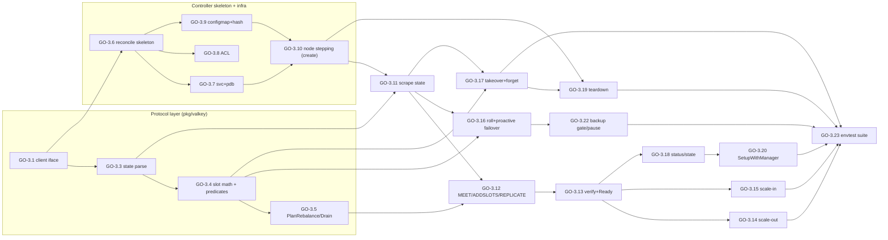
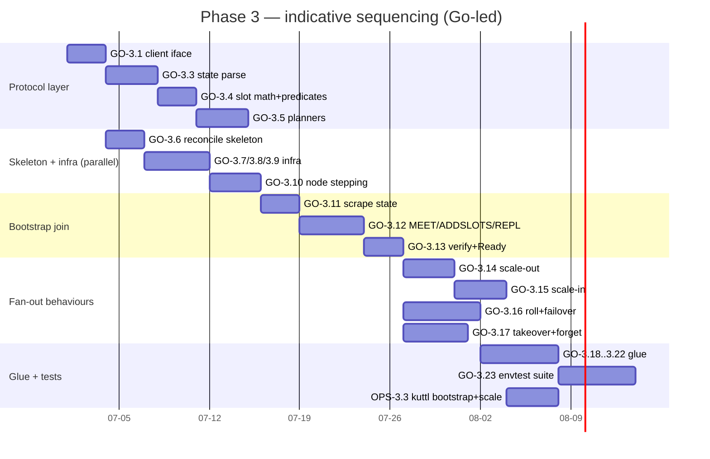

# Phase 3 — ValkeyCluster Controller & Valkey Protocol Layer

> **Milestone:** M3 Cluster — *`PerconaValkeyCluster` forms a healthy sharded cluster, scales out/in, rolls, and fails over.*
> **Lead track:** Go Developer (the DevOps track is supporting — kuttl harness, RBAC, CI matrix only).
> **Build-order position:** strictly after **M2 (ValkeyNode)**. This is the **heaviest phase** of the whole plan: it implements the entire `pkg/valkey` protocol/domain layer and the full 16-step `pkg/controller/perconavalkeycluster` reconcile pipeline. It depends on M2 because the cluster controller's [§2.1 step 6](../architecture/04-control-plane.md) writes `ValkeyNode` specs one-at-a-time and reads back `status.{ready,role,podIP}` — none of M3 can be exercised end-to-end until the Node controller behaves to contract.
>
> **Source of truth:** [../architecture/04-control-plane.md](../architecture/04-control-plane.md) §1 (controller inventory), §2 (cluster pipeline phases 0–15), §5 (Watches/Owns), §6.1 (ordered teardown), §7 (conditions→state), §8 (leader election), §9 (requeue/backoff/idempotency), §10 (proactive failover), §11 (config-hash roll); [../architecture/05-data-plane.md](../architecture/05-data-plane.md) §1 (modes), §2 (cluster internals, slot math, managed directives), §3 (bootstrap MEET→ADDSLOTSRANGE→REPLICATE), §4 (scale-out + rebalance), §5 (scale-in drain), §6 (rolling + proactive failover), §7 (failure/recovery, TAKEOVER, FORGET), §8 (replication-mode failover), §10 (connect/auth `_operator`), §12 (invariants); [../architecture/03-api-design.md](../architecture/03-api-design.md) §2 (cluster spec), §3 (status), §6 (parent↔node contract), §7-8 (backup/restore refs for the pause/resume watch).

---

## 1. Objective & demoable outcome

When this phase is complete, a user can apply a single `PerconaValkeyCluster` (`pvk`) and the operator drives it from "CR created" to "healthy sharded cluster serving traffic", then keeps it healthy through scale, rolls, and primary loss — **without the user ever touching a `ValkeyNode`, StatefulSet, or `CLUSTER` command**. Concretely, a maintainer (or the envtest/kuttl suites) can:

1. **Bootstrap.** `kubectl apply` a `mode: cluster, shards: 3, replicas: 1` `pvk` → the operator upserts the headless Service `valkey-<cluster>`, the PDB, the ACL Secret `internal-<cluster>-acl` (with `_operator`/`_exporter`/`_backup` system users), the ConfigMap `valkey-<cluster>` (computing the roll hash), then creates the 6 `ValkeyNode`s one-at-a-time (replicas-before-primary), MEETs them, assigns all 16384 slots (`5462/5461/5461`), attaches replicas, and marks `Ready=True` with `cluster_state:ok` and every replica `master_link_status:up`.
2. **Scale-out.** `spec.shards: 3 → 4` → the operator creates the new shard's `ValkeyNode`s, MEETs them, finds no unassigned slots, and rebalances **one 400-slot move per reconcile** until balanced — clients see one `-MOVED` per move, zero downtime.
3. **Scale-in.** `spec.shards: 4 → 3` → the excess shard is drained (`CLUSTER MIGRATESLOTS` into survivors) to zero slots, its `ValkeyNode`s are deleted, the stale node IDs are `CLUSTER FORGET`-ten, and the survivors re-equalise.
4. **Rolling update.** A roll-triggering `spec.config` change (e.g. `appendonly`) or an image change → the operator stamps a new `serverConfigHash`/image on each node one-at-a-time, replicas-before-primary, performing a **graceful proactive `CLUSTER FAILOVER`** (10s/1s poll) on the highest-offset synced replica before rolling a live primary, emitting `FailoverInitiated`/`FailoverCompleted`.
5. **Failover / recovery.** Kill a primary pod: with quorum intact Valkey self-elects and the operator observes; with quorum lost **and persistence off** the operator promotes the highest-offset orphaned replica via `CLUSTER FAILOVER TAKEOVER` *before* `FORGET` so slots stay covered; with persistence on the operator waits for the same-node-ID pod to return.
6. **Status.** `kubectl get pvk` shows `State=ready Shards=3 Ready=3`; conditions `Ready/ClusterFormed/SlotsAssigned=True`; `observedGeneration == generation` only after a converged reconcile.
7. **HA.** Run the operator `replicas: 2` → only the leader reconciles; deleting the Lease forces a clean standby takeover with no double-issued cluster commands.

**Demoable artifact:** `kubectl apply -f a-3-shard-cluster.yaml` → wait for `Ready` → `valkey-cli -c CLUSTER INFO` reports `cluster_state:ok` + `cluster_slots_assigned:16384`; scale to 4 shards and watch `kubectl get pvk -w` move through `Reconciling → Ready` while slot coverage never drops below 16384.

---

## 2. Milestone & exit criteria

**Milestone M3 Cluster.** Exit criteria (all must hold):

- [ ] `pkg/valkey` parses `CLUSTER NODES`/`CLUSTER INFO`/`INFO replication`/`CLUSTER MYID`/`CLUSTER MYSHARDID` into `ClusterState`/`NodeState`, with the live-role mapping (`role:master`→`primary`, `role:slave`→`replica`) and all flag/slot/offset fields, against golden engine-output fixtures.
- [ ] **Deterministic slot planning:** `PlanRebalanceMove` and `PlanDrainMove` are pure functions of `ClusterState` (address-sorted, ±1 tolerance, 400-slot batch) — identical input topology yields identical `(src,dst,range)` ([05 §4](../architecture/05-data-plane.md)).
- [ ] `pkg/controller/perconavalkeycluster` implements **all 16 ordered phases (0–15)** of [04 §2.1](../architecture/04-control-plane.md) with the one-effect-per-reconcile + short-requeue discipline and the [04 §9](../architecture/04-control-plane.md) requeue taxonomy (`2s`/`scheduling`/`30s`).
- [ ] **Bootstrap** forms a 3-shard/1-replica cluster: MEET→ADDSLOTSRANGE→REPLICATE ordering invariant enforced; all 16384 slots covered; `Ready=True`.
- [ ] **Scale-out** rebalances one move/reconcile; **scale-in** drains then deletes then forgets; both gate on Valkey 9.0+ atomic `MIGRATESLOTS` with an actionable error on older engines.
- [ ] **Rolling update** one-at-a-time, replicas-before-primary, with proactive failover before a live primary; config-hash *and* image rolls share the single step-6 mechanism.
- [ ] **Failover:** native-when-quorum observed; `TAKEOVER` on quorum-loss + persistence-off, before `FORGET`; `FORGET` suppressed while a failover is pending.
- [ ] **Status:** `status.state` is a pure projection of `Degraded/Ready/Progressing` conditions by the [04 §7](../architecture/04-control-plane.md) priority; `observedGeneration` set only at the converged tail.
- [ ] **Leader election ON by default**; `Watches`/`Owns` wired per [04 §5](../architecture/04-control-plane.md); the cluster controller never touches a StatefulSet/PVC/pod directly ([04 §1](../architecture/04-control-plane.md) separation rule).
- [ ] envtest suite green; **≥80% line coverage** for `pkg/valkey` and `pkg/controller/perconavalkeycluster`; the `ValkeyConfigClient` seam mocks every cluster command so reconcile logic is testable without a real cluster.
- [ ] Baseline DoD: compiles; `make generate`/`make manifests` regenerated; gofmt/go vet/golangci-lint/gosec clean; docs updated; CI green.

**Out of milestone (deferred):** backup/restore phase machines and the `_backup` Job path (M4 — M3 only wires the *Watch* that lets a restore pause/resume the cluster and the *gate* that blocks rolls while a backup runs); ACL *rendering content* beyond the canonical system users + a passthrough of `spec.users` (security hardening, rotation, TLS provisioning → M5); crVersion *behavioural gating* of new features and the version-service smart-update *resolution* (M6 — M3 implements the step-6 roll *mechanism* and honours an already-resolved target image, but the version-service client that *computes* the target is M6); conversion webhook (M6).

---

## 3. Prerequisites (which earlier phases / task-ids must be complete)

| Prereq | Why this phase needs it | Provides (task ids) |
|--------|-------------------------|---------------------|
| **M0 Bootstrap** | Manager wiring, envtest harness, Makefile codegen (`make {generate,manifests,test}`), `bin/` tool download, golangci-lint/gosec config, `pkg/version` (`CompareVersion`), `cmd/manager` boot. | OPS-0.* |
| **M1 API** | `PerconaValkeyCluster` + `ValkeyNode` Go types, the full cluster `spec`/`status` (incl. `mode`/`shards`/`replicas`/`workloadType`/`persistence`/`config`/`users`/`tls`/`exporter`/`podDisruptionBudget`/`backup`/`upgradeOptions`), cluster condition-type constants (`Ready`/`Progressing`/`Degraded`/`ClusterFormed`/`SlotsAssigned`), `CheckNSetDefaults`, CEL immutability, `zz_generated.deepcopy.go`. | GO-1.1/1.2 (shared sub-structs), GO-1.5 (cluster+node contract types), GO-1.6 (defaults), GO-1.7 (CEL) |
| **M2 ValkeyNode** — the **hard dependency floor** | The whole step-6 one-at-a-time mechanism writes `ValkeyNode.spec.{serverConfigHash,image,serverConfigMapName,aclSecretName,config,…}` and reads `status.{ready,role,podIP}`. M3 cannot create/roll/observe a single node without the Node controller honouring that contract. **`pkg/valkey` builds on the `ValkeyClient` seam first declared in M2 (GO-2.1)** — M3 *widens* it to the full `ValkeyConfigClient` cluster-command surface (`MEET`/`ADDSLOTSRANGE`/`REPLICATE`/`MIGRATESLOTS`/`FAILOVER`/`FORGET`/…). | GO-2.1 (ValkeyClient seam + `ForceSingleClient`/`WRONGPASS` fallback), GO-2.5 (`pkg/naming` builders `HeadlessService`/`ValkeyNodeWorkload`/`ValkeyNodePVC` + `ClusterOf`), GO-2.11 (`status.ready`/`role`/`podIP` contract), GO-2.12 (Node `SetupWithManager`), OPS-2.1 (Node RBAC), OPS-2.3 (standalone-`vkn` kuttl) |
| **M0/M2 `pkg/naming`** | Cluster-level name builders (`ClusterServiceName`/`ClusterConfigMapName`/`ClusterACLSecretName`/`ClusterSystemPasswordsSecretName`/`NodeName`) and the label-key constants (`valkey.percona.com/{cluster,shard-index,node-index,component}`). M2 created the `valkey-`-prefixed builders; M3 adds the cluster-scoped ones it needs (see GO-3.2). | GO-2.5 (node/service builders), GO-0.5 (label consts) |

> **Explicit task-id dependencies:** **GO-2.1** (client seam to widen), **GO-2.5/2.11/2.12** (Node contract + naming + wiring), **GO-1.5/1.6/1.7** (cluster types + defaults + CEL), **OPS-0.\*** (manager/codegen/CI). If M2 is not green to contract, **M3 blocks** — there is no way to test the cluster loop without a conforming Node controller (envtest can fake `ValkeyNode.status`, but the *integration* exit criteria need the real Node controller).

---

## 4. Scope — In / Out

**In scope (M3):**

- **`pkg/valkey` protocol/domain layer** (the charter's "protocol layer"): `ClusterState`/`NodeState` parsing of `CLUSTER NODES`/`CLUSTER INFO`/`INFO replication`/`CLUSTER MYID`/`CLUSTER MYSHARDID`; slot arithmetic (16384, CRC16 awareness for tests, per-shard target with remainder-to-lowest-address); `PlanRebalanceMove`/`PlanDrainMove`; failover helpers (`GetSyncedReplicas`/`HighestOffsetReplica`/`BestReplicaOf`/`HasFailoverQuorum`/`IsNodeFailed`/`IsIsolated`/`GetUnassignedSlots`/`effectiveShards`); the `ValkeyConfigClient` interface (cluster commands + `INFO`/`CONFIG SET`) over `valkey-go` with `ForceSingleClient=true` and `_operator` auth; multi-node client construction + `CloseClients`.
- **`pkg/controller/perconavalkeycluster` reconcile pipeline** — all 16 phases (0–15): `CheckNSetDefaults`/crVersion-gate/deletion-jump, `upsertService`, `reconcilePodDisruptionBudget`, `reconcileUsersAcl`, `upsertConfigMap`+`serverConfigRollHash`, list nodes, `reconcileValkeyNodes` one-at-a-time, `getValkeyClusterState`, `promoteOrphanedReplicas`, `forgetStaleNodes`, `meetIsolatedNodes`, `assignSlotsToPendingPrimaries`, `replicatePendingReplicas`, `handleScaleIn`, `rebalanceSlots`, verify-and-mark-Ready.
- **Proactive failover** before rolling a live primary (`proactiveFailover`); the orphaned-replica `TAKEOVER` path on quorum loss.
- **Status conditions → `status.state`** derivation + `observedGeneration` discipline; event recording for the cluster vocabulary (`ClusterMeetBatch`/`PrimariesCreated`/`ReplicasAttached`/`SlotsRebalancing`/`SlotsDraining`/`FailoverInitiated`/`FailoverCompleted`/…).
- **Cluster ordered-teardown** finalizer branch (`delete-pods-in-order`) — replicas-before-primaries, idempotent/re-entrant; the `delete-ssl` finalizer is *registered* but its TLS cleanup body is a no-op stub until M5 provisions TLS.
- **`SetupWithManager`** — `For(PerconaValkeyCluster)`, `Owns(Service/ConfigMap/Secret/PDB/ValkeyNode)`, `Watches(PerconaValkeyBackup/PerconaValkeyRestore → spec.clusterName)`; leader election ON.
- **Scheduled-backup cron registration** *hook point* — M3 leaves a registered-but-inert `robfig/cron` seam tied to the CR lifecycle (per [04 §4.1](../architecture/04-control-plane.md)); the actual backup-CR creation is M4.
- Supporting DevOps: RBAC marker regen for cluster-owned/watched kinds, the `ValkeyConfigClient` mockgen wiring, a bootstrap+scale kuttl suite, and CI coverage/engine-matrix plumbing.

**Out of scope (later phases):**

- Backup/Restore phase machines, the `_backup` Job, `cmd/valkey-backup`, storage backends, the restore bootstrap path (M4). M3 wires only the *pause/resume Watch* and the *backup-running roll gate*.
- ACL hardening, password rotation (`ACL SETUSER` multi-password), TLS *provisioning* (cert-manager `Certificate`, `tlsHash` annotation pipeline), NetworkPolicy, RBAC aggregated viewer/editor/admin roles (M5). M3 *renders* the canonical `_operator`/`_exporter`/`_backup` ACL + passes through `spec.users`, and *consumes* an already-present TLS Secret, but does not provision certs.
- Metrics/exporter PodMonitor/PrometheusRule/dashboards (M5) — M3 emits cluster events/conditions but does not own observability wiring.
- Version-service client + smart-update *target resolution*, crVersion *feature gating*, conversion webhook, downgrade policy (M6). M3 implements the step-6 roll *mechanism* and honours `cr.CompareVersion(...)` where M1 already provides it, but the version-service resolver is M6.
- `replication` and `standalone` mode *full* behaviour. M3's primary target is `mode: cluster`; the controller is structured so the `replication` failover path ([05 §8](../architecture/05-data-plane.md): `REPLICAOF`/`REPLICAOF NO ONE`) slots in behind a mode switch, but a complete `replication` implementation + its primary-targeting Service is deferred. See **[OPEN QUESTION OQ-3.A]**.

---

## 5. Go Developer Track

> Task ids `GO-3.n`. All tasks inherit the **baseline DoD** (compiles; unit/envtest ≥80% pkg coverage; generated artifacts regenerated — deepcopy/CRD/RBAC; gofmt/go vet/golangci-lint/gosec clean; docs updated; CI passes) **plus** the phase-specific DoD listed. The phase is broken into the charter-requested separable sub-tasks: **protocol layer** (3.1–3.5), **bootstrap** (3.6–3.13), **scale-out** (3.14), **scale-in** (3.15), **rolling-update** (3.16), **failover/recovery** (3.17), and **glue** (status/wiring/teardown/tests, 3.18–3.23).

| id | title | description | files / packages | key types / funcs | depends-on | DoD (phase-specific) | tests | effort | risk |
|----|-------|-------------|------------------|-------------------|------------|----------------------|-------|--------|------|
| **GO-3.1** | `ValkeyConfigClient` interface (widen the M2 seam) | Widen the M2 `ValkeyClient` (GO-2.1) into the full `ValkeyConfigClient` cluster-command surface used by the cluster controller: `ClusterMeet`, `ClusterSetConfigEpoch`, `ClusterAddSlotsRange`, `ClusterReplicate`, `ClusterMigrateSlots`, `ClusterGetSlotMigrations`, `ClusterForget`, `ClusterFailover` (graceful + `TAKEOVER`/`FORCE`), `ClusterInfo`, `ClusterNodes`, `ClusterMyID`, `ClusterMyShardID`, `Info`, `ConfigSet`. Keep `ForceSingleClient=true`, `_operator` auth, `WRONGPASS`→unauth fallback (all from GO-2.1). | `pkg/valkey/client.go`, `pkg/valkey/client_test.go` | `ValkeyConfigClient` iface; `ClientFactory func(addr string, opts ConnOpts) (ValkeyConfigClient, error)`; `ConnOpts{Password, TLS, ForceSingleClient}` | GO-2.1 | Every cluster command present; pod-direct dial `status.podIP:6379`; TLS dial when `spec.tls`; one `DoMulti` scrape batch (`MYID`/`MYSHARDID`/`INFO`/`CLUSTER INFO`/`CLUSTER NODES`); mockgen mock generated. | unit: command-encoding fixtures; fallback path; DoMulti batch shape | M (3) | Med — `valkey-go` command spelling/version drift; pin with fixtures + Context7 client docs |
| **GO-3.2** | Cluster-scoped `pkg/naming` builders | Add the cluster-scoped name builders M3 needs (M2 added the node/service ones): `ClusterServiceName`, `ClusterConfigMapName`, `ClusterACLSecretName`, `ClusterSystemPasswordsSecretName`, `ClusterPDBName`, `NodeName(cluster,shard,node)`, plus the shard/node label selectors. Deterministic, Charter-exact (`valkey-<cluster>`, `internal-<cluster>-acl`, `internal-<cluster>-system-passwords`). | `pkg/naming/naming.go`, `naming_test.go` | `ClusterServiceName(c) string`, `ClusterACLSecretName(c) string`, `NodeName(c,sh,n) string`, `ShardSelector(c,sh)`, `ClusterSelector(c)` | GO-2.5 | Names byte-exact to [05 §1](../architecture/05-data-plane.md)/[03 §6.1](../architecture/03-api-design.md); labels match Charter keys; pure funcs. | unit: name/selector tables | XS (1) | Low |
| **GO-3.3** | `NodeState`/`ClusterState` parsing | Parse `CLUSTER NODES` (id, addr:port@busport, flags `myself/master/slave/fail/fail?/pfail/handshake/noaddr`, primaryId, ping/pong, configEpoch, link-state, slot ranges), `CLUSTER INFO` (`cluster_state`, `cluster_slots_assigned`, `cluster_known_nodes`), `INFO replication` (`role:master/slave`, `master_link_status`, `slave_repl_offset`, `master_repl_offset`, `connected_slaves`). Map engine tokens → semantic `RolePrimary`/`RoleReplica`. Build `ClusterState{Nodes, byID, byAddr}` + per-`NodeState`. | `pkg/valkey/state.go`, `state_test.go` | `ClusterState`, `NodeState{ID,Addr,Flags,PrimaryID,Slots,Offset,LinkUp,Role}`, `ParseClusterNodes`, `ParseClusterInfo`, `ParseInfoReplication`, `(*ClusterState).CloseClients()` | GO-3.1 | Parses real multi-line fixtures incl. `fail?`/`handshake`/`noaddr`/empty-slots; tolerant of trailing fields/future flags; role from live INFO never name. | unit: golden fixtures (healthy, mid-failover, isolated, fail?, multi-range slots) | L (4) | High — parsing brittleness is the #1 latent-bug source; mitigate with exhaustive fixtures |
| **GO-3.4** | Slot arithmetic + topology predicates | `targetSlotsPerShard(N)` (16384/N, remainder to lowest-address shards → `5462/5461/5461` for N=3); `GetUnassignedSlots()`; `IsIsolated()` (`cluster_known_nodes<=1`); `effectiveShards()` (state shards + slot-less primaries by `RolePrimary` label); `HasFailoverQuorum()` (majority of slot-owning primaries reachable); `IsNodeFailed()` (`fail` **or** `fail?`); `IsReplicationInSync()` (all replicas `master_link_status:up`). | `pkg/valkey/slots.go`, `topology.go`, `*_test.go` | the predicates above; `SlotRange{Start,End}` | GO-3.3 | Exact slot split per [05 §2](../architecture/05-data-plane.md) table (N=1..6); `fail?` treated as failed (majority-down case [05 §7](../architecture/05-data-plane.md)); pure funcs. | unit: slot-split table; quorum truth table; `fail?` row | M (3) | Med — off-by-one in remainder distribution; assert against doc table |
| **GO-3.5** | `PlanRebalanceMove` + `PlanDrainMove` (deterministic planners) | `PlanRebalanceMove(state, N)`: stable address-sorted shards, first over-target src (`surplus>1`), first under-target dst (`deficit>1`), move `min(surplus,deficit,400)`; `nil` when balanced (±1 tolerance). `PlanDrainMove(src, remaining, 400)`: draining-shard primary → first valid remaining primary, up to 400 slots. Both **pure** of `ClusterState`. Document the address-stability caveat ([05 §4](../architecture/05-data-plane.md)). | `pkg/valkey/plan.go`, `plan_test.go` | `PlanRebalanceMove(*ClusterState,int) *Move`, `PlanDrainMove(src *NodeState, remaining []*NodeState,int) *Move`, `Move{SrcID,DstID,Range}` | GO-3.4 | Identical input → identical move (no map-iteration nondeterminism); batch=400; ±1 no-ping-pong; `nil` at balance; reproducible replayable sequences. | unit: asserted move *sequences* for 2→3, 3→4, 4→3; balanced→nil; rounding edges | L (4) | Med — nondeterminism via map iteration; enforce sorted slices + property test |
| **GO-3.6** | Cluster reconcile skeleton + phase dispatch (phases 0,5) | `Reconcile`: phase-0 `Get`+`CheckNSetDefaults`+crVersion-gate+deletion-jump; phase-5 `List ValkeyNodes` by `ClusterSelector`. One-effect-per-reconcile early-return discipline; re-fetch-before-update; structured `logf` with `cluster` key; `defer state.CloseClients()` once state exists. | `pkg/controller/perconavalkeycluster/controller.go` | `ClusterReconciler`; `Reconcile(ctx,req)`; phase fns stubbed; `requeueFast=2s`/`requeueSteady=30s` consts | GO-3.1, M1 types | Phase order 0→15 dispatched; `NotFound`→delete metrics + no-op; crVersion newer→`Ready=False/UnsupportedCRVersion` stop; deletionTimestamp→teardown branch; requeue taxonomy honoured ([04 §9](../architecture/04-control-plane.md)). | envtest: create pvk → reaches node-creation; crVersion gate; logf keys | M (3) | Low |
| **GO-3.7** | `upsertService` + `reconcilePodDisruptionBudget` (phases 1,2) | Phase 1: `CreateOrUpdate` headless `Service` `valkey-<cluster>` (ports 6379 client + 16379 bus, `clusterIP: None`, selector `ClusterSelector`), owner ref. Phase 2: PDB sized to keep per-shard quorum when `podDisruptionBudget=Managed`, deleted when `Disabled`. Error paths set `Ready=False/{ServiceError,PodDisruptionBudgetError}`. | `pkg/controller/perconavalkeycluster/service.go`, `pdb.go` | `upsertService(ctx,c)`, `reconcilePodDisruptionBudget(ctx,c)` | GO-3.6, GO-3.2 | Headless (`ClusterIP=None`); both ports; owner ref + Charter labels; PDB Managed/Disabled honoured; error reasons exact. See **[OQ-3.B]** (PDB sizing formula). | envtest: Service+PDB created/updated/deleted by toggle; golden objects | S (2) | Low |
| **GO-3.8** | `reconcileUsersAcl` (phase 3) | Render `internal-<cluster>-acl` Secret (type `valkey.io/acl`) = canonical `_operator`/`_exporter`/`_backup` system users (verbatim least-privilege from [04 §3](../architecture/04-control-plane.md)/[05 §10](../architecture/05-data-plane.md)) + passthrough of `spec.users`; deterministic (sorted users, fixed rule order); fill `#<sha256-hex>` from the `internal-<cluster>-system-passwords` Secret (created here if absent, 26-char random for system users). `_exporter` only when `exporter.enabled`. | `pkg/controller/perconavalkeycluster/acl.go`, `acl_test.go`; `pkg/valkey/acl.go` (`renderUsersAcl`) | `reconcileUsersAcl(ctx,c)`; `renderUsersAcl(c, pw map) (string,error)`; `renderSystemUser(name, rules, hash)` | GO-3.6, GO-3.2 | Byte-identical system-user lines to the canonical spec; sorted/deterministic; sha256-hashed passwords (never cleartext, never logged); `_exporter` gated on toggle; reserved `_`-names already CEL-rejected. | unit: golden ACL file for {no users}/{2 users}/{exporter off}; determinism (sort) test | M (3) | Med — ACL drift would lock the operator out; assert verbatim against doc |
| **GO-3.9** | `upsertConfigMap` + `serverConfigRollHash` (phase 4) | Render `valkey.conf` user-first / operator-base-last (override-proof: `cluster-enabled yes`, `protected-mode no`, `aclfile`, `dir /data`, `cluster-config-file /data/nodes.conf`, `cluster-require-full-coverage yes`, `cluster-allow-replica-migration no`, `cluster-replica-validity-factor 0`, `tls-*`; `cluster-node-timeout` per **[OQ-3.C]**). Compute `serverConfigRollHash = SHA-256(rendered EXCLUDING maxmemory/maxmemory-policy/maxclients, sorted keys)` from **spec** (not read-back). | `pkg/valkey/config.go`, `config_test.go`; `pkg/controller/perconavalkeycluster/configmap.go` | `serverConfigRender(c) string`, `serverConfigRollHash(c) string`, `upsertConfigMap(ctx,c)(hash string,err error)` | GO-3.6 | Base wins on conflict; live-settable keys excluded from hash; deterministic sorted serialization (no phantom rolls); computed from spec; error→`Ready=False/ConfigMapError`. | unit: override-proof table; hash excludes live keys; identical spec→identical hash; user-override-ignored | M (3) | Med — phantom-roll if non-deterministic; byte-stability test |
| **GO-3.10** | `reconcileValkeyNodes` one-at-a-time stepping (phase 6 — bootstrap create path) | Walk `(shardIndex,nodeIndex)` in shard order, **replicas-before-primary**, reconcile **exactly one** node/call: create missing `ValkeyNode` (writing the full parent→node spec contract from [03 §6](../architecture/03-api-design.md): image/persistence/scheduling/config/`serverConfigMapName`/`serverConfigHash`/`aclSecretName`), or stamp a changed `serverConfigHash`/image to trigger a roll. Return `requeue=true` until the touched node reports `status.ready` (+`observedGeneration==generation`). Skip ready/unchanged nodes. (Roll/failover integration is GO-3.16; this task owns the create + stepping skeleton.) | `pkg/controller/perconavalkeycluster/nodes.go`, `nodes_test.go` | `reconcileValkeyNodes(ctx,c,nodes,hash)(requeue bool,err error)`; `desiredNodes(c) []nodeKey`; `buildValkeyNodeSpec(c,key,hash)` | GO-3.6, GO-3.9, GO-2.5/2.11 | One node per call; replicas-before-primary order from **live** role where known (else node-index); full contract written; gates next node on `status.ready`; `handlePodSchedulingIssues` surfaces `PodUnschedulable`; else `Ready=False/UpdatingNodes`+`Progressing=True`. | envtest (fake vkn status): creates 6 nodes one-at-a-time; waits on ready; scheduling-issue backoff | L (4) | High — the load-bearing stepping loop; mis-ordering risks data loss on roll |
| **GO-3.11** | `getValkeyClusterState` scrape (phase 7) | Read `_operator` password from `internal-<cluster>-acl`/`...-system-passwords` (miss→`Ready=False/SystemUsersAclError`, requeue no-error); dial every `status.podIP:6379` via `ClientFactory` (`ForceSingleClient`, TLS when set); one `DoMulti` scrape per node → `ClusterState`; `defer CloseClients()`. Skip empty podIPs. | `pkg/controller/perconavalkeycluster/state.go` | `getValkeyClusterState(ctx,c,nodes)(*valkey.ClusterState,error)` | GO-3.3, GO-3.10 | `_operator` auth; per-pod dial (not Service VIP); empty IP skipped; clients closed; password never logged; `WRONGPASS` fallback honoured. | envtest+mock factory: builds state from scripted replies; secret-miss path | M (3) | Med — connection fan-out errors must be tolerant (one dead node ≠ fatal) |
| **GO-3.12** | MEET + slot assign + replicate (phases 10,11,12 — bootstrap join) | Phase 10 `meetIsolatedNodes`: bump `CLUSTER SET-CONFIG-EPOCH` then **bidirectional** `CLUSTER MEET` for isolated pending nodes against a deterministic meet-target; emit `ClusterMeetBatch`, requeue 2s. Phase 11 `assignSlotsToPendingPrimaries`: `CLUSTER ADDSLOTSRANGE` to non-isolated zero-slot primaries, ranges address-sorted deterministic, only target primaries owning **zero** slots (idempotency guard); emit `PrimariesCreated`/`SlotsAssigned`. Phase 12 `replicatePendingReplicas`: `CLUSTER REPLICATE <primaryId>` for unattached replicas (by shard label); emit `ReplicasAttached`. **Invariant: MEET→ADDSLOTSRANGE→REPLICATE.** See **[OQ-3.D]** (meet-target tie-break). | `pkg/controller/perconavalkeycluster/bootstrap.go`, `bootstrap_test.go` | `meetIsolatedNodes`, `assignSlotsToPendingPrimaries`, `replicatePendingReplicas` | GO-3.4, GO-3.5, GO-3.11 | Bidirectional MEET (no one-way fragmentation); config-epoch bumped before MEET; ADDSLOTSRANGE only on zero-slot primaries (avoids "slot busy"); REPLICATE skips isolated; ordering invariant enforced; each phase requeues. | envtest+mock: 3-shard bootstrap reaches all-slots-assigned + replicas-attached; ordering asserted | L (5) | High — ordering/idempotency bugs corrupt the cluster; guard + fixtures |
| **GO-3.13** | Verify & mark Ready (phase 15) + condition→state derivation hook | Confirm shard count==`spec.shards`, per-shard `1+spec.replicas`, all 16384 covered (`cluster_state:ok`), every replica `master_link_status:up`. Pass→`Ready=True/ClusterHealthy`, clear `Progressing`, `ClusterFormed=True`/`SlotsAssigned=True`, set `status.{shards,readyShards,host,observedGeneration}`, requeue 30s. Fail→specific `False` reason (`MissingShards`/`RebalancingSlots`/`MissingReplicas`…) requeue 2s. | `pkg/controller/perconavalkeycluster/verify.go` | `verifyAndMarkReady(ctx,c,state,nodes)(ready bool,err error)` | GO-3.4, GO-3.12 | All four checks; `observedGeneration` only on the converged tail ([04 §7](../architecture/04-control-plane.md)); `host`=headless Service DNS; reasons exact. | envtest: healthy→Ready 30s; missing slot→`SlotsUnassigned` 2s | M (3) | Med — premature Ready hides coverage gaps; gate strictly |
| **GO-3.14** | **Scale-out** — `rebalanceSlots` (phase 14) | Once healthy/all-assigned/synced: one `PlanRebalanceMove` move/reconcile via atomic `CLUSTER MIGRATESLOTS SLOTSRANGE a b NODE dstId`; pre-checks `CLUSTER GETSLOTMIGRATIONS` (none in progress) + dst gossip-visible in src's `CLUSTER NODES`; `IsSlotsNotServedByNode` treated benign→requeue; emit `SlotsRebalancing`; `nil` plan→no-op. New shards surfaced via `effectiveShards()`. **Valkey 9.0+ gate** with actionable error on "unknown subcommand". | `pkg/controller/perconavalkeycluster/rebalance.go`, `rebalance_test.go` | `rebalanceSlots(ctx,c,state)(moved bool,err error)`; `migrateSlots(ctx,client,move)` | GO-3.5, GO-3.12 | One move/reconcile (client-friendly pacing); migration-in-progress + gossip guards; benign `IsSlotsNotServedByNode`; 9.0 gate; deterministic move sequence. | envtest+mock: 3→4 rebalances to balance one move/pass; in-progress guard; old-engine error | L (4) | High — atomic-migration semantics + 9.0 dependency; mock `GETSLOTMIGRATIONS` |
| **GO-3.15** | **Scale-in** — `handleScaleIn` (phase 13) | Draining shards = pod `shard-index >= spec.shards`. `PlanDrainMove` src(draining primary)→dst(first valid remaining), `CLUSTER MIGRATESLOTS` up to 400/pass with the same migration/gossip guards; repeat until draining shard owns 0 slots; then delete its `ValkeyNode`s; `deleteExcessValkeyNodes` also reaps `node-index >= 1+spec.replicas`; stale IDs cleaned by `forgetStaleNodes` next pass; final `rebalanceSlots` re-equalises. Emit `SlotsDraining`. | `pkg/controller/perconavalkeycluster/scalein.go`, `scalein_test.go` | `handleScaleIn(ctx,c,state,nodes)(acted bool,err error)`; `deleteExcessValkeyNodes(ctx,c,nodes)` | GO-3.5, GO-3.14 | Drain-before-delete-before-forget ordering; one batch/reconcile (recoverable mid-flight); symmetric replica scale-in; never delete a slot-owning node; do not run while backup in progress (gate hook). | envtest+mock: 4→3 drains then deletes then forgets; replica scale-in; mid-drain requeue | L (4) | High — premature node delete orphans slots; assert zero-slots precondition |
| **GO-3.16** | **Rolling-update** — roll integration into step 6 + `proactiveFailover` | Extend `reconcileValkeyNodes` (GO-3.10) to *roll*: when a node's `serverConfigHash`/image differs, stamp it; **replicas-before-primary using live role** (not node-index); before rolling a **live primary** call `proactiveFailover`. `proactiveFailover`: `GetSyncedReplicas` (exclude `fail`/`pfail`, require link-up); none→**skip & defer** (`Degraded`, MEET/REPLICATE isolated to help rejoin); else `HighestOffsetReplica`→graceful `CLUSTER FAILOVER` on the replica, emit `FailoverInitiated`, poll `INFO replication` 1s×10 for `role:master`, emit `FailoverCompleted`/`FailoverTimeout`. Config-hash **and** image rolls share this one path ([04 §11](../architecture/04-control-plane.md), [05 §6](../architecture/05-data-plane.md)). | `pkg/controller/perconavalkeycluster/nodes.go` (roll), `failover.go`, `*_test.go` | `proactiveFailover(ctx,c,state,shard)(done bool,err error)`; `rollNode(ctx,c,node,hash,image)` | GO-3.10, GO-3.11, GO-3.4 | One node/roll; replicas-first by **live** role; graceful failover before live-primary roll; 10s/1s poll; no synced replica→defer not force; image+config share mechanism; backup-running blocks roll. | envtest+mock: shard roll defers primary until failover; no-replica→deferred+Degraded; timeout path | XL (6) | High — zero-downtime correctness; the single hardest behaviour to get right |
| **GO-3.17** | **Failover/recovery** — `promoteOrphanedReplicas` + `forgetStaleNodes` (phases 8,9) | Phase 8 `promoteOrphanedReplicas`: only when `HasFailoverQuorum()==false` **and** `persistence==nil`; for each failed primary (`IsNodeFailed`) pick `BestReplicaOf` (highest offset), issue `CLUSTER FAILOVER TAKEOVER` **before** any FORGET (slots stay owned), emit `ReplicasTakenOver`/`FailoverInitiated`, requeue. Phase 9 `forgetStaleNodes`: `CLUSTER FORGET` ids in gossip but lacking a backing `ValkeyNode`, broadcast to all survivors; suppress while a failover is pending (`HasReplicaOf`), or when persistence on / quorum intact; treat unknown-node reply as success. | `pkg/controller/perconavalkeycluster/recovery.go`, `recovery_test.go` | `promoteOrphanedReplicas(ctx,c,state)(acted bool,err error)`; `forgetStaleNodes(ctx,c,state,nodes)(acted bool,err error)` | GO-3.4, GO-3.11 | TAKEOVER only on quorum-loss+persistence-off; TAKEOVER before FORGET; FORGET suppressed during pending failover/persistence-on; broadcast FORGET; unknown-node benign; total-replica-loss→`Degraded` (no fabricated data). | unit (state fixtures): quorum truth table; envtest+mock: quorum-loss TAKEOVER; FORGET-suppression; persistence-on no-takeover | L (5) | High — split-brain risk; TAKEOVER only under the exact documented preconditions |
| **GO-3.18** | Status conditions → `status.state` + events | `status.go`: `setCondition` (with `ObservedGeneration`); derive `status.state` by priority `deletionTimestamp→Degraded→Ready→Progressing→else Failed` ([04 §7](../architecture/04-control-plane.md)) — **always recomputed, never written directly**. `observedGeneration` only at converged tail. Wire `EventRecorder` + the full cluster event vocabulary ([04 §7](../architecture/04-control-plane.md)). | `pkg/controller/perconavalkeycluster/status.go`, `status_test.go` | `setCondition(c,type,status,reason,msg)`; `deriveState(c) State`; event const block | GO-3.6 | State is pure projection of conditions (never disagrees); priority exact; `observedGeneration` lags until converged; events stable; no secret interpolation. | unit: state-derivation truth table incl. deleting/degraded precedence; fake recorder asserts events | M (3) | Med — state/condition divergence is a classic bug; single derive func |
| **GO-3.19** | Cluster ordered-teardown finalizer (phase 0 deletion branch) | `delete-pods-in-order` teardown: idempotent/re-entrant, re-derives outstanding work each pass; drain+forget replicas-before-primaries shard-by-shard, delete `ValkeyNode`s (ordered, even though owner-GC also handles), then remove finalizer (GC handles Service/CM/Secret/PDB). Register `delete-ssl` finalizer with a **no-op cleanup stub** (TLS provisioning is M5). Periodic finalizer-audit re-enqueue of deleting objects. | `pkg/controller/perconavalkeycluster/finalizer.go`, `*_test.go` | `handleDeletion(ctx,c)(done bool,err error)`; finalizer consts | GO-3.10, GO-3.17 | Replicas-before-primaries teardown; idempotent (re-run skips done work); finalizer removed only after verifiable completion; `delete-ssl` stub no-ops; audit re-enqueues wedged deletes; Warning+condition on wedge ([04 §6.4](../architecture/04-control-plane.md)). | envtest: delete pvk → ordered node deletion → finalizer cleared → GC; wedge surfaces Warning | M (3) | Med — wedge handling; never force-remove a finalizer |
| **GO-3.20** | `SetupWithManager` — Owns + Watches + leader election | `add_perconavalkeycluster.go`: `For(&PerconaValkeyCluster{})`, `Owns(Service/ConfigMap/Secret/PodDisruptionBudget/ValkeyNode)`, `Watches(&PerconaValkeyBackup{}/&PerconaValkeyRestore{}, mapToClusterName)`; leader election ON by default; register in `cmd/manager`. A `ValkeyNode` status flip re-enqueues its owner (how steps 6/15 see progress). | `pkg/controller/perconavalkeycluster/add_perconavalkeycluster.go` | `SetupWithManager(mgr)`; `mapBackupToCluster`, `mapRestoreToCluster` | GO-3.6, GO-3.18 | Owns enqueue verified; Backup/Restore mapped to `spec.clusterName`; leader-election Lease in operator ns; controller registered; ValkeyNode owner-ref enqueue works. | envtest: ValkeyNode status change enqueues cluster; backup CR change maps to cluster | S (2) | Low |
| **GO-3.21** | Scheduled-backup cron seam (inert hook) | Register a CR-lifecycle-bound `robfig/cron` from `spec.backup.schedule` inside reconcile (entries added/updated, removed on CR delete — never a detached goroutine) per [04 §4.1](../architecture/04-control-plane.md). **Inert in M3:** the cron fires a no-op stub; M4 wires it to create `PerconaValkeyBackup` CRs. | `pkg/controller/perconavalkeycluster/schedule.go` | `reconcileSchedules(ctx,c)`; `cronRegistry` | GO-3.6 | Cron lifecycle tied to CR (add/update/remove); no detached goroutine; M3 stub no-ops; ready for M4 wiring. | unit: schedule add/update/remove; CR delete clears entries | S (2) | Low — leak risk if not lifecycle-bound; assert removal |
| **GO-3.22** | Backup-running roll gate + restore pause/resume hook + `spec.pause` | Honour [04 §4.2](../architecture/04-control-plane.md): block the step-6 roll while a `PerconaValkeyBackup` is `Running` on this cluster (read via the Watch-driven cache), and pause topology reconciliation when a `PerconaValkeyRestore` requests it (resume on completion). Implement `spec.pause` ([03 §2.2](../architecture/03-api-design.md): scale workloads to zero + stop topology reconciliation) — pipeline placement per **[OQ-3.E]**. M3 implements the *gate/pause check*; the backup/restore controllers themselves are M4. | `pkg/controller/perconavalkeycluster/controller.go` (gates), `gate_test.go` | `backupInProgress(ctx,c) bool`; `restorePauseRequested(ctx,c) bool`; `pauseCluster(ctx,c)` | GO-3.16, GO-3.20 | Roll blocked while backup Running; topology paused on restore request; `spec.pause` honoured per [03 §2.2](../architecture/03-api-design.md) (scale-to-zero stop) at the [OQ-3.E] placement; gates fail-safe (block on read error). | envtest: fake Running backup blocks roll; restore pause stops topology; `pause:true` scales nodes to zero | S (2) | Med — missing gate corrupts a snapshot mid-roll |
| **GO-3.23** | envtest suite + `ClientFactory` injection (cluster) | Ginkgo/Gomega suite for `pkg/controller/perconavalkeycluster` + `pkg/valkey`; inject a scriptable `ValkeyConfigClient` mock + fake `ValkeyNode.status`; cover bootstrap, scale-out, scale-in, roll+failover, recovery/takeover, teardown, status derivation. ≥80% line coverage both packages. | `pkg/controller/perconavalkeycluster/suite_test.go`, `*_test.go`; `pkg/valkey/*_test.go` | `newFakeClientFactory(scripts)`; `fakeNodeStatus(...)`; envtest `TestMain` | GO-3.1..GO-3.22 | ≥80% coverage both pkgs; deterministic; no real cluster; runs under `make test`; mock asserts command sequences (MEET→ADDSLOTS→REPLICATE, roll order, TAKEOVER-before-FORGET). | the suite itself | XL (6) | High — simulating live cluster state transitions in envtest is intricate |

**Critical path inside the phase:** `GO-3.1 → GO-3.3 → GO-3.4 → GO-3.5` (protocol layer) and in parallel `GO-3.6 → GO-3.7/3.8/3.9 → GO-3.10` (controller skeleton + infra), converging at `GO-3.11 → GO-3.12 → GO-3.13` (bootstrap join), after which `GO-3.14` (scale-out), `GO-3.15` (scale-in), `GO-3.16` (roll+failover), `GO-3.17` (recovery) fan out, then `GO-3.18/3.19/3.20/3.22` glue, with `GO-3.23` trailing everything. `GO-3.2/3.21` are early/independent.



---

## 6. DevOps / Platform Track

> Task ids `OPS-3.n`. **This is a Go-led phase — the DevOps track is supporting.** No new container image, Helm chart, or OLM bundle is produced here (those are M0/M7). The DevOps work keeps RBAC, codegen, lint/scan, and a real-engine kuttl bootstrap+scale suite in step with the new cluster controller — and stands up the engine-version matrix the cluster behaviours need (9.0 for atomic migration; 7.2/8.0 floor for bootstrap). The substance of M3 is in §5.

| id | title | description | files / packages | key artifacts | depends-on | DoD (phase-specific) | tests | effort | risk |
|----|-------|-------------|------------------|---------------|------------|----------------------|-------|--------|------|
| **OPS-3.1** | RBAC marker regen for cluster-owned/watched kinds | Add/verify `// +kubebuilder:rbac` for the cluster controller: `valkey.percona.com` perconavalkeyclusters/valkeynodes/perconavalkeybackups/perconavalkeyrestores (+status/finalizers); core services/configmaps/secrets full verbs, pods get/list/watch, persistentvolumeclaims get/list/watch (node SA owns writes); policy poddisruptionbudgets; coordination leases (leader election); events create/patch. Regenerate `deploy/{role,bundle,cw-bundle}.yaml`. | `pkg/controller/perconavalkeycluster/*` (markers), `deploy/`, `config/rbac/` | regenerated RBAC | GO-3.20 | `make manifests` clean; `check-generate` green; least-privilege per [07 security] (no wildcard, no blanket Secret); leases verb present (else leader election fails to start). | CI `check-generate`; envtest under regenerated role; leader-election smoke | S (2) | Med — missing `coordination.k8s.io/leases` verb breaks leader election silently |
| **OPS-3.2** | mockgen wiring for `ValkeyConfigClient` | Register `ValkeyConfigClient` with `mockgen` in `make generate` (`**/*_mock.go` convention, [02 repo-layout](../architecture/02-repo-layout.md)); reproducible mock consumed by GO-3.23. | `pkg/valkey/`, `Makefile`, `hack/` | `client_mock.go`, generate target | GO-3.1 | `make generate` produces a stable mock; regen diff clean; mock drives the command-sequence assertions. | CI regen-diff gate | XS (0.5) | Low |
| **OPS-3.3** | kuttl bootstrap+scale suite (real engine) | Add kuttl cases `e2e-tests/tests/cluster-bootstrap/` (3-shard/1-replica → Ready, all 16384 slots, links up), `cluster-scale-out/` (3→4, slot coverage never drops), `cluster-scale-in/` (4→3, drain+forget). NN-step/NN-assert pairs; `compare_kubectl` golden for `pvk`/`vkn` status. Add rows to `run-pr.csv` (bootstrap smoke) and `run-distro.csv` (scale, 9.0). | `e2e-tests/tests/cluster-*/`, `e2e-tests/run-pr.csv`, `e2e-tests/run-distro.csv`, `e2e-tests/kuttl.yaml`, `e2e-tests/functions` | kuttl YAMLs, CSV rows, golden files | GO-3.13, GO-3.14, GO-3.15 | Runs on kind/GKE with engine 9.0; bootstrap in PR smoke, scale in distro; asserts `cluster_state:ok` + 16384 coverage; deterministic golden status. | the kuttl suite (Jenkins/GKE; local kind) | L (4) | Med — needs real engine image + cert-manager(if TLS); scale tests are flaky if pacing wrong |
| **OPS-3.4** | Engine-version matrix gating in CSVs | Encode the [05 §4](../architecture/05-data-plane.md) version requirement in `run-*.csv`: scale-out/scale-in tests gated to `9.0` (atomic `MIGRATESLOTS`); bootstrap/init runnable on `7.2`/`8.0`. Wire `IMAGE_VALKEY90`/`IMAGE_VALKEY80` pins from `e2e-tests/release_versions`; document the "unknown subcommand on <9.0" actionable error. | `e2e-tests/run-*.csv`, `e2e-tests/release_versions` | CSV version rows, image pins | OPS-3.3 | Scale tests only schedule on 9.0; bootstrap on 7.2+; pins resolve; old-engine error path covered by a negative kuttl assert. | kuttl matrix on Jenkins | S (1) | Med — running scale on <9.0 would spuriously fail; gate strictly |
| **OPS-3.5** | CI: coverage floor + lint/gosec on new packages | Ensure `golangci-lint`, `gosec`, and the 80% coverage gate cover `pkg/valkey` and `pkg/controller/perconavalkeycluster`; reviewdog inline on PR; `gocyclo`/`dupl` thresholds tuned for the large pipeline file (consider splitting per §8 to stay under the function-length budget). | `.golangci.yml`, `.github/workflows/*`, `Makefile` | CI config | GO-3.23 | New packages in coverage scope; lint/gosec clean; PR-blocking unit+lint job green; pipeline functions ≤ budget. | the CI job | XS (0.5) | Low |
| **OPS-3.6** | Leader-election + HA smoke (kuttl) | A kuttl/manual case running the operator `replicas: 2`, asserting a single active reconciler (no double-issued cluster commands), and that deleting the Lease forces a clean takeover ([04 §8](../architecture/04-control-plane.md)). Optionally assert `leader_election_master_status` exposure for the M5 alert. | `e2e-tests/tests/operator-ha/`, `e2e-tests/run-release.csv` | kuttl YAMLs | GO-3.20, OPS-3.1 | Two replicas, one leader; Lease delete → clean failover; no duplicate MEET/MIGRATESLOTS observed; in release-validation matrix. | kuttl (release matrix) | S (2) | Med — racy to assert; keep as release-tier not PR-tier |

**Net DevOps effort is moderate-but-supporting.** The non-trivial items are OPS-3.3 (real-engine bootstrap+scale kuttl) and OPS-3.4 (the 9.0-vs-7.2/8.0 matrix gating), which together prove the data-plane behaviours on real Valkey before M4 layers backup/restore on top.

---

## 7. Key technical decisions to honour (with arch-doc citations)

1. **Separation of concerns is load-bearing.** The cluster controller **never** touches a StatefulSet, PVC, or pod directly — it only writes `ValkeyNode` specs, reads their status, and issues `CLUSTER` commands. The Node controller never reasons about slots/shards/siblings. ([04 §1](../architecture/04-control-plane.md)) This is what keeps both loops small and independently envtest-able.
2. **One effect per reconcile + short requeue.** Each phase is idempotent and returns early with `2s` requeue on progress/wait; healthy steady-state is `30s`; scheduling issues get a longer backoff. A crash between phases re-runs from phase 0 safely. ([04 §2, §9](../architecture/04-control-plane.md))
3. **Strict bootstrap ordering invariant: MEET → ADDSLOTSRANGE → REPLICATE.** A node must be a known member before owning slots; a primary must own slots + be gossip-visible before a replica attaches. Slot assignment explicitly skips isolated nodes. ([05 §3](../architecture/05-data-plane.md))
4. **Idempotency via precondition guards** (several `CLUSTER` commands are *not* idempotent): ADDSLOTSRANGE only on zero-slot primaries; MIGRATESLOTS guarded by one-move-per-reconcile + `GETSLOTMIGRATIONS`; FORGET only on still-in-gossip ids (unknown-node reply = success); MEET/REPLICATE re-issue as no-ops. ([04 §9](../architecture/04-control-plane.md), [05 §4](../architecture/05-data-plane.md))
5. **Deterministic, reproducible slot planning.** `PlanRebalanceMove`/`PlanDrainMove` are pure functions of `ClusterState`, address-sorted, ±1 tolerance, 400-slot batch, one move/reconcile — so two operator instances (or a leader re-election mid-rebalance) compute the identical next move and unit tests assert replayable sequences. (Address-stability caveat documented.) ([05 §4](../architecture/05-data-plane.md))
6. **Rolling updates: one node at a time, replicas-before-primary, by LIVE role.** The live primary is read from `CLUSTER NODES`/`INFO` (post-failover it may not be node-index 0). Before rolling a live primary, graceful `CLUSTER FAILOVER` on the highest-offset synced replica (10s/1s poll); no synced replica → defer (not force). Config-hash **and** image rolls share this single step-6 mechanism. ([04 §10, §11](../architecture/04-control-plane.md), [05 §6](../architecture/05-data-plane.md))
7. **Config-hash excludes live-settable keys.** `serverConfigRollHash = SHA-256(rendered config EXCLUDING maxmemory/maxmemory-policy/maxclients, sorted keys)`, computed from **spec** (not read-back). Operator-managed directives written last (override-proof); probe scripts excluded from the hash (no restart storms). ([04 §2.1 step4, §11](../architecture/04-control-plane.md), [05 §2, §11](../architecture/05-data-plane.md))
8. **Failover discipline.** Native election when quorum holds (operator only observes). `CLUSTER FAILOVER TAKEOVER` only on **quorum loss AND persistence off**, on the highest-offset orphaned replica, **before** `FORGET` (slots stay covered). Persistence-on → wait for same-node-ID pod (no takeover). Total-replica-loss → `Degraded`, manual recovery, never fabricate data. ([04 §8, §10](../architecture/04-control-plane.md), [05 §7](../architecture/05-data-plane.md))
9. **System-user ACL is verbatim, deterministic, least-privilege.** `_operator` (bare `+cluster` + scoped config/info/client/replicaof/wait/ping, `-@all`+resetkeys/resetchannels), `_exporter`, `_backup` rendered byte-identical to the canonical spec; passwords sha256-hashed, never logged. ([04 §3](../architecture/04-control-plane.md), [05 §10](../architecture/05-data-plane.md))
10. **`status.state` is a pure projection of conditions** by priority `deletionTimestamp→Degraded→Ready→Progressing→else Failed`, always recomputed; `observedGeneration` set only at the converged tail (consumers check `state==ready AND observedGeneration==generation`). ([04 §7](../architecture/04-control-plane.md), [03 §3](../architecture/03-api-design.md))
11. **Leader election ON by default**, single active reconciler (stateful cluster commands must never be double-issued); standby takeover bounded by `LeaseDuration+RetryPeriod`; namespaced watch default, cluster-wide opt-in (`cw-bundle.yaml`). ([04 §8](../architecture/04-control-plane.md))
12. **Connect/auth.** Pod-direct dial to `status.podIP:6379` (never the Service VIP), `valkey-go` `ForceSingleClient=true`, `_operator` auth, `WRONGPASS`→unauthenticated fallback, `CloseClients` per reconcile, TLS when `spec.tls` set. Atomic `MIGRATESLOTS`/`GETSLOTMIGRATIONS` require Valkey 9.0+. ([05 §10, §12](../architecture/05-data-plane.md))
13. **Ordered, re-entrant teardown** via `delete-pods-in-order` (replicas-before-primaries, enforced inside the controller's branch, not by finalizer-array order); finalizer removed only after verifiable completion; periodic finalizer-audit; never force-remove a finalizer. ([04 §6](../architecture/04-control-plane.md))

---

## 8. Illustrative code skeletons / function signatures (Go)

> Skeletons fix package boundaries, interface shapes, and the phase-ordering contract — not final implementations. They are deliberately split into small files so each function stays under the <50-line / file under <800-line budget (the 16-phase `Reconcile` delegates to one function per phase).

### 8.1 `pkg/valkey` — protocol layer

```go
// pkg/valkey/client.go
package valkey

// ValkeyConfigClient is the single-node command surface the cluster controller
// drives. It widens the M2 ValkeyClient (GO-2.1). All calls go over a
// ForceSingleClient connection authed as _operator (WRONGPASS -> unauth fallback).
type ValkeyConfigClient interface {
    // Scrape (one DoMulti batch builds a NodeState)
    ClusterMyID(ctx context.Context) (string, error)
    ClusterMyShardID(ctx context.Context) (string, error)
    ClusterInfo(ctx context.Context) (string, error)
    ClusterNodes(ctx context.Context) (string, error)
    Info(ctx context.Context, section string) (string, error)

    // Orchestration
    ClusterSetConfigEpoch(ctx context.Context, epoch int64) error
    ClusterMeet(ctx context.Context, ip string, port, busPort int) error
    ClusterAddSlotsRange(ctx context.Context, ranges []SlotRange) error
    ClusterReplicate(ctx context.Context, primaryID string) error
    ClusterMigrateSlots(ctx context.Context, r SlotRange, dstID string) error
    ClusterGetSlotMigrations(ctx context.Context) ([]SlotMigration, error)
    ClusterForget(ctx context.Context, nodeID string) error
    ClusterFailover(ctx context.Context, mode FailoverMode) error // "", FORCE, TAKEOVER

    // Live config (allowlist only; never roll-triggering)
    ConfigSet(ctx context.Context, kv map[string]string) error
    Close() error
}

type FailoverMode string

const (
    FailoverGraceful FailoverMode = ""
    FailoverForce    FailoverMode = "FORCE"
    FailoverTakeover FailoverMode = "TAKEOVER"
)

type ConnOpts struct {
    Password          string
    TLS               *tls.Config
    ForceSingleClient bool // always true for operator ops
}

// ClientFactory is the injection seam (real impl over valkey-go; mocked in tests).
type ClientFactory func(addr string, opts ConnOpts) (ValkeyConfigClient, error)
```

```go
// pkg/valkey/state.go
type Role string

const (
    RolePrimary Role = "primary" // engine role:master
    RoleReplica Role = "replica" // engine role:slave
)

type NodeState struct {
    ID, ShardID string
    Addr        string // <podIP>:6379
    BusPort     int
    Flags       []string // myself,master,slave,fail,fail?,pfail,handshake,noaddr
    PrimaryID   string   // "-" when a primary
    ConfigEpoch int64
    LinkUp      bool   // master_link_status:up (replicas)
    Role        Role   // from live INFO replication, NEVER from node name
    Offset      int64  // slave_repl_offset / master_repl_offset
    Slots       []SlotRange
    client      ValkeyConfigClient
}

type ClusterState struct {
    Nodes  []*NodeState
    byID   map[string]*NodeState
    byAddr map[string]*NodeState
}

func ParseClusterNodes(raw string) ([]*NodeState, error) // tolerant of future flags/fields
func ParseClusterInfo(raw string) (state string, slotsAssigned, knownNodes int, err error)
func ParseInfoReplication(raw string) (role Role, linkUp bool, offset int64, connectedSlaves int)

func (s *ClusterState) CloseClients() // defer'd each reconcile
```

```go
// pkg/valkey/slots.go + topology.go + plan.go
type SlotRange struct{ Start, End int } // inclusive; total slots = 16384

func targetSlotsPerShard(n int) []int          // 16384/n, remainder to lowest-address shards
func (s *ClusterState) GetUnassignedSlots() []SlotRange
func (n *NodeState) IsIsolated() bool           // cluster_known_nodes <= 1
func (s *ClusterState) effectiveShards() []*NodeState // state shards + slot-less primaries
func (s *ClusterState) HasFailoverQuorum() bool // majority of slot-owning primaries reachable
func (n *NodeState) IsNodeFailed() bool         // "fail" OR "fail?"
func (s *ClusterState) IsReplicationInSync() bool

func (s *ClusterState) GetSyncedReplicas(primaryID string) []*NodeState // !fail/!pfail, LinkUp
func (s *ClusterState) HighestOffsetReplica(primaryID string) *NodeState
func (s *ClusterState) BestReplicaOf(deadPrimaryID string) *NodeState

const batchSize = 400

type Move struct {
    SrcID, DstID string
    Range        SlotRange
}

// Pure functions of ClusterState — deterministic, address-sorted, ±1 tolerance.
func PlanRebalanceMove(s *ClusterState, shards int) *Move // nil when balanced
func PlanDrainMove(src *NodeState, remaining []*NodeState, batch int) *Move
```

### 8.2 `pkg/controller/perconavalkeycluster` — the 16-phase pipeline

```go
// controller.go — Reconcile delegates one function per phase; each returns early
// with a requeue on progress. Phase numbers match 04-control-plane.md §2.1.
func (r *ClusterReconciler) Reconcile(ctx context.Context, req ctrl.Request) (ctrl.Result, error) {
    log := logf.FromContext(ctx).WithValues("cluster", req.NamespacedName)

    // Phase 0 — fetch + defaults + crVersion gate + deletion jump
    c := &valkeyv1alpha1.PerconaValkeyCluster{}
    if err := r.Get(ctx, req.NamespacedName, c); err != nil {
        return ctrl.Result{}, client.IgnoreNotFound(err) // NotFound: GC handles children
    }
    if err := c.CheckNSetDefaults(ctx, r.Platform); err != nil { /* status + return */ }
    if crVersionNewerThanOperator(c) {
        return r.fail(ctx, c, ReasonUnsupportedCRVersion)
    }
    if !c.DeletionTimestamp.IsZero() {
        return r.handleDeletion(ctx, c) // Phase 0 deletion branch (§6)
    }
    if c.Spec.Pause { return r.pauseCluster(ctx, c) } // scale-to-zero + stop topology (03 §2.2); pipeline placement per [OQ-3.E]

    // Phases 1–4 — infra (each CreateOrUpdate, error -> Ready=False/<reason>)
    if err := r.upsertService(ctx, c); err != nil { return r.fail(ctx, c, ReasonServiceError) }
    if err := r.reconcilePodDisruptionBudget(ctx, c); err != nil { return r.fail(ctx, c, ReasonPodDisruptionBudgetError) }
    if err := r.reconcileUsersAcl(ctx, c); err != nil { return r.fail(ctx, c, ReasonUsersAclError) }
    hash, err := r.upsertConfigMap(ctx, c)
    if err != nil { return r.fail(ctx, c, ReasonConfigMapError) }
    r.reconcileSchedules(ctx, c) // inert cron seam (GO-3.21)

    // Phase 5 — list nodes
    nodes, err := r.listNodes(ctx, c)
    if err != nil { return r.fail(ctx, c, ReasonValkeyNodeListError) }

    // Phase 6 — one ValkeyNode at a time (create / roll incl. proactive failover)
    if requeue, err := r.reconcileValkeyNodes(ctx, c, nodes, hash); err != nil || requeue {
        return r.progressing(ctx, c, ReasonUpdatingNodes, err) // [fast 2s] / [scheduling]
    }

    // Phase 7 — scrape live state as _operator.
    // Per 04 §2.1 step7, an _operator-password miss sets Ready=False/SystemUsersAclError
    // and requeues *without* returning an error (no exponential backoff for an expected
    // not-yet-rendered Secret); getValkeyClusterState returns (nil,nil) on that miss and
    // the controller short-circuits with a [fast 2s] requeue.
    state, err := r.getValkeyClusterState(ctx, c, nodes)
    if err != nil { return r.fail(ctx, c, ReasonSystemUsersAclError) } // genuine read/conn error -> backoff
    if state == nil { return r.progressing(ctx, c, ReasonSystemUsersAclError, nil) } // password miss -> requeue, no error
    defer state.CloseClients()

    // Phases 8–14 — each returns acted==true to short-circuit with [fast 2s]
    for _, step := range []func(context.Context, *Cluster, *valkey.ClusterState, []Node) (bool, error){
        r.promoteOrphanedReplicas, r.forgetStaleNodes, r.meetIsolatedNodes,
        r.assignSlotsToPendingPrimaries, r.replicatePendingReplicas,
        r.handleScaleIn, r.rebalanceSlots,
    } {
        if acted, err := step(ctx, c, state, nodes); err != nil || acted {
            return r.progressing(ctx, c, ReasonReconciling, err)
        }
    }

    // Phase 15 — verify & mark Ready
    if ready, err := r.verifyAndMarkReady(ctx, c, state, nodes); err != nil || !ready {
        return r.progressing(ctx, c, ReasonMissingShards, err) // [fast 2s]
    }
    return ctrl.Result{RequeueAfter: requeueSteady}, nil // [steady 30s]
}
```

```go
// nodes.go — phase 6: one node per reconcile, replicas-before-primary by LIVE role.
func (r *ClusterReconciler) reconcileValkeyNodes(
    ctx context.Context, c *Cluster, nodes []Node, hash string,
) (requeue bool, err error) {
    for _, key := range desiredNodes(c) { // replicas before primary, shard order
        node, exists := findNode(nodes, key)
        switch {
        case !exists:
            return true, r.createValkeyNode(ctx, c, key, hash) // create one, requeue
        case nodeNeedsRoll(node, hash, c.Spec.Image):
            if isLivePrimary(r.lastState, node) {              // live role, not nodeIndex
                if done, err := r.proactiveFailover(ctx, c, r.lastState, node.Shard); err != nil || !done {
                    return true, err                            // defer roll until failover
                }
            }
            return true, r.rollNode(ctx, c, node, hash, c.Spec.Image) // stamp, requeue
        case !node.Status.Ready || node.Status.ObservedGeneration != node.Generation:
            return true, nil                                    // wait on this node
        }
    }
    return false, nil // all converged
}

// failover.go — graceful proactive failover before rolling a live primary (§10).
func (r *ClusterReconciler) proactiveFailover(
    ctx context.Context, c *Cluster, state *valkey.ClusterState, shard int,
) (done bool, err error) {
    primary := state.PrimaryOfShard(shard)
    synced := state.GetSyncedReplicas(primary.ID)
    if len(synced) == 0 {
        r.recorder.Event(c, "Warning", "FailoverDeferred", "no synced replica; deferring primary roll")
        return false, nil // defer, surface Degraded; never FORCE while primary live
    }
    target := state.HighestOffsetReplica(primary.ID)
    r.recorder.Event(c, "Normal", "FailoverInitiated", target.ID)
    if err := target.Client().ClusterFailover(ctx, valkey.FailoverGraceful); err != nil {
        return false, err
    }
    for i := 0; i < 10; i++ { // poll up to 10s, every 1s
        role, _, _, _ := valkey.ParseInfoReplication(mustInfo(ctx, target))
        if role == valkey.RolePrimary {
            r.recorder.Event(c, "Normal", "FailoverCompleted", target.ID)
            return true, nil
        }
        time.Sleep(time.Second)
    }
    r.recorder.Event(c, "Warning", "FailoverTimeout", target.ID)
    return false, nil // surface Degraded, retry next reconcile (do not escalate to TAKEOVER on a live primary)
}
```

```go
// recovery.go — phase 8: quorum-loss takeover (persistence off only), BEFORE forget.
func (r *ClusterReconciler) promoteOrphanedReplicas(
    ctx context.Context, c *Cluster, state *valkey.ClusterState, _ []Node,
) (acted bool, err error) {
    if state.HasFailoverQuorum() || c.Spec.Persistence != nil {
        return false, nil // native election handles it / same-node-ID pod will return
    }
    for _, p := range state.FailedPrimaries() { // IsNodeFailed: fail OR fail?
        rep := state.BestReplicaOf(p.ID) // highest offset
        if rep == nil { /* total replica loss -> Degraded, manual recovery */ continue }
        if err := rep.Client().ClusterFailover(ctx, valkey.FailoverTakeover); err != nil {
            return false, err
        }
        r.recorder.Event(c, "Normal", "ReplicasTakenOver", rep.ID)
        acted = true
    }
    return acted, nil // FORGET happens in phase 9, AFTER takeover (slots stay owned)
}
```

```go
// status.go — state is ALWAYS a pure projection of conditions (never written directly).
func deriveState(c *Cluster) State {
    switch {
    case !c.DeletionTimestamp.IsZero():               return StateTerminating
    case isTrue(c, ConditionDegraded):                return StateDegraded
    case isTrue(c, ConditionReady):                   return StateReady
    case isTrue(c, ConditionProgressing):
        if !everSet(c, ConditionClusterFormed) {      return StateInitializing }
        return StateReconciling
    default:                                          return StateFailed
    }
}
```

### 8.3 `add_perconavalkeycluster.go` — wiring + leader election

```go
func (r *ClusterReconciler) SetupWithManager(mgr ctrl.Manager) error {
    return ctrl.NewControllerManagedBy(mgr).
        For(&valkeyv1alpha1.PerconaValkeyCluster{}).
        Owns(&corev1.Service{}).
        Owns(&corev1.ConfigMap{}).
        Owns(&corev1.Secret{}).
        Owns(&policyv1.PodDisruptionBudget{}).
        Owns(&valkeyv1alpha1.ValkeyNode{}). // status flip re-enqueues owner (steps 6/15)
        Watches(&valkeyv1alpha1.PerconaValkeyBackup{}, handler.EnqueueRequestsFromMapFunc(r.mapBackupToCluster)).
        Watches(&valkeyv1alpha1.PerconaValkeyRestore{}, handler.EnqueueRequestsFromMapFunc(r.mapRestoreToCluster)).
        Complete(r) // leader election is enabled on the Manager (--leader-elect default ON)
}
```

---

## 9. Test plan (unit / envtest / kuttl)

**Unit (`pkg/valkey`, no Kubernetes):**
- `ParseClusterNodes`/`ParseClusterInfo`/`ParseInfoReplication` against **golden engine-output fixtures**: healthy 3-shard, mid-failover (a `fail?`/`pfail` primary), isolated fresh node (`cluster_known_nodes 1`), multi-range slot owner, `handshake`/`noaddr` flags, trailing/future fields. (GO-3.3)
- Slot math table for N=1..6 vs the [05 §2](../architecture/05-data-plane.md) table (`5462/5461/5461`, etc.); `GetUnassignedSlots`; quorum truth table incl. `fail?`-as-failed. (GO-3.4)
- `PlanRebalanceMove`/`PlanDrainMove` **asserted move sequences**: 2→3, 3→4, 4→3, balanced→`nil`, ±1 rounding edges; a property test that identical input yields identical output (determinism). (GO-3.5)
- `renderUsersAcl` byte-equal golden for {no users}/{2 users}/{exporter off}; sort/determinism. (GO-3.8)
- `serverConfigRender`/`serverConfigRollHash`: override-proof base wins; live-settable excluded; identical spec→identical hash; user-override-ignored. (GO-3.9)
- `deriveState` truth table incl. deleting/degraded precedence and initializing-before-ClusterFormed. (GO-3.18)

**envtest (`pkg/controller/perconavalkeycluster`, fake `ValkeyConfigClient` + fake `ValkeyNode.status`):**
- **Bootstrap:** create `pvk` → 6 nodes created one-at-a-time (replicas-before-primary) → MEET→ADDSLOTSRANGE→REPLICATE sequence asserted via the mock → verify reaches `Ready=True` with 16384 covered and links up. (GO-3.10/3.12/3.13)
- **Scale-out:** `shards 3→4` → `rebalanceSlots` issues one `MIGRATESLOTS` move/reconcile until balanced; `GETSLOTMIGRATIONS`-in-progress guard requeues; old-engine "unknown subcommand" surfaces actionable error. (GO-3.14)
- **Scale-in:** `shards 4→3` → drain to zero slots → delete `ValkeyNode`s → `FORGET` stale ids next pass → re-equalise; symmetric replica scale-in. (GO-3.15)
- **Rolling update:** roll-triggering config change rolls replicas first, defers the live primary until `proactiveFailover` completes (graceful FAILOVER then poll); no-synced-replica → deferred + `Degraded`; timeout path. Image roll uses the same path. Backup-`Running` blocks the roll. (GO-3.16/3.22)
- **Failover/recovery:** quorum-loss + persistence-off → `TAKEOVER` on highest-offset replica **before** `FORGET`; persistence-on → no takeover (wait for same-node-ID); `FORGET` suppressed while failover pending; total-replica-loss → `Degraded`. (GO-3.17)
- **Status/teardown:** state is a pure projection; `observedGeneration` lags until converged; delete `pvk` → ordered teardown → finalizer cleared → owned objects GC; wedge surfaces Warning + condition (no force-removal). (GO-3.18/3.19)
- **Wiring:** `ValkeyNode` status flip enqueues the owning cluster; a Backup/Restore CR change maps to `spec.clusterName`. (GO-3.20)
- Coverage **≥80%** for both `pkg/valkey` and `pkg/controller/perconavalkeycluster` under `make test`.

**kuttl (real engine — OPS-3.3/3.4/3.6):**
- `cluster-bootstrap/` (PR smoke, engine 9.0): 3-shard/1-replica → `cluster_state:ok`, `cluster_slots_assigned:16384`, `pvk` `State=ready Shards=3 Ready=3`; `compare_kubectl` golden for `pvk`/`vkn` status.
- `cluster-scale-out/` (distro, 9.0): 3→4, assert slot coverage never drops below 16384 mid-rebalance.
- `cluster-scale-in/` (distro, 9.0): 4→3, drain + delete + forget, survivors balanced.
- Negative: scale-out on `<9.0` engine asserts the "unknown subcommand"→actionable-error path (OPS-3.4).
- `operator-ha/` (release matrix): two replicas, single leader, Lease-delete clean takeover (OPS-3.6).

---

## 10. Risks & mitigations

| # | Risk | Severity | Mitigation |
|---|------|----------|------------|
| R1 | **`CLUSTER NODES`/`INFO` parsing brittleness** — the #1 latent-bug source; a missed flag (`fail?`/`handshake`/`noaddr`) or multi-range slot mis-parse silently corrupts every downstream decision. | High | Exhaustive golden fixtures (GO-3.3); tolerant parsing (ignore unknown trailing fields); parse role from live INFO only; fuzz the parser. |
| R2 | **Mis-ordered or double-issued cluster commands** (ADDSLOTSRANGE on a busy slot, double MIGRATESLOTS, premature FORGET) corrupt slot ownership. | High | Precondition guards (zero-slot primaries only, `GETSLOTMIGRATIONS`, gossip-visible dst, in-gossip-only FORGET); one-effect-per-reconcile; leader election guarantees single writer; mock asserts command sequences. ([04 §9](../architecture/04-control-plane.md)) |
| R3 | **Proactive-failover correctness** — rolling a live primary without a successful graceful failover risks data loss / split-brain. | High | Defer (never FORCE) when no synced replica; 10s/1s poll; TAKEOVER only on quorum-loss+persistence-off, before FORGET; envtest covers defer/timeout/takeover paths. (GO-3.16/3.17) |
| R4 | **Non-deterministic planning** (map iteration) makes rebalance churn and tests flaky; two reconcilers compute different moves. | Med | Pure functions over sorted slices; one-move-per-reconcile; property test for determinism; document the address-stability caveat. ([05 §4](../architecture/05-data-plane.md)) |
| R5 | **`status.ready` lag from the Node controller stalls the cluster loop** at step 6. | Med | M2 writes status eagerly (GO-2.11); cluster gates on `ready` + `observedGeneration==generation`; Pod-watch re-enqueue avoids the 60s wait; alert on `observedGeneration` lag > 15min. ([04 §3.1 note, §7](../architecture/04-control-plane.md)) |
| R6 | **Atomic `MIGRATESLOTS` is Valkey 9.0+** — scale on older engines fails with "unknown subcommand". | Med | Version-gate scale-out/scale-in; wrap the error as actionable ("upgrade to 9.0"); CSV matrix runs scale only on 9.0, bootstrap on 7.2+. (OPS-3.4) ([05 §4](../architecture/05-data-plane.md)) |
| R7 | **Leader-election misconfig** (missing `coordination.k8s.io/leases` RBAC, or `RenewDeadline≥LeaseDuration`) → no reconciler, or split-brain double-issuing commands. | Med | OPS-3.1 verifies the leases verb; keep controller-runtime defaults (`RenewDeadline<LeaseDuration`); OPS-3.6 HA smoke; alert on leader-election thrash. ([04 §8](../architecture/04-control-plane.md)) |
| R8 | **ACL drift locks the operator out** (`_operator` cannot run a needed CLUSTER subcommand, or a user redefines `_operator`). | Med | Render system users byte-verbatim from the canonical spec (bare `+cluster`); golden ACL test; CEL already rejects `_`-prefixed user names; `WRONGPASS`→unauth fallback for recovery. ([04 §3](../architecture/04-control-plane.md)) |
| R9 | **Phantom rolls** from a non-deterministic config render churn the whole cluster on every reconcile. | Med | Sorted, order-insensitive serialization; hash from spec not read-back; live-settable excluded; byte-stability unit test. ([04 §11](../architecture/04-control-plane.md)) |
| R10 | **Premature scale-in node deletion orphans slots** if a node is deleted before fully drained, or a destination shard loses quorum mid-drain. | Med | Delete only after zero-slots verified; one batch/reconcile (recoverable); never scale in during backup/roll; final rebalance re-equalises. ([05 §5](../architecture/05-data-plane.md)) |
| R11 | **envtest cannot simulate a live cluster** — no real Valkey, no kubelet pod-Ready. | Med | Inject a scriptable `ValkeyConfigClient` mock for all cluster commands + fake `ValkeyNode.status`; reserve real-engine assertions for kuttl (OPS-3.3). |
| R12 | **The reconcile file grows past the 800-line / function 50-line budget.** | Low | One file per phase-group (`service.go`/`acl.go`/`configmap.go`/`nodes.go`/`bootstrap.go`/`rebalance.go`/`scalein.go`/`recovery.go`/`failover.go`/`status.go`/`finalizer.go`); `Reconcile` only dispatches; tune `gocyclo`/`dupl` (OPS-3.5). |

---

## 11. Effort summary (rollup person-days for this phase)

**Go Developer Track (GO-3.1 … GO-3.23):**

| Sub-area | Tasks | Person-days |
|----------|-------|-------------|
| Protocol layer | GO-3.1 (3), GO-3.3 (4), GO-3.4 (3), GO-3.5 (4) | 14 |
| Naming | GO-3.2 (1) | 1 |
| Controller skeleton + infra | GO-3.6 (3), GO-3.7 (2), GO-3.8 (3), GO-3.9 (3) | 11 |
| Bootstrap join | GO-3.10 (4), GO-3.11 (3), GO-3.12 (5), GO-3.13 (3) | 15 |
| Scale-out / scale-in | GO-3.14 (4), GO-3.15 (4) | 8 |
| Rolling-update / failover / recovery | GO-3.16 (6), GO-3.17 (5) | 11 |
| Glue (status / teardown / wiring / cron / gate) | GO-3.18 (3), GO-3.19 (3), GO-3.20 (2), GO-3.21 (2), GO-3.22 (2) | 12 |
| Tests | GO-3.23 (6) | 6 |
| **GO subtotal** | **23 tasks** | **≈ 78 person-days** |

**DevOps / Platform Track (OPS-3.1 … OPS-3.6):**

| Tasks | Person-days |
|-------|-------------|
| OPS-3.1 (2), OPS-3.2 (0.5), OPS-3.3 (4), OPS-3.4 (1), OPS-3.5 (0.5), OPS-3.6 (2) | **≈ 10 person-days** |

**Phase total ≈ 88 person-days** (GO ≈ 78, OPS ≈ 10). This is the largest single phase in the plan; the dominant cost centres are the protocol layer (14), bootstrap join (15), rolling-update/failover/recovery (11), and the envtest harness (6). Realistically this is multi-engineer, multi-sprint work; the §5 critical path (protocol → skeleton → bootstrap join → fan-out behaviours → tests) is the schedule driver, and GO-3.16 (XL) is the single highest-risk task.



---

## 12. Open questions

> Per the Charter, where the architecture docs are silent on something needed to build, it is recorded here rather than invented. The build-requirements brief lists "OPEN QUESTIONS: (none)" for all three input groups, so these are **implementation-scoping** questions (and one documented doc-inconsistency), not gaps in the locked design.

- **OQ-3.A — `replication`/`standalone` mode depth in M3.** [05 §1, §8](../architecture/05-data-plane.md) define `replication` (operator-driven `REPLICAOF`/`REPLICAOF NO ONE` failover, no Sentinel, primary-targeting Service) as the *secondary* v1alpha1 target and `standalone` as future. The milestone definition (M3) and the charter's "forms a healthy sharded cluster" wording center on `cluster` mode. **Decision needed:** does M3 ship the full `replication` failover path + its primary-targeting Service, or only structure the controller behind a mode switch and defer `replication` completeness to a later increment? This plan assumes the latter (structure-now, complete-later) and scopes §5 to `cluster` mode; confirm with the product owner.
- **OQ-3.B — PDB sizing formula.** [04 §2.1 step2](../architecture/04-control-plane.md)/[03 §2.10](../architecture/03-api-design.md) say the PDB is "sized to keep a quorum per shard" but do not give the exact `minAvailable`/`maxUnavailable` expression for a `1+replicas` shard. **Decision needed:** the concrete formula (e.g. `maxUnavailable: 1` per shard vs a `minAvailable` calculation) — GO-3.7 needs a definite value. Treated as an implementation detail to settle in review, not a design change.
- **OQ-3.C — `cluster-node-timeout` default *and overridability* (doc inconsistency).** The two docs disagree on **two** axes, not just the number: [04 §2.1 step4](../architecture/04-control-plane.md) says `cluster-node-timeout` is **user-tunable** (explicitly **not** in the override-proof set) and "defaults to the Valkey default (15000ms)", while [05 §2](../architecture/05-data-plane.md) lists `cluster-node-timeout 2000` **inside** the operator-managed *not-user-overridable* table. **Decisions needed (both):** (1) the default value the renderer (GO-3.9) ships — 15000ms or 2000ms; (2) whether it lives in the override-proof managed block (05) or stays user-tunable via `spec.config` (04) — this changes GO-3.9's render logic and its override-proof unit table. Flagged for reconciliation before GO-3.9 lands; this plan does **not** pick one (that would be inventing design).
- **OQ-3.D — Meet-target selection tie-break.** [05 §3 step4](../architecture/05-data-plane.md) specifies the meet target as "a slot-owning primary if one exists, else a prior-batch non-isolated node, else the first isolated node as a bootstrap seed". The tie-break *within* each tier (e.g. which slot-owning primary) is not pinned. GO-3.12 will use the same address-sorted determinism as the planners; confirm that is the intended tie-break.
- **OQ-3.E — `spec.pause` mechanics and pipeline placement.** [03 §2.2](../architecture/03-api-design.md) defines `spec.pause` as "scales workloads to zero and stops topology reconciliation … without deleting the CR or PVCs", but [04 control-plane](../architecture/04-control-plane.md) does **not** list a `pause` phase in the §2.1 0–15 pipeline, nor say **where** the pause check sits (this plan tentatively places it in phase 0 after the deletion branch and before phase 1, as `pauseCluster`) or **how** "scale to zero" is effected given the load-bearing separation rule that the cluster controller **never touches a StatefulSet/pod directly** ([04 §1](../architecture/04-control-plane.md)) — i.e. pausing must flow through the `ValkeyNode` contract, but [03 §6](../architecture/03-api-design.md) defines **no** `pause`/`replicas`/scale-to-zero field on `ValkeyNode.spec`. **Decisions needed:** (1) the pipeline position of the pause check; (2) the scale-to-zero mechanism that respects the separation rule (e.g. a new `ValkeyNode.spec.pause` propagated to each node, or the cluster deleting/retaining `ValkeyNode`s — the latter risks losing node identity); (3) whether M3 fully implements pause or only stops topology reconciliation now and defers scale-to-zero. This plan scopes GO-3.22 to honour `spec.pause` but does **not** invent the `ValkeyNode`-side field; confirm the contract extension with the API/control-plane owners before GO-3.22 lands.
