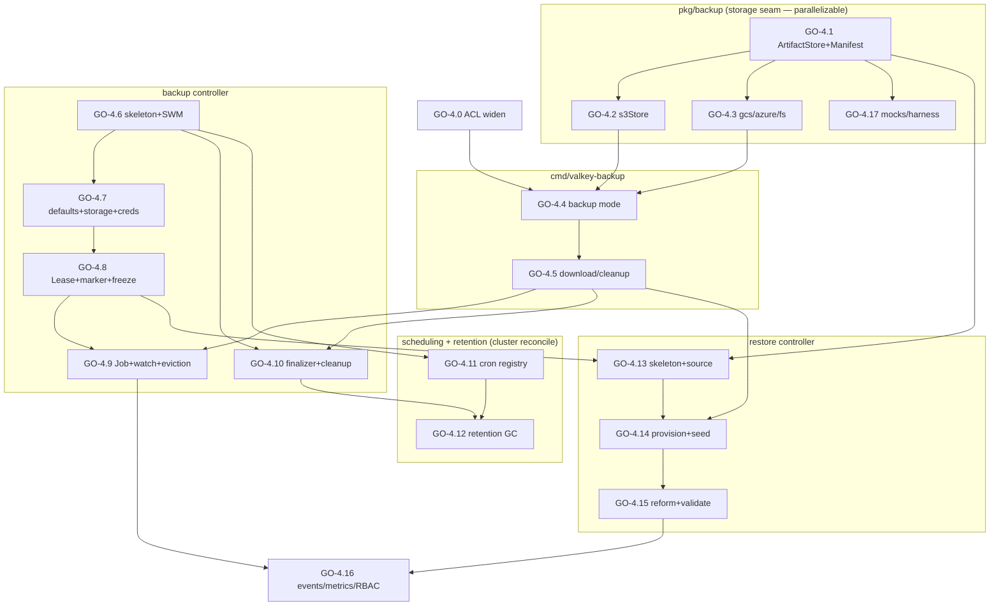

# Phase 4 — Backup & Restore

> **Milestone M4 (Go-led).** Implementation plan for the operator's data-protection subsystem:
> the `pkg/controller/perconavalkeybackup` and `pkg/controller/perconavalkeyrestore` phase
> machines, the `cmd/valkey-backup` sidecar (`BGSAVE` → stream RDB to object storage; download +
> seed on restore; manifest-first cleanup), the repository-pattern `ArtifactStore` storage
> abstraction (S3 / GCS / Azure / fs-test), in-operator cron-driven scheduled backups, finalizer-
> based retention/GC with write-last/delete-first crash-safety, and the `NewCluster` / `InPlace`
> restore flow that provisions a target cluster, seeds each shard's RDB, re-forms topology, and
> validates full 16384-slot coverage.
>
> **Source of truth.** Every task below traces to a section of the architecture docs:
> [../architecture/06-backup-restore.md](../architecture/06-backup-restore.md) (the authoritative
> backup/restore design — goals/invariants, CRDs, execution model, Lease, scheduling, retention/GC,
> restore flow, storage abstraction, consistency, RBAC/events/metrics, PITR-deferred),
> [../architecture/03-api-design.md](../architecture/03-api-design.md) (the `PerconaValkeyBackup` /
> `PerconaValkeyRestore` field catalogues, the cluster `spec.backup` block, ownership/GC, printer
> columns). Re-form helpers reused by restore come from
> [../architecture/05-data-plane.md](../architecture/05-data-plane.md); the per-cluster Lease /
> backup-in-progress marker / cron registry mechanics come from
> [../architecture/04-control-plane.md](../architecture/04-control-plane.md). **PITR is explicitly
> out of scope** ([06 §1.2, §11](../architecture/06-backup-restore.md)). Where the docs are silent,
> an **OPEN QUESTION** is recorded rather than inventing design.

---

## 1. Objective & demoable outcome

**Objective.** Give the Percona Operator for Valkey a correct, conservative **RDB-snapshot-per-shard**
backup and restore story. After M4, an operator can take on-demand and scheduled backups of a
sharded `mode: cluster` `PerconaValkeyCluster` to object storage, enforce retention with crash-safe
artifact GC, and restore any slot-complete backup into a freshly provisioned cluster — all proven
end-to-end against MinIO (S3-compatible) in CI.

**Demoable outcome (what concretely works when this phase is done):**

1. `kubectl apply` a `PerconaValkeyBackup` (just `clusterName` + `storageName`) against a healthy
   3-shard cluster and watch it walk `"" → Starting → Running → Succeeded` with
   `status.slotCoverage: complete`, `status.destination: s3://…/<backup>/`, and a per-shard
   `status.shards[]` recording slot ranges, RDB object keys, sizes and SHA-256
   ([06 §3.2, §4.6](../architecture/06-backup-restore.md)).
2. Inspect the object store: each `shard-<i>/dump.rdb` is present **and** a `manifest.json` was
   written **last** at the destination root with full 16384-slot coverage
   ([06 §4.5, §6.1](../architecture/06-backup-restore.md)).
3. Add `spec.backup.schedule[]` (cron + `keep: 3`) to the cluster and watch the operator create
   **owned** `PerconaValkeyBackup` objects on each fire, then GC the oldest beyond `keep` — each
   deletion running the finalizer cleanup Job that deletes `manifest.json` **first**, then RDB
   shards, then the empty prefix ([06 §5, §6](../architecture/06-backup-restore.md)).
4. Apply a `PerconaValkeyRestore` with `strategy: NewCluster` referencing a `Succeeded` backup and
   watch it provision a new `PerconaValkeyCluster`, seed each primary's `dump.rdb` via an init
   container (boot with `appendonly no`, re-enable AOF post-load), re-form topology with the exact
   manifest slot map, and reach `Succeeded` only when all 16384 slots are covered and replica links
   are up ([06 §7.4, §7.5](../architecture/06-backup-restore.md)).
5. Try to back up while a smart-update / rebalance holds the per-cluster Lease and watch the second
   actor stay `Starting` with a `BackupWaitingForLock` Event and requeue, then proceed once the
   Lease frees ([06 §4.7](../architecture/06-backup-restore.md)).
6. Kill the operator mid-cleanup and watch the `Terminating` backup self-heal on the next
   finalizer-audit pass (idempotent re-cleanup), never leaving a manifest pointing at missing RDBs
   ([06 §6.1](../architecture/06-backup-restore.md)).

> **In-scope topology mode:** `cluster` (the sharded v1alpha1 target). The machinery degenerates
> cleanly to `replication` (single logical shard) — exercised lightly — and `standalone` is out of
> scope ([06 §1.1](../architecture/06-backup-restore.md)).

---

## 2. Milestone & exit criteria

**Milestone:** **M4 Backup/Restore** — on-demand + scheduled RDB backup to object storage; restore
into a new cluster; slot-coverage-gated.

**Exit criteria (all must hold):**

| # | Criterion | Trace |
|---|-----------|-------|
| E1 | On-demand `PerconaValkeyBackup` reaches `Succeeded` with `slotCoverage: complete`, full `status.shards[]`, and `manifest.json` written last. | [06 §4.3–4.6](../architecture/06-backup-restore.md) |
| E2 | A backup is `Failed`/`Degraded` (not silently wrong) on any shard snapshot error or incomplete slot union, per `strict`/`best-effort`. | [06 §1.3, §4.4, §9](../architecture/06-backup-restore.md) |
| E3 | Backup/restore/smart-update are mutually exclusive per cluster via the `valkey-<cluster>-backup-lock` Lease; second actor requeues with `BackupWaitingForLock`; missing/expired Lease fails open. | [06 §4.7](../architecture/06-backup-restore.md) |
| E4 | `spec.backup.schedule[]` drives an in-operator `robfig/cron` registry that creates owned `PerconaValkeyBackup`s; overlap is skipped (`Forbid`); missed fires run at most one catch-up. | [06 §5.1, §5.2](../architecture/06-backup-restore.md) |
| E5 | Retention GC keeps `keep`/`keepAge` most-recent `Succeeded`/`Degraded` per schedule; surplus deleted via `percona.com/delete-backup` finalizer (manifest-first delete). | [06 §5.3, §6](../architecture/06-backup-restore.md) |
| E6 | Finalizer teardown is crash-safe: write-last manifest on create, delete-first manifest on teardown, finalizer-audit retries idempotently; `BackupCleanupFailed` on stuck `Terminating`. | [06 §6, §6.1](../architecture/06-backup-restore.md) |
| E7 | `PerconaValkeyRestore strategy: NewCluster` provisions a cluster, seeds each shard's RDB (sha256-verified), re-forms exact manifest slot map, and reaches `Succeeded` only at proven 16384-slot coverage. | [06 §7.4, §7.5](../architecture/06-backup-restore.md) |
| E8 | Partial-coverage source rejected at restore validation unless `valkey.percona.com/allow-partial-restore: "true"`; shard-count / sha256 / engine-compat mismatches fail loudly before/at seeding. | [06 §7.5, §9.3](../architecture/06-backup-restore.md) |
| E9 | `ArtifactStore` is the only storage seam; S3 (incl. `endpointUrl`/MinIO), GCS, Azure implemented; `fsStore` test-only; credentials Secret-referenced, never inline/logged. | [06 §8](../architecture/06-backup-restore.md) |
| E10 | RBAC, Events, and the metric/alert wiring stubs added per [06 §10]; the operator process never authenticates to object storage. | [06 §8.2, §10](../architecture/06-backup-restore.md) |
| E11 | DoD baseline: compiles, gofmt/vet/golangci-lint/gosec clean, generated artifacts regenerated, ≥80% pkg coverage on `pkg/controller/perconavalkeybackup`, `pkg/controller/perconavalkeyrestore`, `pkg/backup`, `cmd/valkey-backup`, CI green, docs updated. | charter |

---

## 3. Prerequisites (which earlier phases/task-ids must be complete)

M4 is strictly bottom-up: it depends on **all of M0, M1, M2, M3**. Task ids below (authored in the
M0–M3 phase docs) are dependency keys; M4 tasks depend on the artifacts they produce.

| Prereq | What M4 needs from it |
|--------|------------------------|
| **M0 Bootstrap** (GO-0.*, OPS-0.*) | Repo scaffolded; `cmd/` multi-binary build; `pkg/naming`; `pkg/version/version.txt`; Makefile `generate/manifests/test`; CI (unit+lint+gosec) green; envtest assets. |
| **M1 API** (GO-1.*, OPS-1.*) | `pkg/apis/valkey/v1alpha1` types for `PerconaValkeyBackup`/`PerconaValkeyRestore` (incl. `BackupStorageSpec`, `BackupScheduleSpec`, `BackupRetentionSpec`, `BackupContainerOptions`, `ShardBackupStatus`, `BackupSource`) and the cluster `spec.backup` block; `CheckNSetDefaults` skeleton; CEL immutability (`clusterName`/`storageName`/`type` immutable; one-of `backupName`/`backupSource`); generated deepcopy/CRD/RBAC; CRDs install in envtest. |
| **M2 ValkeyNode** (GO-2.*, OPS-2.*) | `ValkeyNode` reconciler with **init-container injection** and ConfigMap/PVC handling (restore seeds via an init container, [06 §7.4](../architecture/06-backup-restore.md)); `applyLiveConfig`/`CONFIG SET` proven (restore re-enables AOF). |
| **M3 Cluster** (GO-3.*, OPS-3.*) | `pkg/valkey` protocol layer (`ClusterState`, `ClusterNodes`/`INFO` parse, `MEET`/`ADDSLOTSRANGE`/`REPLICATE` typed commands) **reused by `cmd/valkey-backup` and restore re-form**; the cluster controller's per-cluster **Lease + backup-in-progress marker** and **`isBackupRunning()` smart-update gate** (the consumer side); the in-reconcile **cron registry** plumbing pattern; `reconcileValkeyNodes` one-at-a-time CRUD that the restore re-form rides on; the `_operator` ACL render (`reconcileUsersAcl`). |

> **Cross-cutting forward dependency (declared, not blocking the critical path).** The M3 canonical
> `_operator` ACL ([05 §10](../architecture/05-data-plane.md), [07 §4.3](../architecture/07-security.md))
> **already** carries `+cluster` (MEET/ADDSLOTSRANGE/REPLICATE) and `+config|set` (the restore's
> `CONFIG SET appendonly yes`). The *only* genuinely new token M4 needs over that baseline is
> **`+bgsave`** (so the Job, which authenticates as `_operator` per [06 §4.2](../architecture/06-backup-restore.md),
> can snapshot without `NOPERM`), plus the separate `_backup` system user. M4 ships this minimal
> delta as **GO-4.0** (small, see below); the full security surface lands in **M5 Security**
> ([07 §4](../architecture/07-security.md)). **Note:** [06 §4.2](../architecture/06-backup-restore.md)'s
> ACL note phrases this as "widen to include `+bgsave` + `+config|set` + `+cluster`", which overstates
> the delta versus the 05/07 canonical (those two are already granted) — tracked as **OPEN QUESTION Q5**.

---

## 4. Scope — In / Out

### In scope

- **`pkg/backup`** repository-pattern `ArtifactStore` (Upload/Download/Delete/WriteManifest/
  ReadManifest/URL) with `s3Store` (AWS SDK, honours `endpointUrl`/MinIO), `gcsStore`, `azureStore`,
  `fsStore` (test-only); destination-prefix parsing (`s3://`/`gs://`/`azure://`/`pvc/`); the
  `Manifest` type; credential-from-env wiring ([06 §8](../architecture/06-backup-restore.md)).
- **`cmd/valkey-backup`** sidecar binary, three modes: backup (resolve live primary per shard from
  `CLUSTER NODES`, `BGSAVE`, poll `rdb_last_bgsave_status:ok`, stream `dump.rdb` + SHA-256 to the
  store, write manifest last), `--cleanup` (manifest-first delete), `--download --shard=<i>` (verify
  sha256, write `/data/dump.rdb` for the restore init container)
  ([06 §4.2–4.5, §6.1, §7.4](../architecture/06-backup-restore.md)).
- **`pkg/controller/perconavalkeybackup`** phase machine (`"" → Starting → Running → Succeeded /
  Failed / Error / Degraded`): `CheckNSetDefaults` (resolve `storageName`, validate creds Secret
  presence, hydrate `destination`), Lease acquire/renew/release + backup-in-progress marker,
  topology-freeze precondition, single backup Job creation + watch, status hydration from manifest,
  slot-coverage gate, eviction/deadline handling, finalizer-driven artifact GC, retention pass
  ([06 §4, §5.3, §6](../architecture/06-backup-restore.md)).
- **In-operator scheduled backups** — `robfig/cron` registry keyed by `(cluster, schedule.name)`,
  synced inside the **cluster** reconcile loop, creating owned `PerconaValkeyBackup`s; overlap/missed
  policies ([06 §5](../architecture/06-backup-restore.md)).
- **`pkg/controller/perconavalkeyrestore`** phase machine (`"" → Provisioning → Seeding → Forming →
  Validating → Succeeded / Failed / Error`): source resolve (`backupName` xor `backupSource`), read
  manifest, compat checks, per-cluster Lease, `NewCluster` provision-from-`clusterTemplate` with
  restore init container, re-form via M3 helpers, 16384-slot validation, partial-coverage gate
  ([06 §7](../architecture/06-backup-restore.md)).
- **Watches/Owns** wiring: Backup `Owns(Job)` + watches the referenced cluster; Restore `Owns(Job)`,
  creates/updates `PerconaValkeyCluster`, watches it; cluster controller registers the backup/restore
  controllers and the schedule cron ([03 §1](../architecture/03-api-design.md),
  [06 §10](../architecture/06-backup-restore.md)).
- **RBAC / Events / metric+alert stubs** for the two controllers ([06 §10](../architecture/06-backup-restore.md)).

### Out of scope (deferred to later milestones / sibling phases)

- **PITR / AOF streaming / `cmd/valkey-aof-shipper`** — **explicitly deferred beyond v1alpha1**
  ([06 §1.2, §11](../architecture/06-backup-restore.md)). The reserved `type` field and per-shard
  `replOffset`/`masterReplOffset` in the manifest are kept forward-compatible **only**.
- **CSI volume snapshots; `incremental` backups** — deferred ([06 §1.2](../architecture/06-backup-restore.md)).
- **Full security surface** (the `_operator` ACL widening + `_backup` user beyond the GO-4.0 stub,
  TLS material the Job uses end-to-end, NetworkPolicy storage-egress) → **M5**
  ([07](../architecture/07-security.md)).
- **Backup/restore metrics emitter + Prometheus alert rules** (`backup_slot_coverage`,
  `BackupJobEvicted`/`BackupCleanupFailed` alerts) — the **Events** and metric **registration**
  hooks are stubbed here; the exporter/alert wiring is **M5** ([08](../architecture/08-observability.md)).
- **`per-shard fan-out` (`parallelShards`) and `replica-source` (`preferReplica`) snapshots** — the
  `containerOptions` knobs exist (M1 type), but v1alpha1 default is single-Job/primary-source; fan-out
  is left as a follow-up ([06 §4.1, §4.2](../architecture/06-backup-restore.md)) — see OPEN QUESTION Q4.
- **Helm chart values / OLM bundle changes for backup** → **M7** ([10](../architecture/10-distribution-release.md)).
- **GKE e2e of backup/restore** (Jenkins, `run-*.csv`) → **M8** ([11](../architecture/11-testing-qa.md));
  M4 ships only **kuttl smoke** against in-cluster MinIO.

---

## 5. Go Developer Track

> Task IDs `GO-4.n`. Effort scale: XS≈0.5d, S≈1–2d, M≈3–5d, L≈6–9d, XL≈10–15d. DoD baseline
> (compiles; unit/envtest ≥80% pkg coverage; generated artifacts regenerated; gofmt/vet/
> golangci-lint/gosec clean; docs updated; CI passes) applies to **every** task; the per-task DoD
> column lists only the **phase-specific** acceptance.

| id | title | description | files / packages | key types / funcs | depends-on | DoD (phase-specific) | tests | effort | risk |
|----|-------|-------------|------------------|-------------------|------------|----------------------|-------|--------|------|
| **GO-4.0** | `_operator` `+bgsave` add + `_backup` user (stub for M5) | Extend the M3 `reconcileUsersAcl` render so `_operator` gains **`+bgsave`** — the *only* genuinely new token over the M3 canonical `_operator` ACL, which already carries `+cluster` (MEET/ADDSLOTSRANGE/REPLICATE) and `+config\|set` per [05 §10](../architecture/05-data-plane.md)/[07 §4.3](../architecture/07-security.md), so **do NOT re-add or duplicate those**. Also render the `_backup` system user verbatim from the [07 §4.3] canonical (`on #<sha256> resetchannels resetkeys -@all +bgsave +lastsave +save +info +wait +ping`) into `internal-<cluster>-acl`; its password into `internal-<cluster>-system-passwords`. Minimal slice of M5's ACL work needed so the backup/restore Job (auth as `_operator` per [06 §4.2](../architecture/06-backup-restore.md)) avoids `NOPERM` on `BGSAVE`. See OPEN QUESTION Q5 (06 §4.2 wording overstates the delta vs the 05/07 canonical). | `pkg/controller/perconavalkeycluster/users.go` (extend), `pkg/naming` (consts) | extend `renderUsersAcl`; `SystemUserBackup` const | M3 (`reconcileUsersAcl`) | `_operator` gains exactly `+bgsave` (idempotent — `+cluster`/`+config\|set` unchanged); `_backup` rendered byte-identical to [07 §4.3] canonical; passwords hashed `#<sha256>`. | unit: ACL render golden (deterministic, sorted) asserting `_operator` delta is `+bgsave`-only; `NOPERM` regression for `_backup` keyspace | S (1.5d) | M — drift from M5 canonical ACL; 06-vs-05/07 ACL-wording mismatch (Q5) ([06 §4.2](../architecture/06-backup-restore.md), [07 §4.3](../architecture/07-security.md)) |
| **GO-4.1** | `ArtifactStore` interface + `Manifest` + destination helpers | Define the repository-pattern seam and the manifest type; destination-prefix parse/format (`s3://`/`gs://`/`azure://`/`pvc/`), `StorageTypePrefix`/`BucketAndPrefix`/`BackupName` helpers mirroring PXC. Pure, backend-agnostic. | `pkg/backup/store.go`, `pkg/backup/manifest.go`, `pkg/backup/destination.go` | `ArtifactStore` iface, `Manifest`, `ShardManifest`, `ParseDestination`, `(Store)URL` | M1 (types) | Interface compiles; manifest JSON round-trips; prefixes parse for all four backends. | unit: manifest marshal/unmarshal; destination parse table | S (2d) | L |
| **GO-4.2** | `s3Store` (+ MinIO/`endpointUrl`) | AWS SDK v2 implementation: multipart streaming `Upload` (incremental SHA-256 over the stream, never buffer whole RDB), `Download` (verify sha256), prefix-recursive `Delete`, `WriteManifest`/`ReadManifest`. Explicit bucket-URL construction (no regional auto-routing) so `endpointUrl` for MinIO/non-AWS works. | `pkg/backup/s3.go` | `s3Store`, `newS3Store(cfg, creds)` | GO-4.1 | Streams (memory independent of object size); honours `endpointUrl`; abort-on-error leaves no manifest. | unit vs MinIO (OPS-4.6) + fake; `endpointUrl` routing test | M (4d) | M — custom-endpoint region trap ([06 §8.2](../architecture/06-backup-restore.md)) |
| **GO-4.3** | `gcsStore` + `azureStore` + `fsStore` | GCS (service-account JSON via `GOOGLE_APPLICATION_CREDENTIALS` file path), Azure Blob (`AZURE_STORAGE_ACCOUNT`/`_KEY`), and `fsStore` (local FS, **test-only**, `pvc/` prefix; CEL-warned). Same streaming/checksum discipline as S3. | `pkg/backup/gcs.go`, `pkg/backup/azure.go`, `pkg/backup/fs.go` | `gcsStore`, `azureStore`, `fsStore` | GO-4.1 | All three satisfy `ArtifactStore`; `fsStore` enables hermetic unit tests; creds from env only. | unit: `fsStore` full round-trip incl. manifest-last/first; GCS/Azure against emulators where available | M (4d) | M — three SDKs, cred env shapes |
| **GO-4.4** | `cmd/valkey-backup` — backup mode | Entry binary: resolve live primary per shard from `CLUSTER NODES`/`INFO` (never labels), record `master_repl_offset` + slot ranges, `BGSAVE`, poll `INFO persistence` until `rdb_bgsave_in_progress:0`+`rdb_last_bgsave_status:ok` (bounded), stream `dump.rdb` → `<dest>/shard-<i>/dump.rdb` via `ArtifactStore`, append manifest fragment; **write `manifest.json` LAST**; union-coverage assertion (0–16383, no gap/overlap) → `strict` fail / `best-effort` partial. Authenticates as `_operator`, `ForceSingleClient=true`. | `cmd/valkey-backup/main.go`, `cmd/valkey-backup/backup.go`, `cmd/valkey-backup/rdbreader.go` | `runBackup`, `snapshotShard`, `assertCoverage`, in-pod RDB reader path | GO-4.1, GO-4.2, GO-4.3, M3 (`pkg/valkey`), GO-4.0 | Live-primary resolution; ordered ascending `shardIndex`; manifest-last; coverage gate exact; idempotent re-issue of `BGSAVE`. | unit: coverage union (gap/overlap/complete), shard-skip under best-effort; integration vs Valkey 9 + MinIO | L (8d) | H — `BGSAVE` polling + in-pod `dump.rdb` exfiltration mechanism ([06 §4.2](../architecture/06-backup-restore.md)); see OPEN QUESTION Q1 |
| **GO-4.5** | `cmd/valkey-backup` — `--download` + `--cleanup` modes | `--download --shard=<i>`: fetch `shard-<i>/dump.rdb`, verify sha256 against manifest, write `/data/dump.rdb` for the restore init container (fail pod start on mismatch). `--cleanup`: delete `manifest.json` **first**, then `shard-*/dump.rdb`, then empty prefix; idempotent (already-gone = success). | `cmd/valkey-backup/download.go`, `cmd/valkey-backup/cleanup.go` | `runDownload`, `runCleanup` | GO-4.4 | sha256-verified seed; manifest-first delete; re-run-safe. | unit: download verify/mismatch; cleanup idempotency + delete-order assertion | M (3d) | M — delete-order invariant is correctness-critical ([06 §6.1](../architecture/06-backup-restore.md)) |
| **GO-4.6** | Backup controller skeleton + phase machine + SetupWithManager | `For(&PerconaValkeyBackup{})`, `Owns(batchv1.Job)`, `Watches(PerconaValkeyCluster → backups by clusterName)`; phase state machine `"" → Starting → Running → {Succeeded,Failed,Error,Degraded}`; `status.state` derived from conditions (`Initialized/Running/Uploaded/Verified/Complete`); requeue taxonomy; deletion-branch dispatch to GO-4.10. | `pkg/controller/perconavalkeybackup/controller.go`, `add_perconavalkeybackup.go`, `status.go`, `conditions.go` | `Reconciler`, `phase` enum, `deriveState`, `setCondition` | M1, M3 | State machine transitions only forward; terminal states sticky; conditions drive state. | envtest: create CR → Starting; fake Job complete → Succeeded; no panic | M (4d) | M |
| **GO-4.7** | Backup `CheckNSetDefaults` + storage resolution + creds presence | Resolve `storageName` into the cluster's `spec.backup.storages[name]` (no fallback; typo → `Failed` at execution, surfaced loudly); hydrate `status.destination`/`storageName`/`s3\|gcs\|azure`; validate the named `credentialsSecret` exists with expected keys (the **only** time the operator touches the Secret — presence check, never auth, never log). | `pkg/controller/perconavalkeybackup/defaults.go`, `pkg/backup/credentials.go` | `CheckNSetDefaults`, `resolveStorage`, `validateCredsSecret` | GO-4.6, GO-4.1 | Fail-fast on missing storage/Secret/keys; creds never copied to status/logs. | envtest: missing storage → Failed; missing Secret/key → Failed w/ reason; happy path hydrates status | M (3d) | M — silent storage-name mismatch is the classic Percona trap ([06 §8.2](../architecture/06-backup-restore.md)) |
| **GO-4.8** | Per-cluster Lease + backup-in-progress marker + topology-freeze | Acquire `valkey-<cluster>-backup-lock` Lease (shared w/ control plane, in-proc lock); on contention leave `Starting`, emit `BackupWaitingForLock`, requeue w/ backoff; auto-renew while Job runs; set backup-in-progress marker (pauses smart-update/rebalance); precondition: source cluster `Ready` and not mid-rebalance/scale; release on terminal + clear marker; fail-open on missing/expired Lease. | `pkg/controller/perconavalkeybackup/lease.go`, `pkg/k8s/lease.go` (shared) | `acquireClusterLease`, `renewLease`, `releaseLease`, `setBackupInProgress`, `clusterSnapshotReady` | GO-4.6, M3 (Lease/marker) | Mutual exclusion holds; renew inside `leaseDurationSeconds`; fail-open when Lease absent/stale. | envtest: contention → requeue + Event; renew loop; fail-open path | M (5d) | H — Lease races vs control plane; wedge if release missed ([06 §4.7](../architecture/06-backup-restore.md)) |
| **GO-4.9** | Backup Job builder + watch + status hydration + eviction/deadline | Build the single backup Job (SA `spec.backup.serviceAccountName`, image `spec.backup.image`, creds Secret as env, modest requests `cpu:500m/mem:256Mi`, **no limits**, `activeDeadlineSeconds`); watch to terminal; on success read `manifest.json` → hydrate `status.shards[]/slotCoverage/valkeyVersion/completed`; detect **evicted** Job → `Failed` + release Lease + `BackupJobEvicted`; `activeDeadlineSeconds` exceeded → `Failed`; `startingDeadlineSeconds` exceeded before start → `Failed`; re-adopt Job by labels on operator restart. | `pkg/controller/perconavalkeybackup/job.go`, `watch.go` | `desiredBackupJob`, `watchJob`, `hydrateFromManifest`, `handleEviction` | GO-4.7, GO-4.8, GO-4.4 | Streaming Job (no mem limit); manifest-driven status; eviction/deadline → loud Failed; re-adopt idempotent. | envtest: Job→Succeeded hydrates status; evicted→Failed+Event; deadline→Failed | L (6d) | H — eviction/lease-release coupling ([06 §4.7, §4.8](../architecture/06-backup-restore.md)) |
| **GO-4.10** | `percona.com/delete-backup` finalizer + cleanup Job + crash-safety | Add finalizer on `New`; on delete spawn `cmd/valkey-backup --cleanup` Job (creds mounted; **never** owner-ref the user creds Secret so it outlives the cluster); manifest-first delete; remove finalizer only on confirmed cleanup; on failure keep finalizer + `Terminating` + `BackupCleanupFailed`; periodic finalizer-audit re-drives stuck `Terminating`. | `pkg/controller/perconavalkeybackup/finalizers.go`, `cleanup.go`, `audit.go` | `handleDeletion`, `desiredCleanupJob`, `finalizerAudit` | GO-4.6, GO-4.5 | Manifest-first; idempotent re-cleanup; loud on stuck; creds-Secret-outlives-cluster caveat honoured. | envtest: delete→cleanup Job→finalizer removed; crash mid-clean→audit self-heals; missing Secret→Terminating+Event | L (6d) | H — stuck finalizer / orphaned artifacts ([06 §6, §6.1](../architecture/06-backup-restore.md)) |
| **GO-4.11** | Scheduled-backup cron registry (in cluster reconcile) | In-operator `robfig/cron` registry keyed `(cluster, schedule.name)`, synced to `spec.backup.schedule[]` **inside the cluster reconcile** with lifecycle tied to the CR (create/update/remove crons; removed when `backup.enabled:false` or CR deleted) — per [02 §repo-layout](../architecture/02-repo-layout.md) (file `backup.go`) and [04 §control-plane](../architecture/04-control-plane.md) the registry lives **in the `perconavalkeycluster` controller package, NOT a new top-level `pkg/cron`** (M3 already establishes this in-reconcile cron pattern, reused here). On fire: create an **owned** `PerconaValkeyBackup` named `<cluster>-<schedule>-<UTC-ts>` with owner-ref + labels + `scheduled-at` annotation. Missed-fire = at-most-one catch-up; overlap = skip (`Forbid`) + `BackupSkippedOverlap`. | `pkg/controller/perconavalkeycluster/schedule.go` (registry type + sync, reusing the M3 cron plumbing) | `syncScheduleRegistry`, `cronCallback`, `createScheduledBackup` | GO-4.6, M3 (in-reconcile cron registry) | Crons tied to CR; one catch-up; overlap skipped; generated backups owned + labelled; registry stays inside the cluster controller package. | envtest+fake clock: fire creates owned backup; overlap skip; missed catch-up; disable removes crons | M (5d) | M — duplicate fires across leader change / clock jitter ([06 §5.1, §5.2](../architecture/06-backup-restore.md)) |
| **GO-4.12** | Retention GC pass | After each schedule run (and a low-freq sweep): list `Succeeded`/`Degraded` backups by label `backup-schedule=S`, sort by `completed` desc, delete surplus beyond `keep`/older than `keepAge` (which triggers GO-4.10 finalizer cleanup); `Failed`/`Error` retained briefly then age-GC'd separately. | `pkg/controller/perconavalkeycluster/retention.go` | `runRetention`, `selectSurplus` | GO-4.11, GO-4.10 | Only terminal-success count toward `keep`; deletions go through finalizer; deterministic selection. | envtest: keep=2 over 4 backups → 2 deleted; age threshold; failed retained | S (2d) | M — accidental over-deletion ([06 §5.3](../architecture/06-backup-restore.md)) |
| **GO-4.13** | Restore controller skeleton + phase machine + source resolve | `For(&PerconaValkeyRestore{})`, `Owns(Job)`, watches the target cluster; phase machine `"" → Provisioning → Seeding → Forming → Validating → {Succeeded,Failed,Error}`; resolve `backupName` **xor** `backupSource`; read `manifest.json`; validate engine/`crVersion` compat + shard count vs `clusterTemplate`; acquire per-cluster restore Lease; conditions `SourceResolved/TargetProvisioned/DataSeeded/ClusterFormed/SlotsValidated/Complete`. | `pkg/controller/perconavalkeyrestore/controller.go`, `add_perconavalkeyrestore.go`, `source.go`, `status.go` | `Reconciler`, `phase` enum, `resolveSource`, `validateCompat` | M1, M3, GO-4.1, GO-4.8 | One-of source enforced; compat/shard-count fail before provisioning; Lease blocks during backup. | envtest: resolve from `backupName` and `backupSource`; shard mismatch→Failed pre-provision | M (5d) | M |
| **GO-4.14** | Restore `NewCluster` provision + RDB seed (init container) | Create the target `PerconaValkeyCluster` from `clusterTemplate` (restore marker; `shards` must equal manifest or inherit); inject a **restore init container** in each shard-primary node (`cmd/valkey-backup --download --shard=<i>` → `/data/dump.rdb`); boot with **`appendonly no`** so RDB loads, then `CONFIG SET appendonly yes` post-load; replicas seeded empty (full resync via REPLICATE). | `pkg/controller/perconavalkeyrestore/provision.go`, `seed.go` | `provisionTargetCluster`, `restoreInitContainer`, `reEnableAOF` | GO-4.13, GO-4.5, M2 (init-container injection) | AOF-vs-RDB boot interaction handled (the one place persistence is overridden for boot); sha256-verified seed. | envtest: cluster created w/ restore init container; AOF override asserted; mismatch→Failed | L (7d) | H — silent zero-key restore if `appendonly yes` masks RDB ([06 §7.4](../architecture/06-backup-restore.md)) |
| **GO-4.15** | Restore re-form topology + slot-coverage validation | Reuse M3 helpers: `CLUSTER MEET` all seeded primaries (batch, idempotent), `CLUSTER ADDSLOTSRANGE` the **exact manifest slot map** per `shardIndex` (no rebalance), `CLUSTER REPLICATE` attach replicas; poll `CLUSTER INFO` to `cluster_state:ok` + `cluster_slots_assigned:16384` + replica `master_link_status:up`; `Succeeded` only at proven full coverage; reject partial-coverage source unless `allow-partial-restore` annotation; resume cluster reconciliation; release Lease. | `pkg/controller/perconavalkeyrestore/reform.go`, `validate.go` | `reformTopology`, `validateSlotCoverage`, `resumeCluster` | GO-4.14, M3 (`meet`/`addslots`/`replicate`) | Exact slot map reproduced; full-coverage gate; partial rejected by default; failed cluster left for inspection. | envtest+fake: 3-shard re-form → 16384 covered; slot gap→Failed; partial source rejected/overridden | L (7d) | H — exact slot-map reproduction; partial-coverage policy ([06 §7.5](../architecture/06-backup-restore.md)) |
| **GO-4.16** | Events, metric/alert hooks, RBAC markers | Emit the full backup/restore Event vocabulary ([06 §10]); register metric **hooks/stubs** (`backup_slot_coverage`, duration, bytes, evictions, cleanup failures) for M5 to wire; add `+kubebuilder:rbac` markers for both controllers (cluster/node get/list/watch, cluster create/update for NewCluster, Job CRUD, named-Secret get, backup/restore status+finalizers, Leases, Events). | `pkg/controller/perconavalkeybackup/*`, `pkg/controller/perconavalkeyrestore/*`, RBAC markers | event constants, metric registry hooks, rbac markers | GO-4.9, GO-4.15 | All §10 Events emitted at the right transitions; RBAC least-privilege (no blanket Secret); markers regenerate clean. | unit: event emission per transition; `make manifests` RBAC diff reviewed | S (2d) | L |
| **GO-4.17** | mockgen + test harness for M4 | `//go:generate mockgen` for `ArtifactStore` and any `valkey-backup` client seam; fake `Manifest`/`ClusterState` builders; Ginkgo/Gomega envtest suite scaffolding for both controllers reusable by all M4 tasks. | `pkg/backup/mocks/`, `pkg/controller/perconavalkeybackup/suite_test.go`, `pkg/controller/perconavalkeyrestore/suite_test.go` | generated mocks, `fakeManifest(...)`, `fakeStore()` | GO-4.1 | Mocks regenerate via `make generate`; suite boots all four CRDs. | meta — exercised by all M4 tests | S (2d) | L |

### 5.1 Task-dependency graph (Go track)



---

## 6. DevOps / Platform Track

> Task IDs `OPS-4.n`. **This phase is Go-dominated** (controllers + sidecar + storage). The DevOps
> track is primarily *supporting*: it builds the new `cmd/valkey-backup` image, stands up the
> object-store test infrastructure (MinIO + fake GCS/Azure), extends the envtest/kuttl harness for
> backup/restore, and adds RBAC/manifest regeneration. No release/Helm/OLM work here — that is M7.

| id | title | description | files / packages | depends-on | DoD (phase-specific) | tests | effort | risk |
|----|-------|-------------|------------------|------------|----------------------|-------|--------|------|
| **OPS-4.1** | `cmd/valkey-backup` image + multi-binary build | Add a `Dockerfile`/build target for `percona/valkey-backup` (and bake the sidecar into the `percona/percona-valkey` DB image per repo-layout); wire `make build` for the new `cmd/` binary; pin `IMAGE_BACKUP` in `e2e-tests/release_versions`; multi-arch (amd64/arm64) buildx. | `Dockerfile.backup`, `Makefile` (build targets), `e2e-tests/release_versions` | GO-4.5 | `make build` produces the backup image; sidecar baked into DB image; `IMAGE_BACKUP` pinned; multi-arch. | CI buildx dry-run | S (2d) | M — sidecar-in-DB-image plumbing ([02 §2](../architecture/02-repo-layout.md), [10 §2](../architecture/10-distribution-release.md)) |
| **OPS-4.2** | RBAC + manifest regeneration for backup/restore | Run `make manifests` after GO-4.16 markers; verify `deploy/bundle.yaml`/`cw-bundle.yaml` gain Job/Lease/named-Secret/finalizer rules; add `check-generate` coverage so CRD/RBAC drift fails CI; confirm no blanket Secret access. | `deploy/*` (regenerated), `config/rbac/*`, CI `check-generate` | GO-4.16 | RBAC regenerated + reviewed least-privilege; drift gate green. | CI `git diff --exit-code` after generate | XS (0.5d) | L |
| **OPS-4.3** | envtest harness for backup/restore controllers | Extend `make test` so the Ginkgo backup/restore suites boot all four CRDs; ensure `KUBEBUILDER_ASSETS` covers the pinned k8s; raise per-pkg 80% coverage gate for `perconavalkeybackup`, `perconavalkeyrestore`, `pkg/backup`, `cmd/valkey-backup`. | `Makefile` (`test`), `.golangci.yml` coverage, CI | OPS-0.*, GO-4.17 | `make test` green; coverage gate enforced for the four new packages. | the suites (meta) | S (2d) | M — coverage-gate flakiness on Job-watch paths |
| **OPS-4.4** | golangci-lint + gosec for new packages | Add `pkg/backup`, `cmd/valkey-backup`, both controllers to lint scope; gosec rules for credential handling (no creds in logs/status, no hardcoded secrets) and object-key construction (no unsanitized path joins → path traversal); justify any `// nolint`. | `.golangci.yml`, `Makefile` (`lint`) | OPS-0.* | Clean lint/gosec; gosec confirms no creds logged, no path-traversal in keys. | CI lint+gosec stage | XS (0.5d) | L |
| **OPS-4.5** | Backup Job RBAC: ServiceAccount + creds-mount overlay | Provide the default backup-Job ServiceAccount (`spec.backup.serviceAccountName` default) and the manifest pattern that mounts the `credentialsSecret` as env into the Job (`AWS_*` / Google JSON path / `AZURE_*`) — **operator process never authenticates**. Document the creds-Secret-outlives-cluster caveat. | `config/backup/*.yaml`, `deploy/*` | GO-4.7, GO-4.10 | Job SA exists; creds mount pattern correct per backend; operator SA has only `get` on named Secret. | manifest-render + envtest Job spec assertion | S (1.5d) | M — credential boundary B5 ([06 §8.2](../architecture/06-backup-restore.md), [07 §8](../architecture/07-security.md)) |
| **OPS-4.6** | In-cluster MinIO + fake GCS/Azure test infra | Stand up MinIO (S3-compatible, `endpointUrl`) as a kind/envtest fixture for integration + kuttl; provide fake-GCS-server / Azurite where feasible; seed buckets + creds Secrets; expose as Make vars + a `lib.sh` helper. | `e2e-tests/conf/minio/*`, `hack/minio.sh`, `Makefile` vars | OPS-4.3 | MinIO reachable from Jobs in kind; `endpointUrl` flow exercised; creds seeded; documented for testers. | smoke: upload/download/delete a blob via the store | M (3d) | M — networking from Job pod to MinIO; emulator fidelity |
| **OPS-4.7** | kuttl smoke: on-demand backup + restore | kuttl TestSuite under `e2e-tests/tests/backup-restore/` (numbered step/assert): deploy operator + MinIO + cert-manager, apply 3-shard cluster, write data, apply `PerconaValkeyBackup` → assert `Succeeded`/`complete` + objects present, apply `PerconaValkeyRestore NewCluster` → assert new cluster Ready + data compares equal. Add to `run-pr.csv` (9.0) + `run-minikube.csv` subset. | `e2e-tests/tests/backup-restore/*`, `e2e-tests/run-pr.csv`, `e2e-tests/run-minikube.csv`, `e2e-tests/kuttl.yaml` | OPS-4.6, GO-4.9, GO-4.15 | kuttl smoke green locally + CI-optional; data round-trips; on `run-pr.csv`. | the kuttl suite (meta) | M (3d) | M — timing/`timeout:180` on Job-based backup |
| **OPS-4.8** | kuttl: scheduled backup + retention | kuttl steps adding `spec.backup.schedule[]` with a tight cron + `keep:2`; assert N owned backups created, oldest GC'd, finalizer cleanup removes objects from MinIO. Add to `run-distro.csv`/`run-release.csv`. | `e2e-tests/tests/backup-schedule/*`, `e2e-tests/run-distro.csv`, `e2e-tests/run-release.csv` | OPS-4.7, GO-4.12 | Schedule fires, retention prunes, artifacts reclaimed; on distro/release matrices. | the kuttl suite (meta) | S (2d) | M — cron timing within kuttl windows |
| **OPS-4.9** | CI: backup/restore job + coverage artifacts | Add a CI job running the M4 envtest suites (separate signal from M1–M3), upload coverage, optionally a MinIO-backed integration; keep PR gate unit+lint+gosec only (no GKE e2e — Jenkins/M8). | `.github/workflows/test.yml` | OPS-4.3, OPS-4.4 | M4 suite runs on PR; coverage published; PR stays unit+lint per charter. | the CI job (meta) | S (1.5d) | L |

### 6.1 Mini-Gantt (this phase)

```mermaid
gantt
    title M4 Backup & Restore — indicative schedule (2 Go + 1 DevOps)
    dateFormat X
    axisFormat %s
    section Storage seam (Go A)
    GO-4.1 ArtifactStore     :g1, 0, 2d
    GO-4.2 s3Store           :g2, after g1, 4d
    GO-4.3 gcs/azure/fs      :g3, after g1, 4d
    GO-4.17 mocks/harness    :g17, after g1, 2d
    section Sidecar + restore (Go A)
    GO-4.4 backup mode       :g4, after g2, 8d
    GO-4.5 download/cleanup  :g5, after g4, 3d
    GO-4.14 provision+seed   :g14, after g13, 7d
    GO-4.15 reform+validate  :g15, after g14, 7d
    section Backup controller (Go B)
    GO-4.0 ACL widen         :g0, 0, 2d
    GO-4.6 skeleton          :g6, after g0, 4d
    GO-4.7 defaults+creds    :g7, after g6, 3d
    GO-4.8 Lease+freeze      :g8, after g7, 5d
    GO-4.9 Job+eviction      :g9, after g8, 6d
    GO-4.10 finalizer/GC     :g10, after g6, 6d
    GO-4.11 cron registry    :g11, after g6, 5d
    GO-4.12 retention        :g12, after g11, 2d
    GO-4.13 restore skeleton :g13, after g8, 5d
    GO-4.16 events/RBAC      :g16, after g15, 2d
    section DevOps track
    OPS-4.1 backup image     :o1, after g5, 2d
    OPS-4.3 envtest harness  :o3, after g17, 2d
    OPS-4.6 MinIO infra      :o6, after o3, 3d
    OPS-4.7 kuttl smoke      :o7, after g15, 3d
    OPS-4.8 schedule kuttl   :o8, after o7, 2d
```



---

## 7. Key technical decisions to honour (cite the arch doc sections)

1. **RDB-per-shard via `BGSAVE`, executed in a Job — never in the operator process.** One
   `PerconaValkeyBackup` == N shard snapshots + a manifest; all Valkey/object-store I/O happens in
   the `cmd/valkey-backup` Job, keeping operator RBAC narrow and isolating data movement
   ([06 §1.1, §4.1, §4.2](../architecture/06-backup-restore.md)).
2. **Never trust labels for role.** The Job resolves each shard's **live primary** from
   `CLUSTER NODES`/`INFO`, not `node-index 0` — role can have moved via failover
   ([06 §1.3, §4.3](../architecture/06-backup-restore.md)).
3. **Slot completeness is the only definition of "done".** A backup is `Succeeded` only when the
   captured slot ranges union to all 16384 (0–16383) with no gap/overlap; a restore is `Succeeded`
   only at `cluster_state:ok` + `cluster_slots_assigned:16384`
   ([06 §1.3, §4.4, §7.5](../architecture/06-backup-restore.md)).
4. **No silent data loss — `strict` is default.** Any shard that can't produce a fresh, verified RDB
   fails the whole backup under `strict`; `best-effort` is the explicit, loudly-`Degraded`
   relaxation, and a `partial` set is not restorable without override
   ([06 §1.3, §9.2, §7.5](../architecture/06-backup-restore.md)).
5. **Manifest write-last / delete-first is the crash-safety invariant.** Create uploads all RDBs
   then writes `manifest.json` last; teardown deletes the manifest first, then RDBs, then the empty
   prefix; the two are mirror images so partial-delete is recoverable
   ([06 §4.5, §6.1](../architecture/06-backup-restore.md)).
6. **Backup/restore/smart-update mutual exclusion via one per-cluster Lease**
   (`valkey-<cluster>-backup-lock`) + in-process lock + backup-in-progress marker; contention
   requeues (`BackupWaitingForLock`), holder auto-renews, **missing/expired Lease fails open**
   ([06 §4.7](../architecture/06-backup-restore.md), consumed from [04](../architecture/04-control-plane.md)).
7. **Scheduling is an in-operator `robfig/cron` registry inside the cluster reconcile**, creating
   **owned** `PerconaValkeyBackup`s — not a k8s `CronJob` — so the schedule lifecycle is CR-tied and
   shares the mutual-exclusion gate; overlap `Forbid`, at-most-one missed catch-up
   ([06 §5.1, §5.2](../architecture/06-backup-restore.md)).
8. **Retention via the `percona.com/delete-backup` finalizer** + Job-based delete; only
   `Succeeded`/`Degraded` count toward `keep`; artifact leaks surfaced loudly (`BackupCleanupFailed`),
   never silently ([06 §5.3, §6](../architecture/06-backup-restore.md)).
9. **`strategy: NewCluster` is the default restore** (failed restore destroys nothing); cluster
   metadata (`nodes.conf`) is **not** restored — each seeded primary boots as a fresh member, then
   topology is re-formed to the **exact manifest slot map** via M3's MEET/ADDSLOTSRANGE/REPLICATE;
   `InPlace` is gated behind an annotation ([06 §7.3, §7.4, §7.5](../architecture/06-backup-restore.md)).
10. **AOF-vs-RDB boot interaction is the one place restore overrides persistence:** seed boot runs
    `appendonly no` so the engine loads `dump.rdb` (with `appendonly yes` it would load AOF and ignore
    RDB → silent zero-key restore), then `CONFIG SET appendonly yes` post-load
    ([06 §7.4](../architecture/06-backup-restore.md)).
11. **Repository-pattern `ArtifactStore`** hides backends; S3 honours `endpointUrl` (MinIO/non-AWS);
    credentials are Secret-referenced only, consumed by the **Job's** SA via env, validated once for
    key-presence by the operator and never logged/copied to status
    ([06 §8](../architecture/06-backup-restore.md), [07 §8](../architecture/07-security.md)).
12. **Backups are NOT owned by the cluster** (independent lifecycle, artifact outlives cluster
    deletion); the user `credentialsSecret` must **not** carry an owner-ref to the cluster so it
    outlives teardown for cleanup ([03 §1](../architecture/03-api-design.md),
    [06 §6](../architecture/06-backup-restore.md)).
13. **PITR is explicitly deferred** — no AOF shipper, no `spec.pitr`; recovery granularity is the last
    successful backup-set; the manifest's `replOffset` and reserved `type` keep the CRD forward-
    compatible only ([06 §1.2, §11](../architecture/06-backup-restore.md),
    [03 §2.11, §8](../architecture/03-api-design.md)).

---

## 8. Illustrative code skeletons / function signatures

> Skeletons only — names, package paths, and signatures trace to the cited doc sections. Bodies are
> elided; error handling/logging are explicit per the coding-style rules.

### 8.1 `pkg/backup` — repository-pattern store + manifest (GO-4.1 … GO-4.3, [06 §8.1, §4.5])

```go
// pkg/backup/store.go
package backup

// ArtifactStore hides the object-store backend (S3/GCS/Azure/fs) — the only data-access seam.
// All implementations stream (no full-RDB buffering) and compute SHA-256 over the stream.
type ArtifactStore interface {
	Upload(ctx context.Context, key string, r io.Reader) (sha256Hex string, size int64, err error)
	Download(ctx context.Context, key string, w io.Writer) (sha256Hex string, err error)
	Delete(ctx context.Context, prefix string) error // prefix-recursive (GC)
	WriteManifest(ctx context.Context, key string, m Manifest) error
	ReadManifest(ctx context.Context, key string) (Manifest, error)
	URL(key string) string // backend-prefixed: s3:// | gs:// | azure:// | pvc/
}

// Manifest is the authoritative backup-set descriptor, written LAST (§4.5).
type Manifest struct {
	APIVersion    string          `json:"apiVersion"`
	BackupName    string          `json:"backupName"`
	ClusterName   string          `json:"clusterName"`
	Mode          string          `json:"mode"`
	CrVersion     string          `json:"crVersion"`
	ValkeyVersion string          `json:"valkeyVersion"`
	CreatedAt     string          `json:"createdAt"`
	Consistency   string          `json:"consistency"`  // strict | best-effort
	SlotCoverage  string          `json:"slotCoverage"` // complete | partial
	Shards        []ShardManifest `json:"shards"`       // ascending shardIndex (deterministic)
}

type ShardManifest struct {
	ShardIndex          int    `json:"shardIndex"`
	Slots               string `json:"slots"`               // e.g. "0-5460"
	RDBKey              string `json:"rdbKey"`              // "shard-0/dump.rdb"
	RDBSha256           string `json:"rdbSha256"`
	RDBSizeBytes        int64  `json:"rdbSizeBytes"`
	SourcePrimaryNodeID string `json:"sourcePrimaryNodeId"`
	MasterReplOffset    int64  `json:"masterReplOffset"` // forward-compat anchor for deferred PITR (§11)
}

// NewStore dispatches on storage type; never touches credential values beyond passing env to the Job.
func NewStore(ctx context.Context, spec v1alpha1.BackupStorageSpec) (ArtifactStore, error) // s3/gcs/azure/fs
```

### 8.2 `cmd/valkey-backup` — backup loop (GO-4.4, [06 §4.3, §4.4])

```go
// cmd/valkey-backup/backup.go
func runBackup(ctx context.Context, o Options) error {
	store, err := backup.NewStore(ctx, o.Storage) // creds already in env (Job SA), §8.2
	if err != nil {
		return fmt.Errorf("init store: %w", err)
	}

	// Resolve every shard's LIVE primary from CLUSTER NODES — never labels (§1.3).
	state, err := o.Valkey.ClusterState(ctx) // pkg/valkey (M3)
	if err != nil {
		return fmt.Errorf("scrape cluster state: %w", err)
	}
	shards := state.PrimariesByShardAscending() // ordered by shardIndex (deterministic, §4.4)

	man := backup.Manifest{ /* apiVersion, names, versions, consistency */ }
	var captured []internalvalkey.SlotRange
	for _, sh := range shards {
		frag, err := snapshotShard(ctx, o, store, sh) // BGSAVE → poll ok → stream → sha256
		if err != nil {
			if o.Consistency == "strict" {
				return fmt.Errorf("shard %d: %w", sh.Index, err) // strict: fail whole backup (§1.3)
			}
			man.SlotCoverage = "partial" // best-effort: skip + Degraded (§9.2)
			o.Event("Warning", "BackupShardSkipped", "shard %d skipped: %v", sh.Index, err)
			continue
		}
		man.Shards = append(man.Shards, frag)
		captured = append(captured, frag.SlotRangeParsed())
	}

	switch assertCoverage(captured) { // union == 0..16383, no gap/overlap (§4.4)
	case coverageComplete:
		man.SlotCoverage = "complete"
	case coveragePartial:
		if o.Consistency == "strict" {
			return errIncompleteCoverage // strict: fail (§4.4)
		}
		man.SlotCoverage = "partial"
	}
	// Manifest LAST — its presence is the durable "set complete" marker (§4.5, §6.1).
	return store.WriteManifest(ctx, "manifest.json", man)
}
```

### 8.3 Backup controller phase machine + Lease (GO-4.6 … GO-4.10, [06 §4.6, §4.7, §6])

```go
// pkg/controller/perconavalkeybackup/controller.go
func (r *Reconciler) Reconcile(ctx context.Context, req ctrl.Request) (ctrl.Result, error) {
	bk := &v1alpha1.PerconaValkeyBackup{}
	if err := r.Get(ctx, req.NamespacedName, bk); err != nil {
		return ctrl.Result{}, client.IgnoreNotFound(err)
	}

	if !bk.DeletionTimestamp.IsZero() {
		return r.handleDeletion(ctx, bk) // finalizer: manifest-first cleanup (§6, §6.1) — GO-4.10
	}

	switch bk.Status.State {
	case "", v1alpha1.BackupStateStarting:
		// CheckNSetDefaults (resolve storage, validate creds Secret presence) — GO-4.7
		if err := r.checkNSetDefaults(ctx, bk); err != nil {
			return r.fail(ctx, bk, err)
		}
		// Topology-freeze: acquire valkey-<cluster>-backup-lock; requeue on contention — GO-4.8
		got, err := r.acquireClusterLease(ctx, bk)
		if err != nil {
			return ctrl.Result{}, err
		}
		if !got {
			r.Event(bk, "Normal", "BackupWaitingForLock", "another backup/restore/smart-update holds the cluster lock")
			return ctrl.Result{RequeueAfter: backoff()}, r.setState(ctx, bk, v1alpha1.BackupStateStarting)
		}
		r.setBackupInProgress(ctx, bk)    // pause smart-update/rebalance (§4.4)
		return r.createBackupJob(ctx, bk) // single Job, status=Running — GO-4.9
	case v1alpha1.BackupStateRunning:
		return r.watchJob(ctx, bk) // hydrate from manifest; eviction/deadline — GO-4.9
	default: // Succeeded/Failed/Error/Degraded — terminal
		return r.maybeRetention(ctx, bk) // retention is cluster-side (§5.3) — GO-4.12
	}
}
```

### 8.4 Finalizer cleanup — manifest-first (GO-4.10, [06 §6.1])

```go
// pkg/controller/perconavalkeybackup/cleanup.go — runs as cmd/valkey-backup --cleanup
func runCleanup(ctx context.Context, store backup.ArtifactStore, dest string) error {
	// 1. manifest FIRST — atomically invalidate the set (§6.1)
	if err := store.Delete(ctx, path.Join(dest, "manifest.json")); err != nil && !isAlreadyGone(err) {
		return fmt.Errorf("delete manifest: %w", err)
	}
	// 2. then RDB shards
	if err := store.Delete(ctx, path.Join(dest, "shard-")); err != nil && !isAlreadyGone(err) {
		return fmt.Errorf("delete shards: %w", err)
	}
	// 3. then the now-empty prefix (idempotent; already-gone == success)
	return store.Delete(ctx, dest)
}
```

### 8.5 Restore: AOF-aware seed + re-form (GO-4.14, GO-4.15, [06 §7.4, §7.5])

```go
// pkg/controller/perconavalkeyrestore/seed.go
// restoreInitContainer downloads this shard's RDB BEFORE the engine starts (§7.4).
func restoreInitContainer(shardIndex int, src backupSource) corev1.Container {
	return corev1.Container{
		Name:    "restore-seed",
		Image:   src.BackupImage,
		Command: []string{"/valkey-backup", "--download", fmt.Sprintf("--shard=%d", shardIndex)},
		// verifies sha256 vs manifest, writes /data/dump.rdb; fail pod start on mismatch (§9.3)
		VolumeMounts: []corev1.VolumeMount{{Name: "data", MountPath: "/data"}},
		Env:          credEnvFrom(src.CredentialsSecret), // creds in the Job/pod, not the operator (§8.2)
	}
}

// pkg/controller/perconavalkeyrestore/reform.go — reuses M3 helpers; reproduces EXACT manifest slot map.
//
// NOTE on addressing (06 §7.4 step 2, 05 §10): the manifest's SourcePrimaryNodeID is the *source*
// cluster's node ID and is meaningless in the freshly-provisioned target (each seeded primary boots
// as a fresh member with a NEW node ID; nodes.conf is intentionally not restored). The re-form must
// therefore map manifest shardIndex -> the *target* shard-0 ValkeyNode and run every CLUSTER command
// over that node's own per-node client connection (<podIP>:6379, ForceSingleClient=true) — NEVER by
// passing a node ID as an argument. `targets` resolves shardIndex -> live target primary endpoint.
func (r *Reconciler) reformTopology(ctx context.Context, man backup.Manifest, targets map[int]*internalvalkey.Client) error {
	if err := internalvalkey.ClusterMeetAll(ctx, targets); err != nil { // §7.5.1 (batch, idempotent)
		return err
	}
	for _, sh := range man.Shards {
		primary, ok := targets[sh.ShardIndex] // map by shardIndex, not by stale source node ID
		if !ok {
			return fmt.Errorf("no target primary for shardIndex %d", sh.ShardIndex)
		}
		// ADDSLOTSRANGE runs ON the target primary connection; sh.Slots is the exact captured map.
		if err := primary.ClusterAddSlotsRange(ctx, sh.Slots); err != nil { // §7.5.2 exact map, no rebalance
			return err
		}
	}
	if err := internalvalkey.ClusterReplicateReplicas(ctx, targets); err != nil { // §7.5.3
		return err
	}
	return internalvalkey.WaitClusterOK(ctx, targets, 16384) // cluster_state:ok && cluster_slots_assigned:16384 (§7.5.4)
}
```

### 8.6 Scheduled-backup cron registry (GO-4.11, [06 §5.1])

```go
// pkg/controller/perconavalkeycluster/schedule.go — synced INSIDE the cluster reconcile (CR-tied)
func (r *Reconciler) syncScheduleRegistry(ctx context.Context, cr *v1alpha1.PerconaValkeyCluster) error {
	if cr.Spec.Backup == nil || !cr.Spec.Backup.Enabled {
		r.crons.RemoveAll(cr) // tie lifecycle to CR (§5.1)
		return nil
	}
	for _, s := range cr.Spec.Backup.Schedule {
		r.crons.Upsert(cr, s.Name, s.Schedule, func() { // robfig/cron callback
			// create OWNED PerconaValkeyBackup; skip if previous run still Running (Forbid, §5.2)
			r.createScheduledBackup(ctx, cr, s)
		})
	}
	return nil
}
```

### 8.7 Backup Job pod (resources + creds) (GO-4.9, OPS-4.5, [06 §4.8, §8.2])

```yaml
# desired backup Job (excerpt) — streaming workload: modest requests, NO limits (§4.8)
spec:
  template:
    spec:
      serviceAccountName: <spec.backup.serviceAccountName>
      restartPolicy: Never
      containers:
        - name: valkey-backup
          image: <spec.backup.image>          # percona/valkey-backup:<engine-tag>
          args: ["--backup", "--cluster=<name>", "--storage=<storageName>"]
          resources:
            requests: { cpu: "500m", memory: "256Mi" }   # no limits → no OOM-kill of healthy stream
          envFrom:
            - secretRef: { name: <credentialsSecret> }    # S3 (AWS_*) / Azure (AZURE_*) — env, Job only (§8.2)
          # NOTE: GCS differs — the service-account JSON is mounted as a FILE (volumeMount) and
          # GOOGLE_APPLICATION_CREDENTIALS points at that path (03 §3.4, 06 §8.2); it is NOT an env
          # secretRef. The Job builder selects env-vs-file mount per storage type.
      activeDeadlineSeconds: <spec.activeDeadlineSeconds|default 3600>
```

### 8.8 DevOps — MinIO fixture + kuttl smoke (OPS-4.6, OPS-4.7)

```bash
# hack/minio.sh (OPS-4.6) — S3-compatible store with a custom endpointUrl for tests
kubectl create ns minio || true
kubectl -n minio apply -f e2e-tests/conf/minio/deployment.yaml   # exposes minio.minio.svc:9000
kubectl -n "$NS" create secret generic test-s3-creds \
  --from-literal=AWS_ACCESS_KEY_ID=minio --from-literal=AWS_SECRET_ACCESS_KEY=minio123
```

```yaml
# e2e-tests/tests/backup-restore/03-backup.yaml (OPS-4.7) — on-demand backup against MinIO
apiVersion: valkey.percona.com/v1alpha1
kind: PerconaValkeyBackup
metadata: { name: smoke-backup }
spec: { clusterName: smoke, storageName: s3-minio }   # storages[].s3.endpointUrl: http://minio.minio.svc:9000
---
# 03-assert.yaml — gate on Succeeded + complete coverage
apiVersion: valkey.percona.com/v1alpha1
kind: PerconaValkeyBackup
metadata: { name: smoke-backup }
status: { state: Succeeded, slotCoverage: complete }
```

---

## 9. Test plan (unit / envtest / kuttl)

### 9.1 Unit (pure, hermetic — `fsStore` + fakes; ≥80% pkg coverage)

- **Storage (GO-4.1/4.2/4.3):** manifest marshal/unmarshal round-trip; destination-prefix parse
  table (`s3://`/`gs://`/`azure://`/`pvc/`); `fsStore` full lifecycle proving **write-last manifest /
  delete-first manifest** ordering; S3 `endpointUrl` URL construction (no regional auto-routing);
  streaming SHA-256 equals whole-file hash; abort-on-error leaves no manifest
  ([06 §4.5, §6.1, §8.1, §8.2](../architecture/06-backup-restore.md)).
- **Coverage assertion (GO-4.4):** union tables — complete (`0-5460/5461-10922/10923-16383`), gap,
  overlap; `strict` fail vs `best-effort` partial-`Degraded`; ascending-`shardIndex` ordering
  determinism ([06 §4.4, §9.2](../architecture/06-backup-restore.md)).
- **Cleanup (GO-4.5):** delete-order assertion (manifest key deleted before any `shard-*` key);
  idempotency (already-gone == success); sha256-mismatch on `--download` fails
  ([06 §6.1, §9.3](../architecture/06-backup-restore.md)).
- **ACL widening (GO-4.0):** deterministic sorted render; the `_operator` delta over the M3 canonical
  is **`+bgsave` only** (assert `+cluster`/`+config|set` are present-but-unchanged, not duplicated);
  `_backup` rendered byte-identical to the [07 §4.3] canonical; `NOPERM` regression for `_backup`
  keyspace ([06 §4.2](../architecture/06-backup-restore.md), [05 §10](../architecture/05-data-plane.md),
  [07 §4.3](../architecture/07-security.md)).

### 9.2 envtest (controller reconcile against a mock kube API + fake `ArtifactStore`/`ClusterState`)

- **Backup happy path (GO-4.6/4.7/4.9):** apply backup → `Starting` → fake Job `Complete` → controller
  reads fake manifest → `Succeeded` with `slotCoverage: complete`, full `status.shards[]`,
  `destination`/`valkeyVersion`/`completed` hydrated ([06 §3.2, §4.6](../architecture/06-backup-restore.md)).
- **Storage/creds validation (GO-4.7):** bad `storageName` → `Failed` (loud); missing creds Secret or
  key → `Failed` with reason; happy path hydrates status ([06 §8.2](../architecture/06-backup-restore.md)).
- **Lease/mutual-exclusion (GO-4.8):** pre-held Lease → backup stays `Starting` + `BackupWaitingForLock`
  + requeue; renew loop keeps Lease fresh; missing/expired Lease → fail-open
  ([06 §4.7](../architecture/06-backup-restore.md)).
- **Eviction/deadline (GO-4.9):** evicted Job → `Failed` + `BackupJobEvicted` + Lease released;
  `activeDeadlineSeconds` exceeded → `Failed`; operator-restart re-adopts Job by labels
  ([06 §4.8, §9.3](../architecture/06-backup-restore.md)).
- **Finalizer/GC (GO-4.10):** delete → cleanup Job → finalizer removed → CR GC'd; crash mid-cleanup →
  `Terminating` + `BackupCleanupFailed` → finalizer-audit re-cleans (idempotent) → GC'd; missing creds
  Secret at cleanup → stays `Terminating` naming the orphaned prefix
  ([06 §6, §6.1](../architecture/06-backup-restore.md)).
- **Scheduling (GO-4.11) + retention (GO-4.12):** fake-clock fire creates owned, labelled backup;
  overlap → skip + `BackupSkippedOverlap`; missed → at-most-one catch-up; `keep:2` over 4 backups →
  2 oldest deleted via finalizer; `Failed` retained ([06 §5.1, §5.2, §5.3](../architecture/06-backup-restore.md)).
- **Restore (GO-4.13/4.14/4.15):** resolve from `backupName` and `backupSource` (one-of); shard-count /
  engine-compat mismatch → `Failed` before provisioning; `NewCluster` creates a cluster with the
  restore init container; AOF override asserted (`appendonly no` boot → `CONFIG SET appendonly yes`);
  fake re-form → 16384 slots covered → `Succeeded`; slot gap → `Failed` (cluster left for inspection);
  partial-coverage source rejected unless `allow-partial-restore` annotation
  ([06 §7.4, §7.5, §9.3](../architecture/06-backup-restore.md)).

### 9.3 kuttl smoke (in-cluster MinIO; OPS-4.6/4.7/4.8 — expanded to GKE matrix in M8)

- **`backup-restore` suite (`run-pr.csv` 9.0, `run-minikube.csv` subset):** deploy operator + MinIO +
  cert-manager → 3-shard cluster → write data → `PerconaValkeyBackup` asserts `Succeeded`/`complete`
  and objects-present in MinIO → `PerconaValkeyRestore NewCluster` asserts new cluster `Ready` and
  `compare_data` round-trips equal ([06 §4.6, §7.5](../architecture/06-backup-restore.md),
  [11 §3](../architecture/11-testing-qa.md)).
- **`backup-schedule` suite (`run-distro.csv`/`run-release.csv`):** tight cron + `keep:2` → N owned
  backups → oldest GC'd → finalizer cleanup reclaims MinIO objects
  ([06 §5, §6](../architecture/06-backup-restore.md)).

> **Engine-version gating** ([11 §3](../architecture/11-testing-qa.md)): full backup/restore + restore
> re-form exercise **9.0** (atomic re-form/`ADDSLOTSRANGE` floor); 8.0/7.2 run the cluster-mode basics
> only. CI runs **unit + envtest + kuttl-smoke**; real GKE backup/restore e2e is **Jenkins/M8**.

---

## 10. Risks & mitigations (incl. OPEN QUESTIONS where docs are silent)

| id | risk / open question | sev | mitigation | trace |
|----|----------------------|-----|------------|-------|
| R1 | **In-pod `dump.rdb` exfiltration mechanism under-specified.** [06 §4.2] recommends the DB pod runs a "lightweight file-exposer" the Job pulls `dump.rdb` from, but the exact wire protocol/binary is left open. | High | Prototype early in GO-4.4; default to a co-located reader in the DB image (`cmd/peer-list`/`cmd/healthcheck` family precedent); record the chosen mechanism — see **OPEN QUESTION Q1**. | [06 §4.2](../architecture/06-backup-restore.md) |
| R2 | **`BGSAVE` on a large primary forks + can OOM** (`rdb_last_bgsave_status:err`). | High | Poll status; retry once after backoff (§9.3); primary-source default but `preferReplica` reserved; surface `BackupShardSkipped`/fail. | [06 §4.2, §9.3](../architecture/06-backup-restore.md) |
| R3 | **Silent zero-key restore** if seed boots with `appendonly yes` (engine loads AOF, ignores RDB). | High | GO-4.14 hard-codes `appendonly no` seed boot + post-load `CONFIG SET appendonly yes`; envtest asserts the override; kuttl `compare_data`. | [06 §7.4](../architecture/06-backup-restore.md) |
| R4 | **Lease wedge / double-issue.** Missed release wedges smart-update; double-held Lease double-issues stateful commands. | High | Fail-open on missing/expired Lease (§4.7); in-proc lock + single leader (M3 §8); auto-renew; release on every terminal path incl. eviction. | [06 §4.7, §4.8](../architecture/06-backup-restore.md) |
| R5 | **Stuck finalizer leaks object-storage artifacts** (revoked creds, network, GC'd Secret). | Med | Finalizer-audit idempotent retry; `BackupCleanupFailed` alert; never owner-ref the user creds Secret; manual-removal caveat documented. | [06 §6, §6.1](../architecture/06-backup-restore.md) |
| R6 | **Slot moves mid-backup** land a slot in two snapshots or none. | Med | Topology-freeze precondition (`Ready`, no rebalance/scale) + backup-in-progress marker pauses moves; coverage assertion catches any leak as `Failed`. | [06 §4.4, §9.3](../architecture/06-backup-restore.md) |
| R7 | **S3 `endpointUrl` regional auto-routing trap** breaks MinIO/non-AWS. | Med | Explicit bucket-URL construction in `s3Store`; `endpointUrl` integration test vs MinIO (OPS-4.6). | [06 §8.2](../architecture/06-backup-restore.md) |
| R8 | **Three storage SDKs (S3/GCS/Azure) + cred env shapes** inflate surface and flakiness. | Med | `ArtifactStore` seam isolates them; `fsStore` for hermetic unit tests; emulators (MinIO/fake-gcs/Azurite) in OPS-4.6; GCS/Azure can land staggered behind the same interface. | [06 §8.1](../architecture/06-backup-restore.md) |
| R9 | **Scheduled-backup duplicate fires** across leader change / clock jitter. | Med | `Forbid` overlap + at-most-one catch-up; deterministic `<cluster>-<schedule>-<UTC-ts>` names dedupe; single-leader reconcile. | [06 §5.2](../architecture/06-backup-restore.md) |
| R10 | **`_operator` missing `+bgsave`** (M5 owns canonical ACL) → `NOPERM` on `BGSAVE` (`+cluster`/`+config\|set` already granted in M3). | Med | GO-4.0 adds exactly `+bgsave` now; mark the [07 §4.3] canonical ACL as M5's source of truth to prevent drift. | [06 §4.2](../architecture/06-backup-restore.md), [05 §10](../architecture/05-data-plane.md), [07 §4.3](../architecture/07-security.md) |
| R11 | **Quorum-loss at backup time** — a shard with no live primary/synced replica can't be snapshotted. | Low | Same manual-recovery situation as the cluster controller; `strict` fails loudly, `best-effort` → `partial`/`Degraded`; surface clearly. | [06 §9.4](../architecture/06-backup-restore.md) |
| **Q1** | **OPEN QUESTION — RDB exfiltration wire protocol.** [06 §4.2] is deliberately non-prescriptive about *how* the Job reads `dump.rdb` out of the running DB pod (file-exposer protocol, auth, TLS). | — | Do not invent; prototype in GO-4.4 and record the decision; flag to architecture owners for a follow-up ADR. | [06 §4.2](../architecture/06-backup-restore.md) |
| **Q2** | **OPEN QUESTION — `BackupRetentionSpec` vs schedule `keep`/`keepAge`.** [03 §7.1] lists `spec.retention` on `PerconaValkeyBackup`; [06 §3.1/§5] expresses retention as the schedule's `keep`/`keepAge` and notes the API doc should reconcile. Which is authoritative for on-demand backups? | — | Implement schedule-driven `keep`/`keepAge` (06 wins on behaviour); honour `spec.retention` if present but record the cross-doc reconciliation item; do not invent new semantics. | [03 §7.1](../architecture/03-api-design.md), [06 §3.1, §5.3](../architecture/06-backup-restore.md) |
| **Q3** | **OPEN QUESTION — richer status fields not yet in API doc.** [06 §3.2/§7.2] uses `Degraded` backup state, `Provisioning/Seeding/Forming/Validating` restore states, and richer conditions that [03 §7.2/§8.2] does not list. | — | Implement the richer set (06 wins on behaviour) and file the [03] expansion as a cross-doc reconciliation item; keep field *shapes* per [03]. | [03 §7.2, §8.2](../architecture/03-api-design.md), [06 §3.2, §7.2](../architecture/06-backup-restore.md) |
| **Q4** | **OPEN QUESTION — fan-out / replica-source scope.** [06 §4.1/§4.2] reserve `containerOptions.parallelShards` and `preferReplica` but recommend the single-Job/primary-source default for v1alpha1. | — | Ship single-Job/primary-source default; keep the knobs as no-ops/typed fields; defer implementation; record as follow-up. | [06 §4.1, §4.2](../architecture/06-backup-restore.md) |
| **Q5** | **OPEN QUESTION — `_operator` ACL widening wording mismatch.** [06 §4.2] says the `_operator` grant "must be widened to include `+bgsave` + `+config\|set` + `+cluster`", but the canonical `_operator` ACL in [05 §10] and [07 §4.3] **already** grants `+cluster` and `+config\|set`; the true delta is `+bgsave` alone. | — | Implement the `+bgsave`-only delta (GO-4.0); treat [07 §4.3] as the canonical ACL; file the 06 §4.2 wording as a cross-doc reconciliation item (do not duplicate already-granted tokens). | [06 §4.2](../architecture/06-backup-restore.md), [05 §10](../architecture/05-data-plane.md), [07 §4.3](../architecture/07-security.md) |

---

## 11. Effort summary (rollup person-days)

| Track | Tasks | Person-days |
|-------|-------|-------------|
| **Go Developer** | GO-4.0 … GO-4.17 (18 tasks) | **76.5d** |
| **DevOps / Platform** | OPS-4.1 … OPS-4.9 (9 tasks) | **16.0d** |
| **Phase total (raw)** | — | **92.5d** |

**Go breakdown (person-days):** GO-4.0 1.5 · GO-4.1 2 · GO-4.2 4 · GO-4.3 4 · GO-4.4 8 · GO-4.5 3 ·
GO-4.6 4 · GO-4.7 3 · GO-4.8 5 · GO-4.9 6 · GO-4.10 6 · GO-4.11 5 · GO-4.12 2 · GO-4.13 5 ·
GO-4.14 7 · GO-4.15 7 · GO-4.16 2 · GO-4.17 2 = **76.5d**.

**DevOps breakdown:** OPS-4.1 2 · OPS-4.2 0.5 · OPS-4.3 2 · OPS-4.4 0.5 · OPS-4.5 1.5 · OPS-4.6 3 ·
OPS-4.7 3 · OPS-4.8 2 · OPS-4.9 1.5 = **16.0d**.

**Critical path (Go):**
`GO-4.1 → GO-4.2 → GO-4.4 → GO-4.5 → GO-4.14 → GO-4.15 → GO-4.16` (storage → sidecar → restore), with
`GO-4.0 → GO-4.6 → GO-4.7 → GO-4.8 → GO-4.9` (backup controller) running in parallel on a second Go
engineer, and `GO-4.10`/`GO-4.11`/`GO-4.12` (finalizer + scheduling + retention) branching off the
controller skeleton. With **two Go engineers** (storage/sidecar/restore vs backup-controller/
scheduling) decoupled by the `ArtifactStore` fake (GO-4.17) and **one DevOps engineer** running
image/MinIO/kuttl in parallel, the ≈92.5 raw person-days compress to roughly **5–6 calendar weeks**.
The restore re-form (GO-4.14/4.15, ≈14d) and the backup execution path (GO-4.4/4.9, ≈14d) are the two
heaviest, highest-risk legs and should start as soon as the storage seam (GO-4.1) lands.

---

## 12. References

- [`../architecture/06-backup-restore.md`](../architecture/06-backup-restore.md) — Backup & Restore
  (primary source: §1 goals/invariants + PITR-deferred, §2 config surfaces, §3 backup CRD, §4
  execution + Lease + eviction, §5 scheduling, §6 retention/GC + crash-safety, §7 restore flow, §8
  storage abstraction + credentials, §9 consistency model, §10 RBAC/events/metrics, §11 PITR sketch,
  §12 decisions).
- [`../architecture/03-api-design.md`](../architecture/03-api-design.md) — API & CRD Design (§1
  ownership/GC graph, §2.11 cluster `backup` block, §7 `PerconaValkeyBackup` field catalogue, §8
  `PerconaValkeyRestore`, §9 printer columns, §11.3/§11.4 sample CRs).
- [`../architecture/04-control-plane.md`](../architecture/04-control-plane.md) — per-cluster Lease /
  backup-in-progress marker, `isBackupRunning()` smart-update gate, in-reconcile cron registry,
  finalizer ordering (consumed; built in M3).
- [`../architecture/05-data-plane.md`](../architecture/05-data-plane.md) — topology re-form helpers
  (`MEET`/`ADDSLOTSRANGE`/`REPLICATE`) reused by restore (built in M3).
- [`../architecture/07-security.md`](../architecture/07-security.md) — §4.3 canonical `_operator`/`_backup`
  ACLs (the `_operator` delta M4 needs is `+bgsave` only — `+config|set`/`+cluster` already granted; see
  Q5), TLS material the Job uses (M5; critical-path dependency, the `+bgsave`/`_backup` stub is GO-4.0 here).
- [`../architecture/08-observability.md`](../architecture/08-observability.md) — `BackupJobEvicted` /
  `BackupCleanupFailed` alerts + backup/restore metrics wiring (M5; hooks stubbed here).
- [`../architecture/02-repo-layout.md`](../architecture/02-repo-layout.md) /
  [`../architecture/10-distribution-release.md`](../architecture/10-distribution-release.md) —
  `cmd/valkey-backup` binary + `percona/valkey-backup` image, `IMAGE_BACKUP` pin (OPS-4.1; full
  Helm/OLM in M7).
- [`../architecture/11-testing-qa.md`](../architecture/11-testing-qa.md) — kuttl harness, `run-*.csv`
  matrices, engine-version gating (OPS-4.7/4.8; GKE e2e in M8).
