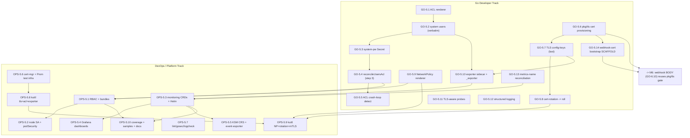
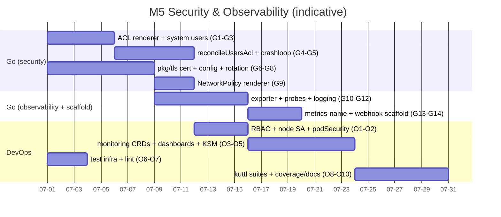

# Phase 5 — Security & Observability

> Percona Operator for Valkey — Implementation Plan, milestone **M5** (Go + DevOps, dual-track).
> Source of truth: [`../architecture/07-security.md`](../architecture/07-security.md) and
> [`../architecture/08-observability.md`](../architecture/08-observability.md), with field-level
> references into [`../architecture/03-api-design.md`](../architecture/03-api-design.md) and
> [`../architecture/04-control-plane.md`](../architecture/04-control-plane.md). Every task below
> traces to a numbered section of those docs. Where the docs are silent on a build detail, it is
> recorded as an **OPEN QUESTION** (§10) rather than invented.
>
> **Tracks:** genuinely dual. The database-layer security reconcile (ACL render, TLS provisioning +
> roll, webhook/cert bootstrap scaffold) is Go-heavy; the monitoring CRs, RBAC bundles, NetworkPolicy
> templating, dashboards, and alert rules are OPS-heavy. Neither track dominates.

This phase hardens the cluster that M2/M3 already build and M4 already backs up: it turns on
**ACL/users**, **TLS in transit** (cert-manager or secret-ref), **least-privilege RBAC**,
**NetworkPolicy**, and the **conversion-webhook / cert bootstrap scaffolding**; and it makes the
cluster **observable** end-to-end — the **`_exporter` sidecar**, **PodMonitor/ServiceMonitor**,
**metrics TLS**, **Grafana dashboards**, **PrometheusRule alert catalogue**, **structured logging
conventions**, and **TLS-aware health probes**.

Two important framing notes:

1. **Much of the wiring already exists in earlier phases and is *promoted to production* here.**
   M2/M3 already render `valkey.conf`, stamp the **config** roll hash (`serverConfigRollHash`/
   `configHash`), roll one-at-a-time with proactive failover, derive `status.state` from
   conditions, emit the Event vocabulary, **render the verbatim system-user ACL + `spec.users`
   passthrough (M3 GO-3.8)**, and **inject the exporter sidecar + TLS-aware probes (M2 GO-2.8)**.
   M5 does **not** re-invent those; it *extends* the existing renderer/sidecar/probe code (OQ-7,
   GO-5.1/5.4/5.10/5.11) with the ACL rotation/fail-closed *behaviour*, the TLS *content*, and the
   monitoring/security *manifests* that ride on top. **Correction:** the **`tlsHash` annotation
   pipeline is NOT in M3** — M3 explicitly defers it to M5 (04-phase3 §"deferred", and consumes an
   already-present TLS Secret without stamping a TLS hash). GO-5.8 introduces `tlsHash` stamping,
   reusing M3's `configHash` *stamping mechanism* but adding a new annotation.
2. **The conversion webhook *body* is M6, but its cert-manager plumbing is M5.** Phase 6 explicitly
   depends on "M5 cert-manager integration (`pkg/tls`)" and the "webhook/cert bootstrap-order
   pre-flight + startup gate **scaffolding** … landed as scaffold in M5"
   ([`07-phase6-upgrades-versioning.md`](07-phase6-upgrades-versioning.md) §3, GO-6.10). M5
   therefore delivers `pkg/tls` (cert-manager `Certificate` provisioning, secret-ref validation,
   `tlsHash`) and a **reusable webhook-cert bootstrap gate** (pre-flight + startup wait) that M6
   wires the webhook handler onto. The `v1alpha1↔v1` conversion logic itself is **out of scope**
   here (arch 09 §6).

---

## 1. Objective & demoable outcome

When this phase is done, the following concretely works against a live `mode: cluster`
`PerconaValkeyCluster` (built in M3, backed up in M4):

1. **ACL / users live.** `spec.users[]` entries render deterministically (sorted by name, fixed
   token order) into the `internal-<cluster>-acl` Secret of type **`valkey.io/acl`**, mounted at
   `/config/users/users.acl` and loaded by `aclfile` (arch 07 §4.1, §4.2). The three system users
   `_operator`, `_exporter` (only if `spec.exporter.enabled`), `_backup` are emitted **verbatim**
   from the canonical least-privilege strings (arch 07 §4.3), with 26-char random passwords in
   `internal-<cluster>-system-passwords`, SHA-256-hashed into the file (arch 07 §8.2). An app user
   can `AUTH` with its password and is denied `@admin`/keyspace it wasn't granted.
2. **Zero-downtime password rotation.** Adding a second key to a user's `passwordSecret.keys[]`
   emits two `#<sha256>` tokens; both passwords work; removing the old key invalidates it — no roll
   (arch 07 §4.4).
3. **TLS in transit (cert-manager).** `spec.tls.certManager.issuerRef` makes the operator create a
   `cert-manager.io/v1` `Certificate` with DNS SANs for the headless Service + per-pod names;
   pods boot with `tls-port 6379`, `port 0`, `tls-cluster yes`, `tls-replication yes`,
   `aclfile`/`tls-*` operator-managed-last (arch 07 §3.1, §3.3). Clients must use `tls://`.
   Secret-ref mode (`spec.tls.secretName`) validates the three keys and fails closed if any is
   missing (arch 07 §3.3).
4. **Safe cert rotation.** cert-manager renewal changes the TLS Secret → operator recomputes
   `tlsHash`, stamps the ValkeyNode pod-template annotation → M3 one-at-a-time roll, replicas
   before primary, proactive `CLUSTER FAILOVER` (arch 07 §3.4). A malformed renewed Secret →
   `Degraded/TLSError` + Warning Event, never a silent break.
5. **Least-privilege RBAC + NetworkPolicy.** `deploy/bundle.yaml` (namespaced, default) and
   `deploy/cw-bundle.yaml` (cluster-wide) carry exactly the verb set in arch 07 §6.1 — read-only
   `pods`, no wildcard, no blanket Secret access; a separate near-zero-privilege node SA
   (arch 07 §6.2); per-CRD aggregated viewer/editor/admin roles (arch 07 §6.4). NetworkPolicy
   default-denies and allows only the seven flows in arch 07 §7 (+ the metrics rule in arch 08 §3.4).
6. **Exporter + Prometheus.** With `spec.exporter.enabled`, one `percona/valkey-exporter` sidecar
   per pod scrapes `localhost` as `_exporter` over loopback (or TLS when `spec.tls` set), serves
   `:9121`; a `PodMonitor` (default) selects by `valkey.percona.com/cluster` and relabels
   `cluster`/`shard_index`/`node_index`/`pod`; `redis_*` series appear in Prometheus
   (arch 08 §2, §3.1, §3.2).
7. **Dashboards + alerts.** The `valkey-db` chart templates five+ Grafana dashboards and a
   `PrometheusRule` whose alerts fire on the documented expressions — `ValkeyClusterStateFail`
   (critical), `ValkeySlotsUnassigned` (critical), `ValkeyReplicationLagHigh` grouped by
   `cluster,shard_index` (high), `ValkeyMemoryPressure` div-by-zero-guarded (warning), and the
   kube-state-metrics-backed control-plane alerts (arch 08 §7.2, §7.4).
8. **TLS-aware probes + structured logs.** Probe scripts in the rendered ConfigMap invoke
   `valkey-cli --tls` when `spec.tls` is set, are **excluded from `configHash`**, and gate the M3
   roll on readiness (arch 08 §6); the operator logs through `logf` with the stable key vocabulary
   and pairs every `Warning` event with a matching `log.Error` line (arch 08 §5).
9. **Webhook-cert bootstrap scaffold.** `pkg/tls` exposes a reusable cert-manager-backed
   bootstrap gate (pre-flight cert-manager readiness + startup wait for Secret/`caBundle`) that
   M6's conversion webhook plugs into; no conversion logic ships yet (arch 07 §3.5; deferred body
   per arch 09 §6).

**Demo script (kuttl `run-pr.csv` smoke, engine 9.0):** create cert-manager `Issuer` → apply a
`PerconaValkeyCluster` with `spec.tls.certManager`, `spec.users[app]`, `spec.exporter.enabled`,
`spec.networkPolicy.enabled` → assert pods serve TLS-only on 6379 (plain refused), `app` user
`AUTH`s and is denied `flushall`, the exporter `:9121` returns `redis_cluster_slots_assigned 16384`,
the `PodMonitor`/`PrometheusRule`/NetworkPolicy exist with golden-file shape, and rotating the
issued cert triggers a clean one-at-a-time roll with `compare_data` proving no data loss.

---

## 2. Milestone & exit criteria

**Milestone M5 — Security + Observability.** ACL/users, TLS, RBAC, metrics exporter + Prometheus
wiring; independently demoable on a live M3 cluster.

**Exit criteria (all must hold):**

| # | Criterion | Trace |
|---|---|---|
| E1 | `reconcileUsersAcl` renders `internal-<cluster>-acl` (type `valkey.io/acl`) deterministically: user-defined first (sorted by name, fixed token order), then `_operator`/`_exporter`/`_backup` appended verbatim; system passwords 26-char random in `internal-<cluster>-system-passwords`, SHA-256 into the file. | arch 07 §4.1, §4.2, §4.3, §8.2 |
| E2 | Multi-password rotation works (≥1 `#<sha256>` token per `passwordSecret.keys[]`); `resetpass`/`nopass` honoured; deleting a password Secret fails the reconcile closed with `Degraded/UsersAclError`. | arch 07 §4.4 |
| E3 | ACL crash-loop detection: a pod that crash-loops right after an ACL-hash change surfaces `Degraded/UsersAclError` + Warning Event naming the user/Secret, not opaque `CrashLoopBackOff`. | arch 07 §4.5 |
| E4 | `pkg/tls` provisions a cert-manager `Certificate` (DNS SANs: headless svc, wildcard, per-pod) **or** validates a referenced Secret's `ca.crt`/`tls.crt`/`tls.key` (fail-closed); computes `tlsHash`. | arch 07 §3.3 |
| E5 | TLS config keys are operator-managed-last: `tls-port 6379`, `port 0`, `tls-cluster yes`, `tls-replication yes`, `tls-{cert,key,ca-cert}-file`, `tls-auth-clients` from `spec.tls.authClients`. | arch 07 §3.1, §3.2 |
| E6 | Cert rotation: TLS-Secret watch recomputes `tlsHash` → pod-template annotation → M3 one-at-a-time roll (replicas before primary, proactive failover); malformed Secret → `Degraded/TLSError`. | arch 07 §3.4 |
| E7 | RBAC least-privilege regenerated into `deploy/bundle.yaml` (namespaced) **and** `deploy/cw-bundle.yaml` (cluster-wide), matching the exact verb table; read-only `pods`; no wildcard; no blanket Secret access; per-CRD aggregated viewer/editor/admin roles; `ValkeyNode` has **no** user editor role. | arch 07 §6.1, §6.3, §6.4 |
| E8 | Node pods run under a separate near-zero-privilege SA with `automountServiceAccountToken: false` and the restricted pod security context (runAsNonRoot, drop ALL, RuntimeDefault, readOnlyRootFilesystem). | arch 07 §6.2, §9.1 |
| E9 | NetworkPolicy default-deny + exactly the seven flows (client/operator/bus-intra 16379/bus-data-intra 6379/metrics 9121/storage-egress 443/dns 53), cluster-bus scoped by `valkey.percona.com/cluster`. | arch 07 §7; arch 08 §3.4 |
| E10 | `_exporter` sidecar injected by the ValkeyNode controller when `spec.exporter.enabled`; auths as `_exporter` over loopback (TLS when `spec.tls`); port `9121` named `metrics`; own readiness on `/`; default `50m`/`64Mi`. | arch 08 §2.1, §2.4 |
| E11 | `PodMonitor` (default) + `ServiceMonitor` (opt-in) + raw-annotation fallback templated in `valkey-db`, gated on `exporter.enabled` + `monitoring.enabled`; relabels to `cluster`/`shard_index`/`node_index`/`pod`; metrics TLS via `scheme: https` + `tlsConfig` when enabled. | arch 08 §3.1, §3.2, §3.3 |
| E12 | Grafana dashboards (Cluster Health, Slot Coverage, Replication, Memory/Eviction, Throughput) shipped as `grafana_dashboard`-labelled ConfigMaps; role panels derive role from `redis_master_link_up`/`redis_connected_slaves`, **never** `node_index`. | arch 08 §2.3, §7.2 |
| E13 | `PrometheusRule` alert catalogue templated, gated on `monitoring.prometheusRule.enabled`; expressions match arch 08 §7.4 (incl. `ValkeyReplicationLagHigh` grouped by `cluster,shard_index` and `ValkeyMemoryPressure` `redis_memory_max_bytes > 0` guard). | arch 08 §7.3, §7.4 |
| E14 | TLS-aware liveness/readiness/startup probe scripts in the rendered ConfigMap (liveness NOT cluster-health-dependent; readiness checks `cluster_state:ok` + replica `master_link_status:up`); excluded from `configHash`. | arch 08 §6 |
| E15 | Structured-logging conventions enforced (logger-from-context, constant message + k/v, stable key vocabulary, every Warning event paired with a `log.Error`). | arch 08 §5 |
| E16 | `pkg/tls` webhook-cert bootstrap **scaffold**: pre-flight cert-manager readiness check + manager startup gate waiting for webhook Secret + `caBundle`, exposed for M6 to mount the conversion handler onto. No conversion logic. | arch 07 §3.5 (scaffold); arch 09 §6 (body deferred to M6) |
| E17 | Baseline DoD: compiles; gofmt/go vet/golangci-lint/gosec clean; deepcopy/CRD/RBAC/bundle regenerated; ≥80% pkg coverage; relevant docs updated; CI green. | charter |
| E18 | kuttl smoke (`run-pr.csv`) for tls+acl+exporter passes; `run-distro.csv` adds NetworkPolicy + cert-rotation + mTLS variants. | arch 08 §7; arch 07 §3.4, §7 |

---

## 3. Prerequisites (which earlier phases/task-ids must be complete)

Strict bottom-up build order (charter). This phase **depends on**:

| Prereq milestone | What it provides that M5 consumes | Why required |
|---|---|---|
| **M0 Bootstrap** | repo scaffold, `cmd/manager`, leader election, image pipeline, envtest+kuttl+CI harness, `pkg/naming`, `pkg/k8s` (CreateOrUpdate/status), `pkg/platform` (OpenShift detection) | M5 adds Secrets/NetworkPolicy/RBAC via the same CreateOrUpdate seam; platform detection drives SCC-aware pod security (arch 07 §9.3) |
| **M1 API** | `PerconaValkeyCluster` types incl. `users[] (UserAclSpec)`, `tls (TLSConfig)`, `exporter (ExporterSpec)`, `networkPolicy`; `CheckNSetDefaults` skeleton; CEL `^[@a-z0-9\|_-]+$` ACL pattern + `_`-prefix name rule | M5 fills the *behaviour* behind these fields; CEL shape checks are the admission-time half of ACL validation (arch 07 §4.5) |
| **M2 ValkeyNode** | `valkey.conf` render pipeline (user-first/operator-base-last), `configHash`, workload+PVC, `applyLiveConfig`, status ready/role-from-INFO, the **exporter sidecar injection seam** and **init-container seam**, probe-script ConfigMap mount | M5 adds ACL/TLS directives to the render, injects the exporter container, and writes TLS-aware probe scripts — all into existing seams |
| **M3 Cluster** | reconcile phases 0–15 incl. a **working `reconcileUsersAcl` (step 3, GO-3.8) that already renders the verbatim system users + `spec.users` passthrough** (`pkg/valkey/acl.go` `renderUsersAcl` + `pkg/controller/perconavalkeycluster/acl.go`), `upsertConfigMap` + `serverConfigRollHash` (step 4, GO-3.9, with the `tls-*` operator-base-last placeholder and probe-script hash exclusion), the **one-at-a-time roll with proactive `CLUSTER FAILOVER`** (step 6), `configHash` pod-template stamping, status-from-conditions, full Event vocabulary (incl. `InternalSecrets*`), `_operator` auth via `pkg/valkey` `ForceSingleClient=true` | **M5 EXTENDS (does not re-create) M3's renderer/`reconcileUsersAcl`** — it adds password fetch, multi-password rotation, `resetpass`/`nopass`, fail-closed user-Secret handling, and crash-loop detection (OQ-7); adds the `tls-*` *content* into GO-3.9's placeholder (GO-5.7); and reuses the step-6 roll for TLS/ACL rotation (arch 07 §3.4). **Note:** M3 stamps `configHash`; the `tlsHash` annotation pipeline is *new in M5* (GO-5.8) reusing the same stamping mechanism — M3 does not yet stamp `tlsHash` (see correction in §1 framing note) |
| **M4 Backup/Restore** | `_backup` system user already referenced by `cmd/valkey-backup`; backup Job SA + storage-egress NetworkPolicy need | M5's `_backup` ACL line + storage-egress rule must stay consistent with M4's Job (arch 07 §4.3, §7) |

**Hand-off forward (do not build here):** the conversion-webhook *body*, `crVersion` gating,
version-service client, and smart-update *engine* upgrade are **M6** — M5 only lands the
cert-manager/`pkg/tls` plumbing and webhook-cert bootstrap *scaffold* that M6 (GO-6.10, OPS-6.2)
reuses.

---

## 4. Scope — In / Out

**In scope (M5):**

- **Security:**
  - `reconcileUsersAcl` content: `buildUserAcl` (UserAclSpec→`ACL SETUSER` token mapping), `createSystemUsersAcl` (the three verbatim system-user lines), deterministic ordering, password fetch + SHA-256, the `internal-<cluster>-acl` (`valkey.io/acl`) and `internal-<cluster>-system-passwords` Secrets, multi-password rotation, `resetpass`/`nopass`, ACL crash-loop detection.
  - `pkg/tls`: cert-manager `Certificate` provisioning, secret-ref validation, three-key shape check, `tlsHash`, TLS config-key injection (operator-managed-last), cert-rotation watch→roll.
  - RBAC least-privilege markers → regenerated `bundle.yaml`/`cw-bundle.yaml`, node SA, per-CRD aggregated roles.
  - NetworkPolicy renderer (data-plane flows) + the metrics rule.
  - Pod security context + SCC-aware (OpenShift) + PSA namespace-label docs.
  - **Webhook-cert bootstrap *scaffold*** in `pkg/tls` (pre-flight + startup gate) — reusable shell only.
- **Observability:**
  - Exporter sidecar injection + `_exporter` ACL + resource/security footprint + own readiness.
  - `PodMonitor`/`ServiceMonitor`/annotation-fallback templates + relabelling + metrics TLS.
  - Grafana dashboards (5 + backup) as ConfigMaps.
  - `PrometheusRule` alert catalogue (engine + control-plane via kube-state-metrics custom-resource-state).
  - kube-state-metrics custom-resource-state config (`pvk_status_state`, `pvk_condition`, `pvk_ready_shards`, `pvk_shards`, `pvk_desired_replicas`) + event-exporter wiring docs.
  - TLS-aware probe scripts (excluded from `configHash`).
  - Structured-logging convention enforcement (lint rule + helper).
  - SLO/SLI recommendations doc stub.

**Out of scope (deferred):**

- Conversion-webhook *body* / `v1alpha1↔v1` `ConvertTo`/`ConvertFrom` → **M6** (arch 09 §6).
- `crVersion` gating, version-service smart updates → **M6** (arch 09 §3, §5).
- Full docs site (`k8svalkey-docs`), Helm chart *release*/publishing, OLM bundle → **M7** (arch 10).
- Image signing/cosign *enforcement* (admission policy) — M5 documents the flow only; operator does not verify (arch 07 §9.2).
- PITR / AOF streaming (deferred beyond v1alpha1, arch 06 / arch 08 §8).
- mutual-TLS *client cert lifecycle* for application clients beyond exposing `spec.tls.authClients: required` (arch 07 §3.2).
- Request-rate limiting (Valkey has none; out of design — arch 07 §2.3, §10).

---

## 5. Go Developer Track

> Build order within the phase: (a) **extend M3's** `pkg/valkey/acl.go` renderer (pure, leaf) →
> (b) `pkg/tls` domain → (c) controller wiring **extending M3's** `reconcileUsersAcl`/`serverConfigRender`
> + **M2's** exporter/probe builders → (d) NetworkPolicy renderer → (e) cert-rotation watch →
> (f) webhook-cert bootstrap scaffold → (g) logging polish.
> **Package-path note (OQ-7):** M5 adds to the *existing* ACL/config files M3 created in
> `pkg/valkey/` and the exporter/probe builders M2 created in
> `pkg/controller/valkeynode/valkeynode_resources.go`. The protocol/domain path is locked to
> `pkg/valkey` repo-wide (OQ-PKG resolved; `internal/valkey` rejected); this phase uses `pkg/valkey`
> and does NOT introduce a separate `pkg/valkey/acl` sub-package.

| id | title | description | files / packages | key types / funcs | depends-on | DoD | tests | effort | risk |
|----|-------|-------------|------------------|-------------------|------------|-----|-------|--------|------|
| **GO-5.1** | ACL domain — **extend** M3's `renderUsersAcl` with full `UserAclSpec`→`ACL SETUSER` mapping | **Extends GO-3.8's existing renderer (do NOT create a parallel package — see OQ-7).** M3 already ships `renderUsersAcl` + system-user rendering with `spec.users` passthrough. M5 fills in the *per-field* `UserAclSpec` token mapping with the **exact** token order (name, on/off, password `#<sha256>`, keys `~`/`%R~`/`%W~`, `resetchannels`+`&`, `+allow`, `-deny`, raw `permissions`); `spec.users` already sorted by name (M3); add `resetpass`/`nopass` rules. No live engine round-trip — render from spec only. | **extend** `pkg/valkey/acl.go` (M3's existing file; add `buildUserAcl` helper alongside `renderUsersAcl`) | `buildUserAcl(UserAclSpec, pwHashes []string) string` (new); reuse M3 `renderUsersAcl`/sort | M3 GO-3.8 (existing renderer), M1 API (`UserAclSpec`) | byte-stable output for identical spec; token order matches arch 07 §4.1 table; example in §4.1 round-trips exactly; **M3's existing golden tests still pass** | table-driven: each field→token; ordering; `resetpass` strips pw; `nopass`; multi-pw → multi `#`; regression against M3 goldens | M (3d) | M: token-order/`resetchannels`-once drift vs doc **and** breaking M3's renderer contract; mitigate golden-string test of the §4.1 example + M3 regression suite |
| **GO-5.2** | System users (`_operator`/`_exporter`/`_backup`) — **audit/lock M3's existing strings** | M3 GO-3.8 **already emits** the three system-user lines (its `renderSystemUser`/`renderUsersAcl`). M5 does **not** re-author them; it (a) extracts the three canonical templates into **string consts** in M3's `pkg/valkey/acl.go`, (b) adds the **golden-equality test vs arch 07 §4.3** as the trust-boundary lock, and (c) confirms `_exporter` is gated on `spec.exporter.enabled` (already true in M3). Passwords come from `internal-<cluster>-system-passwords` (create-if-absent, GO-5.3), 26-char random, SHA-256 hashed. Copy, never paraphrase. | **extend** `pkg/valkey/acl.go` (consts + lock test) | `createSystemUsersAcl(cluster, pw SystemPasswords) []string` (M3, formalised), `genSystemPassword() string` | M3 GO-3.8, GO-5.1 | three lines match §4.3 char-for-char; `_exporter` skipped when disabled; password length 26 | golden-string test vs §4.3; exporter-disabled omits `_exporter`; password entropy/length | S (2d) | **H (security-critical)**: any drift widens a trust boundary → mandatory `security-reviewer` (arch 07 §10); mitigate string consts + test asserting equality with doc |
| **GO-5.3** | System-password Secret lifecycle | **M3 GO-3.8 already creates `internal-<cluster>-system-passwords` (create-if-absent, 26-char random) during bootstrap.** M5 formalises its lifecycle: ensure `Opaque`, owner-ref to cluster, finalizer-protected, with `_operator`/`_exporter`/`_backup` keys; **re-randomize on Secret delete** (operator recreates + triggers roll); never log values. Extract into a dedicated function but reuse M3's creation path; do not double-create. | `pkg/controller/perconavalkeycluster/system_passwords.go` (new helper, called from M3's phase-3 path) | `ensureSystemPasswords(ctx, cluster) (SystemPasswords, error)` | GO-5.2, **M3 GO-3.8 (existing creation)**, M0 `pkg/k8s` CreateOrUpdate, M3 owner-ref | Secret created with owner-ref; delete→recreate→roll; values never in logs/Events; no duplicate-create vs M3 | envtest: create; delete→recreate; key present; gosec no-secret-in-log | S (2d) | M: GC race **and** double-create vs M3 bootstrap; mitigate owner-ref + finalizer + idempotent CreateOrUpdate (arch 07 §8.2) |
| **GO-5.4** | `reconcileUsersAcl` — **extend** M3's step-3 with password fetch + rotation + fail-closed | **Extends GO-3.8's existing `reconcileUsersAcl` (`pkg/controller/perconavalkeycluster/acl.go`) — do NOT create `users_acl.go` (OQ-7).** M3 already writes `internal-<cluster>-acl` (type **`valkey.io/acl`**) and computes the ACL roll hash. M5 adds: real user-password fetch (`fetchUserPasswords` from `passwordSecret`) + SHA-256, multi-`#` rotation, and **fail-closed** (`Degraded/UsersAclError`) on missing user Secret/key (M3's bootstrap path created the Secret with system users only); emit `InternalSecretsCreated/Updated`/`...Failed` events (already in M3's event vocab). | **extend** `pkg/controller/perconavalkeycluster/acl.go` (M3); add `fetchUserPasswords` | `reconcileUsersAcl(ctx, c) error` (M3, widened), `fetchUserPasswords` (new), reuse M3 `aclHash` | GO-5.1, GO-5.2, GO-5.3, **M3 GO-3.8 (existing `reconcileUsersAcl`)** | Secret type `valkey.io/acl`; user-first/system-last order (M3); missing Secret→fail-closed+event; byte-stable hash | envtest: render→Secret; missing pw Secret→Degraded; rotation re-renders; event assertions; M3 regression | M (3d) | **H (security-critical)**: fail-closed correctness (arch 07 §1, §8.2); mitigate envtest negative cases + security review |
| **GO-5.5** | ACL crash-loop detection | Watch node-pod state; correlate a pod entering `CrashLoopBackOff` immediately after an ACL-hash change to an ACL-parse failure; raise `Degraded/UsersAclError` + Warning Event naming the offending user/Secret; document the revert-`spec.users` runbook. | `pkg/controller/perconavalkeycluster/acl_crashloop.go` | `detectAclCrashLoop(ctx, cluster, prevAclHash string) (bool, string)` | GO-5.4, M2 pod-watch | crash-after-ACL-change → `UsersAclError` not opaque CrashLoop; names user/Secret; clears on revert | envtest: simulate restartCount spike post-hash-change → condition+event; unrelated crash not misattributed | M (3d) | M: false attribution (a crash unrelated to ACL); mitigate hash-change correlation window + arch 07 §4.5 |
| **GO-5.6** | `pkg/tls` — cert provisioning (secret-ref + cert-manager; **OQ-4 resolved**) | Handle `spec.tls` (locked dual shape per arch 03 §2.8): **secret-ref mode** (`spec.tls.secretName`) validates the referenced Secret has `ca.crt`/`tls.crt`/`tls.key` and fails closed if any missing; compute `tlsHash` (SHA-256 of the three keys). **cert-manager mode** (`spec.tls.certManager.issuerRef`) creates a `cert-manager.io/v1` `Certificate` with DNS SANs: headless svc `valkey-<cluster>`, wildcard, per-pod FQDNs, cluster `issuerRef`. The two modes are mutually exclusive. | `pkg/tls/certificate.go`, `pkg/tls/secretref.go`, `pkg/tls/hash.go` | `EnsureCertificate(ctx, cluster) error` (cert-manager), `ValidateSecretRef(ctx, ref) error`, `ComputeTLSHash(secret) string`, SAN builders in `pkg/naming` | M1 (`TLSConfig` — locked shape per OQ-4), M0 cert-manager API dep, `pkg/naming` | secret-ref missing-key→fail-closed; `tlsHash` stable; cert-manager SANs correct | unit: secret-ref missing-key reject; hash determinism; cert-manager SAN list + envtest Certificate create | M (3d) | **H (security-critical)**: SAN/issuer correctness gates operator-to-node TLS (arch 07 §3.3, §5); security review |
| **GO-5.7** | TLS config-key injection (operator-managed-last) | **Extend M3's `serverConfigRender` (`pkg/valkey/config.go`, GO-3.9) — its operator-base-last block already lists `tls-*` as a placeholder.** When `spec.tls` is set, emit `tls-port 6379`, `port 0`, `tls-cluster yes`, `tls-replication yes`, `tls-cert-file /tls/tls.crt`, `tls-key-file /tls/tls.key`, `tls-ca-cert-file /tls/ca.crt`, `tls-auth-clients` from the `spec.tls.authClients` behaviour (arch 07 §3.2: `optional` default / `yes` when `required`; if surfaced as a spec field it is a follow-up arch 03 §2.8 extension per OQ-4's note); all in the operator-base-last block so user config can't override; mount the TLS Secret read-only at `/tls` via M2's `buildVolumes`. | **extend** `pkg/valkey/config.go` (M3 `serverConfigRender`); M2 `buildVolumes` for the `/tls` mount | `appendTLSDirectives(cfg, cluster)`, `tlsVolumeMount()` | GO-5.6, **M3 GO-3.9 (`serverConfigRender`)**, M2 GO-2.8 (`buildVolumes`) | exact key/value table (arch 07 §3.1); `port 0` when TLS on; user override ignored; `/tls` RO mount | unit: rendered config has all keys; `authClients` enum→value; override-proof; mount RO | S (2d) | M: forgetting `port 0` → plaintext leak; mitigate explicit assertion test (arch 07 §3.1 pitfall) |
| **GO-5.8** | Cert-rotation watch → roll | Watch the TLS Secret; on change recompute `tlsHash`, stamp the ValkeyNode pod-template annotation (same mechanism as `configHash`); a malformed renewed Secret → `Degraded/TLSError` + Warning Event (no roll). The roll itself is the **existing M3 one-at-a-time, replicas-before-primary, proactive-failover** mechanism — reuse, don't re-implement. | `pkg/controller/perconavalkeycluster/tls_rotation.go`, `add_perconavalkeycluster.go` (Watch Secret) | `onTLSSecretChange`, `stampTLSHash(node, hash)` | GO-5.6, GO-5.7, M3 roll | Secret change→`tlsHash`→annotation→M3 roll; malformed→`TLSError` no roll; data preserved | envtest: Secret update re-stamps + triggers roll; malformed→Degraded; secret-ref same path | M (3d) | M: rotation storms / partial roll (arch 07 §3.4); mitigate reuse of proven M3 roll + state-machine test |
| **GO-5.9** | NetworkPolicy renderer | Render default-deny + the seven flows when `spec.networkPolicy.enabled`: client-ingress 6379 (`clientSelectors`), operator-ingress 6379 (operator pod label), bus-intra 16379 (cluster-label scoped), bus-data-intra 6379 (same cluster), metrics-ingress 9121 (monitoring ns Prometheus), storage-egress 443, dns-egress 53. Owner-ref to cluster. | `pkg/controller/perconavalkeycluster/networkpolicy.go`, `pkg/naming` (policy names) | `reconcileNetworkPolicies(ctx, cluster)`, `buildClientIngress`, `buildBusIntra`, ... | M1 (`networkPolicy` field), M3 owner-ref, M0 `pkg/k8s` | seven policies match arch 07 §7 table; bus scoped by `valkey.percona.com/cluster`; default-deny present | unit: each policy peer/port; cluster-label scoping; disabled→no policies | M (3d) | M: cross-cluster MEET spoofing if label scope wrong (arch 07 §7, B4); mitigate explicit label-scope test |
| **GO-5.10** | Exporter sidecar `_exporter` ACL + TLS wiring (**extend** M2's `buildExporterSidecar`) | **M2 GO-2.8 already injects the exporter sidecar** (`buildExporterSidecar` in `valkeynode_resources.go`: `:9121` named `metrics`, own readiness, `~50m`/`64Mi`, gated on `exporter.enabled`). M5 does **not** re-create the container — it *populates* M2's stub with: `_exporter` auth env (password from `internal-<cluster>-system-passwords`, GO-5.2/5.3), TLS-to-engine `--tls-ca-cert-file=/tls/ca.crt` (`rediss://` addr) when `spec.tls` set, image from `spec.exporter.image`, restricted security context. **Reduce effort accordingly (container scaffold pre-exists).** | **extend** `pkg/controller/valkeynode/valkeynode_resources.go` (M2 `buildExporterSidecar`) | `buildExporterSidecar(cluster, node)` (M2, widened with auth/TLS) | GO-5.2 (`_exporter`), **M2 GO-2.8 (existing sidecar)**, GO-5.7 (TLS) | `_exporter` auth env wired; TLS-aware addr+CA when `spec.tls`; image override honoured; M2 own-readiness/port/resources unchanged | unit: auth env + TLS flag wiring; disabled→absent (M2 regression); own-readiness preserved | S (2d) | M: exporter outage must not roll Valkey (own readiness, arch 08 §2.4, §6) — already satisfied by M2; mitigate regression assertion. Note OQ-1 (which `_exporter` ACL string) |
| **GO-5.11** | TLS-aware health probe scripts (**verify/extend** M2's `buildProbes`) | **M2 GO-2.8/2.9 already render TLS-aware probes** (E9: startup/liveness/readiness mounted from rendered config, `--tls`, liveness NOT cluster-health-dependent, readiness `PING`+`cluster_state:ok`; M2 §215 notes the replica `master_link_status:up` variant is *templated* but not exercised until M3). M5's delta is narrow: **verify** the M3 cluster-mode/replica readiness expression is correct now that clusters exist, confirm scripts are **excluded from the roll hash** (M2/M3 `serverConfigRollHash` already excludes them — see GO-3.9), and add the replica `master_link_status:up` assertion. **Largely a verification task — do not re-author the scripts.** | **verify/extend** M2 probe render (`valkeynode_resources.go` `buildProbes` + ConfigMap render) | reuse M2 `buildProbes`; assert exclusion from `serverConfigRollHash` (GO-3.9) | **M2 GO-2.8/2.9 (existing probes)**, M3 GO-3.9 (`serverConfigRollHash` exclusion), GO-5.7 | TLS flag in scripts when TLS on (M2); liveness independent of cluster_state (M2); readiness gates roll; scripts not in roll hash (M3) | unit: TLS vs plain script; hash unchanged when only probe edited; readiness expression per mode incl. replica link-up | XS (1d) | M: liveness coupled to cluster_state → restart storms (arch 08 §6) — already avoided in M2; mitigate explicit independence regression test |
| **GO-5.12** | Structured-logging conventions + helpers | Adopt `logf.FromContext(ctx)`; provide a thin helper enforcing the stable key vocabulary (`cluster`/`namespace`/`valkeynode`/`shard`/`node`/`nodeID`/`addr`/`command`/`phase`/`configHash`/`generation`); ensure every `Warning` event has a matching `log.Error` with the same keys; verbosity `V(0..2)` policy. | `pkg/k8s/log.go` (or `internal/logging`), touch all controllers | `LoggerFor(ctx, cluster) logr.Logger`, key constants | M0, M3 event vocabulary | logger from context seeded with ns/name; keys match arch 08 §5 table; every W-event paired with log.Error | unit: key constants; golden log line; lint rule (OPS-5.7) enforces no `fmt.Sprintf` in messages | S (2d) | L: convention-only; mitigate lint gate |
| **GO-5.13** | Backup/restore metrics → exporter-visible names | Confirm M4-defined backup/restore Prometheus metric names/labels match what the §7.2 Backup/Restore dashboard + `ValkeyBackup*` alerts expect (`backup_slot_coverage`, last-success ts, etc.); add the kube-state-metrics-bridged status-gauge contract (`pvk_*`) on the Go side (printer-column/status fields already exist from M1/M3 — verify, don't re-add). | `pkg/controller/perconavalkey{backup,cluster}/metrics.go` (verify), status-field audit | metric-name constants reconciliation | M4 metrics, M1/M3 status | metric/label names align with arch 08 §7.2/§7.4; no rename churn; status fields sufficient for kube-state-metrics | unit: metric registry names; cross-check alert expression token names | XS (1d) | M: name drift breaks dashboards/alerts (arch 08 §2.2 "pin the prefix once"); mitigate single const file |
| **GO-5.14** | `pkg/tls` webhook-cert bootstrap **scaffold** | Reusable, conversion-agnostic bootstrap gate for M6: a pre-flight check that cert-manager is installed/healthy (CRDs present, CA-injector/webhook Deployments Available) and a manager **startup gate** that blocks (bounded backoff) until a named webhook Secret has `tls.crt`/`tls.key`/`ca.crt` and the CRD `caBundle` is injected; expose `WaitForWebhookCert(ctx, secretRef) error` + a `WebhookCertNotReady` reason constant. **No conversion handler, no `ConvertTo`/`ConvertFrom`.** | `pkg/tls/webhookcert.go`, `cmd/manager/main.go` (gate call, guarded behind a flag default-off) | `PreflightCertManager(ctx) error`, `WaitForWebhookCert(ctx, secretRef) error`, reason `WebhookCertNotReady` | GO-5.6, M0 manager bootstrap | pre-flight detects absent cert-manager → clear error; startup gate blocks until Secret+caBundle ready; reusable + flag-gated off by default | unit: pre-flight present/absent; gate satisfied/unsatisfied (fake client); manager boots with gate off | M (3d) | M: over-building into M6 territory; mitigate strict "scaffold only" scope (arch 07 §3.5; body=arch 09 §6) |

---

## 6. DevOps / Platform Track

> **This phase is genuinely dual-track — DevOps is heavy here**, because almost every security and
> observability *artifact* is a manifest (RBAC, NetworkPolicy, PodMonitor, PrometheusRule,
> dashboards, kube-state-metrics config) generated/templated rather than Go logic. The OPS track
> owns codegen of RBAC, the monitoring CRDs and Helm templating, the test infra (cert-manager +
> Prometheus Operator in kind), CI lint/gosec/security gates, and the kuttl security/observability
> suites.

| id | title | description | files / packages | key artifacts | depends-on | DoD | tests | effort | risk |
|----|-------|-------------|------------------|---------------|------------|-----|-------|--------|------|
| **OPS-5.1** | RBAC markers + bundle regeneration | Add/curate `+kubebuilder:rbac` markers for the M5 surface (secrets/configmaps/services/pvcs CRUD, **pods get;list;watch only**, statefulsets/deployments, jobs, pdb, events, `cert-manager.io/certificates`, `coordination/leases`, networkpolicies) to match arch 07 §6.1 exactly; `make manifests` regenerates `deploy/crd.yaml`, `deploy/bundle.yaml` (namespaced) **and** `deploy/cw-bundle.yaml` (cluster-wide). No wildcard, no blanket Secret access. | `pkg/controller/*` markers; `deploy/bundle.yaml`, `deploy/cw-bundle.yaml` | regenerated RBAC | M0 codegen, GO-5.9 (networkpolicies verb) | RBAC verb table == arch 07 §6.1; `pods` read-only; `check-generate` green; namespaced+cw both rendered | CI `check-generate`; RBAC golden diff vs §6.1 | S (2d) | **H (security-critical)**: over-broad RBAC widens blast radius (arch 07 §6, §10); mitigate golden diff + security review |
| **OPS-5.2** | Node ServiceAccount + pod security context | Add a separate near-zero-privilege node SA (no API write, `automountServiceAccountToken: false`) and the restricted pod security context (runAsNonRoot, drop ALL, RuntimeDefault, readOnlyRootFilesystem + scratch emptyDir) to the rendered workloads / deploy manifests; per-CRD aggregated viewer/editor/admin `ClusterRole`s (with `aggregate-to-*` labels); **no** `ValkeyNode` user editor role. | `config/rbac/`, `deploy/*`, ValkeyNode workload builder | node SA, aggregated roles, securityContext | OPS-5.1, M2 workload | node SA has no write verbs; token automount off; restricted SCC fields present; aggregated roles labelled; no vkn editor | kuttl: pod admitted under PSA `restricted`; RBAC unit: node SA verb set empty for writes | S (2d) | **H (security-critical)**: privilege escalation if node SA over-scoped (arch 07 §6.2, §9.1); security review |
| **OPS-5.3** | Monitoring CRDs vendored + Helm `valkey-db` templates | Template `PodMonitor` (default), `ServiceMonitor` (opt-in), raw-annotation fallback, the metrics `NetworkPolicy`, and the `PrometheusRule` in the `valkey-db` chart, gated on `exporter.enabled` + `monitoring.enabled` / `monitoring.prometheusRule.enabled`; relabels to `cluster`/`shard_index`/`node_index`/`pod`; metrics-TLS `scheme: https` + `tlsConfig` block when `tls.enabled`. Vendor the `monitoring.coreos.com/v1` types for envtest. | `charts/valkey-db/templates/podmonitor.yaml`, `servicemonitor.yaml`, `prometheusrule.yaml`, `networkpolicy-metrics.yaml`; vendored CRDs | monitoring manifests | GO-5.10, GO-5.13 | PodMonitor shape == arch 08 §3.2; alert exprs == §7.4; gated so no orphan CRs without Prometheus Operator; TLS block when enabled | helm-unittest: gated render; relabel keys; alert expr tokens; TLS variant | M (3d) | M: orphaned CRs when Prometheus Operator absent (arch 08 §3.1); mitigate `monitoring.enabled` gate test |
| **OPS-5.4** | Grafana dashboards as ConfigMaps | Author the five dashboards (Cluster Health, Slot Coverage, Replication, Memory/Eviction, Throughput) + Backup/Restore as JSON, shipped as `grafana_dashboard`-labelled ConfigMaps in `valkey-db`; `$cluster` template var from `cluster` label; **role-sensitive panels derive role from `redis_master_link_up`/`redis_connected_slaves`, never `node_index`**; replication lag grouped `by(shard_index)`. | `charts/valkey-db/dashboards/*.json`, ConfigMap template | dashboards | GO-5.13, OPS-5.3 | six dashboards present; `grafana_dashboard` label; no `node_index`-as-role panel; lag grouped by shard | dashboard JSON lint; panel-query token check for role mistake | M (3d) | M: the "`node_index`=primary" trap (arch 08 §2.3); mitigate a CI grep asserting no role-from-node_index query |
| **OPS-5.5** | kube-state-metrics custom-resource-state + event-exporter | Provide the kube-state-metrics **custom-resource-state** config emitting `pvk_status_state`, `pvk_condition{type,status}`, `pvk_ready_shards`, `pvk_shards`, `pvk_desired_replicas{shard_index}`, plus an event-exporter config mirroring the `Warning` events the control-plane alerts select on; ship as chart values/docs. | `charts/valkey-db/templates/ksm-customresourcestate.yaml`, `eventexporter-config.yaml`, docs | KSM + event bridge | OPS-5.3, GO-5.13 | gauges emitted with correct names/labels; events mirrored; control-plane alerts resolve against them | render test; alert dry-run against synthetic `pvk_*` series | M (2d) | M: control-plane alerts inert without this bridge (arch 08 §7.4 note); mitigate end-to-end alert-eval test |
| **OPS-5.6** | cert-manager + Prometheus Operator test infra | Stand up cert-manager and (kube-)Prometheus Operator (+ kube-state-metrics) in the kind harness for kuttl; sync `CERT_MANAGER_VER` from `go.mod` into `e2e-tests/vars.sh` (release-flow contract); self-signed `Issuer` fixture; monitoring-namespace fixture with Prometheus identity label. | `e2e-tests/conf/cert-manager.yaml`, `prometheus-operator.yaml`, `e2e-tests/vars.sh`, `_fixtures/issuer.yaml` | test infra | M0 kind/kuttl, OPS-5.3 | cert-manager + Prometheus Operator reachable in kind; Issuer ready; `CERT_MANAGER_VER` synced | the kuttl suites consume it | M (2d) | M: cert-manager readiness flake (the §3.5 bootstrap pitfall in test form); mitigate readiness wait helper |
| **OPS-5.7** | golangci-lint / gosec / logging-lint config | Extend lint config to cover `pkg/tls`, `pkg/valkey` (ACL/config), exporter/networkpolicy code; gosec must pass on password-handling (creds from Secret, SHA-256 before persist) with narrowly-justified `//nolint`; add a logging-convention check (forbid `fmt.Sprintf` in log messages, enforce key vocabulary) wired to the M5 logging helper. | `.golangci.yml`, source annotations, custom logcheck config | lint config | GO-5.1, GO-5.4, GO-5.6, GO-5.12 | gosec clean (no hardcoded-secret/log-leak findings); logcheck enforces conventions; lint clean | CI lint + gosec jobs; logcheck on touched pkgs | XS (1d) | M: gosec flags sha256/secret reads; mitigate documented `//nolint` + log-leak negative test |
| **OPS-5.8** | kuttl TLS + ACL + exporter smoke suite | `e2e-tests/tests/tls-acl-exporter/` (NN-step/NN-assert): create Issuer → cluster with `tls.certManager` + `users[app]` + `exporter.enabled` → assert TLS-only (plain refused), `app` AUTH + `flushall` denied, exporter `:9121` returns `redis_cluster_slots_assigned 16384`, PodMonitor/PrometheusRule exist (golden `compare/`). Register in `run-pr.csv` (smoke) + `run-release.csv`; engine 9.0 default, basics gated to 8.0/7.2. | `e2e-tests/tests/tls-acl-exporter/`, `run-pr.csv`, `run-release.csv`, `kuttl.yaml` | kuttl suite + CSV rows | OPS-5.6, all GO-5.* | TLS+ACL+exporter round-trip green in kind; golden-file shape for monitoring CRs | the kuttl suite is the test | M (3d) | M: e2e timing/TLS-handshake flake; mitigate generous `timeout`, readiness asserts |
| **OPS-5.9** | kuttl NetworkPolicy + cert-rotation + mTLS suite | Slower suites for `run-distro.csv`/`run-release.csv`: (a) NetworkPolicy default-deny + allowed-flow probes (a non-selected pod is blocked on 6379, Prometheus pod reaches 9121); (b) cert-manager renewal → clean one-at-a-time roll + `compare_data` no-loss; (c) `tls.authClients: required` mTLS reject-without-client-cert. | `e2e-tests/tests/networkpolicy/`, `tests/cert-rotation/`, `tests/mtls/`, `run-distro.csv` | kuttl suites | OPS-5.8, GO-5.8, GO-5.9 | NP blocks/allows correctly; rotation rolls with no data loss; mTLS rejects uncerted client | the kuttl suites | M (3d) | M: NetworkPolicy CNI dependence in kind (needs a policy-enforcing CNI); mitigate Calico in kind + doc |
| **OPS-5.10** | CI coverage gate + sample CRs + docs stubs | Ensure ≥80% pkg-coverage gate includes new/extended pkgs (`pkg/tls`, `pkg/valkey` ACL/config, networkpolicy/exporter controller code); add sample CRs (`deploy/cr-tls.yaml`, ACL/exporter/networkPolicy examples) matching arch 03; add SLO/SLI + security/observability usage doc stubs (full docs-site is M7); flag the security-review-trigger areas in PR template. | `.github/workflows/test.yml`, `deploy/cr-tls.yaml`, `docs/` stubs, PR template | coverage gate, samples, docs | OPS-5.1, OPS-5.3 | coverage gate on new pkgs; samples `kubectl apply`-valid; SLO/SLI stub present; security-review checklist in PR | CI coverage job | XS (1d) | L: additive |

---

## 7. Key technical decisions to honour (cite the arch doc sections)

1. **System-user ACL strings are a single source of truth — copy verbatim, never paraphrase.**
   `_operator`/`_exporter`/`_backup` lines are shared across arch 04, arch 07 §4.3, and the
   exporter ACL in arch 08 §2.4. GO-5.2 must reproduce them char-for-char and a test must assert
   equality with the doc; any change is a CRITICAL-severity trust-boundary change requiring
   `security-reviewer` (arch 07 §10).
2. **ACL is rendered from spec, not from a live engine round-trip.** The renderer (GO-5.1)
   produces `users.acl` deterministically; the engine first sees it at boot via `aclfile`. A bad
   token is a **fatal startup crash-loop**, not an admission rejection — hence CEL shape-check
   (M1) + crash-loop detection (GO-5.5) + revert runbook (arch 07 §4.5). Do **not** attempt
   apply-time engine validation.
3. **Operator-managed security directives are written *last* in the config.** `aclfile`, `tls-*`,
   `protected-mode no`, `cluster-enabled yes` go in the operator-base-last block so user
   `spec.config` can never override them; attempted overrides are silently ignored
   (arch 07 §1, §3.1; arch 04 §2.1 step 4).
4. **TLS enables `port 0`.** When `spec.tls` is set, the plaintext port is disabled; clients must
   use `tls://`. This is the single most common connection error — assert it in tests and document
   it (arch 07 §3.1 critical-behaviour box; arch 08 §6).
5. **Valkey does not hot-reload TLS — rotation = roll.** Reuse the M3 one-at-a-time,
   replicas-before-primary, proactive-`CLUSTER FAILOVER` roll; do not invent a new mechanism. A
   malformed renewed Secret fails closed to `Degraded/TLSError` (arch 07 §3.4).
6. **cert-manager is the recommended TLS provider and a hard prerequisite for the `v1` conversion
   path.** Secret-ref is the air-gapped alternative. The webhook-cert bootstrap (scaffold here)
   pre-flights cert-manager health and gates startup until the Secret + `caBundle` are ready
   (arch 07 §3.3, §3.5).
7. **NetworkPolicy, not `protected-mode`, is the network perimeter.** Default-deny + exactly the
   seven flows; cluster-bus rules scoped by `valkey.percona.com/cluster` to block cross-cluster
   `CLUSTER MEET` spoofing (arch 07 §2.2 B1/B4, §7).
8. **RBAC least-privilege: read-only `pods`, no wildcard, no blanket Secret access, separate node
   SA.** The operator never writes pod objects directly (workloads via STS/Deployment); the node
   SA has no API write rights and disables token automount (arch 07 §6.1, §6.2).
9. **Exporter is a per-pod sidecar authenticating as `_exporter` over loopback, with its own
   readiness probe.** It must never roll or mark-unready the Valkey pod; `_exporter` is created
   only when `spec.exporter.enabled` (arch 08 §2.1, §2.4, §6). Honour the §2.4 caveat that the
   upstream `_exporter` ACL grants `+get`/`+eval`/`+scan` and is therefore *not* strictly
   read-only unless those are dropped — keep the canonical string in lockstep with arch 07 §4.3
   (see OQ-1).
10. **Role is derived from the engine, never from `node_index`.** Dashboards and alerts derive
    primary/replica from `redis_master_link_up`/`redis_connected_slaves`; treating `node-index 0`
    as "the primary" is the single most common observability mistake here (arch 08 §2.3).
11. **PodMonitor is the default discovery resource; ServiceMonitor is opt-in.** Both gated on
    `exporter.enabled` + `monitoring.enabled` so clusters without Prometheus Operator get no orphan
    CRs (arch 08 §3.1).
12. **Conditions are the control-plane alerting surface; engine metrics the data-plane surface;
    events are a forensic timeline, not a long-lived alert source.** Control-plane alerts require
    the kube-state-metrics custom-resource-state bridge + event-exporter (arch 08 §1, §7.4).
13. **Liveness must not depend on cluster health.** Only readiness reflects `cluster_state`;
    coupling liveness to cluster state causes restart storms during failover. Probe scripts are
    excluded from `configHash` (arch 08 §6).
14. **Webhook-cert bootstrap is scaffold-only in M5.** The conversion *body* is M6 (arch 09 §6);
    M5 ships the reusable `pkg/tls` gate that M6 GO-6.10 mounts the handler onto.

---

## 8. Illustrative code skeletons / function signatures

### 8.1 ACL renderer — `UserAclSpec`→`ACL SETUSER` (GO-5.1 / arch 07 §4.1)

```go
// EXTENDS M3's pkg/valkey/acl.go (GO-3.8) — illustrative; do NOT create a new acl package (OQ-7).
package valkey

// buildUserAcl emits exactly one deterministic `user <name> ...` line.
// Token order is FIXED (arch 07 §4.1): name, on/off, password(s), keys, channels, +allow, -deny, raw.
func buildUserAcl(u v1alpha1.UserAclSpec, pwHashes []string) string {
	var b strings.Builder
	fmt.Fprintf(&b, "user %s", u.Name)
	if u.Enabled {
		b.WriteString(" on")
	} else {
		b.WriteString(" off")
	}
	switch {
	case u.Resetpass: // strips all passwords; user cannot auth until re-added
		// emit nothing here
	case u.Nopass:
		b.WriteString(" nopass")
	default:
		for _, h := range pwHashes { // multi-password rotation -> multiple #<sha256>
			fmt.Fprintf(&b, " #%s", h)
		}
	}
	for _, k := range u.Keys.ReadWrite {
		fmt.Fprintf(&b, " ~%s", k)
	}
	for _, k := range u.Keys.ReadOnly {
		fmt.Fprintf(&b, " %%R~%s", k)
	}
	for _, k := range u.Keys.WriteOnly {
		fmt.Fprintf(&b, " %%W~%s", k)
	}
	if len(u.Channels.Patterns) > 0 {
		b.WriteString(" resetchannels") // exactly once, before patterns
		for _, c := range u.Channels.Patterns {
			fmt.Fprintf(&b, " &%s", c)
		}
	}
	for _, c := range u.Commands.Allow {
		fmt.Fprintf(&b, " +%s", c)
	}
	for _, c := range u.Commands.Deny {
		fmt.Fprintf(&b, " -%s", c)
	}
	if u.Permissions != "" { // RawAcl escape hatch, appended verbatim (bypasses CEL)
		fmt.Fprintf(&b, " %s", u.Permissions)
	}
	return b.String()
}

// renderUsersAcl (M3 GO-3.8, widened in M5) sorts users by name then appends system users LAST (arch 07 §4.2).
func renderUsersAcl(cluster *v1alpha1.PerconaValkeyCluster, userPw map[string][]string,
	sys SystemPasswords) (string, error) { /* sort, build, append createSystemUsersAcl */ }
```

### 8.2 System users — verbatim canonical strings (GO-5.2 / arch 07 §4.3)

```go
// pkg/valkey/acl.go (M3 GO-3.8) — M5 extracts these into consts + adds the §4.3 lock test.
// These three template strings are COPIED VERBATIM from arch 07 §4.3 (the security doc is canonical).
// Any change is a CRITICAL trust-boundary change (arch 07 §10) requiring security-reviewer.
const (
	operatorACLFmt = "user _operator on #%s resetchannels resetkeys -@all +cluster +config|get " +
		"+config|set +info +client|setname +client|setinfo +replicaof +wait +ping"
	exporterACLFmt = "user _exporter on #%s resetchannels resetkeys -@all +info +cluster|info " +
		"+latency +ping"
	backupACLFmt = "user _backup on #%s resetchannels resetkeys -@all +bgsave +lastsave +save " +
		"+info +wait +ping"
)

// createSystemUsersAcl (M3) emits _operator, _backup always; _exporter ONLY when exporter enabled.
func createSystemUsersAcl(cluster *v1alpha1.PerconaValkeyCluster, pw SystemPasswords) []string {
	lines := []string{
		fmt.Sprintf(operatorACLFmt, pw.OperatorHash),
		fmt.Sprintf(backupACLFmt, pw.BackupHash),
	}
	if cluster.Spec.Exporter.Enabled {
		lines = append(lines, fmt.Sprintf(exporterACLFmt, pw.ExporterHash))
	}
	return lines
}
```

> Note (OQ-1): arch 08 §2.4 ships a *different*, fuller upstream-redis_exporter `_exporter` string
> (`+get`/`+eval`/`+scan`). GO-5.2 uses the **tight arch 07 §4.3** string by default (least
> privilege) and documents the §2.4 override for users who need redis_exporter key-level metrics,
> kept in lockstep. See §10 OQ-1 — this is a doc-reconciliation item, not a free invention.

### 8.3 TLS provisioning + config injection (GO-5.6, GO-5.7 / arch 07 §3.1, §3.3)

```go
// pkg/tls/certificate.go
func EnsureCertificate(ctx context.Context, c client.Client, cl *v1alpha1.PerconaValkeyCluster) error {
	if cl.Spec.TLS == nil { return nil }
	if cl.Spec.TLS.SecretName != "" { // secret-ref mode: validate, do not create
		return ValidateSecretRef(ctx, c, cl.Namespace, cl.Spec.TLS.SecretName)
	}
	cert := &certmanagerv1.Certificate{ /* ObjectMeta: naming.TLSCertName(cl), owner-ref */ }
	cert.Spec = certmanagerv1.CertificateSpec{
		SecretName: naming.TLSSecretName(cl),
		IssuerRef:  cl.Spec.TLS.CertManager.IssuerRef,
		DNSNames:   naming.TLSSANs(cl), // headless svc, wildcard, per-pod FQDNs
	}
	return k8s.CreateOrUpdate(ctx, c, cert)
}

// ValidateSecretRef fails CLOSED if any of ca.crt/tls.crt/tls.key is missing (arch 07 §3.3).
func ValidateSecretRef(ctx context.Context, c client.Client, ns, name string) error {
	var s corev1.Secret
	if err := c.Get(ctx, types.NamespacedName{Namespace: ns, Name: name}, &s); err != nil {
		return fmt.Errorf("tls secret %q: %w", name, err)
	}
	for _, k := range []string{"ca.crt", "tls.crt", "tls.key"} {
		if _, ok := s.Data[k]; !ok {
			return fmt.Errorf("tls secret %q missing key %q", name, k) // -> Degraded/TLSError
		}
	}
	return nil
}

// pkg/valkey/config/tls.go — operator-managed-LAST block (arch 07 §3.1)
func appendTLSDirectives(cfg *strings.Builder, cl *v1alpha1.PerconaValkeyCluster) {
	if cl.Spec.TLS == nil { return }
	authClients := "optional"
	if cl.Spec.TLS.AuthClients == "required" { authClients = "yes" }
	fmt.Fprint(cfg, "tls-port 6379\nport 0\ntls-cluster yes\ntls-replication yes\n"+
		"tls-cert-file /tls/tls.crt\ntls-key-file /tls/tls.key\ntls-ca-cert-file /tls/ca.crt\n"+
		"tls-auth-clients "+authClients+"\n")
}
```

### 8.4 Exporter sidecar injection (GO-5.10 / arch 08 §2.1, §2.4)

```go
// EXTENDS M2's buildExporterSidecar in pkg/controller/valkeynode/valkeynode_resources.go (GO-2.8).
// M5 adds the _exporter auth env + TLS-to-engine wiring; the container/port/readiness/resources
// scaffold already exists from M2 — illustrative only (do NOT create a parallel exporter.go).
func buildExporterSidecar(cl *v1alpha1.PerconaValkeyCluster) corev1.Container {
	args := []string{"--redis.addr=redis://localhost:6379", "--web.listen-address=:9121"}
	if cl.Spec.TLS != nil { // scrape engine over TLS using the shared CA (arch 08 §2.4)
		args = []string{"--redis.addr=rediss://localhost:6379", "--tls-ca-cert-file=/tls/ca.crt",
			"--web.listen-address=:9121"}
	}
	return corev1.Container{
		Name:  "exporter",
		Image: cl.Spec.Exporter.Image, // percona/valkey-exporter (redis_exporter-compatible)
		Args:  args,
		Env: []corev1.EnvVar{ // _exporter user + password from system-passwords Secret
			{Name: "REDIS_USER", Value: "_exporter"},
			{Name: "REDIS_PASSWORD", ValueFrom: secretKeyRef(naming.SystemPasswordsSecret(cl), "_exporter")},
		},
		Ports:     []corev1.ContainerPort{{Name: "metrics", ContainerPort: 9121}},
		Resources: exporterResources(cl), // default 50m/64Mi, overridable
		// Own readiness so exporter outage NEVER marks Valkey unready / triggers failover (§2.4, §6).
		ReadinessProbe:  &corev1.Probe{ProbeHandler: httpGet("/", 9121)},
		SecurityContext: restrictedSecurityContext(),
	}
}
```

### 8.5 TLS-aware readiness probe script (GO-5.11 / arch 08 §6)

```sh
# rendered into the valkey.conf ConfigMap; EXCLUDED from configHash (arch 08 §6).
# readiness: PING AND (cluster mode) cluster_state:ok; replica also master_link_status:up.
CLI="valkey-cli"
[ -n "$VALKEY_TLS" ] && CLI="valkey-cli --tls --cacert /tls/ca.crt --cert /tls/tls.crt --key /tls/tls.key"
$CLI PING | grep -q PONG || exit 1
if [ "$VALKEY_MODE" = "cluster" ]; then
  $CLI CLUSTER INFO | grep -q 'cluster_state:ok' || exit 1
fi
# liveness uses PING only — NEVER cluster_state (arch 08 §6: avoids failover restart storms).
```

### 8.6 PodMonitor template (OPS-5.3 / arch 08 §3.2, §3.3)

```yaml
# charts/valkey-db/templates/podmonitor.yaml  (gated: exporter.enabled AND monitoring.enabled)
apiVersion: monitoring.coreos.com/v1
kind: PodMonitor
metadata:
  name: valkey-{{ .Values.clusterName }}
spec:
  selector:
    matchLabels:
      valkey.percona.com/cluster: {{ .Values.clusterName }}
      valkey.percona.com/component: valkey
  podMetricsEndpoints:
    - port: metrics                       # named 9121
      interval: 20s
      scrapeTimeout: 10s
      {{- if .Values.tls.enabled }}
      scheme: https
      tlsConfig:
        ca: { secret: { name: valkey-{{ .Values.clusterName }}-metrics-tls, key: ca.crt } }
        serverName: valkey-{{ .Values.clusterName }}   # MUST match a SAN (arch 08 §3.3)
        insecureSkipVerify: false
      {{- end }}
      relabelings:
        - sourceLabels: [__meta_kubernetes_pod_label_valkey_percona_com_cluster]
          targetLabel: cluster
        - sourceLabels: [__meta_kubernetes_pod_label_valkey_percona_com_shard_index]
          targetLabel: shard_index
        - sourceLabels: [__meta_kubernetes_pod_label_valkey_percona_com_node_index]
          targetLabel: node_index
        - sourceLabels: [__meta_kubernetes_pod_name]
          targetLabel: pod
```

### 8.7 PrometheusRule key expressions (OPS-5.3 / arch 08 §7.4)

```yaml
# charts/valkey-db/templates/prometheusrule.yaml (gated: monitoring.prometheusRule.enabled)
groups:
  - name: valkey.data-plane
    rules:
      - alert: ValkeyClusterStateFail
        expr: redis_cluster_state == 0
        for: 1m
        labels: { severity: critical }
      - alert: ValkeySlotsUnassigned
        expr: min by(cluster) (redis_cluster_slots_assigned) < 16384
        for: 2m
        labels: { severity: critical }
      - alert: ValkeyReplicationLagHigh           # MUST group by cluster,shard_index (multi-primary)
        expr: (max by(cluster,shard_index)(redis_master_repl_offset) - redis_slave_repl_offset) > 10485760
        for: 5m
        labels: { severity: high }
      - alert: ValkeyMemoryPressure               # guard divide-by-zero when maxmemory 0 (unlimited)
        expr: redis_memory_max_bytes > 0 and redis_memory_used_bytes / redis_memory_max_bytes > 0.9
        for: 10m
        labels: { severity: warning }
  - name: valkey.control-plane                    # backed by kube-state-metrics (OPS-5.5)
    rules:
      - alert: ValkeyClusterNotReady
        expr: pvk_status_state{state="Ready"} != 1
        for: 15m
        labels: { severity: high }
```

### 8.8 RBAC markers (OPS-5.1 / arch 07 §6.1)

```go
// pods are READ-ONLY (operator mutates workloads via STS/Deployment, never pods directly).
//+kubebuilder:rbac:groups=valkey.percona.com,resources=perconavalkeyclusters;valkeynodes;perconavalkeybackups;perconavalkeyrestores,verbs=get;list;watch;create;update;patch;delete
//+kubebuilder:rbac:groups=valkey.percona.com,resources=perconavalkeyclusters/status;valkeynodes/status,verbs=get;update;patch
//+kubebuilder:rbac:groups=valkey.percona.com,resources=perconavalkeyclusters/finalizers,verbs=update
//+kubebuilder:rbac:groups="",resources=services;configmaps;secrets;persistentvolumeclaims,verbs=get;list;watch;create;update;patch;delete
//+kubebuilder:rbac:groups="",resources=pods,verbs=get;list;watch
//+kubebuilder:rbac:groups=apps,resources=statefulsets;deployments,verbs=get;list;watch;create;update;patch;delete
//+kubebuilder:rbac:groups=batch,resources=jobs,verbs=get;list;watch;create;update;patch;delete
//+kubebuilder:rbac:groups=policy,resources=poddisruptionbudgets,verbs=get;list;watch;create;update;patch;delete
//+kubebuilder:rbac:groups=networking.k8s.io,resources=networkpolicies,verbs=get;list;watch;create;update;patch;delete
//+kubebuilder:rbac:groups=events.k8s.io,resources=events,verbs=create;patch
//+kubebuilder:rbac:groups=cert-manager.io,resources=certificates,verbs=get;list;watch;create;update;patch;delete
//+kubebuilder:rbac:groups=coordination.k8s.io,resources=leases,verbs=get;list;watch;create;update;patch;delete
```

---

## 9. Test plan

**Unit (pure, no cluster) — target ≥80% pkg coverage:**

- `pkg/valkey` (ACL, **extending M3's** `acl_test.go`): table-driven `buildUserAcl` (each
  `UserAclSpec` field → token, fixed order, `resetchannels`-once, `resetpass`/`nopass`,
  multi-password); golden-string assertion that the §4.1 example renders **exactly** as documented;
  `createSystemUsersAcl` golden equality with arch 07 §4.3 (the trust-boundary lock);
  exporter-disabled omits `_exporter`; **regression against M3's existing renderer goldens**.
- `pkg/tls`: SAN list builder; secret-ref missing-key fail-closed; `ComputeTLSHash` determinism;
  `appendTLSDirectives` exact key/value table + `port 0`; `authClients` enum→value.
- networkpolicy renderer: each of the seven flows' peer/port; cluster-label scoping of the bus
  rules; disabled→no policies.
- exporter container builder: port/name/auth-env/resources/own-readiness/TLS-flag; disabled→absent.
- probe-script renderer: TLS vs plain; liveness independent of `cluster_state`; readiness per mode;
  unchanged `configHash` when only a probe script changes.
- logging: key constants; golden structured line.

**envtest (controller against mock kube API):**

- `reconcileUsersAcl`: render→`internal-<cluster>-acl` (type `valkey.io/acl`); user-first/system-last;
  missing user-password Secret → `Degraded/UsersAclError` + `InternalSecretsCreationFailed`;
  rotation re-renders (two `#` then one); system-password Secret create/delete→recreate.
- ACL crash-loop detection: restartCount spike after ACL-hash change → `UsersAclError` + Warning
  Event naming user/Secret; unrelated crash not misattributed.
- TLS: cert-manager `Certificate` created with correct SANs; secret-ref validate; cert-rotation
  watch re-stamps `tlsHash` and triggers the M3 roll; malformed Secret → `Degraded/TLSError` (no roll).
- NetworkPolicy: seven owned policies created/updated; disabled→none.
- webhook-cert bootstrap scaffold: pre-flight detects absent cert-manager; startup gate
  blocks/unblocks against a fake Secret/`caBundle`; manager boots with the gate flag off.
- monitoring CRDs (vendored types): PodMonitor/ServiceMonitor/PrometheusRule render shape.

**helm-unittest (`charts/valkey-db`):**

- PodMonitor/ServiceMonitor/PrometheusRule/metrics-NetworkPolicy gated render (`exporter.enabled`
  + `monitoring.enabled` / `monitoring.prometheusRule.enabled`); relabel keys; metrics-TLS variant;
  alert expressions contain the §7.4 tokens incl. the lag `by(cluster,shard_index)` grouping and the
  `redis_memory_max_bytes > 0` guard; dashboards labelled `grafana_dashboard`; a CI grep asserts no
  dashboard panel derives role from `node_index`.

**kuttl e2e (kind):**

- `run-pr.csv` smoke (`tls-acl-exporter`, engine 9.0): TLS-only (plain refused), `app` AUTH + denied
  `flushall`, exporter `:9121` `redis_cluster_slots_assigned 16384`, PodMonitor/PrometheusRule golden.
- `run-distro.csv`/`run-release.csv`: NetworkPolicy default-deny + allowed flows (policy-enforcing
  CNI), cert-manager renewal → clean roll + `compare_data` no-loss, `authClients: required` mTLS
  reject; basics (init/tls/acl) gated to 8.0/7.2 (arch 11 §3 engine gating).
- alert-eval: synthetic `pvk_*`/engine series → control-plane + data-plane alerts fire as expected.

---

## 10. Risks & mitigations (incl. OPEN QUESTIONS where docs are silent)

| Risk / Open Question | Impact | Mitigation |
|---|---|---|
| **R1: System-user ACL drift.** Hand-editing `_operator`/`_exporter`/`_backup` away from the canonical strings silently widens a trust boundary. | CRITICAL — privilege escalation / data exfil path. | String consts (GO-5.2) + golden-equality test vs arch 07 §4.3; mandatory `security-reviewer` on any change (arch 07 §10). |
| **R2: ACL crash-loop from a bad token** (CEL only checks *shape*; `permissions`/`RawAcl` bypasses even that). | Pod refuses to start → shard unavailable. | CEL shape-check (M1) + crash-loop detection→`UsersAclError` (GO-5.5) + revert runbook (arch 07 §4.5); stage raw-ACL changes off-prod. |
| **R3: Forgetting `port 0` with TLS on** leaves the plaintext port open. | Plaintext data leak past the TLS perimeter. | Explicit unit assertion that TLS render emits `port 0`; kuttl asserts plain connect is refused (arch 07 §3.1). |
| **R4: Cert rotation storm / partial roll** (Valkey can't hot-reload TLS). | Rolling instability or stuck roll during renewal. | Reuse the proven M3 one-at-a-time + proactive-failover roll; `tlsHash` annotation only changes on real cert change; malformed→`TLSError` no roll (arch 07 §3.4); cert-rotation kuttl with `compare_data`. |
| **R5: NetworkPolicy not enforced** (kind default CNI ignores NetworkPolicy). | Tests green but policy not actually enforced. | Use a policy-enforcing CNI (Calico) in the kind harness (OPS-5.6/5.9); document the CNI requirement. |
| **R6: Control-plane alerts inert** without the kube-state-metrics custom-resource-state bridge + event-exporter. | `ValkeyClusterNotReady`/`Degraded`/`BackupFailed` never fire. | Ship the KSM CRS config + event-exporter (OPS-5.5); alert-eval test against synthetic `pvk_*` series (arch 08 §7.4 note). |
| **R7: "`node_index`=primary" dashboard trap.** | Panels mislabel the moment a failover occurs. | Derive role from `redis_master_link_up`/`redis_connected_slaves`; CI grep forbids role-from-`node_index` queries (arch 08 §2.3, OPS-5.4). |
| **R8: Over-building the webhook into M6 territory.** | Scope creep, duplicated/contradictory M6 work. | Strict "scaffold only" boundary: `pkg/tls` gate + pre-flight, **no** `ConvertTo`/`ConvertFrom`; flag-gated off by default (GO-5.14; body = arch 09 §6 / GO-6.10). |
| **OQ-1: Exporter ACL — arch 07 §4.3 (tight) vs arch 08 §2.4 (upstream `+get`/`+eval`/`+scan`).** The two docs ship *different* `_exporter` strings; §2.4 flags its own caveat but doesn't mandate which the operator emits. | Either a too-broad credential (reads keyspace / runs Lua) or missing key-level metrics. | **Recommendation, not invention:** emit the **tight arch 07 §4.3** string by default (least privilege; the security doc is canonical per §10), document the §2.4 upstream override for users who need redis_exporter key-level metrics, keep both copies in lockstep. Flag as a doc-reconciliation item between arch 07 §4.3 and arch 08 §2.4 — *do not* silently pick the broad one. |
| **OQ-2: `spec.exporter` schema gap.** arch 08 §2.4 API-note says `ExporterSpec` currently carries only `enabled`/`image`/`resources`; `port`/`scrapeInterval`/`tls.{enabled,certificateSecret}` are **proposed extensions** not yet in arch 03. | Metrics-TLS (GO-5.x/OPS-5.3) and tunable scrape interval need fields that may not exist. | **OPEN QUESTION** — do not add API fields here. Use the documented operator-internal defaults (port `9121`, interval `20s`, metrics-TLS derived from `spec.tls`); if metrics-TLS-by-cert-manager or a tunable interval is required as *spec*, escalate to an arch 03 `ExporterSpec` extension (own PR) before exposing `spec.exporter.<field>`. |
| **OQ-3: `spec.networkPolicy` field shape.** Build reqs name `spec.networkPolicy.enabled`/`clientSelectors` and the metrics rule references a `<monitoring-namespace>`, but arch 03 field-level shape for `networkPolicy` is not quoted in arch 07/08. | NetworkPolicy renderer (GO-5.9) needs the exact field path/selectors. | **OPEN QUESTION** — confirm the `NetworkPolicySpec` shape (`enabled`, `clientSelectors`, monitoring-namespace source) against arch 03 before finalizing GO-5.9; render against the arch 07 §7 / arch 08 §3.4 semantics, treat the field path as the reconciliation item. |
| **OQ-4: `TLSConfig` field shape — RESOLVED.** arch 03 §2.8 now publishes the locked **discriminated union**: `spec.tls.secretName` (secret-ref mode, a flat field — *not* nested under `certificate`) and `spec.tls.certManager.issuerRef` (cert-manager mode, `{name, kind: Issuer\|ClusterIssuer}`), mutually exclusive; neither set ⇒ TLS off. The old nested `spec.tls.certificate.secretName` shape is **rejected**. arch 03 §2.8 is the authoritative field catalogue; arch 07 §3.3 elaborates behaviour. | GO-5.6 (cert-manager `Certificate` provisioning + secret-ref validation) and GO-5.7 use the locked field paths. | **RESOLVED** — `spec.tls` reconciled to the dual `secretName` + `certManager.issuerRef` union in arch 03 §2.8 (matching arch 07 §3.3). GO-5.6 implements both modes; the cert-rotation watch (GO-5.8) is unblocked. NOTE: `tls-auth-clients` (GO-5.7) maps from the `spec.tls.authClients` behaviour described in arch 07 §3.2; if exposed as a *spec field* it is a follow-up arch 03 §2.8 extension (own PR), not part of this locked shape. (`pkg/tls` is charter-sanctioned per repo-layout 02 line 219.) |
| **OQ-5: Webhook Secret name + flag for the bootstrap gate.** arch 07 §3.5 describes the *behaviour* but not the concrete Secret name / enable flag the gate watches (those land with the M6 webhook). | GO-5.14 scaffold needs a parameter contract. | Parameterize `WaitForWebhookCert(ctx, secretRef)` so M6 supplies the name; keep the gate flag default-off so M5 ships dormant (no guessing the M6 wiring). |
| **OQ-6: CEL ACL command-token pattern contradicts across docs.** This plan's §3 prereq row and arch 07 §4.1/§4.5/§10 cite the CEL pattern `^[@a-z0-9\|_-]+$` (permits leading digit and `_`, e.g. for `bitfield_ro`). arch 03 §2.x (line 224) publishes a **different** pattern `^@?[a-z][a-z0-9-]*(\|[a-z][a-z0-9-]*)?$` (forbids leading digit and `_`, requires the `container\|subcommand` two-segment shape). The two reject/accept different tokens. | GO-5.1's renderer assumes whatever shape CEL admits; GO-5.5 crash-loop framing depends on which malformed tokens CEL already filters. arch 03's pattern would reject `_`-containing command tokens that arch 07 explicitly says must pass. | **OPEN QUESTION** — CEL lives in M1 (already shipped per the M1 prereq row), so M5 does **not** edit it; but the renderer and crash-loop-detection assumptions must match the **actual** M1/arch 03 pattern, not arch 07's prose. Reconcile arch 03 §2.x ↔ arch 07 §4.1 in a docs PR; in the meantime GO-5.1/GO-5.5 must treat the **arch 03 pattern as authoritative** (it is the one CEL-generated into the CRD), and the `permissions`/`RawAcl` escape hatch remains the only path for tokens the pattern rejects. |
| **OQ-7: ACL renderer + `reconcileUsersAcl` already exist from M3 — M5 must EXTEND, not duplicate.** M3 GO-3.8 already ships a working ACL renderer (`renderUsersAcl` in `pkg/valkey/acl.go`) and `reconcileUsersAcl` (`pkg/controller/perconavalkeycluster/acl.go`) that render the verbatim `_operator`/`_exporter`/`_backup` system users **and** pass through `spec.users`, with golden tests. The M5 tasks GO-5.1/GO-5.2/GO-5.4 are written as net-new code in differently-named files (`pkg/valkey/acl/render.go`, `users_acl.go`) with differently-named funcs (`BuildUserAcl`/`RenderUsersAcl`), risking a parallel-implementation collision. | An engineer following M5 literally would create duplicate, conflicting ACL renderers and a second `reconcileUsersAcl`. The genuine M5 *delta* over M3 is only: multi-password rotation, `resetpass`/`nopass`, the `internal-<cluster>-system-passwords` lifecycle, and crash-loop detection. | **Fix applied in §5/§3:** GO-5.1/5.2/5.4 retargeted to **extend M3's existing** `pkg/valkey/acl.go` + `pkg/controller/perconavalkeycluster/acl.go` (not new files), and the M3 prereq row now states the renderer already exists. The protocol/domain path is locked repo-wide to `pkg/valkey` (OQ-PKG resolved; `internal/valkey` rejected), so all phases share one spelling. |

---

## 11. Effort summary (rollup person-days for this phase, split GO vs OPS)

| Track | Tasks (id · person-days) | Subtotal |
|---|---|---|
| **Go Developer** | GO-5.1 (3) · GO-5.2 (2) · GO-5.3 (2) · GO-5.4 (3) · GO-5.5 (3) · GO-5.6 (3) · GO-5.7 (2) · GO-5.8 (3) · GO-5.9 (3) · GO-5.10 (2) · GO-5.11 (1) · GO-5.12 (2) · GO-5.13 (1) · GO-5.14 (3) | **33** |
| **DevOps / Platform** | OPS-5.1 (2) · OPS-5.2 (2) · OPS-5.3 (3) · OPS-5.4 (3) · OPS-5.5 (2) · OPS-5.6 (2) · OPS-5.7 (1) · OPS-5.8 (3) · OPS-5.9 (3) · OPS-5.10 (1) | **22** |
| **Phase total** | | **55** |

Effort is XS≈1d, S≈2d, M≈3d, L≈4d, XL≈5d+ (matching the prior phases' scale). Critical path runs
through the ACL domain → `reconcileUsersAcl` and the `pkg/tls` provisioning → cert-rotation roll;
the OPS monitoring/RBAC/NetworkPolicy artifacts and test infra parallelize alongside once the Go
seams (GO-5.4, GO-5.6, GO-5.10) land. With two engineers working in parallel, wall-clock is roughly
**3.5–4 weeks**.

### Phase task-dependency snippet



### Mini Gantt (indicative, two engineers)



---

## 12. References

- [`../architecture/07-security.md`](../architecture/07-security.md) — TLS in transit (§3, incl.
  §3.4 rotation, §3.5 webhook/cert bootstrap), ACL/users (§4, system users §4.3, rotation §4.4,
  crash-loop §4.5), operator-to-node auth (§5), RBAC (§6), NetworkPolicy (§7), Secrets (§8), pod
  security + provenance (§9), security-checklist mapping (§10).
- [`../architecture/08-observability.md`](../architecture/08-observability.md) — exporter sidecar
  (§2, ACL caveat §2.4), Prometheus integration (§3, PodMonitor §3.2, metrics TLS §3.3, metrics
  NetworkPolicy §3.4), conditions/events as observability (§4), structured logging (§5), health
  probes (§6), dashboards & alerting (§7, PrometheusRule §7.4), SLO/SLI (§8).
- [`../architecture/03-api-design.md`](../architecture/03-api-design.md) — `UserAclSpec`,
  `TLSConfig`, `ExporterSpec`, `networkPolicy`, status/conditions, label contract (§6.1), CEL rules
  (§4).
- [`../architecture/04-control-plane.md`](../architecture/04-control-plane.md) — `reconcileUsersAcl`
  (phase 3), `upsertConfigMap` (phase 4), the one-at-a-time roll with proactive failover (phase 6),
  `tlsHash`/`configHash` stamping, status-from-conditions (§7), event vocabulary.
- [`05-phase4-backup-restore.md`](05-phase4-backup-restore.md) — `_backup` system user, backup Job
  SA + storage-egress NetworkPolicy consumed here; backup/restore metrics + Backup/Restore dashboard.
- [`07-phase6-upgrades-versioning.md`](07-phase6-upgrades-versioning.md) — M6 reuses the M5
  `pkg/tls` cert-manager plumbing + webhook-cert bootstrap scaffold (GO-6.10, OPS-6.2); conversion
  *body*, `crVersion` gating, version-service, smart-update engine roll.
