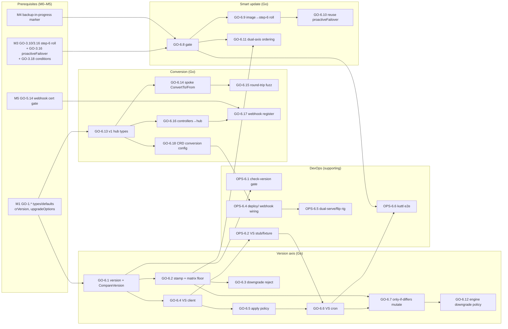
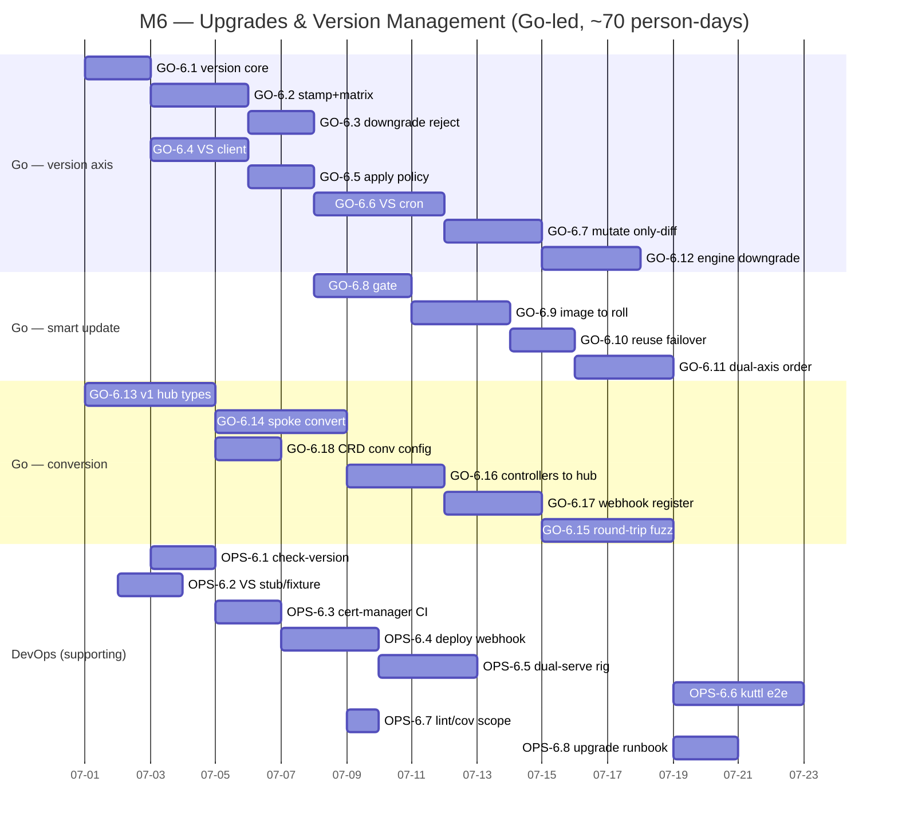

# Phase 6 — Upgrades & Version Management

> **Milestone M6** · Percona Operator for Valkey (`percona-valkey-operator`, API group `valkey.percona.com`, kinds `PerconaValkeyCluster`/`ValkeyNode`/`PerconaValkeyBackup`/`PerconaValkeyRestore`, `v1alpha1`)
> **Tracks:** **Go-led**, DevOps-supporting. The two version axes, `crVersion` gating, `upgradeOptions`/version-service client, failover-aware smart engine update, and the `v1alpha1↔v1` conversion webhook are operator Go code. DevOps supplies the `check-version` CI gate, the version-service contract fixture, the conversion-webhook wiring in `deploy/`, an OLM/kind dual-serving validation rig, and the cert plumbing the webhook consumes — real but bounded work.
> **Source of truth:** [`../architecture/09-upgrades-versioning.md`](../architecture/09-upgrades-versioning.md) (primary) and [`../architecture/03-api-design.md`](../architecture/03-api-design.md) §2.2/§2.12/§4.3/§5/§10 (CR fields, defaulting, conversion plan). Every task below traces to a numbered section of one of those two docs. Where the docs are silent on something needed to build, the gap is recorded as an **OPEN QUESTION** rather than invented.

---

## 1. Objective & demoable outcome

By the end of M6 the operator can be **upgraded in place without touching data pods**, and the **engine** under a running cluster can be **rolled forward to a newer Valkey image with zero downtime**, driven either by a manual `spec.image` edit or by a Percona-style version service under `spec.upgradeOptions`. The API surface gains the formal `crVersion` compatibility machinery and the `v1alpha1 → v1` conversion path so the API can graduate without breaking stored objects. Everything earlier phases stubbed around versioning (M1 stamped `crVersion` in `CheckNSetDefaults`; M3 wired a `serverConfigHash`/image roll and `proactiveFailover`; M5 scaffolded the webhook cert/startup gate) is completed here into the full design of [09](../architecture/09-upgrades-versioning.md).

Concretely, the following must work and be demoable:

1. **Two-axis version model, enforced.** `pkg/version/version.txt` is the single source of truth for the operator axis; `e2e-tests/release_versions` for the engine axis. `spec.crVersion` is auto-stamped to the operator `major.minor` on first reconcile, and a `check-version` CI gate fails any build where `version.txt`'s `major.minor` ≠ the `crVersion` in `deploy/cr*.yaml`. (09 §1, §2)
2. **`crVersion` gating works end-to-end.** `cr.CompareVersion("x.y")` guards behaviour; an unchanged `1.0` CR keeps `1.0` semantics under a `1.1` operator until the user bumps `spec.crVersion`. The compatibility matrix of 09 §8 is honoured: the operator stamps its own `major.minor`, accepts its own minor plus the immediately preceding released minor, rejects `crVersion` below the floor with `CrVersionTooOld`, and refuses a `crVersion` *downgrade* at runtime with `CrVersionDowngradeRejected`. (09 §2, §7, §8)
3. **`upgradeOptions` + version service.** With `spec.upgradeOptions.apply: Recommended`, a reconcile-spawned robfig/cron job polls `versionServiceEndpoint` once per `schedule` window (default `0 4 * * *`), receives a mutually-compatible engine/exporter/backup image triple validated for this `crVersion`, and **mutates `spec.image` only if it differs** — driving a smart update. `Disabled` (the default) never polls; `Latest`/`<version>` resolve their respective pins. A version-service outage logs `VersionCheckFailed`, emits an Event, and does **not** roll or degrade — it retries next window. (09 §3)
4. **Failover-aware smart engine update.** A changed `spec.image` (manual or version-service-driven) re-renders the pod template, changes the image field stamped alongside `serverConfigHash`, and rolls the engine **one `ValkeyNode` at a time, replicas before primary, one shard at a time**, with a graceful `CLUSTER FAILOVER` to the highest-offset synced replica **before** rolling any primary (`FailoverInitiated`/`FailoverCompleted` events), health-gated on cluster `Ready` + all 16384 slots + `master_link_status:up`, and **blocked while a `PerconaValkeyBackup` is running**. No synced replica → in-place roll with a `Warning`. This reuses M3's `reconcileValkeyNodes` (step 6) + `proactiveFailover` rather than re-implementing them. (09 §5)
5. **Operator upgrade procedure.** Apply new CRDs first, roll the operator Deployment (leader election hands over, no data-pod disruption), `crVersion` convergence preserves old behaviour, user opts into the new contract by bumping `spec.crVersion`. A single apply that bumps **both** `spec.crVersion` and `spec.image` activates the contract in memory first, then defers the engine roll behind the smart-update gate until the cluster is `Ready` and no backup runs. (09 §4)
6. **CRD conversion `v1alpha1 → v1` + dual-serving.** `v1` is introduced as the hub; `v1alpha1` is a spoke implementing `ConvertTo`/`ConvertFrom`; a conversion webhook (cert-manager-issued TLS, `caBundle` injected) serves both versions with `v1alpha1` as the initial storage version. Round-trip is lossless (`v1alpha1`-only fields preserved via the `valkey.percona.com/conversion-data` annotation) and envtest-validated by fuzz. The storage-flip + one-time storage-migration procedure is documented and scripted (not executed in v1alpha1). (09 §6, 03 §10)
7. **Downgrade & unsupported-jump policy.** Operator downgrade is unsupported (restore-from-backup is the path); `crVersion` downgrade rejected; engine feature-line downgrade refused (`UnsupportedDowngrade`), patch-level within a line permitted; multi-minor `crVersion` gaps halted (`CrVersionTooOld`); engine multi-minor jump allowed but warned, with the `MigrateSlotsUnsupported` advisory when the resolved engine is below the Valkey 9.0 floor that scale-in/out needs. (09 §7)

**Demo script (one sitting):** install operator `1.0`, create a `cluster` CR with `spec.image: percona/percona-valkey:8.0.x`, watch it reach `Ready` with `crVersion: "1.0"`; edit `spec.image` to a `9.0.x` tag and watch the controlled replicas-before-primary engine roll with `FailoverInitiated`/`FailoverCompleted` events and no client errors; start a `PerconaValkeyBackup`, edit `spec.image` again, and observe the roll *gated* (`UpgradeGatedBackupRunning`) until the backup finishes; set `spec.upgradeOptions.apply: Recommended` against a stub version service and watch a scheduled poll mutate `spec.image` to the recommended pin; point `versionServiceEndpoint` at an unreachable host and watch a poll skip cleanly (`VersionCheckFailed`, no roll); attempt `spec.crVersion: "0.9"` and watch `CrVersionTooOld`/`Degraded`; bump `crVersion` up then attempt to lower it and watch `CrVersionDowngradeRejected`; `kubectl get pvk -o yaml` as both `v1alpha1` and `v1` and confirm the conversion webhook returns equivalent objects with `crVersion` carried verbatim.

---

## 2. Milestone & exit criteria

M6 is **done** when all of the following hold. The baseline DoD from the charter applies to every task: code compiles; unit/envtest added (≥80% pkg coverage); generated artifacts regenerated (deepcopy/CRD/RBAC/bundle); `gofmt`/`go vet`/`golangci-lint`/`gosec` clean; relevant docs updated; CI passes.

| # | Exit criterion | Trace |
|---|----------------|-------|
| E1 | `pkg/version` exposes the operator semver from `version.txt` (compiled in, logged at startup), a `Version()`/`Major()`/`Minor()` API, and `cr.CompareVersion("x.y")` on the CR type; `crVersion` is `major.minor` only (patch never churns it). | 09 §1, §2 |
| E2 | `CheckNSetDefaults` auto-stamps an empty `crVersion` to the operator `major.minor`, **rejects** a value below the one-step-back floor (`CrVersionTooOld`, `Degraded`), and **rejects** a runtime decrease vs `status.lastObservedCrVersion` (`CrVersionDowngradeRejected`, `Degraded`, Warning) — leaving the prior contract in force. | 09 §2, §7, §8; 03 §5 |
| E3 | The compatibility matrix of 09 §8 is encoded and table-tested: `1.0.x`→accept `{1.0}`; `1.1.x`→`{1.0,1.1}`; `1.2.x`→`{1.1,1.2}`; `2.0.x`→`{1.2,2.0}` (release-order one-step-back, across the major boundary). Acceptance is computed, not hardcoded per version. | 09 §8 |
| E4 | `spec.upgradeOptions.apply` decision semantics implemented for `Disabled`/`Recommended`/`Latest`/`<literal>`; `Disabled` never polls; the version-service client POSTs cluster coordinates and parses recommended/latest + exporter + backup pins; `spec.image` is mutated **only if differs**, under a status mutex, never racing the main reconcile. | 09 §3; 03 §2.12 |
| E5 | A reconcile-spawned robfig/cron job is created/updated/removed in lockstep with `spec.upgradeOptions.{apply,schedule}`; polling is **per cluster, once per window**; default schedule `0 4 * * *`; lifecycle tied to the CR (removed on delete/`Disabled`). | 09 §3 |
| E6 | Version-service downtime is tolerated: a failed poll logs, emits `VersionCheckFailed`, mutates nothing, sets **no** `Degraded`, and retries the next window — no in-window retry storm. `versionServiceEndpoint` override works for air-gapped mirrors. | 09 §3 |
| E7 | Smart update rolls the engine on a `spec.image` change: one `ValkeyNode` at a time, replicas before primary, one shard at a time; proactive graceful `CLUSTER FAILOVER` to the `HighestOffsetReplica` before any primary (poll `role:master` ≤10s, `FailoverInitiated`/`FailoverCompleted`); no-synced-replica → in-place roll + `Warning`. Reuses M3 GO-3.10/GO-3.16. | 09 §5; 04 §2.1 (step 6), §11 |
| E8 | Smart-update **gates** enforced: blocks unless cluster `Ready`, all 16384 slots assigned, replicas synced, and **no `PerconaValkeyBackup` running**; while gated it requeues and does not touch data pods. A concurrent `crVersion`-bump-induced `Progressing` holds the roll. | 09 §4, §5 |
| E9 | Dual-axis single-apply ordering: a bump of both `spec.crVersion` and `spec.image` processes `crVersion` in memory in step 0 (`CompareVersion` branches activate), then defers the engine roll behind the gate until `Ready`; the engine roll never starts merely because the contract changed. | 09 §4 |
| E10 | `v1` API version added; `v1` is the conversion **hub**, `v1alpha1` the spoke with `ConvertTo`/`ConvertFrom`; controllers operate only on the hub; conversion is lossless with `v1alpha1`-only data preserved via `valkey.percona.com/conversion-data`; `crVersion` carried verbatim across conversion. | 09 §6; 03 §10 |
| E11 | Conversion webhook wired in `deploy/` (`CRD.spec.conversion.strategy: Webhook`, webhook Service + cert-manager `Certificate`, `caBundle` injection); the M5 webhook-cert/startup gate (GO-5.14) now serves real conversion; `v1alpha1` stays storage version; storage-flip + `storage-version-migrator` procedure documented + scripted (not run). | 09 §6; 03 §10 |
| E12 | Round-trip fuzz tests under envtest (`v1alpha1→v1→v1alpha1` and `v1→v1alpha1→v1`) assert no field drop/corruption, including the lossless-annotation mechanism; dual-serving behaviour (write-as-stored, read-as-converted-not-persisted) validated. | 09 §6 |
| E13 | Engine downgrade gating: feature-line downgrade (e.g. `9.0.x→8.0.x`) refused (`UnsupportedDowngrade`, `Degraded`, no roll); patch-level within a line (`9.0.2→9.0.1`) permitted under an explicit pin. Engine multi-minor *jump* allowed + warned; resolved engine `< 9.0` blocks scale-in/out with `MigrateSlotsUnsupported`. | 09 §7 |
| E14 | Operator upgrade procedure documented and verified: CRDs-first apply, Deployment roll with leader-election handover, no data-pod disruption from operator upgrade alone, `crVersion` convergence preserves old behaviour. | 09 §4 |
| E15 | All version-gating, version-service mutation, and conversion code reviewed by `code-reviewer`; conversion-webhook TLS/cert path reviewed by `security-reviewer` per the team standard (touches a webhook + cert material). | charter DoD; rules `code-review.md`, `security.md` |

---

## 3. Prerequisites (which earlier phases / task-ids must be complete)

M6 is strictly bottom-up and depends on **M0–M5**. It does not introduce new data-plane primitives; it *composes* existing ones (the roll, the failover, the conditions, the cert gate) and adds the version/conversion layer on top. Exact upstream task ids it consumes:

| Prereq | Task ids relied on | What M6 needs from it |
|--------|--------------------|------------------------|
| **M0 Bootstrap** | GO-0.\*, OPS-0.\* | `pkg/version` package + `version.txt`; `cmd/manager` wiring; `make {generate,manifests,test,build}`; pinned `bin/` tools (`controller-gen`, `kustomize`, `setup-envtest`, `mockgen`, `golangci-lint`, `operator-sdk`); CI unit+lint + `check-generate` gate; `pkg/naming`; `pkg/platform`. |
| **M1 API** | GO-1.\* (types + defaults + CEL) | `spec.crVersion` (gated, not hard-immutable, 03 §4.3); `spec.image`; the `spec.upgradeOptions{apply,schedule,versionServiceEndpoint}` fields (03 §2.12); `CheckNSetDefaults` seam (where `crVersion` is stamped, 03 §5); generated deepcopy/CRD. **`status.lastObservedCrVersion`** is added in M6 — flagged in §12 (OQ-6.C). |
| **M2 ValkeyNode** | GO-2.\* (resources builder, pod-template annotation, config/image stamping) | The node maps `spec.serverConfigHash`/`spec.image` to a pod-template annotation that drives the pod roll — M6 changes only the *image source* feeding that mechanism, not the mechanism. |
| **M3 Cluster** | GO-3.1/3.3/3.4/3.5 (client iface + `ClusterState` parse + slot/topology predicates incl. failover helpers `GetSyncedReplicas`/`HighestOffsetReplica`), GO-3.6 (phase-0 reconcile skeleton + `CheckNSetDefaults`/crVersion-gate stub), GO-3.9 (`upsertConfigMap`/`serverConfigRollHash`), GO-3.10 (`reconcileValkeyNodes` one-at-a-time **create**/stepping) + GO-3.16 (the **roll** + `proactiveFailover` integrated into step 6), GO-3.14/3.15 (scale-out/scale-in `MIGRATESLOTS` with the Valkey 9.0 command gate), GO-3.18 (conditions→`status.state` derivation), GO-3.20 (`SetupWithManager` — leader election ON), GO-3.22 (`backupInProgress` roll-gate check — consumer side) | M6 **completes** the phase-0 crVersion gate (GO-3.6 left it a stub that only rejects *newer*-than-operator), feeds the version-service-resolved image into the **existing** step-6 roll (GO-3.10/3.16), reuses `proactiveFailover` (GO-3.16) verbatim for primary rolls, and adds the full smart-update gate (backup-running / Ready / slots) in front of it (extending the GO-3.22 backup-running check). |
| **M4 Backup/Restore** | GO-4.8 (per-cluster `valkey-<cluster>-backup-lock` Lease + backup-in-progress marker + topology-freeze), GO-4.6/4.9 (backup phase machine that sets `Running`) | The smart-update gate must detect a running `PerconaValkeyBackup` — M4's backup-in-progress marker / Lease (GO-4.8) is the **producer**; M3 GO-3.22 first read it; M6 extends that into the full gate and blocks the engine roll. |
| **M5 Security/Obsv** | GO-5.14 (`pkg/tls` webhook-cert bootstrap **scaffold** — pre-flight + startup gate + `WebhookCertNotReady`), GO-5.6 (`pkg/tls` cert-manager `Certificate` provisioning `EnsureCertificate`), OPS-5.6 (cert-manager test infra in CI) | M6's conversion webhook lands on M5's working serving-cert + startup-gate foundation; M5 (GO-5.14) scaffolded it *as a conversion-agnostic shell* and explicitly deferred the `ConvertTo`/`ConvertFrom` conversion logic to M6. |

> **Directional contract reminder (09 §2, §4):** `crVersion` is a **cluster-level** contract; it is **not** copied onto `ValkeyNode` children — the parent applies all `crVersion`-gated decisions before writing the per-node `ValkeyNode.spec` (image, `serverConfigHash`, config). M6 must not leak `crVersion` into the node API. Likewise the two axes must never be conflated: a `crVersion` bump alone must **never** roll the engine (E9), and an engine roll must never change `crVersion`.

---

## 4. Scope — In / Out

### In scope (M6)

- **`pkg/version` completion:** `version.txt` loader, semver parse, `Major()`/`Minor()`, `CompareVersion` receiver on the CR; startup log + Deployment-image-tag alignment doc.
- **`crVersion` gating & matrix:** auto-stamp, one-step-back acceptance computed from the operator's own `major.minor`, `CrVersionTooOld` floor, runtime `CrVersionDowngradeRejected` monotonicity vs `status.lastObservedCrVersion`, the 09 §8 matrix as a tested table.
- **`status.lastObservedCrVersion`** field (new in M6) on `PerconaValkeyCluster.status`, written at successful reconcile tail alongside `observedGeneration`.
- **Version-service client (`pkg/version/service/` — implementing the M0 GO-0.4 `Client` stub):** request/response types, POST of cluster coordinates `(product, operator version/crVersion, current engine, k8s platform)`, parse recommended/latest + exporter + backup pins (multi-image compatibility triple), `versionServiceEndpoint` override, robustness on non-2xx / timeout / malformed body.
- **`upgradeOptions` resolution & cron:** `apply` decision (`Disabled`/`Recommended`/`Latest`/`<literal>`), reconcile-spawned robfig/cron lifecycle keyed by cluster, once-per-window cadence, status-mutex-guarded `spec.image` mutation only-if-differs, `VersionCheckFailed` event + skip-on-failure semantics.
- **Smart-update gate + wiring:** the gate (`Ready` + slots=16384 + replicas synced + **no backup running**) in front of the **existing** M3 step-6 roll; engine-image-change detection feeding the same `serverConfigHash`/pod-template path; reuse of `proactiveFailover`; `UpgradeGated*` reasons/events; dual-axis single-apply ordering.
- **Engine downgrade policy:** feature-line vs patch-level comparison helper, `UnsupportedDowngrade` refusal, engine multi-minor-jump warning, `MigrateSlotsUnsupported` 9.0-floor advisory for scale ops (M3 GO-3.14/3.15 already gate the *command*; M6 surfaces the *upgrade-policy* event).
- **Conversion `v1alpha1↔v1`:** add `v1` types (hub), `v1alpha1` spoke `ConvertTo`/`ConvertFrom`, lossless `valkey.percona.com/conversion-data` annotation, controllers re-pointed to the hub, conversion-webhook server registration, round-trip fuzz tests.
- **Operator-upgrade runbook** (docs deliverable) — ordered CRD-first procedure, dual-axis ordering, anti-patterns.

### Out of scope (deferred / owned elsewhere)

- **Executing the storage-version flip to `v1` + running the storage migration.** v1alpha1 keeps `storage: true`; M6 ships `v1` as *served, non-storage* and the *documented + scripted* flip/migration, but does not flip in v1alpha1 (09 §6, 03 §10). The flip is a later-release operation (matrix `1.2.x`/`2.0.x`, 09 §8).
- **Dropping `v1alpha1` from served versions** — a later release after one-minor deprecation (03 §10).
- **The conversion-webhook serving-cert bootstrap *mechanism*** — built in **M5** (GO-5.14). M6 consumes it and adds the conversion *logic* + the CRD `conversion.strategy: Webhook` wiring.
- **`MigrateSlots`/`GetSlotMigrations` 9.0 command gating** — the *command-level* gate is M3 (GO-3.14 scale-out / GO-3.15 scale-in). M6 only adds the *upgrade-policy-level* `MigrateSlotsUnsupported` advisory when an upgrade resolves an engine below 9.0.
- **Helm `appVersion`/`version` bump, OLM channel/`replaces` edges, docs `release:`/`*recommended` sync, the full release pipeline** — **M7** ([10](../architecture/10-distribution-release.md)). M6 ships only the `check-version` CI gate and the version-service contract fixture.
- **`replication`/`standalone` mode-specific upgrade nuances beyond reuse** — M6 covers `cluster` mode (the v1alpha1 target) and reuses M3's step-6 one-at-a-time roll (GO-3.16) unchanged for whatever `replication`-mode behaviour M3 lands (M3 defers full `replication` mode — see M3 OQ-3.A — and slots its `REPLICAOF` failover path behind the same GO-3.16 mechanism); M6 adds no new mode-specific upgrade logic.
- **PITR / AOF** — deferred beyond v1alpha1 (03 §2.11).

---

## 5. Go Developer Track

Lead packages: `pkg/version` (version.txt, semver, `CompareVersion`, version-service client), `pkg/apis/valkey/v1alpha1` + new `pkg/apis/valkey/v1` (conversion hub/spoke, `lastObservedCrVersion`), `pkg/controller/perconavalkeycluster` (phase-0 gate completion, version-service cron, smart-update gate, downgrade policy), `cmd/manager` (conversion-webhook registration on M5's gate).

| id | title | description | files / packages | key types / funcs | depends-on | DoD (phase-specific) | tests | effort | risk |
|----|-------|-------------|------------------|-------------------|------------|----------------------|-------|--------|------|
| **GO-6.1** | `pkg/version` core + `cr.CompareVersion` CR-method form | **Extend the existing `pkg/version`, do not rebuild it.** M0 GO-0.4 already ships `//go:embed version.txt`, `Version()`, and the `version.CompareVersion(target) int` free function; M1 GO-1.6 added `MajorMinor()`/`DefaultServerImage()`/`DefaultBackupImage()`. This task **adds** `Major()`/`Minor()`/`Patch()` accessors and the **CR-method form `cr.CompareVersion("x.y") int`** the architecture mandates (09 §2 — "a helper on the CR type"), which delegates to `version.CompareVersion` against `cr.Spec.CrVersion` (`major.minor`-aware, tolerant of empty → treated as lowest). Confirm full semver is logged at manager startup (wire into the M0 startup log if not already). | `pkg/version/version.go` (add `Major`/`Minor`/`Patch`), `pkg/apis/valkey/v1alpha1/perconavalkeycluster_version.go` (new CR method) | `Major()`, `Minor()`, `Patch()`, `(*PerconaValkeyCluster).CompareVersion(string) int` (delegates to `version.CompareVersion`) | M0 GO-0.4 (`pkg/version` embed + `CompareVersion`), M1 GO-1.6 (`MajorMinor`) | `crVersion` is `major.minor` only; `CompareVersion` ordering correct incl. across major; empty `crVersion` sorts lowest; CR-method delegates to the M0 free function (no duplicate parse logic); startup log present. | unit: parse table (`1.0.0`,`1.10.2`,`2.0.0`); `CompareVersion` matrix incl. `1.2` vs `2.0`; empty handling; CR-method ↔ free-function equivalence | S (2d) | L — semver edge cases (09 §1, §2) |
| **GO-6.2** | `crVersion` auto-stamp + acceptance/floor | In `CheckNSetDefaults`: stamp empty `crVersion` to operator `major.minor`; compute the **accepted set** from the operator's own `major.minor` per 09 §8 (own minor + immediately-preceding released minor, release-order across the major boundary); reject below-floor with `Degraded`/`CrVersionTooOld` (halt reconcile, leave prior contract); reject newer-than-operator with `UnsupportedCRVersion`. Acceptance is computed, not a hardcoded per-version list. | `pkg/apis/valkey/v1alpha1/perconavalkeycluster_defaults.go` (extend), `pkg/version/compat.go` | `AcceptedCrVersions(opMajorMinor) []string`, `acceptCrVersion(cr, op) error` | GO-6.1, M3 GO-3.6 | Stamps own `major.minor`; `2.0` accepts `{1.2,2.0}`; `1.1` rejects `<1.0`; `1.2` rejects `1.0` (gap>1) with `CrVersionTooOld`; newer→`UnsupportedCRVersion`. | unit: full 09 §8 matrix table; floor + gap rejection; cross-major one-step-back | M (3d) | M — off-by-one in "one step back" (09 §8) |
| **GO-6.3** | `crVersion` downgrade rejection (runtime monotonic) | Add `status.lastObservedCrVersion`; in `CheckNSetDefaults` compare incoming `crVersion` against it and on a **decrease** refuse to proceed: keep prior contract in force, emit Warning Event, set `Degraded`/`CrVersionDowngradeRejected`. Runtime gating (not CEL/admission — `crVersion` is deliberately not hard-immutable, 03 §4.3). Write `lastObservedCrVersion` at successful reconcile tail. | `pkg/apis/valkey/v1alpha1/perconavalkeycluster_defaults.go`, `.../perconavalkeycluster_types.go` (status field), `pkg/controller/perconavalkeycluster/status.go` (tail write) | `status.lastObservedCrVersion`, `rejectCrVersionDowngrade(cr) error` | GO-6.2, M3 GO-3.18 | Decrease → prior contract held, Warning+`Degraded`/`CrVersionDowngradeRejected`; equal/forward allowed; `lastObservedCrVersion` written only on success tail. | envtest: bump up then attempt lower → rejected, condition+event; unit on comparison | S (2d) | M — must not block legitimate forward bump (09 §7) |
| **GO-6.4** | Version-service client | **Implement the `pkg/version/service` `Client` interface stub that M0 GO-0.4 created (interface-only, "wired in M6") — do not invent a parallel client package.** Add the HTTP implementation under `pkg/version/service/`: request type `(product, operatorVersion, crVersion, currentEngine, k8sVersion, platform)` — **all primitives, no `pkg/apis` import** so `pkg/version` stays the std+http near-leaf established in M1 GO-1.6 (the caller in `pkg/controller` projects the CR into a `VSRequest`, avoiding a `pkg/apis → pkg/version → pkg/apis` cycle); POST to `versionServiceEndpoint`; response type carrying recommended + latest **engine, exporter, backup** image tags (the validated-together triple); strict body validation; bounded HTTP timeout; typed errors distinguishing reachable-but-error vs unreachable. No retries inside a window. | `pkg/version/service/service.go` (implement the M0 `Client` iface), `pkg/version/service/types.go` | `Client` iface (from M0), `VSRequest`, `VSResponse{Recommended,Latest VersionSet}`, `VersionSet{Engine,Exporter,Backup string}`, `Resolve(ctx, req) (*VSResponse, error)` | GO-6.1, M0 GO-0.4 (`pkg/version/service` `Client` stub) | Implements the M0 `Client` iface (no duplicate package); parses recommended/latest triple; honours endpoint override; timeout bounded; malformed body → typed error (never panics); fakeable iface for tests. | unit: golden response parse; non-2xx; timeout; malformed JSON; multi-image triple present | M (3d) | M — endpoint/contract drift; iface seam keeps it testable (09 §3) |
| **GO-6.5** | `apply` policy resolution | Map `spec.upgradeOptions.apply` to an action: `Disabled`→no poll, use `spec.image` as-is; `Recommended`→`VSResponse.Recommended.Engine`; `Latest`→`.Latest.Engine`; `<literal>` (e.g. `9.0.1`)→resolve exact tag via VS. Returns the resolved engine **and** matching exporter/backup pins so all three move together. `Disabled` short-circuits before any client call. | `pkg/controller/perconavalkeycluster/upgrade.go` (consumes the `pkg/version/service` client) | `resolveTargetImages(ctx, cluster, vs) (*VersionSet, error)`, `applyPolicy(cr) ApplyMode` | GO-6.4, M1 `upgradeOptions` | Each `apply` branch returns the right pin; `Disabled` makes zero client calls; literal resolves full build tag; triple stays consistent. | unit: per-`apply` branch with fake VS; `Disabled` asserts no client call; literal resolution | S (2d) | M — silent prod auto-roll if default wrong; default is `Disabled` (09 §3) |
| **GO-6.6** | Version-service cron lifecycle | **Reuse the existing `pkg/cron/registry.go` infrastructure (M4 GO-4.11 / M3 GO-3.21 seam), not a new cron framework.** Add a version-check entry keyed by cluster NamespacedName to that registry: create on `apply != Disabled`, update on `schedule` change, **remove** on `Disabled`/CR delete (Percona async-cron-mutates-CR model; CR-lifecycle-bound, never a detached goroutine). Tick handler resolves images (GO-6.5) and performs the only-if-differs mutation (GO-6.7). Once-per-window; no continuous poll. Guard against duplicate entries across leader changes (same leader-handover discipline as the backup cron). | `pkg/controller/perconavalkeycluster/vs_cron.go`, `pkg/cron/registry.go` (extend) | `ensureVersionCheckCron(cr)`, `removeVersionCheckCron(key)` on the shared `cronRegistry` | GO-6.5, M3 GO-3.20 (`SetupWithManager`, leader election ON) + GO-3.21 (cron seam), M4 GO-4.11 (`pkg/cron/registry.go`) | Cron entry created/updated/removed in lockstep with spec via the shared registry; one entry per cluster; default `0 4 * * *`; removed on delete; survives re-elections without dupes. | envtest+fake clock: cron added on Recommended, removed on Disabled/delete; no dup after re-reconcile | M (4d) | H — cron leak / double-fire across leader handover (09 §3) |
| **GO-6.7** | Only-if-differs image mutation (status-mutex) | On a cron tick, if the resolved engine/exporter/backup pins differ from `spec.image`/`spec.exporter.image`/`spec.backup.image`, mutate them under a status mutex (avoid racing the main reconcile); on a poll failure (unreachable or VS error) **mutate nothing**, log + emit `VersionCheckFailed`, set **no** `Degraded`, retry next window. Engine-downgrade attempts are routed through GO-6.12 before any mutation. | `pkg/controller/perconavalkeycluster/upgrade.go`, `pkg/controller/perconavalkeycluster/vs_cron.go` | `applyResolvedImages(ctx, cr, set) (changed bool, err error)`, `mu sync.Mutex` | GO-6.5, GO-6.6, GO-6.12 | Mutates only on real diff and only after downgrade check passes; failure path is silent-skip (no roll, no degrade); mutation is mutex-guarded. | unit: diff→mutate, same→noop, VS-error→noop+event; race test (`-race`) on mutex | M (3d) | H — racing main reconcile / spurious rolls (09 §3, §5) |
| **GO-6.8** | Smart-update gate | Implement the gate that fronts the engine roll: pass only when cluster `Ready`, all 16384 slots assigned (`cluster` mode), per-shard replicas synced (`master_link_status:up`), and **no `PerconaValkeyBackup` running** (read M4 backup-in-progress marker/Lease). Returns gate decision + reason; while gated, requeue and do **not** touch data pods. A `crVersion`-bump-induced `Progressing` naturally fails the `Ready` check, holding the roll. | `pkg/controller/perconavalkeycluster/upgrade.go` | `smartUpdateAllowed(ctx, cr, state) (ok bool, reason string)` | M3 GO-3.18 (conditions→state) + GO-3.22 (backup-running check), M4 GO-4.8 (backup marker/Lease) | All four gates enforced; backup-running blocks; gated path requeues only; reasons map to `UpgradeGated{BackupRunning,NotReady,SlotsIncomplete,ReplicasUnsynced}`. | envtest: backup running blocks roll; not-Ready blocks; unit on each gate | M (3d) | H — rolling mid-backup corrupts stream (09 §4, §5) |
| **GO-6.9** | Engine-image change → step-6 roll wiring | Detect a changed resolved engine image and feed it into the **existing** M3 `reconcileValkeyNodes` (step 6): the new image is stamped onto one `ValkeyNode.spec.image` per pass alongside the `serverConfigHash` (the same pod-template mechanism), one node at a time, replicas before primary, one shard at a time. No new roll machinery — this is *integration*, not reimplementation. | `pkg/controller/perconavalkeycluster/nodes.go` (extend), `pkg/controller/perconavalkeycluster/upgrade.go` | extends `buildValkeyNodeSpec`/`reconcileValkeyNodes`; `engineImageChanged(cr, node) bool` | GO-6.8, M3 GO-3.10 (stepping) + GO-3.16 (roll path) | Image change rolls exactly like a config-hash change; one node/pass; ordering identical to M3; no second roll path introduced. | envtest+fake: image change rolls N nodes sequentially replicas-first; unit on change detection | M (3d) | M — divergent second roll path = ordering bugs (09 §5) |
| **GO-6.10** | Proactive failover reuse for primary engine roll | Before rolling a **primary** during an engine update, invoke the **existing** `proactiveFailover` (M3 GO-3.16): `GetSyncedReplicas` → `HighestOffsetReplica` → graceful `CLUSTER FAILOVER` → poll `INFO replication` `role:master` ≤10s (1s×10 per M3) → `FailoverInitiated`/`FailoverCompleted`; no synced replica → skip failover, roll in place, emit `Warning`. M6 only ensures the engine-roll path calls it (no new failover code). | `pkg/controller/perconavalkeycluster/upgrade.go`, reuse `failover.go` | calls `proactiveFailover(ctx, c, state, shard)` (M3 GO-3.16 signature) | M3 GO-3.16, GO-6.9 | Primary engine roll always preceded by proactive failover when a synced replica exists; events emitted; in-place fallback warned. | envtest+fake: primary roll triggers failover to highest-offset replica; no-replica path warns | S (2d) | H — unplanned election/outage if skipped (09 §5) |
| **GO-6.11** | Dual-axis single-apply ordering | Ensure a single apply changing both `spec.crVersion` and `spec.image` is ordered: `crVersion` processed first in step 0 (`CheckNSetDefaults`/`CompareVersion` activate), engine roll deferred behind the GO-6.8 gate until `Ready`. The contract change alone never enters the roll path. Add explicit precedence in the reconcile entrypoint + a regression test. | `pkg/controller/perconavalkeycluster/controller.go` (phase-0 order), `upgrade.go` | reconcile-entry ordering; `dualAxisOrderingGuard` (test-asserted) | GO-6.2, GO-6.8, GO-6.9 | crVersion lands in-memory before any image-roll consideration; roll waits for `Ready`; contract bump alone causes no roll. | envtest: apply both → crVersion active immediately, roll deferred until Ready; assert no roll on crVersion-only change | M (3d) | M — interleaving causes premature roll (09 §4) |
| **GO-6.12** | Engine downgrade policy | Parse engine versions into feature-line vs patch (`9.0` line vs `9.0.2` patch); refuse a feature-line downgrade (`Degraded`/`UnsupportedDowngrade`, no roll, no mutation); permit patch-level within a line under an explicit pin; warn on a multi-minor forward jump; emit `MigrateSlotsUnsupported` advisory when a resolved engine is `< 9.0` (scale-in/out unsupported, surfacing the M3 GO-3.14/3.15 command gate at the upgrade layer). | `pkg/version/engine.go`, `pkg/controller/perconavalkeycluster/upgrade.go` | `EngineVersion{Line,Patch}`, `classifyEngineChange(cur,next) EngineChangeKind`, `engineFloorOK(v) bool` | GO-6.7, GO-6.9 | Feature-line downgrade refused; patch-level permitted; multi-minor jump warned; `<9.0` resolves `MigrateSlotsUnsupported`; refusal blocks mutation+roll. | unit: `9.0.2→8.0.1` refuse, `9.0.2→9.0.1` permit, `8.0→9.2` warn, `<9.0` floor; envtest condition surface | M (3d) | M — version-parse brittleness; clear engine numbering assumed (09 §7) |
| **GO-6.13** | `v1` hub types + scaffolding | Add `pkg/apis/valkey/v1` with all four kinds as the conversion **hub** (`+kubebuilder:object:root=true`, hub via `Hub()` no-op). Mirror the `v1alpha1` field set (additive, field-compatible per 03 §10). Register the new GV in the scheme; regenerate deepcopy. Controllers re-pointed in GO-6.16. | `pkg/apis/valkey/v1/*_types.go`, `pkg/apis/valkey/v1/groupversion_info.go`, `pkg/apis/valkey/v1/conversion.go` (hub marker methods), `zz_generated.deepcopy.go` | `v1.PerconaValkeyCluster` … each with a `func (*…) Hub() {}` no-op method implementing `conversion.Hub` (a Go method, **not** a kubebuilder comment marker) | M1 types | `v1` types compile; deepcopy generated; `Hub()` present on all four; field set additive/compatible with `v1alpha1`. | `make generate` clean; unit: scheme registers both GVs | M (4d) | M — field-shape drift between versions (03 §10) |
| **GO-6.14** | `v1alpha1` spoke `ConvertTo`/`ConvertFrom` | Implement `conversion.Convertible` on each `v1alpha1` kind: `ConvertTo(hub)` / `ConvertFrom(hub)`. Carry `crVersion` **verbatim**. Preserve any `v1alpha1`-only field with no `v1` home into the `valkey.percona.com/conversion-data` annotation (and restore it on the reverse path) so round-trips are lossless. Re-apply defaults on the hub after conversion. | `pkg/apis/valkey/v1alpha1/conversion.go`, `pkg/apis/valkey/v1alpha1/conversion_annotation.go` | `(*PerconaValkeyCluster).ConvertTo/ConvertFrom`, `stashConversionData`/`restoreConversionData` | GO-6.13 | All four kinds convert both ways; `crVersion` unchanged by conversion; unmapped fields preserved via annotation; defaults re-applied on hub. | unit per kind: field-by-field map; annotation stash/restore; crVersion-verbatim | M (4d) | H — lossy conversion silently drops user data (09 §6) |
| **GO-6.15** | Round-trip fuzz tests | Property/fuzz tests: generate random valid `v1alpha1` and `v1` objects, assert `v1alpha1→v1→v1alpha1` and `v1→v1alpha1→v1` are byte-equivalent (modulo defaulting), including the annotation path. Run under envtest with the **real** conversion webhook serving, validating dual-serving (write-as-stored, read-as-converted-not-persisted). | `pkg/apis/valkey/v1alpha1/conversion_fuzz_test.go`, `pkg/controller/.../conversion_envtest_test.go` | `testing/quick`/`gofuzz` harness | GO-6.14, GO-6.18 | Round-trip lossless for randomized inputs; envtest serves conversion webhook; `v1` read returns converted-not-persisted copy; stored stays `v1alpha1`. | fuzz (CI-bounded iters); envtest dual-serve assertions | M (4d) | H — fuzz flakiness; coverage of optional/has()-guarded fields (09 §6) |
| **GO-6.16** | Re-point controllers to the hub | Switch all four controllers' `For(&...)`/client types to `v1` (the hub), so reconcilers operate on the hub regardless of stored version; ensure status writes and `CheckNSetDefaults` operate on the hub; tolerate either stored version transparently (webhook handles it). | `pkg/controller/**/add_*.go`, `pkg/controller/**/*controller*.go` | controller `For`/scheme type swaps | GO-6.13, GO-6.14 | Controllers compile against `v1`; reconcile works whether object stored as `v1alpha1` or `v1`; no controller assumes a storage version. | envtest: reconcile a `v1alpha1`-stored object via `v1` controller path; existing M3 suite still green | M (3d) | M — wide blast radius; gated behind full suite re-run (09 §6) |
| **GO-6.17** | Conversion-webhook server registration | Register the conversion webhook on the manager's webhook server (reusing M5 GO-5.14's serving-cert + startup gate): `ctrl.NewWebhookManagedBy().For(&v1.PerconaValkeyCluster{})...` for all four kinds; ensure the server only advertises after the cert/`caBundle` gate passes; mid-run cert loss → `WebhookCertNotReady` (M5 path). | `cmd/manager/webhook.go`, `cmd/manager/main.go` | `setupConversionWebhooks(mgr)` | GO-6.13/6.14, M5 GO-5.14 | Webhook registered for all four kinds; serves only after gate; reuses M5 cert path; no duplicate cert bootstrap. | integration: empty cert blocks serving; populated → conversion answered; delete mid-run → condition | M (3d) | H — bootstrap race bricks all reads if cert path wrong (09 §6, security §3.5) |
| **GO-6.18** | Conversion config in CRD + scheme finalize | Drive `controller-gen` to emit the multi-version CRD with the correct served/storage flags: `+kubebuilder:storageversion` on **`v1alpha1`** (so it stays `storage: true`/`served: true`) and plain served `v1` (`served: true`/`storage: false`). The `spec.conversion.strategy: Webhook` stanza + webhook `clientConfig` (Service + `caBundle` placeholder for the cert-manager `ca-injector`) is **not** emitted by `controller-gen` itself — it is layered in via the kustomize `config/crd/patches/` overlay (standard kubebuilder flow), which OPS-6.4 owns in `deploy/`. Finalize scheme registration order here. | `pkg/apis/.../*_types.go` markers (`+kubebuilder:storageversion`), `config/crd/kustomization.yaml`, `deploy/crd.yaml` (generated) | `+kubebuilder:storageversion` on `v1alpha1`; kustomize conversion patch reference | GO-6.13 | Generated CRD has correct served/storage flags; conversion stanza injected via the kustomize patch (authored with OPS-6.4); `make manifests` clean; scheme order deterministic. | `make manifests` diff asserts conversion block + storage flags; CI `check-generate` | S (2d) | M — wrong storage flag = unreadable objects (03 §10, 09 §6) |

---

## 6. DevOps / Platform Track

M6 is **Go-led**, but DevOps has real, bounded supporting work: the CI gate that keeps the two version axes in sync, a version-service contract fixture + stub so the Go client can be tested without `check.percona.com`, the conversion-webhook wiring in `deploy/`, a kind/OLM rig that validates dual-serving + the documented storage flip, and the cert plumbing the webhook needs in CI. There is **no Helm `appVersion`/OLM channel/docs-`release:` work here** — that is M7 ([10-distribution-release.md](../architecture/10-distribution-release.md)); M6 ships only the gate and fixtures the release pipeline will later consume.

| id | title | description | files / packages | depends-on | DoD (phase-specific) | tests | effort | risk |
|----|-------|-------------|------------------|------------|----------------------|-------|--------|------|
| **OPS-6.1** | `check-version` CI gate | Add a CI job (and `make check-version`) that parses `pkg/version/version.txt`'s `major.minor` and asserts it equals the `crVersion` in `deploy/cr.yaml` + `deploy/cr-minimal.yaml`; fails the build on mismatch. This is the structural mitigation for the #1 footgun (editing `version.txt` without re-running the crVersion sync). | `Makefile` (`check-version`), `.github/workflows/test.yml`, `hack/check-version.sh` | OPS-0.\* (CI), GO-6.1 | Gate fails on `version.txt` major.minor ≠ `cr*.yaml` crVersion; passes when synced; runs on PR. | CI: deliberate mismatch on a test branch → red; synced → green | S (1.5d) | M — gate is the only thing catching axis drift (09 §1, §2; 10) |
| **OPS-6.2** | Version-service stub + contract fixture | Provide a tiny HTTP stub server (test helper) honouring the version-service request/response contract (recommended/latest engine+exporter+backup triple), plus golden JSON fixtures, so GO-6.4/6.5/6.6 are tested without the live endpoint. Document the request/response schema as the M6→M7 hand-off contract. | `internal/testutil/vsstub/`, `testdata/versionservice/*.json`, docs note | GO-6.4 | Stub serves canned + error responses; fixtures cover recommended/latest/literal + 5xx + malformed; schema documented. | used by GO-6.4–6.7 unit/envtest; stub self-test | S (2d) | L — contract may differ from real VS → OQ-6.A |
| **OPS-6.3** | cert-manager in envtest/CI for conversion webhook | Ensure CI installs cert-manager CRDs + (where needed) a minimal issuer into the envtest/kind harness so the conversion webhook's `Certificate` resolves and `caBundle` injection works during GO-6.15/6.17 integration tests; reuse the M5 cert-manager CI plumbing (do not duplicate). | `.github/workflows/test.yml`, `hack/envtest-setup.sh`, `e2e-tests/` setup | OPS-5.6 (cert-manager test infra in CI), GO-6.17 | Conversion-webhook integration tests get a working cert path in CI; no duplicate cert-manager install vs M5. | the GO-6.15/6.17 integration jobs (meta) | S (1.5d) | M — flaky cert readiness in CI (09 §6) |
| **OPS-6.4** | Conversion-webhook wiring in `deploy/` | Add the webhook `Service`, the cert-manager `Certificate` for the conversion webhook, and the `cert-manager.io/inject-ca-from` annotation on the CRDs so `caBundle` is injected; ensure `deploy/bundle.yaml`/`cw-bundle.yaml` (kustomize-generated) include the webhook + RBAC for it. Generated artifact — author the kustomize overlay, not the CRD by hand. | `config/webhook/`, `config/crd/patches/`, `deploy/bundle.yaml`/`cw-bundle.yaml` (generated) | GO-6.18, OPS-5.1 (bundle regen) + OPS-5.6 (cert-manager) | `make manifests` emits webhook Service + Certificate + CA-inject annotation; bundles carry them; no hand-edited generated files. | `make manifests` render check; kind apply smoke (webhook Service present) | M (3d) | M — wrong inject annotation = unresolved caBundle (09 §6) |
| **OPS-6.5** | Dual-serving + storage-flip validation rig (kind) | A kind-based script that installs the operator with both `v1alpha1`+`v1` served (`v1alpha1` storage), creates an object as `v1alpha1`, reads it as `v1` (asserts converted-not-persisted), then exercises the **documented** storage-flip + `storage-version-migrator` procedure in a throwaway cluster to prove the runbook (the flip is NOT done in the product). | `e2e-tests/conversion/`, `hack/storage-migration-runbook.sh` | OPS-6.4, GO-6.15/6.17 | Rig proves dual-serving read/write semantics + a dry-run of the storage flip/migration; runbook executable end-to-end on kind. | kind job (manual/Jenkins, not PR gate per charter) | M (3d) | M — storage-migrator behaviour assumptions → OQ-6.B (09 §6) |
| **OPS-6.6** | Smart-update / version kuttl e2e scaffolding | Author kuttl TestSuites under `e2e-tests/tests/` for: engine roll on `spec.image` change (replicas-before-primary order asserted via `compare_kubectl`), backup-running gate (roll blocked), version-service `Recommended` mutation against the OPS-6.2 stub, `crVersion` downgrade rejection. Add rows to `run-pr.csv` (smoke) and `run-release.csv` (full + failover). Gate engine-version-sensitive steps on the 9.0 floor. | `e2e-tests/tests/upgrade-*/`, `e2e-tests/run-pr.csv`, `e2e-tests/run-release.csv` | GO-6.6/6.8/6.9, OPS-6.2 | kuttl suites assert roll order + gate + VS mutation + downgrade reject; CSV rows added; 9.0-gated steps marked; **e2e runs on Jenkins/GKE, not PR** (charter). | the kuttl suites (run on Jenkins per charter) | M (4d) | M — e2e timing flakiness on rolls/failover |
| **OPS-6.7** | golangci-lint/gosec scope + `pkg/version`/`v1` packages | Extend lint/gosec scope to the new `pkg/version` (HTTP client — gosec on URL handling, no SSRF via attacker-controlled endpoint beyond the documented override), `pkg/apis/valkey/v1`, conversion code; raise per-pkg coverage gate to 80% for `pkg/version` + conversion packages. | `.golangci.yml`, `Makefile` (`lint`,`test` coverage) | OPS-0.\*, GO-6.4/6.13/6.14 | Clean lint/gosec on new packages; coverage gate enforced for `pkg/version` + conversion; HTTP client reviewed for endpoint handling. | CI lint+coverage stages | XS (0.5d) | L |
| **OPS-6.8** | Operator-upgrade runbook + version docs | Author the operator-upgrade runbook (CRDs-first, Deployment roll, `crVersion` opt-in, dual-axis ordering, anti-patterns) and the two-axis/version-matrix reference as repo docs, cross-linked to 09. This is the docs deliverable that the M7 site (`k8svalkey-docs`) will later import. | `docs/operations/upgrade-runbook.md`, `docs/operations/versioning.md` | GO-6.\* (behaviour finalized) | Runbook matches implemented behaviour; matrix mirrors 09 §8; anti-patterns (bump image before operator) called out; reviewed by `doc-updater`. | docs review; link-check | S (1.5d) | L (09 §4, §8) |

---

## 7. Key technical decisions to honour (with arch-doc citations)

1. **Two axes, never conflated.** Operator axis = `version.txt` → `crVersion` `major.minor`; engine axis = `release_versions` + version service. A `crVersion` bump must never roll the engine; an engine roll must never change `crVersion`. CI's `check-version` gate enforces sync. (09 §1, §2; OPS-6.1, GO-6.11)
2. **`crVersion` is `major.minor` only.** Patch operator releases never churn `crVersion`. Auto-stamped on first reconcile; gated via `CompareVersion`, never hardcoded checks. (09 §2; GO-6.1, GO-6.2)
3. **Compatibility matrix = own minor + one preceding released minor (release-order).** `2.0.x` accepts `{1.2,2.0}` across the major boundary; below-floor → `CrVersionTooOld`; downgrade rejected at runtime, not CEL (`crVersion` is deliberately not hard-immutable to allow forward opt-in). (09 §7, §8; 03 §4.3; GO-6.2, GO-6.3)
4. **`apply: Disabled` is the default.** Auto-engine-upgrade is opt-in; `Recommended` is the production managed value; `Latest` is dev-only. `Disabled` makes zero version-service calls. (09 §3; 03 §2.12; GO-6.5)
5. **Version-service downtime is tolerated by design.** Per-cluster, once-per-window poll; failure → log + `VersionCheckFailed` event + skip, **no degrade, no roll**, retry next window. No in-window retry storm. (09 §3; GO-6.6, GO-6.7)
6. **Smart update is failover-aware and gated.** Replicas before primary, one shard at a time, proactive graceful `CLUSTER FAILOVER` before a primary, health-gated, **backup-blocked**, config/image-hash-driven (excluding the live-settable allowlist `maxmemory`/`maxmemory-policy`/`maxclients`). It is **step 6** of the §2.1 pipeline — not a new phase. (09 §5; 04 §2.1 step 6, §11; GO-6.8, GO-6.9, GO-6.10)
7. **Operator upgrade ≠ engine upgrade; dual-axis applies are ordered.** CRDs-first; Deployment roll never touches data pods; a single apply touching both axes activates the contract in memory first, defers the engine roll behind the gate until `Ready`. (09 §4; GO-6.11)
8. **`v1alpha1 → v1` via hub-and-spoke conversion webhook, lossless.** `v1` hub, `v1alpha1` spoke; controllers operate on the hub; `v1alpha1`-only fields preserved via `valkey.percona.com/conversion-data`; `crVersion` carried verbatim; envtest fuzz round-trip is the safety gate. (09 §6; 03 §10; GO-6.13–6.18)
9. **Dual-serving safety: write-as-stored, read-as-converted-not-persisted.** `v1alpha1` stays storage version in v1alpha1; `v1` reads return a non-persisted converted copy; the storage flip + one-time migration is documented/scripted but **not executed** this release. (09 §6; 03 §10; OPS-6.5)
10. **Engine downgrade gated; multi-minor jumps warned; 9.0 floor surfaced.** Feature-line downgrade refused (`UnsupportedDowngrade`); patch-level permitted; engine multi-minor jump allowed + warned; resolved engine `< 9.0` → `MigrateSlotsUnsupported` (scale ops unsupported). (09 §7; GO-6.12)

---

## 8. Illustrative code skeletons / function signatures (Go)

### 8.1 `pkg/version` — semver + `CompareVersion` (GO-6.1)

```go
package version

import _ "embed"

//go:embed version.txt
var raw string

// Version returns the operator semver, e.g. "1.1.0".
func Version() string { /* strings.TrimSpace(raw) */ }

// Major/Minor parse the embedded semver.
func Major() int { /* ... */ }
func Minor() int { /* ... */ }

// MajorMinor returns "x.y" — the value stamped into spec.crVersion.
func MajorMinor() string { /* fmt.Sprintf("%d.%d", Major(), Minor()) */ }
```

```go
package v1alpha1

// CompareVersion compares the CR's crVersion against "x.y" (major.minor aware).
// Returns -1 / 0 / +1. An empty crVersion sorts lowest.
func (cr *PerconaValkeyCluster) CompareVersion(want string) int { /* ... */ }
```

### 8.2 `crVersion` acceptance, floor, and downgrade rejection (GO-6.2 / GO-6.3)

```go
// AcceptedCrVersions computes the accepted set for an operator major.minor,
// per 09 §8: own minor + immediately-preceding RELEASED minor (release order,
// across the major boundary 2.0 ⇒ {1.2, 2.0}). Computed, not hardcoded.
func AcceptedCrVersions(opMajorMinor string) []string { /* ... */ }

// In CheckNSetDefaults (09 §2, §7, §8):
func (cr *PerconaValkeyCluster) reconcileCrVersion(op string, rec record.EventRecorder) error {
    if cr.Spec.CrVersion == "" {
        cr.Spec.CrVersion = version.MajorMinor() // auto-stamp
    }
    // monotonicity vs status.lastObservedCrVersion (runtime, not CEL — 03 §4.3)
    if last := cr.Status.LastObservedCrVersion; last != "" &&
        compareMajorMinor(cr.Spec.CrVersion, last) < 0 {
        cr.Spec.CrVersion = last // keep prior contract in force
        rec.Event(cr, "Warning", ReasonCrVersionDowngradeRejected, "...")
        return errCrVersionDowngrade // sets Degraded/CrVersionDowngradeRejected
    }
    if !slices.Contains(AcceptedCrVersions(op), cr.Spec.CrVersion) {
        // below floor or > one-step-back ⇒ CrVersionTooOld;
        // newer-than-operator ⇒ UnsupportedCRVersion (halt, leave prior contract)
        return errCrVersionUnaccepted(cr.Spec.CrVersion, op)
    }
    return nil
}
```

### 8.3 Version-service client + `apply` resolution (GO-6.4 / GO-6.5)

```go
type VersionSet struct{ Engine, Exporter, Backup string } // validated TOGETHER (09 §3)
type VSResponse struct{ Recommended, Latest VersionSet }

// service.Client is the M0 GO-0.4 interface stub, given its HTTP body in GO-6.4.
type Client interface { // pkg/version/service
    Resolve(ctx context.Context, req VSRequest) (*VSResponse, error) // typed err: unreachable vs VS-error
}

// resolveTargetImages maps spec.upgradeOptions.apply to a concrete VersionSet.
func resolveTargetImages(ctx context.Context, cr *PerconaValkeyCluster, vs service.Client) (*VersionSet, error) {
    switch mode := applyPolicy(cr); mode {
    case ApplyDisabled:
        return nil, nil // NO poll — use spec.image as-is (09 §3)
    case ApplyRecommended:
        r, err := vs.Resolve(ctx, vsRequest(cr)); if err != nil { return nil, err }
        return &r.Recommended, nil
    case ApplyLatest:
        r, err := vs.Resolve(ctx, vsRequest(cr)); if err != nil { return nil, err }
        return &r.Latest, nil
    default: // literal version e.g. "9.0.1" — resolve full build tag via VS
        return resolveLiteral(ctx, vs, cr, string(mode))
    }
}
```

### 8.4 Smart-update decision pseudocode (GO-6.7 / GO-6.8 / GO-6.9 / GO-6.10 / GO-6.12)

This is the requested decision pseudocode for the smart engine update — it mirrors the §5 flowchart of 09 and sits inside **step 6** of the cluster reconcile pipeline.

```go
// smartUpdate is invoked once per reconcile, inside reconcileValkeyNodes (step 6).
// It NEVER rolls more than one ValkeyNode per pass.
func smartUpdate(ctx context.Context, cr *PerconaValkeyCluster, state *valkey.ClusterState) (ctrl.Result, error) {

    // (A) Resolve the target engine image per apply-policy. The literal/Recommended/Latest
    //     resolution and the only-if-differs spec.image mutation happen on the version-service
    //     cron tick (GO-6.6/6.7); by the time we reach step 6, spec.image is the resolved target.
    target := cr.Spec.Image

    // (B) Downgrade policy (09 §7) — refuse a feature-line downgrade BEFORE any roll.
    switch classifyEngineChange(currentEngine(state), target) {
    case EngineFeatureLineDowngrade:
        setDegraded(cr, ReasonUnsupportedDowngrade)
        return noRoll(cr)
    case EngineMultiMinorJump:
        recorder.Event(cr, "Normal", ReasonEngineJumpWarning, "...") // allowed + warned
    }
    if !engineFloorOK(target) { // < 9.0 ⇒ scale-in/out unsupported (surfaces the M3 command gate)
        recorder.Event(cr, "Warning", ReasonMigrateSlotsUnsupported, "...")
    }

    // (C) Gates (09 §4, §5) — block, do NOT touch data pods, just requeue.
    if ok, reason := smartUpdateAllowed(ctx, cr, state); !ok {
        recorder.Event(cr, "Normal", reason, "engine upgrade deferred")
        return requeueFast, nil // UpgradeGatedBackupRunning / NotReady / SlotsIncomplete / ReplicasUnsynced
    }

    // (D) Pick the next shard with a stale node; replicas BEFORE primary,
    //     one shard at a time (09 §5 invariants 2 & 3).
    node := nextStaleNode(cr, state, target) // nil ⇒ all on new engine
    if node == nil {
        return markReadyDone(cr) // Progressing=false, Ready (09 §5)
    }

    if isPrimary(node, state) {
        // (E) Proactive graceful failover before rolling a primary (09 §5; reuse M3 GO-3.16
        //     proactiveFailover verbatim — it internally picks the highest-offset synced
        //     replica, or defers/warns when none exists). Signature matches M3 GO-3.16.
        done, err := proactiveFailover(ctx, cr, state, shardOf(node)) // FAILOVER + poll role:master 1s×10
        if err != nil {
            return requeueFast, err // FailoverInitiated / FailoverCompleted (or NoSyncedReplica Warning) events inside
        }
        if !done {
            // no safe target → M3 emitted the Warning and deferred; we roll the primary in place this pass.
        }
        // on done, node is now a replica — fall through and roll it as a replica.
    }

    // (F) Stamp the new image (+ serverConfigHash) onto exactly ONE ValkeyNode.spec;
    //     the ValkeyNode controller maps it to a pod-template annotation → pod roll
    //     (the SAME mechanism as a config-hash change — GO-6.9, no second roll path).
    stampNodeImage(node, target)
    if err := r.Update(ctx, node); err != nil {
        return ctrl.Result{}, err
    }

    // (G) One node per pass; wait for status.ready before the next (09 §5 invariant 2).
    return requeueFast, nil
}
```

### 8.5 `v1alpha1` spoke conversion (GO-6.14)

```go
package v1alpha1

// ConvertTo converts this v1alpha1 object to the v1 hub. crVersion is copied verbatim;
// any v1alpha1-only field with no v1 home is stashed in the conversion-data annotation
// so v1 → v1alpha1 → v1 round-trips losslessly (09 §6).
func (src *PerconaValkeyCluster) ConvertTo(dstRaw conversion.Hub) error {
    dst := dstRaw.(*v1.PerconaValkeyCluster)
    dst.ObjectMeta = src.ObjectMeta
    dst.Spec.CrVersion = src.Spec.CrVersion // verbatim — orthogonal to apiVersion
    // ... field-by-field additive map ...
    return stashConversionData(src, dst) // preserve unmapped fields under the annotation
}

func (dst *PerconaValkeyCluster) ConvertFrom(srcRaw conversion.Hub) error {
    src := srcRaw.(*v1.PerconaValkeyCluster)
    // ... reverse map ...
    dst.Spec.CrVersion = src.Spec.CrVersion
    return restoreConversionData(src, dst)
}
```

### 8.6 `check-version` gate (OPS-6.1) — `hack/check-version.sh`

```bash
#!/usr/bin/env bash
set -euo pipefail
# Structural mitigation for the #1 footgun (09 §1, §2): version.txt vs crVersion drift.
ver="$(tr -d '[:space:]' < pkg/version/version.txt)"          # e.g. 1.1.0
mm="${ver%.*}"                                                  # 1.1
for f in deploy/cr.yaml deploy/cr-minimal.yaml; do
  crv="$(yq '.spec.crVersion' "$f")"                           # e.g. "1.1"
  [[ "$crv" == "$mm" ]] || { echo "FAIL: $f crVersion=$crv != version.txt major.minor=$mm"; exit 1; }
done
echo "OK: version.txt ($ver) major.minor=$mm matches crVersion in deploy/cr*.yaml"
```

---

## 9. Test plan

### 9.1 Unit (Go, table-driven + golden)

- **`pkg/version`:** semver parse table; `MajorMinor`; `CompareVersion` ordering (incl. `1.2` vs `2.0`, empty-lowest). (GO-6.1)
- **`crVersion` matrix:** `AcceptedCrVersions` for `1.0`/`1.1`/`1.2`/`2.0` exactly matches 09 §8; floor + gap rejection; cross-major one-step-back. (GO-6.2)
- **Downgrade rejection:** decrease vs `lastObservedCrVersion` rejected; forward/equal allowed. (GO-6.3)
- **Version-service client:** golden response parse (recommended/latest triple); non-2xx; timeout; malformed body → typed error, no panic. (GO-6.4)
- **`apply` resolution:** each branch returns the correct pin; `Disabled` makes zero client calls (assert via fake). (GO-6.5)
- **Engine policy:** `classifyEngineChange` table (`9.0.2→8.0.1` downgrade, `9.0.2→9.0.1` patch, `8.0→9.2` jump); `engineFloorOK`. (GO-6.12)
- **Conversion:** per-kind field-by-field `ConvertTo`/`ConvertFrom`; annotation stash/restore; `crVersion` verbatim. (GO-6.14)

### 9.2 envtest (Ginkgo/Gomega, controller-level)

- **Auto-stamp + gate:** apply CR with empty `crVersion` → stamped to operator `major.minor`; apply `0.9` under `1.1` → `CrVersionTooOld`/`Degraded`; bump up then attempt lower → `CrVersionDowngradeRejected` (condition + Warning). (GO-6.2, GO-6.3)
- **Version-service cron:** `apply: Recommended` (against the OPS-6.2 stub via fake clock) creates a cron, a tick mutates `spec.image` only-if-differs; switch to `Disabled`/delete removes the cron; VS-error tick → `VersionCheckFailed`, no mutation, no `Degraded`. (GO-6.6, GO-6.7)
- **Smart-update gate + roll:** image change rolls N nodes sequentially, replicas-before-primary; primary roll preceded by proactive failover to highest-offset replica (`FailoverInitiated`/`FailoverCompleted`); backup-running blocks the roll (`UpgradeGatedBackupRunning`); not-Ready blocks. (GO-6.8, GO-6.9, GO-6.10)
- **Dual-axis ordering:** apply both `crVersion`+`image` → `crVersion` active immediately, engine roll deferred until `Ready`; `crVersion`-only change causes no roll. (GO-6.11)
- **Conversion dual-serving:** with the real conversion webhook served under envtest, write as `v1alpha1`, read as `v1` (converted, **not** persisted — stored stays `v1alpha1`); reconcile a `v1alpha1`-stored object via the `v1` controller path. (GO-6.16, GO-6.17)
- **Round-trip fuzz:** `v1alpha1→v1→v1alpha1` and reverse are lossless for randomized inputs (CI-bounded iteration count). (GO-6.15)

### 9.3 kuttl e2e (OPS-6.6; on kind locally, full matrix on Jenkins/GKE per charter)

- `upgrade-engine-roll`: `spec.image` change rolls replicas-before-primary (asserted via `compare_kubectl` golden) with no client-visible downtime. (run-pr.csv smoke + run-release.csv)
- `upgrade-backup-gate`: start a `PerconaValkeyBackup`, change `spec.image`, assert the roll is blocked until the backup completes. (run-release.csv)
- `upgrade-version-service`: `apply: Recommended` against the OPS-6.2 stub → `spec.image` mutated → roll. (run-release.csv)
- `crversion-downgrade-reject`: attempt a `crVersion` decrease → `Degraded`/`CrVersionDowngradeRejected`, cluster stays on prior contract. (run-pr.csv)
- 9.0-floor-sensitive steps (scale-in/out under upgrade) gated to the Valkey 9.0 image row per the engine-version matrix.

### 9.4 CI gates

- **`check-version`** (OPS-6.1): fail on `version.txt` major.minor ≠ `cr*.yaml` crVersion.
- **`check-generate`**: conversion block + served/storage flags + deepcopy for `v1` are regenerated and committed.
- Lint/gosec/coverage extended to `pkg/version` + `pkg/apis/valkey/v1` + conversion code (OPS-6.7).

---

## 10. Risks & mitigations

| # | Risk | Sev | Likelihood | Mitigation | Trace |
|---|------|-----|-----------|------------|-------|
| R1 | **Axis confusion** — `version.txt` bumped without `crVersion` sync → upgrade loop / CR rejection. | CRITICAL | Med | `check-version` CI gate (OPS-6.1) fails the build on drift; `crVersion` is a *copy* of `version.txt` major.minor written by `make release`, never hand-edited. | 09 §1, §2 |
| R2 | **Engine roll mid-backup corrupts the backup stream.** | CRITICAL | Med | Smart-update gate hard-blocks while any `PerconaValkeyBackup` runs (GO-6.8, reads M4 marker/Lease); envtest + kuttl assert the block. | 09 §4, §5 |
| R3 | **Primary roll without proactive failover → unplanned election / write outage.** | HIGH | Med | Reuse M3 `proactiveFailover` verbatim (GO-6.10): graceful `CLUSTER FAILOVER` to highest-offset synced replica, poll `role:master` ≤10s; no-replica → in-place + `Warning`. | 09 §5 |
| R4 | **Lossy `v1alpha1↔v1` conversion silently drops user data.** | HIGH | Med | Lossless-annotation mechanism (GO-6.14) + envtest round-trip fuzz gate (GO-6.15) before any storage flip; `crVersion` carried verbatim. | 09 §6 |
| R5 | **Conversion-webhook cert bootstrap race bricks *all* reads** (webhook required for every served-version GET). | HIGH | Med | Build on M5's proven startup gate (GO-5.14): webhook advertises only after cert + `caBundle` ready; mid-run loss → `WebhookCertNotReady` + recovery; OPS-6.3 ensures cert-manager in CI. | 09 §6; security §3.5 |
| R6 | **Storage flip drops `v1alpha1` while objects still stored in it → unreadable objects.** | HIGH | Low | v1alpha1 keeps `storage: true`; flip + `storage-version-migrator` are documented + kind-validated (OPS-6.5) but **not executed** this release; matrix defers the flip to `1.2.x`/`2.0.x`. | 09 §6, §8; 03 §10 |
| R7 | **Version-service cron leak / double-fire across leader handover** → racing/duplicate `spec.image` mutations. | HIGH | Med | One cron per cluster keyed by NamespacedName; removed on `Disabled`/delete; only the elected leader reconciles (M3 GO-3.16); mutation under a status mutex (GO-6.7); `-race` test. | 09 §3 |
| R8 | **Silent prod auto-roll** if `apply` defaults to anything but `Disabled`. | HIGH | Low | `apply: Disabled` is the marker+`CheckNSetDefaults` default (03 §2.12, 09 §3); `Disabled` makes zero version-service calls (GO-6.5); documented in the runbook (OPS-6.8). | 09 §3 |
| R9 | **Engine downgrade across a feature line corrupts on-disk format.** | HIGH | Low | `classifyEngineChange` refuses feature-line downgrades (`UnsupportedDowngrade`, no roll); only patch-level within a line permitted under explicit pin. | 09 §7 |
| R10 | **`crVersion` downgrade silently disables depended-on behaviour.** | MED | Low | Runtime monotonic rejection vs `status.lastObservedCrVersion` (GO-6.3), `CrVersionDowngradeRejected`, prior contract held. | 09 §7 |
| R11 | **Phantom engine roll** from non-deterministic config/image hashing on operator upgrade. | MED | Med | Reuse M3's deterministic `serverConfigHash` (sorted, live-settable excluded); M6 changes only the *image source*, not the hash; idempotent-reconcile guarantee. | 09 §4; 04 §11 |
| R12 | **Re-pointing controllers to the `v1` hub** has wide blast radius. | MED | Med | Land behind the full M3 + M6 envtest suite re-run (GO-6.16); controllers never assume a storage version. | 09 §6 |
| R13 | **Version-service contract mismatch vs the eventual real endpoint.** | MED | Med | Stub + documented contract fixture (OPS-6.2) as the M6→M7 hand-off; iface seam (GO-6.4) isolates the contract. Recorded as **OQ-6.A**. | 09 §3 |

---

## 11. Effort summary (rollup person-days for this phase)

| Track | Tasks | Person-days |
|-------|-------|-------------|
| **Go Developer** | GO-6.1 (2) · GO-6.2 (3) · GO-6.3 (2) · GO-6.4 (3) · GO-6.5 (2) · GO-6.6 (4) · GO-6.7 (3) · GO-6.8 (3) · GO-6.9 (3) · GO-6.10 (2) · GO-6.11 (3) · GO-6.12 (3) · GO-6.13 (4) · GO-6.14 (4) · GO-6.15 (4) · GO-6.16 (3) · GO-6.17 (3) · GO-6.18 (2) | **53** |
| **DevOps / Platform** | OPS-6.1 (1.5) · OPS-6.2 (2) · OPS-6.3 (1.5) · OPS-6.4 (3) · OPS-6.5 (3) · OPS-6.6 (4) · OPS-6.7 (0.5) · OPS-6.8 (1.5) | **17** |
| **Total** | 18 GO + 8 OPS | **≈70 person-days** |

Roughly **76% Go / 24% DevOps** — consistent with the "Go-led, DevOps-supporting" framing. With two engineers in parallel, the **critical path is Go** (conversion + smart-update + version-service), so wall-clock is bounded by the Go track (~7–8 engineer-weeks of Go work, partially parallelizable across the version-service, smart-update, and conversion sub-tracks).

### Phase dependency snapshot (mermaid)



### Mini-Gantt (this phase, two parallel engineers)



---

## 12. References

- [`../architecture/09-upgrades-versioning.md`](../architecture/09-upgrades-versioning.md) — **primary source.** §1 two axes; §2 `version.txt`/`crVersion` + must-match; §3 `upgradeOptions` + version service + downtime tolerance; §4 operator upgrade + dual-axis ordering; §5 failover-aware smart update (flowchart + sequence); §6 conversion `v1alpha1→v1` + dual-serving; §7 downgrade/unsupported-jump; §8 compatibility matrix; §9 decision summary.
- [`../architecture/03-api-design.md`](../architecture/03-api-design.md) — §2.2 identity/version fields; §2.12 `upgradeOptions`; §4.3 `crVersion` gated-not-immutable; §5 defaulting (auto-stamp); §10 API versioning & conversion plan.
- [`../architecture/04-control-plane.md`](../architecture/04-control-plane.md) — `CheckNSetDefaults` invocation point; step-6 `reconcileValkeyNodes`; §11 config-hash rolling restart; §8 leader election (cron-on-leader); conditions→state.
- [`../architecture/05-data-plane.md`](../architecture/05-data-plane.md) — replica selection (`GetSyncedReplicas`/`HighestOffsetReplica`), graceful `CLUSTER FAILOVER`, `TAKEOVER` recovery, 9.0 `MIGRATESLOTS` floor.
- [`../architecture/06-backup-restore.md`](../architecture/06-backup-restore.md) — backup-in-progress gating of smart update; restore-from-backup as the supported rollback path.
- [`../architecture/07-security.md`](../architecture/07-security.md) — §3.5 conversion-webhook TLS bootstrap (consumed via M5 GO-5.14).
- [`../architecture/10-distribution-release.md`](../architecture/10-distribution-release.md) — `check-version`/`check-generate` gates; the per-edge version-sync checklist (M7 owns Helm/OLM/docs propagation).
- **Implementation prerequisites:** [`02-phase1-api.md`](02-phase1-api.md) (M1), [`03-phase2-valkeynode.md`](03-phase2-valkeynode.md) (M2), [`04-phase3-valkeycluster.md`](04-phase3-valkeycluster.md) (M3: GO-3.4/3.6/3.9/3.10/3.16/3.18/3.20/3.22), [`05-phase4-backup-restore.md`](05-phase4-backup-restore.md) (M4: GO-4.8 Lease/marker), [`06-phase5-security-observability.md`](06-phase5-security-observability.md) (M5: GO-5.6/5.14).

---

## Open Questions

> Per the charter, anything the architecture docs are silent on is recorded here rather than invented.

- **OQ-6.A — Version-service wire contract.** 09 §3 specifies the *behaviour* (per-cluster once-per-window poll, recommended/latest engine+exporter+backup triple, only-if-differs mutation, downtime-tolerant) but not the **exact request/response JSON schema** of the Percona version service for Valkey (`product` string, field names, how the literal `<version>`→build-tag resolution is expressed). Resolution: GO-6.4 codes against an iface + the OPS-6.2 stub/fixture as the working contract; the real schema must be confirmed against the live `check.percona.com` Valkey endpoint before M7 GA (this is the M6→M7 hand-off).
- **OQ-6.B — Storage-version migration tooling.** 09 §6 / 03 §10 prescribe a one-time storage migration before dropping `v1alpha1` and name `storage-version-migrator` as an option, but the docs do not fix **which** mechanism ships with the operator (bundled migrator vs documented `kubectl` no-op-patch sweep) nor who triggers it. Resolution: OPS-6.5 validates the documented runbook on kind; the *productized* migration path (if any) is deferred to the release that actually flips storage (`1.2.x`/`2.0.x` per 09 §8) — out of scope for v1alpha1 M6.
- **OQ-6.C — `lastObservedCrVersion` placement.** 09 §7 says the runtime downgrade check compares against "the value last reconciled (mirrored on status)" but the 03 §3 status field table does not enumerate `lastObservedCrVersion`. This plan adds it to `PerconaValkeyCluster.status` (GO-6.3) as the minimal faithful realization; if the API doc intends a different carrier (annotation vs status), reconcile during M6 API review. Flagged so the field addition is a conscious API decision, not an invention.
