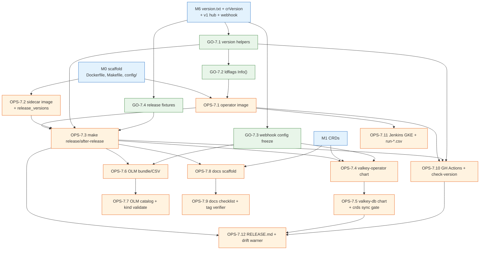
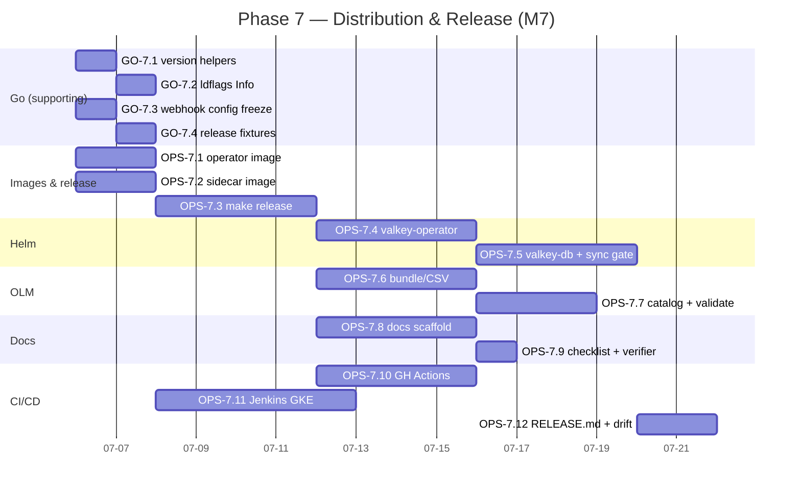

# Phase 7 — Distribution & Release Engineering

> **Milestone M7 — Distribution. DevOps-led.** This phase turns the working operator
> (M0–M6) into a *shippable product*: four multi-arch container images on the
> `percona/`↔`perconalab/` registry split, the two Helm charts (`valkey-operator` +
> `valkey-db`) published to the real `gh-pages` chart repo, an OLM bundle + catalog
> submittable to OperatorHub, a versioned `k8svalkey-docs` MkDocs site, and a release
> pipeline (`make release` / `make after-release` on `release-X.Y.Z` branches) that moves
> the **same version numbers** consistently across three independent git repositories.
>
> **The Go track is supporting only** — it wires `pkg/version/version.txt` into the binary
> (`//go:embed`), keeps the `check-generate` / `check-version` gates green, and ships the
> conversion-webhook *config* plumbing that the OLM CSV and CRD bundle depend on. The
> heavy lifting is OPS.
>
> **Authoritative sources.** Every task traces to a section of the architecture set,
> primarily [`../architecture/10-distribution-release.md`](../architecture/10-distribution-release.md)
> and [`../architecture/02-repo-layout.md`](../architecture/02-repo-layout.md), with
> supporting references to [`../architecture/09-upgrades-versioning.md`](../architecture/09-upgrades-versioning.md),
> [`../architecture/03-api-design.md`](../architecture/03-api-design.md),
> [`../architecture/07-security.md`](../architecture/07-security.md),
> [`../architecture/08-observability.md`](../architecture/08-observability.md), and
> [`../architecture/11-testing-qa.md`](../architecture/11-testing-qa.md). Where the docs are
> silent, the gap is recorded as an **OPEN QUESTION** rather than invented here.

---

## 1. Objective & demoable outcome

**Objective.** Package, publish, and release the operator. After this phase the same
`x.y.z` flows from a single edit point in each of two version axes
([10 §1](../architecture/10-distribution-release.md)) out to twelve locations across three
repos, and a release engineer can cut a GA release by following one checklist.

**Concretely demoable when this phase is done:**

1. **One-command GA pinning.** `make release VERSION=0.1.0` on a `release-0.1.0` branch
   rewrites `pkg/version/version.txt`, `deploy/cr*.yaml` `spec.crVersion` (= `0.1`, the
   `major.minor`), and **every** image field to GA `percona/*` tags pulled from
   `e2e-tests/release_versions`; the tree afterwards passes `check-generate` with a clean
   `git diff` ([10 §8.1](../architecture/10-distribution-release.md), [02 §5](../architecture/02-repo-layout.md)).
2. **One-command dev re-point.** `make after-release` on `main` derives `NEXT_VER` from
   `crVersion` (`major.(minor+1).0`) and repoints `cr*.yaml` back to `perconalab/*:main-*`
   dev tags ([10 §8.2](../architecture/10-distribution-release.md)).
3. **Multi-arch images.** `docker buildx` produces `linux/amd64,linux/arm64` manifest
   lists for `percona/valkey-operator` (GA on tag) and `perconalab/valkey-operator`
   (`main`); the three engine/backup/exporter images are pinned consistently
   ([10 §2](../architecture/10-distribution-release.md)).
4. **Helm install from the published repo.** `helm repo add percona …` then
   `helm install … percona/valkey-operator` and `… percona/valkey-db` stands up a working
   cluster; `helm unittest` passes for both charts; the `crds/` sync gate is green; a
   `version`-only bump publishes via `chart-releaser` ([10 §3](../architecture/10-distribution-release.md)).
5. **OLM bundle + catalog.** `make bundle VERSION=0.1.0 CHANNELS=candidate,fast,stable
   DEFAULT_CHANNEL=stable` → `bundle-build/push` → `catalog-build/push`, and the catalog
   installs cleanly as a `CatalogSource` on an OLM kind cluster; the `./bundle/` is
   submittable to `community-operators` ([10 §4](../architecture/10-distribution-release.md)).
6. **Versioned docs.** `mike deploy 0.1.0` publishes a versioned `k8svalkey-docs` site
   whose `{{release}}` links resolve against the operator git tag `v0.1.0`, and whose
   `*recommended:` pins match `release_versions`
   ([10 §5](../architecture/10-distribution-release.md)).
7. **Correct CI/CD split.** GitHub Actions runs unit + lint + `check-generate` +
   `check-version` + scan + (no-push on PR) buildx; Jenkins runs kuttl e2e on GKE from the
   `run-*.csv` matrices — Actions *never* spins up a Valkey cluster
   ([10 §7](../architecture/10-distribution-release.md)).
8. **Drift guards.** The cross-repo checklist ([10 §6](../architecture/10-distribution-release.md))
   is encoded where cheaply possible: `check-version` asserts `version.txt major.minor ==
   crVersion`; a scheduled job warns on `release_versions` ↔ chart `values.yaml` drift; a
   docs CI job verifies `variables.yml release:` matches an existing `v<release>` tag.

> **Demo script (headline).** On `release-0.1.0`: edit `e2e-tests/release_versions`, run
> `make release VERSION=0.1.0`, `git diff` shows only `version.txt`, `cr*.yaml`
> (`crVersion: 0.1` + `percona/*` tags), and `e2e-tests/vars.sh` (`CERT_MANAGER_VER`).
> Tag `v0.1.0`, push GA images, `make bundle`/`catalog`, install the catalog on a kind+OLM
> cluster, `helm install` both charts from a local `chart-releaser` index, and
> `mike deploy 0.1.0 latest` the docs — all green.

**Non-goal of M7.** The e2e *test content* (kuttl suite bodies, golden files, chaos
matrix) is M8/Phase 8 work; M7 builds only the **infra** that runs them (the `Jenkinsfile`,
the `run-*.csv` matrices, the `make e2e-test` target, GKE provisioning, the `kuttl.yaml`
config) plus the `run-release.csv` release-validation gate.

---

## 2. Milestone & exit criteria

**Milestone:** M7 Distribution — Helm charts, OLM bundle/catalog, docs site, release pipeline.

| # | Exit criterion | Trace |
|---|----------------|-------|
| E1 | `make release VERSION=x.y.z` writes `version.txt`, sets `cr*.yaml` `crVersion` = `major.minor`, rewrites all image fields to GA `percona/*` from `release_versions`, syncs `CERT_MANAGER_VER`; tree passes `check-generate` afterward. | [10 §8.1](../architecture/10-distribution-release.md), [02 §5](../architecture/02-repo-layout.md) |
| E2 | `make after-release` derives `NEXT_VER` from `crVersion`, repoints images to `perconalab/*:main-*`; `make update-version` writes only `version.txt`. | [10 §8.2](../architecture/10-distribution-release.md) |
| E3 | The `Dockerfile` builds a distroless `nonroot` multi-arch (`linux/amd64,linux/arm64`) manifest list for `percona/valkey-operator`; `Dockerfile.sidecar` builds `percona/percona-valkey` with the three sidecars baked in. | [10 §2](../architecture/10-distribution-release.md), [02 §6](../architecture/02-repo-layout.md) |
| E4 | `valkey-operator` + `valkey-db` charts install a working cluster from the published `gh-pages` index; `helm unittest` ≥ 80 % templated-path coverage on both; `appVersion`/`version` semantics correct; `crds/` matches `deploy/crd.yaml`. | [10 §3](../architecture/10-distribution-release.md) |
| E5 | `make bundle`/`bundle-build`/`bundle-push`/`catalog-build`/`catalog-push` produce a valid CSV with `candidate`/`fast`/`stable` channels (`stable` default); the catalog installs as a `CatalogSource` on OLM kind. | [10 §4](../architecture/10-distribution-release.md) |
| E6 | `k8svalkey-docs` scaffolded: `mkdocs.yml` inherits `mkdocs-base.yml`, `mike` multi-version, `macros`/`variables.yml`; `mike deploy <version>` publishes; `{{release}}` resolves to `v<release>`. | [10 §5](../architecture/10-distribution-release.md) |
| E7 | CI split implemented: Actions = `tests.yml`/`lint.yml`/`check-generate.yml`/`check-version.yml`/`scan.yml`/`publish.yml`; Jenkins = GKE provisioning + kuttl from `run-*.csv`; Actions never starts a Valkey cluster. | [10 §7](../architecture/10-distribution-release.md) |
| E8 | The twelve-location cross-repo checklist is documented in-repo and the three cheap drift guards exist (`check-version`, values-drift warner, docs-tag verifier). | [10 §6](../architecture/10-distribution-release.md) |
| E9 | DoD baseline: code compiles; unit/envtest ≥ 80 % on touched `pkg/`; deepcopy/CRD/RBAC/bundle regenerated and clean; gofmt/go vet/golangci-lint/gosec clean; docs updated; CI passes. | charter DoD |

---

## 3. Prerequisites (which earlier phases / task-ids must be complete)

This phase packages what M0–M6 produced. The hard dependencies:

| Needs | From | Why |
|-------|------|-----|
| Scaffolded repo, `Dockerfile`, base `Makefile`, `config/` kustomize bases, `.github/workflows/` skeleton, `cmd/manager`. | **M0 Bootstrap** (Phase 0: OPS-0.* image/Make/CI scaffolding, GO-0.* manager skeleton) | The release Makefile, buildx, and CSV base extend the M0 scaffold. |
| The four CRDs stable enough to freeze into a CSV + `crds/` copy; `controller-gen` markers; `deploy/crd.yaml`. | **M1 API** (Phase 1: GO-1.*) | OLM bundle CRDs and chart `crds/` are copies of `deploy/crd.yaml`. |
| `deploy/cr.yaml` / `cr-minimal.yaml` with all real image fields present (operator/server/backup/exporter/initImage). | **M2–M5** | `make release` rewrites *every* image field; missing fields → stale `perconalab/*` ships GA. |
| `pkg/version/version.txt` + `//go:embed` accessor + `CompareVersion`; `crVersion` stamping/gating. | **M6** (Phase 6: GO-6.1, GO-6.2) | `version.txt` is the operator-axis source of truth `make release`/`check-version` consume. |
| The `v1` hub type + conversion webhook *Go* funcs + `config/webhook` wiring. | **M6** (Phase 6: GO-6.9 `v1` types + conversion, GO-6.10 webhook server + TLS, OPS-6.1 multi-version CRD codegen, OPS-6.2 conversion-webhook manifest wiring) | The CSV, dual-version CRD bundle, and `crds/` copy must carry the `conversion.strategy: Webhook` stanza and `caBundle` injection. |
| The exporter image + PodMonitor base (`config/prometheus/`). | **M5** (Phase 5 observability) | `valkey-db` chart values pin the exporter; the CSV references the monitoring objects. |
| The `make e2e-test` target + `e2e-tests/kuttl.yaml` skeleton (kuttl wiring exists, suites empty). | **M0/M3** | M7 provisions the *infra* (Jenkins/GKE/CSV) around the existing kuttl harness; suite bodies are M8. |

> **Critical-path note.** M7 can start its DevOps tracks (images, Helm scaffolding, docs
> scaffolding, CI split) **in parallel with M6** as soon as the CRDs are field-stable
> (M1), because most of M7 manipulates manifests and pipelines, not controller code. The
> *only* M7 items that hard-block on M6 are the OLM CSV / CRD bundle and `crds/` copy
> (they must carry the conversion-webhook stanza) — these are sequenced after OPS-6.1 (multi-version
> CRD codegen) and OPS-6.2 (conversion-webhook manifest wiring).

---

## 4. Scope — In / Out

**In scope (M7):**

- Four images: `percona/valkey-operator`, `percona/percona-valkey`, `percona/valkey-backup`,
  `percona/valkey-exporter`; `Dockerfile` + `Dockerfile.sidecar`; multi-arch buildx; the
  `percona/`↔`perconalab/` registry split ([10 §2](../architecture/10-distribution-release.md)).
- `make release` / `make after-release` / `make update-version` text-rewrite targets and the
  `VERSION`/`IMAGE_TAG_OWNER` footgun guards ([10 §8](../architecture/10-distribution-release.md), [02 §5](../architecture/02-repo-layout.md)).
- Two Helm charts (`valkey-operator` + `valkey-db`), optional `valkey-operator-crds`;
  `Chart.yaml` `appVersion`/`version`; `values.yaml` image pins; `crds/` sync gate;
  `helm unittest` suites ([10 §3](../architecture/10-distribution-release.md)).
- OLM bundle + catalog via `operator-sdk`/`opm`; `candidate`/`fast`/`stable` channels;
  OperatorHub `community-operators` submission ([10 §4](../architecture/10-distribution-release.md)).
- `k8svalkey-docs` MkDocs Material site: `mkdocs-base.yml` inheritance, `mike`,
  `macros`/`variables.yml`, `versions.md`, release-notes scaffold
  ([10 §5](../architecture/10-distribution-release.md)).
- The cross-repo version-bump checklist + three drift guards
  ([10 §6](../architecture/10-distribution-release.md)).
- CI/CD split: GitHub Actions workflows + the `Jenkinsfile` GKE e2e harness + `run-*.csv`
  matrices + `make e2e-test` ([10 §7](../architecture/10-distribution-release.md)).
- Go *supporting* work: `version.txt` embed wiring already in M6 — here only the
  release-target consumption + the conversion-webhook config the CSV needs.

**Out of scope (deferred):**

- kuttl suite *bodies*, golden files, chaos/failover test content, the full
  cross-engine/platform e2e matrix — **M8/Phase 8** ([11 §3–§4](../architecture/11-testing-qa.md)).
- Building the engine/backup/exporter image *contents* (server build pipeline) — those
  images are produced by Percona's server/backup pipelines; M7 only *pins and references*
  them ([10 §2](../architecture/10-distribution-release.md)).
- Flipping the CRD storage version `v1alpha1 → v1` (one-time migration) — sequenced after
  field stability, not at first GA ([09 §6](../architecture/09-upgrades-versioning.md)).
- New controller behaviour — none; M7 is packaging.
- `everest` integration, `gcp-marketplace`, PMM-HA chart patterns — not part of this
  operator's charter.

---

## 5. Go Developer Track (supporting)

> The Go track is deliberately thin. It supplies exactly what distribution *consumes*:
> the build-time version self-reporting (ldflags), the conversion-webhook config the CSV
> freezes, and the release-fixture regen hook — plus confirmation that the M6 `pkg/version`
> accessors (`Version()`/`MajorMinor()`) suffice for the `check-version` gate (which is
> itself authored in M6 OPS-6.3). No new controller behaviour and no new `pkg/version`
> helper invented here.

| id | title | description | files / packages | key types / funcs | depends-on | DoD (phase-specific) | tests | effort | risk |
|----|-------|-------------|------------------|-------------------|------------|----------------------|-------|--------|------|
| **GO-7.1** | `version.txt` consumption confirmation | **No new helper.** Confirm the `//go:embed version.txt` accessors already built in M6 GO-6.1 (`Version() string`, `MajorMinor() (string, error)`) are sufficient for distribution's needs: `MajorMinor()` is the `crVersion`-derivation primitive `make release`/`after-release` rely on. The `check-version` CI gate reads `version.txt` *directly via shell* (`cut -d. -f1-2`, §8.1), not a Go binary, so **no `cmd/printversion`/`hack/printversion` is added** ([02 §6](../architecture/02-repo-layout.md)). Do **not** introduce a redundant `CRVersion()` — `MajorMinor()` already returns `major.minor`. This task is a verification gate, not net-new code. | `pkg/version/version.go` (read-only confirm), `pkg/version/version_test.go` | (existing) `Version() string`, `MajorMinor() (string, error)` | M6 GO-6.1 | `MajorMinor("0.1.3")=="0.1"`; the embedded `version.txt` is the single operator-version SoT; no second copy of the string in the binary; no new `cmd/` binary. | unit: extend M6 `version_test.go` parse table (`0.1.0`,`1.2.3`,`1.10.2`,malformed) per [11 §2](../architecture/11-testing-qa.md). | XS (0.25d) | LOW |
| **GO-7.2** | Build-time ldflags wiring | Plumb `-ldflags "-X valkey.percona.com/percona-valkey-operator/pkg/version.GitCommit=… -X …/pkg/version.BuildTime=…"` from the `Dockerfile`/`Makefile` into a `version.Get() Info` so images self-report commit + build time; **log the `Info().String()` line at manager startup** (the M6 GO-6.1 startup-log line, enriched). The `-X` paths use the Charter-locked module root `valkey.percona.com/percona-valkey-operator` ([02 §3](../architecture/02-repo-layout.md)). | `pkg/version/build.go`, `cmd/manager/main.go`, `Makefile`, `Dockerfile` | `func Get() Info`; `type Info struct{Version,GitCommit,BuildTime,GoVersion,Platform string}`; `func (Info) String()` | GO-7.1 | manager startup log prints version+commit+arch; ldflags supplied by both buildx and `make build`; `GitCommit`/`BuildTime` empty (un-stamped `go test`/`go run`) degrades gracefully to `"unknown"`. | unit: `Get().String()` format with stamped + empty ldflags; smoke: `docker run … 2>&1 \| head -1` shows the version line. | S (1d) | LOW |
| **GO-7.3** | Conversion-webhook config freeze | Ensure the `v1` hub + `v1alpha1` spoke (M6 GO-6.9 types/conversion, GO-6.10 webhook server) emit a CRD with `spec.conversion.strategy: Webhook` and that `cmd/manager` registers the conversion webhook server behind a flag, so the CSV/bundle (OPS-7.6) and `crds/` copy (OPS-7.4) freeze a *correct* webhook stanza. No new conversion logic. | `cmd/manager/main.go` (webhook setup, gated), `config/webhook/`, `pkg/apis/valkey/v1` markers | `mgr.GetWebhookServer()` wiring; `+kubebuilder:webhook` markers | M6 GO-6.9, GO-6.10, OPS-6.1, OPS-6.2 | Generated CRD carries `conversion.strategy: Webhook` + `clientConfig` placeholder for `caBundle`; manager serves conversion on kind+cert-manager. | envtest: served-conversion round-trip (reuse GO-6.9 round-trip fuzz); `kubectl apply` CRD on kind. | S (1d) | MED — the CSV must carry the same webhook contract; drift here breaks OperatorHub install. |
| **GO-7.4** | Release-target Go fixtures | Any unit-test fixture that asserts GA image tags (e.g. a defaults test snapshotting `cr.yaml` images) must be *regenerated* by `make release`, never hand-edited (trio convention). Provide a `make` hook / golden-regen helper so post-`release` fixtures update deterministically. | `pkg/apis/valkey/v1alpha1/*_defaults_test.go` golden, `hack/regen-fixtures.sh` | golden regen helper | M6, GO-7.1 | After `make release VERSION=x.y.z`, image-asserting fixtures match GA tags; `make test` green; no hand-edit. | unit: defaults test reads regenerated golden. | XS (0.5d) | LOW — but a classic "tests fail post-release" footgun ([10 §8.1 step 4](../architecture/10-distribution-release.md)). |

**Go-track DoD (all GO-7.*):** baseline DoD (compiles, ≥ 80 % on touched `pkg/version`,
generated artefacts clean, gofmt/vet/golangci-lint/gosec clean, CI green) plus: the
embedded `version.txt` is the *only* operator-version string in the binary, and the
conversion-webhook stanza in code matches the one frozen into the CSV/CRD/charts.

---

## 6. DevOps / Platform Track (lead)

> This is the bulk of M7. Tasks are grouped: **A. Images** (OPS-7.1–7.2), **B. Release
> targets** (OPS-7.3), **C. Helm** (OPS-7.4–7.5), **D. OLM** (OPS-7.6–7.7),
> **E. Docs** (OPS-7.8–7.9), **F. CI/CD** (OPS-7.10–7.12). Dependencies are explicit so the
> critical path is unambiguous.

| id | title | description | files / packages | depends-on | DoD (phase-specific) | tests | effort | risk |
|----|-------|-------------|------------------|------------|----------------------|-------|--------|------|
| **OPS-7.1** | Operator image `Dockerfile` (multi-arch, distroless) | Multi-stage `Dockerfile`: Go 1.26 builder → distroless `nonroot` runtime, `TARGETOS`/`TARGETARCH` buildx args, ldflags from GO-7.2, builds `cmd/manager` only → `percona/valkey-operator`. Manifest list `linux/amd64,linux/arm64`. `s390x`/`ppc64le` opt-in flag, **not** default GA matrix. | `Dockerfile`, `.dockerignore`, `Makefile` (`build`/`docker-buildx` targets) | M0 (scaffold), GO-7.2 | `docker buildx build --platform linux/amd64,linux/arm64` produces a manifest list; image runs as `nonroot`; size minimal. | local buildx; `docker run …` startup log shows the GO-7.2 version line; Trivy scan clean. | M (2d) | MED — distroless + multi-arch CGO-off correctness ([10 §2](../architecture/10-distribution-release.md)). |
| **OPS-7.2** | Sidecar/server image `Dockerfile.sidecar` + image pin table | `Dockerfile.sidecar` bakes `cmd/valkey-backup`, `cmd/healthcheck`, `cmd/peer-list` into the Valkey server image → `percona/percona-valkey`. Define `e2e-tests/release_versions` schema: `IMAGE_OPERATOR`, `IMAGE_VALKEY90`, `IMAGE_VALKEY80`, `IMAGE_BACKUP`, `IMAGE_EXPORTER`. Document the "compatible *set*, no negotiation" pinning rule. | `Dockerfile.sidecar`, `build/`, `e2e-tests/release_versions` | M0, M2–M5 (sidecars exist) | Three sidecars present in `percona/percona-valkey`; `release_versions` is the single engine-axis SoT; comment block warns against bumping one image in isolation. | smoke: `docker run … healthcheck`; verify binaries on `$PATH`. | M (2d) | MED — sidecar/server version skew is a stated trap ([10 §2.1](../architecture/10-distribution-release.md)). **OQ-1** (backup image folding), **OQ-2** (exporter ownership). |
| **OPS-7.3** | `make release` / `after-release` / `update-version` targets | Implement the Percona text-rewrite targets: `release` → `echo VERSION > version.txt`, rewrite `cr*.yaml` `crVersion`=`major.minor`(VERSION) + all image fields to GA `percona/*` from `release_versions`, sync `CERT_MANAGER_VER` from `go.mod` → `e2e-tests/vars.sh`, regen image-asserting fixtures (GO-7.4). `after-release` → `NEXT_VER`=`major.(minor+1).0` from `cr.yaml` `crVersion`, repoint images to `perconalab/*:main-*`, `update-version`. **Guard `VERSION` footgun** (fail if `VERSION` looks like a branch name). | `Makefile`, `hack/release.sh`, `hack/after-release.sh` | OPS-7.1, OPS-7.2, GO-7.1, GO-7.4 | `make release VERSION=0.1.0` yields `crVersion: 0.1`, GA tags, synced cert-manager ver; rerun is idempotent; `make release` *without* `VERSION=` aborts with a clear error. | shell test on a fixture tree; `git diff` assertion; `check-generate` after. | L (4d) | HIGH — this is the #1 Percona footgun engine; correctness of `crVersion`=`major.minor` and "rewrite *every* image field" is load-bearing ([10 §8.1, §6.1](../architecture/10-distribution-release.md), [02 §5](../architecture/02-repo-layout.md)). |
| **OPS-7.4** | Helm chart `valkey-operator` (+ optional `valkey-operator-crds`) | In `percona-helm-charts`: chart installing operator Deployment, namespaced + cluster-wide RBAC variants, ServiceAccount, and CRDs under `crds/`. `Chart.yaml` `appVersion`=`version.txt`, `version`=chart semver (publish trigger). Copy `deploy/crd.yaml` → `crds/`. Optional standalone CRD-only chart. Default namespaced; document `cw-` opt-in. | `charts/valkey-operator/{Chart.yaml,values.yaml,templates/,crds/}`, `charts/valkey-operator-crds/` | M1 (CRDs), OPS-7.3, OPS-6.1/6.2 (multi-version + webhook CRD) | `helm template` renders both RBAC scopes; `crds/` == `deploy/crd.yaml`; conversion-webhook stanza present; `helm install` works on kind. | `helm unittest charts/valkey-operator` (RBAC scope, image, watch-namespace toggles); `helm lint`. | L (4d) | MED — RBAC namespaced/cluster-wide toggle + conversion-webhook + CRD sync ([10 §3](../architecture/10-distribution-release.md), [02 §7](../architecture/02-repo-layout.md), [07 §6](../architecture/07-security.md)). **OQ-4** (CRD-only chart timing). |
| **OPS-7.5** | Helm chart `valkey-db` + `crds/` sync CI gate | Chart installing a `PerconaValkeyCluster` CR + referenced Secrets (ACL/TLS), `values.yaml` driving `spec.mode`, shards/replicas, storage, exporter, backup storages. Image pins (server/backup/exporter) = `release_versions` GA. Add a `valkey-operator-crd-sync-check` CI gate (mirrors `psmdb-operator-crd-sync-check`) diffing chart `crds/` vs operator `deploy/crd.yaml`. | `charts/valkey-db/{Chart.yaml,values.yaml,templates/}`, `.github/workflows/crd-sync-check.yaml` (helm repo) | OPS-7.4 | `helm install valkey-db` after `valkey-operator` forms a cluster; values map 1:1 to CR fields; CRD-sync gate fails on a deliberately-drifted `crds/`. | `helm unittest charts/valkey-db` (mode/shards/storage/exporter/backup paths, ≥80% templated paths); sync-gate dry-run. | L (4d) | MED — values↔CR mapping breadth; silent CRD drift is a stated trap ([10 §3.3, §6.1 trap 7](../architecture/10-distribution-release.md)). |
| **OPS-7.6** | OLM bundle (`make bundle` + CSV base) | Wire `config/manifests/` CSV base + `operator-sdk generate bundle`: `make bundle VERSION=x.y.z CHANNELS=candidate,fast,stable DEFAULT_CHANNEL=stable` → `./bundle/` (CSV + CRDs + `metadata/annotations.yaml`). CSV carries the conversion-webhook stanza, image = `percona/valkey-operator:x.y.z`, install modes (namespaced + AllNamespaces), example CRs, icon, links. `operator-sdk bundle validate ./bundle`. | `config/manifests/`, `bundle/`, `bundle.Dockerfile`, `Makefile` (`bundle` target) | OPS-7.3, OPS-6.1 (dual-version CRD), OPS-6.2 (webhook manifest), GO-7.3 | `make bundle VERSION=0.1.0 …` produces a validating bundle; channels baked into CSV; `replaces`/`skips` graph correct for `0.1.0`. | `operator-sdk bundle validate`; scorecard (`config/scorecard/`). | L (4d) | HIGH — CSV is the OperatorHub SoT; channel membership baked at bundle time; webhook stanza must match GO-7.3 ([10 §4.1–§4.3](../architecture/10-distribution-release.md)). **OQ-3** (OLM at `v1alpha1`). |
| **OPS-7.7** | OLM catalog (`opm`) + OLM-kind validation | `make catalog-build/catalog-push`: `opm index add --mode semver --tag $(CATALOG_IMG) --bundles $(BUNDLE_IMGS) [--from-index $(CATALOG_BASE_IMG)]`. Validate by deploying the catalog as a `CatalogSource` on a kind+OLM cluster (use the vendored `operator-lifecycle-manager` `make run-local`) and installing + testing upgrade edges. `IMAGE_TAG_BASE=percona/…` for GA. | `Makefile` (`catalog-build`/`catalog-push`), `hack/olm-validate.sh` | OPS-7.6 | Catalog installs cleanly as a `CatalogSource`; `opm --mode semver` orders the upgrade graph; incremental `--from-index` append works. | OLM-kind smoke: install `0.1.0`, simulate `0.1.0→0.1.1` upgrade edge. | M (3d) | MED — semver ordering breaks the upgrade graph if bundle versions are malformed ([10 §4.2](../architecture/10-distribution-release.md)). |
| **OPS-7.8** | `k8svalkey-docs` site scaffold | Stand up the MkDocs Material site: `mkdocs.yml` `INHERIT: mkdocs-base.yml`; base owns `nav`/`plugins`/`extra` (`extra.version.provider: mike`); `macros` plugin `include_yaml: ["variables.yml"]`; `main.py` function macros (`k8svalkeyjira`); `requirements.txt`; `mike` set up. Seed `variables.yml` (`release:`, `*recommended:`, `date:`), `docs/versions.md` matrix, `docs/ReleaseNotes/` scaffold. | `k8svalkey-docs/{mkdocs.yml,mkdocs-base.yml,variables.yml,main.py,requirements.txt,docs/}` | M1 (API stable for docs), OPS-7.3 | `mkdocs serve` previews; `mike deploy 0.1.0` publishes a versioned site; `{{release}}`/`{{valkey90recommended}}` macros resolve. | `mkdocs build --strict` (no broken refs); `mike list`. | L (4d) | MED — `{{release}}` must equal an existing `v<release>` tag or links 404 ([10 §5, §5.1 trap](../architecture/10-distribution-release.md)). **OQ-5** (`latest` alias only at GA). |
| **OPS-7.9** | Docs per-release checklist + drift verifier | Encode the §5.2 docs checklist (bump `release:`, all `*recommended:`, `date:`, add release-notes file, update `mkdocs-base.yml` nav, add `versions.md` row, `mike deploy`). Add a docs CI job verifying `variables.yml release:` matches an existing operator git tag `v<release>` before `mike` publish. | `k8svalkey-docs/CONTRIBUTING-release.md`, `.github/workflows/verify-release-tag.yaml` | OPS-7.8 | Checklist matches [10 §5.2](../architecture/10-distribution-release.md) verbatim; CI job red on a `release:` with no matching tag. | CI dry-run: `release: 9.9.9` (no tag) → job fails. | S (1d) | LOW. |
| **OPS-7.10** | GitHub Actions workflow split + `publish.yml` | **Split** the M6/M0 monolithic `test.yml` into per-concern, PR-gating workflows and add the publish pipeline: `tests.yml` (`make test` unit+envtest + `go mod tidy` check), `lint.yml` (`golangci-lint run` via `.custom-gcl.yml` + `make fmt vet`), `check-generate.yml` (`make generate manifests` + `git diff --exit-code`), `check-version.yml` (**invokes the existing `make check-version` target authored in M6 OPS-6.3** — reads `pkg/version/version.txt` directly, no Go binary, see §8.1; this task only moves the gate into its own workflow, it does **not** re-author the target/script), `scan.yml` (Trivy/Grype + reviewdog), and the new **`publish.yml`** (multi-arch buildx; push only on `main`/tag; `perconalab/` for `main`, `percona/` for GA tags). **No Valkey cluster ever starts in Actions.** | `.github/workflows/{tests,lint,check-generate,check-version,scan,publish}.yml` (the `Makefile` `check-version` target + `hack/check-version.sh` are owned by M6 OPS-6.3, reused here) | OPS-7.1, OPS-7.3, **M6 OPS-6.3** (`check-version` target), GO-7.1 | All six workflows present and PR-blocking where specified; `check-version.yml` red on a mismatched fixture (reusing OPS-6.3's logic); `publish` pushes only on `main`/tag with correct registry owner. | PR CI run; deliberate-mismatch branch exercising `check-version.yml`. | L (4d) | MED — registry-owner branching + the never-spin-a-cluster invariant; avoid re-authoring the M6 `check-version` gate ([10 §7.1, §6 recs](../architecture/10-distribution-release.md)). |
| **OPS-7.11** | Jenkins GKE e2e harness + `run-*.csv` | `Jenkinsfile`: provision GKE via `gcloud` (`GCP_PROJECT_ID` + `gcloud-key-file`), `delete-cluster-after-hours=6` self-destruct, build/push operator image, run kuttl from a chosen `run-*.csv` in parallel across cluster suffixes, upload artefacts to S3 (`percona-jenkins-artifactory-public`). Seed the four CSVs (`run-pr`, `run-distro`, `run-minikube`, `run-release`) as `test-name,valkey-major-version` rows (bodies are M8). `make e2e-test` runs `kuttl-shfmt` then `kubectl kuttl test --config e2e-tests/kuttl.yaml`. | `Jenkinsfile`, `e2e-tests/{run-pr,run-distro,run-minikube,run-release}.csv`, `e2e-tests/kuttl.yaml`, `Makefile` (`e2e-test`) | OPS-7.1, M0 (kuttl skeleton) | Jenkins provisions+tears down GKE; `make e2e-test` runs the (empty-but-valid) kuttl config; CSV schema parsed by the parallel runner; artefacts land in S3. | dry-run a no-op `run-pr.csv` row on a throwaway GKE/minikube cluster. | L (5d) | MED — GKE credentials + parallel-suffix orchestration; cluster-leak cost if self-destruct misconfigured ([10 §7.2](../architecture/10-distribution-release.md), [11 §3](../architecture/11-testing-qa.md)). |
| **OPS-7.12** | Cross-repo checklist doc + values-drift warner | Commit the twelve-location checklist (§6) as `docs/RELEASE.md`; add a **scheduled** cross-repo warning job comparing operator `e2e-tests/release_versions` against chart `values.yaml` to surface engine-pin drift early (warning, not blocking). Document the merge order (operator→helm→docs) and all eight Percona traps. | `docs/RELEASE.md`, `.github/workflows/values-drift-warn.yaml` | OPS-7.3, OPS-7.5, OPS-7.10 | `RELEASE.md` enumerates all twelve locations + eight traps verbatim; drift job emits a warning on a deliberately-drifted pin. | drift job dry-run on mismatched fixtures. | M (2d) | LOW — high-value/low-cost guardrails ([10 §6, §6.1, §8.3](../architecture/10-distribution-release.md)). **OQ-6** (full cross-repo automation). |

---

## 7. Key technical decisions to honour (with arch citations)

1. **Two orthogonal version axes; never conflate them.** Operator axis = `version.txt`
   (→ `crVersion`, Helm `appVersion`, docs `release:`); engine axis = `release_versions`
   (→ `cr*.yaml` images, chart `values.yaml`, docs `*recommended:`/`versions.md`). They
   move on different cadences ([10 §1](../architecture/10-distribution-release.md)).
2. **`crVersion` is `major.minor` only.** `make release VERSION=1.1.0` → `crVersion: 1.1`;
   patch upgrades (`1.1.0→1.1.1`) must never change `crVersion`. `make update-version`
   writes only `version.txt` and does **not** touch `crVersion`
   ([10 §6.1 trap 2, §8.1 step 2](../architecture/10-distribution-release.md), [09 §8](../architecture/09-upgrades-versioning.md)).
3. **`VERSION` defaults to the branch name; `IMAGE_TAG_OWNER` defaults to `perconalab`.**
   Always pass `VERSION=x.y.z`; GA overrides the owner to `percona/`. OPS-7.3 *guards*
   against a branch-name `VERSION` ([10 §1 trap, §6.1 trap 1, §8.1](../architecture/10-distribution-release.md), [02 §5](../architecture/02-repo-layout.md)).
4. **`make release` rewrites *every* image field.** Operator/server/backup/exporter +
   `initImage`/`initContainer`; a missing field silently ships a `perconalab/*` dev tag in
   a GA release ([10 §8.1 step 2, §6.1 trap 4](../architecture/10-distribution-release.md)).
5. **`make after-release` poisons the tree for GA.** It repoints to `perconalab/*:main-*`
   — never build/ship a GA release from a post-`after-release` tree
   ([10 §6.1 trap 6, §8.2](../architecture/10-distribution-release.md)).
6. **Helm `version` ≠ `appVersion`.** `version` (chart semver) is the *only* publish
   trigger and may legitimately run ahead of `appVersion`; forgetting it → `chart-releaser`
   `skip_existing` silently skips the chart ([10 §3.1, §6.1 trap 3](../architecture/10-distribution-release.md)).
7. **Charts ship their own `crds/`; sync is manual.** Copy `deploy/crd.yaml` →
   `charts/valkey-operator/crds/` after every `make generate`; the CRD-sync CI gate
   catches drift ([10 §3.3, §6.1 trap 7](../architecture/10-distribution-release.md)).
8. **OLM is in scope (PS-style), unlike PXC/PSMDB.** Full bundle + catalog via
   `operator-sdk`/`opm`; channels `candidate`/`fast`/`stable`, default `stable`; channel
   membership baked at `make bundle` time; `./bundle/` CSV is the OperatorHub SoT
   ([10 §4, §10](../architecture/10-distribution-release.md)). `deploy/bundle.yaml` (flat
   install) is **not** an OLM artefact ([10 §4](../architecture/10-distribution-release.md), [02 §7](../architecture/02-repo-layout.md)).
9. **Docs `release:` must equal an existing operator tag `v<release>`.** Tag the operator
   *before* publishing docs, or every `blob/v{{release}}/…` link 404s; `mike` `latest`
   alias only at GA ([10 §5.1 trap, §5.2, §6.1 trap 5](../architecture/10-distribution-release.md)).
10. **CI split is load-bearing.** Actions = unit+lint+`check-generate`+scan+publish on
    PR/`main`, **never** a Valkey cluster; Jenkins = kuttl e2e on GKE from `run-*.csv`
    ([10 §7](../architecture/10-distribution-release.md), [11 §3](../architecture/11-testing-qa.md)).
11. **`check-generate` is the generated-code firewall.** `make generate manifests` must
    leave a clean `git diff`; never hand-edit deepcopy/CRD/RBAC/bundle/CSV
    ([02 §4](../architecture/02-repo-layout.md), [10 §7.1](../architecture/10-distribution-release.md)).
12. **Distroless `nonroot`, multi-arch `amd64`+`arm64` default;** `s390x`/`ppc64le`
    opt-in only, called out in release notes rather than silently built
    ([10 §2, §2.1](../architecture/10-distribution-release.md)).
13. **Merge order across repos: operator → helm-charts → docs.** Operator first (sets the
    tag, pins GA images); chart-releaser auto-publishes; `mike` publish needs the tag
    ([10 §8.3](../architecture/10-distribution-release.md)).

---

## 8. Illustrative skeletons (Makefile / CI / chart / Go)

These are *illustrative* — the source of truth remains the arch docs. They show shape and
the exact knobs, not final implementations.

### 8.1 `make release` / `after-release` (the footgun engine)

```makefile
# --- VERSION footgun guard (arch 10 §1, §6.1 trap 1; arch 02 §5) ---
VERSION         ?= $(shell git rev-parse --abbrev-ref HEAD | tr '/' '-' | tr '[:upper:]' '[:lower:]')
IMAGE_TAG_OWNER ?= perconalab
# crVersion is major.minor ONLY (arch 10 §6.1 trap 2, §8.1 step 2)
CRVERSION       := $(shell echo $(VERSION) | cut -d. -f1-2)

.PHONY: release
release: manifests                       ## GA pinning on release-x.y.z (arch 10 §8.1)
	@echo "$(VERSION)" | grep -Eq '^[0-9]+\.[0-9]+\.[0-9]+$$' \
	  || { echo "ERROR: pass VERSION=x.y.z (got '$(VERSION)' — branch-name footgun)"; exit 1; }
	echo $(VERSION) > pkg/version/version.txt                       # operator axis SoT
	# rewrite crVersion + EVERY image field to GA percona/* from release_versions
	./hack/release.sh \
	  --version $(VERSION) --crversion $(CRVERSION) \
	  --release-versions e2e-tests/release_versions \
	  --cr deploy/cr.yaml --cr deploy/cr-minimal.yaml \
	  --owner percona                                               # NOT perconalab
	# sync cert-manager version into kuttl vars (arch 10 §8.1 step 3)
	./hack/sync-certmanager.sh go.mod e2e-tests/vars.sh
	$(MAKE) regen-fixtures                                          # GO-7.4

# NEXT_VER derived from cr.yaml crVersion (major.minor) as major.(minor+1).0 — NOT from
# version.txt (arch 10 §8.2). Computed as a make var at parse time so the `update-version`
# PREREQUISITE sees it (a recipe-body `$(eval ...)` would run AFTER update-version and write
# an empty version.txt). Override with `make after-release NEXT_VER=x.y.z`.
NEXT_VER ?= $(shell ./hack/next-ver.sh deploy/cr.yaml)

.PHONY: after-release
after-release: update-version manifests   ## next dev cycle on main (arch 10 §8.2)
	./hack/release.sh \
	  --version $(NEXT_VER) --crversion $(shell echo $(NEXT_VER) | cut -d. -f1-2) \
	  --cr deploy/cr.yaml --cr deploy/cr-minimal.yaml \
	  --owner perconalab --dev-tags main                           # perconalab/*:main-*

.PHONY: update-version
update-version:                           ## writes version.txt ONLY (arch 10 §8.2)
	echo $(NEXT_VER) > pkg/version/version.txt

# NOTE: the `check-version` target + hack/check-version.sh are AUTHORED in M6 (OPS-6.3);
# shown here only because OPS-7.10 wraps it in its own `check-version.yml` workflow.
.PHONY: check-version
check-version:                            ## CI gate — OWNED BY M6 OPS-6.3 (arch 10 §6 rec, §7.1)
	@v=$$(cut -d. -f1-2 pkg/version/version.txt); \
	 cr=$$(yq '.spec.crVersion' deploy/cr.yaml); \
	 [ "$$v" = "$$cr" ] || { echo "version.txt major.minor=$$v != crVersion=$$cr"; exit 1; }
```

> The `check-version` gate (Makefile target + `hack/check-version.sh`) is **authored in M6
> OPS-6.3**; Phase 7 only relocates it into its own `check-version.yml` workflow as part of
> the Actions split (OPS-7.10), it does not re-implement it. The gate reads the embedded SoT
> file `pkg/version/version.txt` directly (no extra binary): `version.txt` is the literal
> operator-version string, so `cut -d. -f1-2` yields `major.minor` for comparison against
> `deploy/cr.yaml` `spec.crVersion`. It intentionally does **not** add a `cmd/printversion`
> helper — the only `cmd/*` binaries are `manager` + the three sidecars
> ([02 §6](../architecture/02-repo-layout.md)).

### 8.2 OLM bundle + catalog targets (arch 10 §4.2)

```makefile
IMAGE_TAG_BASE ?= $(IMAGE_TAG_OWNER)/valkey-operator
BUNDLE_IMG     ?= $(IMAGE_TAG_BASE)-bundle:v$(VERSION)
CATALOG_IMG    ?= $(IMAGE_TAG_BASE)-catalog:v$(VERSION)
CHANNELS       ?= candidate,fast,stable
DEFAULT_CHANNEL?= stable
# incremental catalog: CATALOG_BASE_IMG=<prior-catalog> -> --from-index
FROM_INDEX_OPT := $(if $(CATALOG_BASE_IMG),--from-index $(CATALOG_BASE_IMG),)

.PHONY: bundle
bundle: manifests kustomize operator-sdk
	$(OPERATOR_SDK) generate kustomize manifests -q
	cd config/manager && $(KUSTOMIZE) edit set image controller=$(IMAGE)
	$(KUSTOMIZE) build config/manifests | \
	  $(OPERATOR_SDK) generate bundle --version $(VERSION) \
	    --channels $(CHANNELS) --default-channel $(DEFAULT_CHANNEL)
	$(OPERATOR_SDK) bundle validate ./bundle      # arch 10 §4.2

.PHONY: catalog-build
catalog-build: opm
	$(OPM) index add --mode semver --tag $(CATALOG_IMG) \
	  --bundles $(BUNDLE_IMG) $(FROM_INDEX_OPT)    # semver orders the upgrade graph
```

### 8.3 GitHub Actions `publish.yml` registry split (arch 10 §7.1)

```yaml
# .github/workflows/publish.yml (push only on main/tag; PR builds but never pushes)
jobs:
  buildx:
    steps:
      - uses: docker/setup-buildx-action@v3
      - name: Resolve registry owner          # percona/ for GA tags, perconalab/ for main
        run: |
          if [[ "${GITHUB_REF}" == refs/tags/v* ]]; then echo "OWNER=percona" >>"$GITHUB_ENV";
          else echo "OWNER=perconalab" >>"$GITHUB_ENV"; fi
      - id: meta                              # derive tags/labels (semver on tag, branch/sha on main)
        uses: docker/metadata-action@v5
        with:
          images: ${{ env.OWNER }}/valkey-operator
      - uses: docker/build-push-action@v6
        with:
          platforms: linux/amd64,linux/arm64    # default GA matrix (arch 10 §2.1)
          push: ${{ github.event_name != 'pull_request' }}   # never push from PRs
          tags: ${{ steps.meta.outputs.tags }}
          labels: ${{ steps.meta.outputs.labels }}
```

### 8.4 Helm `Chart.yaml` — `appVersion` vs `version` (arch 10 §3.1)

```yaml
# charts/valkey-operator/Chart.yaml
apiVersion: v2
name: valkey-operator
appVersion: "0.1.0"   # tracks pkg/version/version.txt — metadata only
version: 0.1.0        # chart's OWN semver — the ONLY publish trigger; bump on ANY change
```

```yaml
# charts/valkey-operator/templates/tests + tests/operator_test.yaml (helm-unittest)
tests:
  - it: renders cluster-wide RBAC when watchAllNamespaces=true   # arch 02 §7, 07 §6
    set: { watchAllNamespaces: true }
    asserts:
      - isKind: { of: ClusterRole }
      - notContains: { path: rules[*].resources, content: "*" }  # no wildcard (arch 07 §6)
```

### 8.5 `version.Get() Info` ldflags wiring (Go supporting — GO-7.2)

```go
// pkg/version/build.go
package version

// set via -ldflags "-X .../pkg/version.GitCommit=$(GIT_COMMIT) ..."
var (
	GitCommit string
	BuildTime string
)

type Info struct {
	Version, GitCommit, BuildTime, GoVersion, Platform string
}

func Get() Info { /* embed version.txt + runtime.Version()+GOOS/GOARCH */ }

func (i Info) String() string { /* "valkey-operator 0.1.0 (abc123, linux/amd64)" */ }
```

---

## 9. Test plan

M7 is packaging, so most "tests" are *pipeline* and *manifest* assertions, not envtest.

**Unit / Go (supporting):**

- `pkg/version`: `MajorMinor()` parse table (GO-7.1, extending the M6 suite) and
  `Get().String()` format with stamped + empty ldflags (GO-7.2)
  ([11 §2](../architecture/11-testing-qa.md)).
- Conversion-webhook served round-trip reused from M6 GO-6.9 round-trip fuzz (GO-7.3) to prove the
  frozen CSV stanza actually serves.
- Defaults golden regenerated by `make release` (GO-7.4) — `make test` must be green
  *after* a release rewrite, never hand-fixed ([10 §8.1 step 4](../architecture/10-distribution-release.md)).

**Manifest / packaging assertions (OPS):**

| Check | Asserts | Task |
|-------|---------|------|
| `make release VERSION=0.1.0` on a fixture tree | `crVersion: 0.1`, all images `percona/*`, `CERT_MANAGER_VER` synced, idempotent rerun | OPS-7.3 |
| `make release` (no `VERSION=`) | aborts with branch-name-footgun error | OPS-7.3 |
| `make after-release` | images `perconalab/*:main-*`, `NEXT_VER` = `major.(minor+1).0` | OPS-7.3 |
| `helm unittest charts/valkey-operator` / `valkey-db` | RBAC scopes, image pins, mode/shards/storage/exporter/backup paths, ≥80% templated | OPS-7.4, OPS-7.5 |
| CRD-sync gate on drifted `crds/` | fails | OPS-7.5 |
| `operator-sdk bundle validate ./bundle` | valid CSV, channels baked, webhook stanza | OPS-7.6 |
| `mkdocs build --strict` | no broken refs; macros resolve | OPS-7.8 |
| `check-version` on mismatched fixture | fails | OPS-7.10 |
| docs `release:` with no `v<release>` tag | verifier fails | OPS-7.9 |
| values-drift job on drifted pin | warns | OPS-7.12 |

**Integration smoke (OPS, on kind / throwaway GKE):**

- `docker buildx … --platform linux/amd64,linux/arm64` → manifest list; `docker run …`
  emits the GO-7.2 startup version line (OPS-7.1).
- OLM catalog as a `CatalogSource` on kind+OLM (vendored `operator-lifecycle-manager`
  `make run-local`): install `0.1.0`, exercise an upgrade edge (OPS-7.7).
- `helm install valkey-operator` then `valkey-db` from a local `chart-releaser` index →
  cluster forms (OPS-7.4, OPS-7.5).
- `Jenkinsfile` dry-run: provision GKE, run a no-op `run-pr.csv` row, tear down,
  upload artefact to S3 (OPS-7.11).

**kuttl:** *infra only* this phase. `make e2e-test` must execute the (valid, possibly
empty) `kuttl.yaml` and the parallel CSV runner must parse `test-name,valkey-version` rows.
Suite *bodies* are M8 ([11 §3](../architecture/11-testing-qa.md)).

---

## 10. Risks & mitigations

| # | Risk | Likelihood / Impact | Mitigation | Trace |
|---|------|---------------------|------------|-------|
| R1 | **`make release` misses an image field** → a GA release silently ships a `perconalab/*` dev tag. | Med / **Critical** | `hack/release.sh` enumerates *every* image key (operator/server/backup/exporter/initImage); a post-release CI assertion greps `cr*.yaml` for any `perconalab/` on a release branch and fails. | [10 §8.1 step 2, §6.1 trap 4](../architecture/10-distribution-release.md) |
| R2 | **`VERSION` defaults to branch name** → images/`crVersion`/`version.txt` written wrong. | High / High | OPS-7.3 guard aborts unless `VERSION` matches `x.y.z`; documented in `RELEASE.md`; CI release job requires `VERSION` input. | [10 §1 trap, §6.1 trap 1](../architecture/10-distribution-release.md), [02 §5](../architecture/02-repo-layout.md) |
| R3 | **`crVersion` stamped as full semver** (e.g. `0.1.0` not `0.1`) → CR API churn on patch upgrades. | Med / High | `CRVERSION := $(shell echo $(VERSION) \| cut -d. -f1-2)` (see §8.1); the M6 `check-version` gate asserts `major.minor` equality. | [10 §6.1 trap 2, §8.1 step 2](../architecture/10-distribution-release.md), [09 §8](../architecture/09-upgrades-versioning.md) |
| R4 | **Forgotten Helm `version` bump** → `chart-releaser` silently skips the chart (no error). | Med / High | `ct lint` version-increment check (PR-blocking in helm repo); `RELEASE.md` calls out `version` ≠ `appVersion`. | [10 §3.1, §6.1 trap 3](../architecture/10-distribution-release.md) |
| R5 | **Chart `crds/` drifts** from operator `deploy/crd.yaml` → runtime apply failures. | Med / High | `valkey-operator-crd-sync-check` CI gate (OPS-7.5); copy step in `RELEASE.md` checklist. | [10 §3.3, §6.1 trap 7](../architecture/10-distribution-release.md) |
| R6 | **Conversion-webhook stanza diverges** between code (GO-7.3), CRD bundle (OPS-6.2), CSV (OPS-7.6), and chart `crds/`. | Med / High | Single generated CRD is the source for all four copies; `check-generate` + CRD-sync gate + `operator-sdk bundle validate` triangulate. | [10 §4](../architecture/10-distribution-release.md), [09 §6](../architecture/09-upgrades-versioning.md), [03 §10](../architecture/03-api-design.md) |
| R7 | **Docs published before the operator tag** → all `blob/v{{release}}/…` links 404. | Med / Med | `verify-release-tag` docs CI job (OPS-7.9); merge order operator→helm→docs enforced in `RELEASE.md`. | [10 §5.1 trap, §6.1 trap 5, §8.3](../architecture/10-distribution-release.md) |
| R8 | **OLM catalog upgrade graph breaks** from malformed/out-of-order bundle versions. | Low / High | `opm index add --mode semver` + bundle-version validation in `make bundle`; OLM-kind upgrade-edge smoke (OPS-7.7). | [10 §4.2](../architecture/10-distribution-release.md) |
| R9 | **GA release built from a post-`after-release` tree** (`perconalab/*:main-*` images). | Med / Critical | Release cut on `release-x.y.z` branch *before* `after-release`; R1's `perconalab/` grep on release branches; `RELEASE.md` trap 6. | [10 §6.1 trap 6, §8.2](../architecture/10-distribution-release.md) |
| R10 | **Engine/exporter/backup version skew** in a pod (no negotiation). | Med / High | `release_versions` pins a *consistent set*; never bump one image alone; `values-drift` warner. | [10 §2.1 trap](../architecture/10-distribution-release.md) |
| R11 | **GKE cluster leak** if `delete-cluster-after-hours=6` is misconfigured → cloud cost. | Low / Med | Self-destruct label asserted in `Jenkinsfile` dry-run; periodic `deleteOldClusters` sweep. | [10 §7.2](../architecture/10-distribution-release.md) |
| R12 | **Actions accidentally spins a cluster** (drifts toward e2e in PRs). | Low / Med | Hard rule documented; no kuttl/kind step in any Actions workflow; e2e lives only in `Jenkinsfile`. | [10 §7.1](../architecture/10-distribution-release.md), [11 §3](../architecture/11-testing-qa.md) |

---

## 11. Effort summary (rollup person-days)

| Track | Tasks | Person-days |
|-------|-------|-------------|
| **Go (supporting)** | GO-7.1 (0.25), GO-7.2 (1), GO-7.3 (1), GO-7.4 (0.5) | **2.75** |
| **DevOps (lead)** | OPS-7.1 (2), OPS-7.2 (2), OPS-7.3 (4), OPS-7.4 (4), OPS-7.5 (4), OPS-7.6 (4), OPS-7.7 (3), OPS-7.8 (4), OPS-7.9 (1), OPS-7.10 (4), OPS-7.11 (5), OPS-7.12 (2) | **39.0** |
| **Phase total** | 16 tasks | **41.75** |

Estimates assume two engineers (one Go-capable DevOps, one platform/release engineer)
working partly in parallel. The **critical path** is
`OPS-7.1 → OPS-7.3 → OPS-7.6 → OPS-7.7` (images → release rewrite → OLM bundle → catalog),
≈ 13 person-days serial; Helm (OPS-7.4/7.5), docs (OPS-7.8/7.9), and CI (OPS-7.10/7.11/7.12)
parallelise off `OPS-7.3`. Wall-clock ≈ 3 working weeks for two engineers.

---

## 12. Phase task-dependency diagram

### 12.1 Dependency graph



### 12.2 Mini-gantt (two engineers, ~3 weeks)



---

## 13. Open questions (deferred to release engineering / arch follow-up)

These mirror [10 §11](../architecture/10-distribution-release.md); they are *release-policy*
decisions the docs explicitly leave open. M7 proceeds with the recommended defaults and
flags the choice rather than inventing a binding decision.

- **OQ-1 — Backup image folding.** Ship `cmd/valkey-backup` as a standalone
  `percona/valkey-backup` image (independent CVE cadence) or fold it into
  `percona/percona-valkey` (less surface, no skew)? M7 implements a *separate* image
  (recommended default) but keeps `Dockerfile.sidecar` able to bake it in
  ([10 §2, §11](../architecture/10-distribution-release.md)).
- **OQ-2 — Exporter ownership.** Build `percona/valkey-exporter` from day one, or vendor
  `oliver006/redis_exporter` for the first release? M7 pins `IMAGE_EXPORTER` indirectly so
  either choice is a `release_versions` edit ([10 §2, §11](../architecture/10-distribution-release.md)).
- **OQ-3 — OLM channel at `v1alpha1`.** Limit the catalog to `candidate` until the API
  graduates to `v1`, opening `fast`/`stable` only at GA? M7 wires all three channels but the
  *populated* channel set is a `make bundle` arg ([10 §4.1, §11](../architecture/10-distribution-release.md)).
- **OQ-4 — `valkey-operator-crds` chart timing.** Ship the standalone CRD-only chart in the
  first release or defer until GitOps demand appears? OPS-7.4 stubs it; publishing is
  optional ([10 §3, §11](../architecture/10-distribution-release.md)).
- **OQ-5 — `s390x`/`ppc64le` GA matrix.** Include in the default multi-arch matrix or
  build on demand? M7 defaults to `amd64`+`arm64` with an opt-in buildx flag
  ([10 §2.1, §11](../architecture/10-distribution-release.md)).
- **OQ-6 — Cross-repo drift automation.** Invest in a release CLI / scheduled job that
  compares all version locations across the three repos, or accept Percona's historical
  manual-drift risk? M7 ships only the *cheap* guards (`check-version`, values-drift warn,
  docs-tag verify); full automation is deferred ([10 §6 rec, §11](../architecture/10-distribution-release.md)).

---

## 14. References

- [../architecture/10-distribution-release.md](../architecture/10-distribution-release.md) — **primary**: images, registry split, Helm, OLM, docs, CI/CD split, cross-repo checklist, release workflow.
- [../architecture/02-repo-layout.md](../architecture/02-repo-layout.md) — Makefile target vocabulary, `deploy/` namespaced vs cluster-wide, sidecar binaries, generated-vs-handwritten boundary, `Dockerfile`/`Dockerfile.sidecar`.
- [../architecture/09-upgrades-versioning.md](../architecture/09-upgrades-versioning.md) — `crVersion` `major.minor` rule, version axes, conversion webhook context.
- [../architecture/03-api-design.md](../architecture/03-api-design.md) — CRD shapes frozen into the CSV/`crds/`; `v1alpha1 ⇄ v1` conversion.
- [../architecture/07-security.md](../architecture/07-security.md) — RBAC scopes behind the namespaced/cluster-wide chart split; no-hardcoded-secrets rule for `secrets.yaml`/templates.
- [../architecture/08-observability.md](../architecture/08-observability.md) — exporter image + PodMonitor base referenced by the `valkey-db` chart and CSV.
- [../architecture/11-testing-qa.md](../architecture/11-testing-qa.md) — kuttl harness, `run-*.csv` matrices, `check-generate` gate, coverage bar (M7 builds the infra; M8 the suites).
- [../implementation/07-phase6-upgrades-versioning.md](07-phase6-upgrades-versioning.md) — upstream version/conversion-webhook tasks (GO-6.*) this phase depends on.
- [../implementation/09-phase8-testing-qa.md](09-phase8-testing-qa.md) — the e2e test *content* M7 defers.
