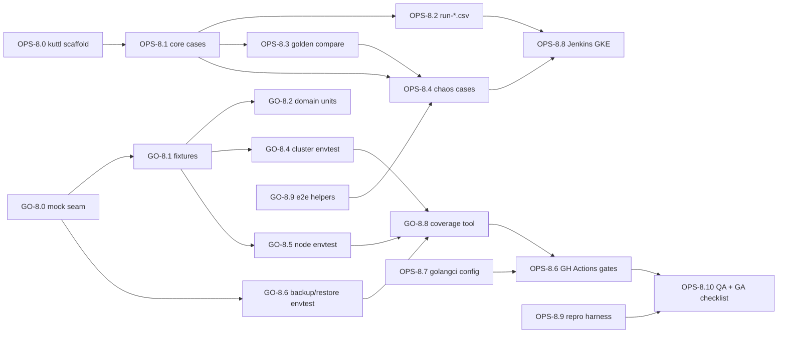
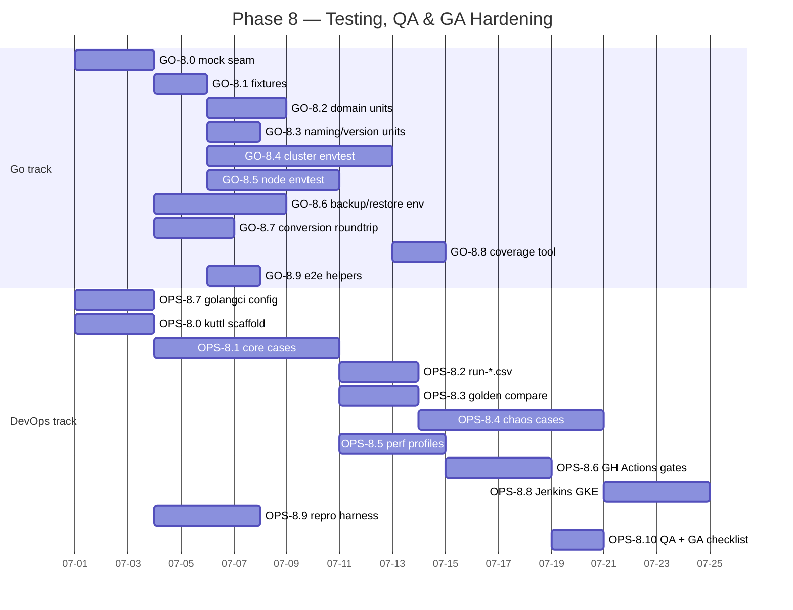

# Phase 8 — Testing, QA & GA Hardening

> **Milestone:** M8 — Hardening / GA
> **Tracks:** Go Developer + DevOps / Platform (co-equal in this phase)
> **Charter source of truth:** the architecture docs under [`../architecture/`](../architecture/). Every task below traces to a named section, primarily [`11-testing-qa.md`](../architecture/11-testing-qa.md). Where the docs are silent, the gap is recorded as an **OPEN QUESTION** rather than invented.

This is the capstone phase. The four CRDs (M1), `ValkeyNode` lifecycle (M2), cluster formation/scale/failover (M3), backup/restore (M4), security + observability (M5), upgrades (M6), and distribution (M7) all exist and individually work. Phase 8 makes the whole thing *provably* GA-ready: it builds out the full four-layer test pyramid to the **80%+ coverage gate**, the `kuttl` e2e TestSuites and the `run-*.csv` engine-version matrix, failover/chaos and performance/scale suites, the PR-blocking CI gates, the Kind-based local reproduction harness (the `repro-K8SVK-<n>` family), and a GA-readiness checklist that signs the release off.

---

## 1. Objective & demoable outcome

**Concretely, when Phase 8 is done:**

1. `make test` runs the **unit + envtest** suite green and emits `cover.out` with **≥ 80% line coverage on `pkg/...`** (excluding `zz_generated.deepcopy.go`, `cmd/`, `test/` helpers) — and CI **fails the build** below that floor (arch §1, §6.1).
2. Every controller (`perconavalkeycluster`, `valkeynode`, `perconavalkeybackup`, `perconavalkeyrestore`) has a Ginkgo/Gomega envtest suite that drives reconcile against a **mocked Valkey client** (`ClientFactory` seam, stateful `fakeValkey` + `mockgen` mock) covering defaulting, validation, child creation order, owner refs, config-hash→roll, status derivation, finalizers, and scale deltas (arch §2.2, §2.3).
3. `make e2e-test TEST=<name> IMAGE=` runs any `kuttl` TestCase against Kind/GKE; the suite directory (`e2e-tests/tests/...`), `kuttl.yaml`, `functions`, golden `compare/*.yml`, and the four `run-*.csv` matrices exist and are lint-clean (arch §3).
4. The **failover/chaos** cases (`failover-kill-primary` in the smoke matrix; `partition`, `slot-migration-interrupt`, quorum-loss negative, config-poison negative gated to release) pass on a real cluster and assert no slot loss / no split-brain (arch §4).
5. A **performance/scale** profile (`perf-smoke` nightly, `perf-scale` at release) runs `valkey-benchmark` + exporter scrape and records diffable trend artifacts (arch §5).
6. **GitHub Actions** PR pipeline gates: `make test` (80%+), `golangci-lint` v2 enable-list, `gofmt`/`goimports`, `go vet`, `gosec` (HIGH-fail), `govulncheck`+Trivy, `check-generate` (CRD/deepcopy/RBAC drift), `go mod tidy` clean (arch §6.1). **Jenkins** runs `kuttl` on GKE from the CSVs (arch §6.2).
7. A self-contained **Kind reproduction harness** template (`repro-K8SVK-<n>/` with `lib.sh` + `00`–`04` numbered scripts + `README.md`/`QA.md`) is in-tree, modelled exactly on `repro-K8SPS-732` (arch §7).
8. The **QA verification runbook** (Level A mandatory / B / C) and the **GA-readiness checklist** are documented and every checkbox is satisfiable from artifacts produced by this phase (arch §8).

**Demo:** open a throwaway PR that intentionally edits a restart-requiring `spec.config` key and watch CI go red on `check-generate` (until regen) then green; run `make e2e-test TEST=failover-kill-primary IMAGE=perconalab/valkey-operator:main` on Kind and watch the cluster lose a primary and converge back to `state: Ready` with all 16384 slots; run `repro-K8SVK-1/02-reproduce.sh` and show the `REPRODUCED:`/`VERDICT` before/after block.

---

## 2. Milestone & exit criteria

| # | Exit criterion | Verified by | Arch ref |
|---|----------------|-------------|----------|
| E1 | Unit+envtest suite green; **≥ 80%** `pkg/` line coverage; CI fails below floor | `make test` + coverage job | §1, §6.1 |
| E2 | All four controller envtest suites cover the §2.2 checklist with a mocked Valkey client | suite review + `go test -ginkgo.v` | §2.2, §2.3 |
| E3 | `kuttl` smoke suite (`run-pr.csv`) green on Kind and GKE | `make e2e-test`, Jenkins | §3, §6.2 |
| E4 | Engine matrix correct: migration/scale tests **9.0-only**; basics on 7.2/8.0 | CSV lint + Jenkins matrix run | §3.2 |
| E5 | Golden `compare/*.yml` committed; intended manifest changes regenerate goldens | `compare_kubectl` step | §3.3 |
| E6 | Failover/chaos cases pass; negatives land in `Degraded`/`Failed`, never silent `Ready` | release `kuttl` run | §4 |
| E7 | Perf `perf-smoke` produces trend artifacts; no p99 regression > threshold | nightly job | §5 |
| E8 | All PR-blocking CI gates wired and red on violation (lint/vet/gosec/check-generate/coverage) | GitHub Actions config | §6.1 |
| E9 | `repro-K8SVK-<n>` template runs end-to-end on a laptop Kind; `02-reproduce.sh` emits `VERDICT` | manual run | §7, §8 (Level B) |
| E10 | GA-readiness checklist complete; every item has evidence | sign-off review | §8 |

---

## 3. Prerequisites (which earlier phases/task-ids must be complete)

Phase 8 sits at the top of the build-order and depends on everything below it. The dependency is *strict bottom-up* per the charter.

| Needs | From milestone | Why Phase 8 needs it |
|-------|----------------|----------------------|
| Repo scaffold, Makefile trio (`test`/`generate`/`manifests`/`e2e-test`/`lint`), `bin/` toolchain auto-download, `.golangci.yml`, baseline GitHub Actions | M0 (Phase 0) | Test targets, lint config, `check-generate`, CI skeleton are extended here, not invented |
| Four CRDs + `CheckNSetDefaults` + CEL + `pkg/version` `CompareVersion`/`crVersion` stamping | M1 (Phase 1) | Defaulting/validation/version-gating unit + envtest assertions |
| `ValkeyNode` controller (workload/PVC/ConfigMap/live-config/config-hash roll) | M2 (Phase 2) | `valkeynode` envtest suite, config-roll golden, live-config negative |
| `perconavalkeycluster` controller (pipeline, `ClusterState`, `proactiveFailover`, `promoteOrphanedReplicas`, `PlanRebalanceMove`/`PlanDrainMove`, `serverConfigRollHash`, conditions/status) | M3 (Phase 3) | Cluster envtest suite, failover/chaos kuttl, perf rebalance/scale |
| Backup/Restore controllers + `cmd/valkey-backup` + storage backends | M4 (Phase 4) | backup/restore envtest, `demand-backup-s3`/`restore` kuttl |
| ACL/users, TLS, RBAC, exporter sidecar + PodMonitor | M5 (Phase 5) | `tls`/`acl-users` kuttl, exporter scrape in perf/chaos |
| `upgradeOptions`/version-service/smart-update/conversion webhook | M6 (Phase 6) | version-gating unit tests, upgrade kuttl (if added) |
| Helm charts, OLM bundle/catalog, docs site, release pipeline, `deploy/bundle.yaml` | M7 (Phase 7) | repro harness applies `deploy/bundle.yaml`; release CSV ties to GA images |

**The `ClientFactory` seam (M2/M3) is the single most important prerequisite** — without the injectable per-node `ValkeyClient` interface, none of the envtest controller suites can run hermetically (arch §2.3). If M2/M3 did not land it, the first task of this phase (GO-8.0) is to retrofit it.

---

## 4. Scope — In / Out

### In scope
- envtest unit/integration suites for all four controllers + pure-unit suites for `pkg/valkey`, `pkg/naming`, `pkg/version`, `pkg/backup`, `pkg/tls` (arch §2).
- The mocked Valkey client: `ClientFactory` injection, hand-written stateful `fakeValkey`, `mockgen`-generated strict mock, and the canned `CLUSTER NODES`/`INFO` fixtures (arch §2.3).
- `kuttl` TestSuite layout, `kuttl.yaml`, `functions`, `conf/` CR templates, the four `run-*.csv` matrices, and golden `compare/*.yml` files (arch §3).
- Failover/chaos kuttl cases + the fault-injection mechanics (arch §4).
- Performance/scale profiles + trend artifacts (arch §5).
- PR-blocking CI gates (lint/fmt/vet/gosec/govulncheck/Trivy/check-generate/coverage) and the Jenkins GKE e2e wiring (arch §6).
- `repro-K8SVK-<n>` Kind harness template + `QA.md` runbook (arch §7, §8).
- Coverage-gate enforcement, CSV-lint, `kuttl-shfmt`, GA-readiness checklist.

### Out of scope (explicitly)
- New product features or API fields (frozen at M1–M6; this phase only *tests* them).
- PITR backup paths — **RDB-only in v1alpha1** (arch §2.2 note, backup doc); PITR deferred.
- The release *act* itself (tag/publish GA images, mike deploy) — owned by Phase 7's pipeline; Phase 8 only *validates* releasability via `run-release.csv`.
- v1→v1alpha1 storage-version *migration job* execution — conversion round-trip is *tested* in envtest here, but the flip is a Phase 6/Phase 7 concern.
- Bash-style PXC/PSMDB e2e harness — we deliberately use **kuttl** (arch §3 opening).

---

## 5. Go Developer Track

> The Go track owns the test *code*: pure-unit tables, the Valkey-client mock infrastructure, the four envtest controller suites, and the Go-side helpers the kuttl/perf/repro scripts call into. Several tasks are pure test authorship and should follow the project's TDD discipline in reverse — the production code already exists, so these encode the contract and lift coverage to the gate.

| id | title | description | files / packages | key types / funcs | depends-on | DoD | tests | effort | risk |
|----|-------|-------------|------------------|-------------------|------------|-----|-------|--------|------|
| **GO-8.0** | Valkey-client test seam & mock infra | Confirm/retrofit `ClientFactory` injection; build the hand-written stateful `fakeValkey` (records issued commands, returns canned payloads parsed by the *real* parser) and a `mockgen` strict mock for single-method error paths (arch §2.3). | `pkg/valkey/fake/`, `pkg/valkey/mock/`, `pkg/valkey/client.go`, `hack/tools` (mockgen) | `ValkeyClient` iface (`ClusterInfo/Nodes/Meet/AddSlotsRange/Replicate/Failover{graceful,FORCE,TAKEOVER}/MigrateSlots/Forget/GetSlotMigrations/Info/ConfigSet/AclSetUser`), `valkeyConfigClient`, `ClientFactory func(addr,port,tls) ValkeyClient`, `fakeValkey` (command log + scriptable state) | M2/M3 `ClientFactory` | Fake + mock compile; fake records command ordering and is re-injectable; `mockgen` target in Makefile; `go generate ./...` regenerates mock clean | self-test of fake (parser round-trips a real `CLUSTER NODES` blob) | M (3d) | Med — if the seam wasn't built in M2/M3, this becomes an L retrofit touching production wiring |
| **GO-8.1** | Engine-output fixtures | Author real-shaped `CLUSTER NODES`/`CLUSTER INFO`/`INFO replication` fixtures: healthy 3-shard (**canonical operator split `0-5461`/`5462-10922`/`10923-16383` = `5462,5461,5461`, remainder to lowest-addressed shards per data-plane §80/§86** — *not* the equal-split `0-5460/5461-10922/10923-16383` printed in testing-qa §110, which contradicts the planner rule; see OPEN QUESTION #9), one synced replica each, degraded (primary `fail`, orphan replica), isolated node (`cluster_known_nodes<=1`), pending primary (zero slots), mid-rebalance (`GETSLOTMIGRATIONS` non-empty). Keep `master`/`slave` engine tokens **verbatim** (arch §2.3 note). | `pkg/valkey/testdata/*.txt` | fixture loader helper | GO-8.0 | All five fixtures committed; parser produces expected `ClusterState`/`NodeState`; `slave_repl_offset`/`master_link_status` fields parsed; healthy-cluster slot boundaries match the data-plane `PlanRebalanceMove` target so a bootstrap-then-assert test does not mismatch by one slot | parser unit tests assert field-by-field | S (2d) | Low — but fixtures must match engine wire format exactly, and the slot split must match the planner (§80/§86), or false confidence / off-by-one |
| **GO-8.2** | Pure-unit suites (domain) | Table-driven tests for config render + `serverConfigRollHash` (live-settable keys excluded; sorted/order-insensitive), slot-range math (`16384/N`, remainder to lowest shards → `5462,5461,5461`), `PlanRebalanceMove` determinism, `PlanDrainMove` (400-batch), ACL string render (token order + sorted users → stable hash), CRC16 keyslot sanity. | `pkg/valkey/*_test.go` | tests for `serverConfigRollHash`, `PlanRebalanceMove`, `PlanDrainMove`, `buildUserAcl` | GO-8.1 | Each function table-tested incl. edge cases; hash stability proven (live-key change ≠ hash change is the headline assertion) | `go test ./pkg/valkey/...` | M (3d) | Low |
| **GO-8.3** | `pkg/naming` + `pkg/version` units | DNS-63 compliance + prefix correctness for every name/label builder; `CompareVersion`, `crVersion` auto-stamp on empty, monotonic-no-downgrade rejection, `upgradeOptions.apply` gating (`Disabled/Recommended/Latest/<literal>`). | `pkg/naming/naming_test.go`, `pkg/version/version_test.go` | `CompareVersion`, stamping helpers | M1 | All builders ≤ 63 chars & label-valid; downgrade rejected with `CrVersionDowngradeRejected`; gating branches covered | `go test ./pkg/naming/... ./pkg/version/...` | S (2d) | Low |
| **GO-8.4** | `perconavalkeycluster` envtest suite | Ginkgo/Gomega suite covering the §2.2 checklist items 1–9: defaulting+idempotence, validation gating, child creation **in order** (Service→PDB→system-passwords Secret→ACL Secret→ConfigMap+configHash→`ValkeyNode`s one-at-a-time replicas-before-primary), owner refs, **config-hash→roll** (restart key changes hash; live key doesn't), condition-type derivation (the five *condition types* `Ready`/`Progressing`/`Degraded`/`ClusterFormed`/`SlotsAssigned` with correct `Reason`/`ObservedGeneration`) and the derived `status.state` priority `deletionTimestamp→Degraded→Ready→Progressing→(else)Failed` (which surfaces the states `ready`/`degraded`/`reconciling`/`failed` — note `Reconciling`/`Failed` are *states*, not condition types — arch control-plane §status), ordered finalizers, scale-out/in plan+events. Use the stateful `fakeValkey`; set child `ValkeyNode.status.ready` explicitly to dodge the status-lag race. | `pkg/controller/perconavalkeycluster/*_test.go`, `suite_test.go` | `Describe/Context/It`, `Eventually(...)`, injected `ClientFactory` | GO-8.0, GO-8.1 | All 9 checklist groups asserted; no `time.Sleep`; `ginkgolinter` clean; suite green under envtest | `make test` (this pkg) | XL (7d) | Med — status-lag race + reconcile ordering invariants are the hard part |
| **GO-8.5** | `valkeynode` envtest suite | §2.2 `vkn` checklist 1–6: WorkloadType immutability (STS default vs Deployment), workload+PVC (`valkey-<node>-data`)+ConfigMap+ACL mount (`/config/users/users.acl`)+TLS mount (`/etc/valkey/tls/`), PVC reclaim finalizer + expand-only/storageClass-immutable, config-hash pod-template annotation roll, `LiveConfigApplied` only when pod Ready + `CONFIG SET` allowlist applied via mock (error keeps it False, no crash-loop), status `ready`/`role`/`podIP` from live `INFO` not labels. | `pkg/controller/valkeynode/*_test.go`, `suite_test.go` | injected `valkeyConfigClient` mock | GO-8.0, GO-8.1 | All 6 groups asserted; live-config error path proven non-crashing; role read from mocked `INFO` | `make test` (this pkg) | L (5d) | Med |
| **GO-8.6** | backup/restore envtest suites | §2.2 backup/restore: storage resolution against `cluster.spec.backup.storages[name]` (typo→explicit error, no silent skip), backup `Job` shape (RDB `BGSAVE` per shard) + terminal `status.state` ∈ {Succeeded,Failed,Error,**Degraded**} (`Degraded` = `consistency: best-effort` partial-coverage terminal-success-with-warning; `strict` default fails the *whole* backup → `Failed` if union ≠ 16384 slots — arch backup-restore §3.2/§9) + `destination`(`s3://`/`gs://`/`azure://`/`pvc/` prefix)/`slotCoverage`/`completed`, finalizer artifact GC + retention, restore `backupName` xor `backupSource`, slot-coverage-aware new-cluster bootstrap + terminal transitions. Mock object-store (`ArtifactStore`) and Valkey client. | `pkg/controller/perconavalkeybackup/*_test.go`, `pkg/controller/perconavalkeyrestore/*_test.go` | `ArtifactStore` fake, terminal-state matchers | GO-8.0, M4 | Storage no-fallback proven; all four terminal states (incl. `strict→Failed` and `best-effort→Degraded/partial`) + GC asserted; xor validation tested | `make test` (these pkgs) | L (5d) | Med — Lease serialization + manifest-presence invariant are subtle |
| **GO-8.7** | Conversion round-trip envtest | Validate `v1alpha1↔v1` hub/spoke `ConvertTo`/`ConvertFrom` lossless round-trip (v1alpha1-only fields preserved via `valkey.percona.com/conversion-data` annotation), dual-serving read behaviour, webhook startup/recovery gate (Degraded/`WebhookCertNotReady`) — *tested in envtest*, not executed migration. | `pkg/apis/valkey/v1alpha1/conversion_test.go` | `conversion.Convertible` impls | M6 | Round-trip lossless on golden objects; annotation preserved; gate condition asserted | `make test` | M (3d) | Med — only if M6 conversion exists; else **OPEN QUESTION** below |
| **GO-8.8** | Coverage-gate tooling (Go side) | Script that merges `cover.out`, strips generated/`cmd/`/`test/`, computes `pkg/` line %, fails < 80%; wire as a Make target consumed by CI. | `hack/coverage.sh`, `Makefile` (`cover` target) | `go tool cover`, `gocovmerge`/`grep -v` exclusion list | GO-8.4–8.6 | Target prints % and exits non-zero < 80%; exclusions match arch §1 | dry-run on current tree | S (1.5d) | Low |
| **GO-8.9** | Go-side e2e/repro helpers | Small Go helpers the kuttl `script:` and repro `02-reproduce.sh` shell out to where bash is too brittle (e.g. parse `CLUSTER NODES` to resolve the *current* primary by IP→pod, assert `cluster_slots_assigned:16384`). Keep thin — prefer `valkey-cli` in shell where possible. | `e2e-tests/cmd/` or `hack/e2e/` | `resolveCurrentPrimary`, `assertSlotsAssigned` | GO-8.1 | Helpers compile, used by ≥1 chaos case + repro `04` | unit test on fixture | S (2d) | Low |

**GO track rollup:** ~33.5 person-days (see §11).

---

## 6. DevOps / Platform Track

> The DevOps track owns the *infrastructure of testing*: the `kuttl` harness and CSV matrices, golden-file machinery, the CI gates in GitHub Actions and Jenkins, the perf profiles, the Kind repro harness template, and the GA-readiness checklist. This track is **co-dominant** in this phase — roughly half the work.

| id | title | description | files / paths | key targets / artifacts | depends-on | DoD | tests | effort | risk |
|----|-------|-------------|---------------|-------------------------|------------|-----|-------|--------|------|
| **OPS-8.0** | `kuttl` suite scaffold | Create `e2e-tests/kuttl.yaml` (`testDirs: [e2e-tests/tests]`, integer `timeout: 180`), `functions` (shared bash: `deploy_operator`, `deploy_cert_manager`, `apply_cluster`, `compare_kubectl`, `wait_*`), `conf/cr-cluster.yaml` + `conf/cr-replication.yaml`. Wire `make e2e-test TEST=<name> IMAGE=` → `kubectl kuttl test --config ... --test <name>`, PS-style with `kuttl-shfmt` pre-check. | `e2e-tests/kuttl.yaml`, `e2e-tests/functions`, `e2e-tests/conf/*.yaml`, `Makefile` | `e2e-test` target, `functions` vocabulary | M7 (`deploy/bundle.yaml`) | `make e2e-test TEST=init-cluster` runs on Kind; `kuttl-shfmt` clean | smoke run on Kind | M (3d) | Low |
| **OPS-8.1** | Core e2e TestCases | `init-cluster` (deploy cert-manager→operator→cluster→write/read data→graceful remove), `scaling`, `config-rolling-update`, `tls`, `acl-users`, `demand-backup-s3`, `restore` as numbered `NN-<step>.yaml`+`NN-assert.yaml` pairs; asserts wait on `status.state: Ready` + `ClusterFormed`/`SlotsAssigned`/`Ready` conditions. | `e2e-tests/tests/<case>/*.yaml` | TestStep/TestAssert pairs | OPS-8.0, GO-8.9 | Each case green on Kind against `perconalab/valkey-operator:main` | `make e2e-test TEST=<each>` | XL (7d) | Med — real cluster formation timing |
| **OPS-8.2** | `run-*.csv` matrices | Author `run-pr.csv` (smoke, all 9.0), `run-distro.csv` (full; **migration/scale 9.0-only**, basics on 7.2/8.0), `run-minikube.csv` (local subset), `run-release.csv` (release + §4 chaos). Encode the engine-gating policy comments verbatim from arch §3.2. Add a **CSV-lint** (every row's test dir exists; version ∈ allowed set; no migration/scale row < 9.0). | `e2e-tests/run-*.csv`, `hack/lint-csv.sh` | CSV matrices, lint script | OPS-8.1 | CSV-lint green; typo'd row fails lint (not silent skip); Jenkins reads matrices | `hack/lint-csv.sh` | M (2.5d) | Med — silent-skip footgun is the whole reason for the lint |
| **OPS-8.3** | Golden-file (`compare`) machinery | Implement `compare_kubectl` in `functions`: capture live YAML, normalize volatile fields (`timestamp`, `resourceVersion`, `uid`, image digests, generated suffixes), diff vs `tests/<case>/compare/*.yml` with platform/engine variants (`-oc`/`-90`/`-80`/`-eks`). Commit goldens for STS, ConfigMap (`valkey.conf`), ACL Secret of the headline cases. Document the **regenerate-don't-paper-over** discipline. | `e2e-tests/functions`, `e2e-tests/tests/<case>/compare/*.yml` | `compare_kubectl`, golden files | OPS-8.1 | `config-rolling-update/04-compare.yaml` diffs STS+ConfigMap vs goldens; volatile fields normalized | run case twice → no spurious diff | M (3d) | Med — normalization completeness |
| **OPS-8.4** | Failover/chaos cases | `failover-kill-primary` (smoke; quorum-holds-persistence-ON → operator *observes*, no TAKEOVER), `failover-takeover` (cache/no-persistence quorum-lost → `promoteOrphanedReplicas`→`TAKEOVER`→`ReplicasTakenOver`; **plan-introduced split of the arch §4.1 quorum-lost kill-primary scenario — see OPEN QUESTION #7; ship as a 2nd dir or a parametrized variant of `failover-kill-primary`**), `partition` (NetworkPolicy isolate primary; no split-brain), `slot-migration-interrupt` (kill dest mid-`MIGRATESLOTS`; **9.0-only**), `quorum-loss` negative (kill primary+all replicas → `Degraded`/`Failed`, never `Ready`), `config-poison` negative (`maxmemory: notanumber` → `LiveConfigApplied=False`, no roll). Fault injection via `kubectl delete pod` / deny-all `NetworkPolicy` / deterministic mid-migration kill driven by `GETSLOTMIGRATIONS`. Assert `cluster_state:ok` + `cluster_slots_assigned:16384` + data compare. | `e2e-tests/tests/failover-*/`, `partition/`, `slot-migration-interrupt/`, `quorum-loss/`, `config-poison/` | chaos steps + recovery asserts | OPS-8.1, OPS-8.3, GO-8.9 | Each arch §4.1 scenario's recovery assertion holds; negatives never report `Ready` | release `kuttl` run | XL (7d) | High — chaos timing & determinism; split-brain assertions |
| **OPS-8.5** | Performance/scale profiles | `perf-smoke` (1×3-shard, 60s `valkey-benchmark`, CI-nightly) + `perf-scale` (6→12 shards, large keyspace, release-only): record p50/p99 GET/SET, ops/sec, rebalance slots/sec + reconcile count, scale-out latency to `cluster_state:ok` (~`16384/N` ±1), rolling-window write-availability. Scrape exporter (`PodMonitor`) + operator metrics; persist CSV/JSON to object store for diffable trends; p99 regression gate (> N%). | `e2e-tests/perf/`, `hack/perf/*.sh` | benchmark driver, trend artifacts | M3, M5 | `perf-smoke` produces a trend file; regression gate fires on synthetic regression | nightly dry-run | L (4d) | Med — runner noise; **N% threshold is an OPEN QUESTION** |
| **OPS-8.6** | GitHub Actions PR gates | Extend M0 workflows: `test.yml` (`go mod tidy && make test`, fail < 80% via OPS/GO-8.8), `lint.yml` (`make lint-config && make lint` golangci-lint v2 enable-list, `gofmt -s -l`/`goimports`, `go vet`), `check-generate.yml` (`make manifests && make generate && git diff --exit-code`), `gosec` (HIGH-fail), `scan.yml` (`govulncheck` + Trivy on built image), `reviewdog` inline annotations, `go mod tidy` clean gate. | `.github/workflows/{test,lint,check-generate,scan}.yml`, `.golangci.yml` | PR-blocking jobs | M0, OPS-8.7, GO-8.8 | Each gate red on a seeded violation, green on clean tree; enable-list matches arch §6.1 | seed-violation PRs | L (4d) | Med |
| **OPS-8.7** | `.golangci.yml` enable-list + lint config | Finalize the Go 1.26 enable-list: `errcheck,govet,staticcheck,revive,gocyclo,dupl,goconst,ineffassign,unused,unparam,unconvert,prealloc,nakedret,lll,misspell,copyloopvar,modernize,ginkgolinter,logcheck,depguard` (depguard forbids `sort`→`slices`); relax `lll`/`dupl` under `api/*`,`internal/*`; relax `goconst` in `_test.go`. | `.golangci.yml`, `.custom-gcl.yml` | linter config | M0 | `make lint` runs full list clean on the tree; custom plugin builds | `make lint` | M (2.5d) | Low |
| **OPS-8.8** | Jenkins GKE e2e wiring | `Jenkinsfile`: `gcloud` GKE provision (`GCP_PROJECT_ID`+`gcloud-key-file`), build+push `perconalab/valkey-operator:<branch>`, run CSV-selected `kuttl` in parallel across cluster suffixes (`run-pr.csv` smoke / `run-distro.csv` full / `run-release.csv` release+chaos), upload artifacts to S3, `delete-cluster-after-hours` self-destruct label. | `Jenkinsfile`, `e2e-tests/*` | parallel matrix, S3 upload | OPS-8.2, OPS-8.4 | `run-pr.csv` green on GKE; artifacts in S3; clusters self-destruct | Jenkins job run | L (4d) | Med — GKE creds + parallelism flakiness |
| **OPS-8.9** | Kind repro harness template | `repro-K8SVK-<n>/` modelled on `repro-K8SPS-732`: `lib.sh` (Valkey names/labels, `k`/`kk`, `valkey_ready_count`, `wait_valkey_ready`, `cluster_state`, non-ccTLD `NS`), `00-install-tools.sh` (kind/kubectl/yq → `~/.local/bin`, idempotent), `01-setup.sh` (kind+cert-manager+operator bundle+CR, wait Ready), `02-reproduce.sh` (scale operator to 0, isolate the one variable, force BEFORE condition, restore; end with `REPRODUCED:`/`VERDICT`), `03-teardown.sh` (`--tools`/`--images`), `04-deploy-patched-operator.sh` (build fix image, `kind load`, redeploy), `README.md`+`QA.md`. Carry the namespace-ccTLD gotcha + 4CPU/6GB resource note. | `repro-K8SVK-1/...` (template) | harness scripts | M7, GO-8.9 | Template runs end-to-end on laptop Kind; `02` emits `VERDICT`; idempotent re-run | manual Kind run | L (4d) | Med — Kind resource sizing |
| **OPS-8.10** | QA runbook + GA-readiness checklist | Write `QA.md` (Level A mandatory / B Kind / C full-e2e per arch §8) and the GA-readiness checklist (§ below); ensure every checkbox maps to a CI artifact or harness output. Wire the "regression test must FAIL on `main`, PASS on fix" discipline into the PR template. | `e2e-tests/QA.md`, `docs/`, `.github/PULL_REQUEST_TEMPLATE.md` | runbook, checklist | OPS-8.6, OPS-8.9 | Checklist reviewed; each item has a named evidence source | doc review | S (2d) | Low |

**OPS track rollup:** ~43 person-days (see §11).

---

## 7. Key technical decisions to honour

1. **Four-layer pyramid, 80% gate on `pkg/` only.** Coverage excludes `zz_generated.deepcopy.go`, `cmd/`, `test/` helpers; kuttl e2e is **not** counted toward line coverage — its KPI is the `run-*.csv` scenario matrix (arch §1).
2. **envtest has no kubelet → mock everything that talks to a live Valkey.** Inject via `ClientFactory`; use the stateful `fakeValkey` for pipeline tests and the `mockgen` mock for single-method error paths (arch §2.3).
3. **Engine tokens are verbatim.** `master`/`slave`/`role:master`/`master_link_status:up`/`slave_repl_offset` are upstream wire strings — keep them exact in fixtures and assertions even though the operator's own API uses primary/replica (arch §2.3 note, §4 note).
4. **Config-hash discipline is the single highest-value unit assertion.** A restart-requiring key changes `serverConfigRollHash`→roll; a live-settable key (`maxmemory`/`maxmemory-policy`/`maxclients`) does **not** (arch §2.2 item 5, §6.1 control-plane §4).
5. **Ordering invariants are asserted via the command log:** `CLUSTER MEET → ADDSLOTSRANGE → REPLICATE → MIGRATESLOTS`, one rebalance/drain move per reconcile, replicas-before-primary (arch §2.3, §3.3, control-plane §2.1).
6. **Failover semantics differ by quorum × persistence.** Quorum-holds-persistence-ON → operator *observes only* (native election). Quorum-lost-AND-persistence-OFF → `promoteOrphanedReplicas`→`CLUSTER FAILOVER TAKEOVER` *before* `FORGET`, emit `ReplicasTakenOver` (not `FailoverInitiated`). Graceful roll → `proactiveFailover` (1s poll up to 10s) emits `FailoverInitiated`/`FailoverCompleted`/`FailoverTimeout` (arch §4.1).
7. **Engine-version gating is mandatory in the CSV matrix.** Migration/scale tests **9.0-only** (`CLUSTER MIGRATESLOTS`/`GETSLOTMIGRATIONS` are 9.0+); 7.2/8.0 only for cluster-mode/replication/TLS/ACL basics (`ADDSLOTSRANGE` floor) (arch §3.2).
8. **Golden files: regenerate, never paper over.** Normalize volatile fields; an intended manifest change regenerates the golden, an unintended diff is a bug (arch §3.3).
9. **`check-generate` is non-negotiable and PR-blocking.** Editing `*_types.go` requires `make generate` + `make manifests`; CI fails on any drift (arch §6.1).
10. **Repro harness mirrors `repro-K8SPS-732` exactly:** scale operator to 0 to isolate the variable; emit a machine-greppable `VERDICT`; the namespace must not end in a real ccTLD (CoreDNS upstream-forward gotcha) (arch §7).
11. **QA Level A is mandatory before sign-off; every fixed bug ships a regression test at the lowest layer that encodes it** — must FAIL on `main`, PASS on fix (arch §8).

---

## 8. Illustrative code skeletons / function signatures

### 8.1 The mock seam (Go) — `pkg/valkey` (GO-8.0)

```go
// ValkeyClient is the per-node surface the controllers use (ForceSingleClient=true
// in production to avoid MOVED/ASK redirect loops). Tests inject a fake; prod wires valkey-go.
type ValkeyClient interface {
    ClusterInfo(ctx context.Context) (ClusterInfo, error)
    ClusterNodes(ctx context.Context) ([]NodeState, error)
    ClusterMeet(ctx context.Context, ip string, port, busPort int) error
    ClusterAddSlotsRange(ctx context.Context, ranges ...SlotRange) error
    ClusterReplicate(ctx context.Context, primaryNodeID string) error
    ClusterFailover(ctx context.Context, mode FailoverMode) error // Graceful | Force | Takeover
    ClusterMigrateSlots(ctx context.Context, dst NodeRef, r SlotRange) error // 9.0+
    ClusterForget(ctx context.Context, nodeID string) error
    ClusterGetSlotMigrations(ctx context.Context) ([]SlotMigration, error)   // 9.0+
    Info(ctx context.Context, section string) (map[string]string, error)
    ConfigSet(ctx context.Context, kv map[string]string) error
    AclSetUser(ctx context.Context, line string) error
}

// ClientFactory is the single injection seam.
type ClientFactory func(addr string, port int, tls *tls.Config) ValkeyClient

// fakeValkey is a scriptable state machine, NOT a one-shot stub:
//   - returns canned CLUSTER NODES/INFO text parsed by the *real* parser
//   - records issued commands so tests assert MEET<ADDSLOTSRANGE<REPLICATE<MIGRATESLOTS
//   - re-issuing MEET is a no-op (idempotence)
type fakeValkey struct {
    state   ClusterState     // mutated by issued commands
    nodes   string           // raw CLUSTER NODES fixture text
    info    map[string]string
    Issued  []Command        // ordered command log for assertions
    failOn  map[string]error // inject ERR on a named command (e.g. "CONFIG SET")
}

// IssuedNames returns the ordered command-name log (e.g. "CLUSTER MEET").
func (f *fakeValkey) IssuedNames() []string { /* project f.Issued to names */ }

// IssuedInRelativeOrder reports whether the named commands appear in the log in
// the given relative order (a subsequence check) — the ordering-invariant seam
// that the cluster suite asserts (MEET<ADDSLOTSRANGE<REPLICATE<MIGRATESLOTS).
// Gomega ships no such matcher, so the fake provides the predicate.
func (f *fakeValkey) IssuedInRelativeOrder(names ...string) bool { /* subsequence scan */ }
```

### 8.2 Headline config-hash unit assertion (GO-8.2)

```go
func TestServerConfigRollHash_LiveKeysExcluded(t *testing.T) {
    base := newClusterWithConfig(map[string]string{"maxmemory": "1gb", "save": "900 1"})
    h0 := serverConfigRollHash(base)

    // changing a LIVE-settable key must NOT change the roll hash:
    live := withConfig(base, "maxmemory", "2gb")
    if serverConfigRollHash(live) != h0 {
        t.Fatalf("live-settable key changed roll hash: want %s got %s", h0, serverConfigRollHash(live))
    }
    // changing a RESTART-requiring key MUST change the roll hash:
    roll := withConfig(base, "save", "300 10")
    if serverConfigRollHash(roll) == h0 {
        t.Fatal("restart-requiring key did not change roll hash")
    }
}
```

### 8.3 Cluster envtest skeleton (GO-8.4) — defeating the status-lag race

```go
var _ = Describe("PerconaValkeyCluster reconcile", func() {
    Context("child creation order", func() {
        It("creates Service→PDB→Secrets→ConfigMap→ValkeyNodes (replicas before primary)", func() {
            By("applying the CR")
            Expect(k8sClient.Create(ctx, cluster)).To(Succeed())

            By("waiting for the headless Service and ConfigMap with a configHash")
            Eventually(func() string {
                cm := &corev1.ConfigMap{}
                _ = k8sClient.Get(ctx, naming.ConfigMapKey(cluster), cm)
                return cm.Annotations["valkey.percona.com/config-hash"]
            }).ShouldNot(BeEmpty())

            // envtest has no kubelet: the cluster controller blocks on child
            // ValkeyNode.status.ready, which nothing flips. Set it explicitly.
            By("simulating ValkeyNode readiness")
            setAllValkeyNodesReady(ctx, k8sClient, cluster)

            By("asserting MEET<ADDSLOTSRANGE<REPLICATE order on the fake")
            // NB: Gomega has no built-in "subsequence in this relative order"
            // matcher (ContainElements is unordered; HaveExactElements demands the
            // whole slice). The command log interleaves many commands, so assert a
            // relative-order predicate via the fake's own helper (or a small custom
            // matcher), not a nonexistent ContainElementsInOrder.
            Eventually(func() bool {
                return fake.IssuedInRelativeOrder(
                    "CLUSTER MEET", "CLUSTER ADDSLOTSRANGE", "CLUSTER REPLICATE")
            }).Should(BeTrue())
        })
    })
})
```

### 8.4 kuttl chaos step + assert (OPS-8.4) — quorum-lost TAKEOVER path

```yaml
# tests/failover-takeover/03-kill-primary.yaml  (TestStep)
apiVersion: kuttl.dev/v1beta1
kind: TestStep
commands:
  - script: |-
      source ../../functions
      # cache mode (no persistence), single primary+replica → quorum lost on kill
      kubectl -n "$NAMESPACE" delete pod valkey-cluster1-0-0 --wait=false
---
# tests/failover-takeover/03-assert.yaml  (TestAssert)
apiVersion: kuttl.dev/v1beta1
kind: TestAssert
timeout: 300
commands:
  - script: |-
      source ../../functions
      # operator must run promoteOrphanedReplicas → CLUSTER FAILOVER TAKEOVER.
      # Event name is doc-contested (OPEN QUESTION #10): data-plane/testing-qa say
      # ReplicasTakenOver, control-plane §67 says FailoverInitiated. Accept either
      # until the docs are reconciled, so this assert is not brittle to the outcome.
      kubectl -n "$NAMESPACE" get events -o jsonpath='{.items[*].reason}' \
        | grep -Eq 'ReplicasTakenOver|FailoverInitiated'
      exec_valkey cluster1 'CLUSTER INFO' | grep -q 'cluster_state:ok'
      exec_valkey cluster1 'CLUSTER INFO' | grep -q 'cluster_slots_assigned:16384'
```

### 8.5 CSV-lint (OPS-8.2) — kill the silent-skip footgun

```bash
#!/usr/bin/env bash
# hack/lint-csv.sh — every row's test dir exists; migration/scale rows are 9.0 only.
set -euo pipefail
fail=0
# Slot-rebalancing/draining tests: arch §3.2 — MIGRATESLOTS/GETSLOTMIGRATIONS are 9.0+,
# so any test that rebalances or drains slots is 9.0-only. (failover-takeover does NOT
# migrate slots — it is persistence-OFF TAKEOVER — so it is intentionally not listed here.)
migration_tests='scaling|slot-migration-interrupt'
for csv in e2e-tests/run-*.csv; do
  # ver="" default so `set -u` is safe on comment/blank lines; tr strips CR for CRLF-committed CSVs.
  while IFS=, read -r test ver _rest; do
    test="${test%$'\r'}"; ver="${ver%$'\r'}"
    [[ -z "$test" || "$test" == \#* ]] && continue
    [[ -d "e2e-tests/tests/$test" ]] || { echo "MISSING test dir: $test ($csv)"; fail=1; }
    [[ "$ver" =~ ^(7\.2|8\.0|9\.0)$ ]] || { echo "BAD engine version: '$ver' ($csv:$test)"; fail=1; }
    if [[ "$test" =~ ^($migration_tests)$ && "$ver" != "9.0" ]]; then
      echo "ILLEGAL: $test must be 9.0-only (MIGRATESLOTS is 9.0+) ($csv)"; fail=1
    fi
  done < "$csv"
done
exit "$fail"
```

### 8.6 GitHub Actions coverage gate (OPS-8.6 / GO-8.8)

```yaml
# .github/workflows/test.yml (excerpt)
      - name: Unit + envtest
        run: go mod tidy && make test          # exports KUBEBUILDER_ASSETS via setup-envtest
      - name: Coverage gate (pkg/ >= 80%)
        run: ./hack/coverage.sh 80              # strips zz_generated/cmd/test, fails below floor
```

### 8.7 Repro `02-reproduce.sh` shape (OPS-8.9) — machine-greppable verdict

```bash
#!/usr/bin/env bash
source "$(dirname "$0")/lib.sh"
say "BEFORE: scale operator to 0 so it cannot revert live state"
k scale deploy/percona-valkey-operator --replicas=0
# … force the failing condition (e.g. delete the only primary on a no-persistence shard) …
before="$(cluster_state)"
say "AFTER: scale operator back; patched build should converge to Ready"
k scale deploy/percona-valkey-operator --replicas=1
wait_for_state Ready 300 && after="Ready" || after="$(cluster_state)"
printf 'REPRODUCED: before=%s after=%s\nVERDICT: %s\n' "$before" "$after" \
  "$([ "$after" = Ready ] && echo PASS || echo FAIL)"
```

### 8.8 Phase-8 task-dependency snippet (mermaid)



### 8.9 Mini Gantt (this phase, rough)



---

## 9. Test plan

### 9.1 Unit (table-driven, ms, every PR)
- `pkg/valkey`: `serverConfigRollHash` (live-key exclusion is the headline), `PlanRebalanceMove`/`PlanDrainMove` determinism (`5462,5461,5461` for N=3; 400-slot drain batch), `buildUserAcl` token order + sorted-users hash stability, CRC16 keyslot, `CLUSTER NODES`/`INFO` parser (flags `myself,master,slave,fail,fail?`, slot ranges, `slave_repl_offset`, `master_link_status`).
- `pkg/naming`: DNS-63 + prefix correctness for every builder.
- `pkg/version`: `CompareVersion`, `crVersion` auto-stamp/monotonic-reject, `upgradeOptions.apply` gating.

### 9.2 Integration (envtest, seconds, every PR)
- `perconavalkeycluster`: §2.2 checklist 1–9 against `fakeValkey` (defaulting+idempotence; validation gating; child order Service→PDB→Secrets→ConfigMap→`ValkeyNode`s replicas-before-primary; owner refs; config-hash→roll; the five condition types (`Ready`/`Progressing`/`Degraded`/`ClusterFormed`/`SlotsAssigned`) and the `status.state` derivation priority `deletionTimestamp→Degraded→Ready→Progressing→(else)Failed` surfacing states `ready`/`degraded`/`reconciling`/`failed`; ordered finalizers; scale plan+events). Explicitly set child `ValkeyNode.status.ready` (no kubelet) to avoid the status-lag race.
- `valkeynode`: §2.2 checklist 1–6 (WorkloadType immutability; workload+PVC+ConfigMap+ACL/TLS mounts; PVC reclaim/expand-only; config-hash annotation roll; `LiveConfigApplied` gating incl. `CONFIG SET` error keeps False without crash-loop; role/podIP from live `INFO`).
- `perconavalkeybackup`/`perconavalkeyrestore`: storage no-fallback resolution, Job shape (`BGSAVE` per shard), terminal states `{Succeeded,Failed,Error,Degraded}` (`strict`→`Failed` on incomplete coverage, `best-effort`→`Degraded`/`partial`), finalizer GC/retention, restore xor + slot-coverage bootstrap.
- `conversion`: `v1alpha1↔v1` lossless round-trip + annotation preservation + webhook gate (if M6 conversion landed).
- Conventions: `Eventually(...).Should(...)` only (no `time.Sleep`); `ginkgolinter` clean; one `Describe` per controller.

### 9.3 E2E (kuttl, minutes, post-merge/release)
- Smoke (`run-pr.csv`, all 9.0): `init-cluster`, `scaling`, `config-rolling-update`, `demand-backup-s3`, `restore`, `tls`, `acl-users`, `failover-kill-primary`.
- Full (`run-distro.csv`): basics on 7.2/8.0; migration/scale 9.0-only.
- Golden compare on STS / `valkey.conf` ConfigMap / ACL Secret with platform/engine variants.
- Failover/chaos (`run-release.csv`): the six §4.1 scenarios; negatives must land `Degraded`/`Failed`.
- Asserts grep `cluster_state:ok` + `cluster_slots_assigned:16384` (no `cluster_slots_unassigned` field — it's `16384 - assigned`) + data compare + no duplicate slot owners.

### 9.4 Performance/scale (nightly/release, not PR-gated)
- `perf-smoke` nightly trend; `perf-scale` at release; p99 regression gate; rebalance slots/sec + reconcile-count; scale-out latency to even distribution.

### 9.5 QA verification (per fix, arch §8)
- **Level A (mandatory):** regression test PASSES on fix branch, FAILS on `main`; sibling other-mode tests still pass; `make test` exit 0; coverage ≥ 80%.
- **Level B:** `repro-K8SVK-<n>/02-reproduce.sh` emits `REPRODUCED:`/`VERDICT` (BEFORE shows failure, AFTER shows absence).
- **Level C (optional):** `04-deploy-patched-operator.sh` + repeated current-primary kills → converges to `Ready`, all 16384 slots.

---

## 10. Risks & mitigations

| Risk | Impact | Mitigation |
|------|--------|------------|
| **Status-lag race** in cluster envtest (no kubelet flips `ValkeyNode.status.ready`) — suites hang | High (CI timeouts, flaky) | Explicitly set child status in tests before asserting parent progress (arch §2.3); `Eventually` with bounded timeout, never `time.Sleep` |
| **Mock seam missing** if M2/M3 didn't build `ClientFactory` | High (blocks all envtest) | GO-8.0 is first; budgeted to escalate to L if it's a retrofit; flagged in prerequisites |
| **Chaos test non-determinism** (racing self-heal vs observation) | High (flaky release gate) | Deterministic injection: scale operator to 0 / drive `GETSLOTMIGRATIONS`-gated mid-migration kill, not sleeps (arch §4.2, §7) |
| **Silent CSV skip** on a typo'd test/version | Med (false green) | OPS-8.2 CSV-lint fails on missing dir / bad version / migration<9.0 (arch §3.2) |
| **Golden-file spurious diffs** (volatile fields) | Med (noisy, ignored) | Normalize `timestamp`/`resourceVersion`/`uid`/digests/suffixes in `compare_kubectl`; regenerate-don't-paper-over discipline (arch §3.3) |
| **Engine token drift** (operator prose uses primary/replica) | Med (wrong assertions) | Keep `master`/`slave`/`role:master`/`master_link_status` verbatim in fixtures/asserts (arch §2.3, §4 notes) |
| **GKE flakiness / cost** in Jenkins parallel matrix | Med | Self-destruct label; `run-pr.csv` smoke as fast gate; full matrix post-merge only |
| **Kind under-resourcing** in repro harness | Med (can't form 3×2 cluster) | Document 4CPU/6GB/6GB in each `README.md`; ccTLD-namespace gotcha carried in `lib.sh` (arch §7) |
| **Coverage gaming** (tests assert nothing) | Med | Regression-test discipline: must FAIL on `main`, PASS on fix (arch §8); exclude generated/glue from the % |
| **Perf threshold undefined** | Low–Med | OPEN QUESTION below; ship `perf-smoke` trend first, set N% after a baseline window |

---

## 11. Effort summary

| Track | Tasks | Person-days |
|-------|-------|-------------|
| **Go Developer** | GO-8.0 (3) + 8.1 (2) + 8.2 (3) + 8.3 (2) + 8.4 (7) + 8.5 (5) + 8.6 (5) + 8.7 (3) + 8.8 (1.5) + 8.9 (2) | **33.5** |
| **DevOps / Platform** | OPS-8.0 (3) + 8.1 (7) + 8.2 (2.5) + 8.3 (3) + 8.4 (7) + 8.5 (4) + 8.6 (4) + 8.7 (2.5) + 8.8 (4) + 8.9 (4) + 8.10 (2) | **43** |
| **Phase 8 total** | | **≈ 76.5 person-days** |

> With two engineers working the two tracks in parallel and respecting the cross-track edges (GO-8.9→OPS-8.4, GO-8.8→OPS-8.6, OPS-8.7→OPS-8.6), the **critical path is the DevOps track at ~43 days** (kuttl scaffold → core cases → chaos cases → Jenkins → GA checklist), so a parallel calendar of **~9 working weeks** is realistic. GO-8.4 (cluster envtest, 7d) and OPS-8.1/8.4 (14d combined) are the long poles.

---

## 12. GA-readiness checklist (arch §8 sign-off gate)

- [ ] `make test` green; `pkg/` line coverage **≥ 80%** (CI-enforced) — *evidence: coverage job output*
- [ ] All four controller envtest suites cover the §2.2 checklist — *evidence: `go test -ginkgo.v` per pkg*
- [ ] `golangci-lint` v2 enable-list clean; `gofmt -s`/`goimports`/`go vet` clean — *evidence: lint job*
- [ ] `gosec` no HIGH findings; `govulncheck` + Trivy within severity policy — *evidence: scan job*
- [ ] `check-generate` clean (CRD/deepcopy/RBAC no drift) — *evidence: check-generate job*
- [ ] `run-pr.csv` smoke green on GKE; `run-distro.csv` full matrix green — *evidence: Jenkins*
- [ ] Engine matrix correct (migration/scale 9.0-only; basics on 7.2/8.0) — *evidence: CSV-lint + Jenkins*
- [ ] Golden `compare/*.yml` committed and current — *evidence: `compare_kubectl` steps green*
- [ ] Failover/chaos green; negatives land `Degraded`/`Failed`, never silent `Ready` — *evidence: release kuttl*
- [ ] `perf-smoke` trend baseline captured; no p99 regression > threshold — *evidence: nightly artifacts*
- [ ] `repro-K8SVK-<n>` template runs end-to-end on Kind; `02` emits `VERDICT` — *evidence: manual run log*
- [ ] QA runbook (Level A/B/C) documented; PR template enforces regression-test-must-fail-on-main — *evidence: `QA.md`, PR template*
- [ ] Every shipped fix in the release window has a regression test at the lowest encoding layer — *evidence: PR review*

---

## 13. Open questions (docs silent — do not invent)

These are carried from the architecture docs (arch §11 cross-refs to §4/§5 and the build-requirements OPEN QUESTIONS) or surfaced by this phase; resolve before GA rather than guessing:

1. **Perf regression threshold (`N%`)** — arch §5 says "fail if p99 regresses > N%" but does not fix `N`. Recommendation: ship `perf-smoke` trend, set `N` after a baseline window. *(OPS-8.5)*
2. **`CLUSTER FAILOVER` graceful 10s-timeout retry/escalation policy** — exact retry count/backoff before escalating to `TAKEOVER` is unspecified (build-requirements OPEN QUESTION); chaos asserts current behaviour but the policy is not pinned. *(OPS-8.4)*
3. **Config-roll gating retries before paging** — how many `LiveConfigApplied=False` retries/backoff before a 5-min paging alert (build-requirements OPEN QUESTION); the `config-poison` negative asserts the condition, not the alert cadence. *(OPS-8.4 / Observability)*
4. **Restore 16384-slot coverage check — slot-range boundary inclusivity** — the *coverage gate* itself is fully specified (arch backup-restore §3.2/§9: the per-shard manifest carries `shards[].slots`, and `Succeeded` requires the union to equal `0..16383`, i.e. `slotCoverage: complete`), so the envtest asserts that union == full coverage. What is *not* pinned is the inclusive/exclusive boundary convention of an individual `SlotRange` string and whether `MIGRATESLOTS SLOTSRANGE` is end-inclusive — needed only to author byte-exact range fixtures, not for the coverage assertion. Pin the boundary convention before writing range-edge fixtures. *(GO-8.6)*
5. **Conversion webhook in v1alpha1 scope** — GO-8.7 assumes M6 delivered `ConvertTo`/`ConvertFrom`; if `v1` graduation is deferred past GA, the round-trip suite is descoped. Confirm whether the conversion webhook ships at v1alpha1 GA. *(GO-8.7)*
6. **OpenShift e2e coverage at GA** — arch §3.3 references `-oc` golden variants and the charter notes OCP must be handled, but the docs don't say whether an OCP lane runs in the GA Jenkins matrix or is deferred. *(OPS-8.8)*
7. **`failover-takeover` as a distinct kuttl case** — arch §3.1/§4 name only `failover-kill-primary`, `partition`, `slot-migration-interrupt`, and the two negatives (`quorum-loss`, `config-poison`). The §4.1 table describes *two scenarios* under the kill-primary heading (quorum-holds/persistence-ON observe-only, and quorum-lost/persistence-OFF `TAKEOVER`). OPS-8.4 realizes these as two test directories (`failover-kill-primary` + `failover-takeover`); the doc does not mandate the split. Confirm whether to ship one parametrized case or two directories — both satisfy the arch §4.1 assertions. *(OPS-8.4)*
8. **Protocol/domain package path — RESOLVED to `pkg/valkey`** — the architecture (arch repo-layout §216, testing-qa §2.1) and this plan use `pkg/valkey` for the domain/protocol engine (Percona-idiomatic `pkg/<domain>`, treated as operator-internal, ported from the upstream engine's `internal/` package). The charter-echo `internal/valkey` is **rejected**. All test imports land at `pkg/valkey`. *(GO-8.0–8.2)*
9. **Healthy-cluster slot-range fixture split — cross-doc conflict** — testing-qa §110 prints the healthy 3-shard fixture as `0-5460`/`5461-10922`/`10923-16383` (equal-split `5461,5462,5461`), but data-plane §80/§86 fixes the operator's `PlanRebalanceMove` target at `5462,5461,5461` (remainder to the **lowest-addressed** shards → shard 0 owns `0-5461`). GO-8.1 follows the data-plane planner rule (the canonical behaviour the tests must match) and treats the testing-qa fixture text as a doc typo, so a "bootstrap via planner, then assert fixture" test does not fail by one slot on the shard-0/shard-1 boundary. Confirm the canonical split and correct testing-qa §110 (a doc reconciliation item) before committing range-exact fixtures. *(GO-8.1, GO-8.2)*
10. **Which event the orphan-promote `TAKEOVER` path emits — cross-doc conflict** — data-plane §286 and testing-qa §4.1 say `promoteOrphanedReplicas`→`TAKEOVER` emits **`ReplicasTakenOver`** (and the §4.1 table explicitly says *not* `FailoverInitiated`), but control-plane §67 step 8 says the same path emits **`FailoverInitiated`**, and the control-plane §381 event vocabulary list does **not** include `ReplicasTakenOver`. The `failover-takeover` chaos assert (§8.4) greps `--field-selector reason=ReplicasTakenOver`; if the operator actually emits `FailoverInitiated` per control-plane §67, that assertion fails. This plan follows the two-doc majority (data-plane + the testing-qa source-of-truth doc) and asserts `ReplicasTakenOver`. Pin the event name (and add it to the control-plane §381 vocabulary) before authoring OPS-8.4; until then the chaos assert should also accept `FailoverInitiated` as a fallback or the test will be brittle to the doc-resolution outcome. *(OPS-8.4, GO-8.4 event assertions)*

> **Note (one item moved out of this list as resolved):** Backup `strict` vs `best-effort` semantics are **not** doc-silent. Arch backup-restore §1.3/§3.2/§9 defines `consistency: strict` (default) as failing the *entire* backup → terminal `Failed` unless every shard produces a fresh, checksum-verified RDB whose union covers all 16384 slots; `consistency: best-effort` skips an unreachable shard, records `slotCoverage: partial`, and marks the result the terminal-success-with-warning state `Degraded`. GO-8.6 *tests* this defined behaviour (including the `Degraded` terminal state — see the GO-8.6 DoD); it is therefore not carried as an open question.

---

## 14. References

- [`../architecture/11-testing-qa.md`](../architecture/11-testing-qa.md) — **primary source**: pyramid + 80% gate (§1), unit+envtest + mock seam (§2), kuttl + `run-*.csv` + golden compare (§3), failover/chaos (§4), perf/scale (§5), CI gates (§6), Kind repro harness (§7), QA runbook (§8).
- [`../architecture/03-api-design.md`](../architecture/03-api-design.md) — CR shapes, CEL `XValidation`, short names exercised by tests.
- [`../architecture/04-control-plane.md`](../architecture/04-control-plane.md) — reconcile pipeline ordering invariants the mocks assert; `serverConfigRollHash`, `promoteOrphanedReplicas`, conditions.
- [`../architecture/05-data-plane.md`](../architecture/05-data-plane.md) — `PlanRebalanceMove`/`PlanDrainMove`, `proactiveFailover`/`HasFailoverQuorum`/`BestReplicaOf`, engine-version floors (`MIGRATESLOTS` 9.0+).
- [`../architecture/06-backup-restore.md`](../architecture/06-backup-restore.md) — backup/restore controller behaviours covered by §2.2 envtest + `demand-backup-s3`/`restore` kuttl.
- [`../architecture/07-security.md`](../architecture/07-security.md) — ACL/TLS/RBAC surfaces exercised by `acl-users`/`tls` kuttl.
- [`../architecture/08-observability.md`](../architecture/08-observability.md) — exporter metrics scraped by perf/chaos.
- [`../architecture/09-upgrades-versioning.md`](../architecture/09-upgrades-versioning.md) — `CompareVersion`/`crVersion`/`upgradeOptions` gating for `pkg/version` units + conversion round-trip.
- [`../architecture/10-distribution-release.md`](../architecture/10-distribution-release.md) — `make generate`/`manifests`, `check-generate`, registries, Jenkins GKE, `run-*.csv` selection.
