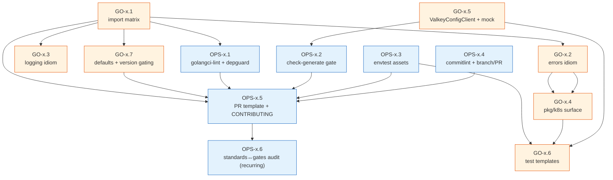
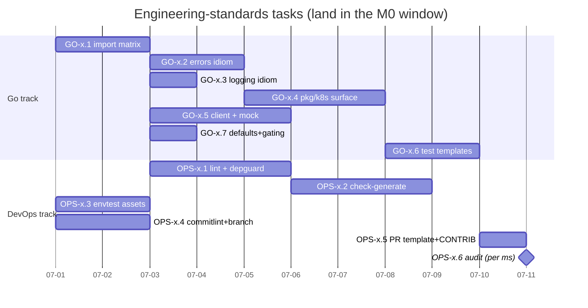

# 10 — Engineering Standards & Conventions

> **Type:** Reference doc (cross-cutting, shared) — **not** a milestone.
> **Lead track:** DevOps / Platform owns the enforcement gates; Go Developer owns the idioms.
> **One-line goal:** establish the single, enforceable "how we build" rulebook every milestone phase
> (M0–M8) references — Go package conventions, error wrapping, structured logging, controller idioms
> (idempotency, re-fetch-before-update, owner refs, finalizers), the never-hand-edit-generated rule,
> `mockgen` usage, table-driven/envtest testing, branch/PR/commit conventions, the Percona
> conventions we mirror, and a per-PR checklist.

This document does not ship a feature. It constrains *how* every feature is shipped, so that two
engineers (one Go, one DevOps) working in parallel across the milestones never diverge on package
boundaries, generated-code discipline, reconcile idioms, test shape, or commit/PR flow.

**Source of truth.** Every standard below traces to a section of an authoritative architecture doc
under `../architecture/`. Citations are inline (e.g. `../architecture/02-repo-layout.md §4`). Where
the docs are silent on a convention we still need, it is recorded as an **OPEN QUESTION** in §10
rather than invented. The locked tech facts (Go 1.26; Operator SDK + controller-runtime; module path
`valkey.percona.com/percona-valkey-operator`; the `pkg/apis/valkey/v1alpha1` +
`pkg/controller/<resource>` + `pkg/valkey` layout; the four `cmd/` binaries; the Percona Makefile
vocabulary; GitHub Actions PR unit+lint + Jenkins GKE e2e) come from the Charter and ADR-002 /
ADR-011.

> **Naming note — protocol layer is `pkg/valkey` (locked).** The protocol/domain engine lives at
> **`pkg/valkey`** (Percona-idiomatic `pkg/<domain>`, matching `pkg/pxc`, `pkg/mysql`), per the
> authoritative repo-layout doc (`../architecture/02-repo-layout.md` §2–§3), which states the trade-off
> explicitly ("`pkg/` exposes more surface than `internal/`… mitigated by treating `pkg/valkey` as
> operator-internal and not committing to its API stability"). The charter-echo `internal/valkey` is
> **rejected**. This is recorded as **OQ-10.1 (resolved)**.

---

## 1. Objective & demoable outcome

**Objective.** Define one canonical, enforceable convention set so the four-controller operator
(`PerconaValkeyCluster`, `ValkeyNode`, `PerconaValkeyBackup`, `PerconaValkeyRestore`) is buildable by
two engineers in parallel without drift: identical package boundaries (`../architecture/02-repo-layout.md`
§3, §9), identical generated-code discipline (§4), identical reconcile idioms
(`../architecture/04-control-plane.md` §2, §9), identical test shape (ADR-011), identical commit/PR
flow. The doc mirrors the Percona Operator-SDK trio (PXC / PSMDB / PS) so a maintainer fluent in the
trio can navigate this repo cold (ADR-002).

**Demoable outcome.** Because this is a reference doc, its "demo" is the set of *automated gates* it
defines being live and green in CI, plus the docs/templates it produces rendering in-repo:

1. `make check-generate` fails any PR whose committed `zz_generated.deepcopy.go` / `deploy/crd.yaml` /
   `deploy/rbac.yaml` / `mockgen` output (`mock_*.go`) drift from the `*_types.go` + markers + interface
   source (`../architecture/02-repo-layout.md` §4).
2. `golangci-lint` **v2** (the Go-1.26-enabled linter set: `errcheck`, `govet`, `staticcheck`,
   `revive`, `gocyclo`, `dupl`, `goconst`, `ineffassign`, `unused`, `unparam`, `unconvert`,
   `prealloc`, `nakedret`, `lll`, `misspell`, `copyloopvar`, `modernize`, `ginkgolinter`, `logcheck`,
   `depguard`), run via `make lint-config && make lint`, plus `gosec ./...` as a **separate** step
   (a Percona addition, not in the golangci enable-list), `go fmt`, and `go vet` — all run clean on PR
   and block on violations (ADR-011; `../architecture/11-testing-qa.md` §"CI gates"/"Enabled linters";
   Charter DoD baseline).
3. A per-PR checklist (this doc §"Per-PR checklist", shipped as `.github/pull_request_template.md`)
   appears on every PR and is what reviewers check against.
4. The package-dependency rule (`pkg/apis` is a leaf; no controller imports another controller) is
   documented and enforced — in review (the doc-stated mechanism, `../architecture/02-repo-layout.md`
   §3 "enforced in review", §9) **and**, as a plan-introduced hardening, by a `depguard` import matrix.
   Note the architecture doc's own `depguard` example enforces a *different* rule (`forbid sort in
   favour of slices`, `../architecture/11-testing-qa.md` §"Enabled linters"); using `depguard` for the
   import-direction policy is an additive engineering choice (see **OQ-10.4**), not a doc-mandated gate.
5. `CONTRIBUTING.md` + this doc render in-repo so any new contributor (human or agent) reads one
   canonical "how we build" page.

This produces **documentation and lint/CI configuration**, not operator behaviour. Its correctness is
judged by whether downstream phases follow it mechanically and whether the gates catch violations.

---

## 2. Milestone & exit criteria

This reference is **cross-cutting** — it has no milestone digit of its own and is referenced by every
milestone M0–M8. Its tasks are numbered with phase digit **`x`** to mark "cross-cutting / standards"
(`GO-x.n`, `OPS-x.n`), distinct from the numeric milestone phases. Most of its content lands during
**M0 Bootstrap** (the lint config, the `check-generate` gate, the PR template, `CONTRIBUTING.md`) and
is then *amended additively* as later milestones introduce new surfaces (e.g. the conversion-webhook
TLS-bootstrap idiom in M6, the kuttl/`run-*.csv` conventions in M8).

**Exit criteria (this reference is "in force"):**

- `CONTRIBUTING.md` and this doc are committed and cross-linked from the repo `README`.
- `.golangci.yml` (golangci-lint **v2**) enables the linter set in §1.2, builds the custom
  golangci-lint binary (with `logcheck`/`modernize` plugins) into `bin/`, and is wired into
  `make lint-config && make lint` and the GitHub Actions PR job.
- `.github/pull_request_template.md` carries the §"Per-PR checklist".
- `make check-generate` exists and is a PR-blocking gate (`../architecture/02-repo-layout.md` §4).
- `commitlint` (or a CI step) enforces Conventional Commits on PR titles/commits.
- A `depguard` rule encodes the import-direction policy (`pkg/apis` leaf; controllers do not import
  each other), coexisting with the doc's `sort`→`slices` `depguard` rule — pending OQ-10.4
  ratification; if rejected, the policy is review-only and this criterion drops to "documented".
- The standards are demonstrably *followed*: the M0 skeleton PR passes every gate this doc defines.

**Definition of Done (baseline + phase-specifics).** The Charter DoD applies to the *tasks that
implement these gates*: code/config compiles and runs; the lint/`check-generate`/`commitlint` gates
are green on a sample PR; generated artifacts regenerate clean; `gofmt`/`go vet`/`golangci-lint`/
`gosec` clean; docs (`CONTRIBUTING.md`, this doc) updated; CI passes. There is **no** 80% unit-coverage
target for this doc itself (it ships config + prose, not packages) — the coverage target binds the
*feature* phases, and this doc *defines* how that target is measured (§9.4).

---

## 3. Prerequisites

| Needs | From | Why |
|---|---|---|
| Repo scaffolded, module path set, `bin/` tool auto-download working, GitHub Actions skeleton | **M0 Bootstrap** (`01-phase0-bootstrap.md`, tasks OPS-0.x) | The gates this doc defines (`check-generate`, lint, `commitlint`) are *wired into* the M0 CI and Makefile; they cannot exist before the Makefile/CI skeleton does. |
| The repo-layout tree and package-dependency rule | `../architecture/02-repo-layout.md` §2–§3, §9 | The import-direction and naming conventions codified here are a restatement + enforcement of that doc. |
| The reconcile-idiom source (phases, requeue taxonomy, finalizers, status derivation) | `../architecture/04-control-plane.md` §2, §3, §6, §7, §9 | The controller-idiom rules (§7 of this doc) are extracted verbatim from there. |

This doc is *mutually bootstrapping* with M0: M0 stands up the skeleton; this doc says what "correct"
looks like inside it. In practice the OPS tasks here are authored **during** M0 and merged in the same
window. Later milestones consume this doc read-only and only append to §7/§9 when a genuinely new
idiom (conversion webhook, version-service client) appears.

---

## 4. Scope — In / Out

**In scope (this reference governs):**

- Go package layout, naming, and the import-direction (leaf/near-leaf/controller) policy.
- Error handling: wrapping with `%w`, sentinel vs typed errors, the never-swallow rule, fail-closed.
- Structured logging via `logf.FromContext(ctx)` — levels, key conventions, secret-redaction.
- Controller idioms: idempotency, re-fetch-before-update, `CreateOrUpdate`, owner refs + GC,
  finalizer re-entrancy, requeue taxonomy, status-condition derivation, `CheckNSetDefaults`.
- Generated-code boundary: never-hand-edit list, regenerate-after-`*_types.go`-change workflow,
  `mockgen` usage and where mocks live.
- Test conventions: table-driven unit tests, envtest (Ginkgo/Gomega), fakes vs mocks, the Valkey
  client interface mock, golden files, coverage measurement.
- Branch / commit / PR conventions: Conventional Commits, branch naming, PR body + test plan, the
  per-PR checklist.
- The Percona trio conventions we mirror (and the few we deliberately do not).

**Out of scope (governed elsewhere — referenced, not redefined):**

- The Makefile target vocabulary and `VERSION` footgun → `../architecture/02-repo-layout.md` §5;
  `08-phase7-devops-distribution.md`.
- CI/CD pipeline shape (which jobs, GKE provisioning) → ADR-011; `08-phase7-devops-distribution.md`.
- The CRD field schemas, CEL rules, and markers → `../architecture/03-api-design.md`;
  `02-phase1-api.md`.
- The reconcile pipeline *content* (what each phase does) → `../architecture/04-control-plane.md`;
  the per-phase implementation docs.
- Security specifics (ACL syntax, RBAC verb sets, secret shapes) → `../architecture/07-security.md`;
  `06-phase5-security-observability.md`.
- Release / version-sync discipline (the twelve hand-edited locations) →
  `../architecture/10-distribution-release.md`; `08-phase7-devops-distribution.md`.

This doc is the *constitution*; those docs are the *statutes*. When this doc and a feature doc both
speak, the feature doc wins on feature specifics and this doc wins on cross-cutting form.

---

## 5. Go Developer Track

The Go track owns the *idioms* — the code-shaped conventions every controller and package author
follows. These tasks produce reference material (`CONTRIBUTING.md` sections, code skeletons,
`doc.go` package headers) plus the small amount of shared scaffolding (a `pkg/k8s` helper surface, a
logging helper) that makes the idioms uniform. The bulk of the *engineering* is in the feature
phases; these tasks make sure the feature phases share one vocabulary.

| ID | Title | Description | Files / packages | Key types / funcs | Depends-on | DoD | Tests | Effort | Risk |
|---|---|---|---|---|---|---|---|---|---|
| **GO-x.1** | Package-layout & import-direction guide | Document the leaf/near-leaf/controller import policy from `../architecture/02-repo-layout.md` §3, §9 as a `CONTRIBUTING.md` section + a `depguard` allow/deny matrix the Go track keeps honest. | `CONTRIBUTING.md`, `.golangci.yml` (depguard block), `doc.go` per `pkg/*` | (prose) import matrix: `pkg/apis` leaf; `pkg/naming`/`pkg/version` near-leaf; controllers top; no controller→controller | OPS-x.1 | Matrix matches the `../architecture/02-repo-layout.md` §9.2 dependency graph; `depguard` rejects a deliberate `perconavalkeycluster → valkeynode` import in a test | n/a (config validated by a tripwire import in `make lint` smoke) | S (1.5) | Drift between prose matrix and `depguard` config; mitigate by generating both from one source-of-truth comment block |
| **GO-x.2** | Error-handling & validation idiom | Codify: wrap with `fmt.Errorf("...: %w", err)`; sentinel errors via `errors.Is`; typed errors only where callers branch; never swallow (`../architecture/00-overview.md`/`coding-style`); fail-closed at system boundaries (`../architecture/04-control-plane.md` §9, "Fail-closed on user misconfig"). | `CONTRIBUTING.md` §errors; `pkg/k8s/errors.go` (shared `IgnoreNotFound`, `RequeueOnConflict` helpers) | `IgnoreNotFound(err) error`; `RequeueOnConflict(err) (ctrl.Result, error)` | GO-x.1 | Helpers compile; examples in `CONTRIBUTING.md` mirror real controller usage | unit: `pkg/k8s/errors_test.go` table-driven over `NotFound`/`Conflict`/`nil`/wrapped | S (1.5) | Over-engineering typed errors; keep to sentinels + `%w` |
| **GO-x.3** | Structured-logging idiom | Standardise `logf.FromContext(ctx)` usage (`../architecture/04-control-plane.md` §8 "Structured logging"): leveled `V(1)` debug, key conventions (`cluster`, `node`, `shard`, `reconcileID`), **never log secret material** (ACL/TLS) — tie to `gosec` + `logcheck`. | `CONTRIBUTING.md` §logging; `pkg/k8s/log.go` (key constants + a redaction helper) | `LogKeyCluster`, `LogKeyNode`, …; `RedactSecret(name string) string` | GO-x.1 | Key constants used by ≥1 controller; redaction helper drops values | unit: `RedactSecret` never emits a value; `logcheck` passes | S (1) | Secrets leaking into logs (security); mitigate with `logcheck` + review rule in §7.4 |
| **GO-x.4** | Controller-idiom reference + `pkg/k8s` surface | Extract the load-bearing idioms — idempotency, **re-fetch-before-update**, `CreateOrUpdate`, owner refs for GC, **re-entrant finalizers**, requeue taxonomy, `CheckNSetDefaults` as the single mutation entry — into `CONTRIBUTING.md` + a thin shared `pkg/k8s` (CreateOrUpdate wrapper, fresh status writeback, Lease helper). (`../architecture/04-control-plane.md` §2, §3, §6, §9; §8 repo-layout.) | `CONTRIBUTING.md` §controllers; `pkg/k8s/{apply.go,status.go,lease.go}` | `CreateOrUpdate(ctx, c, obj, mutate) (OperationResult, error)`; `PatchStatus(ctx, c, obj) error`; `AcquireLease/ReleaseLease` | GO-x.1, GO-x.2 | Helpers used by node + backup controllers in their phases; idioms documented with one canonical snippet each | unit (envtest) for `CreateOrUpdate` create/update/no-op; `PatchStatus` conflict retry; Lease acquire/contend | M (3) | `pkg/k8s` becoming a junk drawer; keep it to the four idioms only |
| **GO-x.5** | Valkey-client interface + mock convention | Define the `pkg/valkey` `ValkeyConfigClient` interface (CLUSTER cmds, INFO, CONFIG SET) and the **`mockgen`** convention (interface is source of truth, `mock_client.go` is generated, never hand-edited) so all four controllers unit-test orchestration without a live engine (`../architecture/02-repo-layout.md` §4; ADR-011). `ForceSingleClient=true` documented. | `pkg/valkey/client.go` (interface + `//go:generate mockgen`), `pkg/valkey/mock_client.go` (GENERATED) | `type ValkeyConfigClient interface { ClusterInfo/ClusterNodes/ClusterMeet/AddSlotsRange/Replicate/Failover/MigrateSlots/Info/ConfigSet(...) }` | GO-x.1, M0 OPS-0.x (mockgen tool + `make generate` wired) | Interface compiles; `make generate` produces the mock; mock satisfies the interface | a sample table-driven test consumes the mock to assert one `CLUSTER` call sequence | M (2.5) | Interface churn forcing mock regen noise; stabilise the surface early, version-gate additions |
| **GO-x.6** | Table-driven & envtest test template | Provide canonical test skeletons: pure table-driven for `pkg/valkey` math (slot planning, config-hash determinism, ACL render) and Ginkgo/Gomega + envtest for controllers (`../architecture/02-repo-layout.md` §4; ADR-011). Document fakes vs mocks vs envtest selection. | `CONTRIBUTING.md` §testing; `hack/test-templates/` (`table_test.go.tmpl`, `envtest_suite_test.go.tmpl`) | (templates) `suite_test.go` `BeforeSuite`/`AfterSuite` with `setup-envtest` assets | GO-x.4, GO-x.5, OPS-x.3 | Templates compile when instantiated; envtest template boots a mock API server | the templates themselves run as a smoke test in `make test` | S (2) | Template rot vs real tests; keep templates minimal, link to one real example per kind |
| **GO-x.7** | Defaulting & version-gating idiom | Document `CheckNSetDefaults(ctx, platform)` as the single mutation point (crVersion stamp, image resolution, secret-name hydration, probe defaults) and `version.CompareVersion("x.y")` as the **only** way to branch behaviour by API version — never hardcoded checks (`../architecture/04-control-plane.md` §2.1 step 0; ADR-005). | `CONTRIBUTING.md` §defaulting+versioning; example block referencing `pkg/apis/.../perconavalkeycluster_defaults.go` + `pkg/version` | (prose + signatures) `func (cr *PerconaValkeyCluster) CheckNSetDefaults(ctx, platform) error`; `func (cr *PerconaValkeyCluster) CompareVersion(string) int` | GO-x.1 | Idiom section cites the real receiver signatures; a lint/review note forbids inline version literals | n/a (validated when M1/M6 implement defaults/gating) | S (1) | Authors hardcoding `if crVersion == "1.1"`; mitigate via review-checklist line + grep tripwire |

**GO track total: ~12.5 person-days.** Most are S; GO-x.4/x.5 (the shared `pkg/k8s` surface and the
client interface+mock) are the only M-sized items and are on the critical path because every later
phase imports them.

---

## 6. DevOps / Platform Track

The DevOps track owns the *enforcement* — turning each idiom into a gate that fails a bad PR
automatically, so the standards are not merely aspirational. This track is the heavier one for this
doc: lint config, the `check-generate` gate, the commit-lint gate, the PR template, and the
`CONTRIBUTING.md` scaffolding all live here.

| ID | Title | Description | Files / packages | Key targets / config | Depends-on | DoD | Tests | Effort | Risk |
|---|---|---|---|---|---|---|---|---|---|
| **OPS-x.1** | `golangci-lint` v2 config + `make lint-config`/`make lint` | Author `.golangci.yml` (golangci-lint **v2** schema) enabling the full Go-1.26 linter set from §1.2; build the custom golangci-lint binary with the `logcheck`/`modernize` plugins into `bin/`; wire `make lint-config` (validate config) **and** `make lint`, plus the GitHub Actions lint job (`../architecture/11-testing-qa.md` §"CI gates"/"Enabled linters"; `../architecture/02-repo-layout.md` §5; ADR-011; Charter DoD). Keep the doc's `depguard` `sort`→`slices` rule and add the GO-x.1 import-direction block (OQ-10.4). | `.golangci.yml`, `Makefile` (`lint`, `lint-config` targets), `.github/workflows/test.yml` (lint step) | `make lint-config && make lint` → `bin/golangci-lint run`; `depguard` (sort→slices + import matrix); `lll`/`gocyclo`/`dupl` thresholds | M0 OPS-0.x (Makefile/CI skeleton) | `lint-config` validates and lint runs clean on the M0 skeleton; a deliberately-bad branch (e.g. unchecked err) fails | a `make lint` smoke run in CI on a known-good and known-bad fixture | M (3) | Linter-set noise blocking M0; tune thresholds (`lll`, `gocyclo`) once, document overrides via `//nolint:<linter> // reason` policy |
| **OPS-x.2** | `check-generate` gate | Implement `make check-generate` = `make generate && make manifests && git diff --exit-code`, mirroring PG's gate, as a PR-blocking job; document the never-hand-edit list (`../architecture/02-repo-layout.md` §4). Ensure `mockgen` runs inside `make generate`. | `Makefile` (`check-generate`), `.github/workflows/test.yml` (gate job) | `check-generate:` runs controller-gen object/crd/rbac + kustomize + mockgen, fails on dirty tree | M0 OPS-0.x; GO-x.5 (mockgen target) | Editing a `*_types.go` field without regenerating fails the gate; regenerating makes it pass | CI job exercised on a fixture commit that omits regen | M (2.5) | False dirties from tool-version skew; pin tool versions in `bin/` and `.go-version` |
| **OPS-x.3** | envtest asset wiring (`setup-envtest`) | Wire `setup-envtest` auto-download of `KUBEBUILDER_ASSETS` into `make test`, pin the k8s version, document the single-test invocation idiom (`KUBEBUILDER_ASSETS=… go test ./pkg/... -run TestX -v`) — the basis for GO-x.6's envtest template (ADR-011; `../architecture/02-repo-layout.md` §4–§5). | `Makefile` (`test`, `envtest` targets), `CONTRIBUTING.md` §running-tests | `setup-envtest use <k8s-ver> -p path`; `make test` depends on assets | M0 OPS-0.x | `make test` downloads assets on a clean machine and runs the (near-empty) suite green | CI runs `make test` on a cold cache | S (1.5) | Asset download flakiness in CI; cache `bin/` + assets between runs |
| **OPS-x.4** | Conventional-commits + branch/PR convention gate | Document and enforce Conventional Commits (`feat`/`fix`/`refactor`/`docs`/`test`/`chore`/`perf`/`ci`), branch naming (`<type>/<short-desc>`, release `release-x.y.z`), and the PR-body + test-plan format; add a `commitlint` CI step on PR titles (`git-workflow`; `../architecture/10-distribution-release.md` §8 for `release-x.y.z`). | `CONTRIBUTING.md` §commits+branches; `.github/workflows/commitlint.yml`; `commitlint.config.*` | allowed types list; PR-title regex; `release-x.y.z` branch rule | M0 OPS-0.x | A malformed PR title (`updated stuff`) fails commitlint; a conformant one passes | commitlint run on good/bad title fixtures | S (1.5) | Over-strict body rules annoying contributors; enforce *title* in CI, *body* in review only |
| **OPS-x.5** | PR template + `CONTRIBUTING.md` assembly | Ship `.github/pull_request_template.md` carrying the §"Per-PR checklist", and assemble `CONTRIBUTING.md` from the GO/OPS section fragments into one canonical page linked from `README`. Note attribution is disabled globally (no Co-Authored-By trailer unless asked). | `.github/pull_request_template.md`, `CONTRIBUTING.md`, `README.md` (link) | (markdown) checklist; contributing TOC | GO-x.1..x.7, OPS-x.1..x.4 | Template renders on a test PR; `CONTRIBUTING.md` cross-links resolve | link-check in `make docs`/CI (markdown link lint) | S (1) | Checklist going stale vs gates; OPS-x.6 audit keeps them in sync |
| **OPS-x.6** | Standards-vs-gates consistency audit (recurring) | A lightweight recurring task: each milestone, verify the per-PR checklist and `CONTRIBUTING.md` still match the live gates (new linters, new generated artifacts, new idioms like the conversion-webhook in M6). Update additively. (`../architecture/02-repo-layout.md` §4; ADR-011.) | `CONTRIBUTING.md`, `.golangci.yml`, PR template | (delta only) | OPS-x.5 | At each milestone close, a diff confirms checklist ↔ gates parity | n/a (review task) | XS (0.5 per milestone) | Audit skipped → drift; bind it into each phase's exit criteria |

**OPS track total: ~9.5 person-days** for the initial build (OPS-x.1..x.5, M0 window: 3 + 2.5 + 1.5 +
1.5 + 1), plus ~0.5/milestone for the recurring OPS-x.6 audit (matching the §11 effort table). The
`check-generate` (OPS-x.2) and lint (OPS-x.1) gates are on the critical path — no feature PR can merge
cleanly until they exist.

**Is either track "light"?** No — for this reference doc the two tracks are roughly balanced: the Go
track authors the idioms + shared `pkg/k8s`/client interface; the DevOps track turns each into a
gate. Neither is a token "supports only" track.

---

## 7. Key technical decisions to honour (with citations)

These are the non-negotiable rules every phase inherits. Each cites its architecture-doc source.

### 7.1 Package layout & import direction
- **Layout is the Percona SDK trio shape**, not plain kubebuilder `internal/`: `pkg/apis/valkey/v1alpha1`,
  `pkg/controller/<resource>`, `pkg/valkey`, `pkg/naming`, `pkg/version`, `cmd/manager` + three
  sidecars (ADR-002; `../architecture/02-repo-layout.md` §1–§3).
- **Import direction is acyclic and downward.** `pkg/apis` is a **leaf** (imports only apimachinery,
  nothing from `controller`/`valkey`/`naming`). `pkg/naming` and `pkg/version` are near-leaves
  (depend only on `apis`/stdlib). Controllers sit on top and **never import each other**;
  `cmd/manager` is the single composition root (`../architecture/02-repo-layout.md` §3, §9). Enforced
  by `depguard` (OPS-x.1) + review.
- **Centralise naming in `pkg/naming`.** No resource-name or label string literals anywhere else;
  child resources are `valkey-`-prefixed, PVCs `valkey-<node>-data`, labels are the
  `app.kubernetes.io/*` set **plus** `valkey.percona.com/{cluster,shard-index,node-index,component}`;
  every builder respects the 63-char DNS-label limit (`../architecture/02-repo-layout.md` §8).
- **Many small files > few large.** Per-concern files inside each controller package
  (`service.go`, `configmap.go`, `users.go`, `nodes.go`, `topology.go`, `failover.go`, `status.go`,
  `finalizers.go`) exactly as the repo-layout tree prescribes (`../architecture/02-repo-layout.md` §2).

### 7.2 Generated-code boundary (the single most important operational invariant)
- **Edit `*_types.go` + markers; never hand-edit generated output.** The never-hand-edit list:
  `zz_generated.deepcopy.go`, `config/crd/bases/*` + `deploy/crd.yaml`, `config/rbac/*` +
  `deploy/rbac.yaml`/`cw-rbac.yaml`, kustomize-rendered `deploy/bundle*.yaml`, `bundle/manifests/*csv`,
  the `mockgen` output (`mock_*.go` / `*_mock.go`, e.g. `pkg/valkey/mock_client.go`), and
  `deploy/cr*.yaml` image tags/`crVersion` (rewritten by `make release`)
  (`../architecture/02-repo-layout.md` §4).
- **Regenerate-after-types-change workflow:** edit `*_types.go` → `make generate` (deepcopy + mocks)
  → `make manifests` (crd + rbac + deploy) → add `CompareVersion` guards if version-gated →
  `make check-generate` locally (clean `git diff`) before commit. CI repeats it as a blocking gate
  (`../architecture/02-repo-layout.md` §4; OPS-x.2).
- **`mockgen` mocks** are generated from the interface (source of truth = the `ValkeyConfigClient`
  declaration), run inside `make generate`, never hand-edited (GO-x.5; `../architecture/02-repo-layout.md` §4).

### 7.3 Controller idioms (from the control-plane doc)
- **Re-fetch before update (mandatory).** Every controller `Get`s at the top of `Reconcile` and
  re-`Get`s / uses `CreateOrUpdate`/`Patch` immediately before any write — never write against a
  stale `resourceVersion`. Status writes operate on a **freshly-fetched** CR, never in-memory status,
  to avoid racing the version-service/backup crons (`../architecture/04-control-plane.md` §9, §2.1).
- **Idempotency everywhere.** `CreateOrUpdate` for k8s objects; Valkey cluster commands are made
  *effectively* idempotent by **precondition guards** (only `ADDSLOTSRANGE` to primaries owning zero
  slots; one `MIGRATESLOTS` move per reconcile re-reading live ownership; `FORGET` only ids still in
  gossip, treating `NotFound` as success). A crash mid-pipeline re-runs from phase 0 safely
  (`../architecture/04-control-plane.md` §9, §2.1 steps 9/11/13/14).
- **One effect per reconcile + short requeue.** Each phase returns early with a `2s` requeue on
  progress/wait so the next pass sees fresh state. Requeue taxonomy: `2s` progress/wait, `1s`
  finalizer-mutated, `10s` pod-not-ready, `30s` healthy cluster re-verify, `60s` node steady,
  controller-runtime exponential backoff on returned `error` (`../architecture/04-control-plane.md`
  §2.1, §9).
- **Owner references for GC.** `PerconaValkeyCluster` owns Service/ConfigMap/Secret/PDB/`ValkeyNode`
  (`controller=true, blockOwnerDeletion=true`); `ValkeyNode` owns its 1-replica STS/Deployment + PVC +
  ConfigMap; Backup/Restore own their Jobs but **do not** own the cluster (reference by
  `clusterName` only, so artifacts survive cluster deletion) (`../architecture/03-api-design.md` §1;
  `../architecture/04-control-plane.md` §5).
- **Finalizers are re-entrant, not array-ordered.** Kubernetes runs finalizers in arbitrary order, so
  ordering (replicas-before-primaries, drain-before-FORGET-before-delete, TLS-before-finalizer-removal,
  release-Lease-before-terminal) is enforced **inside** the cluster controller's teardown branch.
  Each teardown is idempotent, re-derives "what still needs cleaning" from live state, and removes a
  finalizer only after verifiable completion. A periodic finalizer-audit re-enqueues wedged deleting
  objects but never force-removes a finalizer (`../architecture/04-control-plane.md` §6).
- **`CheckNSetDefaults(ctx, platform)` is the single mutation entry point**, invoked every reconcile
  (crVersion stamp, image resolution, secret-name hydration, probe/resource defaults)
  (`../architecture/04-control-plane.md` §2.1 step 0; `../architecture/02-repo-layout.md` §8).
- **`status.state` is always recomputed, never written directly** — a pure projection of the
  `Degraded`/`Ready`/`Progressing` conditions by fixed priority (`deletionTimestamp → Degraded →
  Ready → Progressing → Failed`). `observedGeneration` is set only at the successful reconcile tail;
  consumers must check `state==ready AND observedGeneration==generation`
  (`../architecture/04-control-plane.md` §7).
- **Fail-closed on user misconfig.** Invalid live-settable value (`LiveConfigApplied=False`) or
  missing `storageName` halts the loop with a clear `Reason`/Warning event and retries — never guess
  a value (`../architecture/04-control-plane.md` §9, §3.1 step 5).

### 7.4 Error handling, logging, secrets
- **Wrap, don't swallow.** Wrap with `fmt.Errorf("context: %w", err)` so callers can `errors.Is`/`As`;
  handle errors explicitly at every layer; user-friendly messages in CR conditions/events, detailed
  context in server-side logs (coding-style rules; `../architecture/04-control-plane.md` §7 events).
- **Structured logging via `logf.FromContext(ctx)`** with the reconciled object + reconcile key in
  scope; leader identity logged for traceability (`../architecture/04-control-plane.md` §8).
- **Never log secret material.** ACL passwords, TLS keys, object-store credentials must never reach
  logs; passwords are always referenced from Secrets, SHA-256-hashed into ACL files, never inlined in
  the CR; `secrets.yaml` carries placeholders only (`../architecture/07-security.md` §8;
  `../architecture/02-repo-layout.md` §7). Enforced by `logcheck`/`gosec` + the §"Per-PR checklist".

### 7.5 Versioning & leader election
- **Version-gate with `CompareVersion`, never hardcode.** Any new field's behaviour is gated by
  `cr.CompareVersion("x.y")` against `spec.crVersion` so older CRs reconcile unchanged; `version.txt`
  is the operator-version source of truth (ADR-005; `../architecture/02-repo-layout.md` §8;
  `../architecture/04-control-plane.md` §2.1 step 0).
- **Single active reconciler via leader-election Lease** (controller-runtime defaults: `LeaseDuration`
  ~15s, `RenewDeadline` ~10s, `RetryPeriod` ~2s; keep `RenewDeadline < LeaseDuration`). Stateful
  Valkey commands must never be double-issued; backup/restore add a finer Lease + `sync.Map`
  (`../architecture/04-control-plane.md` §8).

### 7.6 Testing
- **kuttl e2e (match PS/PG) + envtest (Ginkgo/Gomega) units; 80%+ coverage enforced** (ADR-011). Mocks
  for the Valkey client let units exercise `CLUSTER` orchestration without a live engine; `run-*.csv`
  matrices key tests by `(test-name, valkey-version)` (`../architecture/02-repo-layout.md` §4;
  ADR-011; `../architecture/11-testing-qa.md`).

---

## 8. Illustrative code skeletons / function signatures

These are *reference* skeletons authors copy, not files this doc ships wholesale (the feature phases
ship the real code). They make the idioms in §7 concrete.

### 8.1 The canonical reconcile entrypoint (re-fetch, defaults, deletion branch, recompute status)

```go
// pkg/controller/perconavalkeycluster/controller.go (idiom skeleton)
func (r *PerconaValkeyClusterReconciler) Reconcile(ctx context.Context, req ctrl.Request) (ctrl.Result, error) {
	log := logf.FromContext(ctx).WithValues(k8s.LogKeyCluster, req.NamespacedName.String()) // log-key constants live in pkg/k8s/log.go (GO-x.3)
	log.V(1).Info("reconcile start")

	// 1. Re-fetch at the top — never act on stale cache.
	cr := &valkeyv1alpha1.PerconaValkeyCluster{}
	if err := r.Get(ctx, req.NamespacedName, cr); err != nil {
		return ctrl.Result{}, k8s.IgnoreNotFound(err) // object gone → owner-ref GC handles children
	}

	// 2. Single mutation entry point (crVersion stamp, image resolve, secret-name hydrate, defaults).
	if err := cr.CheckNSetDefaults(ctx, r.Platform); err != nil {
		return ctrl.Result{}, fmt.Errorf("check and set defaults: %w", err)
	}

	// 3. crVersion gate — an older operator must not reconcile a newer-API CR.
	//    `cr.CompareVersion(x)` compares spec.crVersion against x; a POSITIVE result means
	//    spec.crVersion is NEWER than the running operator's major.minor → reject.
	//    (../architecture/04-control-plane.md §2.1 step 0; the only version-branch API is
	//    CompareVersion — no bespoke version.Operator() helper exists.)
	if cr.CompareVersion(version.Version()) > 0 {
		r.setCondition(cr, ConditionReady, metav1.ConditionFalse, ReasonUnsupportedCRVersion, "...")
		return ctrl.Result{}, r.patchStatusAndDeriveState(ctx, cr)
	}

	// 4. Deletion branch jumps to the re-entrant finalizer teardown (NOT array-ordered).
	if !cr.DeletionTimestamp.IsZero() {
		return r.reconcileDelete(ctx, cr)
	}

	// 5. Ordered, idempotent, one-effect-per-pass phases; each returns early with a 2s requeue.
	res, err := r.runPipeline(ctx, cr)

	// 6. status.state is ALWAYS recomputed from conditions, never assigned directly.
	if perr := r.patchStatusAndDeriveState(ctx, cr); perr != nil && err == nil {
		err = perr
	}
	return res, err
}
```

### 8.2 The `pkg/k8s` shared idiom surface (GO-x.4)

```go
// pkg/k8s/apply.go
// CreateOrUpdate is the ONLY way controllers mutate child objects (idempotency rule, §7.3).
func CreateOrUpdate(ctx context.Context, c client.Client, obj client.Object,
	mutate controllerutil.MutateFn) (controllerutil.OperationResult, error)

// pkg/k8s/status.go
// PatchStatus writes status from a freshly-fetched object, retrying on conflict (re-fetch rule).
func PatchStatus(ctx context.Context, c client.Client, obj client.Object) error

// pkg/k8s/errors.go
func IgnoreNotFound(err error) error                       // collapse NotFound → nil
func RequeueOnConflict(err error) (ctrl.Result, error)     // 409 → requeue, not error-spam

// pkg/k8s/lease.go — backup/restore serialization (§7.5), distinct from leader election.
func AcquireLease(ctx context.Context, c client.Client, name, holder string) (bool, error)
func ReleaseLease(ctx context.Context, c client.Client, name, holder string) error
```

### 8.3 The Valkey client interface + mockgen convention (GO-x.5)

```go
// pkg/valkey/client.go — source of truth; the mock is GENERATED from this.
// NOTE: in `mockgen -source` mode the interface name is NOT a positional arg
// (that is reflect mode); `-source` regenerates mocks for every interface in the file.
// Matches the trio convention (PS: `mockgen -source=… -destination=… -package=…`).
//go:generate mockgen -source=client.go -destination=mock_client.go -package=valkey

// ValkeyConfigClient is the seam that lets controllers be unit-tested without a live engine
// (ADR-011). All commands are issued as the _operator user with ForceSingleClient=true
// (../architecture/04-control-plane.md §2.1 step 7).
type ValkeyConfigClient interface {
	ClusterInfo(ctx context.Context) (ClusterInfo, error)
	ClusterNodes(ctx context.Context) ([]NodeState, error)
	ClusterMeet(ctx context.Context, ip string, port, busPort int) error
	AddSlotsRange(ctx context.Context, ranges []SlotRange) error
	Replicate(ctx context.Context, primaryID string) error
	Failover(ctx context.Context, mode FailoverMode) error // graceful | force | takeover
	MigrateSlots(ctx context.Context, dst string, slots []int) error
	Info(ctx context.Context, section string) (map[string]string, error)
	ConfigSet(ctx context.Context, kv map[string]string) error
	Close() error
}
```

### 8.4 Table-driven unit test template (GO-x.6) — for `pkg/valkey` deterministic math

```go
func TestPlanRebalanceMove(t *testing.T) {
	tests := []struct {
		name   string
		state  ClusterState
		shards int
		want   *RebalanceMove // nil = balanced, no-op
	}{
		{name: "balanced 3 shards → no move", state: balanced3(), shards: 3, want: nil},
		{name: "over-target src picked by stable address sort", state: skewed(), shards: 3,
			want: &RebalanceMove{Src: "10.0.0.1", Dst: "10.0.0.3", Slots: rangeOf(0, 399)}},
	}
	for _, tc := range tests {
		t.Run(tc.name, func(t *testing.T) {
			got := PlanRebalanceMove(tc.state, tc.shards)
			require.Equal(t, tc.want, got) // deterministic: address-sorted, batch 400, one move
		})
	}
}
```

### 8.5 DevOps config snippets

`.golangci.yml` (OPS-x.1, **golangci-lint v2** schema) — the import-direction guard plus the Go-1.26
linter set. (Illustrative; the v2 schema nests linters under `linters:` with `linters.settings:` — the
exact keys are settled in OPS-x.1. `gosec` is run as a separate step, per `../architecture/11-testing-qa.md`,
not via the golangci enable-list.)

```yaml
version: "2"                              # golangci-lint v2 (../architecture/11-testing-qa.md)
linters:
  enable: [errcheck, govet, staticcheck, revive, gocyclo, dupl, goconst, ineffassign,
           unused, unparam, unconvert, prealloc, nakedret, lll, misspell, copyloopvar,
           modernize, ginkgolinter, logcheck, depguard]
  settings:
    depguard:
      rules:
        prefer-slices:                    # doc's own rule: forbid `sort`, prefer `slices`
          deny:                           #   (../architecture/11-testing-qa.md §"Enabled linters")
            - pkg: sort
              desc: "use the stdlib slices package instead of sort"
        apis-is-leaf:                     # plan-introduced import matrix, OQ-10.4 (§7.1)
          files: ["**/pkg/apis/**"]
          deny:
            - pkg: valkey.percona.com/percona-valkey-operator/pkg/controller
            - pkg: valkey.percona.com/percona-valkey-operator/pkg/valkey
            - pkg: valkey.percona.com/percona-valkey-operator/pkg/naming
        no-controller-to-controller:      # controllers never import each other (§7.1)
          files: ["**/pkg/controller/**"]
          deny:
            - pkg: valkey.percona.com/percona-valkey-operator/pkg/controller/perconavalkeycluster
              desc: "import the engine/leaves, not a sibling controller"
```

`Makefile` (OPS-x.2) — the `check-generate` gate:

```make
.PHONY: check-generate
check-generate: generate manifests        ## fail if regenerated output drifts from committed
	@git diff --exit-code || { echo "ERROR: regenerate (make generate manifests) and commit"; exit 1; }
```

GitHub Actions (OPS-x.1/x.2/x.3) — the PR-blocking quality job (no e2e; e2e is Jenkins-only, ADR-011):

```yaml
jobs:
  quality:
    runs-on: ubuntu-latest
    steps:
      - uses: actions/checkout@v4
      - uses: actions/setup-go@v5
        with: { go-version-file: .go-version }
      - run: make lint-config lint fmt vet   # OPS-x.1 (golangci-lint v2; validate config then run)
      - run: make check-generate             # OPS-x.2 (generate+manifests, fail on dirty tree)
      - run: make test                       # OPS-x.3 (envtest, 80% coverage gate)
      - run: bin/gosec ./...                 # security scan — Percona addition (§7.4;
                                             #   ../architecture/11-testing-qa.md §"CI gates")
```

---

## 9. Test plan

This reference doc is validated by **its gates catching violations**, not by feature behaviour. The
plan is therefore "prove each gate fails the bad case and passes the good case."

### 9.1 Unit (Go, the shared surfaces this doc ships)
- `pkg/k8s/errors_test.go` — table-driven over `nil` / `NotFound` / `Conflict` / wrapped errors for
  `IgnoreNotFound`, `RequeueOnConflict` (GO-x.2).
- `pkg/k8s/log_test.go` — `RedactSecret` never emits the value; key constants are stable (GO-x.3).
- A sample test consuming the generated `ValkeyConfigClient` mock asserts a `CLUSTER MEET` →
  `ADDSLOTSRANGE` call order, proving the mock convention works (GO-x.5).
- The `hack/test-templates/*.tmpl` files compile when instantiated and run as a smoke test in
  `make test` (GO-x.6).

### 9.2 envtest (Ginkgo/Gomega, the `pkg/k8s` apply/status idioms)
- `CreateOrUpdate` against a real (mock) API server: create → update (mutated) → no-op (unchanged)
  returns the correct `OperationResult` (GO-x.4).
- `PatchStatus` retries on a simulated 409 conflict and converges (GO-x.4, re-fetch rule).
- `AcquireLease`/`ReleaseLease` contention: a second holder is denied until release (GO-x.4, §7.5).

### 9.3 Gate self-tests (DevOps, CI fixtures)
- **Lint gate (OPS-x.1):** a known-bad fixture (unchecked error, a `pkg/apis`→`pkg/controller`
  import) **fails** `make lint`; a known-good fixture passes.
- **`check-generate` gate (OPS-x.2):** a commit that edits a `*_types.go` field without regenerating
  **fails**; regenerating makes it pass.
- **`commitlint` gate (OPS-x.4):** `updated stuff` **fails**; `feat: add exporter sidecar` passes.
- **PR template (OPS-x.5):** renders on a test PR; markdown link-check resolves all
  `../architecture/*` links.

### 9.4 Coverage measurement (the rule, applied by feature phases)
- `make test` emits `cover.out`; CI fails a *feature* package below **80%** (ADR-011; Charter DoD).
  This doc *defines* the measurement; the feature phases *meet* it. The `pkg/k8s`/`pkg/valkey`
  surfaces shipped here are themselves held to 80%.

### 9.5 kuttl (not exercised by this doc directly)
- This doc *documents* the kuttl convention (numbered `NN-step.yaml`/`NN-assert.yaml` pairs,
  `e2e-tests/kuttl.yaml`, `run-*.csv` matrices) for downstream phases; M8 owns the e2e suite
  (ADR-011; `../architecture/11-testing-qa.md`).

---

## 10. Risks & mitigations and Open Questions

| Risk | Severity | Mitigation |
|---|---|---|
| Linter-set noise (`lll`/`gocyclo`/`dupl`) blocks the M0 skeleton and breeds blanket `//nolint`. | High | Tune thresholds once during OPS-x.1; require `//nolint:<linter> // <reason>` (never bare `//nolint`); `revive` flags bare nolints. |
| Prose import matrix (GO-x.1) drifts from `depguard` config (OPS-x.1). | Medium | Single source-of-truth comment block generating both; OPS-x.6 audits parity each milestone. |
| `check-generate` false-positives from tool-version skew (different `controller-gen`/`mockgen` locally vs CI). | High | Pin every tool version in `bin/` provisioning and `.go-version`; CI and devcontainer use the identical pinned set (`../architecture/02-repo-layout.md` §4). |
| Secrets leak into logs despite the rule. | Critical | `logcheck` + `gosec`; the `RedactSecret` helper; an explicit per-PR checklist line; security-review escalation per security rules. |
| Per-PR checklist goes stale vs the live gates (new linters/artifacts/idioms). | Medium | OPS-x.6 recurring audit bound into each milestone's exit criteria; additive-only edits. |
| Authors hardcode `if crVersion == "1.1"` instead of `CompareVersion`. | Medium | Review-checklist line + a `grep`/`revive` tripwire for version literals; GO-x.7 idiom doc. |
| `pkg/k8s` becomes a junk drawer of unrelated helpers. | Low | Hard-cap it to the four documented idioms (apply, status, errors, lease); new helpers need a doc entry. |
| Two engineers interpret "re-fetch before update" differently (one uses cached client reads). | Medium | The §8.1 canonical skeleton + `PatchStatus` helper make the correct pattern copy-paste; envtest conflict test (§9.2) proves it. |
| Coverage gate gamed by trivial tests. | Low | Reviewers check tests assert behaviour (table-driven + mock call-order), not just execute lines; coverage is necessary, not sufficient. |

**Open Questions** (recorded, not invented — the docs are silent):

- **OQ-10.1 (RESOLVED)** — *Engine package name is `pkg/valkey`.* The protocol/domain engine is canonical
  at **`pkg/valkey`** (Percona-idiomatic `pkg/<domain>`), per the repo-layout doc
  (`../architecture/02-repo-layout.md` §2–§3) — the more specific source. The charter-echo
  `internal/valkey` is **rejected**. All controller import paths use `pkg/valkey`.
- **OQ-10.2** — *Exact `gocyclo`/`lll`/`dupl` numeric thresholds.* The docs mandate the linter *set*
  (ADR-011; Charter) but not the numbers. Proposed defaults: `gocyclo: 20`, `lll: 140`, `dupl: 150`,
  pending team ratification in OPS-x.1. Recorded rather than silently chosen.
- **OQ-10.3** — *Whether to enforce the PR *body* format in CI or in review only.* This doc enforces
  the commit/PR *title* (Conventional Commits) in CI and leaves the body+test-plan to review, to
  avoid contributor friction. If a stricter body gate is wanted, it is an additive OPS task.
- **OQ-10.4** — *Using `depguard` to enforce the package import-direction policy.* The import-direction
  rule (`pkg/apis` leaf; no controller→controller) is doc-sourced, but the architecture doc states it
  is *"enforced in review"* (`../architecture/02-repo-layout.md` §3) and its only `depguard` example
  enforces an unrelated rule (`forbid sort in favour of slices`, `../architecture/11-testing-qa.md`
  §"Enabled linters"). Encoding the import matrix as additional `depguard` rules is this plan's
  hardening proposal; it must **coexist** with (not replace) the doc's `sort`→`slices` rule in one
  `.golangci.yml`. **Needs ratification** that the automated import-direction gate is wanted on top of
  review. Until then GO-x.1/OPS-x.1 ship both rule groups; if rejected, the policy stays review-only.

---

## 11. Effort summary

| Track | Tasks | Person-days |
|---|---|---|
| **Go Developer** | GO-x.1 … GO-x.7 | ~12.5 |
| **DevOps / Platform** | OPS-x.1 … OPS-x.5 (initial) | ~9.5 |
| **DevOps / Platform** | OPS-x.6 recurring audit | ~0.5 per milestone (×8 ≈ 4.0) |
| **Total (initial build)** | | **~22.0** |
| **Total (incl. per-milestone audit)** | | **~26.0** |

**Critical path:** GO-x.1 (import matrix) → OPS-x.1 (lint+depguard) and GO-x.5 (client interface) →
OPS-x.2 (`check-generate` with mockgen) are the gating items; they must land in the M0 window so every
feature PR thereafter meets the gates. GO-x.4 (`pkg/k8s`) and GO-x.5 (`ValkeyConfigClient`) are
imported by all four feature controllers, so they block M2+ Go work.

### 11.1 Phase task-dependency (mermaid)



### 11.2 Mini Gantt (M0 window placement)



---

## Per-PR checklist

> Shipped verbatim as `.github/pull_request_template.md` (OPS-x.5). Every PR is reviewed against it.
> Maps the Charter DoD baseline + the §7 decisions onto a mechanical list.

**Build & generate**
- [ ] `go build ./...` and `make build` succeed.
- [ ] If any `pkg/apis/.../*_types.go` or markers changed: ran `make generate && make manifests`;
      `make check-generate` is clean (no hand-edited `zz_generated.deepcopy.go` / `deploy/crd.yaml` /
      `deploy/rbac.yaml` / `mock_*.go`) — §7.2.
- [ ] No edits to any file in the never-hand-edit list (§7.2).

**Lint & format**
- [ ] `make fmt vet lint` clean; `gosec ./...` clean.
- [ ] Any `//nolint` carries `//nolint:<linter> // <reason>` (no bare nolints).

**Code quality (coding-style + §7)**
- [ ] Functions < 50 lines; files focused (< 800 lines); nesting ≤ 4 (early returns).
- [ ] No resource-name/label string literals outside `pkg/naming` (§7.1).
- [ ] No controller imports another controller; `pkg/apis` imports nothing internal (`depguard` green, §7.1).
- [ ] Errors wrapped with `%w`, handled explicitly, never swallowed (§7.4).
- [ ] Reconcile re-fetches before write; status written from a fresh object; `status.state` recomputed,
      not assigned (§7.3).
- [ ] k8s mutations go through `CreateOrUpdate`; Valkey commands guarded for idempotency (§7.3).
- [ ] New version-dependent behaviour gated by `cr.CompareVersion("x.y")` — no hardcoded version
      literals (§7.5).
- [ ] Finalizer cleanup is idempotent/re-entrant; finalizer removed only after verified completion (§7.3).

**Security**
- [ ] No hardcoded secrets; passwords referenced from Secrets and SHA-256-hashed into ACL files; no
      secret material in logs (`logcheck`/`gosec` green) — §7.4.
- [ ] Security-sensitive change (auth/ACL, TLS, RBAC, backup credentials, user input) → security-review
      requested.

**Tests**
- [ ] New behaviour has tests (table-driven for `pkg/valkey` math; envtest for controllers).
- [ ] Package coverage ≥ 80% (`cover.out`); no coverage gamed by no-assert tests.
- [ ] If manifests/golden output intentionally changed: matching `e2e-tests` assert/golden files
      updated (not the test logic).

**Docs & commit hygiene**
- [ ] Conventional Commits (`feat`/`fix`/`refactor`/`docs`/`test`/`chore`/`perf`/`ci`); branch named
      `<type>/<short-desc>` (release branches `release-x.y.z`).
- [ ] Relevant docs updated (CRD field tables, `CONTRIBUTING.md`, the matching `k8svalkey-docs` PR if
      user-visible).
- [ ] PR body has a summary + a test plan (with TODOs where applicable).

---

## 12. References

- [`../architecture/01-decisions.md`](../architecture/01-decisions.md) — ADR-002 (SDK layout), ADR-005
  (crVersion gating), ADR-008 (ACL/`_operator`), ADR-011 (kuttl e2e + envtest unit; coverage; CI split).
- [`../architecture/02-repo-layout.md`](../architecture/02-repo-layout.md) — §2 tree, §3 package
  responsibilities + import rule, §4 generated-vs-hand-written boundary + regenerate workflow, §5
  Makefile vocabulary, §7 `deploy/` split, §8 inherited coding conventions, §9 dependency graph.
- [`../architecture/03-api-design.md`](../architecture/03-api-design.md) — CRD field tables, CEL/markers,
  owner-reference/GC model (referenced for §7.3).
- [`../architecture/04-control-plane.md`](../architecture/04-control-plane.md) — §2/§3 reconcile
  pipelines, §6 finalizers + re-entrancy, §7 status derivation/observedGeneration, §8 leader election +
  structured logging, §9 re-fetch-before-update / requeue taxonomy / idempotency.
- [`../architecture/07-security.md`](../architecture/07-security.md) — secret handling, no-hardcoded-secrets,
  RBAC least-privilege (referenced for §7.4).
- [`../architecture/10-distribution-release.md`](../architecture/10-distribution-release.md) — §8 release
  branch naming (`release-x.y.z`), version-sync discipline (referenced for §7.5 / OPS-x.4).
- [`../architecture/11-testing-qa.md`](../architecture/11-testing-qa.md) — kuttl harness, `run-*.csv`
  matrices, envtest assets (referenced for §9).
- Sibling implementation phases: [`01-phase0-bootstrap.md`](01-phase0-bootstrap.md) (where these gates
  are first wired), and M1–M8 phase docs (which consume this reference read-only).
